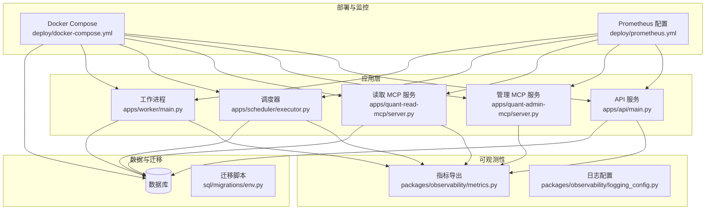
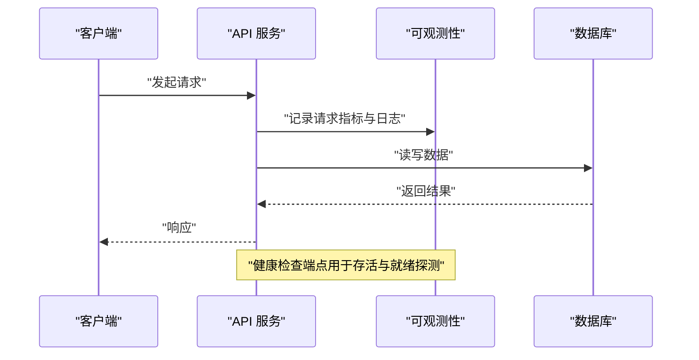
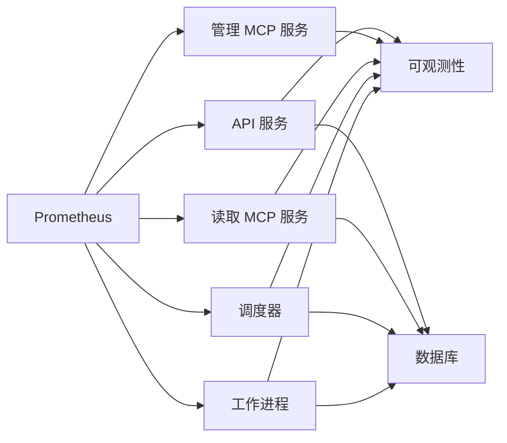

# 故障排查

<cite>
**本文引用的文件**   
- [README.md](file://README.md)
- [pyproject.toml](file://pyproject.toml)
- [alembic.ini](file://alembic.ini)
- [deploy/docker-compose.yml](file://deploy/docker-compose.yml)
- [deploy/prometheus.yml](file://deploy/prometheus.yml)
- [apps/api/main.py](file://apps/api/main.py)
- [apps/api/deps.py](file://apps/api/deps.py)
- [apps/quant-admin-mcp/server.py](file://apps/quant-admin-mcp/server.py)
- [apps/quant-read-mcp/server.py](file://apps/quant-read-mcp/server.py)
- [apps/scheduler/executor.py](file://apps/scheduler/executor.py)
- [apps/scheduler/schedule.py](file://apps/scheduler/schedule.py)
- [apps/worker/main.py](file://apps/worker/main.py)
- [apps/worker/tasks.py](file://apps/worker/tasks.py)
- [packages/observability/metrics.py](file://packages/observability/metrics.py)
- [packages/observability/logging_config.py](file://packages/observability/logging_config.py)
- [sql/migrations/env.py](file://sql/migrations/env.py)
- [tests/unit/test_api_health.py](file://tests/unit/test_api_health.py)
- [tests/unit/test_scheduler.py](file://tests/unit/test_scheduler.py)
- [tests/unit/test_worker_tasks.py](file://tests/unit/test_worker_tasks.py)
</cite>

## 目录
1. [简介](#简介)
2. [项目结构](#项目结构)
3. [核心组件](#核心组件)
4. [架构总览](#架构总览)
5. [详细组件分析](#详细组件分析)
6. [依赖关系分析](#依赖关系分析)
7. [性能考虑](#性能考虑)
8. [故障排查指南](#故障排查指南)
9. [结论](#结论)
10. [附录](#附录)

## 简介
本故障排查文档面向量化交易MCP系统的生产与研发运维人员，聚焦以下目标：
- 常见问题定位与解决步骤
- 调试技巧与远程诊断方法
- 日志分析方法、错误码含义与异常堆栈解读
- 系统监控指标分析与性能瓶颈定位
- 资源使用优化建议
- 典型故障案例与应急响应流程

## 项目结构
系统采用多应用（API、MCP服务、调度器、工作进程）与可观测性包分离的模块化设计。部署通过容器编排，监控由Prometheus采集。

图示来源
- [apps/api/main.py](file://apps/api/main.py)
- [apps/quant-admin-mcp/server.py](file://apps/quant-admin-mcp/server.py)
- [apps/quant-read-mcp/server.py](file://apps/quant-read-mcp/server.py)
- [apps/scheduler/executor.py](file://apps/scheduler/executor.py)
- [apps/worker/main.py](file://apps/worker/main.py)
- [packages/observability/metrics.py](file://packages/observability/metrics.py)
- [packages/observability/logging_config.py](file://packages/observability/logging_config.py)
- [deploy/docker-compose.yml](file://deploy/docker-compose.yml)
- [deploy/prometheus.yml](file://deploy/prometheus.yml)
- [sql/migrations/env.py](file://sql/migrations/env.py)

章节来源
- [README.md](file://README.md)
- [pyproject.toml](file://pyproject.toml)
- [deploy/docker-compose.yml](file://deploy/docker-compose.yml)
- [deploy/prometheus.yml](file://deploy/prometheus.yml)

## 核心组件
- API 服务：提供HTTP接口与健康检查端点，集成依赖注入与可观测性。
- MCP 服务（管理与读取）：对外暴露工具能力，内部复用数据访问与可观测性。
- 调度器：负责任务计划与执行协调。
- 工作进程：异步执行耗时任务，具备重试与失败处理逻辑。
- 可观测性：统一指标导出与日志配置，支撑监控与排障。
- 数据库迁移：基于Alembic的版本化管理。

章节来源
- [apps/api/main.py](file://apps/api/main.py)
- [apps/api/deps.py](file://apps/api/deps.py)
- [apps/quant-admin-mcp/server.py](file://apps/quant-admin-mcp/server.py)
- [apps/quant-read-mcp/server.py](file://apps/quant-read-mcp/server.py)
- [apps/scheduler/executor.py](file://apps/scheduler/executor.py)
- [apps/worker/tasks.py](file://apps/worker/tasks.py)
- [packages/observability/metrics.py](file://packages/observability/metrics.py)
- [packages/observability/logging_config.py](file://packages/observability/logging_config.py)
- [alembic.ini](file://alembic.ini)
- [sql/migrations/env.py](file://sql/migrations/env.py)

## 架构总览
从请求到落库的关键路径：客户端调用API或MCP服务，服务层进行鉴权与参数校验，随后访问数据层；调度与工作进程在后台执行批处理与计算任务；所有组件均上报指标与结构化日志至集中式收集系统。

图示来源
- [apps/api/main.py](file://apps/api/main.py)
- [packages/observability/metrics.py](file://packages/observability/metrics.py)
- [packages/observability/logging_config.py](file://packages/observability/logging_config.py)

## 详细组件分析

### API 服务
- 职责：路由注册、依赖注入、中间件（如可观测性）、健康检查端点。
- 关键问题：
  - 健康检查失败：检查依赖注入初始化、数据库连接、端口占用。
  - 请求超时：关注下游依赖延迟、连接池耗尽、线程/协程阻塞。
  - 指标缺失：确认指标导出是否启用、Prometheus抓取配置是否正确。
- 调试要点：
  - 查看健康检查端点返回状态与详情。
  - 结合请求ID追踪链路日志。
  - 核对依赖初始化顺序与异常捕获。

章节来源
- [apps/api/main.py](file://apps/api/main.py)
- [apps/api/deps.py](file://apps/api/deps.py)
- [tests/unit/test_api_health.py](file://tests/unit/test_api_health.py)

### MCP 服务（管理与读取）
- 职责：暴露工具能力，封装业务逻辑与数据访问。
- 关键问题：
  - 工具调用失败：检查输入校验、权限控制、后端依赖可用性。
  - 并发冲突：注意共享资源锁与事务隔离级别。
  - 指标不更新：确认工具入口是否埋点。
- 调试要点：
  - 开启详细日志并关联上下文。
  - 复现最小用例，逐步缩小范围。

章节来源
- [apps/quant-admin-mcp/server.py](file://apps/quant-admin-mcp/server.py)
- [apps/quant-read-mcp/server.py](file://apps/quant-read-mcp/server.py)
- [packages/observability/metrics.py](file://packages/observability/metrics.py)

### 调度器
- 职责：任务计划、触发与执行协调。
- 关键问题：
  - 任务未触发：检查调度表达式、时区设置、依赖服务状态。
  - 任务堆积：评估执行时长、并行度、消费者数量。
  - 重复执行：幂等性与去重策略是否生效。
- 调试要点：
  - 查看最近触发记录与执行历史。
  - 对比预期时间窗口与实际时间戳。

章节来源
- [apps/scheduler/executor.py](file://apps/scheduler/executor.py)
- [apps/scheduler/schedule.py](file://apps/scheduler/schedule.py)
- [tests/unit/test_scheduler.py](file://tests/unit/test_scheduler.py)

### 工作进程
- 职责：异步执行耗时任务，支持重试与失败处理。
- 关键问题：
  - 任务失败：检查重试退避、死信队列、错误分类。
  - 内存泄漏：关注大对象引用、缓存清理、连接释放。
  - 吞吐不足：调整并发度、批大小、I/O模型。
- 调试要点：
  - 按任务ID检索完整生命周期日志。
  - 分析失败原因分布与热点。

章节来源
- [apps/worker/main.py](file://apps/worker/main.py)
- [apps/worker/tasks.py](file://apps/worker/tasks.py)
- [tests/unit/test_worker_tasks.py](file://tests/unit/test_worker_tasks.py)

### 可观测性（指标与日志）
- 指标：
  - 请求量、延迟分位、错误率、下游依赖延迟、队列长度、GC停顿等。
  - 确保各服务暴露统一命名规范与标签维度。
- 日志：
  - 结构化字段包含请求ID、用户ID、操作类型、耗时、状态码、错误码。
  - 分级输出（INFO/WARN/ERROR），避免敏感信息泄露。
- 调试要点：
  - 通过指标快速定位异常时段与热点服务。
  - 使用日志聚合平台进行跨服务链路追踪。

章节来源
- [packages/observability/metrics.py](file://packages/observability/metrics.py)
- [packages/observability/logging_config.py](file://packages/observability/logging_config.py)
- [deploy/prometheus.yml](file://deploy/prometheus.yml)

### 数据库与迁移
- 职责：数据持久化与版本演进。
- 关键问题：
  - 迁移失败：检查环境配置、目标库权限、回滚策略。
  - 连接池耗尽：监控活跃连接、最大连接数、慢查询。
  - 数据不一致：核对幂等写入与补偿机制。
- 调试要点：
  - 查看迁移历史与当前版本。
  - 对慢查询进行EXPLAIN与索引优化。

章节来源
- [alembic.ini](file://alembic.ini)
- [sql/migrations/env.py](file://sql/migrations/env.py)

## 依赖关系分析
- 组件耦合：
  - API/MCP服务依赖可观测性与数据层。
  - 调度器与工作进程依赖数据层与消息/任务存储。
- 外部依赖：
  - 数据库、Prometheus、容器编排平台。
- 潜在环依赖：
  - 避免服务间互相强依赖，优先通过事件或消息解耦。

图示来源
- [apps/api/main.py](file://apps/api/main.py)
- [apps/quant-admin-mcp/server.py](file://apps/quant-admin-mcp/server.py)
- [apps/quant-read-mcp/server.py](file://apps/quant-read-mcp/server.py)
- [apps/scheduler/executor.py](file://apps/scheduler/executor.py)
- [apps/worker/main.py](file://apps/worker/main.py)
- [packages/observability/metrics.py](file://packages/observability/metrics.py)
- [deploy/prometheus.yml](file://deploy/prometheus.yml)

章节来源
- [deploy/docker-compose.yml](file://deploy/docker-compose.yml)
- [deploy/prometheus.yml](file://deploy/prometheus.yml)

## 性能考虑
- 指标驱动优化：
  - 以P95/P99延迟、错误率、CPU/内存使用为基准，识别热点。
- I/O与连接：
  - 合理设置连接池大小、超时与重试策略。
- 并发与批处理：
  - 根据CPU与I/O特性调整并发度与批大小。
- 缓存与去重：
  - 引入本地/分布式缓存，减少重复计算与IO。
- 慢查询治理：
  - 定期审查慢查询日志，完善索引与SQL改写。

## 故障排查指南

### 日志分析方法
- 关键字段：
  - 请求ID、用户ID、操作类型、耗时、状态码、错误码、堆栈摘要。
- 分层过滤：
  - 先按服务与时间窗口筛选，再按请求ID串联链路。
- 常见模式：
  - 上游超时导致级联失败；连接池耗尽引发大量拒绝；重试风暴放大负载。

章节来源
- [packages/observability/logging_config.py](file://packages/observability/logging_config.py)
- [packages/observability/metrics.py](file://packages/observability/metrics.py)

### 错误码含义与异常堆栈解读
- 错误码分类：
  - 客户端错误（参数校验失败、权限不足）。
  - 服务端错误（内部异常、依赖不可用）。
  - 资源错误（连接池耗尽、磁盘空间不足）。
- 堆栈解读：
  - 关注最外层异常类型与消息，定位首次抛出位置。
  - 结合上下文字段判断是否为偶发或系统性问题。

章节来源
- [apps/api/main.py](file://apps/api/main.py)
- [apps/worker/tasks.py](file://apps/worker/tasks.py)

### 系统监控指标分析
- 关键指标：
  - 请求量、延迟分位、错误率、下游依赖延迟、队列长度、GC停顿、CPU/内存。
- 告警阈值：
  - 错误率突增、延迟飙升、队列积压、资源饱和。
- 根因定位：
  - 通过指标相关性分析锁定瓶颈服务或资源。

章节来源
- [packages/observability/metrics.py](file://packages/observability/metrics.py)
- [deploy/prometheus.yml](file://deploy/prometheus.yml)

### 性能瓶颈定位
- 步骤：
  - 从端到端延迟分解入手，识别慢环节。
  - 检查连接池、线程/协程池、缓存命中率。
  - 分析慢查询与索引命中情况。
- 验证：
  - 压测回归，观察指标改善幅度。

章节来源
- [apps/scheduler/executor.py](file://apps/scheduler/executor.py)
- [apps/worker/tasks.py](file://apps/worker/tasks.py)

### 资源使用优化
- 连接与超时：
  - 调优连接池上限、空闲回收、超时退避。
- 并发与批大小：
  - 依据硬件与依赖能力调整并发度与批大小。
- 内存与GC：
  - 减少大对象驻留，及时释放引用，监控GC停顿。

章节来源
- [apps/api/deps.py](file://apps/api/deps.py)
- [packages/observability/metrics.py](file://packages/observability/metrics.py)

### 调试工具与远程诊断
- 本地调试：
  - 启动单服务，注入测试数据，断点跟踪关键路径。
- 远程诊断：
  - 通过日志聚合平台检索请求ID，拉取全链路日志。
  - 使用指标面板对比基线，定位异常时段。
- 安全注意事项：
  - 脱敏敏感字段，限制访问权限。

章节来源
- [packages/observability/logging_config.py](file://packages/observability/logging_config.py)
- [deploy/prometheus.yml](file://deploy/prometheus.yml)

### 生产环境问题排查与应急响应
- 快速止血：
  - 降级非关键功能、扩容实例、限流熔断。
- 根因分析：
  - 基于指标与日志定位，必要时回滚变更。
- 复盘改进：
  - 补充监控与告警，完善预案与演练。

章节来源
- [apps/api/main.py](file://apps/api/main.py)
- [apps/worker/tasks.py](file://apps/worker/tasks.py)

### 具体故障案例与解决步骤

#### 案例一：健康检查失败
- 现象：
  - 健康检查端点返回非成功状态，服务被摘除。
- 可能原因：
  - 依赖初始化失败、数据库不可达、端口冲突。
- 排查步骤：
  - 检查健康检查端点返回详情。
  - 验证数据库连接与权限。
  - 确认端口未被占用且防火墙放行。
- 解决措施：
  - 修复依赖初始化顺序与配置，重启服务。

章节来源
- [apps/api/main.py](file://apps/api/main.py)
- [tests/unit/test_api_health.py](file://tests/unit/test_api_health.py)

#### 案例二：任务未触发
- 现象：
  - 调度器未在预期时间触发任务。
- 可能原因：
  - 调度表达式错误、时区不一致、依赖服务不可用。
- 排查步骤：
  - 核对调度表达式与时区配置。
  - 查看最近触发记录与依赖状态。
- 解决措施：
  - 修正表达式与时区，恢复依赖后重新触发。

章节来源
- [apps/scheduler/executor.py](file://apps/scheduler/executor.py)
- [apps/scheduler/schedule.py](file://apps/scheduler/schedule.py)
- [tests/unit/test_scheduler.py](file://tests/unit/test_scheduler.py)

#### 案例三：工作进程任务失败
- 现象：
  - 任务多次重试仍失败，出现错误堆积。
- 可能原因：
  - 下游依赖不稳定、幂等性缺失、资源不足。
- 排查步骤：
  - 按任务ID检索失败日志与堆栈。
  - 检查重试退避与死信队列。
- 解决措施：
  - 增强幂等与补偿逻辑，扩容资源，优化重试策略。

章节来源
- [apps/worker/tasks.py](file://apps/worker/tasks.py)
- [tests/unit/test_worker_tasks.py](file://tests/unit/test_worker_tasks.py)

#### 案例四：指标缺失
- 现象：
  - Prometheus无法抓取服务指标。
- 可能原因：
  - 指标导出未启用、端口未暴露、抓取配置错误。
- 排查步骤：
  - 检查服务是否暴露指标端点。
  - 核对Prometheus抓取配置与网络连通性。
- 解决措施：
  - 启用指标导出，修正抓取配置，重启相关组件。

章节来源
- [packages/observability/metrics.py](file://packages/observability/metrics.py)
- [deploy/prometheus.yml](file://deploy/prometheus.yml)

#### 案例五：迁移失败
- 现象：
  - 数据库迁移执行失败，版本不一致。
- 可能原因：
  - 环境配置错误、目标库权限不足、回滚策略不当。
- 排查步骤：
  - 查看迁移历史与当前版本。
  - 检查迁移脚本与依赖表结构。
- 解决措施：
  - 修正配置与权限，必要时手动回滚并修复脚本后重试。

章节来源
- [alembic.ini](file://alembic.ini)
- [sql/migrations/env.py](file://sql/migrations/env.py)

## 结论
通过统一的指标与日志体系、清晰的组件边界与依赖关系，以及标准化的排查流程，能够快速定位并解决量化交易MCP系统中的各类问题。建议持续完善监控覆盖、强化幂等与容错设计，并通过演练提升应急响应效率。

## 附录

### 常用命令与路径参考
- 查看服务日志：
  - 使用日志聚合平台，按服务名与时间窗口检索。
- 检查健康状态：
  - 访问健康检查端点，确认返回状态与详情。
- 验证指标抓取：
  - 在Prometheus中查询对应指标名称与标签。

章节来源
- [apps/api/main.py](file://apps/api/main.py)
- [packages/observability/metrics.py](file://packages/observability/metrics.py)
- [deploy/prometheus.yml](file://deploy/prometheus.yml)