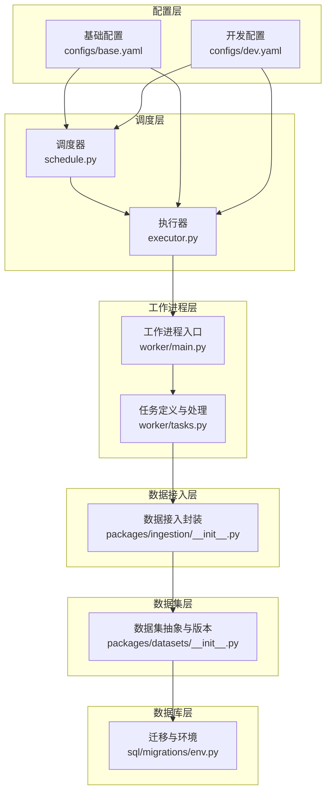
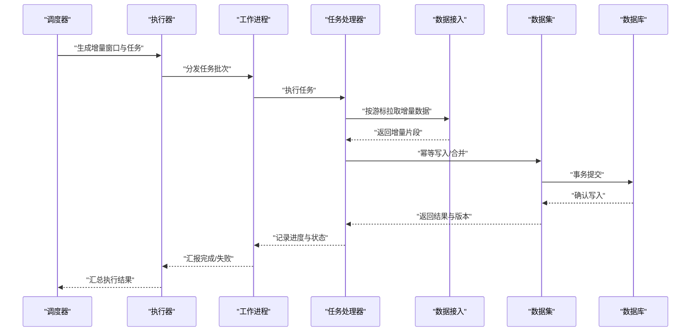
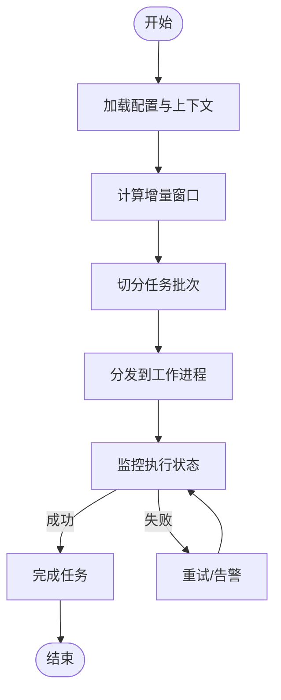
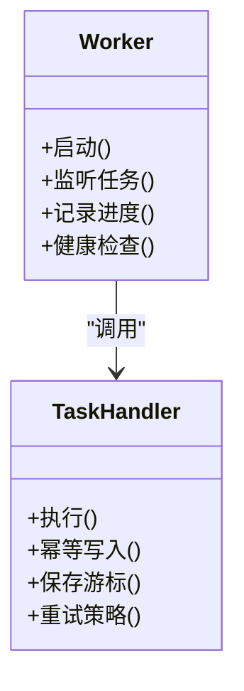
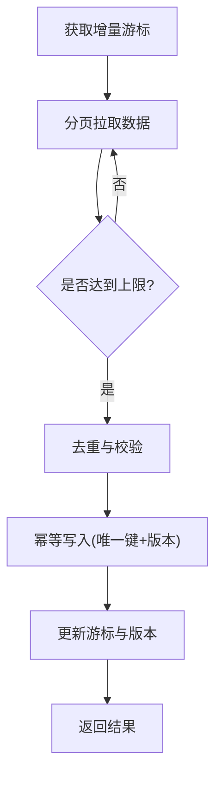
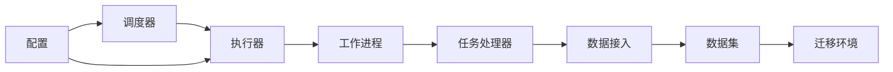

# 增量更新机制

<cite>
**本文引用的文件**   
- [apps/scheduler/executor.py](file://apps/scheduler/executor.py)
- [apps/scheduler/schedule.py](file://apps/scheduler/schedule.py)
- [apps/worker/main.py](file://apps/worker/main.py)
- [apps/worker/tasks.py](file://apps/worker/tasks.py)
- [packages/ingestion/__init__.py](file://packages/ingestion/__init__.py)
- [packages/datasets/__init__.py](file://packages/datasets/__init__.py)
- [configs/base.yaml](file://configs/base.yaml)
- [configs/dev.yaml](file://configs/dev.yaml)
- [sql/migrations/env.py](file://sql/migrations/env.py)
</cite>

## 目录
1. [简介](#简介)
2. [项目结构](#项目结构)
3. [核心组件](#核心组件)
4. [架构总览](#架构总览)
5. [详细组件分析](#详细组件分析)
6. [依赖关系分析](#依赖关系分析)
7. [性能考虑](#性能考虑)
8. [故障排查指南](#故障排查指南)
9. [结论](#结论)
10. [附录](#附录)

## 简介
本技术文档围绕“增量更新机制”展开，聚焦于以下目标：
- 增量数据的识别与获取策略
- 断点续传与幂等性保证
- 数据版本管理与冲突解决
- 触发条件与调度策略
- 最佳实践与性能优化建议
- 配置示例与故障恢复方案
- 与调度器和工作进程的协作关系

该机制贯穿数据采集、转换、落库与消费的全链路，确保在大规模多源异构数据场景下具备高可靠、可观测、可扩展的增量能力。

## 项目结构
本项目采用分层与模块化组织方式，增量更新相关的关键路径位于如下模块：
- 调度层：负责任务编排、触发与执行控制
- 工作进程层：负责任务执行、重试与状态持久化
- 数据接入层：负责从数据源拉取增量数据、去重与幂等写入
- 数据集层：提供统一的数据访问接口与版本管理
- 配置层：集中管理增量策略、批大小、超时、并发等参数
- 数据库迁移层：维护元数据表结构与版本演进

图表来源
- [apps/scheduler/schedule.py](file://apps/scheduler/schedule.py)
- [apps/scheduler/executor.py](file://apps/scheduler/executor.py)
- [apps/worker/main.py](file://apps/worker/main.py)
- [apps/worker/tasks.py](file://apps/worker/tasks.py)
- [packages/ingestion/__init__.py](file://packages/ingestion/__init__.py)
- [packages/datasets/__init__.py](file://packages/datasets/__init__.py)
- [configs/base.yaml](file://configs/base.yaml)
- [configs/dev.yaml](file://configs/dev.yaml)
- [sql/migrations/env.py](file://sql/migrations/env.py)

章节来源
- [apps/scheduler/schedule.py](file://apps/scheduler/schedule.py)
- [apps/scheduler/executor.py](file://apps/scheduler/executor.py)
- [apps/worker/main.py](file://apps/worker/main.py)
- [apps/worker/tasks.py](file://apps/worker/tasks.py)
- [packages/ingestion/__init__.py](file://packages/ingestion/__init__.py)
- [packages/datasets/__init__.py](file://packages/datasets/__init__.py)
- [configs/base.yaml](file://configs/base.yaml)
- [configs/dev.yaml](file://configs/dev.yaml)
- [sql/migrations/env.py](file://sql/migrations/env.py)

## 核心组件
- 调度器（schedule）：定义任务周期、窗口与依赖关系，计算待执行的增量时间窗。
- 执行器（executor）：将调度结果转化为具体任务实例，协调工作进程执行并跟踪状态。
- 工作进程（worker）：接收任务、执行数据处理流程、记录进度与失败重试。
- 任务（tasks）：封装增量拉取、转换、校验、落库等步骤，实现幂等与断点续传。
- 数据接入（ingestion）：对接外部数据源，支持增量游标、分页、速率限制与错误重试。
- 数据集（datasets）：提供统一的读写接口、版本标记与冲突检测。
- 配置（configs）：集中管理增量策略、批大小、超时、并发、重试次数等。
- 迁移（migrations）：维护元数据表结构，支撑版本演进与一致性检查。

章节来源
- [apps/scheduler/schedule.py](file://apps/scheduler/schedule.py)
- [apps/scheduler/executor.py](file://apps/scheduler/executor.py)
- [apps/worker/main.py](file://apps/worker/main.py)
- [apps/worker/tasks.py](file://apps/worker/tasks.py)
- [packages/ingestion/__init__.py](file://packages/ingestion/__init__.py)
- [packages/datasets/__init__.py](file://packages/datasets/__init__.py)
- [configs/base.yaml](file://configs/base.yaml)
- [configs/dev.yaml](file://configs/dev.yaml)
- [sql/migrations/env.py](file://sql/migrations/env.py)

## 架构总览
增量更新的端到端流程如下：
- 调度器根据配置与当前系统时间计算增量窗口（如最近N分钟或小时）。
- 执行器将窗口切分为任务批次，提交至工作进程队列。
- 工作进程按任务顺序执行，调用数据接入层拉取增量数据。
- 数据接入层使用游标/偏移量进行增量读取，避免重复拉取。
- 数据集层对数据进行幂等写入，基于唯一键与版本号合并。
- 迁移层保障元数据一致性与向后兼容。

图表来源
- [apps/scheduler/schedule.py](file://apps/scheduler/schedule.py)
- [apps/scheduler/executor.py](file://apps/scheduler/executor.py)
- [apps/worker/main.py](file://apps/worker/main.py)
- [apps/worker/tasks.py](file://apps/worker/tasks.py)
- [packages/ingestion/__init__.py](file://packages/ingestion/__init__.py)
- [packages/datasets/__init__.py](file://packages/datasets/__init__.py)
- [sql/migrations/env.py](file://sql/migrations/env.py)

## 详细组件分析

### 调度器与执行器
- 调度器负责：
  - 解析配置中的周期与窗口规则
  - 计算待处理的增量时间范围
  - 生成任务描述（包含时间窗、资源配额、优先级）
- 执行器负责：
  - 将任务描述转换为可执行单元
  - 管理工作进程生命周期与任务分配
  - 收集执行结果与异常信息

图表来源
- [apps/scheduler/schedule.py](file://apps/scheduler/schedule.py)
- [apps/scheduler/executor.py](file://apps/scheduler/executor.py)

章节来源
- [apps/scheduler/schedule.py](file://apps/scheduler/schedule.py)
- [apps/scheduler/executor.py](file://apps/scheduler/executor.py)

### 工作进程与任务
- 工作进程：
  - 启动时加载配置与连接池
  - 监听任务队列，按优先级执行
  - 记录心跳与进度，支持中断恢复
- 任务处理器：
  - 实现幂等写入逻辑（基于唯一键与版本）
  - 支持断点续传（保存已处理的最大游标）
  - 错误分类与重试策略（网络错误、数据不一致、业务校验失败）

图表来源
- [apps/worker/main.py](file://apps/worker/main.py)
- [apps/worker/tasks.py](file://apps/worker/tasks.py)

章节来源
- [apps/worker/main.py](file://apps/worker/main.py)
- [apps/worker/tasks.py](file://apps/worker/tasks.py)

### 数据接入与数据集
- 数据接入：
  - 支持增量游标（时间戳、序列号、偏移量）
  - 分页拉取与速率限制
  - 错误重试与退避策略
- 数据集：
  - 提供统一读写接口
  - 版本标记与冲突检测
  - 批量写入与事务边界

图表来源
- [packages/ingestion/__init__.py](file://packages/ingestion/__init__.py)
- [packages/datasets/__init__.py](file://packages/datasets/__init__.py)

章节来源
- [packages/ingestion/__init__.py](file://packages/ingestion/__init__.py)
- [packages/datasets/__init__.py](file://packages/datasets/__init__.py)

### 配置与迁移
- 配置：
  - 增量窗口大小、批大小、超时、并发度
  - 重试次数、退避策略、告警阈值
- 迁移：
  - 元数据表结构演进
  - 版本兼容性检查与回滚策略

章节来源
- [configs/base.yaml](file://configs/base.yaml)
- [configs/dev.yaml](file://configs/dev.yaml)
- [sql/migrations/env.py](file://sql/migrations/env.py)

## 依赖关系分析
- 调度器依赖配置与执行器
- 执行器依赖工作进程与任务处理器
- 任务处理器依赖数据接入与数据集
- 数据集依赖数据库与迁移环境
- 配置影响所有层级行为

图表来源
- [apps/scheduler/schedule.py](file://apps/scheduler/schedule.py)
- [apps/scheduler/executor.py](file://apps/scheduler/executor.py)
- [apps/worker/main.py](file://apps/worker/main.py)
- [apps/worker/tasks.py](file://apps/worker/tasks.py)
- [packages/ingestion/__init__.py](file://packages/ingestion/__init__.py)
- [packages/datasets/__init__.py](file://packages/datasets/__init__.py)
- [sql/migrations/env.py](file://sql/migrations/env.py)
- [configs/base.yaml](file://configs/base.yaml)
- [configs/dev.yaml](file://configs/dev.yaml)

章节来源
- [apps/scheduler/schedule.py](file://apps/scheduler/schedule.py)
- [apps/scheduler/executor.py](file://apps/scheduler/executor.py)
- [apps/worker/main.py](file://apps/worker/main.py)
- [apps/worker/tasks.py](file://apps/worker/tasks.py)
- [packages/ingestion/__init__.py](file://packages/ingestion/__init__.py)
- [packages/datasets/__init__.py](file://packages/datasets/__init__.py)
- [sql/migrations/env.py](file://sql/migrations/env.py)
- [configs/base.yaml](file://configs/base.yaml)
- [configs/dev.yaml](file://configs/dev.yaml)

## 性能考虑
- 批大小与并发度调优：根据数据源吞吐与下游写入能力平衡批大小与并发数
- 游标粒度：尽量使用细粒度游标减少重复拉取与内存占用
- 幂等写入：利用唯一键与版本字段避免重复写入与锁竞争
- 错误重试：指数退避与最大重试次数防止雪崩
- 监控与指标：记录拉取耗时、写入延迟、失败率与游标推进速度

[本节为通用指导，不直接分析具体文件]

## 故障排查指南
- 常见问题定位：
  - 调度未触发：检查配置周期与系统时钟同步
  - 任务堆积：检查工作进程数量与批大小设置
  - 游标停滞：检查数据接入层拉取逻辑与上游可用性
  - 写入失败：检查幂等键冲突与事务回滚日志
- 恢复策略：
  - 重置游标到最近成功位置
  - 清理未完成的任务状态
  - 重新运行历史窗口任务

章节来源
- [apps/scheduler/executor.py](file://apps/scheduler/executor.py)
- [apps/worker/tasks.py](file://apps/worker/tasks.py)
- [packages/ingestion/__init__.py](file://packages/ingestion/__init__.py)
- [packages/datasets/__init__.py](file://packages/datasets/__init__.py)

## 结论
本增量更新机制通过调度器与工作进程的协作，结合数据接入与数据集层的幂等写入与版本管理，实现了高可靠的增量数据处理。合理的配置与监控能够显著提升系统的稳定性与性能。建议在上线前充分压测并建立完善的告警与回滚策略。

[本节为总结性内容，不直接分析具体文件]

## 附录
- 配置示例要点：
  - 增量窗口大小与批大小
  - 重试次数与退避策略
  - 并发度与超时设置
- 最佳实践：
  - 使用唯一键与版本字段保证幂等
  - 细粒度游标与分页拉取
  - 监控关键指标与自动扩缩容

章节来源
- [configs/base.yaml](file://configs/base.yaml)
- [configs/dev.yaml](file://configs/dev.yaml)