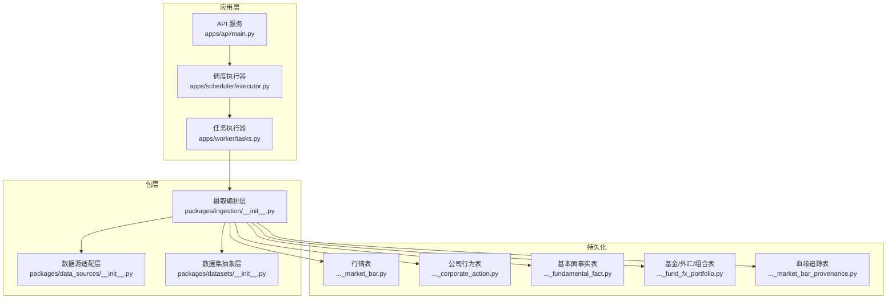
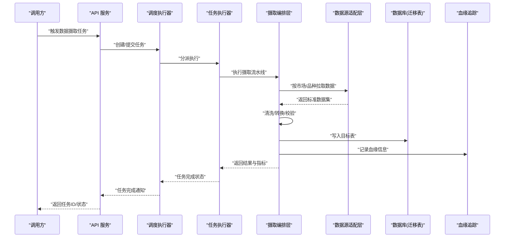
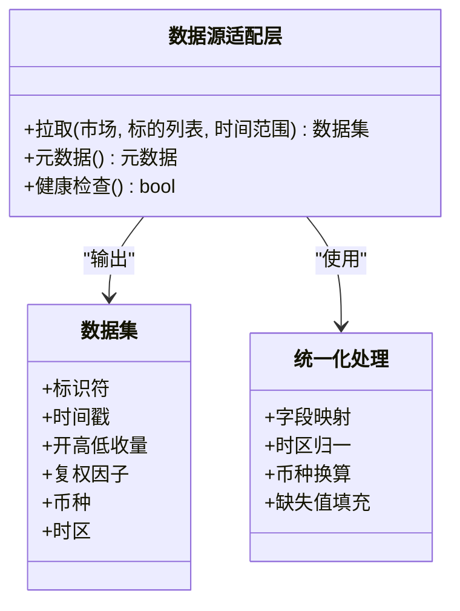
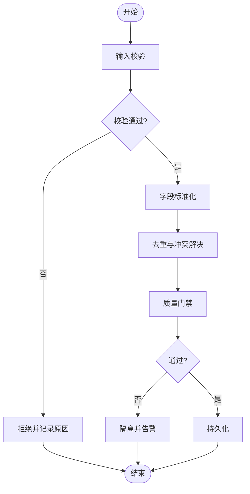
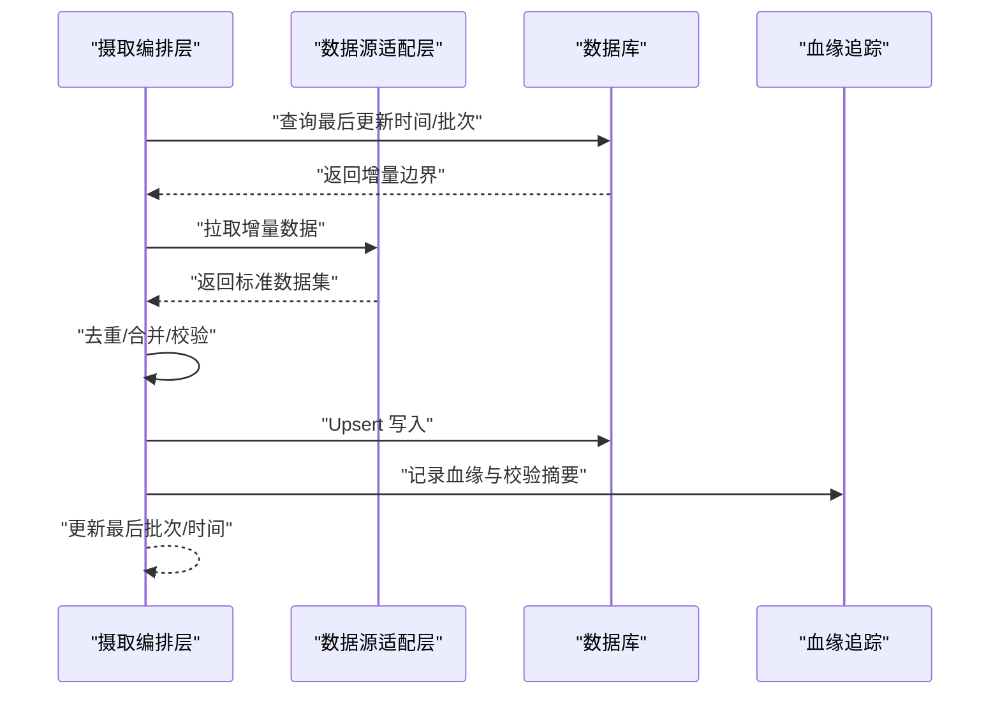
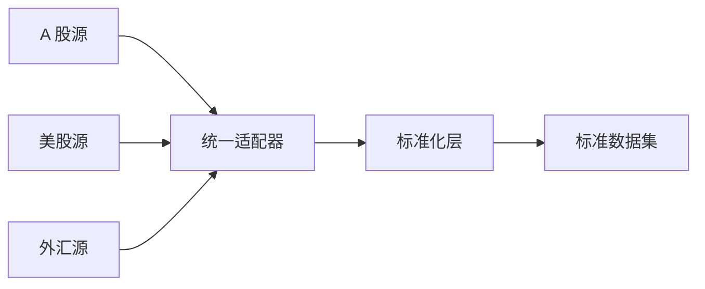
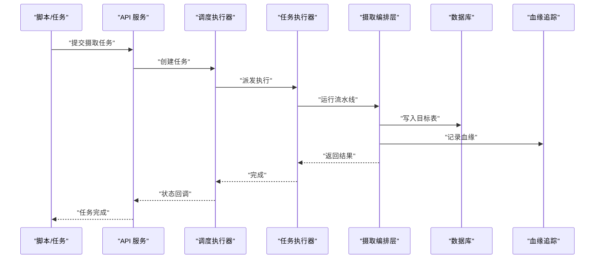
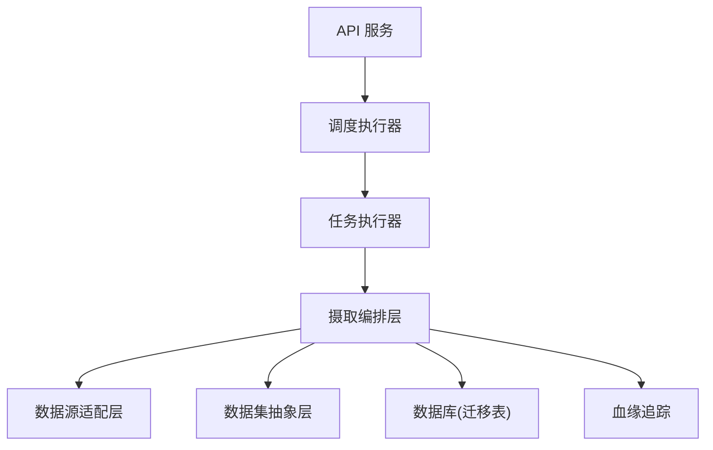

# 数据处理管道

<cite>
**本文引用的文件**   
- [apps/api/main.py](file://apps/api/main.py)
- [apps/worker/tasks.py](file://apps/worker/tasks.py)
- [apps/scheduler/executor.py](file://apps/scheduler/executor.py)
- [packages/data_sources/__init__.py](file://packages/data_sources/__init__.py)
- [packages/datasets/__init__.py](file://packages/datasets/__init__.py)
- [packages/ingestion/__init__.py](file://packages/ingestion/__init__.py)
- [scripts/ingest_real_data.py](file://scripts/ingest_real_data.py)
- [sql/migrations/20260715_0003_market_bar.py](file://sql/migrations/20260715_0003_market_bar.py)
- [sql/migrations/20260715_0004_corporate_action.py](file://sql/migrations/20260715_0004_corporate_action.py)
- [sql/migrations/20260715_0005_fundamental_fact.py](file://sql/migrations/20260715_0005_fundamental_fact.py)
- [sql/migrations/20260715_0006_fund_fx_portfolio.py](file://sql/migrations/20260715_0006_fund_fx_portfolio.py)
- [sql/migrations/20260715_0007_market_bar_provenance.py](file://sql/migrations/20260715_0007_market_bar_provenance.py)
- [tests/unit/test_ingestion.py](file://tests/unit/test_ingestion.py)
- [tests/unit/test_ingestion_sql_sink.py](file://tests/unit/test_ingestion_sql_sink.py)
- [tests/unit/test_live_adapters.py](file://tests/unit/test_live_adapters.py)
- [tests/unit/test_cross_market_scenarios.py](file://tests/unit/test_cross_market_scenarios.py)
</cite>

## 目录
1. [简介](#简介)
2. [项目结构](#项目结构)
3. [核心组件](#核心组件)
4. [架构总览](#架构总览)
5. [详细组件分析](#详细组件分析)
6. [依赖关系分析](#依赖关系分析)
7. [性能考虑](#性能考虑)
8. [故障排查指南](#故障排查指南)
9. [结论](#结论)
10. [附录](#附录)

## 简介
本技术文档围绕“数据处理管道”展开，聚焦数据适配器架构、数据清洗流程与增量更新机制，解释多源数据（A股、美股、外汇）的统一接入方式，并记录数据标准化、验证与质量控制流程。文档覆盖从数据摄取、转换到存储的完整工作流，提供使用模式与集成说明，同时给出常见问题定位方法与性能优化策略。

## 项目结构
仓库采用应用层与包层分离的组织方式：
- 应用层 apps：API、调度器、Worker、MCP 工具等
- 包层 packages：数据源、数据集、摄取、质量、因子、模型等可复用模块
- SQL 迁移 sql/migrations：数据库表结构与血缘追踪定义
- 脚本 scripts：批量任务与端到端示例
- 测试 tests：单元与集成用例，覆盖摄取、SQL Sink、跨市场场景等

图表来源
- [apps/api/main.py](file://apps/api/main.py)
- [apps/scheduler/executor.py](file://apps/scheduler/executor.py)
- [apps/worker/tasks.py](file://apps/worker/tasks.py)
- [packages/data_sources/__init__.py](file://packages/data_sources/__init__.py)
- [packages/datasets/__init__.py](file://packages/datasets/__init__.py)
- [packages/ingestion/__init__.py](file://packages/ingestion/__init__.py)
- [sql/migrations/20260715_0003_market_bar.py](file://sql/migrations/20260715_0003_market_bar.py)
- [sql/migrations/20260715_0004_corporate_action.py](file://sql/migrations/20260715_0004_corporate_action.py)
- [sql/migrations/20260715_0005_fundamental_fact.py](file://sql/migrations/20260715_0005_fundamental_fact.py)
- [sql/migrations/20260715_0006_fund_fx_portfolio.py](file://sql/migrations/20260715_0006_fund_fx_portfolio.py)
- [sql/migrations/20260715_0007_market_bar_provenance.py](file://sql/migrations/20260715_0007_market_bar_provenance.py)

章节来源
- [apps/api/main.py](file://apps/api/main.py)
- [apps/scheduler/executor.py](file://apps/scheduler/executor.py)
- [apps/worker/tasks.py](file://apps/worker/tasks.py)
- [packages/data_sources/__init__.py](file://packages/data_sources/__init__.py)
- [packages/datasets/__init__.py](file://packages/datasets/__init__.py)
- [packages/ingestion/__init__.py](file://packages/ingestion/__init__.py)
- [sql/migrations/20260715_0003_market_bar.py](file://sql/migrations/20260715_0003_market_bar.py)
- [sql/migrations/20260715_0004_corporate_action.py](file://sql/migrations/20260715_0004_corporate_action.py)
- [sql/migrations/20260715_0005_fundamental_fact.py](file://sql/migrations/20260715_0005_fundamental_fact.py)
- [sql/migrations/20260715_0006_fund_fx_portfolio.py](file://sql/migrations/20260715_0006_fund_fx_portfolio.py)
- [sql/migrations/20260715_0007_market_bar_provenance.py](file://sql/migrations/20260715_0007_market_bar_provenance.py)

## 核心组件
- 数据源适配层：统一封装 A 股、美股、外汇等多源接口，屏蔽差异，输出标准数据集对象。
- 数据集抽象层：定义统一的行/列语义、时间戳与时区、币种与单位、标识符规范等。
- 摄取编排层：负责拉取、去重、校验、转换、落库与血缘记录，支持增量更新。
- 调度与执行：API 触发、定时调度、任务分发与重试。
- 持久化与血缘：基于 Alembic 迁移的表结构，包含行情、公司行为、基本面事实、基金/外汇/组合及血缘追踪表。

章节来源
- [packages/data_sources/__init__.py](file://packages/data_sources/__init__.py)
- [packages/datasets/__init__.py](file://packages/datasets/__init__.py)
- [packages/ingestion/__init__.py](file://packages/ingestion/__init__.py)
- [apps/scheduler/executor.py](file://apps/scheduler/executor.py)
- [apps/worker/tasks.py](file://apps/worker/tasks.py)
- [sql/migrations/20260715_0003_market_bar.py](file://sql/migrations/20260715_0003_market_bar.py)
- [sql/migrations/20260715_0004_corporate_action.py](file://sql/migrations/20260715_0004_corporate_action.py)
- [sql/migrations/20260715_0005_fundamental_fact.py](file://sql/migrations/20260715_0005_fundamental_fact.py)
- [sql/migrations/20260715_0006_fund_fx_portfolio.py](file://sql/migrations/20260715_0006_fund_fx_portfolio.py)
- [sql/migrations/20260715_0007_market_bar_provenance.py](file://sql/migrations/20260715_0007_market_bar_provenance.py)

## 架构总览
下图展示从外部数据源到内部存储的端到端流程，包括统一接入、清洗转换、校验与入库、以及血缘记录。

图表来源
- [apps/api/main.py](file://apps/api/main.py)
- [apps/scheduler/executor.py](file://apps/scheduler/executor.py)
- [apps/worker/tasks.py](file://apps/worker/tasks.py)
- [packages/ingestion/__init__.py](file://packages/ingestion/__init__.py)
- [packages/data_sources/__init__.py](file://packages/data_sources/__init__.py)
- [sql/migrations/20260715_0003_market_bar.py](file://sql/migrations/20260715_0003_market_bar.py)
- [sql/migrations/20260715_0007_market_bar_provenance.py](file://sql/migrations/20260715_0007_market_bar_provenance.py)

## 详细组件分析

### 数据适配器架构
- 统一接口：为不同市场（A 股、美股、外汇）提供一致的拉取与元数据接口，屏蔽协议、字段命名与时区差异。
- 标准化输出：将原始响应映射到统一的数据集结构，包含标准化的标识符、时间戳、币种、单位与缺失值约定。
- 错误与重试：对网络异常、限流、部分失败进行隔离与重试，保证整体流水线的稳定性。
- 单元测试覆盖：通过 live adapters 测试验证真实源连通性与基本格式一致性。

图表来源
- [packages/data_sources/__init__.py](file://packages/data_sources/__init__.py)
- [packages/datasets/__init__.py](file://packages/datasets/__init__.py)
- [tests/unit/test_live_adapters.py](file://tests/unit/test_live_adapters.py)

章节来源
- [packages/data_sources/__init__.py](file://packages/data_sources/__init__.py)
- [packages/datasets/__init__.py](file://packages/datasets/__init__.py)
- [tests/unit/test_live_adapters.py](file://tests/unit/test_live_adapters.py)

### 数据清洗与标准化流程
- 输入校验：检查必填字段、类型、取值范围、重复键与时间顺序。
- 字段标准化：统一列名、单位、币种、时区与交易日历对齐。
- 异常处理：剔除或标记异常点，保留审计线索；对不可修复的记录进入死信队列或告警。
- 质量门禁：在关键阶段设置断言与阈值，不达标则中断并回滚。

章节来源
- [packages/ingestion/__init__.py](file://packages/ingestion/__init__.py)
- [tests/unit/test_ingestion.py](file://tests/unit/test_ingestion.py)

### 增量更新机制
- 增量窗口：基于时间范围与最后更新时间计算待拉取区间，避免全量重复。
- 幂等写入：以主键+时间戳作为幂等键，支持 Upsert 与版本控制。
- 补偿与回溯：支持按标的或时间窗口的重跑与回填。
- 血缘追踪：每次写入均记录数据来源、批次号、版本号与校验摘要。

图表来源
- [packages/ingestion/__init__.py](file://packages/ingestion/__init__.py)
- [sql/migrations/20260715_0007_market_bar_provenance.py](file://sql/migrations/20260715_0007_market_bar_provenance.py)

章节来源
- [packages/ingestion/__init__.py](file://packages/ingestion/__init__.py)
- [sql/migrations/20260715_0007_market_bar_provenance.py](file://sql/migrations/20260715_0007_market_bar_provenance.py)

### 多源数据接入（A 股、美股、外汇）统一化
- 标识符统一：跨市场标的 ID 规范化，确保一致关联与聚合。
- 交易日历与时区：按市场交易日历对齐时间轴，统一 UTC 存储与本地显示。
- 币种与汇率：统一基础币种，必要时进行汇率换算与基准日对齐。
- 事件与复权：公司行为（拆合股、分红、退市）与复权因子统一建模。

图表来源
- [packages/data_sources/__init__.py](file://packages/data_sources/__init__.py)
- [tests/unit/test_cross_market_scenarios.py](file://tests/unit/test_cross_market_scenarios.py)

章节来源
- [packages/data_sources/__init__.py](file://packages/data_sources/__init__.py)
- [tests/unit/test_cross_market_scenarios.py](file://tests/unit/test_cross_market_scenarios.py)

### 数据摄取、转换、存储工作流
- 摄取入口：通过脚本或 API 触发，生成任务并交由调度器与 Worker 执行。
- 转换管线：清洗、标准化、校验、合并、衍生字段生成。
- 存储层：写入行情、公司行为、基本面事实、基金/外汇/组合等表。
- 血缘记录：记录数据来源、批次、校验摘要与版本。

图表来源
- [scripts/ingest_real_data.py](file://scripts/ingest_real_data.py)
- [apps/api/main.py](file://apps/api/main.py)
- [apps/scheduler/executor.py](file://apps/scheduler/executor.py)
- [apps/worker/tasks.py](file://apps/worker/tasks.py)
- [packages/ingestion/__init__.py](file://packages/ingestion/__init__.py)
- [sql/migrations/20260715_0003_market_bar.py](file://sql/migrations/20260715_0003_market_bar.py)
- [sql/migrations/20260715_0004_corporate_action.py](file://sql/migrations/20260715_0004_corporate_action.py)
- [sql/migrations/20260715_0005_fundamental_fact.py](file://sql/migrations/20260715_0005_fundamental_fact.py)
- [sql/migrations/20260715_0006_fund_fx_portfolio.py](file://sql/migrations/20260715_0006_fund_fx_portfolio.py)
- [sql/migrations/20260715_0007_market_bar_provenance.py](file://sql/migrations/20260715_0007_market_bar_provenage.py)

章节来源
- [scripts/ingest_real_data.py](file://scripts/ingest_real_data.py)
- [apps/api/main.py](file://apps/api/main.py)
- [apps/scheduler/executor.py](file://apps/scheduler/executor.py)
- [apps/worker/tasks.py](file://apps/worker/tasks.py)
- [packages/ingestion/__init__.py](file://packages/ingestion/__init__.py)
- [sql/migrations/20260715_0003_market_bar.py](file://sql/migrations/20260715_0003_market_bar.py)
- [sql/migrations/20260715_0004_corporate_action.py](file://sql/migrations/20260715_0004_corporate_action.py)
- [sql/migrations/20260715_0005_fundamental_fact.py](file://sql/migrations/20260715_0005_fundamental_fact.py)
- [sql/migrations/20260715_0006_fund_fx_portfolio.py](file://sql/migrations/20260715_0006_fund_fx_portfolio.py)
- [sql/migrations/20260715_0007_market_bar_provenance.py](file://sql/migrations/20260715_0007_market_bar_provenance.py)

### 数据标准化、验证与质量控制
- 标准化规则：字段命名、数据类型、时区、币种、单位、空值与异常值约定。
- 验证规则：完整性、唯一性、时序性、范围与业务逻辑约束。
- 质量门禁：统计指标阈值、分布漂移检测、关键比率校验。
- 审计与回溯：记录校验摘要、失败明细与修复建议。

章节来源
- [packages/ingestion/__init__.py](file://packages/ingestion/__init__.py)
- [tests/unit/test_ingestion.py](file://tests/unit/test_ingestion.py)

### 与其他组件的集成关系
- 与 API 集成：通过 REST 接口触发任务、查询状态与结果。
- 与调度器集成：定时任务与依赖编排，支持失败重试与告警。
- 与 Worker 集成：异步执行、资源隔离与并发控制。
- 与下游消费：因子、模型训练、回测、风控与报表等模块读取标准数据集。

章节来源
- [apps/api/main.py](file://apps/api/main.py)
- [apps/scheduler/executor.py](file://apps/scheduler/executor.py)
- [apps/worker/tasks.py](file://apps/worker/tasks.py)

## 依赖关系分析
- 直接依赖：
  - 摄取编排层依赖数据源适配层与数据集抽象层。
  - 摄取编排层依赖数据库迁移定义的表结构。
  - 调度器与 Worker 驱动摄取任务的执行。
- 间接依赖：
  - API 通过调度器与 Worker 间接访问数据源与存储。
  - 血缘追踪贯穿整个链路，用于问题定位与合规审计。

图表来源
- [apps/api/main.py](file://apps/api/main.py)
- [apps/scheduler/executor.py](file://apps/scheduler/executor.py)
- [apps/worker/tasks.py](file://apps/worker/tasks.py)
- [packages/ingestion/__init__.py](file://packages/ingestion/__init__.py)
- [packages/data_sources/__init__.py](file://packages/data_sources/__init__.py)
- [packages/datasets/__init__.py](file://packages/datasets/__init__.py)
- [sql/migrations/20260715_0003_market_bar.py](file://sql/migrations/20260715_0003_market_bar.py)
- [sql/migrations/20260715_0007_market_bar_provenance.py](file://sql/migrations/20260715_0007_market_bar_provenance.py)

章节来源
- [apps/api/main.py](file://apps/api/main.py)
- [apps/scheduler/executor.py](file://apps/scheduler/executor.py)
- [apps/worker/tasks.py](file://apps/worker/tasks.py)
- [packages/ingestion/__init__.py](file://packages/ingestion/__init__.py)
- [packages/data_sources/__init__.py](file://packages/data_sources/__init__.py)
- [packages/datasets/__init__.py](file://packages/datasets/__init__.py)
- [sql/migrations/20260715_0003_market_bar.py](file://sql/migrations/20260715_0003_market_bar.py)
- [sql/migrations/20260715_0007_market_bar_provenance.py](file://sql/migrations/20260715_0007_market_bar_provenance.py)

## 性能考虑
- 增量优先：尽量使用增量窗口与幂等写入，减少 I/O 与 CPU 开销。
- 批处理与并行：按标的或时间片分批处理，合理提升并发度，注意数据库连接池上限。
- 索引与分区：为主键、时间戳与常见过滤条件建立索引；大表按时间分区以提升查询效率。
- 内存管理：流式处理与分页拉取，避免一次性加载全部数据。
- 重试与退避：对网络与限流采用指数退避与熔断，降低抖动影响。
- 监控与度量：采集吞吐、延迟、失败率与数据质量指标，辅助容量规划与调优。

[本节为通用指导，无需具体文件引用]

## 故障排查指南
- 任务失败：查看调度与 Worker 日志，确认任务状态与错误堆栈。
- 数据不一致：通过血缘追踪定位数据来源与批次，对比校验摘要。
- 增量未生效：检查最后更新时间与幂等键，确认去重与合并逻辑。
- 跨市场差异：核对标识符规范、交易日历与时区配置。
- 质量告警：根据质量门禁指标定位异常字段与样本，必要时回滚并重跑。

章节来源
- [tests/unit/test_ingestion.py](file://tests/unit/test_ingestion.py)
- [tests/unit/test_ingestion_sql_sink.py](file://tests/unit/test_ingestion_sql_sink.py)
- [tests/unit/test_live_adapters.py](file://tests/unit/test_live_adapters.py)
- [tests/unit/test_cross_market_scenarios.py](file://tests/unit/test_cross_market_scenarios.py)

## 结论
本数据处理管道通过统一适配器与标准化层实现多源数据的无缝接入，结合严格的清洗、验证与质量控制流程，保障数据的一致性与可用性。增量更新与血缘追踪提升了系统的可维护性与可追溯性。配合调度与 Worker 的异步执行能力，系统具备良好的扩展性与鲁棒性。

[本节为总结，无需具体文件引用]

## 附录
- 使用模式
  - 脚本触发：使用批量脚本提交摄取任务，适用于离线补数与定期全量/增量刷新。
  - API 触发：通过 REST 接口按需拉取与查询，适用于在线分析与实时看板。
  - 定时任务：通过调度器配置周期任务，自动执行增量更新与质量巡检。
- 参考路径
  - 脚本入口：[scripts/ingest_real_data.py](file://scripts/ingest_real_data.py)
  - API 入口：[apps/api/main.py](file://apps/api/main.py)
  - 调度执行：[apps/scheduler/executor.py](file://apps/scheduler/executor.py)
  - 任务执行：[apps/worker/tasks.py](file://apps/worker/tasks.py)
  - 摄取编排：[packages/ingestion/__init__.py](file://packages/ingestion/__init__.py)
  - 数据源适配：[packages/data_sources/__init__.py](file://packages/data_sources/__init__.py)
  - 数据集抽象：[packages/datasets/__init__.py](file://packages/datasets/__init__.py)
  - 表结构迁移：见 sql/migrations 下相关迁移文件

章节来源
- [scripts/ingest_real_data.py](file://scripts/ingest_real_data.py)
- [apps/api/main.py](file://apps/api/main.py)
- [apps/scheduler/executor.py](file://apps/scheduler/executor.py)
- [apps/worker/tasks.py](file://apps/worker/tasks.py)
- [packages/ingestion/__init__.py](file://packages/ingestion/__init__.py)
- [packages/data_sources/__init__.py](file://packages/data_sources/__init__.py)
- [packages/datasets/__init__.py](file://packages/datasets/__init__.py)
- [sql/migrations/20260715_0003_market_bar.py](file://sql/migrations/20260715_0003_market_bar.py)
- [sql/migrations/20260715_0004_corporate_action.py](file://sql/migrations/20260715_0004_corporate_action.py)
- [sql/migrations/20260715_0005_fundamental_fact.py](file://sql/migrations/20260715_0005_fundamental_fact.py)
- [sql/migrations/20260715_0006_fund_fx_portfolio.py](file://sql/migrations/20260715_0006_fund_fx_portfolio.py)
- [sql/migrations/20260715_0007_market_bar_provenance.py](file://sql/migrations/20260715_0007_market_bar_provenance.py)