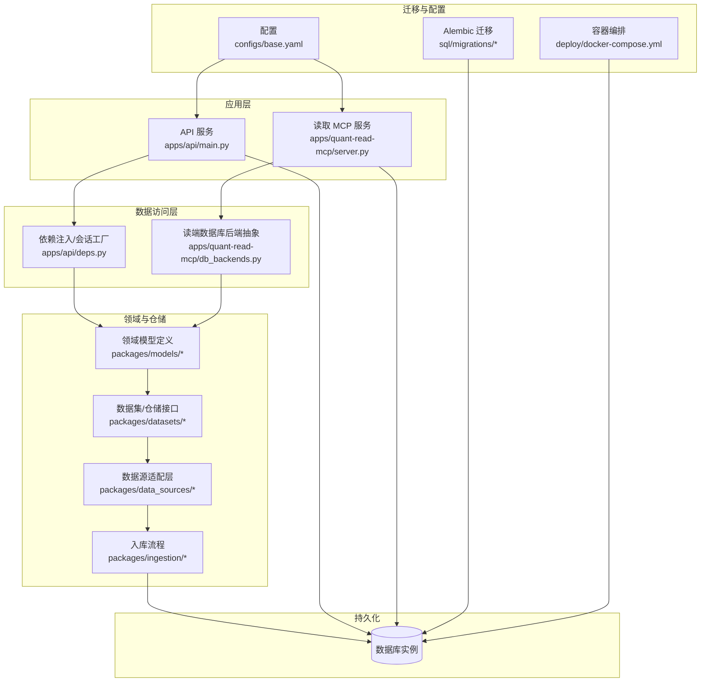
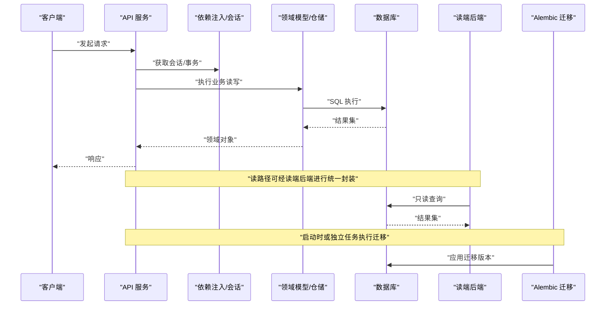
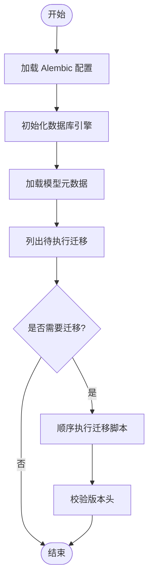
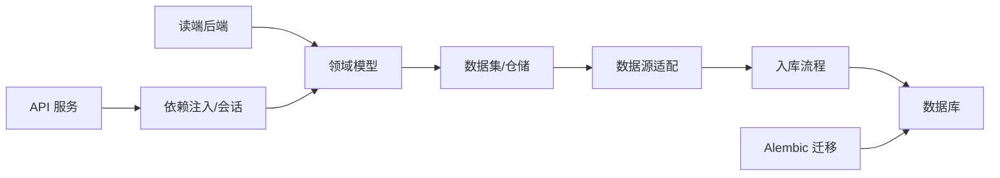

# 数据存储管理

<cite>
**本文引用的文件**   
- [alembic.ini](file://alembic.ini)
- [sql/migrations/env.py](file://sql/migrations/env.py)
- [sql/migrations/script.py.mako](file://sql/migrations/script.py.mako)
- [sql/migrations/versions/20260715_0001_instruments.py](file://sql/migrations/versions/20260715_0001_instruments.py)
- [sql/migrations/versions/20260715_0002_audit_events.py](file://sql/migrations/versions/20260715_0002_audit_events.py)
- [sql/migrations/versions/20260715_0003_market_bar.py](file://sql/migrations/versions/20260715_0003_market_bar.py)
- [sql/migrations/versions/20260715_0004_corporate_action.py](file://sql/migrations/versions/20260715_0004_corporate_action.py)
- [sql/migrations/versions/20260715_0005_fundamental_fact.py](file://sql/migrations/versions/20260715_0005_fundamental_fact.py)
- [sql/migrations/versions/20260715_0006_fund_fx_portfolio.py](file://sql/migrations/versions/20260715_0006_fund_fx_portfolio.py)
- [sql/migrations/versions/20260715_0007_market_bar_provenance.py](file://sql/migrations/versions/20260715_0007_market_bar_provenance.py)
- [sql/migrations/versions/20260715_0008_ca_nav_provenance.py](file://sql/migrations/versions/20260715_0008_ca_nav_provenance.py)
- [apps/api/main.py](file://apps/api/main.py)
- [apps/api/deps.py](file://apps/api/deps.py)
- [apps/quant-read-mcp/db_backends.py](file://apps/quant-read-mcp/db_backends.py)
- [packages/data_sources/__init__.py](file://packages/data_sources/__init__.py)
- [packages/datasets/__init__.py](file://packages/datasets/__init__.py)
- [packages/models/__init__.py](file://packages/models/__init__.py)
- [packages/ingestion/__init__.py](file://packages/ingestion/__init__.py)
- [configs/base.yaml](file://configs/base.yaml)
- [deploy/docker-compose.yml](file://deploy/docker-compose.yml)
</cite>

## 目录
1. [简介](#简介)
2. [项目结构](#项目结构)
3. [核心组件](#核心组件)
4. [架构总览](#架构总览)
5. [详细组件分析](#详细组件分析)
6. [依赖关系分析](#依赖关系分析)
7. [性能考虑](#性能考虑)
8. [故障排查指南](#故障排查指南)
9. [结论](#结论)
10. [附录](#附录)

## 简介
本技术文档聚焦于项目的“数据存储管理”，覆盖以下主题：
- 数据存储架构与表结构设计原则
- 数据分区策略与索引优化方案
- 数据迁移管理与版本控制机制
- 数据备份、恢复与归档策略
- 存储性能调优与容量规划建议
- 数据库连接池配置与查询优化技巧
- 与ORM框架的集成方式与最佳实践

目标读者包括后端工程师、数据工程师、运维与SRE，以及需要理解数据层设计与演进的量化研究人员。

## 项目结构
本项目采用分层与领域驱动相结合的组织方式，数据存储相关能力分布在如下位置：
- 迁移与版本控制：sql/migrations 目录（Alembic）
- 应用入口与依赖注入：apps/api/main.py、apps/api/deps.py
- 读侧数据库后端抽象：apps/quant-read-mcp/db_backends.py
- 领域包中的模型与仓储接口：packages/models、packages/datasets、packages/data_sources、packages/ingestion
- 配置与部署：configs/base.yaml、deploy/docker-compose.yml

图表来源
- [apps/api/main.py](file://apps/api/main.py)
- [apps/api/deps.py](file://apps/api/deps.py)
- [apps/quant-read-mcp/db_backends.py](file://apps/quant-read-mcp/db_backends.py)
- [packages/models/__init__.py](file://packages/models/__init__.py)
- [packages/datasets/__init__.py](file://packages/datasets/__init__.py)
- [packages/data_sources/__init__.py](file://packages/data_sources/__init__.py)
- [packages/ingestion/__init__.py](file://packages/ingestion/__init__.py)
- [sql/migrations/env.py](file://sql/migrations/env.py)
- [configs/base.yaml](file://configs/base.yaml)
- [deploy/docker-compose.yml](file://deploy/docker-compose.yml)

章节来源
- [apps/api/main.py](file://apps/api/main.py)
- [apps/api/deps.py](file://apps/api/deps.py)
- [apps/quant-read-mcp/db_backends.py](file://apps/quant-read-mcp/db_backends.py)
- [packages/models/__init__.py](file://packages/models/__init__.py)
- [packages/datasets/__init__.py](file://packages/datasets/__init__.py)
- [packages/data_sources/__init__.py](file://packages/data_sources/__init__.py)
- [packages/ingestion/__init__.py](file://packages/ingestion/__init__.py)
- [sql/migrations/env.py](file://sql/migrations/env.py)
- [configs/base.yaml](file://configs/base.yaml)
- [deploy/docker-compose.yml](file://deploy/docker-compose.yml)

## 核心组件
- 迁移与版本控制（Alembic）
  - 通过 alembic.ini 与 sql/migrations 目录组织迁移脚本，使用 env.py 初始化引擎与元数据，script.py.mako 提供生成模板。
  - 迁移版本以时间戳+序号命名，便于顺序执行与回滚。
- 应用依赖注入与会话管理
  - apps/api/deps.py 负责创建数据库会话、事务边界与资源清理，供路由层复用。
- 读端数据库后端抽象
  - apps/quant-read-mcp/db_backends.py 提供统一的读端后端接口，屏蔽底层差异，便于扩展多库或多引擎。
- 领域模型与仓储
  - packages/models 定义 ORM 映射；packages/datasets 暴露面向业务的数据集接口；packages/data_sources 对接外部数据源；packages/ingestion 负责入仓与清洗。
- 配置与部署
  - configs/base.yaml 集中数据库连接参数；deploy/docker-compose.yml 编排数据库与服务。

章节来源
- [alembic.ini](file://alembic.ini)
- [sql/migrations/env.py](file://sql/migrations/env.py)
- [sql/migrations/script.py.mako](file://sql/migrations/script.py.mako)
- [apps/api/deps.py](file://apps/api/deps.py)
- [apps/quant-read-mcp/db_backends.py](file://apps/quant-read-mcp/db_backends.py)
- [packages/models/__init__.py](file://packages/models/__init__.py)
- [packages/datasets/__init__.py](file://packages/datasets/__init__.py)
- [packages/data_sources/__init__.py](file://packages/data_sources/__init__.py)
- [packages/ingestion/__init__.py](file://packages/ingestion/__init__.py)
- [configs/base.yaml](file://configs/base.yaml)
- [deploy/docker-compose.yml](file://deploy/docker-compose.yml)

## 架构总览
整体数据流遵循“写入路径”和“读取路径”分离的原则：
- 写入路径：数据源适配层 → 入库流程 → 仓储/模型 → 数据库
- 读取路径：API/MCP 服务 → 依赖注入/会话 → 读端后端 → 模型/仓储 → 数据库
- 迁移：Alembic 在启动或独立任务中执行，确保数据库结构与代码一致

图表来源
- [apps/api/main.py](file://apps/api/main.py)
- [apps/api/deps.py](file://apps/api/deps.py)
- [apps/quant-read-mcp/db_backends.py](file://apps/quant-read-mcp/db_backends.py)
- [packages/models/__init__.py](file://packages/models/__init__.py)
- [sql/migrations/env.py](file://sql/migrations/env.py)

## 详细组件分析

### 迁移与版本控制（Alembic）
- 关键文件
  - alembic.ini：Alembic 全局配置（如环境、脚本目录、引擎 URL 等）
  - sql/migrations/env.py：初始化 SQLAlchemy 引擎与元数据，加载所有迁移模块
  - sql/migrations/script.py.mako：迁移脚本生成模板
  - sql/migrations/versions/*：按时间戳+序号命名的具体迁移脚本
- 设计要点
  - 迁移脚本应幂等且可回滚，避免破坏性变更
  - 大表变更建议拆分为多个小迁移，降低锁竞争
  - 生产环境迁移需配合灰度发布与回滚预案

图表来源
- [alembic.ini](file://alembic.ini)
- [sql/migrations/env.py](file://sql/migrations/env.py)
- [sql/migrations/script.py.mako](file://sql/migrations/script.py.mako)
- [sql/migrations/versions/20260715_0001_instruments.py](file://sql/migrations/versions/20260715_0001_instruments.py)
- [sql/migrations/versions/20260715_0002_audit_events.py](file://sql/migrations/versions/20260715_0002_audit_events.py)
- [sql/migrations/versions/20260715_0003_market_bar.py](file://sql/migrations/versions/20260715_0003_market_bar.py)
- [sql/migrations/versions/20260715_0004_corporate_action.py](file://sql/migrations/versions/20260715_0004_corporate_action.py)
- [sql/migrations/versions/20260715_0005_fundamental_fact.py](file://sql/migrations/versions/20260715_0005_fundamental_fact.py)
- [sql/migrations/versions/20260715_0006_fund_fx_portfolio.py](file://sql/migrations/versions/20260715_0006_fund_fx_portfolio.py)
- [sql/migrations/versions/20260715_0007_market_bar_provenance.py](file://sql/migrations/versions/20260715_0007_market_bar_provenance.py)
- [sql/migrations/versions/20260715_0008_ca_nav_provenance.py](file://sql/migrations/versions/20260715_0008_ca_nav_provenance.py)

章节来源
- [alembic.ini](file://alembic.ini)
- [sql/migrations/env.py](file://sql/migrations/env.py)
- [sql/migrations/script.py.mako](file://sql/migrations/script.py.mako)
- [sql/migrations/versions/20260715_0001_instruments.py](file://sql/migrations/versions/20260715_0001_instruments.py)
- [sql/migrations/versions/20260715_0002_audit_events.py](file://sql/migrations/versions/20260715_0002_audit_events.py)
- [sql/migrations/versions/20260715_0003_market_bar.py](file://sql/migrations/versions/20260715_0003_market_bar.py)
- [sql/migrations/versions/20260715_0004_corporate_action.py](file://sql/migrations/versions/20260715_0004_corporate_action.py)
- [sql/migrations/versions/20260715_0005_fundamental_fact.py](file://sql/migrations/versions/20260715_0005_fundamental_fact.py)
- [sql/migrations/versions/20260715_0006_fund_fx_portfolio.py](file://sql/migrations/versions/20260715_0006_fund_fx_portfolio.py)
- [sql/migrations/versions/20260715_0007_market_bar_provenance.py](file://sql/migrations/versions/20260715_0007_market_bar_provenance.py)
- [sql/migrations/versions/20260715_0008_ca_nav_provenance.py](file://sql/migrations/versions/20260715_0008_ca_nav_provenance.py)

### 应用依赖注入与会话管理
- 职责
  - 创建并缓存数据库引擎与会话工厂
  - 为每个请求/任务提供隔离的会话与事务边界
  - 保证异常时正确回滚与资源释放
- 最佳实践
  - 短生命周期会话，避免长事务
  - 显式提交/回滚，结合上下文管理器
  - 连接池参数根据并发与延迟目标调优

章节来源
- [apps/api/deps.py](file://apps/api/deps.py)

### 读端数据库后端抽象
- 职责
  - 统一读端查询入口，屏蔽不同后端实现差异
  - 支持只读副本、分片或跨库聚合
- 设计要点
  - 接口稳定，实现可插拔
  - 错误处理与重试策略清晰
  - 监控指标埋点（耗时、失败率）

章节来源
- [apps/quant-read-mcp/db_backends.py](file://apps/quant-read-mcp/db_backends.py)

### 领域模型与仓储
- 模型定义
  - 位于 packages/models，使用 ORM 映射到物理表
  - 字段类型与约束应与业务语义对齐
- 仓储接口
  - packages/datasets 暴露面向业务的查询与写入接口
  - 将 SQL 细节封装在仓储内，提升可读性与可测试性
- 数据源与入库
  - packages/data_sources 对接外部数据源
  - packages/ingestion 负责清洗、转换与批量写入

章节来源
- [packages/models/__init__.py](file://packages/models/__init__.py)
- [packages/datasets/__init__.py](file://packages/datasets/__init__.py)
- [packages/data_sources/__init__.py](file://packages/data_sources/__init__.py)
- [packages/ingestion/__init__.py](file://packages/ingestion/__init__.py)

### 配置与部署
- 配置
  - configs/base.yaml 集中数据库连接参数（URL、池大小、超时等）
- 部署
  - deploy/docker-compose.yml 编排数据库与服务，便于本地与CI环境一致性

章节来源
- [configs/base.yaml](file://configs/base.yaml)
- [deploy/docker-compose.yml](file://deploy/docker-compose.yml)

## 依赖关系分析
- 组件耦合
  - API 服务依赖 deps 提供的会话工厂
  - 读端后端对模型有只读依赖
  - 仓储与数据源解耦，便于替换实现
- 外部依赖
  - 数据库引擎由配置决定
  - Alembic 作为独立工具维护版本

图表来源
- [apps/api/main.py](file://apps/api/main.py)
- [apps/api/deps.py](file://apps/api/deps.py)
- [apps/quant-read-mcp/db_backends.py](file://apps/quant-read-mcp/db_backends.py)
- [packages/models/__init__.py](file://packages/models/__init__.py)
- [packages/datasets/__init__.py](file://packages/datasets/__init__.py)
- [packages/data_sources/__init__.py](file://packages/data_sources/__init__.py)
- [packages/ingestion/__init__.py](file://packages/ingestion/__init__.py)
- [sql/migrations/env.py](file://sql/migrations/env.py)

章节来源
- [apps/api/main.py](file://apps/api/main.py)
- [apps/api/deps.py](file://apps/api/deps.py)
- [apps/quant-read-mcp/db_backends.py](file://apps/quant-read-mcp/db_backends.py)
- [packages/models/__init__.py](file://packages/models/__init__.py)
- [packages/datasets/__init__.py](file://packages/datasets/__init__.py)
- [packages/data_sources/__init__.py](file://packages/data_sources/__init__.py)
- [packages/ingestion/__init__.py](file://packages/ingestion/__init__.py)
- [sql/migrations/env.py](file://sql/migrations/env.py)

## 性能考虑
- 连接池配置
  - 根据并发量与数据库最大连接数设置 pool_size、max_overflow、pool_recycle、pool_pre_ping
  - 读写分离场景下，读端可配置更大的只读池
- 查询优化
  - 优先使用覆盖索引与复合索引，减少回表
  - 分页查询使用游标或基于键的范围扫描
  - 避免 SELECT *，仅选择必要列
- 写入优化
  - 批量插入与事务合并，减少网络往返
  - 热点表写入拆分到分区或分片
- 索引与分区
  - 时间序列数据按时间分区，利于历史归档与范围查询
  - 高频过滤列建立合适索引，权衡写入放大
- 容量规划
  - 评估日增量、保留周期与压缩比，预留增长空间
  - 冷热分层：热数据SSD、冷数据低成本存储

[本节为通用指导，不直接分析具体文件]

## 故障排查指南
- 迁移问题
  - 检查 alembic.ini 与 env.py 的配置是否正确
  - 确认当前版本头与期望版本一致，必要时手动修正
- 连接问题
  - 核对 configs/base.yaml 的连接参数
  - 查看 docker-compose.yml 的网络与端口映射
- 会话与事务
  - 确认 deps 中会话生命周期与异常回滚逻辑
  - 长事务可能导致锁等待与死锁，缩短事务范围
- 读端后端
  - 验证后端实现是否返回预期数据结构
  - 增加日志与指标，定位慢查询与失败原因

章节来源
- [alembic.ini](file://alembic.ini)
- [sql/migrations/env.py](file://sql/migrations/env.py)
- [configs/base.yaml](file://configs/base.yaml)
- [deploy/docker-compose.yml](file://deploy/docker-compose.yml)
- [apps/api/deps.py](file://apps/api/deps.py)
- [apps/quant-read-mcp/db_backends.py](file://apps/quant-read-mcp/db_backends.py)

## 结论
本项目在数据存储方面采用了清晰的层次划分与迁移管理机制，具备可扩展的读端后端抽象与完善的依赖注入模式。建议在后续演进中持续完善：
- 迁移脚本的可观测性与自动化回滚
- 读端后端的只读副本与缓存层
- 更细粒度的索引与分区策略
- 连接池与查询性能的基准测试与压测体系

[本节为总结性内容，不直接分析具体文件]

## 附录

### 表结构设计原则
- 主键设计：使用自增或UUID，避免业务键作为主键
- 规范化与反规范化平衡：高频查询可适当冗余
- 字段类型：选择最小足够类型，节省空间与IO
- 审计与溯源：引入审计事件与数据来源字段（参考迁移中的审计与溯源表）

章节来源
- [sql/migrations/versions/20260715_0002_audit_events.py](file://sql/migrations/versions/20260715_0002_audit_events.py)
- [sql/migrations/versions/20260715_0007_market_bar_provenance.py](file://sql/migrations/versions/20260715_0007_market_bar_provenance.py)
- [sql/migrations/versions/20260715_0008_ca_nav_provenance.py](file://sql/migrations/versions/20260715_0008_ca_nav_provenance.py)

### 数据分区策略与索引优化
- 时间分区：适用于行情与基本面事实表
- 复合索引：按查询条件组合构建，避免过度索引
- 覆盖索引：针对常用查询列集合

章节来源
- [sql/migrations/versions/20260715_0003_market_bar.py](file://sql/migrations/versions/20260715_0003_market_bar.py)
- [sql/migrations/versions/20260715_0005_fundamental_fact.py](file://sql/migrations/versions/20260715_0005_fundamental_fact.py)

### 数据备份、恢复与归档
- 备份策略：全量+增量，定期快照
- 恢复演练：定期验证恢复流程与RTO/RPO
- 归档策略：按时间分区归档至低成本存储

[本节为通用指导，不直接分析具体文件]

### 与ORM框架的集成与最佳实践
- 模型定义与迁移同步
- 使用仓储封装复杂查询
- 避免N+1查询，合理使用预加载
- 事务边界清晰，异常时回滚

章节来源
- [packages/models/__init__.py](file://packages/models/__init__.py)
- [packages/datasets/__init__.py](file://packages/datasets/__init__.py)
- [sql/migrations/env.py](file://sql/migrations/env.py)