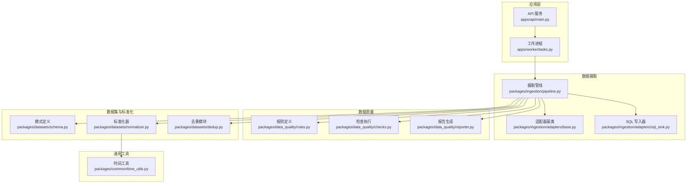
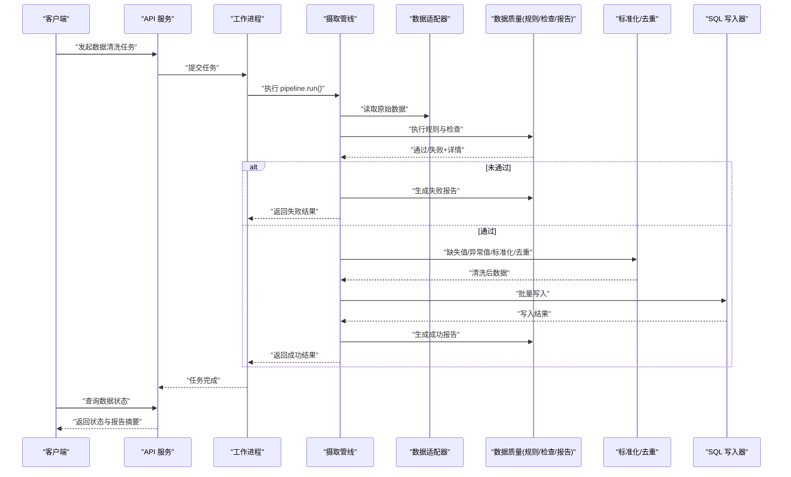
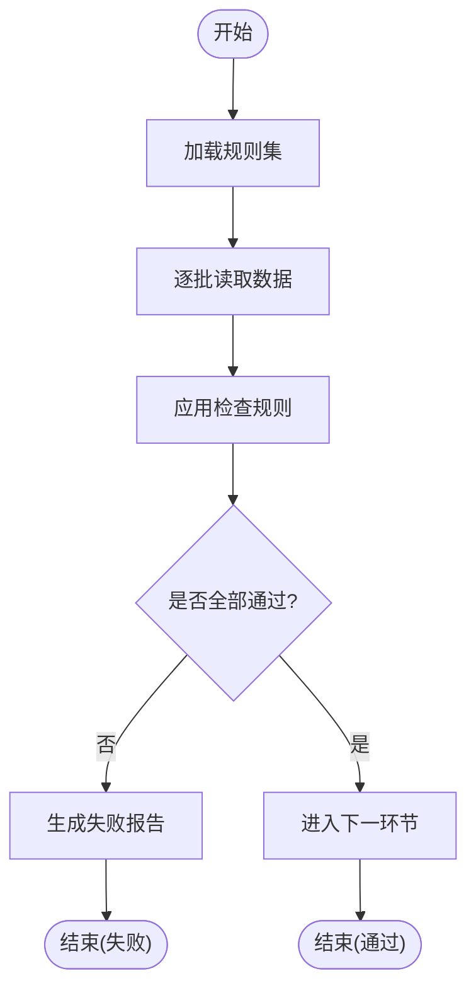
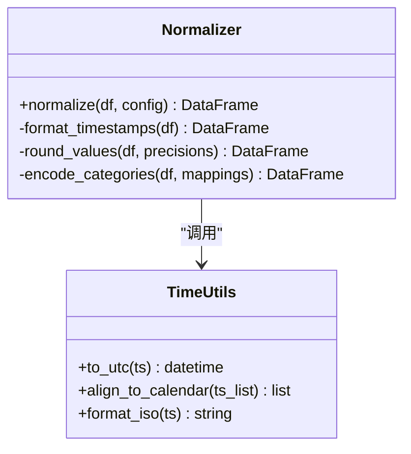
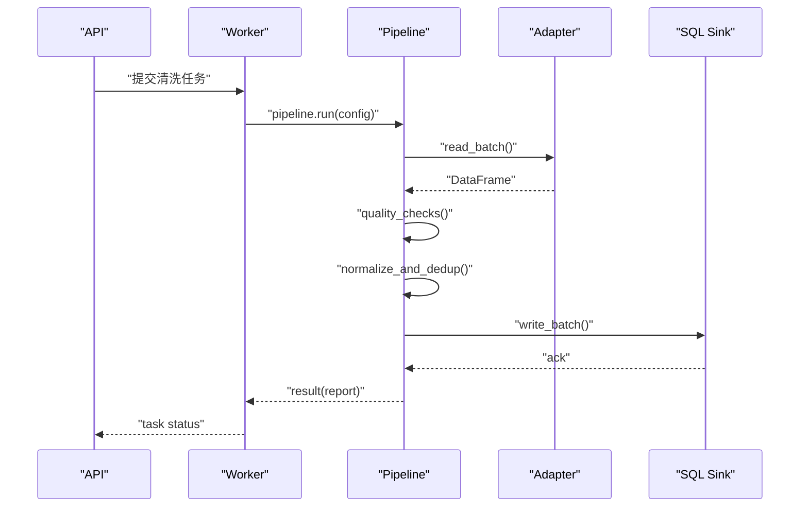

# 数据清洗流程

<cite>
**本文引用的文件**   
- [apps/api/main.py](file://apps/api/main.py)
- [apps/api/routers/data_status.py](file://apps/api/routers/data_status.py)
- [apps/worker/tasks.py](file://apps/worker/tasks.py)
- [packages/ingestion/__init__.py](file://packages/ingestion/__init__.py)
- [packages/ingestion/adapters/base.py](file://packages/ingestion/adapters/base.py)
- [packages/ingestion/adapters/sql_sink.py](file://packages/ingestion/adapters/sql_sink.py)
- [packages/ingestion/pipeline.py](file://packages/ingestion/pipeline.py)
- [packages/data_quality/rules.py](file://packages/data_quality/rules.py)
- [packages/data_quality/checks.py](file://packages/data_quality/checks.py)
- [packages/data_quality/reporter.py](file://packages/data_quality/reporter.py)
- [packages/datasets/schema.py](file://packages/datasets/schema.py)
- [packages/datasets/normalizer.py](file://packages/datasets/normalizer.py)
- [packages/datasets/dedup.py](file://packages/datasets/dedup.py)
- [packages/common/time_utils.py](file://packages/common/time_utils.py)
- [scripts/ingest_real_data.py](file://scripts/ingest_real_data.py)
- [tests/unit/test_ingestion.py](file://tests/unit/test_ingestion.py)
- [tests/unit/test_ingestion_sql_sink.py](file://tests/unit/test_ingestion_sql_sink.py)
- [tests/unit/test_golden_scenarios.py](file://tests/unit/test_golden_scenarios.py)
- [tests/unit/test_promotion_gate.py](file://tests/unit/test_promotion_gate.py)
- [deploy/docker-compose.yml](file://deploy/docker-compose.yml)
</cite>

## 目录
1. [简介](#简介)
2. [项目结构](#项目结构)
3. [核心组件](#核心组件)
4. [架构总览](#架构总览)
5. [详细组件分析](#详细组件分析)
6. [依赖关系分析](#依赖关系分析)
7. [性能考虑](#性能考虑)
8. [故障排查指南](#故障排查指南)
9. [结论](#结论)
10. [附录](#附录)

## 简介
本技术文档围绕数据清洗流程，系统化阐述数据验证规则与质量检查机制、缺失值处理、异常值检测、数据一致性校验、标准化（时间戳格式化、数值精度控制、分类变量编码）、去重策略、质量监控与报告生成，以及与数据摄取管道的集成方式。文档面向研发与数据工程人员，兼顾非技术读者理解。

## 项目结构
本项目采用分层与模块化组织：API 层暴露状态查询与调度入口；Worker 执行异步任务；Ingestion 负责从多源拉取并写入存储；Data Quality 提供规则、检查与报告；Datasets 提供模式定义、标准化与去重；Common 提供通用工具；测试覆盖关键路径与场景。

图表来源
- [apps/api/main.py](file://apps/api/main.py)
- [apps/worker/tasks.py](file://apps/worker/tasks.py)
- [packages/ingestion/pipeline.py](file://packages/ingestion/pipeline.py)
- [packages/ingestion/adapters/base.py](file://packages/ingestion/adapters/base.py)
- [packages/ingestion/adapters/sql_sink.py](file://packages/ingestion/adapters/sql_sink.py)
- [packages/data_quality/rules.py](file://packages/data_quality/rules.py)
- [packages/data_quality/checks.py](file://packages/data_quality/checks.py)
- [packages/data_quality/reporter.py](file://packages/data_quality/reporter.py)
- [packages/datasets/schema.py](file://packages/datasets/schema.py)
- [packages/datasets/normalizer.py](file://packages/datasets/normalizer.py)
- [packages/datasets/dedup.py](file://packages/datasets/dedup.py)
- [packages/common/time_utils.py](file://packages/common/time_utils.py)

章节来源
- [apps/api/main.py](file://apps/api/main.py)
- [apps/worker/tasks.py](file://apps/worker/tasks.py)
- [packages/ingestion/pipeline.py](file://packages/ingestion/pipeline.py)
- [packages/ingestion/adapters/base.py](file://packages/ingestion/adapters/base.py)
- [packages/ingestion/adapters/sql_sink.py](file://packages/ingestion/adapters/sql_sink.py)
- [packages/data_quality/rules.py](file://packages/data_quality/rules.py)
- [packages/data_quality/checks.py](file://packages/data_quality/checks.py)
- [packages/data_quality/reporter.py](file://packages/data_quality/reporter.py)
- [packages/datasets/schema.py](file://packages/datasets/schema.py)
- [packages/datasets/normalizer.py](file://packages/datasets/normalizer.py)
- [packages/datasets/dedup.py](file://packages/datasets/dedup.py)
- [packages/common/time_utils.py](file://packages/common/time_utils.py)

## 核心组件
- 数据摄取管线：协调适配器读取、转换、质量检查、标准化与落库。
- 数据质量子系统：规则定义、检查执行、报告输出与门禁控制。
- 数据集标准化：模式约束、时间戳统一、数值精度、分类编码、去重。
- 通用时间工具：时区、格式、对齐等基础能力。
- 任务与工作流：API 触发、Worker 执行、状态查询。

章节来源
- [packages/ingestion/pipeline.py](file://packages/ingestion/pipeline.py)
- [packages/data_quality/rules.py](file://packages/data_quality/rules.py)
- [packages/data_quality/checks.py](file://packages/data_quality/checks.py)
- [packages/data_quality/reporter.py](file://packages/data_quality/reporter.py)
- [packages/datasets/schema.py](file://packages/datasets/schema.py)
- [packages/datasets/normalizer.py](file://packages/datasets/normalizer.py)
- [packages/datasets/dedup.py](file://packages/datasets/dedup.py)
- [packages/common/time_utils.py](file://packages/common/time_utils.py)

## 架构总览
下图展示一次典型的数据清洗端到端流程：API 接收请求或定时触发，Worker 调度摄取管线，管线依次执行适配读取、规则校验、缺失值与异常值处理、标准化、去重与写入，最后生成质量报告并更新状态。

图表来源
- [apps/api/main.py](file://apps/api/main.py)
- [apps/worker/tasks.py](file://apps/worker/tasks.py)
- [packages/ingestion/pipeline.py](file://packages/ingestion/pipeline.py)
- [packages/ingestion/adapters/base.py](file://packages/ingestion/adapters/base.py)
- [packages/ingestion/adapters/sql_sink.py](file://packages/ingestion/adapters/sql_sink.py)
- [packages/data_quality/rules.py](file://packages/data_quality/rules.py)
- [packages/data_quality/checks.py](file://packages/data_quality/checks.py)
- [packages/data_quality/reporter.py](file://packages/data_quality/reporter.py)

## 详细组件分析

### 数据验证规则与质量检查机制
- 规则定义：在规则模块中集中声明字段级与记录级约束（如必填、范围、枚举、唯一性、跨表一致性等）。
- 检查执行：检查模块按批次加载规则，对输入数据进行扫描与断言，产出结构化检查结果（通过/失败、指标、样本明细）。
- 报告生成：报告模块汇总检查结果，输出可读报告（文本/JSON），支持阈值与门禁配置。
- 门禁控制：当关键规则失败时，管线可中止后续步骤并回滚或标记失败。

图表来源
- [packages/data_quality/rules.py](file://packages/data_quality/rules.py)
- [packages/data_quality/checks.py](file://packages/data_quality/checks.py)
- [packages/data_quality/reporter.py](file://packages/data_quality/reporter.py)

章节来源
- [packages/data_quality/rules.py](file://packages/data_quality/rules.py)
- [packages/data_quality/checks.py](file://packages/data_quality/checks.py)
- [packages/data_quality/reporter.py](file://packages/data_quality/reporter.py)

### 缺失值处理
- 识别：基于模式定义与规则，定位空值、NaN、空字符串等缺失形态。
- 策略：
  - 填充：常量、前向/后向填充、均值/中位数/众数、模型预测填充。
  - 丢弃：当缺失比例超过阈值或关键字段缺失时直接丢弃记录。
  - 标记：新增“是否缺失”标志列，便于下游建模使用。
- 审计：记录缺失统计与处理动作，纳入质量报告。

章节来源
- [packages/datasets/schema.py](file://packages/datasets/schema.py)
- [packages/data_quality/rules.py](file://packages/data_quality/rules.py)
- [packages/data_quality/checks.py](file://packages/data_quality/checks.py)
- [packages/data_quality/reporter.py](file://packages/data_quality/reporter.py)

### 异常值检测
- 方法：
  - 统计法：Z-score、IQR、分位数截尾。
  - 业务法：价格/成交量上下限、涨跌停、停牌日过滤。
  - 时序法：跳变检测、连续缺失窗口、非交易日剔除。
- 处置：
  - 修正：回填合理值或插值。
  - 隔离：标记为异常并保留原值供审计。
  - 丢弃：严重异常且不可修复的记录。

章节来源
- [packages/data_quality/rules.py](file://packages/data_quality/rules.py)
- [packages/data_quality/checks.py](file://packages/data_quality/checks.py)
- [packages/datasets/schema.py](file://packages/datasets/schema.py)

### 数据一致性验证
- 主键/唯一性：确保标识字段全局唯一。
- 外键/关联：跨表引用完整性校验。
- 时序一致：时间戳单调递增、交易日历对齐、节假日与早收市处理。
- 跨源一致性：同标的不同源数据比对与冲突解决策略。

章节来源
- [packages/data_quality/rules.py](file://packages/data_quality/rules.py)
- [packages/data_quality/checks.py](file://packages/data_quality/checks.py)
- [packages/datasets/schema.py](file://packages/datasets/schema.py)

### 数据标准化流程
- 时间戳格式化：统一时区、ISO 格式、交易时段对齐。
- 数值精度控制：四舍五入、截断、最小报价单位对齐。
- 分类变量编码：标签映射、独热/目标编码、类别归一化。
- 基准与版本：标准化过程需可复现，附带版本与参数快照。

图表来源
- [packages/datasets/normalizer.py](file://packages/datasets/normalizer.py)
- [packages/common/time_utils.py](file://packages/common/time_utils.py)

章节来源
- [packages/datasets/normalizer.py](file://packages/datasets/normalizer.py)
- [packages/common/time_utils.py](file://packages/common/time_utils.py)

### 数据去重与重复记录处理
- 去重键：组合主键（标的+时间+维度）作为去重依据。
- 策略：
  - 保留最新：按时间戳或版本号选择最新记录。
  - 合并聚合：相同键按业务规则聚合（如加权平均）。
  - 冲突标注：保留差异字段用于审计与回溯。
- 效果评估：去重前后记录量对比、重复率统计。

章节来源
- [packages/datasets/dedup.py](file://packages/datasets/dedup.py)
- [packages/datasets/schema.py](file://packages/datasets/schema.py)

### 数据质量监控与报告生成
- 监控指标：缺失率、异常率、重复率、一致性通过率、延迟与吞吐。
- 报告内容：规则命中明细、失败样例、趋势对比、门禁结果。
- 告警与门禁：阈值越界触发告警，关键门禁失败阻断发布。

章节来源
- [packages/data_quality/reporter.py](file://packages/data_quality/reporter.py)
- [packages/data_quality/checks.py](file://packages/data_quality/checks.py)

### 与数据摄取管道的集成
- 入口：API 提供任务提交与状态查询接口；Worker 消费任务并驱动管线。
- 管线编排：读取→校验→清洗→标准化→去重→写入→报告。
- 适配器：抽象数据源接入点，统一输出到中间表示。
- 写入：SQL 写入器负责批量插入/更新与事务控制。

图表来源
- [apps/api/main.py](file://apps/api/main.py)
- [apps/worker/tasks.py](file://apps/worker/tasks.py)
- [packages/ingestion/pipeline.py](file://packages/ingestion/pipeline.py)
- [packages/ingestion/adapters/base.py](file://packages/ingestion/adapters/base.py)
- [packages/ingestion/adapters/sql_sink.py](file://packages/ingestion/adapters/sql_sink.py)

章节来源
- [apps/api/main.py](file://apps/api/main.py)
- [apps/worker/tasks.py](file://apps/worker/tasks.py)
- [packages/ingestion/pipeline.py](file://packages/ingestion/pipeline.py)
- [packages/ingestion/adapters/base.py](file://packages/ingestion/adapters/base.py)
- [packages/ingestion/adapters/sql_sink.py](file://packages/ingestion/adapters/sql_sink.py)

## 依赖关系分析
- 低耦合高内聚：各模块职责清晰，通过接口与配置解耦。
- 外部依赖：数据库连接池、消息队列（可选）、对象存储（可选）。
- 循环依赖：避免模块间相互导入，必要时使用回调或事件总线。

```mermaid
graph LR
API["API"] --> Worker["Worker"]
Worker --> Pipe["Pipeline"]
Pipe --> Rules["Rules"]
Pipe --> Checks["Checks"]
Pipe --> Reporter["Reporter"]
Pipe --> Schema["Schema"]
Pipe --> Normalizer["Normalizer"]
Pipe --> Dedup["Dedup"]
Normalizer --> TimeUtils["TimeUtils"]
Pipe --> SQLSink["SQL Sink"]
```

图表来源
- [apps/api/main.py](file://apps/api/main.py)
- [apps/worker/tasks.py](file://apps/worker/tasks.py)
- [packages/ingestion/pipeline.py](file://packages/ingestion/pipeline.py)
- [packages/data_quality/rules.py](file://packages/data_quality/rules.py)
- [packages/data_quality/checks.py](file://packages/data_quality/checks.py)
- [packages/data_quality/reporter.py](file://packages/data_quality/reporter.py)
- [packages/datasets/schema.py](file://packages/datasets/schema.py)
- [packages/datasets/normalizer.py](file://packages/datasets/normalizer.py)
- [packages/datasets/dedup.py](file://packages/datasets/dedup.py)
- [packages/common/time_utils.py](file://packages/common/time_utils.py)
- [packages/ingestion/adapters/sql_sink.py](file://packages/ingestion/adapters/sql_sink.py)

章节来源
- [packages/ingestion/pipeline.py](file://packages/ingestion/pipeline.py)
- [packages/data_quality/rules.py](file://packages/data_quality/rules.py)
- [packages/data_quality/checks.py](file://packages/data_quality/checks.py)
- [packages/data_quality/reporter.py](file://packages/data_quality/reporter.py)
- [packages/datasets/schema.py](file://packages/datasets/schema.py)
- [packages/datasets/normalizer.py](file://packages/datasets/normalizer.py)
- [packages/datasets/dedup.py](file://packages/datasets/dedup.py)
- [packages/common/time_utils.py](file://packages/common/time_utils.py)
- [packages/ingestion/adapters/sql_sink.py](file://packages/ingestion/adapters/sql_sink.py)

## 性能考虑
- 批处理：按批次读取与写入，减少 IO 次数与锁竞争。
- 并行化：规则检查与标准化可并行执行，注意资源隔离。
- 索引与分区：写入前对去重键建立索引，按时间分区提升查询效率。
- 内存管理：大表流式处理，避免一次性加载全量数据。
- 重试与幂等：写入操作具备幂等设计，失败自动重试。

[本节为通用指导，不直接分析具体文件]

## 故障排查指南
- 常见问题
  - 规则失败：查看质量报告中的失败明细与样例，定位字段与阈值。
  - 写入失败：检查数据库连接、事务回滚与错误码。
  - 时间不一致：确认时区设置与交易日历对齐。
  - 重复数据：核对去重键与保留策略。
- 诊断手段
  - 启用调试日志与采样记录。
  - 使用测试用例与黄金数据集回归验证。
  - 通过 API 查询任务状态与报告摘要。

章节来源
- [apps/api/routers/data_status.py](file://apps/api/routers/data_status.py)
- [tests/unit/test_ingestion.py](file://tests/unit/test_ingestion.py)
- [tests/unit/test_ingestion_sql_sink.py](file://tests/unit/test_ingestion_sql_sink.py)
- [tests/unit/test_golden_scenarios.py](file://tests/unit/test_golden_scenarios.py)
- [tests/unit/test_promotion_gate.py](file://tests/unit/test_promotion_gate.py)

## 结论
本数据清洗流程以规则驱动的质量检查为核心，结合标准化与去重策略，形成端到端的可靠管道。通过报告与门禁机制保障数据质量，配合 API 与 Worker 的协作实现可观测与可扩展的运维体系。建议持续完善规则库与监控指标，强化异常恢复与性能优化。

[本节为总结性内容，不直接分析具体文件]

## 附录

### 清洗规则与配置示例（说明性）
- 必填与类型：字段非空、类型匹配。
- 范围与枚举：数值区间、分类取值限定。
- 唯一性与一致性：主键唯一、跨表引用有效。
- 时序与日历：时间戳单调、交易日历对齐。
- 标准化参数：时间格式、数值精度、分类映射表。
- 去重策略：去重键、保留最新、冲突标注。
- 门禁阈值：缺失率、异常率上限，失败阻断发布。

[本节为概念性说明，不直接分析具体文件]

### 与摄取管道的集成要点
- 任务生命周期：创建→执行→完成→归档。
- 状态同步：API 提供状态查询，Worker 定期上报进度。
- 配置注入：通过配置文件或环境变量传入规则与标准化参数。
- 扩展点：新增适配器与规则无需改动核心管线。

章节来源
- [scripts/ingest_real_data.py](file://scripts/ingest_real_data.py)
- [deploy/docker-compose.yml](file://deploy/docker-compose.yml)