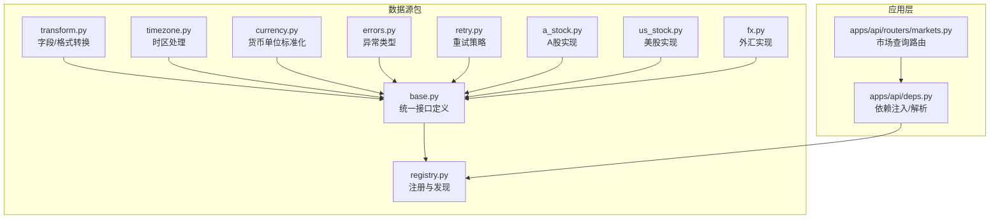
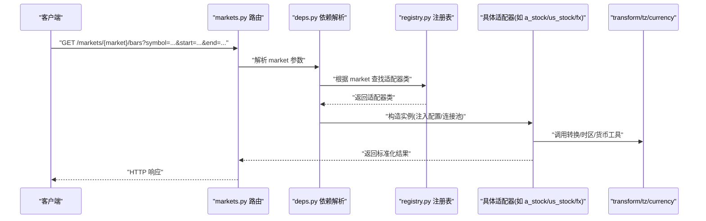
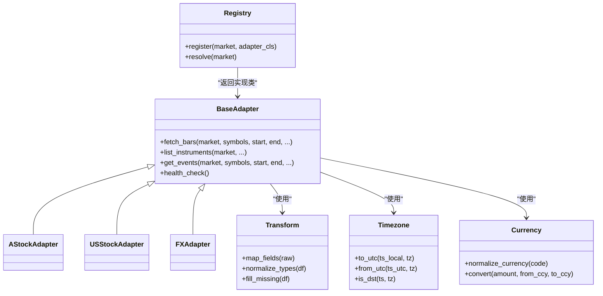

# 数据源适配器

<cite>
**本文引用的文件**   
- [packages/data_sources/__init__.py](file://packages/data_sources/__init__.py)
- [packages/data_sources/base.py](file://packages/data_sources/base.py)
- [packages/data_sources/registry.py](file://packages/data_sources/registry.py)
- [packages/data_sources/a_stock.py](file://packages/data_sources/a_stock.py)
- [packages/data_sources/us_stock.py](file://packages/data_sources/us_stock.py)
- [packages/data_sources/fx.py](file://packages/data_sources/fx.py)
- [packages/data_sources/transform.py](file://packages/data_sources/transform.py)
- [packages/data_sources/timezone.py](file://packages/data_sources/timezone.py)
- [packages/data_sources/currency.py](file://packages/data_sources/currency.py)
- [packages/data_sources/errors.py](file://packages/data_sources/errors.py)
- [packages/data_sources/retry.py](file://packages/data_sources/retry.py)
- [apps/api/routers/markets.py](file://apps/api/routers/markets.py)
- [apps/api/deps.py](file://apps/api/deps.py)
- [tests/unit/test_live_adapters.py](file://tests/unit/test_live_adapters.py)
</cite>

## 目录
1. [简介](#简介)
2. [项目结构](#项目结构)
3. [核心组件](#核心组件)
4. [架构总览](#架构总览)
5. [详细组件分析](#详细组件分析)
6. [依赖关系分析](#依赖关系分析)
7. [性能考虑](#性能考虑)
8. [故障排查指南](#故障排查指南)
9. [结论](#结论)
10. [附录](#附录)

## 简介
本技术文档围绕“数据源适配器”体系展开，目标是：
- 解释统一的数据访问接口设计，屏蔽不同市场（A股、美股、外汇）的差异。
- 记录适配器的注册机制与动态加载方式。
- 详述各市场数据源的特定实现要点：数据格式转换、时区处理、货币单位标准化等。
- 提供自定义数据源的开发指南与最佳实践，并给出具体代码示例路径。
- 说明错误处理与重试机制的设计与使用方式。

## 项目结构
数据源相关代码集中在 packages/data_sources 目录下，采用“抽象基类 + 注册表 + 多市场实现 + 通用工具”的分层组织方式；API 层通过路由暴露查询能力，并在依赖注入中解析具体适配器实例。

图表来源
- [packages/data_sources/base.py](file://packages/data_sources/base.py)
- [packages/data_sources/registry.py](file://packages/data_sources/registry.py)
- [packages/data_sources/transform.py](file://packages/data_sources/transform.py)
- [packages/data_sources/timezone.py](file://packages/data_sources/timezone.py)
- [packages/data_sources/currency.py](file://packages/data_sources/currency.py)
- [packages/data_sources/errors.py](file://packages/data_sources/errors.py)
- [packages/data_sources/retry.py](file://packages/data_sources/retry.py)
- [packages/data_sources/a_stock.py](file://packages/data_sources/a_stock.py)
- [packages/data_sources/us_stock.py](file://packages/data_sources/us_stock.py)
- [packages/data_sources/fx.py](file://packages/data_sources/fx.py)
- [apps/api/routers/markets.py](file://apps/api/routers/markets.py)
- [apps/api/deps.py](file://apps/api/deps.py)

章节来源
- [packages/data_sources/__init__.py](file://packages/data_sources/__init__.py)
- [apps/api/routers/markets.py](file://apps/api/routers/markets.py)
- [apps/api/deps.py](file://apps/api/deps.py)

## 核心组件
- 统一接口（基类）
  - 定义跨市场的标准方法族：按时间窗口拉取行情、获取标的清单、事件流（如除权除息）、元信息等。
  - 约定输入输出规范：时间戳统一为 UTC 或带时区的本地时间；价格/成交量/金额等字段命名一致；缺失值与空集返回策略明确。
- 注册表与动态加载
  - 提供装饰器/显式注册 API，将具体市场实现以“市场标识 -> 适配器类”的映射注册到全局注册表。
  - 支持运行时根据请求中的 market 参数动态解析并构造对应适配器实例。
- 通用工具
  - 转换：字段名映射、数据类型归一化、空值填充、分点/复权因子对齐等。
  - 时区：本地交易日历与交易所时区到 UTC 的转换、夏令时处理。
  - 货币：报价币种归一化、汇率换算入口、精度控制。
  - 错误与重试：可配置的重试策略（指数退避、最大次数、超时），以及领域异常类型。

章节来源
- [packages/data_sources/base.py](file://packages/data_sources/base.py)
- [packages/data_sources/registry.py](file://packages/data_sources/registry.py)
- [packages/data_sources/transform.py](file://packages/data_sources/transform.py)
- [packages/data_sources/timezone.py](file://packages/data_sources/timezone.py)
- [packages/data_sources/currency.py](file://packages/data_sources/currency.py)
- [packages/data_sources/errors.py](file://packages/data_sources/errors.py)
- [packages/data_sources/retry.py](file://packages/data_sources/retry.py)

## 架构总览
下图展示了从 HTTP 请求到具体数据源适配器的调用链路与关键职责边界。

图表来源
- [apps/api/routers/markets.py](file://apps/api/routers/markets.py)
- [apps/api/deps.py](file://apps/api/deps.py)
- [packages/data_sources/registry.py](file://packages/data_sources/registry.py)
- [packages/data_sources/a_stock.py](file://packages/data_sources/a_stock.py)
- [packages/data_sources/us_stock.py](file://packages/data_sources/us_stock.py)
- [packages/data_sources/fx.py](file://packages/data_sources/fx.py)
- [packages/data_sources/transform.py](file://packages/data_sources/transform.py)
- [packages/data_sources/timezone.py](file://packages/data_sources/timezone.py)
- [packages/data_sources/currency.py](file://packages/data_sources/currency.py)

## 详细组件分析

### 统一接口与抽象基类
- 职责
  - 定义跨市场一致的查询方法签名与返回结构。
  - 封装公共逻辑（如分页、去重、排序、空结果处理）。
  - 暴露生命周期钩子（初始化、关闭、健康检查）。
- 关键点
  - 输入参数包含：市场标识、标的集合、起止时间、频率、是否复权等。
  - 输出结构包含：时间戳、开高低收、成交量、成交额、涨跌停/停牌标记、币种等。
  - 对缺失数据与异常进行规范化包装，便于上层统一处理。

章节来源
- [packages/data_sources/base.py](file://packages/data_sources/base.py)

### 注册机制与动态加载
- 职责
  - 维护“市场标识 -> 适配器类”的全局映射。
  - 提供装饰器或显式注册函数，在模块导入时完成自动注册。
  - 提供按 market 解析适配器类的 API，供依赖注入层使用。
- 关键点
  - 重复注册保护与版本兼容提示。
  - 支持延迟加载与按需实例化，避免启动期开销过大。
  - 与依赖注入框架集成，确保每次请求获得独立实例或受控共享实例。

章节来源
- [packages/data_sources/registry.py](file://packages/data_sources/registry.py)
- [apps/api/deps.py](file://apps/api/deps.py)

### A 股数据源适配器
- 差异点
  - 交易时段与节假日规则（含盘中临时停牌、涨跌停限制）。
  - 复权因子与分红送转事件。
  - 本地时区（通常为 Asia/Shanghai）与 UTC 的转换。
- 数据处理
  - 原始字段映射至统一 schema（如 OHLCV、volume、amount）。
  - 缺失成交日的插值策略与停牌日处理。
  - 货币单位为人民币（CNY），必要时提供汇率换算入口。

章节来源
- [packages/data_sources/a_stock.py](file://packages/data_sources/a_stock.py)
- [packages/data_sources/timezone.py](file://packages/data_sources/timezone.py)
- [packages/data_sources/currency.py](file://packages/data_sources/currency.py)

### 美股数据源适配器
- 差异点
  - 盘前盘后交易时段、夏令时切换、退市与拆合股事件。
  - 多交易所汇总与主交易所选择策略。
- 数据处理
  - 时区（America/New_York）到 UTC 的转换。
  - 货币单位为美元（USD），支持批量汇率换算。
  - 对盘前盘后数据进行可选过滤与标注。

章节来源
- [packages/data_sources/us_stock.py](file://packages/data_sources/us_stock.py)
- [packages/data_sources/timezone.py](file://packages/data_sources/timezone.py)
- [packages/data_sources/currency.py](file://packages/data_sources/currency.py)

### 外汇数据源适配器
- 差异点
  - 连续交易（T+0）、周末与节假日差异、报价对（如 EUR/USD）。
  - 点差与流动性波动较大时的质量校验。
- 数据处理
  - 基准货币与计价货币分离，统一为标准化报价对。
  - 时区通常采用 UTC 或伦敦时间，需与上游保持一致。
  - 货币单位标准化与交叉汇率计算。

章节来源
- [packages/data_sources/fx.py](file://packages/data_sources/fx.py)
- [packages/data_sources/timezone.py](file://packages/data_sources/timezone.py)
- [packages/data_sources/currency.py](file://packages/data_sources/currency.py)

### 数据格式与时区/货币工具
- 转换工具
  - 字段名映射、类型强转、空值填充、数值精度控制。
  - 复权因子对齐与事件序列合并。
- 时区工具
  - 本地交易日历生成、交易所时区识别、夏令时边界处理。
- 货币工具
  - 币种枚举、汇率缓存、批量换算、精度与舍入策略。

章节来源
- [packages/data_sources/transform.py](file://packages/data_sources/transform.py)
- [packages/data_sources/timezone.py](file://packages/data_sources/timezone.py)
- [packages/data_sources/currency.py](file://packages/data_sources/currency.py)

### 错误处理与重试机制
- 错误模型
  - 区分网络错误、认证失败、限流、数据不一致、业务校验失败等。
  - 提供结构化错误码与上下文信息，便于观测与告警。
- 重试策略
  - 指数退避、抖动、最大重试次数、超时控制。
  - 针对幂等读操作的安全重试，写操作默认禁用或严格限定。
- 熔断与降级
  - 快速失败与回退策略（如返回最近可用快照或空集并打标签）。

章节来源
- [packages/data_sources/errors.py](file://packages/data_sources/errors.py)
- [packages/data_sources/retry.py](file://packages/data_sources/retry.py)

### 自定义数据源开发指南与最佳实践
- 步骤
  1) 继承统一接口基类，实现必要方法（拉取行情、标的清单、事件等）。
  2) 在模块导入时完成注册（装饰器或显式注册）。
  3) 使用转换/时区/货币工具保证输出符合统一 schema。
  4) 接入重试与错误模型，覆盖常见异常场景。
  5) 编写单元测试与端到端测试，覆盖边界条件与异常路径。
- 最佳实践
  - 保持幂等性与可观测性（指标、日志、追踪 ID）。
  - 对大区间查询采用分页/游标，避免一次性拉取过多数据。
  - 对时区与币种做显式声明与校验，避免隐式假设。
  - 对第三方依赖设置合理的超时与重试上限。
- 参考示例路径
  - 新适配器实现示例：[packages/data_sources/a_stock.py](file://packages/data_sources/a_stock.py)
  - 注册与依赖注入示例：[packages/data_sources/registry.py](file://packages/data_sources/registry.py)、[apps/api/deps.py](file://apps/api/deps.py)
  - 转换与时区/货币工具示例：[packages/data_sources/transform.py](file://packages/data_sources/transform.py)、[packages/data_sources/timezone.py](file://packages/data_sources/timezone.py)、[packages/data_sources/currency.py](file://packages/data_sources/currency.py)
  - 错误与重试示例：[packages/data_sources/errors.py](file://packages/data_sources/errors.py)、[packages/data_sources/retry.py](file://packages/data_sources/retry.py)
  - 单测参考：[tests/unit/test_live_adapters.py](file://tests/unit/test_live_adapters.py)

章节来源
- [packages/data_sources/a_stock.py](file://packages/data_sources/a_stock.py)
- [packages/data_sources/registry.py](file://packages/data_sources/registry.py)
- [apps/api/deps.py](file://apps/api/deps.py)
- [packages/data_sources/transform.py](file://packages/data_sources/transform.py)
- [packages/data_sources/timezone.py](file://packages/data_sources/timezone.py)
- [packages/data_sources/currency.py](file://packages/data_sources/currency.py)
- [packages/data_sources/errors.py](file://packages/data_sources/errors.py)
- [packages/data_sources/retry.py](file://packages/data_sources/retry.py)
- [tests/unit/test_live_adapters.py](file://tests/unit/test_live_adapters.py)

## 依赖关系分析
- 耦合与内聚
  - 基类与工具模块低耦合，适配器仅依赖统一接口与工具，提升内聚性。
  - 注册表集中管理市场到实现的映射，降低路由层与具体实现的直接耦合。
- 外部依赖
  - 数据库/消息队列/外部数据源由具体适配器内部引入，对外暴露统一接口。
- 潜在循环依赖
  - 通过分层与依赖注入避免循环引用；注册表只持有类引用，不持有实例。

图表来源
- [packages/data_sources/base.py](file://packages/data_sources/base.py)
- [packages/data_sources/a_stock.py](file://packages/data_sources/a_stock.py)
- [packages/data_sources/us_stock.py](file://packages/data_sources/us_stock.py)
- [packages/data_sources/fx.py](file://packages/data_sources/fx.py)
- [packages/data_sources/transform.py](file://packages/data_sources/transform.py)
- [packages/data_sources/timezone.py](file://packages/data_sources/timezone.py)
- [packages/data_sources/currency.py](file://packages/data_sources/currency.py)
- [packages/data_sources/registry.py](file://packages/data_sources/registry.py)

章节来源
- [packages/data_sources/base.py](file://packages/data_sources/base.py)
- [packages/data_sources/registry.py](file://packages/data_sources/registry.py)

## 性能考虑
- 批量化与分页：对大区间查询采用分页/游标，减少单次负载。
- 连接复用：连接池与 HTTP 客户端复用，避免频繁握手。
- 缓存策略：热点标的与近期行情缓存，注意失效与一致性。
- 并发控制：限制并发度与令牌桶，防止下游限流。
- 序列化优化：列式存储与向量化处理，减少内存拷贝。
- 监控与度量：QPS、延迟、错误率、重试次数、缓存命中率等指标上报。

## 故障排查指南
- 常见问题定位
  - 时区不一致导致的时间错位：核对交易所时区与 UTC 转换逻辑。
  - 币种不匹配导致的价格异常：确认报价币种与换算汇率。
  - 缺失交易日与停牌日：检查日历与复权因子对齐。
  - 限流与超时：查看重试策略与退避参数，调整阈值。
- 诊断手段
  - 开启详细日志与追踪 ID，关联上下游调用。
  - 使用单测与端到端用例回放问题数据。
  - 观察指标面板，定位瓶颈与异常峰值。

章节来源
- [packages/data_sources/errors.py](file://packages/data_sources/errors.py)
- [packages/data_sources/retry.py](file://packages/data_sources/retry.py)

## 结论
通过统一的接口抽象、注册与动态加载机制，以及通用的转换/时区/货币工具，系统能够以一致的方式对接多市场数据源。配合完善的错误处理与重试策略，可在保障稳定性的同时扩展新的市场接入。建议在新适配器开发中遵循本文的最佳实践，确保可观测性、幂等性与性能达标。

## 附录
- 术语
  - 适配器：封装特定数据源访问细节的对象。
  - 注册表：维护市场标识到适配器实现的映射。
  - 复权：对历史价格进行分红送转等公司行为调整。
- 参考路径
  - 路由与依赖注入：[apps/api/routers/markets.py](file://apps/api/routers/markets.py)、[apps/api/deps.py](file://apps/api/deps.py)
  - 单测参考：[tests/unit/test_live_adapters.py](file://tests/unit/test_live_adapters.py)