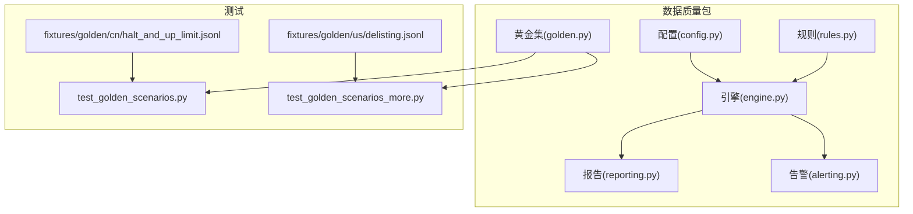
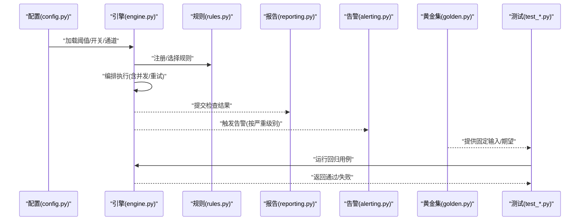
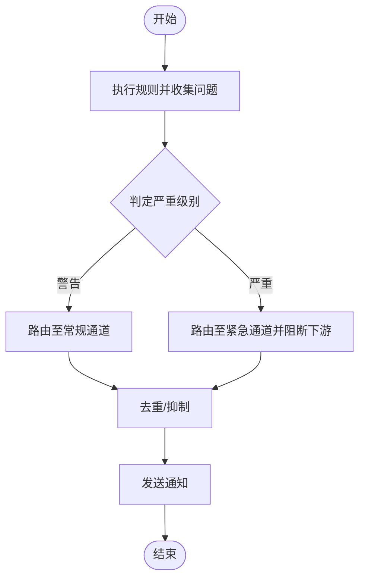
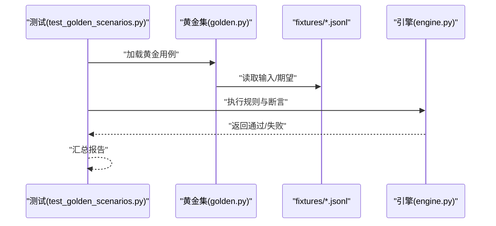
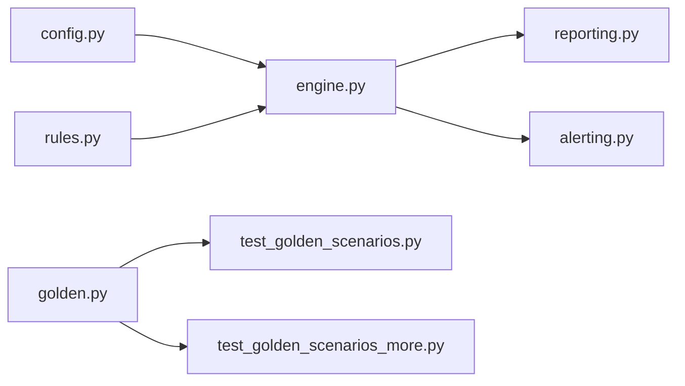

# 数据质量控制

<cite>
**本文引用的文件**   
- [packages/data_quality/__init__.py](file://packages/data_quality/__init__.py)
- [packages/data_quality/quality.py](file://packages/data_quality/quality.py)
- [packages/data_quality/rules.py](file://packages/data_quality/rules.py)
- [packages/data_quality/engine.py](file://packages/data_quality/engine.py)
- [packages/data_quality/reporting.py](file://packages/data_quality/reporting.py)
- [packages/data_quality/alerting.py](file://packages/data_quality/alerting.py)
- [packages/data_quality/config.py](file://packages/data_quality/config.py)
- [packages/data_quality/golden.py](file://packages/data_quality/golden.py)
- [tests/unit/test_golden_scenarios.py](file://tests/unit/test_golden_scenarios.py)
- [tests/unit/test_golden_scenarios_more.py](file://tests/unit/test_golden_scenarios_more.py)
- [tests/fixtures/golden/cn/halt_and_up_limit.jsonl](file://tests/fixtures/golden/cn/halt_and_up_limit.jsonl)
- [tests/fixtures/golden/us/delisting.jsonl](file://tests/fixtures/golden/us/dellisting.jsonl)
</cite>

## 目录
1. [简介](#简介)
2. [项目结构](#项目结构)
3. [核心组件](#核心组件)
4. [架构总览](#架构总览)
5. [详细组件分析](#详细组件分析)
6. [依赖关系分析](#依赖关系分析)
7. [性能考量](#性能考量)
8. [故障排查指南](#故障排查指南)
9. [结论](#结论)
10. [附录](#附录)

## 简介
本技术文档围绕“数据质量控制”主题，系统化阐述指标定义、监控体系、完整性与准确性校验、时效性监控、阈值配置与管理、自动检测与告警流程、质量报告生成与分析方法，以及黄金数据集的使用与测试策略。同时给出扩展点与自定义规则开发指南，帮助读者在现有工程基础上快速落地可维护的数据质量保障方案。

## 项目结构
数据质量控制能力集中在 packages/data_quality 包中，并通过 tests 下的单元测试与 fixtures 中的黄金数据集进行验证与回归。整体采用“规则-引擎-报告-告警-配置-黄金集”的分层设计：
- 规则层：定义各类质量检查规则（完整性、准确性、时效性等）
- 引擎层：编排执行规则、聚合结果、驱动报告与告警
- 报告层：输出结构化质量报告，支持多种渠道
- 告警层：将严重问题推送至外部系统或内部通道
- 配置层：集中管理质量阈值、开关与路由
- 黄金集：提供覆盖关键场景的固定输入/期望，用于回归与验收

图表来源
- [packages/data_quality/config.py](file://packages/data_quality/config.py)
- [packages/data_quality/rules.py](file://packages/data_quality/rules.py)
- [packages/data_quality/engine.py](file://packages/data_quality/engine.py)
- [packages/data_quality/reporting.py](file://packages/data_quality/reporting.py)
- [packages/data_quality/alerting.py](file://packages/data_quality/alerting.py)
- [packages/data_quality/golden.py](file://packages/data_quality/golden.py)
- [tests/unit/test_golden_scenarios.py](file://tests/unit/test_golden_scenarios.py)
- [tests/unit/test_golden_scenarios_more.py](file://tests/unit/test_golden_scenarios_more.py)
- [tests/fixtures/golden/cn/halt_and_up_limit.jsonl](file://tests/fixtures/golden/cn/halt_and_up_limit.jsonl)
- [tests/fixtures/golden/us/dellisting.jsonl](file://tests/fixtures/golden/us/dellisting.jsonl)

章节来源
- [packages/data_quality/__init__.py](file://packages/data_quality/__init__.py)
- [packages/data_quality/config.py](file://packages/data_quality/config.py)
- [packages/data_quality/rules.py](file://packages/data_quality/rules.py)
- [packages/data_quality/engine.py](file://packages/data_quality/engine.py)
- [packages/data_quality/reporting.py](file://packages/data_quality/reporting.py)
- [packages/data_quality/alerting.py](file://packages/data_quality/alerting.py)
- [packages/data_quality/golden.py](file://packages/data_quality/golden.py)
- [tests/unit/test_golden_scenarios.py](file://tests/unit/test_golden_scenarios.py)
- [tests/unit/test_golden_scenarios_more.py](file://tests/unit/test_golden_scenarios_more.py)
- [tests/fixtures/golden/cn/halt_and_up_limit.jsonl](file://tests/fixtures/golden/cn/halt_and_up_limit.jsonl)
- [tests/fixtures/golden/us/dellisting.jsonl](file://tests/fixtures/golden/us/dellisting.jsonl)

## 核心组件
本节聚焦数据质量的核心模块职责与交互方式，为后续深入分析奠定基础。

- 配置管理
  - 负责加载与合并多环境配置，暴露质量阈值、开关、告警通道等参数
  - 提供默认值与校验，确保运行时一致性
- 规则定义
  - 以统一接口描述各项质量检查（完整性、准确性、时效性等）
  - 支持按维度（如市场、资产类别）选择与组合
- 执行引擎
  - 编排规则执行顺序、并行度、失败重试与熔断
  - 汇总检查结果并触发报告与告警
- 报告生成
  - 将检查结果序列化为结构化报告，支持导出与可视化
- 告警机制
  - 根据严重程度与阈值策略，向不同通道发送通知
- 黄金数据集
  - 提供覆盖关键业务场景的固定用例，支撑自动化回归与验收

章节来源
- [packages/data_quality/config.py](file://packages/data_quality/config.py)
- [packages/data_quality/rules.py](file://packages/data_quality/rules.py)
- [packages/data_quality/engine.py](file://packages/data_quality/engine.py)
- [packages/data_quality/reporting.py](file://packages/data_quality/reporting.py)
- [packages/data_quality/alerting.py](file://packages/data_quality/alerting.py)
- [packages/data_quality/golden.py](file://packages/data_quality/golden.py)

## 架构总览
下图展示了数据质量控制的端到端流程：从配置加载、规则注册、数据摄取、规则执行、结果聚合到报告与告警，以及黄金数据集驱动的回归测试。

图表来源
- [packages/data_quality/config.py](file://packages/data_quality/config.py)
- [packages/data_quality/engine.py](file://packages/data_quality/engine.py)
- [packages/data_quality/rules.py](file://packages/data_quality/rules.py)
- [packages/data_quality/reporting.py](file://packages/data_quality/reporting.py)
- [packages/data_quality/alerting.py](file://packages/data_quality/alerting.py)
- [packages/data_quality/golden.py](file://packages/data_quality/golden.py)
- [tests/unit/test_golden_scenarios.py](file://tests/unit/test_golden_scenarios.py)
- [tests/unit/test_golden_scenarios_more.py](file://tests/unit/test_golden_scenarios_more.py)

## 详细组件分析

### 指标定义与监控体系
- 指标分类
  - 完整性：记录缺失率、字段空值比例、时间序列连续性
  - 准确性：数值范围、逻辑一致性、跨源一致性
  - 时效性：数据到达延迟、窗口内覆盖率、最新时间戳
- 监控粒度
  - 按资产/市场/时间窗/数据源维度聚合
  - 支持滑动窗口统计与趋势对比
- 指标计算
  - 由规则层产出原始计数与比率，引擎层聚合为指标面板
  - 报告层持久化历史指标，便于回溯与基线对比

章节来源
- [packages/data_quality/rules.py](file://packages/data_quality/rules.py)
- [packages/data_quality/engine.py](file://packages/data_quality/engine.py)
- [packages/data_quality/reporting.py](file://packages/data_quality/reporting.py)

### 完整性检查
- 目标
  - 保证必要字段非空、主键唯一、时间戳连续、分区完整
- 实现要点
  - 规则层定义完整性断言；引擎层批量扫描并统计缺失分布
  - 对关键表/分区设置强约束，失败即阻断下游任务
- 典型场景
  - 交易日历缺失日、行情快照时间戳不连续、公司行为事件缺失

章节来源
- [packages/data_quality/rules.py](file://packages/data_quality/rules.py)
- [packages/data_quality/engine.py](file://packages/data_quality/engine.py)

### 准确性验证
- 目标
  - 校验数值合理性、逻辑一致性与跨源一致性
- 实现要点
  - 规则层定义范围/比值/差分/一致性校验；引擎层执行并记录偏差详情
  - 对异常样本采样留存，便于根因定位
- 典型场景
  - 价格跳变、复权前后不一致、基本面与行情冲突

章节来源
- [packages/data_quality/rules.py](file://packages/data_quality/rules.py)
- [packages/data_quality/engine.py](file://packages/data_quality/engine.py)

### 时效性监控
- 目标
  - 监控数据到达延迟、窗口覆盖率与最新时间戳
- 实现要点
  - 规则层基于时间窗口统计迟到与缺失；引擎层按调度周期评估
  - 结合告警策略，对持续超时进行升级处理
- 典型场景
  - 盘后数据延迟入库、盘中增量未按时刷新

章节来源
- [packages/data_quality/rules.py](file://packages/data_quality/rules.py)
- [packages/data_quality/engine.py](file://packages/data_quality/engine.py)

### 质量阈值配置与管理
- 配置项
  - 阈值：各指标的允许上限/下限
  - 开关：按规则/维度启用/禁用
  - 通道：告警接收方（邮件、IM、工单等）
- 管理机制
  - 多环境配置合并与校验
  - 动态重载与版本化管理
- 最佳实践
  - 分级阈值（警告/严重），灰度发布与回滚

章节来源
- [packages/data_quality/config.py](file://packages/data_quality/config.py)

### 自动检测与告警流程
- 流程
  - 规则执行产生问题清单 -> 引擎判定严重级别 -> 匹配阈值策略 -> 触发告警
- 告警策略
  - 去重与抑制：避免风暴
  - 升级与降级：依据持续时间与影响面
  - 路由：按市场/资产/数据源分发
- 闭环
  - 告警附带上下文（样本、指标、时间窗、变更关联）

图表来源
- [packages/data_quality/engine.py](file://packages/data_quality/engine.py)
- [packages/data_quality/alerting.py](file://packages/data_quality/alerting.py)

章节来源
- [packages/data_quality/engine.py](file://packages/data_quality/engine.py)
- [packages/data_quality/alerting.py](file://packages/data_quality/alerting.py)

### 质量报告生成与分析
- 内容
  - 指标概览、问题明细、趋势图、变更记录关联
- 输出
  - 结构化文件（JSON/CSV）、可视化页面、定时邮件
- 分析
  - 基线对比、回归检测、热点维度下钻

章节来源
- [packages/data_quality/reporting.py](file://packages/data_quality/reporting.py)

### 黄金数据集使用与测试策略
- 目的
  - 用固定输入/期望覆盖关键场景，确保规则与引擎稳定性
- 组织
  - 按市场/资产类别分目录存放 JSONL 用例
  - 每个用例包含输入数据、预期结果与断言说明
- 策略
  - 单元级回归：每次改动均运行全部黄金用例
  - 场景级演练：针对特定市场事件（停牌、涨跌停、除权除息、退市等）构造专项用例
  - 渐进式增强：新增场景逐步沉淀为黄金集

图表来源
- [tests/unit/test_golden_scenarios.py](file://tests/unit/test_golden_scenarios.py)
- [tests/unit/test_golden_scenarios_more.py](file://tests/unit/test_golden_scenarios_more.py)
- [packages/data_quality/golden.py](file://packages/data_quality/golden.py)
- [tests/fixtures/golden/cn/halt_and_up_limit.jsonl](file://tests/fixtures/golden/cn/halt_and_up_limit.jsonl)
- [tests/fixtures/golden/us/dellisting.jsonl](file://tests/fixtures/golden/us/dellisting.jsonl)

章节来源
- [tests/unit/test_golden_scenarios.py](file://tests/unit/test_golden_scenarios.py)
- [tests/unit/test_golden_scenarios_more.py](file://tests/unit/test_golden_scenarios_more.py)
- [packages/data_quality/golden.py](file://packages/data_quality/golden.py)
- [tests/fixtures/golden/cn/halt_and_up_limit.jsonl](file://tests/fixtures/golden/cn/halt_and_up_limit.jsonl)
- [tests/fixtures/golden/us/dellisting.jsonl](file://tests/fixtures/golden/us/dellisting.jsonl)

### 扩展点与自定义规则开发
- 扩展点
  - 规则接口：实现统一的检查函数签名，返回标准化结果
  - 规则注册：在引擎启动时按需注册/选择
  - 配置注入：通过配置层传入阈值与路由
- 开发步骤
  - 定义规则：明确输入、断言、严重级别与上下文
  - 编写用例：补充黄金数据集用例，覆盖边界与异常
  - 集成测试：在本地与 CI 中运行回归
  - 上线策略：灰度开启、观察指标、逐步放量

章节来源
- [packages/data_quality/rules.py](file://packages/data_quality/rules.py)
- [packages/data_quality/engine.py](file://packages/data_quality/engine.py)
- [packages/data_quality/config.py](file://packages/data_quality/config.py)

## 依赖关系分析
数据质量包内部依赖清晰：配置驱动引擎，引擎编排规则，结果汇聚至报告与告警；黄金集服务于测试层，不耦合生产路径。

图表来源
- [packages/data_quality/config.py](file://packages/data_quality/config.py)
- [packages/data_quality/engine.py](file://packages/data_quality/engine.py)
- [packages/data_quality/rules.py](file://packages/data_quality/rules.py)
- [packages/data_quality/reporting.py](file://packages/data_quality/reporting.py)
- [packages/data_quality/alerting.py](file://packages/data_quality/alerting.py)
- [packages/data_quality/golden.py](file://packages/data_quality/golden.py)
- [tests/unit/test_golden_scenarios.py](file://tests/unit/test_golden_scenarios.py)
- [tests/unit/test_golden_scenarios_more.py](file://tests/unit/test_golden_scenarios_more.py)

章节来源
- [packages/data_quality/__init__.py](file://packages/data_quality/__init__.py)
- [packages/data_quality/config.py](file://packages/data_quality/config.py)
- [packages/data_quality/engine.py](file://packages/data_quality/engine.py)
- [packages/data_quality/rules.py](file://packages/data_quality/rules.py)
- [packages/data_quality/reporting.py](file://packages/data_quality/reporting.py)
- [packages/data_quality/alerting.py](file://packages/data_quality/alerting.py)
- [packages/data_quality/golden.py](file://packages/data_quality/golden.py)
- [tests/unit/test_golden_scenarios.py](file://tests/unit/test_golden_scenarios.py)
- [tests/unit/test_golden_scenarios_more.py](file://tests/unit/test_golden_scenarios_more.py)

## 性能考量
- 规则执行
  - 并行化与批处理：按分区/时间窗并行执行，减少端到端耗时
  - 短路策略：高严重级别问题优先上报，必要时中断低优先级规则
- 资源控制
  - 限流与背压：防止下游存储/告警通道过载
  - 内存优化：流式处理大表，避免一次性加载
- 观测性
  - 指标埋点：规则执行时长、吞吐、错误率
  - 日志与追踪：关键路径打点，便于定位瓶颈

[本节为通用指导，无需具体文件引用]

## 故障排查指南
- 常见问题
  - 规则未生效：检查规则注册与配置开关
  - 告警风暴：确认去重与抑制策略是否启用
  - 报告缺失：核对报告输出路径与权限
- 定位步骤
  - 查看最近一次执行的规则清单与失败明细
  - 对照黄金用例，判断是否为回归问题
  - 检查配置变更与依赖服务状态
- 恢复建议
  - 临时降级：关闭高风险规则，保留核心完整性检查
  - 回滚配置：恢复到上一个稳定版本
  - 补充用例：将新发现场景沉淀为黄金集

章节来源
- [packages/data_quality/engine.py](file://packages/data_quality/engine.py)
- [packages/data_quality/alerting.py](file://packages/data_quality/alerting.py)
- [packages/data_quality/reporting.py](file://packages/data_quality/reporting.py)
- [packages/data_quality/config.py](file://packages/data_quality/config.py)

## 结论
通过将规则、引擎、报告、告警与配置解耦，并以黄金数据集驱动回归测试，本项目构建了可扩展、可观测、可治理的数据质量控制体系。建议在持续演进中完善指标口径、丰富黄金用例、强化告警闭环与灰度发布策略，从而提升数据可靠性与研发效率。

[本节为总结性内容，无需具体文件引用]

## 附录
- 术语
  - 完整性：数据是否存在与结构是否完备
  - 准确性：数据是否符合业务与逻辑约束
  - 时效性：数据是否在约定时间内可用
- 参考
  - 黄金用例目录：tests/fixtures/golden
  - 相关测试：tests/unit/test_golden_scenarios*.py

[本节为补充信息，无需具体文件引用]