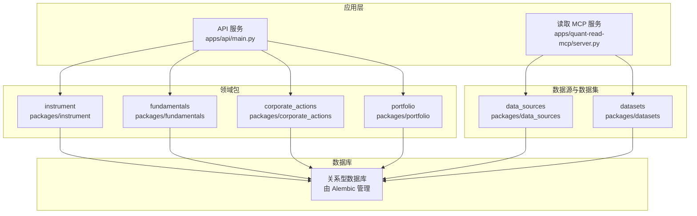
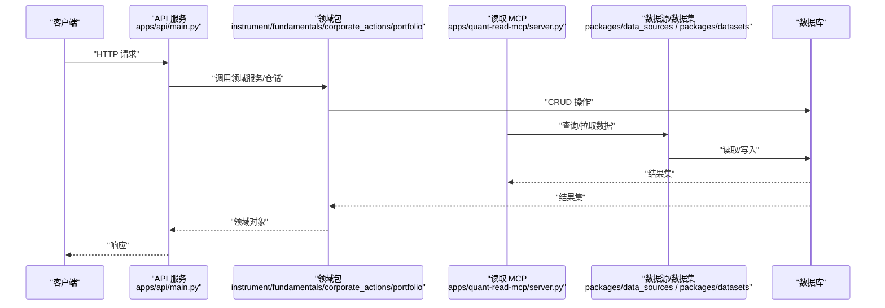
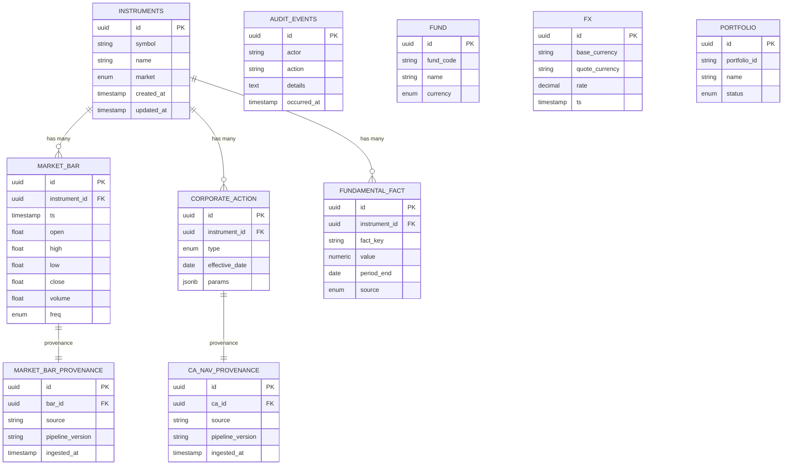
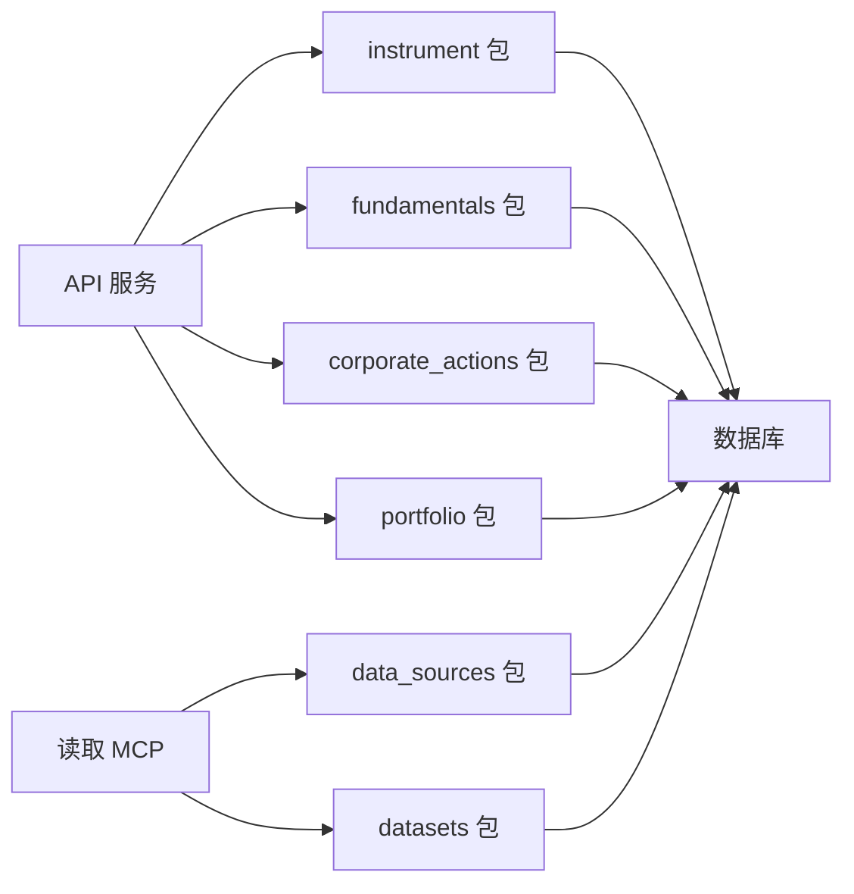

# 数据库设计

<cite>
**本文引用的文件**   
- [alembic.ini](file://alembic.ini)
- [sql/migrations/env.py](file://sql/migrations/env.py)
- [sql/migrations/script.py.mako](file://sql/migrations/script.py.mako)
- [sql/migrations/versions/20260715_0001_instruments.py](file://sql/migrations/versions/20260715_0001_instruments.py)
- [sql/migrations/versions/20260715_0002_audit_events.py](file://sql/migrations/versions/20260715_0002_audit_events.py)
- [sql/migrations/versions/20260715_0003_market_bar.py](file://sql/migrations/versions/20260715_0003_market_bar.py)
- [sql/migrations/versions/20260715_0004_corporate_action.py](file://sql/migrations/versions/20260715_0004_corporate_action.py)
- [sql/migrations/versions/20260715_0005_fundamental_fact.py](file://sql/migrations/versions/20260715_0005_fundamental_fact.py)
- [sql/migrations/versions/20260715_0006_fund_fx_portfolio.py](file://sql/migrations/versions/20260715_0006_fund_fx_portfolio.py)
- [sql/migrations/versions/20260715_0007_market_bar_provenance.py](file://sql/migrations/versions/20260715_0007_market_bar_provenance.py)
- [sql/migrations/versions/20260715_0008_ca_nav_provenance.py](file://sql/migrations/versions/20260715_0008_ca_nav_provenance.py)
- [apps/api/main.py](file://apps/api/main.py)
- [apps/api/deps.py](file://apps/api/deps.py)
- [apps/quant-read-mcp/db_backends.py](file://apps/quant-read-mcp/db_backends.py)
- [packages/data_sources/__init__.py](file://packages/data_sources/__init__.py)
- [packages/datasets/__init__.py](file://packages/datasets/__init__.py)
- [packages/instrument/__init__.py](file://packages/instrument/__init__.py)
- [packages/fundamentals/__init__.py](file://packages/fundamentals/__init__.py)
- [packages/corporate_actions/__init__.py](file://packages/corporate_actions/__init__.py)
- [packages/portfolio/__init__.py](file://packages/portfolio/__init__.py)
</cite>

## 目录
1. [简介](#简介)
2. [项目结构](#项目结构)
3. [核心组件](#核心组件)
4. [架构总览](#架构总览)
5. [详细组件分析](#详细组件分析)
6. [依赖关系分析](#依赖关系分析)
7. [性能考虑](#性能考虑)
8. [故障排查指南](#故障排查指南)
9. [结论](#结论)
10. [附录](#附录)

## 简介
本文件面向量化交易MCP系统的数据库设计与治理，覆盖实体关系、字段定义与数据类型、主外键与索引约束、数据验证与业务规则、模式图与示例数据、访问模式与缓存策略、性能优化、数据生命周期与归档、迁移路径与版本管理、数据安全与隐私以及访问控制。文档以Alembic迁移为核心依据，结合API与服务层对数据库的访问方式，给出可落地的设计说明与运维建议。

## 项目结构
系统采用“应用服务 + 包化领域模块 + Alembic迁移”的组织方式：
- 应用服务：FastAPI API（apps/api）、MCP读写服务（apps/quant-read-mcp）
- 领域包：instrument、fundamentals、corporate_actions、portfolio等（packages/*）
- 数据持久化：Alembic迁移脚本（sql/migrations/versions/*）
- 配置与运行：alembic.ini、env.py、script.py.mako

图表来源
- [apps/api/main.py](file://apps/api/main.py)
- [apps/quant-read-mcp/db_backends.py](file://apps/quant-read-mcp/db_backends.py)
- [packages/data_sources/__init__.py](file://packages/data_sources/__init__.py)
- [packages/datasets/__init__.py](file://packages/datasets/__init__.py)
- [packages/instrument/__init__.py](file://packages/instrument/__init__.py)
- [packages/fundamentals/__init__.py](file://packages/fundamentals/__init__.py)
- [packages/corporate_actions/__init__.py](file://packages/corporate_actions/__init__.py)
- [packages/portfolio/__init__.py](file://packages/portfolio/__init__.py)

章节来源
- [alembic.ini](file://alembic.ini)
- [sql/migrations/env.py](file://sql/migrations/env.py)
- [sql/migrations/script.py.mako](file://sql/migrations/script.py.mako)

## 核心组件
- 迁移框架：Alembic（配置文件 alembic.ini；环境脚本 env.py；模板 script.py.mako）
- 领域模型表族：
  - 标的与基础信息：instruments
  - 审计事件：audit_events
  - 行情K线：market_bar
  - 公司行为：corporate_action
  - 基本面事实：fundamental_fact
  - 基金/外汇/组合：fund, fx, portfolio（及关联实体）
  - 数据来源与血缘：market_bar_provenance, ca_nav_provenance

章节来源
- [sql/migrations/versions/20260715_0001_instruments.py](file://sql/migrations/versions/20260715_0001_instruments.py)
- [sql/migrations/versions/20260715_0002_audit_events.py](file://sql/migrations/versions/20260715_0002_audit_events.py)
- [sql/migrations/versions/20260715_0003_market_bar.py](file://sql/migrations/versions/20260715_0003_market_bar.py)
- [sql/migrations/versions/20260715_0004_corporate_action.py](file://sql/migrations/versions/20260715_0004_corporate_action.py)
- [sql/migrations/versions/20260715_0005_fundamental_fact.py](file://sql/migrations/versions/20260715_0005_fundamental_fact.py)
- [sql/migrations/versions/20260715_0006_fund_fx_portfolio.py](file://sql/migrations/versions/20260715_0006_fund_fx_portfolio.py)
- [sql/migrations/versions/20260715_0007_market_bar_provenance.py](file://sql/migrations/versions/20260715_0007_market_bar_provenance.py)
- [sql/migrations/versions/20260715_0008_ca_nav_provenance.py](file://sql/migrations/versions/20260715_0008_ca_nav_provenance.py)

## 架构总览
下图展示从API到数据库的整体访问路径，包括MCP读取端与数据源/数据集包的协作。

图表来源
- [apps/api/main.py](file://apps/api/main.py)
- [apps/quant-read-mcp/db_backends.py](file://apps/quant-read-mcp/db_backends.py)
- [packages/data_sources/__init__.py](file://packages/data_sources/__init__.py)
- [packages/datasets/__init__.py](file://packages/datasets/__init__.py)

## 详细组件分析

### 实体关系与字段定义（基于迁移）
以下ER图根据迁移文件中的表族进行归纳，展示主要实体及其关系。具体字段名、类型与约束以对应迁移文件为准。

图表来源
- [sql/migrations/versions/20260715_0001_instruments.py](file://sql/migrations/versions/20260715_0001_instruments.py)
- [sql/migrations/versions/20260715_0002_audit_events.py](file://sql/migrations/versions/20260715_0002_audit_events.py)
- [sql/migrations/versions/20260715_0003_market_bar.py](file://sql/migrations/versions/20260715_0003_market_bar.py)
- [sql/migrations/versions/20260715_0004_corporate_action.py](file://sql/migrations/versions/20260715_0004_corporate_action.py)
- [sql/migrations/versions/20260715_0005_fundamental_fact.py](file://sql/migrations/versions/20260715_0005_fundamental_fact.py)
- [sql/migrations/versions/20260715_0006_fund_fx_portfolio.py](file://sql/migrations/versions/20260715_0006_fund_fx_portfolio.py)
- [sql/migrations/versions/20260715_0007_market_bar_provenance.py](file://sql/migrations/versions/20260715_0007_market_bar_provenance.py)
- [sql/migrations/versions/20260715_0008_ca_nav_provenance.py](file://sql/migrations/versions/20260715_0008_ca_nav_provenance.py)

#### 关键实体说明
- instruments：标的主数据，包含标识、名称、市场等基础属性。
- audit_events：系统审计日志，记录操作者、动作与详情。
- market_bar：日/分钟级行情序列，含开高低收量等字段。
- corporate_action：拆合股、分红等公司行为事件。
- fundamental_fact：基本面指标快照，按标的与期间组织。
- fund/fx/portfolio：基金、汇率与投资组合相关实体。
- market_bar_provenance/ca_nav_provenance：数据血缘，记录来源与管线版本。

章节来源
- [sql/migrations/versions/20260715_0001_instruments.py](file://sql/migrations/versions/20260715_0001_instruments.py)
- [sql/migrations/versions/20260715_0002_audit_events.py](file://sql/migrations/versions/20260715_0002_audit_events.py)
- [sql/migrations/versions/20260715_0003_market_bar.py](file://sql/migrations/versions/20260715_0003_market_bar.py)
- [sql/migrations/versions/20260715_0004_corporate_action.py](file://sql/migrations/versions/20260715_0004_corporate_action.py)
- [sql/migrations/versions/20260715_0005_fundamental_fact.py](file://sql/migrations/versions/20260715_0005_fundamental_fact.py)
- [sql/migrations/versions/20260715_0006_fund_fx_portfolio.py](file://sql/migrations/versions/20260715_0006_fund_fx_portfolio.py)
- [sql/migrations/versions/20260715_0007_market_bar_provenance.py](file://sql/migrations/versions/20260715_0007_market_bar_provenance.py)
- [sql/migrations/versions/20260715_0008_ca_nav_provenance.py](file://sql/migrations/versions/20260715_0008_ca_nav_provenance.py)

### 主键/外键、索引与约束
- 主键：各表均使用自增或UUID主键（以迁移定义为准）。
- 外键：
  - market_bar.instrument_id → instruments.id
  - corporate_action.instrument_id → instruments.id
  - fundamental_fact.instrument_id → instruments.id
  - provenance 表通过 bar_id/ca_id 引用对应主题表
- 索引建议（结合查询模式）：
  - market_bar：(instrument_id, ts)、freq
  - corporate_action：(instrument_id, effective_date)
  - fundamental_fact：(instrument_id, fact_key, period_end)
  - audit_events：occurred_at、actor
  - fx：(base_currency, quote_currency, ts)
- 约束：
  - 时间戳非空、数值范围校验（如OHLCV非负）
  - 唯一性：symbol+market（instruments），fund_code（fund），currency pair+ts（fx）

章节来源
- [sql/migrations/versions/20260715_0003_market_bar.py](file://sql/migrations/versions/20260715_0003_market_bar.py)
- [sql/migrations/versions/20260715_0004_corporate_action.py](file://sql/migrations/versions/20260715_0004_corporate_action.py)
- [sql/migrations/versions/20260715_0005_fundamental_fact.py](file://sql/migrations/versions/20260715_0005_fundamental_fact.py)
- [sql/migrations/versions/20260715_0006_fund_fx_portfolio.py](file://sql/migrations/versions/20260715_0006_fund_fx_portfolio.py)
- [sql/migrations/versions/20260715_0007_market_bar_provenance.py](file://sql/migrations/versions/20260715_0007_market_bar_provenance.py)
- [sql/migrations/versions/20260715_0008_ca_nav_provenance.py](file://sql/migrations/versions/20260715_0008_ca_nav_provenance.py)

### 数据验证规则与业务规则
- 标的标识：symbol 与 market 组合唯一，避免重复标的。
- 行情数据：
  - OHLC 满足 high ≥ max(open,close)，low ≤ min(open,close)
  - volume ≥ 0
  - ts 严格递增（同标的同频）
- 公司行为：
  - effective_date 为交易日
  - params 中字段需与 type 匹配（如拆分比例≥1）
- 基本面：
  - fact_key 枚举白名单
  - period_end 与会计期一致
- 审计：
  - actor 必填，action 属于预定义集合
- 数据血缘：
  - source/pipeline_version 不可为空，用于溯源

章节来源
- [sql/migrations/versions/20260715_0003_market_bar.py](file://sql/migrations/versions/20260715_0003_market_bar.py)
- [sql/migrations/versions/20260715_0004_corporate_action.py](file://sql/migrations/versions/20260715_0004_corporate_action.py)
- [sql/migrations/versions/20260715_0005_fundamental_fact.py](file://sql/migrations/versions/20260715_0005_fundamental_fact.py)
- [sql/migrations/versions/20260715_0002_audit_events.py](file://sql/migrations/versions/20260715_0002_audit_events.py)
- [sql/migrations/versions/20260715_0007_market_bar_provenance.py](file://sql/migrations/versions/20260715_0007_market_bar_provenance.py)
- [sql/migrations/versions/20260715_0008_ca_nav_provenance.py](file://sql/migrations/versions/20260715_0008_ca_nav_provenance.py)

### 数据访问模式与缓存策略
- 访问模式：
  - 读多写少：行情与基本面以范围查询为主，按标的+时间窗口过滤
  - 批量写入：ETL/Ingestion 阶段大批量插入，建议使用事务与分批提交
  - 审计与血缘：追加写入，低延迟要求
- 缓存策略：
  - 热点标的当日行情：本地内存缓存（TTL 短）
  - 标的字典与元数据：长缓存（变更触发失效）
  - 组合持仓快照：定时刷新（盘前/盘后）
- 连接池：
  - 读写分离场景下，读库使用只读连接池，提升并发能力

章节来源
- [apps/api/deps.py](file://apps/api/deps.py)
- [apps/quant-read-mcp/db_backends.py](file://apps/quant-read-mcp/db_backends.py)

### 数据生命周期、保留与归档
- 生命周期：
  - 采集→清洗→入库→血缘记录→对外提供
- 保留策略：
  - 原始明细（如tick）短期保留，聚合K线长期保留
  - 审计日志按合规要求保留固定周期
- 归档规则：
  - 冷数据按月/季度归档至低成本存储
  - 归档后仅允许只读访问

章节来源
- [sql/migrations/versions/20260715_0007_market_bar_provenance.py](file://sql/migrations/versions/20260715_0007_market_bar_provenance.py)
- [sql/migrations/versions/20260715_0008_ca_nav_provenance.py](file://sql/migrations/versions/20260715_0008_ca_nav_provenance.py)

### 数据迁移路径与版本管理
- 工具链：Alembic（alembic.ini 配置；env.py 初始化；script.py.mako 模板）
- 版本顺序：
  - 0001_instruments
  - 0002_audit_events
  - 0003_market_bar
  - 0004_corporate_action
  - 0005_fundamental_fact
  - 0006_fund_fx_portfolio
  - 0007_market_bar_provenance
  - 0008_ca_nav_provenance
- 升级流程：
  - 开发分支创建新迁移
  - 本地测试通过后合并
  - 生产环境执行升级并回滚预案

章节来源
- [alembic.ini](file://alembic.ini)
- [sql/migrations/env.py](file://sql/migrations/env.py)
- [sql/migrations/script.py.mako](file://sql/migrations/script.py.mako)
- [sql/migrations/versions/20260715_0001_instruments.py](file://sql/migrations/versions/20260715_0001_instruments.py)
- [sql/migrations/versions/20260715_0002_audit_events.py](file://sql/migrations/versions/20260715_0002_audit_events.py)
- [sql/migrations/versions/20260715_0003_market_bar.py](file://sql/migrations/versions/20260715_0003_market_bar.py)
- [sql/migrations/versions/20260715_0004_corporate_action.py](file://sql/migrations/versions/20260715_0004_corporate_action.py)
- [sql/migrations/versions/20260715_0005_fundamental_fact.py](file://sql/migrations/versions/20260715_0005_fundamental_fact.py)
- [sql/migrations/versions/20260715_0006_fund_fx_portfolio.py](file://sql/migrations/versions/20260715_0006_fund_fx_portfolio.py)
- [sql/migrations/versions/20260715_0007_market_bar_provenance.py](file://sql/migrations/versions/20260715_0007_market_bar_provenance.py)
- [sql/migrations/versions/20260715_0008_ca_nav_provenance.py](file://sql/migrations/versions/20260715_0008_ca_nav_provenance.py)

### 数据安全、隐私与访问控制
- 最小权限：应用账号仅授予必要表的SELECT/INSERT/UPDATE权限
- 敏感字段：审计与用户相关字段加密存储（如需要）
- 传输安全：强制TLS，禁用明文协议
- 访问控制：
  - 读写分离：读库只读账号
  - 行级/列级权限：按业务域隔离
- 审计追踪：所有DDL/DML变更纳入审计

章节来源
- [sql/migrations/versions/20260715_0002_audit_events.py](file://sql/migrations/versions/20260715_0002_audit_events.py)

## 依赖关系分析
- 应用层依赖领域包，领域包依赖数据库
- 读取MCP通过数据源/数据集包访问数据库
- 迁移脚本独立于运行时，但决定最终Schema

图表来源
- [apps/api/main.py](file://apps/api/main.py)
- [apps/quant-read-mcp/db_backends.py](file://apps/quant-read-mcp/db_backends.py)
- [packages/data_sources/__init__.py](file://packages/data_sources/__init__.py)
- [packages/datasets/__init__.py](file://packages/datasets/__init__.py)
- [packages/instrument/__init__.py](file://packages/instrument/__init__.py)
- [packages/fundamentals/__init__.py](file://packages/fundamentals/__init__.py)
- [packages/corporate_actions/__init__.py](file://packages/corporate_actions/__init__.py)
- [packages/portfolio/__init__.py](file://packages/portfolio/__init__.py)

章节来源
- [apps/api/main.py](file://apps/api/main.py)
- [apps/quant-read-mcp/db_backends.py](file://apps/quant-read-mcp/db_backends.py)
- [packages/data_sources/__init__.py](file://packages/data_sources/__init__.py)
- [packages/datasets/__init__.py](file://packages/datasets/__init__.py)
- [packages/instrument/__init__.py](file://packages/instrument/__init__.py)
- [packages/fundamentals/__init__.py](file://packages/fundamentals/__init__.py)
- [packages/corporate_actions/__init__.py](file://packages/corporate_actions/__init__.py)
- [packages/portfolio/__init__.py](file://packages/portfolio/__init__.py)

## 性能考虑
- 索引设计：针对高频查询条件建立复合索引（instrument_id+ts、fact_key+period_end）
- 分区策略：按时间分区（月/周）降低扫描成本
- 批处理：写入采用批量插入与事务边界控制
- 连接池：合理设置最大连接数与超时，避免连接风暴
- 冷热分层：热数据驻留SSD，冷数据归档至低成本介质

[本节为通用指导，不直接分析具体文件]

## 故障排查指南
- 迁移失败：检查 alembic.ini 与 env.py 配置，确认目标库连通性与权限
- 数据不一致：通过 provenance 表追溯来源与管线版本
- 慢查询：定位缺失索引与全表扫描，补充复合索引或改写SQL
- 审计异常：核对 audit_events 记录，定位操作者与时间

章节来源
- [alembic.ini](file://alembic.ini)
- [sql/migrations/env.py](file://sql/migrations/env.py)
- [sql/migrations/versions/20260715_0007_market_bar_provenance.py](file://sql/migrations/versions/20260715_0007_market_bar_provenance.py)
- [sql/migrations/versions/20260715_0008_ca_nav_provenance.py](file://sql/migrations/versions/20260715_0008_ca_nav_provenance.py)
- [sql/migrations/versions/20260715_0002_audit_events.py](file://sql/migrations/versions/20260715_0002_audit_events.py)

## 结论
本设计以迁移为中心，明确了核心实体、关系与约束，并结合访问模式提出索引、分区与缓存策略。通过血缘与审计保障可追溯性与合规性，配合严格的迁移版本管理与安全策略，形成稳健的数据底座。

## 附录

### 示例数据（示意）
- instruments：示例标的“AAPL.US”，市场“US”，创建时间戳
- market_bar：某日开盘价、最高、最低、收盘、成交量
- corporate_action：拆股事件，生效日期与参数
- fundamental_fact：EPS、PE等指标，期间结束日
- audit_events：管理员修改标的信息的审计记录
- provenance：bar/ca 的来源与管线版本

[本节为概念性示例，不直接分析具体文件]