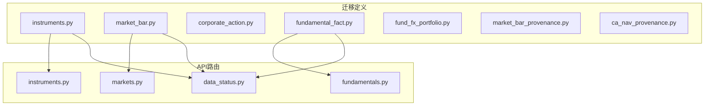
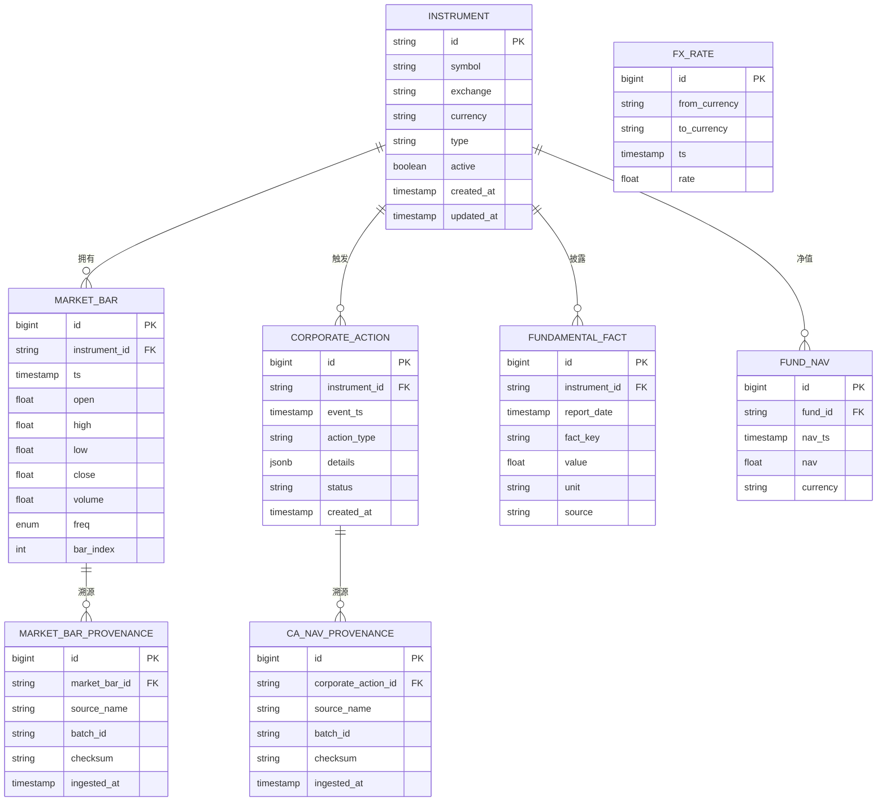
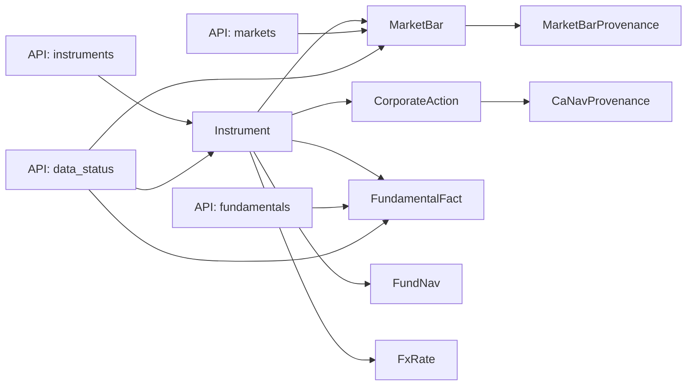

# 数据模型概览

<cite>
**本文引用的文件**   
- [20260715_0001_instruments.py](file://sql/migrations/versions/20260715_0001_instruments.py)
- [20260715_0003_market_bar.py](file://sql/migrations/versions/20260715_0003_market_bar.py)
- [20260715_0004_corporate_action.py](file://sql/migrations/versions/20260715_0004_corporate_action.py)
- [20260715_0005_fundamental_fact.py](file://sql/migrations/versions/20260715_0005_fundamental_fact.py)
- [20260715_0006_fund_fx_portfolio.py](file://sql/migrations/versions/20260715_0006_fund_fx_portfolio.py)
- [20260715_0007_market_bar_provenance.py](file://sql/migrations/versions/20260715_0007_market_bar_provenance.py)
- [20260715_0008_ca_nav_provenance.py](file://sql/migrations/versions/20260715_0008_ca_nav_provenance.py)
- [instruments.py](file://apps/api/routers/instruments.py)
- [markets.py](file://apps/api/routers/markets.py)
- [fundamentals.py](file://apps/api/routers/fundamentals.py)
- [data_status.py](file://apps/api/routers/data_status.py)
- [instrument_id_format.md](file://skills/cross-market-quant-research/references/instrument-id-format.md)
</cite>

## 目录
1. [简介](#简介)
2. [项目结构](#项目结构)
3. [核心组件](#核心组件)
4. [架构总览](#架构总览)
5. [详细组件分析](#详细组件分析)
6. [依赖关系分析](#依赖关系分析)
7. [性能考虑](#性能考虑)
8. [故障排查指南](#故障排查指南)
9. [结论](#结论)
10. [附录](#附录)

## 简介
本文件面向量化交易MCP系统的数据模型，聚焦数据库设计的核心概念与实体关系。文档围绕以下主要数据域展开：标的资产（Instrument）、市场数据（MarketBar）、公司行为（CorporateAction）、基本面数据（FundamentalFact），并补充基金与外汇、投资组合等跨市场实体。目标是帮助读者理解：
- 数据模型的层次结构与依赖关系
- 跨市场统一化的设计理念（统一的标的标识、时间轴、事件溯源）
- ER图与关键业务实体的关联关系
- 数据标准化与规范化策略

## 项目结构
数据模型以迁移脚本为核心载体，位于 sql/migrations/versions 下；API层通过路由暴露查询能力，便于验证模型可用性。

图表来源
- [20260715_0001_instruments.py](file://sql/migrations/versions/20260715_0001_instruments.py)
- [20260715_0003_market_bar.py](file://sql/migrations/versions/20260715_0003_market_bar.py)
- [20260715_0004_corporate_action.py](file://sql/migrations/versions/20260715_0004_corporate_action.py)
- [20260715_0005_fundamental_fact.py](file://sql/migrations/versions/20260715_0005_fundamental_fact.py)
- [20260715_0006_fund_fx_portfolio.py](file://sql/migrations/versions/20260715_0006_fund_fx_portfolio.py)
- [20260715_0007_market_bar_provenance.py](file://sql/migrations/versions/20260715_0007_market_bar_provenance.py)
- [20260715_0008_ca_nav_provenance.py](file://sql/migrations/versions/20260715_0008_ca_nav_provenance.py)
- [instruments.py](file://apps/api/routers/instruments.py)
- [markets.py](file://apps/api/routers/markets.py)
- [fundamentals.py](file://apps/api/routers/fundamentals.py)
- [data_status.py](file://apps/api/routers/data_status.py)

章节来源
- [20260715_0001_instruments.py](file://sql/migrations/versions/20260715_0001_instruments.py)
- [20260715_0003_market_bar.py](file://sql/migrations/versions/20260715_0003_market_bar.py)
- [20260715_0004_corporate_action.py](file://sql/migrations/versions/20260715_0004_corporate_action.py)
- [20260715_0005_fundamental_fact.py](file://sql/migrations/versions/20260715_0005_fundamental_fact.py)
- [20260715_0006_fund_fx_portfolio.py](file://sql/migrations/versions/20260715_0006_fund_fx_portfolio.py)
- [20260715_0007_market_bar_provenance.py](file://sql/migrations/versions/20260715_0007_market_bar_provenance.py)
- [20260715_0008_ca_nav_provenance.py](file://sql/migrations/versions/20260715_0008_ca_nav_provenance.py)
- [instruments.py](file://apps/api/routers/instruments.py)
- [markets.py](file://apps/api/routers/markets.py)
- [fundamentals.py](file://apps/api/routers/fundamentals.py)
- [data_status.py](file://apps/api/routers/data_status.py)

## 核心组件
- 标的资产（Instrument）：描述跨市场的唯一标的，包含代码、交易所、币种、类型、状态等元信息，是其他所有数据的锚点。
- 市场数据（MarketBar）：标准化的时序价格与成交量等OHLCV字段，按时间粒度组织，支持多市场统一接入。
- 公司行为（CorporateAction）：记录分红、拆合股、退市等影响持仓与价格的非交易事件，具备可追溯的源信息与版本控制。
- 基本面数据（FundamentalFact）：财务报表、估值指标等低频事实数据，按报告期与口径对齐，支撑因子与策略研究。
- 基金与外汇（Fund/FX）：扩展资产类别，提供净值、汇率等基础序列，纳入统一标的体系。
- 数据来源与溯源（Provenance）：为市场数据与公司行为附加来源、批次、校验结果等元数据，保障可审计与可回溯。

章节来源
- [20260715_0001_instruments.py](file://sql/migrations/versions/20260715_0001_instruments.py)
- [20260715_0003_market_bar.py](file://sql/migrations/versions/20260715_0003_market_bar.py)
- [20260715_0004_corporate_action.py](file://sql/migrations/versions/20260715_0004_corporate_action.py)
- [20260715_0005_fundamental_fact.py](file://sql/migrations/versions/20260715_0005_fundamental_fact.py)
- [20260715_0006_fund_fx_portfolio.py](file://sql/migrations/versions/20260715_0006_fund_fx_portfolio.py)
- [20260715_0007_market_bar_provenance.py](file://sql/migrations/versions/20260715_0007_market_bar_provenance.py)
- [20260715_0008_ca_nav_provenance.py](file://sql/migrations/versions/20260715_0008_ca_nav_provenance.py)

## 架构总览
下图展示跨市场统一化设计的关键思想：以“统一标的ID”为中心，将不同市场的数据（行情、公司行为、基本面、基金/外汇）统一到同一时间轴与语义空间，并通过溯源表保证数据可审计。

图表来源
- [20260715_0001_instruments.py](file://sql/migrations/versions/20260715_0001_instruments.py)
- [20260715_0003_market_bar.py](file://sql/migrations/versions/20260715_0003_market_bar.py)
- [20260715_0004_corporate_action.py](file://sql/migrations/versions/20260715_0004_corporate_action.py)
- [20260715_0005_fundamental_fact.py](file://sql/migrations/versions/20260715_0005_fundamental_fact.py)
- [20260715_0006_fund_fx_portfolio.py](file://sql/migrations/versions/20260715_0006_fund_fx_portfolio.py)
- [20260715_0007_market_bar_provenance.py](file://sql/migrations/versions/20260715_0007_market_bar_provenance.py)
- [20260715_0008_ca_nav_provenance.py](file://sql/migrations/versions/20260715_0008_ca_nav_provenance.py)

## 详细组件分析

### 标的资产（Instrument）
- 职责：作为全系统的唯一资产标识与元数据中心，承载跨市场识别所需的最小必要字段。
- 关键字段：统一ID、交易代码、交易所、币种、资产类型、活跃状态、时间戳。
- 设计要点：
  - 统一ID用于跨市场、跨数据源的稳定关联。
  - 活跃状态用于过滤退市或暂停交易的标的。
  - 与所有下游数据表建立外键关系，确保引用完整性。

章节来源
- [20260715_0001_instruments.py](file://sql/migrations/versions/20260715_0001_instruments.py)
- [instruments.py](file://apps/api/routers/instruments.py)
- [instrument_id_format.md](file://skills/cross-market-quant-research/references/instrument-id-format.md)

### 市场数据（MarketBar）
- 职责：存储标准化的时序行情数据，包括开盘、最高、最低、收盘、成交量及频率、索引等。
- 关键字段：标的ID、时间戳、OHLCV、频率、条序号。
- 设计要点：
  - 以标的和时间戳为主键维度，避免重复与乱序。
  - 频率与条序号辅助快速定位与窗口计算。
  - 与溯源表一对多关联，记录每条行情的来源与批次。

章节来源
- [20260715_0003_market_bar.py](file://sql/migrations/versions/20260715_0003_market_bar.py)
- [20260715_0007_market_bar_provenance.py](file://sql/migrations/versions/20260715_0007_market_bar_provenance.py)
- [markets.py](file://apps/api/routers/markets.py)

### 公司行为（CorporateAction）
- 职责：记录影响价格与持仓的公司事件，如分红、拆合股、退市等。
- 关键字段：标的ID、事件时间、事件类型、详情JSON、状态、时间戳。
- 设计要点：
  - 使用JSONB灵活表达不同事件类型的差异化字段。
  - 状态字段支持事件生命周期管理（待处理、已生效、回滚等）。
  - 与溯源表关联，记录事件来源与批次，便于审计与重放。

章节来源
- [20260715_0004_corporate_action.py](file://sql/migrations/versions/20260715_0004_corporate_action.py)
- [20260715_0008_ca_nav_provenance.py](file://sql/migrations/versions/20260715_0008_ca_nav_provenance.py)

### 基本面数据（FundamentalFact）
- 职责：存储低频财务与估值事实，按报告期与指标键组织。
- 关键字段：标的ID、报告日期、指标键、数值、单位、来源。
- 设计要点：
  - 指标键（fact_key）实现宽表式存储，便于横向扩展新指标。
  - 单位与来源字段保证可比性与可追溯性。
  - 与标的强关联，确保只允许有效标的的基本面数据入库。

章节来源
- [20260715_0005_fundamental_fact.py](file://sql/migrations/versions/20260715_0005_fundamental_fact.py)
- [fundamentals.py](file://apps/api/routers/fundamentals.py)

### 基金与外汇（Fund/FX）
- 职责：扩展资产类别，提供基金净值与汇率序列，纳入统一标的体系。
- 关键字段：
  - 基金净值：基金ID、净值时间、净值、币种。
  - 汇率：基准货币、目标货币、时间、汇率。
- 设计要点：
  - 基金ID与标的ID映射，保持跨市场一致性。
  - 汇率表支持任意货币对，便于多币种组合与风险折算。

章节来源
- [20260715_0006_fund_fx_portfolio.py](file://sql/migrations/versions/20260715_0006_fund_fx_portfolio.py)

### 数据来源与溯源（Provenance）
- 职责：为市场数据与公司行为附加来源、批次、校验和、入库时间等元数据。
- 关键字段：关联主表ID、来源名称、批次ID、校验和、入库时间。
- 设计要点：
  - 支持多源冲突检测与选择策略（基于校验和与来源优先级）。
  - 便于问题定位、回滚与增量同步。

章节来源
- [20260715_0007_market_bar_provenance.py](file://sql/migrations/versions/20260715_0007_market_bar_provenance.py)
- [20260715_0008_ca_nav_provenance.py](file://sql/migrations/versions/20260715_0008_ca_nav_provenance.py)

## 依赖关系分析
- 强依赖：MarketBar、CorporateAction、FundamentalFact、FundNav、FxRate均依赖Instrument，确保所有数据均可追溯到统一标的。
- 弱依赖：Provenance表仅依赖各自的主表，不反向耦合业务数据，便于独立维护与清理。
- 外部依赖：API路由层读取上述表并提供查询接口，供上层研究与交易系统使用。

图表来源
- [20260715_0001_instruments.py](file://sql/migrations/versions/20260715_0001_instruments.py)
- [20260715_0003_market_bar.py](file://sql/migrations/versions/20260715_0003_market_bar.py)
- [20260715_0004_corporate_action.py](file://sql/migrations/versions/20260715_0004_corporate_action.py)
- [20260715_0005_fundamental_fact.py](file://sql/migrations/versions/20260715_0005_fundamental_fact.py)
- [20260715_0006_fund_fx_portfolio.py](file://sql/migrations/versions/20260715_0006_fund_fx_portfolio.py)
- [20260715_0007_market_bar_provenance.py](file://sql/migrations/versions/20260715_0007_market_bar_provenance.py)
- [20260715_0008_ca_nav_provenance.py](file://sql/migrations/versions/20260715_0008_ca_nav_provenance.py)
- [instruments.py](file://apps/api/routers/instruments.py)
- [markets.py](file://apps/api/routers/markets.py)
- [fundamentals.py](file://apps/api/routers/fundamentals.py)
- [data_status.py](file://apps/api/routers/data_status.py)

章节来源
- [20260715_0001_instruments.py](file://sql/migrations/versions/20260715_0001_instruments.py)
- [20260715_0003_market_bar.py](file://sql/migrations/versions/20260715_0003_market_bar.py)
- [20260715_0004_corporate_action.py](file://sql/migrations/versions/20260715_0004_corporate_action.py)
- [20260715_0005_fundamental_fact.py](file://sql/migrations/versions/20260715_0005_fundamental_fact.py)
- [20260715_0006_fund_fx_portfolio.py](file://sql/migrations/versions/20260715_0006_fund_fx_portfolio.py)
- [20260715_0007_market_bar_provenance.py](file://sql/migrations/versions/20260715_0007_market_bar_provenance.py)
- [20260715_0008_ca_nav_provenance.py](file://sql/migrations/versions/20260715_0008_ca_nav_provenance.py)
- [instruments.py](file://apps/api/routers/instruments.py)
- [markets.py](file://apps/api/routers/markets.py)
- [fundamentals.py](file://apps/api/routers/fundamentals.py)
- [data_status.py](file://apps/api/routers/data_status.py)

## 性能考虑
- 索引建议：在MarketBar上针对（instrument_id, ts）建立复合索引，加速按标的与时窗查询；在FundamentalFact上针对（instrument_id, report_date）建立索引，提升财报拉取效率。
- 分区策略：对大表（MarketBar、FundamentalFact）可按时间范围分区，降低单表规模，提高扫描与归档性能。
- 写入批量化：批量插入时关闭自动提交、启用事务合并，减少锁竞争与磁盘IO。
- 缓存热点：对常用标的列表、汇率表进行内存缓存，降低热点查询延迟。
- 溯源表裁剪：定期归档历史批次，保留必要的校验和与来源信息，平衡可追溯性与存储成本。

[本节为通用性能指导，无需特定文件来源]

## 故障排查指南
- 数据缺失：通过data_status路由检查各标的最新时间与覆盖率，定位缺失时段与来源。
- 重复与冲突：比对MarketBar与CorporateAction的溯源表，依据checksum与source_name判断冲突来源，必要时执行去重或覆盖策略。
- 标的异常：检查Instrument的active状态与ID格式规范，确认是否因退市或ID不一致导致下游查询失败。
- 基本面对齐：核对FundamentalFact的报告日期与fact_key，确保口径一致与时间对齐。

章节来源
- [data_status.py](file://apps/api/routers/data_status.py)
- [20260715_0007_market_bar_provenance.py](file://sql/migrations/versions/20260715_0007_market_bar_provenance.py)
- [20260715_0008_ca_nav_provenance.py](file://sql/migrations/versions/20260715_0008_ca_nav_provenance.py)
- [20260715_0001_instruments.py](file://sql/migrations/versions/20260715_0001_instruments.py)
- [20260715_0005_fundamental_fact.py](file://sql/migrations/versions/20260715_0005_fundamental_fact.py)

## 结论
本数据模型以“统一标的ID”为核心，将多市场、多资产类别的数据统一到一致的语义与时间轴中，辅以溯源机制保障可审计与可回溯。通过标准化字段与规范化设计，系统具备良好的可扩展性与跨市场研究能力。建议在后续迭代中持续完善索引与分区策略，并结合业务场景优化查询路径与缓存策略。

[本节为总结性内容，无需特定文件来源]

## 附录
- 统一标的ID规范：参考跨市场研究技能中的ID格式说明，确保跨市场一致性与可读性。
- API示例：通过instruments、markets、fundamentals路由验证数据可用性与一致性。

章节来源
- [instrument_id_format.md](file://skills/cross-market-quant-research/references/instrument-id-format.md)
- [instruments.py](file://apps/api/routers/instruments.py)
- [markets.py](file://apps/api/routers/markets.py)
- [fundamentals.py](file://apps/api/routers/fundamentals.py)