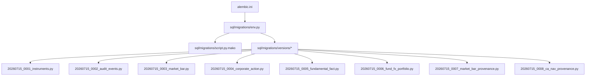
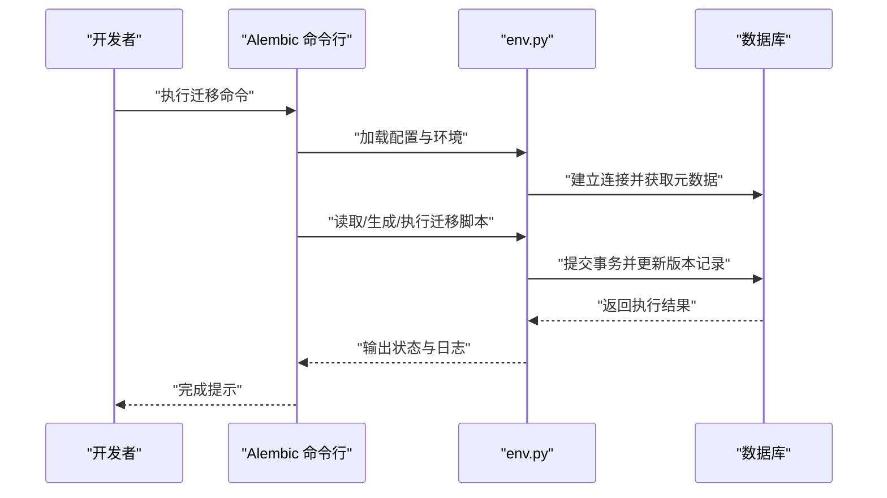
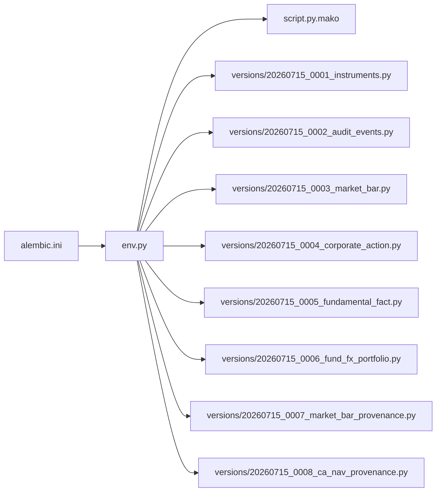

# 数据迁移管理

<cite>
**本文引用的文件**   
- [alembic.ini](file://alembic.ini)
- [sql/migrations/env.py](file://sql/migrations/env.py)
- [sql/migrations/script.py.mako](file://sql/migrations/script.py.mako)
- [sql/migrations/versions/20260715_0001_instruments.py](file://sql/migrations/versions/20260715_0001_instruments.py)
- [sql/migrations/versions/20260715_0002_audit_events.py](file://sql/migrations/versions/20260715_0002_audit_events.py)
- [sql/migrations/versions/20260715_0003_market_bar.py](file://sql/migrations/versions/20260715_0003_market_bar.py)
- [sql/migrations/versions/20260715_0004_corporate_action.py](file://sql/migrations/versions/20260715_0004_corporate_action.py)
- [sql/migrations/versions/20260715_0005_fundamental_fact.py](file://sql/migrations/versions/20260715_0005_fundamental_fact.py)
- [sql/migrations/versions/20260715_0006_fund_fx_portfolio.py](file://sql/migrations/versions/20260715_0006_fund_fx_portfolio.py)
- [sql/migrations/versions/20260715_0007_market_bar_provenance.py](file://sql/migrations/versions/20260715_0007_market_bar_provenance.py)
- [sql/migrations/versions/20260715_0008_ca_nav_provenance.py](file://sql/migrations/versions/20260715_0008_ca_nav_provenance.py)
- [pyproject.toml](file://pyproject.toml)
</cite>

## 目录
1. [简介](#简介)
2. [项目结构](#项目结构)
3. [核心组件](#核心组件)
4. [架构总览](#架构总览)
5. [详细组件分析](#详细组件分析)
6. [依赖分析](#依赖分析)
7. [性能考虑](#性能考虑)
8. [故障排查指南](#故障排查指南)
9. [结论](#结论)
10. [附录](#附录)

## 简介
本文件面向使用 Alembic 进行数据库版本化管理的团队与个人，围绕以下目标提供完整、可操作的指导：
- 配置与使用 Alembic 迁移框架
- 迁移脚本的生成规范与命名约定
- 版本控制策略与回滚机制
- 生产环境最佳实践与安全考量
- 迁移测试与验证流程
- 并发访问与数据一致性保证
- 迁移故障恢复与应急处理方案

## 项目结构
本项目将 Alembic 相关资源集中放置在 sql/migrations 目录下，并通过 alembic.ini 作为命令行入口配置。迁移脚本位于 versions 子目录中，按时间戳+序号+描述的方式组织。

图示来源
- [alembic.ini](file://alembic.ini)
- [sql/migrations/env.py](file://sql/migrations/env.py)
- [sql/migrations/script.py.mako](file://sql/migrations/script.py.mako)
- [sql/migrations/versions/20260715_0001_instruments.py](file://sql/migrations/versions/20260715_0001_instruments.py)
- [sql/migrations/versions/20260715_0002_audit_events.py](file://sql/migrations/versions/20260715_0002_audit_events.py)
- [sql/migrations/versions/20260715_0003_market_bar.py](file://sql/migrations/versions/20260715_0003_market_bar.py)
- [sql/migrations/versions/20260715_0004_corporate_action.py](file://sql/migrations/versions/20260715_0004_corporate_action.py)
- [sql/migrations/versions/20260715_0005_fundamental_fact.py](file://sql/migrations/versions/20260715_0005_fundamental_fact.py)
- [sql/migrations/versions/20260715_0006_fund_fx_portfolio.py](file://sql/migrations/versions/20260715_0006_fund_fx_portfolio.py)
- [sql/migrations/versions/20260715_0007_market_bar_provenance.py](file://sql/migrations/versions/20260715_0007_market_bar_provenance.py)
- [sql/migrations/versions/20260715_0008_ca_nav_provenance.py](file://sql/migrations/versions/20260715_0008_ca_nav_provenance.py)

章节来源
- [alembic.ini](file://alembic.ini)
- [sql/migrations/env.py](file://sql/migrations/env.py)
- [sql/migrations/script.py.mako](file://sql/migrations/script.py.mako)
- [sql/migrations/versions/20260715_0001_instruments.py](file://sql/migrations/versions/20260715_0001_instruments.py)
- [sql/migrations/versions/20260715_0002_audit_events.py](file://sql/migrations/versions/20260715_0002_audit_events.py)
- [sql/migrations/versions/20260715_0003_market_bar.py](file://sql/migrations/versions/20260715_0003_market_bar.py)
- [sql/migrations/versions/20260715_0004_corporate_action.py](file://sql/migrations/versions/20260715_0004_corporate_action.py)
- [sql/migrations/versions/20260715_0005_fundamental_fact.py](file://sql/migrations/versions/20260715_0005_fundamental_fact.py)
- [sql/migrations/versions/20260715_0006_fund_fx_portfolio.py](file://sql/migrations/versions/20260715_0006_fund_fx_portfolio.py)
- [sql/migrations/versions/20260715_0007_market_bar_provenance.py](file://sql/migrations/versions/20260715_0007_market_bar_provenance.py)
- [sql/migrations/versions/20260715_0008_ca_nav_provenance.py](file://sql/migrations/versions/20260715_0008_ca_nav_provenance.py)

## 核心组件
- alembic.ini：Alembic 的命令行配置文件，包含数据库连接、迁移目录、日志等关键设置。
- env.py：Alembic 运行时的环境初始化脚本，负责加载配置、建立引擎、应用上下文与元数据。
- script.py.mako：迁移脚本模板，用于自动生成新迁移文件的骨架。
- versions/*：具体迁移脚本集合，每个文件代表一次不可逆或可回滚的数据库变更。

章节来源
- [alembic.ini](file://alembic.ini)
- [sql/migrations/env.py](file://sql/migrations/env.py)
- [sql/migrations/script.py.mako](file://sql/migrations/script.py.mako)
- [sql/migrations/versions/20260715_0001_instruments.py](file://sql/migrations/versions/20260715_0001_instruments.py)
- [sql/migrations/versions/20260715_0002_audit_events.py](file://sql/migrations/versions/20260715_0002_audit_events.py)
- [sql/migrations/versions/20260715_0003_market_bar.py](file://sql/migrations/versions/20260715_0003_market_bar.py)
- [sql/migrations/versions/20260715_0004_corporate_action.py](file://sql/migrations/versions/20260715_0004_corporate_action.py)
- [sql/migrations/versions/20260715_0005_fundamental_fact.py](file://sql/migrations/versions/20260715_0005_fundamental_fact.py)
- [sql/migrations/versions/20260715_0006_fund_fx_portfolio.py](file://sql/migrations/versions/20260715_0006_fund_fx_portfolio.py)
- [sql/migrations/versions/20260715_0007_market_bar_provenance.py](file://sql/migrations/versions/20260715_0007_market_bar_provenance.py)
- [sql/migrations/versions/20260715_0008_ca_nav_provenance.py](file://sql/migrations/versions/20260715_0008_ca_nav_provenance.py)

## 架构总览
下图展示了从命令行到 Alembic 运行时再到数据库的整体交互关系。

图示来源
- [alembic.ini](file://alembic.ini)
- [sql/migrations/env.py](file://sql/migrations/env.py)
- [sql/migrations/script.py.mako](file://sql/migrations/script.py.mako)
- [sql/migrations/versions/20260715_0001_instruments.py](file://sql/migrations/versions/20260715_0001_instruments.py)

## 详细组件分析

### Alembic 配置（alembic.ini）
- 作用：定义数据库连接字符串、迁移目录路径、日志级别、环境变量注入点等。
- 关键点：
  - 数据库 URL 应通过环境变量或外部配置中心注入，避免硬编码敏感信息。
  - 指定 migrations 目录为 sql/migrations，确保与项目结构一致。
  - 可配置多环境（开发/测试/生产）以切换不同的数据库实例。
- 建议：
  - 在 CI/CD 中使用只读权限账户进行迁移前校验，再切换到具备写权限的账户执行迁移。
  - 对生产环境的数据库 URL 启用加密存储与最小权限原则。

章节来源
- [alembic.ini](file://alembic.ini)

### 运行时环境（env.py）
- 作用：初始化 Alembic 运行上下文，加载配置、创建 SQLAlchemy 引擎、注册事件钩子、解析目标元数据。
- 关键点：
  - 从 alembic.ini 或环境变量读取数据库连接参数。
  - 根据目标数据库类型选择方言与连接池参数。
  - 支持批量操作与事务边界控制，提升大表迁移性能。
- 建议：
  - 在生产环境中开启连接池复用与超时保护。
  - 针对长耗时迁移，拆分多个小迁移以降低锁竞争风险。

章节来源
- [sql/migrations/env.py](file://sql/migrations/env.py)

### 迁移脚本模板（script.py.mako）
- 作用：为新迁移生成标准骨架，包括 revision 标识、upgrade/downgrade 函数占位符与注释说明。
- 关键点：
  - 自动填充时间戳与唯一 ID，便于排序与追踪。
  - 提供默认导入与上下文对象，减少样板代码。
- 建议：
  - 自定义模板以统一团队风格，如强制添加变更说明、影响范围评估字段。

章节来源
- [sql/migrations/script.py.mako](file://sql/migrations/script.py.mako)

### 迁移脚本集合（versions/*）
- 命名约定：采用“YYYYMMDD_序号_描述”格式，例如 20260715_0001_instruments.py。
- 内容结构：每个脚本包含 upgrade() 与 downgrade() 方法，分别实现正向与反向变更。
- 示例文件：
  - instruments、audit_events、market_bar、corporate_action、fundamental_fact、fund_fx_portfolio、market_bar_provenance、ca_nav_provenance 等。
- 建议：
  - 每次变更仅做单一职责的修改，保持脚本原子性。
  - 在升级与降级中保持一致的数据约束与索引策略。

章节来源
- [sql/migrations/versions/20260715_0001_instruments.py](file://sql/migrations/versions/20260715_0001_instruments.py)
- [sql/migrations/versions/20260715_0002_audit_events.py](file://sql/migrations/versions/20260715_0002_audit_events.py)
- [sql/migrations/versions/20260715_0003_market_bar.py](file://sql/migrations/versions/20260715_0003_market_bar.py)
- [sql/migrations/versions/20260715_0004_corporate_action.py](file://sql/migrations/versions/20260715_0004_corporate_action.py)
- [sql/migrations/versions/20260715_0005_fundamental_fact.py](file://sql/migrations/versions/20260715_0005_fundamental_fact.py)
- [sql/migrations/versions/20260715_0006_fund_fx_portfolio.py](file://sql/migrations/versions/20260715_0006_fund_fx_portfolio.py)
- [sql/migrations/versions/20260715_0007_market_bar_provenance.py](file://sql/migrations/versions/20260715_0007_market_bar_provenance.py)
- [sql/migrations/versions/20260715_0008_ca_nav_provenance.py](file://sql/migrations/versions/20260715_0008_ca_nav_provenance.py)

### 版本控制策略与回滚机制
- 版本控制：
  - 基于时间戳与序号的线性历史，确保迁移顺序可重现。
  - 禁止修改已发布的迁移脚本；如需修正，应新增迁移并在文档中说明。
- 回滚机制：
  - 每个迁移需提供 downgrade() 以实现安全回滚。
  - 回滚前应评估数据丢失风险与业务影响，必要时先备份。
- 分支与合并：
  - 主分支保持可部署状态，特性分支独立演进，合并前完成迁移冲突解决与回归测试。

章节来源
- [sql/migrations/versions/20260715_0001_instruments.py](file://sql/migrations/versions/20260715_0001_instruments.py)
- [sql/migrations/versions/20260715_0002_audit_events.py](file://sql/migrations/versions/20260715_0002_audit_events.py)
- [sql/migrations/versions/20260715_0003_market_bar.py](file://sql/migrations/versions/20260715_0003_market_bar.py)
- [sql/migrations/versions/20260715_0004_corporate_action.py](file://sql/migrations/versions/20260715_0004_corporate_action.py)
- [sql/migrations/versions/20260715_0005_fundamental_fact.py](file://sql/migrations/versions/20260715_0005_fundamental_fact.py)
- [sql/migrations/versions/20260715_0006_fund_fx_portfolio.py](file://sql/migrations/versions/20260715_0006_fund_fx_portfolio.py)
- [sql/migrations/versions/20260715_0007_market_bar_provenance.py](file://sql/migrations/versions/20260715_0007_market_bar_provenance.py)
- [sql/migrations/versions/20260715_0008_ca_nav_provenance.py](file://sql/migrations/versions/20260715_0008_ca_nav_provenance.py)

### 生产环境最佳实践与安全考虑
- 安全：
  - 数据库凭据通过环境变量或密钥管理服务注入，不在代码与配置文件中明文存放。
  - 使用最小权限账户执行迁移，限制 DDL/DML 范围。
- 稳定性：
  - 分阶段发布：先在预生产环境验证，再灰度至生产。
  - 为大表变更增加索引重建与统计信息更新步骤，降低查询退化风险。
- 可观测性：
  - 记录迁移开始/结束时间、受影响行数、错误堆栈，接入监控告警系统。

章节来源
- [alembic.ini](file://alembic.ini)
- [sql/migrations/env.py](file://sql/migrations/env.py)

### 迁移测试与验证流程
- 单元测试：
  - 使用内存数据库或轻量级数据库实例，快速验证迁移脚本的语法与基本逻辑。
- 集成测试：
  - 在接近生产的数据库版本上执行迁移，验证约束、索引与数据完整性。
- 回归测试：
  - 结合业务用例，确保迁移后接口与报表输出符合预期。
- 自动化：
  - 在 CI 流水线中加入迁移执行与回滚演练，失败即阻断发布。

章节来源
- [sql/migrations/env.py](file://sql/migrations/env.py)
- [sql/migrations/versions/20260715_0001_instruments.py](file://sql/migrations/versions/20260715_0001_instruments.py)

### 并发访问与数据一致性保证
- 并发控制：
  - 迁移期间尽量缩短锁持有时间，避免长时间阻塞读写。
  - 对于热点表，采用在线 DDL 或分批变更策略。
- 一致性：
  - 使用事务包裹迁移步骤，失败时自动回滚。
  - 对关键变更增加数据校验与审计日志，便于事后追溯。
- 幂等性：
  - 迁移脚本应具备幂等能力，重复执行不会产生副作用。

章节来源
- [sql/migrations/env.py](file://sql/migrations/env.py)
- [sql/migrations/versions/20260715_0001_instruments.py](file://sql/migrations/versions/20260715_0001_instruments.py)

### 迁移故障恢复与应急处理方案
- 常见故障：
  - 迁移中断导致版本不一致
  - 回滚失败或数据损坏
  - 生产环境锁等待超时
- 恢复步骤：
  - 检查当前迁移版本与期望版本差异，定位未完成的迁移。
  - 若部分成功，修复后重新执行；若完全失败，优先回滚至稳定版本。
  - 必要时从快照恢复数据库，并重新执行迁移序列。
- 应急措施：
  - 暂停非关键写入，降低锁竞争。
  - 启用只读模式，保障核心服务可用。
  - 通知相关方并记录事件，复盘改进流程。

章节来源
- [alembic.ini](file://alembic.ini)
- [sql/migrations/env.py](file://sql/migrations/env.py)

## 依赖分析
Alembic 在本项目中的依赖关系如下：
- alembic.ini 驱动命令行行为与运行时配置
- env.py 负责加载配置、建立连接与应用元数据
- script.py.mako 提供迁移脚本模板
- versions/* 是具体的迁移实现，受 env.py 与 alembic.ini 共同约束

图示来源
- [alembic.ini](file://alembic.ini)
- [sql/migrations/env.py](file://sql/migrations/env.py)
- [sql/migrations/script.py.mako](file://sql/migrations/script.py.mako)
- [sql/migrations/versions/20260715_0001_instruments.py](file://sql/migrations/versions/20260715_0001_instruments.py)
- [sql/migrations/versions/20260715_0002_audit_events.py](file://sql/migrations/versions/20260715_0002_audit_events.py)
- [sql/migrations/versions/20260715_0003_market_bar.py](file://sql/migrations/versions/20260715_0003_market_bar.py)
- [sql/migrations/versions/20260715_0004_corporate_action.py](file://sql/migrations/versions/20260715_0004_corporate_action.py)
- [sql/migrations/versions/20260715_0005_fundamental_fact.py](file://sql/migrations/versions/20260715_0005_fundamental_fact.py)
- [sql/migrations/versions/20260715_0006_fund_fx_portfolio.py](file://sql/migrations/versions/20260715_0006_fund_fx_portfolio.py)
- [sql/migrations/versions/20260715_0007_market_bar_provenance.py](file://sql/migrations/versions/20260715_0007_market_bar_provenance.py)
- [sql/migrations/versions/20260715_0008_ca_nav_provenance.py](file://sql/migrations/versions/20260715_0008_ca_nav_provenance.py)

章节来源
- [alembic.ini](file://alembic.ini)
- [sql/migrations/env.py](file://sql/migrations/env.py)
- [sql/migrations/script.py.mako](file://sql/migrations/script.py.mako)
- [sql/migrations/versions/20260715_0001_instruments.py](file://sql/migrations/versions/20260715_0001_instruments.py)
- [sql/migrations/versions/20260715_0002_audit_events.py](file://sql/migrations/versions/20260715_0002_audit_events.py)
- [sql/migrations/versions/20260715_0003_market_bar.py](file://sql/migrations/versions/20260715_0003_market_bar.py)
- [sql/migrations/versions/20260715_0004_corporate_action.py](file://sql/migrations/versions/20260715_0004_corporate_action.py)
- [sql/migrations/versions/20260715_0005_fundamental_fact.py](file://sql/migrations/versions/20260715_0005_fundamental_fact.py)
- [sql/migrations/versions/20260715_0006_fund_fx_portfolio.py](file://sql/migrations/versions/20260715_0006_fund_fx_portfolio.py)
- [sql/migrations/versions/20260715_0007_market_bar_provenance.py](file://sql/migrations/versions/20260715_0007_market_bar_provenance.py)
- [sql/migrations/versions/20260715_0008_ca_nav_provenance.py](file://sql/migrations/versions/20260715_0008_ca_nav_provenance.py)

## 性能考虑
- 连接池与超时：合理配置连接池大小与超时，避免迁移期间连接耗尽。
- 批量操作：对大批量数据更新采用批量语句，减少往返开销。
- 索引与统计信息：在迁移前后重建必要索引并更新统计信息，提升查询性能。
- 分步迁移：将复杂变更拆分为多个小迁移，降低单次事务规模与锁竞争。

[本节为通用指导，不直接分析具体文件]

## 故障排查指南
- 常见问题定位：
  - 检查 alembic.ini 中的数据库连接是否正确。
  - 查看 env.py 的日志输出，确认迁移上下文是否初始化成功。
  - 核对 versions 下迁移脚本是否存在缺失或顺序异常。
- 回滚与恢复：
  - 使用回滚命令恢复到上一个稳定版本。
  - 若回滚失败，从最近快照恢复数据库并重新执行迁移序列。
- 预防与改进：
  - 在 CI 中增加迁移演练与回滚测试。
  - 引入迁移前校验与变更后数据一致性检查。

章节来源
- [alembic.ini](file://alembic.ini)
- [sql/migrations/env.py](file://sql/migrations/env.py)
- [sql/migrations/versions/20260715_0001_instruments.py](file://sql/migrations/versions/20260715_0001_instruments.py)

## 结论
通过统一的 Alembic 配置、规范的迁移脚本命名与严格的版本控制策略，本项目实现了可追溯、可回滚、可测试的数据库变更管理。结合生产环境的安全与稳定性最佳实践，以及完善的故障恢复流程，能够显著降低迁移风险并提升交付质量。

[本节为总结性内容，不直接分析具体文件]

## 附录
- 常用命令参考（概念性说明）：
  - 生成迁移：根据模型或手动编写变更生成新迁移脚本
  - 升级迁移：将数据库升级到最新版本
  - 回滚迁移：回退到上一版本或指定版本
  - 显示历史：查看迁移历史与当前版本
- 依赖与工具链：
  - pyproject.toml 中声明了项目依赖与构建配置，确保 Alembic 及相关库版本一致。

章节来源
- [pyproject.toml](file://pyproject.toml)