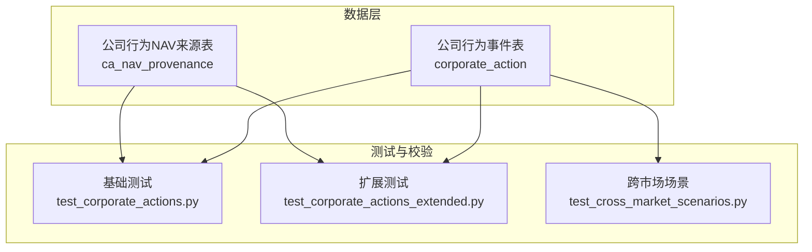
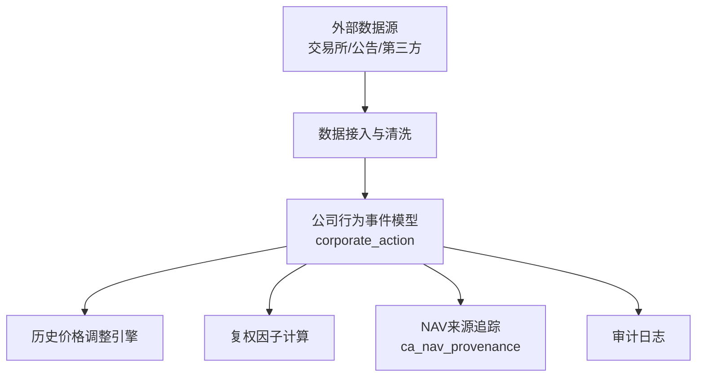
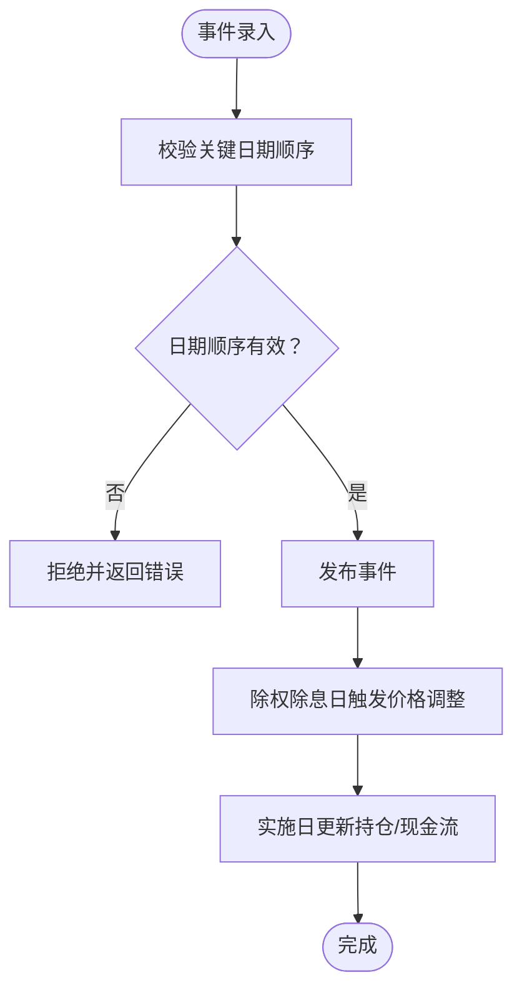
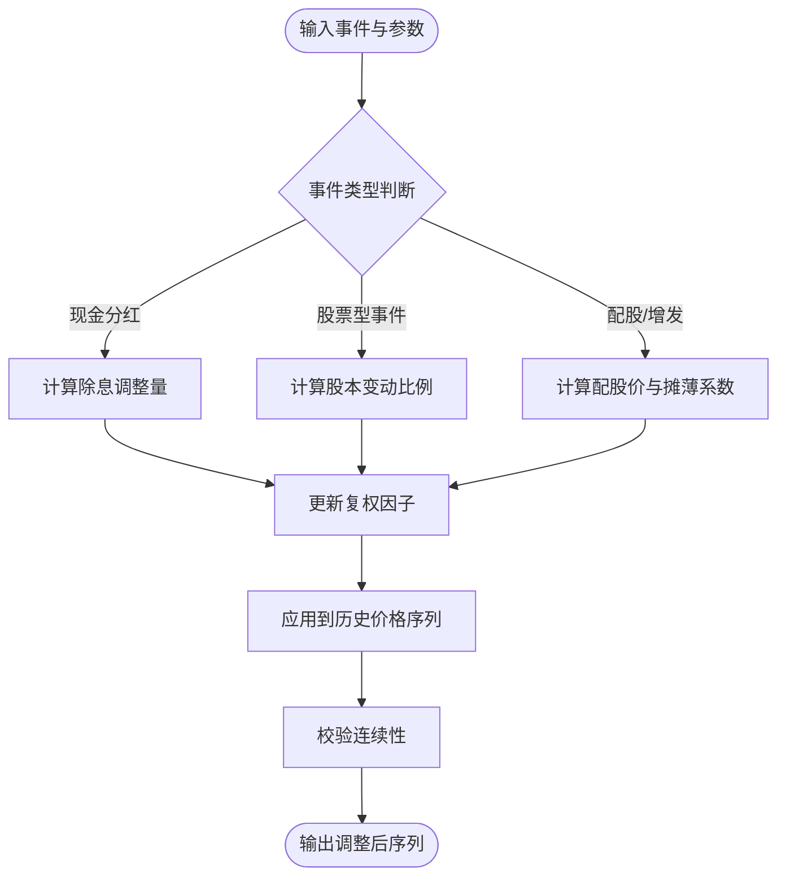
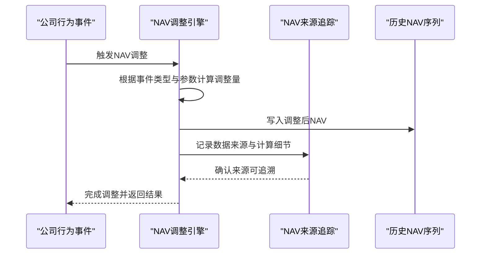
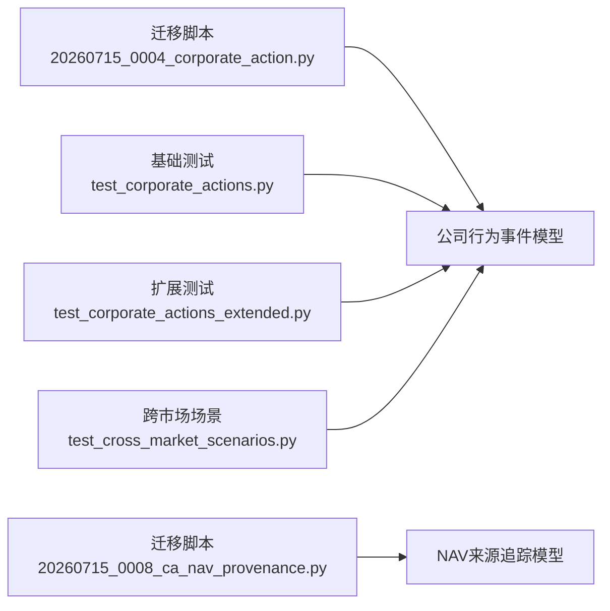

# 公司行为事件模型

<cite>
**本文引用的文件**   
- [20260715_0004_corporate_action.py](file://sql/migrations/versions/20260715_0004_corporate_action.py)
- [20260715_0008_ca_nav_provenance.py](file://sql/migrations/versions/20260715_0008_ca_nav_provenance.py)
- [test_corporate_actions.py](file://tests/unit/test_corporate_actions.py)
- [test_corporate_actions_extended.py](file://tests/unit/test_corporate_actions_extended.py)
- [test_cross_market_scenarios.py](file://tests/unit/test_cross_market_scenarios.py)
</cite>

## 目录
1. [简介](#简介)
2. [项目结构](#项目结构)
3. [核心组件](#核心组件)
4. [架构总览](#架构总览)
5. [详细组件分析](#详细组件分析)
6. [依赖关系分析](#依赖关系分析)
7. [性能考虑](#性能考虑)
8. [故障排查指南](#故障排查指南)
9. [结论](#结论)
10. [附录](#附录)

## 简介
本文件围绕公司行为事件（CorporateAction）实体，构建一套完整的数据模型与处理规范说明。内容覆盖：
- 公司行为类型体系：分红、拆股、合股、配股、退市等
- 时间轴管理：公告日、股权登记日、除权除息日、实施日
- 跨市场差异化规则：A股与美股的特殊处理
- 历史价格调整算法与复权因子计算
- NAV（净资产价值）调整的专门机制
- 验证规则与冲突检测
- 审计日志与数据来源追踪

## 项目结构
与公司行为事件相关的数据模型定义位于数据库迁移脚本中，测试用例覆盖了多市场场景与扩展逻辑。关键位置如下：
- 数据模型定义：sql/migrations/versions/20260715_0004_corporate_action.py
- NAV来源追踪：sql/migrations/versions/20260715_0008_ca_nav_provenance.py
- 单元测试与场景覆盖：tests/unit/test_corporate_actions.py、tests/unit/test_corporate_actions_extended.py、tests/unit/test_cross_market_scenarios.py

图表来源
- [20260715_0004_corporate_action.py](file://sql/migrations/versions/20260715_0004_corporate_action.py)
- [20260715_0008_ca_nav_provenance.py](file://sql/migrations/versions/20260715_0008_ca_nav_provenance.py)
- [test_corporate_actions.py](file://tests/unit/test_corporate_actions.py)
- [test_corporate_actions_extended.py](file://tests/unit/test_corporate_actions_extended.py)
- [test_cross_market_scenarios.py](file://tests/unit/test_cross_market_scenarios.py)

章节来源
- [20260715_0004_corporate_action.py](file://sql/migrations/versions/20260715_0004_corporate_action.py)
- [20260715_0008_ca_nav_provenance.py](file://sql/migrations/versions/20260715_0008_ca_nav_provenance.py)
- [test_corporate_actions.py](file://tests/unit/test_corporate_actions.py)
- [test_corporate_actions_extended.py](file://tests/unit/test_corporate_actions_extended.py)
- [test_cross_market_scenarios.py](file://tests/unit/test_cross_market_scenarios.py)

## 核心组件
本节聚焦公司行为事件的核心字段与约束，包括事件标识、标的、类型、金额/比例、关键日期、生效范围、状态与来源信息。

- 事件标识与标的
  - 主键：事件唯一标识
  - 标的标识：关联到具体证券或基金
  - 市场代码：用于区分不同市场的处理规则
- 事件类型
  - 支持类型包括但不限于：现金分红、股票分红、拆股、合股、配股、退市等
  - 类型决定后续的价格调整与复权因子计算路径
- 事件参数
  - 金额型：如每股派息金额
  - 比例型：如送股比例、转增比例、配股比例、换股比例
  - 费用与税费：按市场规则配置
- 时间轴字段
  - 公告日：首次公开披露的日期
  - 股权登记日：确定有权参与事件的股东名册截止日
  - 除权除息日：价格进行相应调整的交易日
  - 实施日：资金或股份实际到账/划转的日期
- 生效范围与版本控制
  - 生效起始日/结束日：限定事件影响的时间窗口
  - 版本号：便于回溯与修正
- 状态与来源
  - 状态：草稿、已发布、已失效等
  - 数据来源：记录原始来源系统或文件，便于溯源
  - 审计字段：创建/更新时间、操作者等

章节来源
- [20260715_0004_corporate_action.py](file://sql/migrations/versions/20260715_0004_corporate_action.py)

## 架构总览
下图展示了公司行为事件在系统中的角色：作为“事件源”，驱动历史价格调整、复权因子更新以及NAV调整；同时通过来源表实现可追溯性。

图表来源
- [20260715_0004_corporate_action.py](file://sql/migrations/versions/20260715_0004_corporate_action.py)
- [20260715_0008_ca_nav_provenance.py](file://sql/migrations/versions/20260715_0008_ca_nav_provenance.py)

## 详细组件分析

### 公司行为事件类型体系
- 分红类
  - 现金分红：以每股派息金额表示，影响除权除息日的开盘参考价
  - 股票分红/转增：以每持股送转比例表示，影响股本结构与复权因子
- 拆分与合并
  - 拆股：增加流通股数，降低单价，保持总市值不变
  - 合股：减少流通股数，提高单价，保持总市值不变
- 配股与增发
  - 配股：向现有股东按比例配售新股，通常附带配股价与缴款期
  - 增发：面向公众或特定对象发行新股，可能引入摊薄效应
- 退市
  - 终止上市交易，需对持仓与估值进行特殊处理
- 其他
  - 换股合并、红利再投资等可按扩展类型支持

章节来源
- [test_corporate_actions.py](file://tests/unit/test_corporate_actions.py)
- [test_corporate_actions_extended.py](file://tests/unit/test_corporate_actions_extended.py)

### 时间轴管理与关键日期
- 公告日：事件首次对外披露的日期，用于事件可见性与通知
- 股权登记日：确认享有权利的股东名单截止日，决定参与资格
- 除权除息日：价格调整基准日，历史K线在此日进行复权处理
- 实施日：资金或股份实际发放/到账日，用于现金流与持仓更新
- 生效范围：事件影响的起止日期，避免误触非目标区间

图表来源
- [20260715_0004_corporate_action.py](file://sql/migrations/versions/20260715_0004_corporate_action.py)

章节来源
- [20260715_0004_corporate_action.py](file://sql/migrations/versions/20260715_0004_corporate_action.py)

### 跨市场差异化处理（A股与美股）
- A股特殊规则
  - 除权除息日通常为T日，开盘前进行参考价调整
  - 配股缴款期与认购流程有明确时间窗
  - 涨跌停板与停牌规则影响事件执行时序
- 美股特殊规则
  - 除息日（Ex-Dividend）与支付日（Payable Date）分离
  - 股票股利与拆分通常在除权日自动调整
  - 退市流程包含最后交易日与清算安排
- 差异点体现在：
  - 日期语义与优先级
  - 价格调整公式中的税费与手续费
  - 复权因子的累积方式

章节来源
- [test_cross_market_scenarios.py](file://tests/unit/test_cross_market_scenarios.py)

### 历史价格调整与复权因子计算
- 调整目标
  - 保证历史价格序列的可比性，消除公司行为带来的不连续
- 调整方法
  - 前复权：将历史价格按复权因子折算至当前口径
  - 后复权：将未来价格按复权因子折算至历史口径
- 复权因子
  - 基于事件类型与参数计算，累计乘积形成最终因子
  - 对于现金分红，除权日收盘价需减去每股派息
  - 对于股票型事件，按股本变动比例调整价格
- 注意事项
  - 多事件叠加时的顺序与幂等性
  - 缺失参数的回退策略与默认值

图表来源
- [test_corporate_actions.py](file://tests/unit/test_corporate_actions.py)
- [test_corporate_actions_extended.py](file://tests/unit/test_corporate_actions_extended.py)

章节来源
- [test_corporate_actions.py](file://tests/unit/test_corporate_actions.py)
- [test_corporate_actions_extended.py](file://tests/unit/test_corporate_actions_extended.py)

### NAV（净资产价值）调整机制
- 适用范围
  - 主要针对基金类产品，公司行为会影响单位净值
- 调整原则
  - 现金分红：在除息日下调单位净值，反映资产流出
  - 股票型事件：按份额变动调整单位净值
- 来源追踪
  - 通过专门的来源表记录NAV调整的计算依据与数据出处，确保可审计与可回溯

图表来源
- [20260715_0008_ca_nav_provenance.py](file://sql/migrations/versions/20260715_0008_ca_nav_provenance.py)

章节来源
- [20260715_0008_ca_nav_provenance.py](file://sql/migrations/versions/20260715_0008_ca_nav_provenance.py)

### 验证规则与冲突检测
- 基本校验
  - 必填字段完整性：事件类型、标的、关键日期、参数
  - 日期顺序：公告日≤股权登记日≤除权除息日≤实施日
  - 数值范围：金额与比例需在合理区间内
- 冲突检测
  - 同一标的在同一时间段存在多个事件时的优先级与互斥规则
  - 重复事件的去重与幂等性检查
  - 与市场日历的兼容性（节假日、停牌）
- 失败处理
  - 明确的错误码与提示信息
  - 允许部分失败的补偿与重试策略

章节来源
- [test_corporate_actions.py](file://tests/unit/test_corporate_actions.py)
- [test_corporate_actions_extended.py](file://tests/unit/test_corporate_actions_extended.py)

### 审计日志与数据来源追踪
- 审计字段
  - 创建时间、更新时间、操作者、变更原因
- 数据来源
  - 记录原始来源系统、批次号、校验哈希
- NAV来源追踪
  - 针对NAV调整，单独记录计算过程与依据，确保可审计

章节来源
- [20260715_0004_corporate_action.py](file://sql/migrations/versions/20260715_0004_corporate_action.py)
- [20260715_0008_ca_nav_provenance.py](file://sql/migrations/versions/20260715_0008_ca_nav_provenance.py)

## 依赖关系分析
公司行为事件模型与其他模块的依赖关系如下：
- 数据层依赖：迁移脚本定义表结构与约束
- 测试依赖：单元测试与场景用例驱动模型的正确性与鲁棒性
- 业务依赖：价格调整引擎、复权因子计算、NAV调整引擎

图表来源
- [20260715_0004_corporate_action.py](file://sql/migrations/versions/20260715_0004_corporate_action.py)
- [20260715_0008_ca_nav_provenance.py](file://sql/migrations/versions/20260715_0008_ca_nav_provenance.py)
- [test_corporate_actions.py](file://tests/unit/test_corporate_actions.py)
- [test_corporate_actions_extended.py](file://tests/unit/test_corporate_actions_extended.py)
- [test_cross_market_scenarios.py](file://tests/unit/test_cross_market_scenarios.py)

章节来源
- [20260715_0004_corporate_action.py](file://sql/migrations/versions/20260715_0004_corporate_action.py)
- [20260715_0008_ca_nav_provenance.py](file://sql/migrations/versions/20260715_0008_ca_nav_provenance.py)
- [test_corporate_actions.py](file://tests/unit/test_corporate_actions.py)
- [test_corporate_actions_extended.py](file://tests/unit/test_corporate_actions_extended.py)
- [test_cross_market_scenarios.py](file://tests/unit/test_cross_market_scenarios.py)

## 性能考虑
- 批量调整
  - 对大量历史数据进行价格调整时，采用批处理与索引优化
- 幂等与缓存
  - 复权因子计算具备幂等性，避免重复计算
  - 对常用事件参数进行缓存，提升查询与计算效率
- 并发与一致性
  - 多事件并发写入时需保证事务一致性与锁粒度控制

[本节为通用指导，无需引用具体文件]

## 故障排查指南
- 常见问题
  - 日期顺序错误：检查公告日、股权登记日、除权除息日、实施日的先后关系
  - 参数缺失或不合法：核对金额与比例字段是否符合市场规则
  - 冲突事件：识别同一标的同时间段的多事件，调整优先级或去重
- 定位方法
  - 查看审计日志与数据来源追踪，确认事件录入与修改轨迹
  - 使用测试用例复现问题，逐步缩小范围
- 修复建议
  - 修正参数与日期后重新发布事件
  - 对受影响的历史序列进行增量重算与校验

章节来源
- [test_corporate_actions.py](file://tests/unit/test_corporate_actions.py)
- [test_corporate_actions_extended.py](file://tests/unit/test_corporate_actions_extended.py)

## 结论
公司行为事件模型通过清晰的类型体系、严格的时间轴管理、跨市场差异化规则、完善的调整与复权算法、以及强大的审计与来源追踪能力，为量化研究与交易系统的稳健运行提供了坚实基础。建议在持续演进中强化参数校验、冲突检测与性能优化，以提升整体数据质量与系统可靠性。

[本节为总结性内容，无需引用具体文件]

## 附录
- 术语解释
  - 除权除息日：价格调整基准日
  - 复权因子：用于统一历史价格口径的乘数
  - NAV：基金份额的净资产价值
- 参考文件
  - 数据模型定义：20260715_0004_corporate_action.py
  - NAV来源追踪：20260715_0008_ca_nav_provenance.py
  - 测试用例：test_corporate_actions.py、test_corporate_actions_extended.py、test_cross_market_scenarios.py

[本节为补充信息，无需引用具体文件]