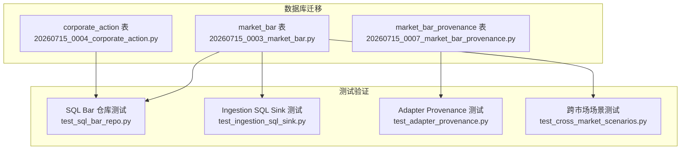
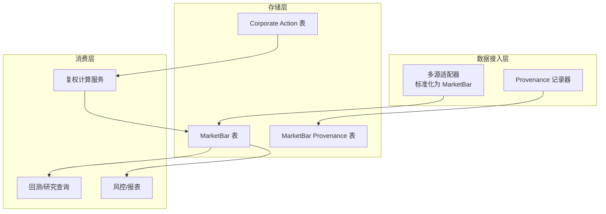
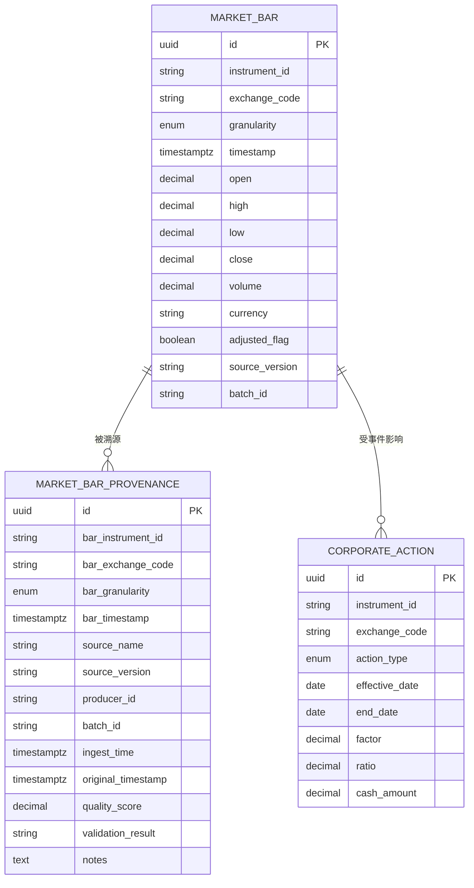
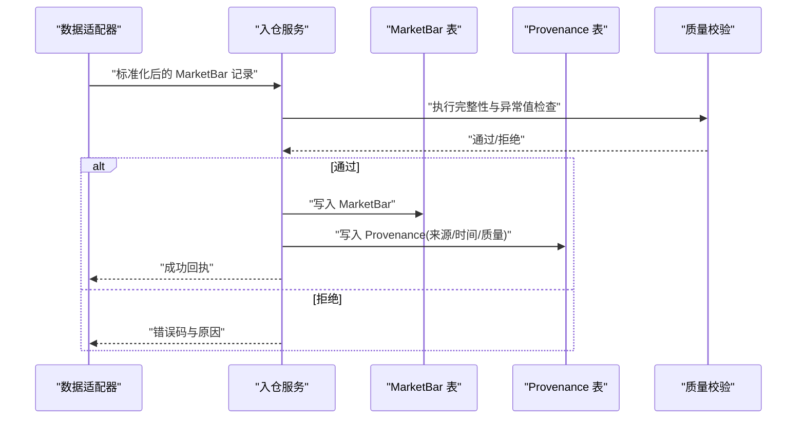
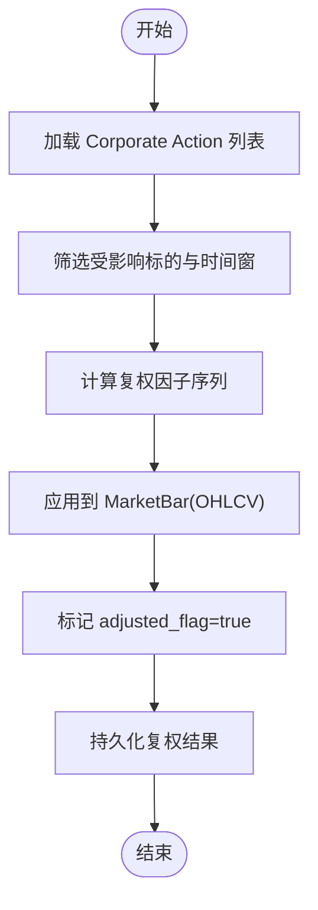
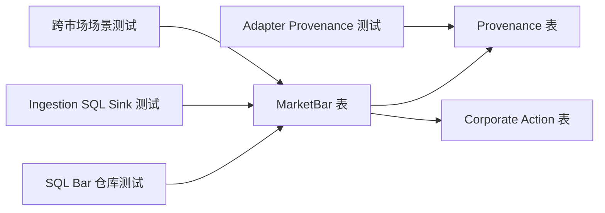

# 市场数据模型

<cite>
**本文引用的文件**   
- [20260715_0003_market_bar.py](file://sql/migrations/versions/20260715_0003_market_bar.py)
- [20260715_0007_market_bar_provenance.py](file://sql/migrations/versions/20260715_0007_market_bar_provenance.py)
- [20260715_0004_corporate_action.py](file://sql/migrations/versions/20260715_0004_corporate_action.py)
- [test_sql_bar_repo.py](file://tests/unit/test_sql_bar_repo.py)
- [test_ingestion_sql_sink.py](file://tests/unit/test_ingestion_sql_sink.py)
- [test_adapter_provenance.py](file://tests/unit/test_adapter_provenance.py)
- [test_cross_market_scenarios.py](file://tests/unit/test_cross_market_scenarios.py)
</cite>

## 目录
1. [简介](#简介)
2. [项目结构](#项目结构)
3. [核心组件](#核心组件)
4. [架构总览](#架构总览)
5. [详细组件分析](#详细组件分析)
6. [依赖关系分析](#依赖关系分析)
7. [性能考虑](#性能考虑)
8. [故障排查指南](#故障排查指南)
9. [结论](#结论)
10. [附录](#附录)

## 简介
本文件围绕 MarketBar（K线）实体，系统化阐述其数据模型设计、存储策略与治理机制。内容覆盖：
- 表结构与字段语义：时间戳、开盘价、最高价、最低价、收盘价、成交量等
- K线粒度与时序存储：分钟、小时、日等多粒度统一建模
- 数据来源追踪（Provenance）：来源标识、采集时间与质量评分
- 多市场统一格式与时区处理
- 完整性校验与异常值处理
- 索引与分区优化建议
- 与市场日历与公司行为事件的关联及调整机制

## 项目结构
MarketBar 相关的数据定义与测试主要位于迁移脚本与单元测试中：
- 数据模型定义：迁移脚本负责创建 MarketBar 主表与 Provenance 扩展表
- 公司行为事件：迁移脚本定义公司行为事件表，用于后续价格/复权调整
- 测试用例：覆盖 SQL 写入、查询、Provenance 记录与跨市场场景

图表来源
- [20260715_0003_market_bar.py](file://sql/migrations/versions/20260715_0003_market_bar.py)
- [20260715_0007_market_bar_provenance.py](file://sql/migrations/versions/20260715_0007_market_bar_provenance.py)
- [20260715_0004_corporate_action.py](file://sql/migrations/versions/20260715_0004_corporate_action.py)
- [test_sql_bar_repo.py](file://tests/unit/test_sql_bar_repo.py)
- [test_ingestion_sql_sink.py](file://tests/unit/test_ingestion_sql_sink.py)
- [test_adapter_provenance.py](file://tests/unit/test_adapter_provenance.py)
- [test_cross_market_scenarios.py](file://tests/unit/test_cross_market_scenarios.py)

章节来源
- [20260715_0003_market_bar.py](file://sql/migrations/versions/20260715_0003_market_bar.py)
- [20260715_0007_market_bar_provenance.py](file://sql/migrations/versions/20260715_0007_market_bar_provenance.py)
- [20260715_0004_corporate_action.py](file://sql/migrations/versions/20260715_0004_corporate_action.py)
- [test_sql_bar_repo.py](file://tests/unit/test_sql_bar_repo.py)
- [test_ingestion_sql_sink.py](file://tests/unit/test_ingestion_sql_sink.py)
- [test_adapter_provenance.py](file://tests/unit/test_adapter_provenance.py)
- [test_cross_market_scenarios.py](file://tests/unit/test_cross_market_scenarios.py)

## 核心组件
本节聚焦 MarketBar 主表及其 Provenance 扩展表的结构与职责边界。

- MarketBar 主表
  - 标识维度：交易标的、交易所/市场、币种/单位、K线粒度
  - 时序键：时间戳（建议采用 UTC 或带时区的时间类型）
  - OHLCV 字段：开盘价、最高价、最低价、收盘价、成交量
  - 元数据：货币、精度、是否复权后数据标记等
  - 约束：唯一性由“标的+粒度+时间戳”组合保证，避免重复写入

- MarketBar Provenance 表
  - 来源标识：数据源名称/版本/批次号
  - 采集时间：入库时间、原始时间戳
  - 质量评分：基于规则/统计的质量分
  - 审计信息：生产者、校验结果、备注

- Corporate Action 表（关联）
  - 事件类型：拆股、合股、分红、配股等
  - 生效日期：影响范围起止
  - 调整因子：用于历史价格/成交量的复权计算

章节来源
- [20260715_0003_market_bar.py](file://sql/migrations/versions/20260715_0003_market_bar.py)
- [20260715_0007_market_bar_provenance.py](file://sql/migrations/versions/20260715_0007_market_bar_provenance.py)
- [20260715_0004_corporate_action.py](file://sql/migrations/versions/20260715_0004_corporate_action.py)

## 架构总览
下图展示 MarketBar 在系统中的位置与关键交互：上游适配器将多源数据标准化为统一的 MarketBar 记录并附带 Provenance；下游消费端按标的与粒度进行查询与分析；公司行为事件驱动历史数据的复权调整。

图表来源
- [20260715_0003_market_bar.py](file://sql/migrations/versions/20260715_0003_market_bar.py)
- [20260715_0007_market_bar_provenance.py](file://sql/migrations/versions/20260715_0007_market_bar_provenance.py)
- [20260715_0004_corporate_action.py](file://sql/migrations/versions/20260715_0004_corporate_action.py)

## 详细组件分析

### MarketBar 主表设计
- 字段分组
  - 标识类：instrument_id、exchange_code、currency、granularity
  - 时序类：timestamp（建议带时区）
  - 行情类：open、high、low、close、volume
  - 元数据类：adjusted_flag、source_version、batch_id
- 约束与唯一性
  - 主键或唯一索引：(instrument_id, exchange_code, granularity, timestamp)
  - 非空约束：timestamp、OHLCV 必填
- 数据类型建议
  - 金额类使用定点数（如 DECIMAL），避免浮点误差
  - 时间戳使用带时区的 TIMESTAMP/TIMESTAMPTZ
- 业务规则
  - 同一标的同粒度下时间戳不可重复
  - close >= open/high/low 的区间一致性需在上游保障

章节来源
- [20260715_0003_market_bar.py](file://sql/migrations/versions/20260715_0003_market_bar.py)

### MarketBar Provenance 表设计
- 字段分组
  - 溯源键：bar_key(instrument_id, exchange_code, granularity, timestamp)
  - 来源信息：source_name、source_version、producer_id、batch_id
  - 采集时间：ingest_time、original_timestamp
  - 质量信息：quality_score、validation_result、notes
- 约束与索引
  - 主键：provenance_id
  - 唯一索引：(bar_key, source_name, batch_id)
  - 查询索引：ingest_time、quality_score
- 用途
  - 可追溯每条 K 线的来源与质量，支持回溯与替换

章节来源
- [20260715_0007_market_bar_provenance.py](file://sql/migrations/versions/20260715_0007_market_bar_provenance.py)

### Corporate Action 表设计与复权联动
- 字段分组
  - 事件标识：action_id、instrument_id、exchange_code
  - 事件类型：split、dividend、rights_issue 等
  - 时间窗口：effective_date、end_date（可选）
  - 调整参数：factor、ratio、cash_amount 等
- 复权流程
  - 读取 Corporate Action 列表
  - 对受影响时间窗内的 MarketBar 应用因子
  - 生成 adjusted_flag=true 的复权序列或更新原表

章节来源
- [20260715_0004_corporate_action.py](file://sql/migrations/versions/20260715_0004_corporate_action.py)

### 数据模型关系图

图表来源
- [20260715_0003_market_bar.py](file://sql/migrations/versions/20260715_0003_market_bar.py)
- [20260715_0007_market_bar_provenance.py](file://sql/migrations/versions/20260715_0007_market_bar_provenance.py)
- [20260715_0004_corporate_action.py](file://sql/migrations/versions/20260715_0004_corporate_action.py)

### 入库与溯源流程（序列图）

图表来源
- [test_ingestion_sql_sink.py](file://tests/unit/test_ingestion_sql_sink.py)
- [test_adapter_provenance.py](file://tests/unit/test_adapter_provenance.py)

### 复权调整流程（流程图）

图表来源
- [20260715_0004_corporate_action.py](file://sql/migrations/versions/20260715_0004_corporate_action.py)
- [20260715_0003_market_bar.py](file://sql/migrations/versions/20260715_0003_market_bar.py)

## 依赖关系分析
- 直接依赖
  - MarketBar 主表依赖 Corporate Action 表以完成复权
  - Provenance 表依赖 MarketBar 主表的键空间以建立溯源关系
- 间接依赖
  - 测试用例验证写入、查询与溯源链路，确保模型契约稳定
- 耦合与内聚
  - 主表与 Provenance 解耦，便于独立扩容与归档
  - Corporate Action 作为外部事件源，通过批处理与增量任务联动

图表来源
- [20260715_0003_market_bar.py](file://sql/migrations/versions/20260715_0003_market_bar.py)
- [20260715_0007_market_bar_provenance.py](file://sql/migrations/versions/20260715_0007_market_bar_provenance.py)
- [20260715_0004_corporate_action.py](file://sql/migrations/versions/20260715_0004_corporate_action.py)
- [test_sql_bar_repo.py](file://tests/unit/test_sql_bar_repo.py)
- [test_ingestion_sql_sink.py](file://tests/unit/test_ingestion_sql_sink.py)
- [test_adapter_provenance.py](file://tests/unit/test_adapter_provenance.py)
- [test_cross_market_scenarios.py](file://tests/unit/test_cross_market_scenarios.py)

## 性能考虑
- 索引设计
  - 主键/唯一索引：(instrument_id, exchange_code, granularity, timestamp)
  - 查询加速：按 (exchange_code, timestamp)、(instrument_id, timestamp) 的复合索引
  - Provenance 查询：(bar_instrument_id, bar_timestamp)、(ingest_time)、(quality_score)
- 分区策略
  - 按时间范围分区（月/周），利于冷热分离与批量清理
  - 结合标的维度进行子分区（如按 exchange_code 或 instrument_id 前缀）
- 写入优化
  - 批量插入与事务合并
  - 幂等写入：基于唯一键的 upsert 逻辑
- 存储优化
  - 金额字段使用定点数，避免浮点误差
  - 大表归档至历史分区或对象存储

[本节为通用性能建议，不直接分析具体文件]

## 故障排查指南
- 常见写入问题
  - 重复键冲突：检查 (instrument_id, exchange_code, granularity, timestamp) 唯一性
  - 缺失字段：timestamp/OHLCV 非空约束失败
  - 类型不匹配：金额/时间类型不一致
- 溯源与质量
  - Provenance 缺失：确认入仓路径包含溯源写入
  - 质量评分过低：根据 validation_result 定位规则失败项
- 复权异常
  - 事件时间窗未覆盖：核对 Corporate Action 的 effective_date/end_date
  - 因子异常：检查 factor/ratio/cash_amount 合理性

章节来源
- [test_ingestion_sql_sink.py](file://tests/unit/test_ingestion_sql_sink.py)
- [test_adapter_provenance.py](file://tests/unit/test_adapter_provenance.py)
- [test_sql_bar_repo.py](file://tests/unit/test_sql_bar_repo.py)

## 结论
MarketBar 模型以“统一格式 + 强约束 + 可溯源”为核心设计理念，配合 Corporate Action 实现历史价格复权，满足多市场、多粒度的研究与回测需求。通过合理的索引与分区策略，可在大规模数据规模下保持稳定的读写性能与可维护性。

[本节为总结性内容，不直接分析具体文件]

## 附录
- 术语
  - 粒度：K线聚合周期（分钟、小时、日等）
  - 复权：基于公司行为事件对历史价格/成交量进行调整
  - 溯源：记录数据从来源到入库的全链路信息
- 参考测试
  - SQL Bar 仓库读写与查询
  - Ingestion SQL Sink 端到端写入
  - Adapter Provenance 溯源记录
  - 跨市场场景一致性

章节来源
- [test_sql_bar_repo.py](file://tests/unit/test_sql_bar_repo.py)
- [test_ingestion_sql_sink.py](file://tests/unit/test_ingestion_sql_sink.py)
- [test_adapter_provenance.py](file://tests/unit/test_adapter_provenance.py)
- [test_cross_market_scenarios.py](file://tests/unit/test_cross_market_scenarios.py)