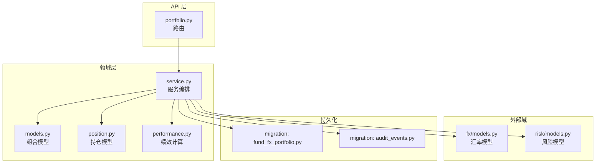
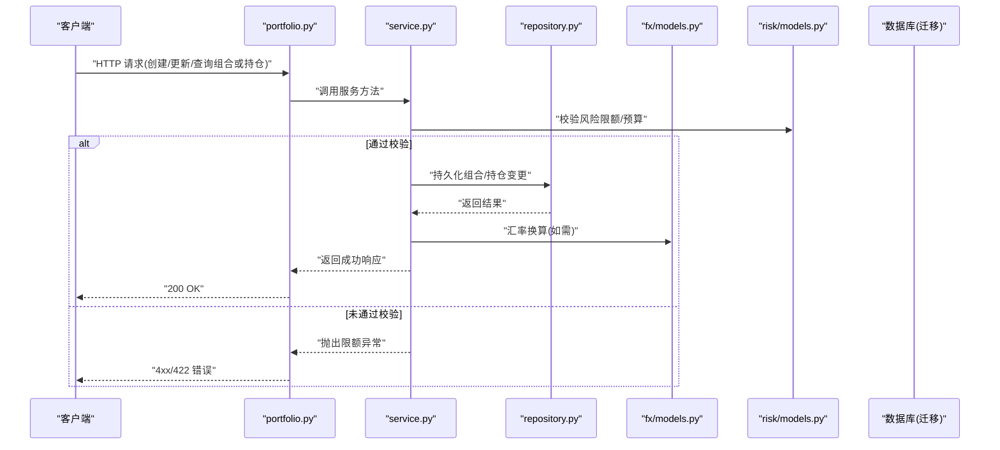
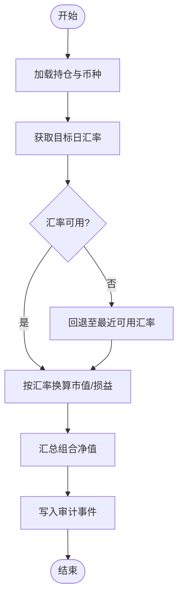
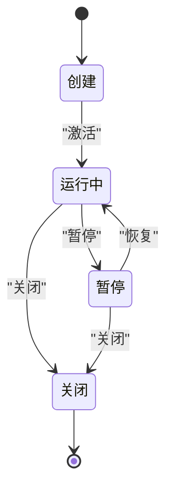
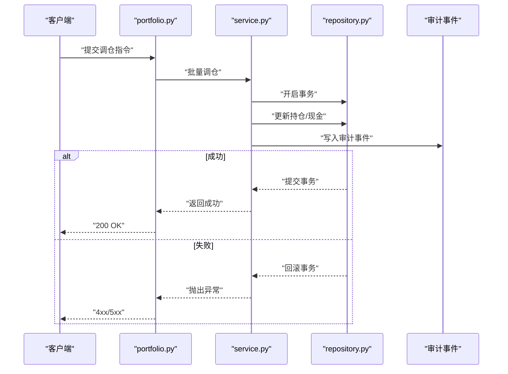
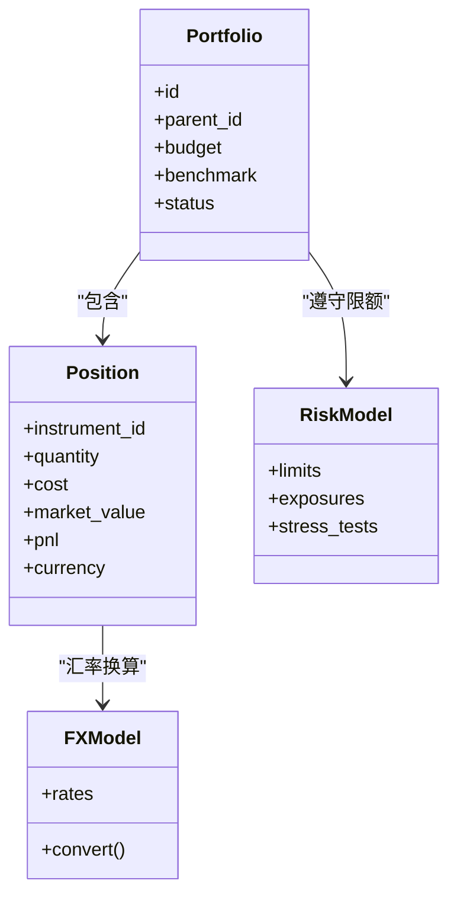
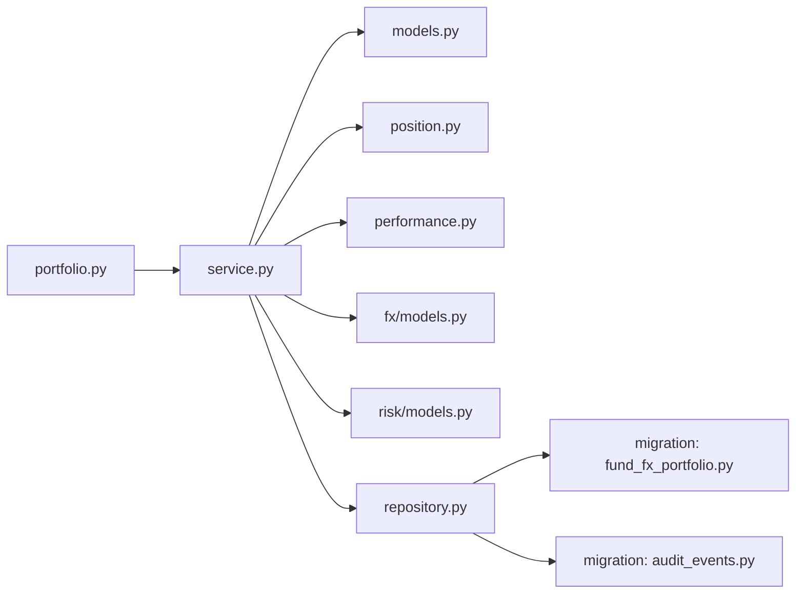

# 投资组合与持仓模型

<cite>
**本文引用的文件**   
- [apps/api/routers/portfolio.py](file://apps/api/routers/portfolio.py)
- [packages/portfolio/models.py](file://packages/portfolio/models.py)
- [packages/portfolio/service.py](file://packages/portfolio/service.py)
- [packages/portfolio/repository.py](file://packages/portfolio/repository.py)
- [packages/portfolio/position.py](file://packages/portfolio/position.py)
- [packages/portfolio/performance.py](file://packages/portfolio/performance.py)
- [packages/risk/models.py](file://packages/risk/models.py)
- [packages/fx/models.py](file://packages/fx/models.py)
- [sql/migrations/20260715_0006_fund_fx_portfolio.py](file://sql/migrations/20260715_0006_fund_fx_portfolio.py)
- [sql/migrations/20260715_0002_audit_events.py](file://sql/migrations/20260715_0002_audit_events.py)
</cite>

## 目录
1. [简介](#简介)
2. [项目结构](#项目结构)
3. [核心组件](#核心组件)
4. [架构总览](#架构总览)
5. [详细组件分析](#详细组件分析)
6. [依赖关系分析](#依赖关系分析)
7. [性能考虑](#性能考虑)
8. [故障排查指南](#故障排查指南)
9. [结论](#结论)
10. [附录](#附录)

## 简介
本文件面向“投资组合（Portfolio）”和“持仓（Position）”的数据模型与业务逻辑，系统性阐述：
- 组合的层次结构设计、风险预算分配与绩效基准设置
- 持仓记录的字段定义与多币种汇率处理、净值计算
- 组合生命周期管理（创建、修改、暂停、关闭）
- 持仓变动的审计追踪与事务一致性保证
- 绩效分析的指标计算与数据聚合策略
- 与风险管理模块的集成接口与风险限额监控机制

## 项目结构
围绕投资组合与持仓的核心代码主要分布在以下位置：
- API 路由层：提供组合相关的 HTTP 接口
- 领域模型与服务：组合与持仓的领域模型、服务编排、仓储访问
- 外汇与风险：多币种汇率与风险限额模型
- 数据库迁移：组合、外汇、审计事件等表结构演进

图表来源
- [apps/api/routers/portfolio.py](file://apps/api/routers/portfolio.py)
- [packages/portfolio/service.py](file://packages/portfolio/service.py)
- [packages/portfolio/models.py](file://packages/portfolio/models.py)
- [packages/portfolio/position.py](file://packages/portfolio/position.py)
- [packages/portfolio/performance.py](file://packages/portfolio/performance.py)
- [packages/fx/models.py](file://packages/fx/models.py)
- [packages/risk/models.py](file://packages/risk/models.py)
- [sql/migrations/20260715_0006_fund_fx_portfolio.py](file://sql/migrations/20260715_0006_fund_fx_portfolio.py)
- [sql/migrations/20260715_0002_audit_events.py](file://sql/migrations/20260715_0002_audit_events.py)

章节来源
- [apps/api/routers/portfolio.py](file://apps/api/routers/portfolio.py)
- [packages/portfolio/service.py](file://packages/portfolio/service.py)
- [packages/portfolio/models.py](file://packages/portfolio/models.py)
- [packages/portfolio/position.py](file://packages/portfolio/position.py)
- [packages/portfolio/performance.py](file://packages/portfolio/performance.py)
- [packages/fx/models.py](file://packages/fx/models.py)
- [packages/risk/models.py](file://packages/risk/models.py)
- [sql/migrations/20260715_0006_fund_fx_portfolio.py](file://sql/migrations/20260715_0006_fund_fx_portfolio.py)
- [sql/migrations/20260715_0002_audit_events.py](file://sql/migrations/20260715_0002_audit_events.py)

## 核心组件
- 组合模型（Portfolio）：承载组合层级、风险预算、基准、状态机与元信息
- 持仓模型（Position）：记录标的、数量、成本、市值、盈亏、币种与汇率
- 服务层（Service）：组合生命周期操作、持仓变更、绩效计算、风控校验
- 仓储层（Repository）：组合与持仓数据的持久化访问
- 外汇模型（FX）：汇率源与换算逻辑
- 风险模型（Risk）：风险限额、压力测试与限额监控
- 审计事件（Audit）：关键操作的不可变日志

章节来源
- [packages/portfolio/models.py](file://packages/portfolio/models.py)
- [packages/portfolio/position.py](file://packages/portfolio/position.py)
- [packages/portfolio/service.py](file://packages/portfolio/service.py)
- [packages/portfolio/repository.py](file://packages/portfolio/repository.py)
- [packages/fx/models.py](file://packages/fx/models.py)
- [packages/risk/models.py](file://packages/risk/models.py)
- [sql/migrations/20260715_0002_audit_events.py](file://sql/migrations/20260715_0002_audit_events.py)

## 架构总览
下图展示从 API 到领域模型、再到外部域与持久化的调用链。

图表来源
- [apps/api/routers/portfolio.py](file://apps/api/routers/portfolio.py)
- [packages/portfolio/service.py](file://packages/portfolio/service.py)
- [packages/portfolio/repository.py](file://packages/portfolio/repository.py)
- [packages/fx/models.py](file://packages/fx/models.py)
- [packages/risk/models.py](file://packages/risk/models.py)
- [sql/migrations/20260715_0006_fund_fx_portfolio.py](file://sql/migrations/20260715_0006_fund_fx_portfolio.py)
- [sql/migrations/20260715_0002_audit_events.py](file://sql/migrations/20260715_0002_audit_events.py)

## 详细组件分析

### 组合（Portfolio）数据模型
- 组合层级结构
  - 支持多层级组合树形组织，便于按策略、账户、产品维度进行归集与汇总
  - 层级节点包含父/子关系标识，用于递归汇总与权限隔离
- 风险预算分配
  - 在组合级别定义风险预算（如最大回撤、VaR、敞口上限），可逐层分解至子组合
  - 预算以目标货币为单位，结合汇率换算为各子组合可用额度
- 绩效基准设置
  - 每个组合绑定一个或多个基准（指数、自定义基准），用于计算超额收益与跟踪误差
  - 基准权重可按日频更新，支持再平衡历史快照
- 状态机
  - 状态包括：创建、运行中、暂停、关闭；状态转换受约束，确保合规与可审计
- 元信息与版本控制
  - 记录创建者、更新时间戳、版本号，配合审计事件实现可追溯性

章节来源
- [packages/portfolio/models.py](file://packages/portfolio/models.py)
- [sql/migrations/20260715_0006_fund_fx_portfolio.py](file://sql/migrations/20260715_0006_fund_fx_portfolio.py)

### 持仓（Position）数据模型
- 标的资产
  - 唯一标识标的（如证券代码、ISIN、内部ID），并关联市场与交易日历
- 数量与方向
  - 持有数量、多头/空头标志，支持零仓与负仓（做空）
- 成本与市值
  - 成本价/成本金额（按入账币种）、当前市值（按计价币种）
- 盈亏
  - 浮动盈亏=市值-成本；已实现盈亏由平仓或公司行为触发
- 币种与汇率
  - 每笔持仓记录入账币种与计价币种；通过外汇模型获取当日/实时汇率进行换算
- 时间戳与版本
  - 生效时间、过期时间、版本号，支持时点快照与回溯

章节来源
- [packages/portfolio/position.py](file://packages/portfolio/position.py)
- [packages/fx/models.py](file://packages/fx/models.py)

### 多币种汇率处理与净值计算
- 汇率源与时效
  - 优先使用交易日终汇率，必要时回退到最近可用汇率；支持盘中快照
- 换算规则
  - 将非目标币种的持仓市值与损益统一折算为目标币种，采用“先换算后汇总”的策略
- 净值计算
  - 组合净值=∑(各持仓市值折算)+现金及等价物±应计费用；支持按日滚动累计
- 汇率偏差与重算
  - 若汇率修正，触发增量重算与审计记录，保证前后一致

图表来源
- [packages/portfolio/position.py](file://packages/portfolio/position.py)
- [packages/fx/models.py](file://packages/fx/models.py)
- [sql/migrations/20260715_0002_audit_events.py](file://sql/migrations/20260715_0002_audit_events.py)

### 组合生命周期管理
- 创建
  - 初始化层级、基准、预算、默认币种与初始状态
- 修改
  - 允许调整预算、基准、层级归属；关键变更需审计
- 暂停
  - 禁止新增持仓与调仓，保留存量持仓与估值
- 关闭
  - 清空可交易头寸，归档历史数据，进入只读状态

章节来源
- [packages/portfolio/models.py](file://packages/portfolio/models.py)
- [packages/portfolio/service.py](file://packages/portfolio/service.py)

### 持仓变动与事务一致性
- 原子性
  - 同一批次调仓在一个事务内完成，失败则全部回滚
- 幂等与去重
  - 基于订单/指令ID去重，避免重复执行
- 审计追踪
  - 所有变更写入审计事件表，包含操作人、时间、前后值差异
- 并发控制
  - 乐观锁或行级锁防止竞态条件

图表来源
- [apps/api/routers/portfolio.py](file://apps/api/routers/portfolio.py)
- [packages/portfolio/service.py](file://packages/portfolio/service.py)
- [packages/portfolio/repository.py](file://packages/portfolio/repository.py)
- [sql/migrations/20260715_0002_audit_events.py](file://sql/migrations/20260715_0002_audit_events.py)

### 绩效分析与指标计算
- 基础指标
  - 收益率（日/周/月/年）、累计收益、年化波动率、夏普比率、最大回撤、跟踪误差
- 数据聚合
  - 按日频聚合净值序列，按组合层级自底向上汇总
- 基准对比
  - 计算相对基准的超额收益与信息比率
- 风险调整后收益
  - 结合风险模型输出的风险因子暴露，进行归因与压力测试

章节来源
- [packages/portfolio/performance.py](file://packages/portfolio/performance.py)
- [packages/risk/models.py](file://packages/risk/models.py)

### 与风险管理模块的集成与限额监控
- 限额类型
  - 敞口限额、集中度限额、止损线、VaR/ES 限额、流动性限额
- 监控时机
  - 调仓前预检、盘中实时检查、日终复核
- 超限处置
  - 阻断交易、告警通知、强制减仓建议
- 数据契约
  - 风险模型输出标准化风险因子与限额阈值，供服务层校验

图表来源
- [packages/portfolio/models.py](file://packages/portfolio/models.py)
- [packages/portfolio/position.py](file://packages/portfolio/position.py)
- [packages/risk/models.py](file://packages/risk/models.py)
- [packages/fx/models.py](file://packages/fx/models.py)

章节来源
- [packages/risk/models.py](file://packages/risk/models.py)
- [packages/portfolio/service.py](file://packages/portfolio/service.py)

## 依赖关系分析
- 低耦合高内聚
  - 服务层协调领域模型与外部域（FX、Risk），仓储层专注数据访问
- 直接依赖
  - API 路由依赖服务；服务依赖模型、仓储、FX、Risk
- 间接依赖
  - 审计事件作为横切关注点，贯穿所有写路径
- 潜在循环
  - 通过接口抽象与事件解耦避免循环依赖

图表来源
- [apps/api/routers/portfolio.py](file://apps/api/routers/portfolio.py)
- [packages/portfolio/service.py](file://packages/portfolio/service.py)
- [packages/portfolio/models.py](file://packages/portfolio/models.py)
- [packages/portfolio/position.py](file://packages/portfolio/position.py)
- [packages/portfolio/performance.py](file://packages/portfolio/performance.py)
- [packages/portfolio/repository.py](file://packages/portfolio/repository.py)
- [packages/fx/models.py](file://packages/fx/models.py)
- [packages/risk/models.py](file://packages/risk/models.py)
- [sql/migrations/20260715_0006_fund_fx_portfolio.py](file://sql/migrations/20260715_0006_fund_fx_portfolio.py)
- [sql/migrations/20260715_0002_audit_events.py](file://sql/migrations/20260715_0002_audit_events.py)

章节来源
- [packages/portfolio/service.py](file://packages/portfolio/service.py)
- [packages/portfolio/repository.py](file://packages/portfolio/repository.py)

## 性能考虑
- 批量操作
  - 调仓与估值尽量批量化，减少往返数据库次数
- 缓存策略
  - 对热点汇率与基准权重做短时缓存，降低外部依赖延迟
- 索引设计
  - 针对组合ID、标的ID、时间戳建立复合索引，提升查询与聚合效率
- 异步处理
  - 绩效计算与风险报告可异步执行，避免阻塞主流程

## 故障排查指南
- 常见错误
  - 汇率缺失：检查汇率源可用性与时区对齐
  - 限额超限：核对风险限额配置与敞口口径
  - 事务失败：查看审计事件与数据库锁等待
- 定位步骤
  - 根据审计事件定位变更源头
  - 比对前后快照确认数据一致性
  - 复现场景并增加断点日志

章节来源
- [sql/migrations/20260715_0002_audit_events.py](file://sql/migrations/20260715_0002_audit_events.py)
- [packages/portfolio/service.py](file://packages/portfolio/service.py)

## 结论
本模型以清晰的层次化组合结构与稳健的多币种核算为基础，结合严格的生命周期管理与审计追踪，为投资组合的日常运营与风险控制提供了可靠支撑。通过与风险管理和外汇模块的深度集成，系统能够在限额约束下安全高效地完成调仓与估值，并为绩效分析提供高质量的数据基础。

## 附录
- 术语
  - 组合：投资管理的顶层实体，可分层组织
  - 持仓：某一标的在某一时点的头寸快照
  - 基准：用于衡量组合表现的参照序列
  - 限额：风险控制的边界条件
- 参考
  - 相关迁移文件定义了组合、外汇与审计事件的表结构演进