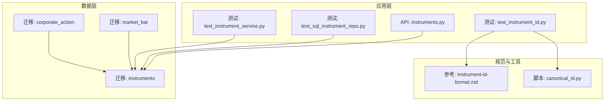
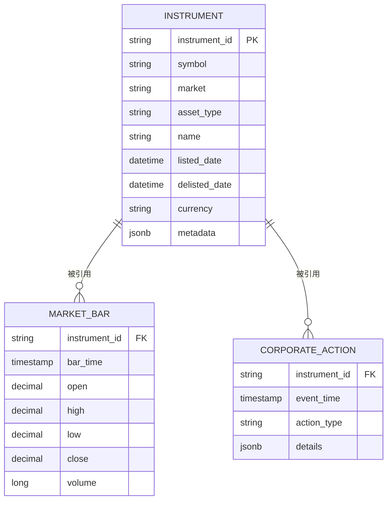
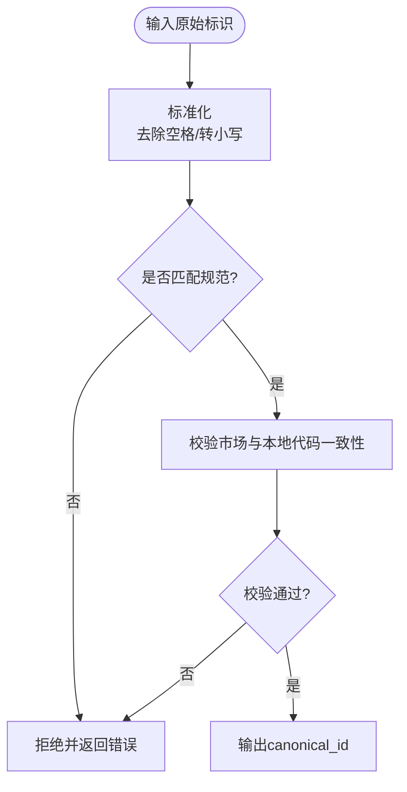
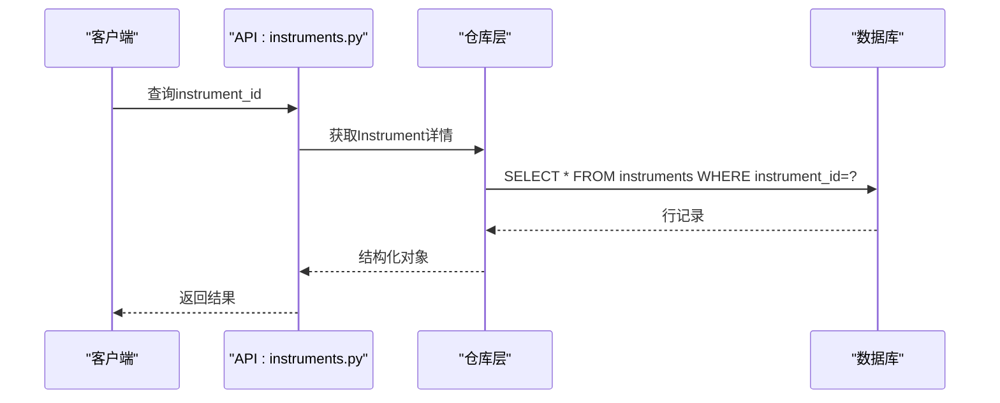
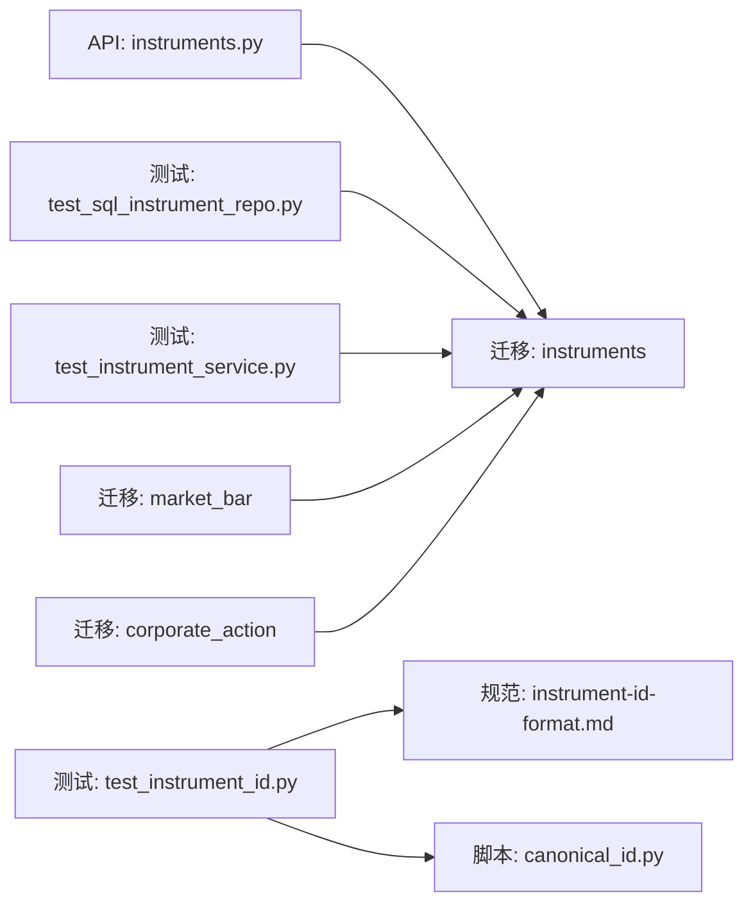

# 标的资产模型

<cite>
**本文引用的文件**   
- [20260715_0001_instruments.py](file://sql/migrations/versions/20260715_0001_instruments.py)
- [instruments.py](file://apps/api/routers/instruments.py)
- [instrument_id_format.md](file://skills/cross-market-quant-research/references/instrument-id-format.md)
- [canonical_id.py](file://skills/cross-market-quant-research/scripts/canonical_id.py)
- [test_instrument_id.py](file://tests/unit/test_instrument_id.py)
- [test_sql_instrument_repo.py](file://tests/unit/test_sql_instrument_repo.py)
- [test_instrument_service.py](file://tests/unit/test_instrument_service.py)
- [corporate_action.py](file://sql/migrations/versions/20260715_0004_corporate_action.py)
- [market_bar.py](file://sql/migrations/versions/20260715_0003_market_bar.py)
</cite>

## 目录
1. [简介](#简介)
2. [项目结构](#项目结构)
3. [核心组件](#核心组件)
4. [架构总览](#架构总览)
5. [详细组件分析](#详细组件分析)
6. [依赖关系分析](#依赖关系分析)
7. [性能考虑](#性能考虑)
8. [故障排查指南](#故障排查指南)
9. [结论](#结论)
10. [附录](#附录)

## 简介
本文件面向“标的资产(Instrument)”数据模型，系统性阐述Instrument表字段定义、跨市场统一标识符设计策略、分类体系与生命周期状态、主外键设计与约束、索引策略、以及与交易日历和公司行为事件的关联关系。文档同时给出建表语句要点、字段验证规则、枚举值定义与业务约束，帮助读者在A股、美股、外汇等多市场中正确理解和使用统一的Instrument标识。

## 项目结构
与Instrument模型直接相关的代码与迁移位于以下位置：
- 数据库迁移：sql/migrations/versions/20260715_0001_instruments.py（Instrument表定义）
- API路由：apps/api/routers/instruments.py（标的查询接口）
- 跨市场标识规范：skills/cross-market-quant-research/references/instrument-id-format.md
- 规范化脚本：skills/cross-market-quant-research/scripts/canonical_id.py
- 单元测试：tests/unit/test_instrument_id.py、tests/unit/test_sql_instrument_repo.py、tests/unit/test_instrument_service.py
- 相关实体迁移：公司行为事件 corporate_action.py、行情 bar market_bar.py

图表来源
- [20260715_0001_instruments.py](file://sql/migrations/versions/20260715_0001_instruments.py)
- [instruments.py](file://apps/api/routers/instruments.py)
- [instrument-id-format.md](file://skills/cross-market-quant-research/references/instrument-id-format.md)
- [canonical_id.py](file://skills/cross-market-quant-research/scripts/canonical_id.py)
- [test_instrument_id.py](file://tests/unit/test_instrument_id.py)
- [test_sql_instrument_repo.py](file://tests/unit/test_sql_instrument_repo.py)
- [test_instrument_service.py](file://tests/unit/test_instrument_service.py)
- [20260715_0003_market_bar.py](file://sql/migrations/versions/20260715_0003_market_bar.py)
- [20260715_0004_corporate_action.py](file://sql/migrations/versions/20260715_0004_corporate_action.py)

章节来源
- [20260715_0001_instruments.py](file://sql/migrations/versions/20260715_0001_instruments.py)
- [instruments.py](file://apps/api/routers/instruments.py)
- [instrument-id-format.md](file://skills/cross-market-quant-research/references/instrument-id-format.md)
- [canonical_id.py](file://skills/cross-market-quant-research/scripts/canonical_id.py)
- [test_instrument_id.py](file://tests/unit/test_instrument_id.py)
- [test_sql_instrument_repo.py](file://tests/unit/test_sql_instrument_repo.py)
- [test_instrument_service.py](file://tests/unit/test_instrument_service.py)
- [20260715_0003_market_bar.py](file://sql/migrations/versions/20260715_0003_market_bar.py)
- [20260715_0004_corporate_action.py](file://sql/migrations/versions/20260715_0004_corporate_action.py)

## 核心组件
本节聚焦Instrument实体的关键字段与语义：
- instrument_id：跨市场统一标识符，作为主键或唯一键使用，用于在不同市场间一致地定位同一标的。
- symbol：交易所内本地代码，如A股的“600519.SH”、美股的“AAPL.US”、外汇的“EURUSD”。
- market：市场代码，如CN、US、FX等，用于区分不同交易市场。
- asset_type：资产类型，如股票、ETF、指数、期货、期权、外汇对等。
- 其他元数据字段：名称、上市/退市时间、币种、行业分类、扩展属性等（以迁移定义为准）。

上述字段共同构成标的资产的稳定身份与基础描述信息，支撑上层回测、研究、风控与报表等模块的统一接入。

章节来源
- [20260715_0001_instruments.py](file://sql/migrations/versions/20260715_0001_instruments.py)
- [instruments.py](file://apps/api/routers/instruments.py)

## 架构总览
下图展示Instrument与其他关键实体的关系：与market_bar（行情）通过instrument_id关联；与公司行为事件corporate_action通过instrument_id关联；API层提供基于instrument_id的查询能力；跨市场标识规范与canonical_id脚本确保标识的一致性与可校验性。

图表来源
- [20260715_0001_instruments.py](file://sql/migrations/versions/20260715_0001_instruments.py)
- [20260715_0003_market_bar.py](file://sql/migrations/versions/20260715_0003_market_bar.py)
- [20260715_0004_corporate_action.py](file://sql/migrations/versions/20260715_0004_corporate_action.py)

## 详细组件分析

### Instrument表字段与约束
- 主键与唯一性
  - instrument_id：跨市场统一标识符，建议作为主键或具备唯一约束，保证全局唯一且稳定。
  - (symbol, market)：组合唯一约束，避免同一市场重复录入相同本地代码。
- 字段说明
  - instrument_id：字符串型，遵循跨市场编码规范，见“跨市场统一标识符设计策略”。
  - symbol：交易所本地代码，需与market配合使用。
  - market：市场代码，如CN、US、FX等，用于区分不同市场。
  - asset_type：资产类型枚举，如STOCK、ETF、INDEX、FUTURE、OPTION、CURRENCY等。
  - name：标的中文或英文全称。
  - listed_date/delisted_date：上市/退市日期，用于限定有效区间。
  - currency：计价货币，如CNY、USD、EUR等。
  - metadata：JSONB扩展字段，存放行业、板块、权重等可选元数据。
- 验证规则
  - symbol格式需符合各市场约定，并与market一致。
  - listed_date <= delisted_date（若delisted_date非空）。
  - asset_type取值需在允许集合内。
  - currency为ISO 4217标准三字母代码。
- 业务约束
  - 同一instrument_id不可重复插入。
  - 删除Instrument前需检查是否存在下游引用（bar、CA等），必要时采用软删除或级联策略。

章节来源
- [20260715_0001_instruments.py](file://sql/migrations/versions/20260715_0001_instruments.py)

### 跨市场统一标识符设计策略
- 设计目标
  - 为A股、美股、外汇等不同市场的标的提供一致的、稳定的、可解析的全局标识。
- 编码规范要点
  - 结构：由“市场码+本地代码+可选后缀”组成，例如“CN.600519.SH”、“US.AAPL”、“FX.EURUSD”。
  - 分隔符：使用点号分隔市场与本地代码，便于正则解析与分片存储。
  - 大小写：统一小写或按市场约定处理，建议在入库时标准化。
  - 稳定性：一旦分配，不应变更；历史变更通过版本化或映射表管理。
- 校验与规范化
  - 提供canonical_id脚本进行标准化与校验，确保前后端一致。
  - 单元测试覆盖常见场景：非法字符、缺失市场、重复符号等。

图表来源
- [instrument-id-format.md](file://skills/cross-market-quant-research/references/instrument-id-format.md)
- [canonical_id.py](file://skills/cross-market-quant-research/scripts/canonical_id.py)
- [test_instrument_id.py](file://tests/unit/test_instrument_id.py)

章节来源
- [instrument-id-format.md](file://skills/cross-market-quant-research/references/instrument-id-format.md)
- [canonical_id.py](file://skills/cross-market-quant-research/scripts/canonical_id.py)
- [test_instrument_id.py](file://tests/unit/test_instrument_id.py)

### 分类体系、生命周期与元数据
- 分类体系
  - 资产类型asset_type：股票、ETF、指数、期货、期权、外汇对等。
  - 市场维度market：CN（A股）、US（美股）、FX（外汇）等。
  - 可扩展：通过metadata中的industry、sector、exchange_code等实现细粒度分类。
- 生命周期状态
  - 活跃：listed_date已至且未delist。
  - 待上市：当前时间在listed_date之前。
  - 已退市：delisted_date已至。
  - 暂停/复牌：可通过metadata或外部事件表记录。
- 元数据管理
  - 使用JSONB字段metadata存储动态扩展信息，如行业、板块、权重、合约乘数等。
  - 建议对常用查询字段建立生成列或索引以提升性能。

章节来源
- [20260715_0001_instruments.py](file://sql/migrations/versions/20260715_0001_instruments.py)

### 主键设计与外键关联
- 主键设计
  - 推荐将instrument_id设为主键，保证全局唯一与快速定位。
  - 若因历史原因保留自增ID，则instrument_id应设置唯一约束。
- 外键关联
  - market_bar.instrument_id -> instrument.instrument_id：用于关联行情数据。
  - corporate_action.instrument_id -> instrument.instrument_id：用于关联公司行为事件。
- 完整性约束
  - 插入bar或CA前需校验instrument存在，防止孤儿记录。
  - 删除Instrument时应评估级联策略，优先采用软删除或限制删除。

章节来源
- [20260715_0001_instruments.py](file://sql/migrations/versions/20260715_0001_instruments.py)
- [20260715_0003_market_bar.py](file://sql/migrations/versions/20260715_0003_market_bar.py)
- [20260715_0004_corporate_action.py](file://sql/migrations/versions/20260715_0004_corporate_action.py)

### 字段验证规则与枚举值
- 验证规则
  - symbol与market组合唯一。
  - listed_date与delisted_date逻辑顺序正确。
  - currency为合法ISO 4217代码。
  - asset_type属于预定义集合。
- 枚举值示例
  - asset_type：STOCK、ETF、INDEX、FUTURE、OPTION、CURRENCY。
  - market：CN、US、FX（可扩展）。
  - currency：CNY、USD、EUR、JPY等。

章节来源
- [20260715_0001_instruments.py](file://sql/migrations/versions/20260715_0001_instruments.py)

### 索引策略与数据完整性
- 索引建议
  - 主键索引：instrument_id。
  - 唯一索引：(symbol, market)。
  - 查询优化索引：asset_type、market、currency、listed_date/delisted_date（根据查询模式选择复合索引）。
  - JSONB索引：对metadata中高频查询键建立GIN或表达式索引。
- 完整性保障
  - 外键约束：bar与CA表引用instrument_id。
  - 触发器或应用层校验：确保删除前无下游引用或采用软删除。

章节来源
- [20260715_0001_instruments.py](file://sql/migrations/versions/20260715_0001_instruments.py)
- [20260715_0003_market_bar.py](file://sql/migrations/versions/20260715_0003_market_bar.py)
- [20260715_0004_corporate_action.py](file://sql/migrations/versions/20260715_0004_corporate_action.py)

### 与交易日历与公司行为事件的关联
- 公司行为事件
  - corporate_action表通过instrument_id与Instrument关联，记录分红、拆合股、配股等事件。
  - 事件详情details建议使用JSONB存储，支持多类型事件的结构化扩展。
- 交易日历
  - 虽然未在迁移中显式定义calendar表，但instrument.listed_date/delisted_date与事件event_time应与交易日历对齐，避免在非交易日产生无效数据。
  - 建议在写入bar与CA时结合日历规则进行过滤与校验。

图表来源
- [instruments.py](file://apps/api/routers/instruments.py)
- [20260715_0001_instruments.py](file://sql/migrations/versions/20260715_0001_instruments.py)

章节来源
- [instruments.py](file://apps/api/routers/instruments.py)
- [20260715_0004_corporate_action.py](file://sql/migrations/versions/20260715_0004_corporate_action.py)

## 依赖关系分析
- 内部依赖
  - API层依赖Instrument表进行查询与展示。
  - 测试用例覆盖标识规范化、SQL仓库访问与服务层调用。
- 外部依赖
  - 迁移脚本定义表结构与约束。
  - 规范文档与脚本确保跨市场标识的一致性。

图表来源
- [instruments.py](file://apps/api/routers/instruments.py)
- [20260715_0001_instruments.py](file://sql/migrations/versions/20260715_0001_instruments.py)
- [instrument-id-format.md](file://skills/cross-market-quant-research/references/instrument-id-format.md)
- [canonical_id.py](file://skills/cross-market-quant-research/scripts/canonical_id.py)
- [test_instrument_id.py](file://tests/unit/test_instrument_id.py)
- [test_sql_instrument_repo.py](file://tests/unit/test_sql_instrument_repo.py)
- [test_instrument_service.py](file://tests/unit/test_instrument_service.py)
- [20260715_0003_market_bar.py](file://sql/migrations/versions/20260715_0003_market_bar.py)
- [20260715_0004_corporate_action.py](file://sql/migrations/versions/20260715_0004_corporate_action.py)

章节来源
- [instruments.py](file://apps/api/routers/instruments.py)
- [20260715_0001_instruments.py](file://sql/migrations/versions/20260715_0001_instruments.py)
- [instrument-id-format.md](file://skills/cross-market-quant-research/references/instrument-id-format.md)
- [canonical_id.py](file://skills/cross-market-quant-research/scripts/canonical_id.py)
- [test_instrument_id.py](file://tests/unit/test_instrument_id.py)
- [test_sql_instrument_repo.py](file://tests/unit/test_sql_instrument_repo.py)
- [test_instrument_service.py](file://tests/unit/test_instrument_service.py)
- [20260715_0003_market_bar.py](file://sql/migrations/versions/20260715_0003_market_bar.py)
- [20260715_0004_corporate_action.py](file://sql/migrations/versions/20260715_0004_corporate_action.py)

## 性能考虑
- 索引优化
  - 针对高频查询条件（market、asset_type、currency、日期范围）建立合适索引。
  - 对JSONB字段metadata使用GIN索引或表达式索引提升检索效率。
- 读写分离
  - 读多写少场景下，可将Instrument查询路由到只读副本。
- 缓存策略
  - 对热点instrument元数据（名称、币种、资产类型）进行短期缓存，降低数据库压力。
- 批量操作
  - 大批量导入Instrument时使用事务与批量插入，减少锁竞争。

[本节为通用性能建议，不直接分析具体文件]

## 故障排查指南
- 常见问题
  - 标识不规范：检查canonical_id脚本与单元测试，确认symbol与market组合是否符合规范。
  - 重复插入：检查(symbol, market)唯一约束与instrument_id唯一性。
  - 下游引用失败：删除或更新Instrument前检查bar与CA是否有引用。
  - 日期异常：校验listed_date与delisted_date顺序，以及是否与交易日历冲突。
- 定位方法
  - 查看迁移定义确认字段与约束。
  - 运行单元测试覆盖路径，快速复现问题。
  - 检查API路由返回的错误信息，定位上游校验失败点。

章节来源
- [20260715_0001_instruments.py](file://sql/migrations/versions/20260715_0001_instruments.py)
- [test_instrument_id.py](file://tests/unit/test_instrument_id.py)
- [test_sql_instrument_repo.py](file://tests/unit/test_sql_instrument_repo.py)
- [test_instrument_service.py](file://tests/unit/test_instrument_service.py)

## 结论
Instrument模型通过跨市场统一标识符、清晰的字段定义与严格的约束，为多市场量化研究与生产系统提供了稳定的基础。配合合理的索引策略与完整性约束，能够有效支撑行情、公司行为等下游数据的准确关联与高效查询。建议在后续演进中持续完善分类体系与元数据规范，并通过自动化测试与监控保障数据质量。

[本节为总结性内容，不直接分析具体文件]

## 附录
- 建表语句要点
  - 主键：instrument_id（或自增ID + 唯一约束）。
  - 唯一约束：(symbol, market)。
  - 外键：market_bar.instrument_id、corporate_action.instrument_id。
  - 索引：主键索引、唯一索引、查询优化索引、JSONB索引。
  - 约束：字段非空、日期顺序、枚举值校验。
- 参考路径
  - 迁移定义：[20260715_0001_instruments.py](file://sql/migrations/versions/20260715_0001_instruments.py)
  - 关联迁移：[20260715_0003_market_bar.py](file://sql/migrations/versions/20260715_0003_market_bar.py)、[20260715_0004_corporate_action.py](file://sql/migrations/versions/20260715_0004_corporate_action.py)
  - 标识规范与脚本：[instrument-id-format.md](file://skills/cross-market-quant-research/references/instrument-id-format.md)、[canonical_id.py](file://skills/cross-market-quant-research/scripts/canonical_id.py)
  - 测试用例：[test_instrument_id.py](file://tests/unit/test_instrument_id.py)、[test_sql_instrument_repo.py](file://tests/unit/test_sql_instrument_repo.py)、[test_instrument_service.py](file://tests/unit/test_instrument_service.py)
  - API路由：[instruments.py](file://apps/api/routers/instruments.py)