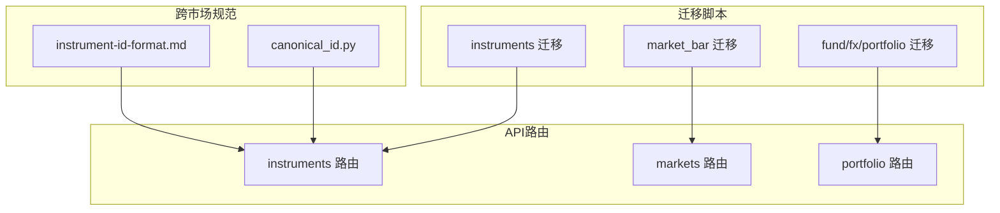
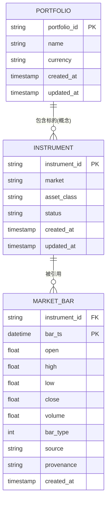
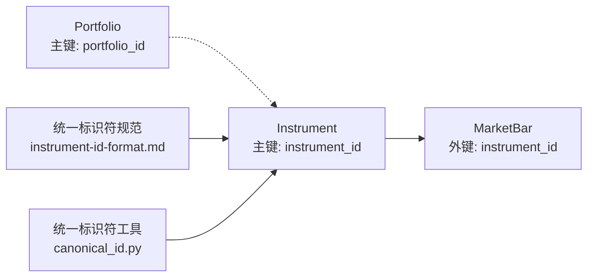

# 核心实体设计

<cite>
**本文引用的文件**   
- [20260715_0001_instruments.py](file://sql/migrations/versions/20260715_0001_instruments.py)
- [20260715_0003_market_bar.py](file://sql/migrations/versions/20260715_0003_market_bar.py)
- [20260715_0006_fund_fx_portfolio.py](file://sql/migrations/versions/20260715_0006_fund_fx_portfolio.py)
- [instruments.py](file://apps/api/routers/instruments.py)
- [markets.py](file://apps/api/routers/markets.py)
- [portfolio.py](file://apps/api/routers/portfolio.py)
- [instrument-id-format.md](file://skills/cross-market-quant-research/references/instrument-id-format.md)
- [canonical_id.py](file://skills/cross-market-quant-research/scripts/canonical_id.py)
</cite>

## 目录
1. [引言](#引言)
2. [项目结构](#项目结构)
3. [核心组件](#核心组件)
4. [架构总览](#架构总览)
5. [详细组件分析](#详细组件分析)
6. [依赖关系分析](#依赖关系分析)
7. [性能考虑](#性能考虑)
8. [故障排查指南](#故障排查指南)
9. [结论](#结论)
10. [附录](#附录)

## 引言
本设计文档聚焦于跨市场量化研究系统中的三个核心实体：Instrument（标的资产）、MarketBar（市场K线）与Portfolio（投资组合）。文档从数据库迁移脚本与API路由入手，系统化阐述字段含义、数据类型、约束条件、业务规则、主键策略、外键关联、统一标识符设计、字段验证与枚举值定义，并提供建表语句要点与索引策略建议。目标是帮助研发与数据工程团队在实现、扩展与维护过程中保持一致性与可追溯性。

## 项目结构
与核心实体直接相关的代码主要分布在以下位置：
- 数据库迁移脚本：定义并演进表结构与索引
- API路由层：暴露实体的查询与写入接口，体现字段使用与校验逻辑
- 技能参考与脚本：提供跨市场统一标识符规范与工具

图表来源
- [20260715_0001_instruments.py](file://sql/migrations/versions/20260715_0001_instruments.py)
- [20260715_0003_market_bar.py](file://sql/migrations/versions/20260715_0003_market_bar.py)
- [20260715_0006_fund_fx_portfolio.py](file://sql/migrations/versions/20260715_0006_fund_fx_portfolio.py)
- [instruments.py](file://apps/api/routers/instruments.py)
- [markets.py](file://apps/api/routers/markets.py)
- [portfolio.py](file://apps/api/routers/portfolio.py)
- [instrument-id-format.md](file://skills/cross-market-quant-research/references/instrument-id-format.md)
- [canonical_id.py](file://skills/cross-market-quant-research/scripts/canonical_id.py)

章节来源
- [20260715_0001_instruments.py](file://sql/migrations/versions/20260715_0001_instruments.py)
- [20260715_0003_market_bar.py](file://sql/migrations/versions/20260715_0003_market_bar.py)
- [20260715_0006_fund_fx_portfolio.py](file://sql/migrations/versions/20260715_0006_fund_fx_portfolio.py)
- [instruments.py](file://apps/api/routers/instruments.py)
- [markets.py](file://apps/api/routers/markets.py)
- [portfolio.py](file://apps/api/routers/portfolio.py)
- [instrument-id-format.md](file://skills/cross-market-quant-research/references/instrument-id-format.md)
- [canonical_id.py](file://skills/cross-market-quant-research/scripts/canonical_id.py)

## 核心组件
本节概述三大核心实体的职责与边界：
- Instrument：描述一个可交易或可分析的标的资产，承载其跨市场唯一标识、所属市场、资产类别、状态等元信息
- MarketBar：记录某标的在某一时间点的OHLCV等行情快照，是回测与训练的基础数据单元
- Portfolio：表示一组头寸或持仓的集合，用于组合层面的统计、风险与绩效计算

章节来源
- [20260715_0001_instruments.py](file://sql/migrations/versions/20260715_0001_instruments.py)
- [20260715_0003_market_bar.py](file://sql/migrations/versions/20260715_0003_market_bar.py)
- [20260715_0006_fund_fx_portfolio.py](file://sql/migrations/versions/20260715_0006_fund_fx_portfolio.py)

## 架构总览
下图展示了核心实体之间的数据关系与调用路径：Instrument作为被引用方，MarketBar通过外键指向Instrument；Portfolio通常引用Instrument以表达组合中的标的暴露。

图表来源
- [20260715_0001_instruments.py](file://sql/migrations/versions/20260715_0001_instruments.py)
- [20260715_0003_market_bar.py](file://sql/migrations/versions/20260715_0003_market_bar.py)
- [20260715_0006_fund_fx_portfolio.py](file://sql/migrations/versions/20260715_0006_fund_fx_portfolio.py)

## 详细组件分析

### Instrument（标的资产）
- 职责
  - 维护跨市场统一的标的标识与基础属性
  - 为MarketBar、Portfolio等下游实体提供稳定的引用键
- 关键字段（示例说明，具体以迁移为准）
  - instrument_id：跨市场统一标识符，字符串类型，主键
  - market：所属市场代码，如CN、US等
  - asset_class：资产类别，如EQUITY、FUND、FX等
  - status：标的状态，如ACTIVE、SUSPENDED、DELISTED等
  - created_at / updated_at：审计时间戳
- 主键与约束
  - 主键：instrument_id
  - 非空约束：instrument_id、market、asset_class、status
  - 唯一性：instrument_id全局唯一
- 业务规则
  - instrument_id需遵循跨市场统一格式规范（见“跨市场统一标识符”小节）
  - 状态变更需具备可审计性（created_at/updated_at）
- 索引策略
  - 主键索引：instrument_id
  - 常用查询索引：market、asset_class、status（复合索引视查询模式而定）
- 字段验证与枚举
  - market：限定为系统支持的市场代码集合
  - asset_class：限定为预定义资产类别
  - status：限定为预定义状态集合
- 典型SQL建表要点
  - 使用字符串主键
  - 为market、asset_class、status建立合适索引
  - 添加created_at/updated_at默认值与更新触发器（可选）

章节来源
- [20260715_0001_instruments.py](file://sql/migrations/versions/20260715_0001_instruments.py)
- [instruments.py](file://apps/api/routers/instruments.py)
- [instrument-id-format.md](file://skills/cross-market-quant-research/references/instrument-id-format.md)
- [canonical_id.py](file://skills/cross-market-quant-research/scripts/canonical_id.py)

### MarketBar（市场K线）
- 职责
  - 存储标的的时间序列行情数据，支撑回测、特征工程与模型训练
- 关键字段（示例说明，具体以迁移为准）
  - instrument_id：外键，指向Instrument
  - bar_ts：K线时间戳，与instrument_id共同构成主键
  - open/high/low/close/volume：标准OHLCV字段
  - bar_type：K线类型，如1m、5m、1d等
  - source：数据来源标识
  - provenance：数据溯源信息（版本/批次/来源指纹）
  - created_at：入库时间
- 主键与约束
  - 复合主键：(instrument_id, bar_ts)
  - 非空约束：instrument_id、bar_ts、open/high/low/close/volume
  - 外键：instrument_id → Instrument.instrument_id
- 业务规则
  - 同一标的在同一时间点仅允许一条记录
  - OHLCV需满足基本一致性（如high≥max(open,close)，low≤min(open,close)）
  - bar_type需与数据源约定一致
- 索引策略
  - 主键索引：(instrument_id, bar_ts)
  - 查询优化：按instrument_id范围查询为主，必要时对bar_ts单独索引（若存在跨标的聚合场景）
- 字段验证与枚举
  - bar_type：限定为支持的K线周期枚举
  - source/provenance：非空且长度受限
- 典型SQL建表要点
  - 使用复合主键保证时序唯一性
  - 为instrument_id建立外键约束
  - 为高频写入场景选择合适的存储引擎与分区策略（如按日期分区）

章节来源
- [20260715_0003_market_bar.py](file://sql/migrations/versions/20260715_0003_market_bar.py)

### Portfolio（投资组合）
- 职责
  - 管理组合元信息与标的映射，用于组合层面统计、风险与绩效归因
- 关键字段（示例说明，具体以迁移为准）
  - portfolio_id：组合ID，主键
  - name：组合名称
  - currency：组合基准货币
  - created_at / updated_at：审计时间戳
- 主键与约束
  - 主键：portfolio_id
  - 非空约束：portfolio_id、name、currency
- 业务规则
  - 组合与标的的关系可通过中间表或JSON字段表达（具体以迁移为准）
  - 货币字段影响汇率换算与风险敞口计算
- 索引策略
  - 主键索引：portfolio_id
  - 常见查询：按name模糊匹配时可使用全文索引或前缀索引
- 字段验证与枚举
  - currency：限定为ISO 4217货币代码
- 典型SQL建表要点
  - 保持组合元数据简洁，复杂关系通过关联表或序列化字段表达

章节来源
- [20260715_0006_fund_fx_portfolio.py](file://sql/migrations/versions/20260715_0006_fund_fx_portfolio.py)
- [portfolio.py](file://apps/api/routers/portfolio.py)

### 跨市场标的的统一标识符设计
- 目标
  - 在不同市场（如CN、US）与不同资产类别（如EQUITY、FUND、FX）之间提供一致的标的识别方式
- 设计原则
  - 全局唯一：instrument_id在整个系统中唯一
  - 可读可解析：包含市场、资产类别、本地代码等语义片段
  - 稳定不变：一旦分配不再修改
- 规范与工具
  - 规范文档：instrument-id-format.md
  - 生成与校验工具：canonical_id.py
- 使用建议
  - 所有写入Instrument与MarketBar的入口均需校验instrument_id格式
  - 对外API返回与入参均使用统一标识符，避免市场特定编码混用

章节来源
- [instrument-id-format.md](file://skills/cross-market-quant-research/references/instrument-id-format.md)
- [canonical_id.py](file://skills/cross-market-quant-research/scripts/canonical_id.py)
- [instruments.py](file://apps/api/routers/instruments.py)

## 依赖关系分析
- 直接依赖
  - MarketBar.instrument_id → Instrument.instrument_id（外键）
- 间接依赖
  - Portfolio与Instrument的关系通过应用层建模（中间表或JSON），不强制外键
- 外部依赖
  - 统一标识符规范与工具（instrument-id-format.md、canonical_id.py）
- 耦合与内聚
  - Instrument高内聚，低耦合，作为稳定锚点
  - MarketBar强依赖Instrument，但自身时序主键保证高内聚
  - Portfolio相对独立，便于扩展多组合场景

图表来源
- [20260715_0001_instruments.py](file://sql/migrations/versions/20260715_0001_instruments.py)
- [20260715_0003_market_bar.py](file://sql/migrations/versions/20260715_0003_market_bar.py)
- [20260715_0006_fund_fx_portfolio.py](file://sql/migrations/versions/20260715_0006_fund_fx_portfolio.py)
- [instrument-id-format.md](file://skills/cross-market-quant-research/references/instrument-id-format.md)
- [canonical_id.py](file://skills/cross-market-quant-research/scripts/canonical_id.py)

章节来源
- [20260715_0001_instruments.py](file://sql/migrations/versions/20260715_0001_instruments.py)
- [20260715_0003_market_bar.py](file://sql/migrations/versions/20260715_0003_market_bar.py)
- [20260715_0006_fund_fx_portfolio.py](file://sql/migrations/versions/20260715_0006_fund_fx_portfolio.py)
- [instrument-id-format.md](file://skills/cross-market-quant-research/references/instrument-id-format.md)
- [canonical_id.py](file://skills/cross-market-quant-research/scripts/canonical_id.py)

## 性能考虑
- 写入吞吐
  - MarketBar为高频写入表，建议使用批量插入与事务合并
  - 合理设置行级锁粒度与索引数量，避免写放大
- 查询优化
  - 针对instrument_id+时间范围的查询，利用复合主键顺序
  - 对Instrument的market、asset_class、status建立覆盖索引以加速筛选
- 存储与分区
  - 对MarketBar按时间分区（如按月/周）以降低单表规模
  - 冷热数据分离，历史归档至低成本存储
- 缓存策略
  - Instrument元数据变化低频，适合缓存
  - MarketBar热点标的最近N条可引入内存缓存

[本节为通用指导，无需列出具体文件来源]

## 故障排查指南
- 常见问题
  - instrument_id格式错误：检查统一标识符规范与校验工具
  - MarketBar重复写入：确认复合主键(instrument_id, bar_ts)冲突
  - 外键约束失败：确认Instrument已存在且状态有效
- 定位步骤
  - 查看API路由层的参数校验日志
  - 核对迁移脚本中字段约束与索引定义
  - 检查数据源的source与provenance是否完整
- 修复建议
  - 在写入前进行instrument_id格式校验
  - 对重复写入采用UPSERT或幂等键
  - 完善数据质量校验规则（如OHLCV一致性）

章节来源
- [instruments.py](file://apps/api/routers/instruments.py)
- [20260715_0001_instruments.py](file://sql/migrations/versions/20260715_0001_instruments.py)
- [20260715_0003_market_bar.py](file://sql/migrations/versions/20260715_0003_market_bar.py)

## 结论
通过统一的Instrument标识、严格的MarketBar时序主键与稳健的Portfolio元数据设计，系统在跨市场、多资产类别场景下具备良好的可扩展性与可维护性。配合完善的索引策略与数据质量校验，可在保证写入吞吐的同时提升查询效率与数据一致性。

[本节为总结性内容，无需列出具体文件来源]

## 附录

### 字段验证规则与枚举值定义（建议）
- Instrument
  - market：枚举值如 CN、US 等
  - asset_class：枚举值如 EQUITY、FUND、FX 等
  - status：枚举值如 ACTIVE、SUSPENDED、DELISTED 等
- MarketBar
  - bar_type：枚举值如 1m、5m、1d 等
  - source/provenance：非空且长度限制
- Portfolio
  - currency：ISO 4217 货币代码

章节来源
- [20260715_0001_instruments.py](file://sql/migrations/versions/20260715_0001_instruments.py)
- [20260715_0003_market_bar.py](file://sql/migrations/versions/20260715_0003_market_bar.py)
- [20260715_0006_fund_fx_portfolio.py](file://sql/migrations/versions/20260715_0006_fund_fx_portfolio.py)

### 建表语句与索引策略要点（建议）
- Instrument
  - 主键：instrument_id
  - 索引：market、asset_class、status（根据查询模式选择复合索引）
- MarketBar
  - 主键：(instrument_id, bar_ts)
  - 外键：instrument_id → Instrument.instrument_id
  - 索引：如需跨标的聚合，可对bar_ts建立二级索引
- Portfolio
  - 主键：portfolio_id
  - 索引：name前缀索引或全文索引（视检索需求）

章节来源
- [20260715_0001_instruments.py](file://sql/migrations/versions/20260715_0001_instruments.py)
- [20260715_0003_market_bar.py](file://sql/migrations/versions/20260715_0003_market_bar.py)
- [20260715_0006_fund_fx_portfolio.py](file://sql/migrations/versions/20260715_0006_fund_fx_portfolio.py)