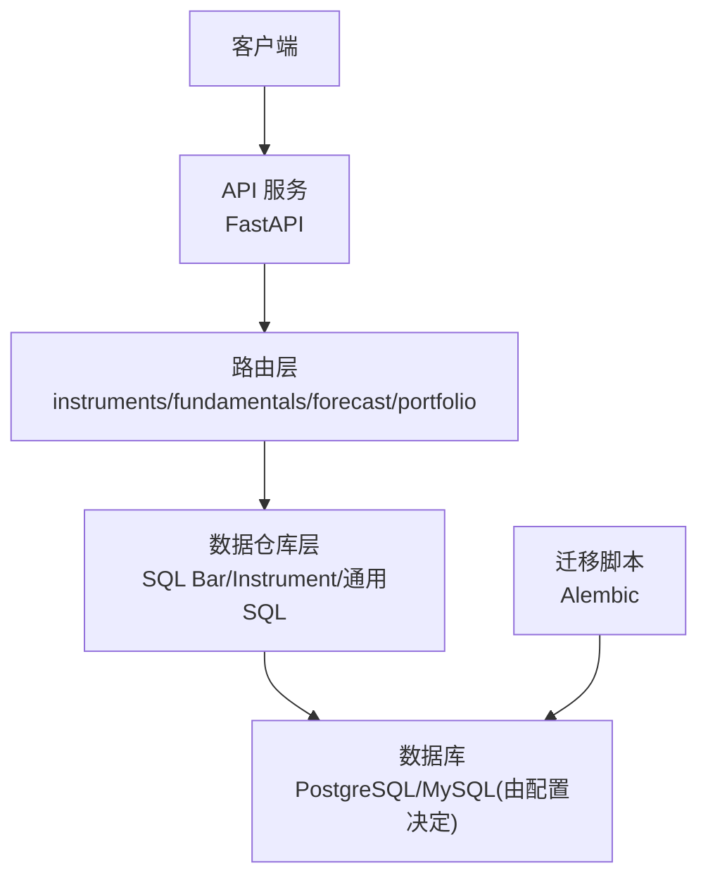
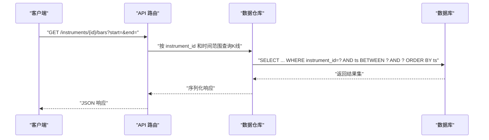
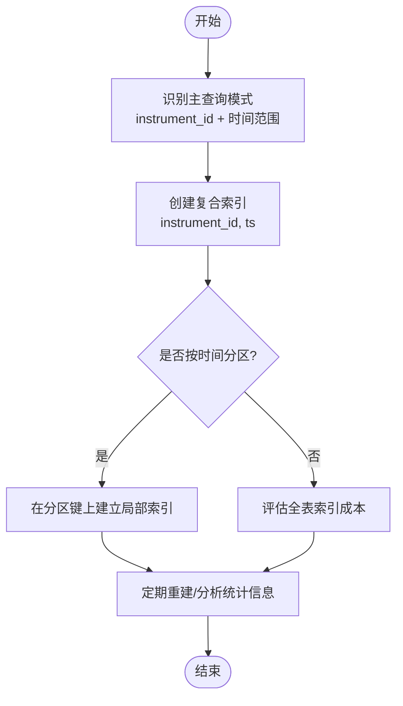
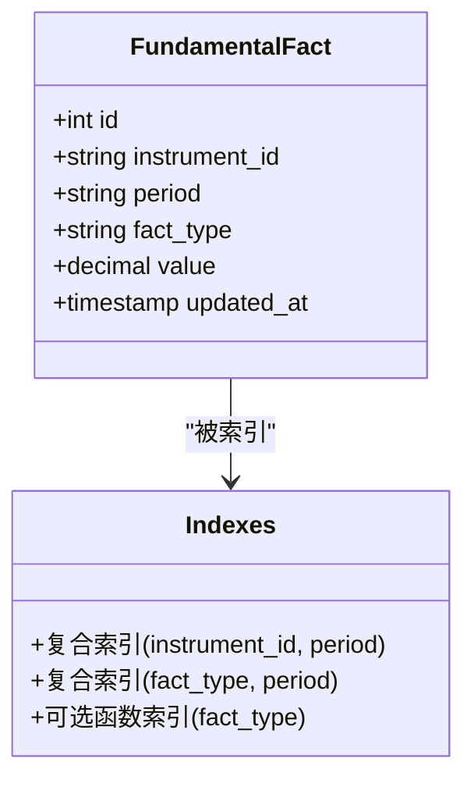
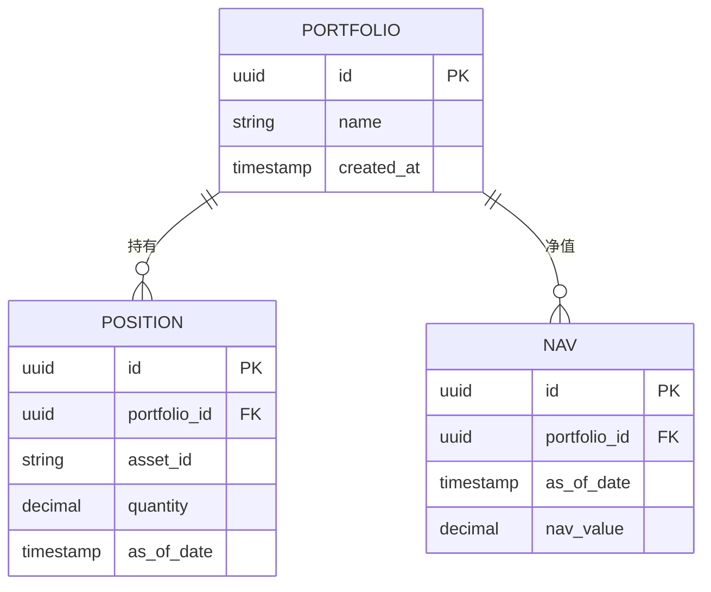
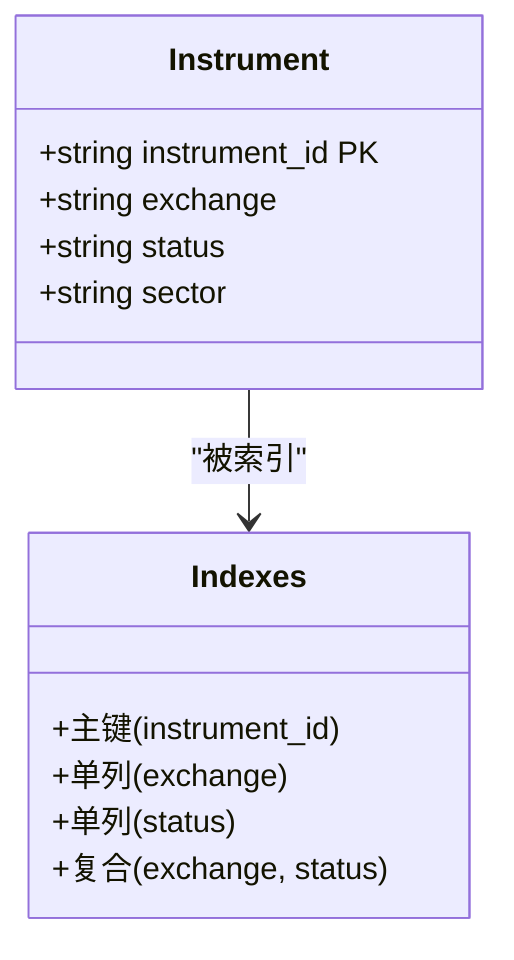
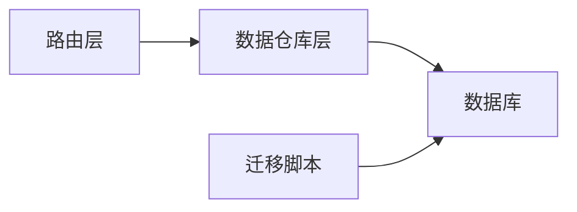

# 索引优化策略

<cite>
**本文引用的文件**   
- [README.md](file://README.md)
- [pyproject.toml](file://pyproject.toml)
- [alembic.ini](file://alembic.ini)
- [sql/migrations/env.py](file://sql/migrations/env.py)
- [sql/migrations/versions/20260715_0003_market_bar.py](file://sql/migrations/versions/20260715_0003_market_bar.py)
- [sql/migrations/versions/20260715_0005_fundamental_fact.py](file://sql/migrations/versions/20260715_0005_fundamental_fact.py)
- [sql/migrations/versions/20260715_0006_fund_fx_portfolio.py](file://sql/migrations/versions/20260715_0006_fund_fx_portfolio.py)
- [apps/api/main.py](file://apps/api/main.py)
- [apps/api/deps.py](file://apps/api/deps.py)
- [apps/api/routers/instruments.py](file://apps/api/routers/instruments.py)
- [apps/api/routers/fundamentals.py](file://apps/api/routers/fundamentals.py)
- [apps/api/routers/forecast.py](file://apps/api/routers/forecast.py)
- [apps/api/routers/portfolio.py](file://apps/api/routers/portfolio.py)
- [packages/data_sources/sql_repo.py](file://packages/data_sources/sql_repo.py)
- [packages/datasets/sql_bar_repo.py](file://packages/datasets/sql_bar_repo.py)
- [packages/instrument/sql_instrument_repo.py](file://packages/instrument/sql_instrument_repo.py)
- [tests/unit/test_sql_bar_repo.py](file://tests/unit/test_sql_bar_repo.py)
- [tests/unit/test_sql_instrument_repo.py](file://tests/unit/test_sql_instrument_repo.py)
- [deploy/docker-compose.yml](file://deploy/docker-compose.yml)
</cite>

## 目录
1. [简介](#简介)
2. [项目结构](#项目结构)
3. [核心组件](#核心组件)
4. [架构总览](#架构总览)
5. [详细组件分析](#详细组件分析)
6. [依赖关系分析](#依赖关系分析)
7. [性能考量](#性能考量)
8. [故障排查指南](#故障排查指南)
9. [结论](#结论)
10. [附录](#附录)

## 简介
本文件面向量化数据与交易系统的数据库索引优化，聚焦于查询性能提升的索引设计原则、现有索引策略（单列、复合、部分索引）的使用场景、时间序列数据的分区与索引优化方案、基于查询模式的索引选择建议、索引维护计划与监控指标，以及不同数据量级下的策略调整。文档同时结合仓库中的迁移脚本、API 路由与数据访问层代码，给出可落地的实践建议。

## 项目结构
系统采用分层架构：API 层暴露 REST 接口，业务逻辑位于 packages 各模块中，数据访问通过 SQL 仓库实现，并使用 Alembic 管理数据库迁移。关键路径包括：
- API 路由：instruments、fundamentals、forecast、portfolio 等
- 数据访问：SQL 仓库（bar、instrument、通用 SQL 工具）
- 迁移脚本：市场 K 线、基本面事实、基金/外汇/组合相关表结构
- 配置与部署：Docker Compose、Alembic 配置

图表来源
- [apps/api/main.py:1-200](file://apps/api/main.py#L1-L200)
- [apps/api/routers/instruments.py:1-200](file://apps/api/routers/instruments.py#L1-L200)
- [packages/datasets/sql_bar_repo.py:1-200](file://packages/datasets/sql_bar_repo.py#L1-L200)
- [packages/instrument/sql_instrument_repo.py:1-200](file://packages/instrument/sql_instrument_repo.py#L1-L200)
- [sql/migrations/env.py:1-200](file://sql/migrations/env.py#L1-L200)

章节来源
- [README.md:1-200](file://README.md#L1-L200)
- [pyproject.toml:1-200](file://pyproject.toml#L1-L200)
- [alembic.ini:1-200](file://alembic.ini#L1-L200)
- [sql/migrations/env.py:1-200](file://sql/migrations/env.py#L1-L200)

## 核心组件
- 市场K线数据（Market Bar）：高频时序数据，典型查询按 instrument_id + time_range 过滤，需强支持范围扫描与排序。
- 基本面事实（Fundamental Fact）：低频更新的事实表，常用按 instrument_id + period 或 fact_type 聚合查询。
- 基金/外汇/组合（Fund/FX/Portfolio）：组合维度查询涉及多表关联与时间窗口聚合。
- 数据仓库层：提供统一的 SQL 构建与执行封装，便于集中优化查询与索引匹配。

章节来源
- [sql/migrations/versions/20260715_0003_market_bar.py:1-200](file://sql/migrations/versions/20260715_0003_market_bar.py#L1-L200)
- [sql/migrations/versions/20260715_0005_fundamental_fact.py:1-200](file://sql/migrations/versions/20260715_0005_fundamental_fact.py#L1-L200)
- [sql/migrations/versions/20260715_0006_fund_fx_portfolio.py:1-200](file://sql/migrations/versions/20260715_0006_fund_fx_portfolio.py#L1-L200)
- [packages/datasets/sql_bar_repo.py:1-200](file://packages/datasets/sql_bar_repo.py#L1-L200)
- [packages/instrument/sql_instrument_repo.py:1-200](file://packages/instrument/sql_instrument_repo.py#L1-L200)

## 架构总览
下图展示从 API 请求到数据库查询的关键路径，并标注常见查询模式与对应索引需求。

图表来源
- [apps/api/routers/instruments.py:1-200](file://apps/api/routers/instruments.py#L1-L200)
- [packages/datasets/sql_bar_repo.py:1-200](file://packages/datasets/sql_bar_repo.py#L1-L200)

## 详细组件分析

### 市场K线（Market Bar）索引策略
- 查询模式
  - 按标的+时间范围读取连续K线（最常见）
  - 按标的+日期区间聚合统计（如日频汇总）
  - 按时间范围跨标的批量拉取（较少，通常用于研究批处理）
- 索引建议
  - 复合索引：instrument_id, ts（升序），覆盖大部分范围查询与排序
  - 可选部分索引：仅对活跃标的或最近N天数据建立部分索引以节省空间
  - 若频繁按日期分区，可在分区键上建立局部索引以提升分区裁剪效率
- 分区策略
  - 按时间范围分区（月/周/日），配合复合索引在分区内高效定位
  - 冷热分离：历史数据归档至冷存储，热数据保留近期分区

图表来源
- [sql/migrations/versions/20260715_0003_market_bar.py:1-200](file://sql/migrations/versions/20260715_0003_market_bar.py#L1-L200)
- [packages/datasets/sql_bar_repo.py:1-200](file://packages/datasets/sql_bar_repo.py#L1-L200)

章节来源
- [sql/migrations/versions/20260715_0003_market_bar.py:1-200](file://sql/migrations/versions/20260715_0003_market_bar.py#L1-L200)
- [packages/datasets/sql_bar_repo.py:1-200](file://packages/datasets/sql_bar_repo.py#L1-L200)
- [tests/unit/test_sql_bar_repo.py:1-200](file://tests/unit/test_sql_bar_repo.py#L1-L200)

### 基本面事实（Fundamental Fact）索引策略
- 查询模式
  - 按 instrument_id + period 精确查找
  - 按 fact_type 聚合计算（如 ROE、PE 等）
  - 时间窗口内的趋势分析（period 作为时间维度）
- 索引建议
  - 复合索引：instrument_id, period（或 fact_type, period，取决于主要过滤条件）
  - 选择性高的字段优先前置（如 instrument_id）
  - 针对热点 fact_type 可考虑函数索引或物化视图加速聚合

图表来源
- [sql/migrations/versions/20260715_0005_fundamental_fact.py:1-200](file://sql/migrations/versions/20260715_0005_fundamental_fact.py#L1-L200)

章节来源
- [sql/migrations/versions/20260715_0005_fundamental_fact.py:1-200](file://sql/migrations/versions/20260715_0005_fundamental_fact.py#L1-L200)

### 基金/外汇/组合（Fund/FX/Portfolio）索引策略
- 查询模式
  - 组合持仓与净值的时间序列查询
  - 跨资产类别的对冲与风险指标计算
  - 按日期快照聚合
- 索引建议
  - 组合维度：portfolio_id, date（或 timestamp）
  - 资产维度：asset_id, date
  - 若存在状态字段（如 active），可考虑部分索引仅包含活跃记录

图表来源
- [sql/migrations/versions/20260715_0006_fund_fx_portfolio.py:1-200](file://sql/migrations/versions/20260715_0006_fund_fx_portfolio.py#L1-L200)

章节来源
- [sql/migrations/versions/20260715_0006_fund_fx_portfolio.py:1-200](file://sql/migrations/versions/20260715_0006_fund_fx_portfolio.py#L1-L200)

### 标的（Instruments）索引策略
- 查询模式
  - 按 instrument_id 精确查找
  - 按交易所/行业/状态筛选列表
- 索引建议
  - 主键或唯一索引：instrument_id
  - 常用过滤字段：exchange, status 的单列索引
  - 复合索引：exchange, status（当联合过滤频繁时）

图表来源
- [sql/migrations/versions/20260715_0001_instruments.py:1-200](file://sql/migrations/versions/20260715_0001_instruments.py#L1-L200)
- [packages/instrument/sql_instrument_repo.py:1-200](file://packages/instrument/sql_instrument_repo.py#L1-L200)

章节来源
- [packages/instrument/sql_instrument_repo.py:1-200](file://packages/instrument/sql_instrument_repo.py#L1-L200)
- [tests/unit/test_sql_instrument_repo.py:1-200](file://tests/unit/test_sql_instrument_repo.py#L1-L200)

### 查询模式分析与索引选择建议
- 高频读模式
  - 时间范围扫描：优先使用复合索引（instrument_id, ts）
  - 精确查找：单列主键/唯一索引
  - 聚合统计：考虑覆盖索引或物化视图
- 写入密集模式
  - 控制索引数量，避免过多写放大
  - 使用部分索引减少无用索引开销
- 混合负载
  - 读写分离：只读副本承担复杂分析查询
  - 异步物化：将复杂聚合结果预计算并缓存

章节来源
- [apps/api/routers/instruments.py:1-200](file://apps/api/routers/instruments.py#L1-L200)
- [apps/api/routers/fundamentals.py:1-200](file://apps/api/routers/fundamentals.py#L1-L200)
- [apps/api/routers/forecast.py:1-200](file://apps/api/routers/forecast.py#L1-L200)
- [apps/api/routers/portfolio.py:1-200](file://apps/api/routers/portfolio.py#L1-L200)

## 依赖关系分析
- API 路由依赖数据仓库层进行查询构建与执行
- 数据仓库层依赖数据库连接与事务管理
- 迁移脚本定义表结构与初始索引，影响运行时查询性能

图表来源
- [apps/api/main.py:1-200](file://apps/api/main.py#L1-L200)
- [apps/api/deps.py:1-200](file://apps/api/deps.py#L1-200)
- [sql/migrations/env.py:1-200](file://sql/migrations/env.py#L1-200)

章节来源
- [apps/api/main.py:1-200](file://apps/api/main.py#L1-L200)
- [apps/api/deps.py:1-200](file://apps/api/deps.py#L1-200)
- [sql/migrations/env.py:1-200](file://sql/migrations/env.py#L1-200)

## 性能考量
- 索引选择原则
  - 高选择性字段优先前置
  - 复合索引顺序遵循“等值在前、范围在后”
  - 避免过度索引导致写放大
- 分区与索引协同
  - 分区键应匹配查询模式（如时间）
  - 分区内索引进一步缩小扫描范围
- 统计信息与执行计划
  - 定期更新统计信息，确保优化器选择正确索引
  - 使用 EXPLAIN 分析执行计划，识别全表扫描与回表
- 缓存与物化
  - 热点查询结果缓存（Redis/内存）
  - 复杂聚合物化为中间表或物化视图

[本节为通用指导，不直接分析具体文件]

## 故障排查指南
- 慢查询定位
  - 启用慢查询日志，收集 TOP N 慢查询
  - 使用 EXPLAIN ANALYZE 验证索引命中与扫描行数
- 索引失效常见原因
  - 函数包裹过滤字段导致无法使用索引
  - 类型转换或隐式转换导致索引失效
  - 统计信息过期导致错误选择索引
- 索引维护
  - 定期重建碎片化索引
  - 删除未使用索引，降低写放大
- 监控指标
  - 查询延迟分位数（P95/P99）
  - 索引命中率与回表率
  - 写入延迟与锁等待

章节来源
- [deploy/docker-compose.yml:1-200](file://deploy/docker-compose.yml#L1-200)
- [apps/api/deps.py:1-200](file://apps/api/deps.py#L1-200)

## 结论
通过围绕核心查询模式设计单列、复合与部分索引，并结合时间序列分区与统计信息维护，可显著提升系统查询性能。建议在上线前完成执行计划验证与压测，持续监控关键指标并根据数据量级动态调整索引策略。

[本节为总结性内容，不直接分析具体文件]

## 附录

### 索引维护计划
- 每日
  - 检查慢查询日志与告警
  - 清理临时对象与未使用索引
- 每周
  - 重建碎片化索引
  - 更新统计信息
- 每月
  - 审查索引覆盖率与选择性
  - 评估新增/合并/删除索引的必要性

[本节为通用指导，不直接分析具体文件]

### 不同数据量级的策略调整
- 小数据量（百万级以下）
  - 简单复合索引即可满足
  - 无需分区，关注统计信息准确性
- 中等数据量（千万级）
  - 引入时间分区
  - 热点查询增加覆盖索引或物化视图
- 大数据量（亿级以上）
  - 严格分区与冷热分离
  - 读写分离与只读副本
  - 异步物化与缓存层分担压力

[本节为通用指导，不直接分析具体文件]