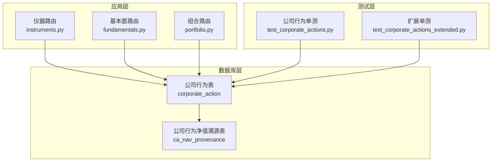
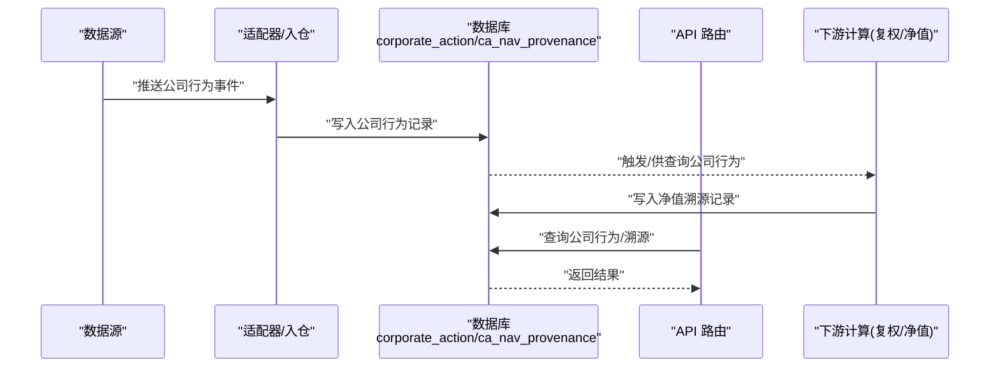
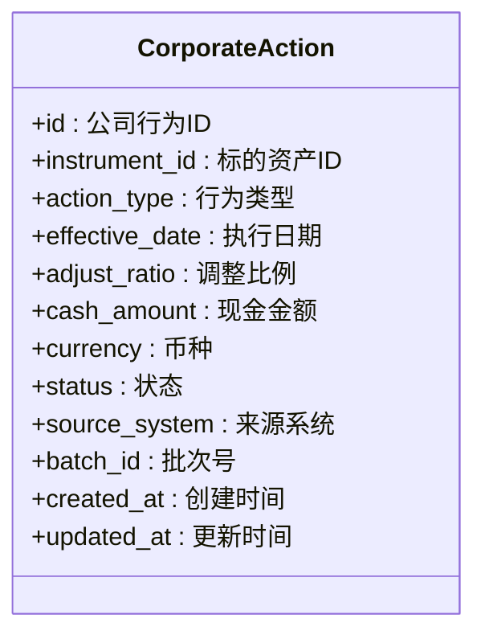
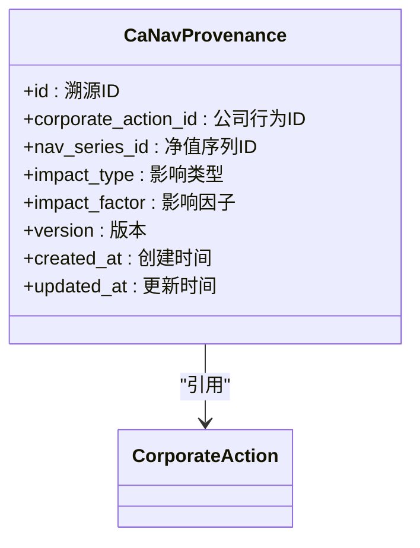
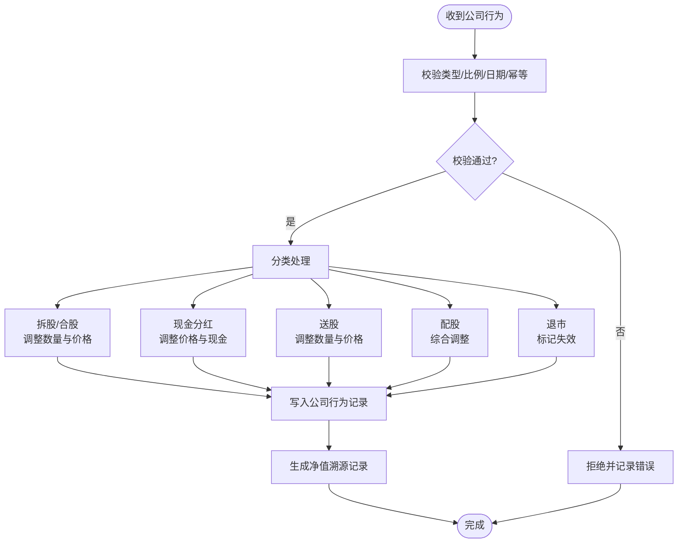
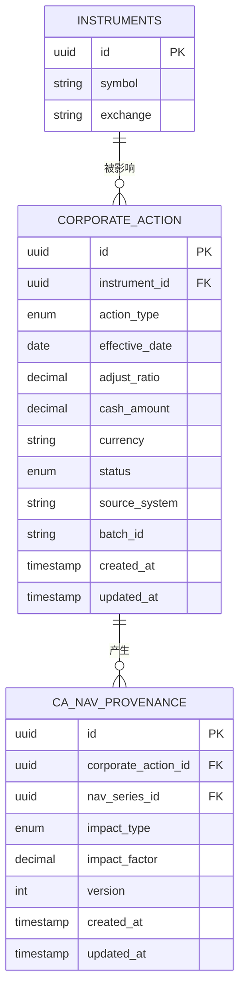
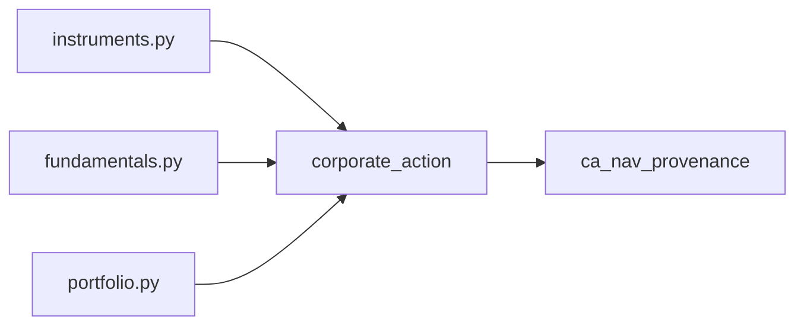

# 公司行为表(CorporateAction)

<cite>
**本文引用的文件**   
- [20260715_0004_corporate_action.py](file://sql/migrations/versions/20260715_0004_corporate_action.py)
- [20260715_0008_ca_nav_provenance.py](file://sql/migrations/versions/20260715_0008_ca_nav_provenance.py)
- [test_corporate_actions.py](file://tests/unit/test_corporate_actions.py)
- [test_corporate_actions_extended.py](file://tests/unit/test_corporate_actions_extended.py)
- [instruments.py](file://apps/api/routers/instruments.py)
- [fundamentals.py](file://apps/api/routers/fundamentals.py)
- [portfolio.py](file://apps/api/routers/portfolio.py)
</cite>

## 目录
1. [简介](#简介)
2. [项目结构](#项目结构)
3. [核心组件](#核心组件)
4. [架构总览](#架构总览)
5. [详细组件分析](#详细组件分析)
6. [依赖关系分析](#依赖关系分析)
7. [性能考虑](#性能考虑)
8. [故障排查指南](#故障排查指南)
9. [结论](#结论)
10. [附录](#附录)

## 简介
本文件围绕 CorporateAction（公司行为）数据模型与处理体系，提供从数据库设计、字段定义、业务含义、验证规则、状态管理到系统集成的完整说明。重点覆盖：
- CorporateAction 表的设计目的与关键字段（公司行为ID、标的资产、行为类型、执行日期、调整比例等）
- 不同公司行为类型的业务含义与处理逻辑（拆股、合股、分红等）
- 数据验证规则与状态管理
- 数据模型图与示例数据
- 与公司行为处理系统的集成方式
- 历史数据追溯与版本管理方案

## 项目结构
CorporateAction 相关实现主要分布在以下位置：
- 数据库迁移定义：sql/migrations/versions/20260715_0004_corporate_action.py
- 公司行为净值溯源迁移：sql/migrations/versions/20260715_0008_ca_nav_provenance.py
- 单元测试：tests/unit/test_corporate_actions.py、tests/unit/test_corporate_actions_extended.py
- API 路由（可能消费或展示公司行为信息）：apps/api/routers/instruments.py、fundamentals.py、portfolio.py

图表来源
- [20260715_0004_corporate_action.py](file://sql/migrations/versions/20260715_0004_corporate_action.py)
- [20260715_0008_ca_nav_provenance.py](file://sql/migrations/versions/20260715_0008_ca_nav_provenance.py)
- [instruments.py](file://apps/api/routers/instruments.py)
- [fundamentals.py](file://apps/api/routers/fundamentals.py)
- [portfolio.py](file://apps/api/routers/portfolio.py)

章节来源
- [20260715_0004_corporate_action.py](file://sql/migrations/versions/20260715_0004_corporate_action.py)
- [20260715_0008_ca_nav_provenance.py](file://sql/migrations/versions/20260715_0008_ca_nav_provenance.py)
- [test_corporate_actions.py](file://tests/unit/test_corporate_actions.py)
- [test_corporate_actions_extended.py](file://tests/unit/test_corporate_actions_extended.py)
- [instruments.py](file://apps/api/routers/instruments.py)
- [fundamentals.py](file://apps/api/routers/fundamentals.py)
- [portfolio.py](file://apps/api/routers/portfolio.py)

## 核心组件
- 公司行为主表（CorporateAction）
  - 作用：记录影响证券价格与持仓的公司事件，如拆股、合股、现金分红、送股、配股、退市等。
  - 关键维度：标的资产、行为类型、生效时间、调整因子、币种/单位、数据来源与审计信息。
- 公司行为净值溯源表（ca_nav_provenance）
  - 作用：将公司行为与净值计算链路关联，支持可追溯的因果链与版本化回溯。
- 测试套件
  - 覆盖基础与扩展场景，确保行为类型、比例、日期、校验与幂等写入的正确性。

章节来源
- [20260715_0004_corporate_action.py](file://sql/migrations/versions/20260715_0004_corporate_action.py)
- [20260715_0008_ca_nav_provenance.py](file://sql/migrations/versions/20260715_0008_ca_nav_provenance.py)
- [test_corporate_actions.py](file://tests/unit/test_corporate_actions.py)
- [test_corporate_actions_extended.py](file://tests/unit/test_corporate_actions_extended.py)

## 架构总览
公司行为数据在系统中的流转如下：
- 数据源通过适配器解析并生成公司行为记录，落库至 corporate_action。
- 下游模块（行情、基本面、组合估值）读取公司行为以进行复权、除权、净值重算。
- ca_nav_provenance 记录公司行为对净值的影响路径，便于审计与回滚。

图表来源
- [20260715_0004_corporate_action.py](file://sql/migrations/versions/20260715_0004_corporate_action.py)
- [20260715_0008_ca_nav_provenance.py](file://sql/migrations/versions/20260715_0008_ca_nav_provenance.py)
- [instruments.py](file://apps/api/routers/instruments.py)
- [fundamentals.py](file://apps/api/routers/fundamentals.py)
- [portfolio.py](file://apps/api/routers/portfolio.py)

## 详细组件分析

### 公司行为主表（CorporateAction）
- 设计目的
  - 作为公司行为的权威事实表，统一描述“何时、对谁、做了什么、如何调整”。
- 关键字段（概念性说明）
  - 公司行为ID：全局唯一标识，用于幂等写入与溯源。
  - 标的资产：关联 instruments 表，表示受影响证券。
  - 行为类型：枚举值，如拆股、合股、现金分红、送股、配股、退市等。
  - 执行日期：生效日/除权除息日等关键时间点。
  - 调整比例：针对数量或价格的乘数/加项，具体语义由行为类型决定。
  - 金额/币种：适用于现金类行为（如分红）。
  - 状态：草稿、已发布、已撤销等生命周期状态。
  - 元数据：来源系统、批次号、创建/更新时间戳、操作人等审计字段。
- 约束与索引
  - 主键：公司行为ID。
  - 唯一性：同一标的+行为类型+执行日期应唯一，避免重复事件。
  - 外键：标的资产引用 instruments；必要时引用基准日历或货币字典。
  - 索引：按标的+日期范围查询优化；按行为类型过滤优化。
- 数据验证规则
  - 类型合法性：仅允许白名单行为类型。
  - 比例有效性：拆分/合并比例需为正数且合理范围；现金分红金额非负。
  - 日期一致性：执行日期不得早于发行日；跨市场时区转换一致。
  - 幂等写入：基于公司行为ID去重，重复写入不改变既有记录。
- 状态管理
  - 状态机：草稿→已发布→已撤销（可选），变更需留痕。
  - 发布后不可直接修改，需通过新版本或撤销再发布流程。

图表来源
- [20260715_0004_corporate_action.py](file://sql/migrations/versions/20260715_0004_corporate_action.py)

章节来源
- [20260715_0004_corporate_action.py](file://sql/migrations/versions/20260715_0004_corporate_action.py)

### 公司行为净值溯源表（ca_nav_provenance）
- 设计目的
  - 将公司行为与净值计算过程建立因果关联，支持“因何行为导致净值变化”的可追溯性。
- 关键字段（概念性说明）
  - 溯源ID：主键。
  - 公司行为ID：外键，指向 corporate_action。
  - 净值序列ID：关联被影响的净值记录。
  - 影响类型：前复权、后复权、除息等。
  - 影响因子：用于重算的具体数值。
  - 版本：变更记录的版本号。
  - 审计字段：创建/更新时间、来源任务等。
- 使用场景
  - 当公司行为发布或更新时，增量重算受影响的净值区间，并写入溯源记录。
  - 提供按公司行为ID反查所有受影响净值的能力。

图表来源
- [20260715_0008_ca_nav_provenance.py](file://sql/migrations/versions/20260715_0008_ca_nav_provenance.py)

章节来源
- [20260715_0008_ca_nav_provenance.py](file://sql/migrations/versions/20260715_0008_ca_nav_provenance.py)

### 公司行为类型与处理逻辑
- 拆股（Stock Split）
  - 含义：股份数量增加，股价按比例下调，总市值不变。
  - 调整：数量×拆分比；价格÷拆分比。
- 合股（Reverse Split）
  - 含义：股份数量减少，股价按比例上调。
  - 调整：数量×合并比；价格÷合并比。
- 现金分红（Cash Dividend）
  - 含义：向股东派发现金，股价在除息日下调相应金额。
  - 调整：价格减去每股分红；持仓现金账户增加对应金额。
- 送股（Bonus Share）
  - 含义：以留存收益转增股本，数量增加，价格相应下调。
  - 调整：数量×(1+送股比)；价格÷(1+送股比)。
- 配股（Rights Issue）
  - 含义：向现有股东配售新股，通常有折扣价与认购期。
  - 调整：根据认购率与配股价综合调整价格与数量。
- 退市（Delisting）
  - 含义：证券终止上市交易，后续不再产生行情。
  - 调整：标记失效，停止参与计算。

图表来源
- [20260715_0004_corporate_action.py](file://sql/migrations/versions/20260715_0004_corporate_action.py)
- [20260715_0008_ca_nav_provenance.py](file://sql/migrations/versions/20260715_0008_ca_nav_provenance.py)

章节来源
- [20260715_0004_corporate_action.py](file://sql/migrations/versions/20260715_0004_corporate_action.py)
- [20260715_0008_ca_nav_provenance.py](file://sql/migrations/versions/20260715_0008_ca_nav_provenance.py)

### 数据模型图（ER）

图表来源
- [20260715_0004_corporate_action.py](file://sql/migrations/versions/20260715_0004_corporate_action.py)
- [20260715_0008_ca_nav_provenance.py](file://sql/migrations/versions/20260715_0008_ca_nav_provenance.py)

### 示例数据（概念性）
- 拆股示例
  - 标的：某股票
  - 行为类型：拆股
  - 执行日期：2024-06-10
  - 调整比例：1拆2（数量×2，价格÷2）
- 现金分红示例
  - 标的：某股票
  - 行为类型：现金分红
  - 执行日期：2024-05-20
  - 每股分红：0.5元
- 合股示例
  - 标的：某股票
  - 行为类型：合股
  - 执行日期：2024-07-01
  - 调整比例：10合1（数量÷10，价格×10）

[本节为概念性示例，不直接分析具体文件]

### 与公司行为处理系统的集成
- 入仓阶段
  - 适配器解析外部数据，生成公司行为记录并写入 corporate_action。
  - 幂等写入策略：以公司行为ID为主键，重复写入不改变既有记录。
- 计算阶段
  - 复权/除权：根据 corporate_action 的 adjust_ratio 与 action_type 调整历史价格序列。
  - 净值重算：结合 ca_nav_provenance 定位受影响区间，增量重算并记录版本。
- 服务暴露
  - API 路由（如 instruments、fundamentals、portfolio）可按标的/日期/类型查询公司行为及溯源信息。

章节来源
- [instruments.py](file://apps/api/routers/instruments.py)
- [fundamentals.py](file://apps/api/routers/fundamentals.py)
- [portfolio.py](file://apps/api/routers/portfolio.py)
- [20260715_0004_corporate_action.py](file://sql/migrations/versions/20260715_0004_corporate_action.py)
- [20260715_0008_ca_nav_provenance.py](file://sql/migrations/versions/20260715_0008_ca_nav_provenance.py)

### 历史数据追溯与版本管理
- 版本化
  - 每条公司行为记录具备 created_at/updated_at，配合状态字段体现生命周期。
  - ca_nav_provenance.version 记录每次重算的版本，支持对比与回滚。
- 可追溯性
  - 通过 corporate_action_id 反向查找所有受影响的净值记录。
  - 结合 batch_id/source_system 追踪数据来源与批次。
- 回滚策略
  - 若公司行为有误，先撤销（状态置为已撤销），再重新发布正确版本。
  - 对已发布的版本不做就地修改，保证审计链完整。

章节来源
- [20260715_0004_corporate_action.py](file://sql/migrations/versions/20260715_0004_corporate_action.py)
- [20260715_0008_ca_nav_provenance.py](file://sql/migrations/versions/20260715_0008_ca_nav_provenance.py)

## 依赖关系分析
- 内聚与耦合
  - corporate_action 与 instruments 强耦合（标的资产），与 ca_nav_provenance 一对多（溯源）。
  - API 路由弱耦合，通过查询接口获取公司行为与溯源信息。
- 外部依赖
  - 数据源适配器负责标准化输入；调度器/工作进程负责批量重算与溯源写入。
- 潜在循环依赖
  - 公司行为不应反向依赖净值计算模块，以避免循环；采用事件驱动或查询解耦。

图表来源
- [instruments.py](file://apps/api/routers/instruments.py)
- [fundamentals.py](file://apps/api/routers/fundamentals.py)
- [portfolio.py](file://apps/api/routers/portfolio.py)
- [20260715_0004_corporate_action.py](file://sql/migrations/versions/20260715_0004_corporate_action.py)
- [20260715_0008_ca_nav_provenance.py](file://sql/migrations/versions/20260715_0008_ca_nav_provenance.py)

章节来源
- [instruments.py](file://apps/api/routers/instruments.py)
- [fundamentals.py](file://apps/api/routers/fundamentals.py)
- [portfolio.py](file://apps/api/routers/portfolio.py)
- [20260715_0004_corporate_action.py](file://sql/migrations/versions/20260715_0004_corporate_action.py)
- [20260715_0008_ca_nav_provenance.py](file://sql/migrations/versions/20260715_0008_ca_nav_provenance.py)

## 性能考虑
- 索引策略
  - 在 instrument_id + effective_date 上建立复合索引，加速按标的与时间窗口的查询。
  - 在 action_type 上建立索引，便于按类型筛选。
- 写入优化
  - 批量写入公司行为与溯源记录，减少事务开销。
  - 幂等写入避免重复计算与锁竞争。
- 计算优化
  - 增量重算：仅重算受影响区间，避免全量重算。
  - 并行化：对不同标的或不同净值序列并行处理，注意资源隔离。

[本节提供一般性指导，不直接分析具体文件]

## 故障排查指南
- 常见问题
  - 重复公司行为：检查公司行为ID是否冲突，确认幂等写入逻辑。
  - 比例异常：校验拆分/合并比例是否为正数且在合理范围。
  - 日期不一致：核对执行日期与发行日、交易日历的关系。
  - 净值未更新：检查 ca_nav_provenance 是否存在对应记录，确认重算任务是否执行。
- 定位方法
  - 通过公司行为ID反查溯源记录，定位受影响净值序列。
  - 查看状态字段与审计字段，确认发布/撤销流程是否正确。
  - 比对来源系统与批次号，定位问题批次。

章节来源
- [test_corporate_actions.py](file://tests/unit/test_corporate_actions.py)
- [test_corporate_actions_extended.py](file://tests/unit/test_corporate_actions_extended.py)

## 结论
CorporateAction 表作为公司行为的事实中心，配合 ca_nav_provenance 实现了从事件录入、校验、发布到净值重算与溯源的全链路闭环。通过严格的验证规则、幂等写入与版本化管理，系统在准确性、可追溯性与可扩展性方面具备良好的工程实践基础。

[本节为总结性内容，不直接分析具体文件]

## 附录
- 术语
  - 公司行为：影响证券价格或持仓结构的上市公司事件。
  - 复权/除权：对历史价格进行调整以反映公司行为影响的方法。
  - 溯源：将结果变化与其原因事件建立关联的记录机制。

[本节为概念性补充，不直接分析具体文件]