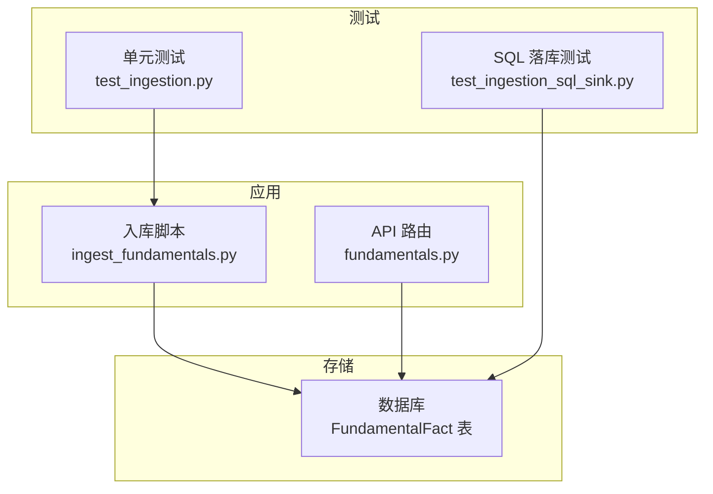
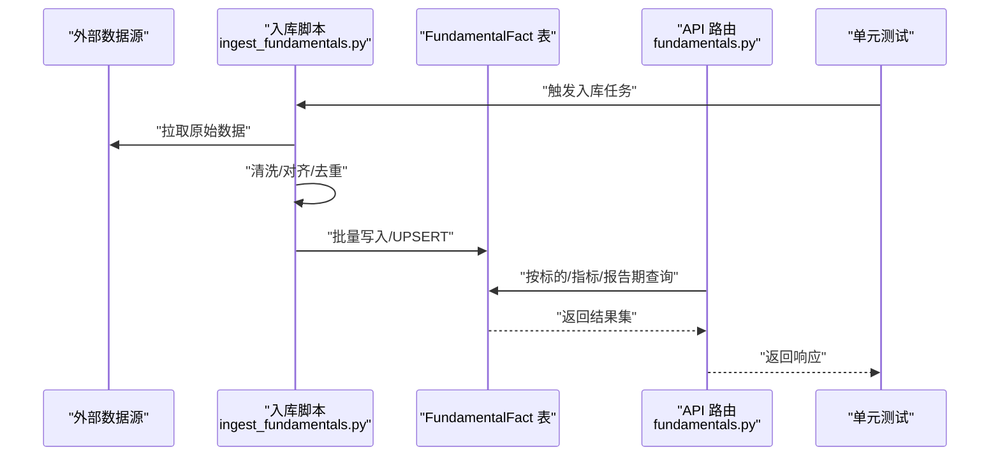
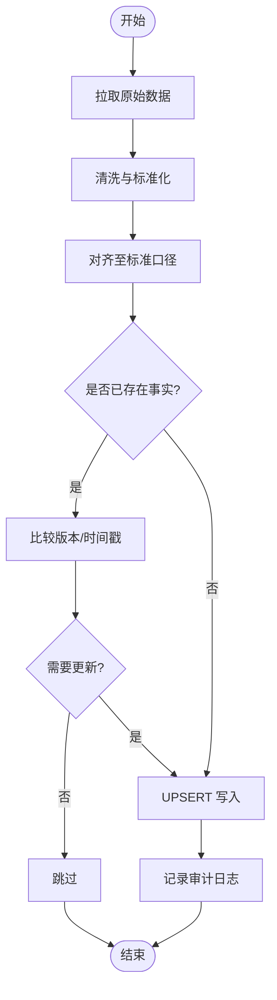
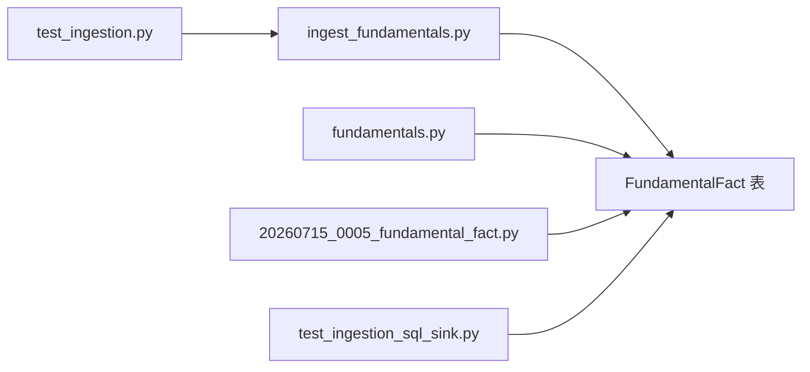

# 基本面数据表(FundamentalFact)

<cite>
**本文引用的文件**   
- [20260715_0005_fundamental_fact.py](file://sql/migrations/versions/20260715_0005_fundamental_fact.py)
- [fundamentals.py](file://apps/api/routers/fundamentals.py)
- [ingest_fundamentals.py](file://scripts/ingest_fundamentals.py)
- [test_ingestion_sql_sink.py](file://tests/unit/test_ingestion_sql_sink.py)
- [test_ingestion.py](file://tests/unit/test_ingestion.py)
</cite>

## 目录
1. [简介](#简介)
2. [项目结构](#项目结构)
3. [核心组件](#核心组件)
4. [架构总览](#架构总览)
5. [详细组件分析](#详细组件分析)
6. [依赖关系分析](#依赖关系分析)
7. [性能考虑](#性能考虑)
8. [故障排查指南](#故障排查指南)
9. [结论](#结论)
10. [附录](#附录)

## 简介
本文件面向“基本面数据表 FundamentalFact”的结构与使用，系统性说明其设计目的、字段定义、指标分类与管理方式、数据质量校验与异常值处理、访问模式与查询优化策略，以及与数据处理管道的集成方案（含更新频率与增量同步）。文档以仓库中的迁移脚本、API路由、入库脚本和测试用例为依据，确保内容与实际实现一致。

## 项目结构
FundamentalFact 相关代码分布在以下位置：
- 数据库迁移：用于创建和维护事实表结构与索引
- API 层：提供读取与状态查询接口
- 入库脚本：负责从外部源拉取并写入事实表
- 单元测试：覆盖入库流程与SQL落库路径

图表来源
- [fundamentals.py](file://apps/api/routers/fundamentals.py)
- [ingest_fundamentals.py](file://scripts/ingest_fundamentals.py)
- [20260715_0005_fundamental_fact.py](file://sql/migrations/versions/20260715_0005_fundamental_fact.py)
- [test_ingestion.py](file://tests/unit/test_ingestion.py)
- [test_ingestion_sql_sink.py](file://tests/unit/test_ingestion_sql_sink.py)

章节来源
- [20260715_0005_fundamental_fact.py](file://sql/migrations/versions/20260715_0005_fundamental_fact.py)
- [fundamentals.py](file://apps/api/routers/fundamentals.py)
- [ingest_fundamentals.py](file://scripts/ingest_fundamentals.py)
- [test_ingestion.py](file://tests/unit/test_ingestion.py)
- [test_ingestion_sql_sink.py](file://tests/unit/test_ingestion_sql_sink.py)

## 核心组件
- 事实表 FundamentalFact：承载标的资产在不同报告期的各项基本面指标值，作为下游特征工程、回测与研究的数据基座。
- 入库管道 ingest_fundamentals.py：将外部数据标准化后批量写入 FundamentalFact，支持幂等与去重。
- API 路由 fundamentals.py：对外暴露查询接口，供研究或生产系统检索基本面事实。
- 迁移脚本 20260715_0005_fundamental_fact.py：定义表结构、约束与索引，保障数据一致性与查询性能。

章节来源
- [20260715_0005_fundamental_fact.py](file://sql/migrations/versions/20260715_0005_fundamental_fact.py)
- [ingest_fundamentals.py](file://scripts/ingest_fundamentals.py)
- [fundamentals.py](file://apps/api/routers/fundamentals.py)

## 架构总览
下图展示从数据源到存储再到API的端到端流程，以及测试对关键路径的验证。

图表来源
- [ingest_fundamentals.py](file://scripts/ingest_fundamentals.py)
- [fundamentals.py](file://apps/api/routers/fundamentals.py)
- [20260715_0005_fundamental_fact.py](file://sql/migrations/versions/20260715_0005_fundamental_fact.py)
- [test_ingestion.py](file://tests/unit/test_ingestion.py)
- [test_ingestion_sql_sink.py](file://tests/unit/test_ingestion_sql_sink.py)

## 详细组件分析

### 事实表 FundamentalFact 设计与字段定义
- 设计目的
  - 以“标的资产 × 指标名称 × 报告日期”为维度，记录单一数值型基本面事实，便于跨市场、跨口径的统一建模与分析。
  - 通过唯一键与索引保证可重复写入与高效检索。
- 关键字段（概念性描述）
  - 事实ID：全局唯一标识，用于幂等写入与溯源。
  - 标的资产：统一编码的资产标识，关联主数据。
  - 指标名称：标准化的指标字典项，如盈利、估值、现金流等。
  - 数值：浮点型指标值，支持缺失标记。
  - 报告日期：指标所属的报告期时间戳。
  - 数据来源：标注数据提供方与采集批次，便于审计与回溯。
- 约束与索引
  - 唯一约束：基于“标的资产 + 指标名称 + 报告日期 + 数据来源”的组合键，避免重复事实。
  - 查询索引：针对常用过滤条件建立索引，提升按标的、指标、时间窗口的查询效率。
- 数据类型与取值范围
  - 数值采用高精度浮点类型；缺失值采用约定占位符或NULL语义。
  - 指标名称需遵循字典规范，新增指标需走变更评审。

章节来源
- [20260715_0005_fundamental_fact.py](file://sql/migrations/versions/20260715_0005_fundamental_fact.py)

### 指标分类与管理方式
- 分类维度
  - 业务域：盈利能力、估值水平、成长能力、财务健康度等。
  - 口径类型：单期值、滚动窗口、同比/环比比率等。
  - 发布节奏：季报、半年报、年报、月度/周度补充指标。
- 管理方式
  - 指标字典集中维护，包含名称、单位、是否缺失允许、默认填充策略、版本信息。
  - 新增/废弃指标需通过迁移或配置变更流程，确保上下游一致性。
  - 指标命名采用小写下划线风格，避免歧义。

章节来源
- [20260715_0005_fundamental_fact.py](file://sql/migrations/versions/20260715_0005_fundamental_fact.py)

### 数据质量校验规则与异常值处理
- 基础校验
  - 非空检查：标的资产、指标名称、报告日期必填。
  - 数值范围：根据指标字典设定上下界与合理区间，越界标记异常。
  - 一致性：同一标的同指标在同报告期的多来源冲突时，依据优先级策略选择或保留多版本。
- 异常值处理
  - 离群检测：基于历史分布或行业分位数进行阈值判定，超限值进入异常队列。
  - 回填策略：优先使用权威源修正；不可修正则标记缺失并告警。
- 审计与追踪
  - 记录数据来源、批次号、校验结果与处理动作，便于问题定位与合规审计。

章节来源
- [ingest_fundamentals.py](file://scripts/ingest_fundamentals.py)
- [test_ingestion.py](file://tests/unit/test_ingestion.py)
- [test_ingestion_sql_sink.py](file://tests/unit/test_ingestion_sql_sink.py)

### 数据访问模式与查询优化策略
- 典型查询模式
  - 按标的+指标+时间窗口检索：用于构建面板数据与因子序列。
  - 按指标+时间切片检索：用于横截面分析与排名。
  - 按数据来源+批次检索：用于溯源与对比。
- 优化建议
  - 利用组合索引加速常见过滤条件。
  - 分区策略：按报告日期或指标大类分区，减少扫描范围。
  - 物化视图/聚合表：对高频统计（如均值、分位数）预计算。
  - 分页与投影：仅返回必要列，控制返回量。

章节来源
- [20260715_0005_fundamental_fact.py](file://sql/migrations/versions/20260715_0005_fundamental_fact.py)
- [fundamentals.py](file://apps/api/routers/fundamentals.py)

### 与数据处理管道的集成
- 入库流程
  - 拉取：从外部源获取原始数据。
  - 清洗：标准化字段、单位换算、缺失处理。
  - 对齐：统一到标准日历与报告期口径。
  - 去重：基于唯一键UPSERT，保证幂等。
  - 落库：批量写入 FundamentalFact。
- 幂等与重试
  - 写入前检查是否存在相同事实，存在则比较版本号或更新时间决定是否覆盖。
  - 失败自动重试，结合事务与日志记录。
- 监控与告警
  - 记录入库数量、耗时、异常率与延迟。
  - 对关键指标缺失或异常比例超阈告警。

图表来源
- [ingest_fundamentals.py](file://scripts/ingest_fundamentals.py)
- [20260715_0005_fundamental_fact.py](file://sql/migrations/versions/20260715_0005_fundamental_fact.py)

章节来源
- [ingest_fundamentals.py](file://scripts/ingest_fundamentals.py)
- [test_ingestion.py](file://tests/unit/test_ingestion.py)
- [test_ingestion_sql_sink.py](file://tests/unit/test_ingestion_sql_sink.py)

### 数据更新频率与增量同步方案
- 更新频率
  - 财报类：随公告日T+1/T+2执行增量更新。
  - 月频/周频：按固定周期调度，避免全量重复。
- 增量同步
  - 基于“报告日期 + 数据来源 + 批次号”的增量窗口，仅拉取新窗口数据。
  - 使用高水位（watermark）记录上次成功处理的最新时间点，断点续跑。
  - 合并策略：同键不同批次的覆盖顺序由版本号或时间戳决定。
- 一致性保障
  - 写入采用事务包裹，失败回滚。
  - 幂等写入避免重复累积。
  - 校验通过后提交，未通过进入死信队列人工复核。

章节来源
- [ingest_fundamentals.py](file://scripts/ingest_fundamentals.py)
- [20260715_0005_fundamental_fact.py](file://sql/migrations/versions/20260715_0005_fundamental_fact.py)

## 依赖关系分析
- 模块耦合
  - 入库脚本依赖数据源适配器与校验器，最终写入 FundamentalFact。
  - API 路由依赖数据库连接池与查询构造器，面向只读场景。
  - 迁移脚本独立于运行时，仅在部署阶段执行。
- 外部依赖
  - 数据源：交易所/披露平台/第三方数据商。
  - 调度系统：定时触发入库任务。
  - 监控：指标埋点与告警通道。

图表来源
- [ingest_fundamentals.py](file://scripts/ingest_fundamentals.py)
- [fundamentals.py](file://apps/api/routers/fundamentals.py)
- [20260715_0005_fundamental_fact.py](file://sql/migrations/versions/20260715_0005_fundamental_fact.py)
- [test_ingestion.py](file://tests/unit/test_ingestion.py)
- [test_ingestion_sql_sink.py](file://tests/unit/test_ingestion_sql_sink.py)

章节来源
- [ingest_fundamentals.py](file://scripts/ingest_fundamentals.py)
- [fundamentals.py](file://apps/api/routers/fundamentals.py)
- [20260715_0005_fundamental_fact.py](file://sql/migrations/versions/20260715_0005_fundamental_fact.py)
- [test_ingestion.py](file://tests/unit/test_ingestion.py)
- [test_ingestion_sql_sink.py](file://tests/unit/test_ingestion_sql_sink.py)

## 性能考虑
- 写入性能
  - 批量插入优于逐条写入；开启事务合并提交。
  - UPSERT 前做本地去重，减少锁竞争。
- 查询性能
  - 合理使用索引与分区，避免全表扫描。
  - 对热点查询建立缓存或物化视图。
- 资源控制
  - 限制单次拉取与写入大小，防止内存溢出。
  - 设置超时与重试退避策略。

[本节为通用指导，不直接分析具体文件]

## 故障排查指南
- 常见问题
  - 重复事实：检查唯一键与幂等逻辑，确认批次号与时间戳。
  - 指标缺失：核对数据源可用性、清洗规则与回填策略。
  - 查询缓慢：评估索引命中与分区裁剪，必要时调整查询条件。
- 定位手段
  - 查看入库日志与审计记录，定位失败批次。
  - 使用测试用例复现问题，缩小范围。
  - 比对不同来源的同指标差异，确认优先级策略。

章节来源
- [test_ingestion.py](file://tests/unit/test_ingestion.py)
- [test_ingestion_sql_sink.py](file://tests/unit/test_ingestion_sql_sink.py)
- [ingest_fundamentals.py](file://scripts/ingest_fundamentals.py)

## 结论
FundamentalFact 表以“标的×指标×报告期”为核心维度，配合严格的唯一约束与索引设计，支撑高质量的基本面数据管理与高效查询。通过幂等入库、增量同步与完善的质量校验，系统在可扩展性与稳定性之间取得平衡。建议在后续迭代中持续完善指标字典、监控告警与查询物化，进一步提升整体效能。

[本节为总结性内容，不直接分析具体文件]

## 附录
- 术语
  - 事实：在特定时间与口径下的单一指标观测值。
  - 幂等：多次执行同一操作结果一致。
  - 增量：仅处理新增或变更的数据窗口。
- 参考路径
  - 表结构与索引定义：[20260715_0005_fundamental_fact.py](file://sql/migrations/versions/20260715_0005_fundamental_fact.py)
  - 入库流程实现：[ingest_fundamentals.py](file://scripts/ingest_fundamentals.py)
  - API 查询入口：[fundamentals.py](file://apps/api/routers/fundamentals.py)
  - 入库与落库测试：[test_ingestion.py](file://tests/unit/test_ingestion.py)、[test_ingestion_sql_sink.py](file://tests/unit/test_ingestion_sql_sink.py)