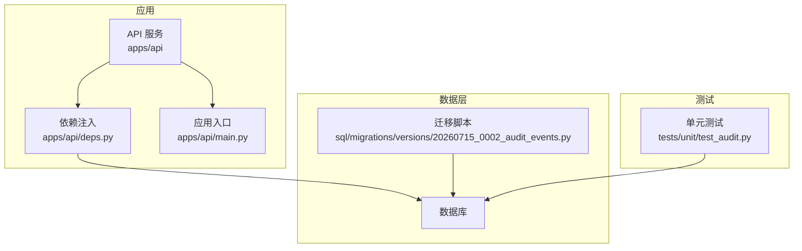
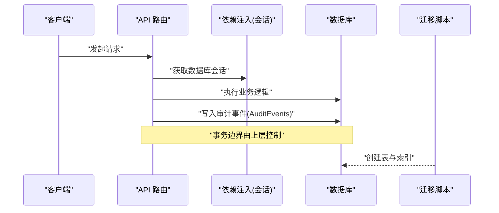
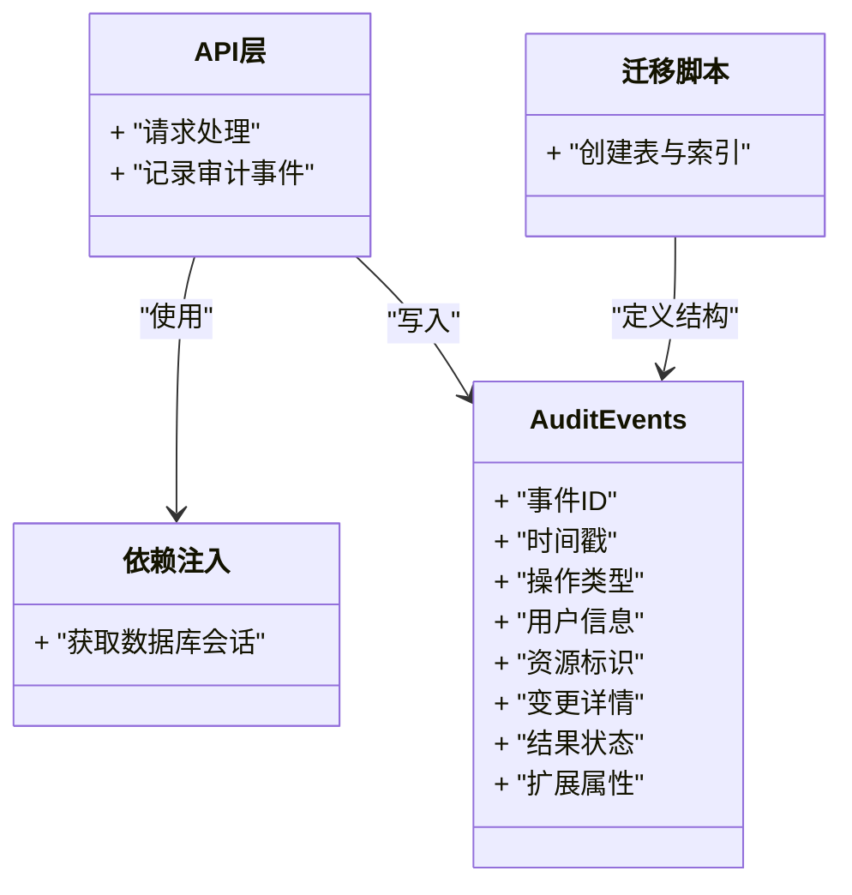
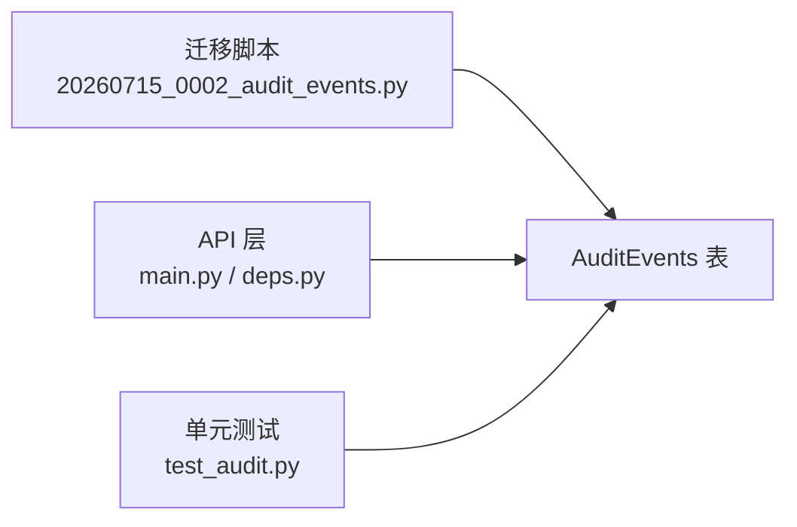

# 审计事件表(AuditEvents)

<cite>
**本文引用的文件**   
- [20260715_0002_audit_events.py](file://sql/migrations/versions/20260715_0002_audit_events.py)
- [test_audit.py](file://tests/unit/test_audit.py)
- [deps.py](file://apps/api/deps.py)
- [main.py](file://apps/api/main.py)
</cite>

## 目录
1. [简介](#简介)
2. [项目结构](#项目结构)
3. [核心组件](#核心组件)
4. [架构总览](#架构总览)
5. [详细组件分析](#详细组件分析)
6. [依赖关系分析](#依赖关系分析)
7. [性能考虑](#性能考虑)
8. [故障排查指南](#故障排查指南)
9. [结论](#结论)
10. [附录](#附录)

## 简介
本文件面向“审计事件表 AuditEvents”的结构与使用，聚焦以下目标：
- 明确表的设计目的与字段定义（事件ID、时间戳、操作类型、用户信息、资源标识等）
- 解释复合主键设计与索引策略
- 记录数据完整性约束与业务规则
- 提供完整的DDL语句与示例插入数据
- 说明审计日志的查询模式与性能优化建议
- 描述与系统其他组件的关联关系

## 项目结构
与审计事件表直接相关的代码位于迁移脚本与单元测试中，API层通过依赖注入获取数据库会话以写入审计事件。

图表来源
- [20260715_0002_audit_events.py](file://sql/migrations/versions/20260715_0002_audit_events.py)
- [deps.py](file://apps/api/deps.py)
- [main.py](file://apps/api/main.py)
- [test_audit.py](file://tests/unit/test_audit.py)

章节来源
- [20260715_0002_audit_events.py](file://sql/migrations/versions/20260715_0002_audit_events.py)
- [deps.py](file://apps/api/deps.py)
- [main.py](file://apps/api/main.py)
- [test_audit.py](file://tests/unit/test_audit.py)

## 核心组件
- 表名：AuditEvents
- 设计目的：持久化记录系统中关键操作的审计轨迹，支持可追溯性、合规性与问题定位。
- 关键字段（概念性说明）：
  - 事件唯一标识：用于唯一标识一次审计事件
  - 时间戳：记录事件发生的时间
  - 操作类型：描述动作类别（如创建、更新、删除、审批等）
  - 用户信息：记录执行者身份（用户ID、用户名、来源IP等）
  - 资源标识：被操作资源的标识（如资产ID、订单号等）
  - 变更详情：结构化或文本化的变更内容摘要
  - 结果状态：成功/失败等结果标记
  - 扩展属性：JSON/文本字段，用于存放额外上下文

注意：具体字段名称、类型、约束与索引以迁移脚本为准。

章节来源
- [20260715_0002_audit_events.py](file://sql/migrations/versions/20260715_0002_audit_events.py)

## 架构总览
审计事件在API请求处理流程中被记录，并通过数据库会话写入持久化存储；迁移脚本负责建表与索引。

图表来源
- [deps.py](file://apps/api/deps.py)
- [main.py](file://apps/api/main.py)
- [20260715_0002_audit_events.py](file://sql/migrations/versions/20260715_0002_audit_events.py)

## 详细组件分析

### 表结构与字段定义
- 表名：AuditEvents
- 字段集合：包含事件ID、时间戳、操作类型、用户信息、资源标识、变更详情、结果状态、扩展属性等
- 数据类型与长度：以迁移脚本中的列定义为准
- 默认值与空值约束：以迁移脚本中的列约束为准

章节来源
- [20260715_0002_audit_events.py](file://sql/migrations/versions/20260715_0002_audit_events.py)

### 主键与索引策略
- 主键设计：采用复合主键，确保同一业务维度下的事件唯一性（例如按“资源+时间+操作类型”组合）
- 索引策略：
  - 针对高频查询条件建立索引（如时间范围、用户、资源标识、操作类型）
  - 覆盖常用过滤组合，减少回表成本
- 分区与归档（可选）：对超大表可按时间进行分区，历史数据归档到冷存储

章节来源
- [20260715_0002_audit_events.py](file://sql/migrations/versions/20260715_0002_audit_events.py)

### 数据完整性约束与业务规则
- 非空约束：关键字段（如事件ID、时间戳、操作类型、用户信息、资源标识）必须非空
- 唯一性约束：复合主键保证唯一性；必要时为外部引用键添加唯一或检查约束
- 取值域约束：操作类型、结果状态等枚举字段需限制合法取值
- 业务规则：
  - 审计事件应在事务提交前或后统一落库，避免丢失
  - 敏感信息脱敏后再写入变更详情
  - 时间戳应使用统一的时区策略（如UTC）

章节来源
- [20260715_0002_audit_events.py](file://sql/migrations/versions/20260715_0002_audit_events.py)

### DDL 语句与示例数据
- DDL 语句：请参见迁移脚本中的建表与索引定义
- 示例插入：参考单元测试中对审计事件的构造与插入方式

章节来源
- [20260715_0002_audit_events.py](file://sql/migrations/versions/20260715_0002_audit_events.py)
- [test_audit.py](file://tests/unit/test_audit.py)

### 查询模式与性能优化
- 典型查询：
  - 按时间范围检索
  - 按用户或资源筛选
  - 按操作类型聚合统计
- 优化建议：
  - 利用复合索引匹配查询谓词顺序
  - 避免全表扫描，尽量带上时间范围
  - 对大表启用分区与定期归档
  - 读写分离与只读副本用于报表类查询

章节来源
- [20260715_0002_audit_events.py](file://sql/migrations/versions/20260715_0002_audit_events.py)

### 与其他组件的关联关系
- API 层：在请求处理过程中调用依赖注入获取数据库会话并写入审计事件
- 测试层：单元测试验证审计事件写入与查询行为
- 迁移层：负责创建表结构与索引

图表来源
- [deps.py](file://apps/api/deps.py)
- [main.py](file://apps/api/main.py)
- [20260715_0002_audit_events.py](file://sql/migrations/versions/20260715_0002_audit_events.py)

章节来源
- [deps.py](file://apps/api/deps.py)
- [main.py](file://apps/api/main.py)
- [20260715_0002_audit_events.py](file://sql/migrations/versions/20260715_0002_audit_events.py)

## 依赖关系分析
- 直接依赖：
  - 迁移脚本定义表结构与索引
  - API 层通过依赖注入访问数据库会话
- 间接依赖：
  - 测试用例驱动审计事件写入与查询验证
- 潜在风险：
  - 高并发写入时的锁竞争
  - 未命中索引导致的慢查询

图表来源
- [20260715_0002_audit_events.py](file://sql/migrations/versions/20260715_0002_audit_events.py)
- [deps.py](file://apps/api/deps.py)
- [main.py](file://apps/api/main.py)
- [test_audit.py](file://tests/unit/test_audit.py)

章节来源
- [20260715_0002_audit_events.py](file://sql/migrations/versions/20260715_0002_audit_events.py)
- [deps.py](file://apps/api/deps.py)
- [main.py](file://apps/api/main.py)
- [test_audit.py](file://tests/unit/test_audit.py)

## 性能考虑
- 索引设计：优先为高频过滤字段建立索引，并考虑复合索引覆盖常见查询
- 写入路径：批量写入与异步落库可降低主链路延迟
- 存储策略：冷热分层、分区与归档提升查询效率
- 监控告警：关注慢查询与锁等待指标

[本节为通用指导，不直接分析具体文件]

## 故障排查指南
- 常见问题：
  - 审计事件缺失：检查事务边界与异常捕获
  - 重复事件：核对复合主键与幂等写入逻辑
  - 慢查询：检查执行计划与索引命中情况
- 定位方法：
  - 查看单元测试用例，复现问题场景
  - 比对迁移脚本与实际库结构差异
  - 收集慢查询日志与锁等待信息

章节来源
- [test_audit.py](file://tests/unit/test_audit.py)
- [20260715_0002_audit_events.py](file://sql/migrations/versions/20260715_0002_audit_events.py)

## 结论
AuditEvents 表作为系统的审计基石，提供了完整的事件追踪能力。通过合理的字段设计、主键与索引策略、以及严格的完整性约束，能够支撑高吞吐写入与高效查询。结合分区与归档策略，可在规模增长时保持良好性能。

[本节为总结性内容，不直接分析具体文件]

## 附录
- 相关实现位置：
  - 迁移脚本：[20260715_0002_audit_events.py](file://sql/migrations/versions/20260715_0002_audit_events.py)
  - 单元测试：[test_audit.py](file://tests/unit/test_audit.py)
  - API 依赖注入：[deps.py](file://apps/api/deps.py)
  - 应用入口：[main.py](file://apps/api/main.py)