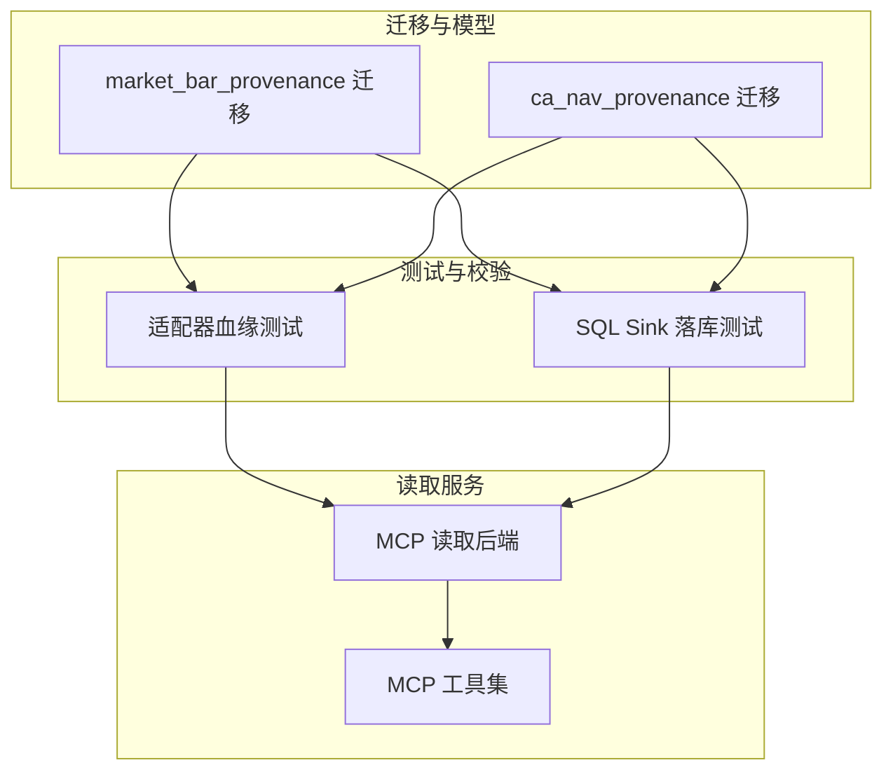
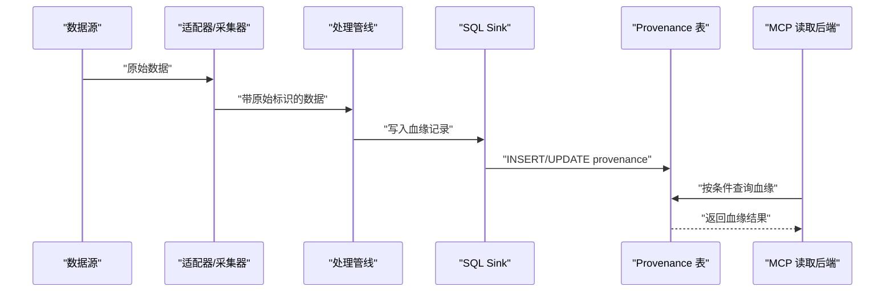
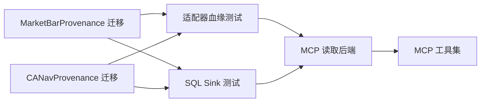

# 数据来源追踪表(Provenance)

<cite>
**本文引用的文件**   
- [20260715_0007_market_bar_provenance.py](file://sql/migrations/versions/20260715_0007_market_bar_provenance.py)
- [20260715_0008_ca_nav_provenance.py](file://sql/migrations/versions/20260715_0008_ca_nav_provenance.py)
- [test_adapter_provenance.py](file://tests/unit/test_adapter_provenance.py)
- [test_ingestion_sql_sink.py](file://tests/unit/test_ingestion_sql_sink.py)
- [db_backends.py](file://apps/quant-read-mcp/db_backends.py)
- [tools.py](file://apps/quant-read-mcp/tools.py)
</cite>

## 目录
1. [引言](#引言)
2. [项目结构](#项目结构)
3. [核心组件](#核心组件)
4. [架构总览](#架构总览)
5. [详细组件分析](#详细组件分析)
6. [依赖关系分析](#依赖关系分析)
7. [性能考虑](#性能考虑)
8. [故障排查指南](#故障排查指南)
9. [结论](#结论)
10. [附录](#附录)

## 引言
本文件围绕“数据来源追踪表（Provenance）”的设计与实现，系统性阐述 MarketBarProvenance 与 CANavProvenance 两张追踪表的结构、字段语义、血缘建立与维护机制、数据质量评估标准与溯源链完整性检查方法，并提供完整的查询模式与分析方法。同时说明其与数据质量管理模块的集成方式，以及数据清洗与修复流程的自动化落地方案。

## 项目结构
本项目在数据库迁移层定义了 Provenance 相关表结构，并在测试与读取侧提供了相应的使用与验证路径：
- 迁移定义：MarketBarProvenance 与 CANavProvenance 的建表与索引由 Alembic 迁移脚本维护
- 单元测试：覆盖适配器写入、SQL Sink 落库等关键路径
- 读取接口：MCP 读取后端提供对 Provenance 表的查询能力

图表来源
- [20260715_0007_market_bar_provenance.py](file://sql/migrations/versions/20260715_0007_market_bar_provenance.py)
- [20260715_0008_ca_nav_provenance.py](file://sql/migrations/versions/20260715_0008_ca_nav_provenance.py)
- [test_adapter_provenance.py](file://tests/unit/test_adapter_provenance.py)
- [test_ingestion_sql_sink.py](file://tests/unit/test_ingestion_sql_sink.py)
- [db_backends.py](file://apps/quant-read-mcp/db_backends.py)
- [tools.py](file://apps/quant-read-mcp/tools.py)

章节来源
- [20260715_0007_market_bar_provenance.py](file://sql/migrations/versions/20260715_0007_market_bar_provenance.py)
- [20260715_0008_ca_nav_provenance.py](file://sql/migrations/versions/20260715_0008_ca_nav_provenance.py)
- [test_adapter_provenance.py](file://tests/unit/test_adapter_provenance.py)
- [test_ingestion_sql_sink.py](file://tests/unit/test_ingestion_sql_sink.py)
- [db_backends.py](file://apps/quant-read-mcp/db_backends.py)
- [tools.py](file://apps/quant-read-mcp/tools.py)

## 核心组件
- MarketBarProvenance：用于记录市场K线数据的血缘信息，包括数据源ID、原始数据标识、转换过程、质量评分、时间戳等关键字段，支撑从原始采集到加工产物的全链路可追溯。
- CANavProvenance：用于记录基金净值（NAV）及公司行为相关数据的血缘信息，字段设计与 MarketBarProvenance 保持一致性，便于统一治理与审计。

上述两张表共同构成“数据血缘”的核心载体，贯穿采集、清洗、转换、入库与消费各环节。

章节来源
- [20260715_0007_market_bar_provenance.py](file://sql/migrations/versions/20260715_0007_market_bar_provenance.py)
- [20260715_0008_ca_nav_provenance.py](file://sql/migrations/versions/20260715_0008_ca_nav_provenance.py)

## 架构总览
Provenance 表在数据流水线中的位置如下：
- 采集端：为每条产出记录生成唯一“原始数据标识”，并绑定“数据源ID”
- 处理端：在每次转换步骤中追加“转换过程”元数据，更新“质量评分”
- 存储端：通过 SQL Sink 将血缘记录持久化至 Provenance 表
- 消费端：通过 MCP 读取后端暴露查询接口，支持血缘回溯与质量审计

图表来源
- [test_ingestion_sql_sink.py](file://tests/unit/test_ingestion_sql_sink.py)
- [db_backends.py](file://apps/quant-read-mcp/db_backends.py)
- [tools.py](file://apps/quant-read-mcp/tools.py)

## 详细组件分析

### MarketBarProvenance 表设计
- 设计目的：为市场K线数据建立完整血缘，确保从多源采集到下游分析的每一步都可追溯、可度量、可审计。
- 关键字段（概念性说明）：
  - 数据源ID：标识数据来自哪个外部系统或内部管道
  - 原始数据标识：指向不可变原始记录的唯一键，保证溯源起点稳定
  - 转换过程：描述当前记录经历的清洗、对齐、聚合等步骤
  - 质量评分：基于规则与统计的质量度量，供阈值拦截与告警
  - 时间戳：记录创建与更新时间，支撑时序回溯与版本管理
- 典型约束与索引：
  - 以“原始数据标识+数据源ID”作为主键或唯一键，避免重复血缘
  - 针对时间戳与质量评分建立索引，加速范围查询与筛选
- 血缘维护策略：
  - 新增：首次入库时插入一条血缘记录
  - 更新：当发生重算或修正时，追加新的血缘行并标记版本
  - 删除：软删除或归档，保留历史可查

章节来源
- [20260715_0007_market_bar_provenance.py](file://sql/migrations/versions/20260715_0007_market_bar_provenance.py)

### CANavProvenance 表设计
- 设计目的：为基金净值与公司行为数据建立血缘，保障净值计算与事件处理的透明性与一致性。
- 关键字段（概念性说明）：
  - 数据源ID：区分不同净值提供方或公司行为来源
  - 原始数据标识：对应原始净值文件或事件流水的唯一键
  - 转换过程：包含去重、对齐、复权、合并等步骤
  - 质量评分：覆盖缺失率、异常值、一致性等维度
  - 时间戳：记录批次时间与处理时间
- 典型约束与索引：
  - 与 MarketBarProvenance 一致的键空间设计，便于统一治理
  - 针对标的、日期、批次的复合索引，提升常见查询效率
- 血缘维护策略：
  - 增量更新：仅对变更批次写入新血缘
  - 版本化：同一标的同一天可能有多条血缘，通过版本号区分

章节来源
- [20260715_0008_ca_nav_provenance.py](file://sql/migrations/versions/20260715_0008_ca_nav_provenance.py)

### 血缘建立与维护机制
- 建立时机：
  - 采集阶段：为每条产出分配“原始数据标识”，并记录“数据源ID”
  - 处理阶段：每步转换写入“转换过程”，并刷新“质量评分”
  - 入库阶段：通过 SQL Sink 批量写入 Provenance 表
- 维护策略：
  - 幂等写入：基于唯一键去重，避免重复血缘
  - 版本控制：对重算与修复场景采用追加式更新
  - 审计日志：关键操作留痕，便于问题定位

章节来源
- [test_adapter_provenance.py](file://tests/unit/test_adapter_provenance.py)
- [test_ingestion_sql_sink.py](file://tests/unit/test_ingestion_sql_sink.py)

### 数据质量评估标准与溯源链完整性检查
- 质量评估维度：
  - 完整性：必填字段非空比例、时间序列连续性
  - 准确性：与权威源比对误差、数值合理性
  - 一致性：跨源冲突检测、单位与口径统一
  - 时效性：延迟与批次新鲜度
- 溯源链完整性检查：
  - 起点可达：每个产物都能追溯到“原始数据标识”
  - 过程连续：转换过程无断点，版本有序
  - 终点可验：下游消费能反向定位上游血缘

章节来源
- [test_adapter_provenance.py](file://tests/unit/test_adapter_provenance.py)

### 数据追踪查询模式与分析方法
- 常用查询模式：
  - 按“原始数据标识”反查所有衍生血缘
  - 按“数据源ID+时间范围”扫描批次血缘
  - 按“质量评分阈值”筛选低质记录
  - 按“转换过程关键词”定位特定处理步骤
- 分析方法：
  - 血缘深度分析：统计平均转换层级与最长链路
  - 影响面分析：定位某数据源异常影响的下游范围
  - 质量趋势分析：跟踪各源质量评分变化

章节来源
- [db_backends.py](file://apps/quant-read-mcp/db_backends.py)
- [tools.py](file://apps/quant-read-mcp/tools.py)

### 与数据质量管理模块的集成方式
- 指标上报：Provenance 中的质量评分可作为质量模块输入
- 规则联动：质量规则触发后，自动更新血缘中的状态与备注
- 告警与工单：低质血缘触发告警，并生成修复任务

章节来源
- [test_adapter_provenance.py](file://tests/unit/test_adapter_provenance.py)

### 数据清洗与修复流程的自动化实现
- 自动化流程：
  - 发现：基于质量评分与规则引擎识别问题记录
  - 决策：根据策略选择修复、回滚或人工复核
  - 执行：调用处理管线进行修复并重算
  - 验证：重新评估质量评分并更新血缘
- 回滚与恢复：
  - 基于版本化的血缘记录，快速恢复到上一健康版本
  - 保留修复前后差异，便于审计

章节来源
- [test_ingestion_sql_sink.py](file://tests/unit/test_ingestion_sql_sink.py)

## 依赖关系分析
- 迁移脚本与测试用例强耦合：测试用例依赖迁移定义的表结构与约束
- 读取服务依赖数据库连接与权限：需确保 MCP 读取后端具备只读访问权限
- 血缘写入与处理管线解耦：通过 SQL Sink 抽象写入接口，降低耦合

图表来源
- [20260715_0007_market_bar_provenance.py](file://sql/migrations/versions/20260715_0007_market_bar_provenance.py)
- [20260715_0008_ca_nav_provenance.py](file://sql/migrations/versions/20260715_0008_ca_nav_provenance.py)
- [test_adapter_provenance.py](file://tests/unit/test_adapter_provenance.py)
- [test_ingestion_sql_sink.py](file://tests/unit/test_ingestion_sql_sink.py)
- [db_backends.py](file://apps/quant-read-mcp/db_backends.py)
- [tools.py](file://apps/quant-read-mcp/tools.py)

章节来源
- [20260715_0007_market_bar_provenance.py](file://sql/migrations/versions/20260715_0007_market_bar_provenance.py)
- [20260715_0008_ca_nav_provenance.py](file://sql/migrations/versions/20260715_0008_ca_nav_provenance.py)
- [test_adapter_provenance.py](file://tests/unit/test_adapter_provenance.py)
- [test_ingestion_sql_sink.py](file://tests/unit/test_ingestion_sql_sink.py)
- [db_backends.py](file://apps/quant-read-mcp/db_backends.py)
- [tools.py](file://apps/quant-read-mcp/tools.py)

## 性能考虑
- 索引优化：为高频查询字段（如时间戳、数据源ID、原始数据标识）建立合适索引
- 分区策略：按时间或批次进行分区，减少扫描范围
- 批量写入：通过 SQL Sink 批量插入，降低事务开销
- 冷热分离：历史血缘归档至冷存储，提升热数据查询性能

## 故障排查指南
- 常见问题：
  - 血缘缺失：检查采集端是否生成“原始数据标识”
  - 重复血缘：确认唯一键约束与幂等写入逻辑
  - 质量评分异常：核对质量规则与阈值配置
  - 读取失败：检查 MCP 读取后端权限与连接池
- 定位手段：
  - 通过“原始数据标识”反查血缘链
  - 按“数据源ID+时间范围”缩小问题域
  - 查看“转换过程”字段定位具体步骤

章节来源
- [test_adapter_provenance.py](file://tests/unit/test_adapter_provenance.py)
- [test_ingestion_sql_sink.py](file://tests/unit/test_ingestion_sql_sink.py)
- [db_backends.py](file://apps/quant-read-mcp/db_backends.py)
- [tools.py](file://apps/quant-read-mcp/tools.py)

## 结论
MarketBarProvenance 与 CANavProvenance 构成了数据血缘治理的基础设施。通过统一的字段语义、严格的约束与索引、完善的测试与读取接口，实现了从采集到消费的全链路可追溯与可度量。结合质量评估与自动化修复流程，进一步提升了数据可靠性与运维效率。

## 附录
- 术语说明：
  - 原始数据标识：不可变的原始记录唯一键
  - 数据源ID：外部或内部数据源的标识符
  - 转换过程：记录数据处理步骤的元数据
  - 质量评分：综合质量维度的量化指标
  - 时间戳：记录创建与更新时间
- 最佳实践：
  - 始终为每条产出记录生成稳定的“原始数据标识”
  - 在每次转换后更新“转换过程”与“质量评分”
  - 对血缘表实施幂等写入与版本化管理
  - 定期执行溯源链完整性检查与质量趋势分析