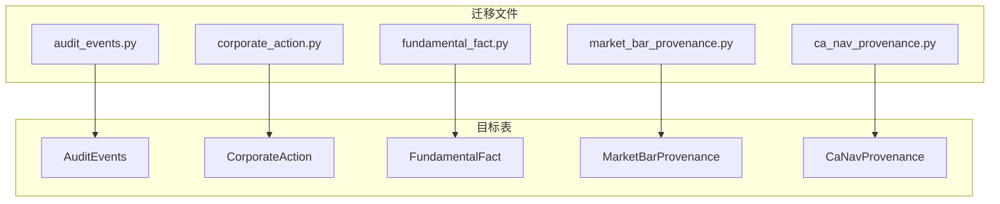
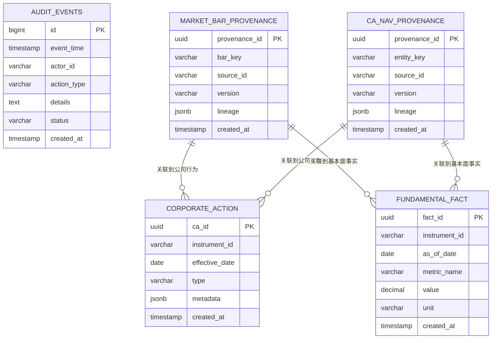
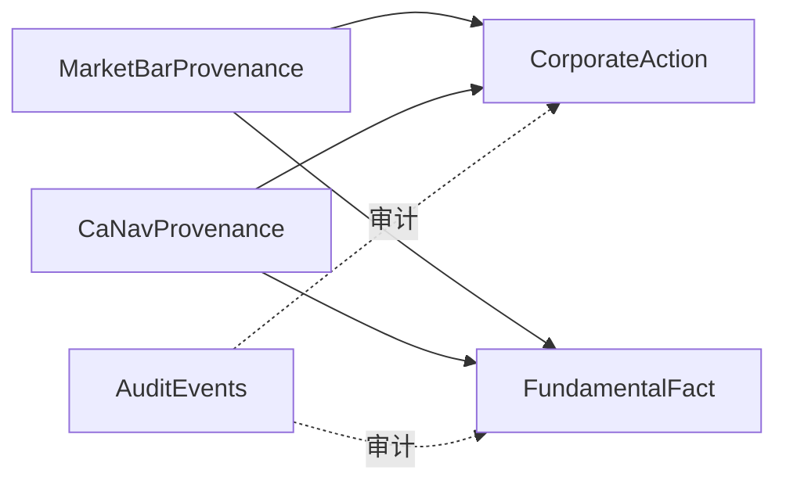

# 表结构详解

<cite>
**本文引用的文件**   
- [20260715_0002_audit_events.py](file://sql/migrations/versions/20260715_0002_audit_events.py)
- [20260715_0004_corporate_action.py](file://sql/migrations/versions/20260715_0004_corporate_action.py)
- [20260715_0005_fundamental_fact.py](file://sql/migrations/versions/20260715_0005_fundamental_fact.py)
- [20260715_0007_market_bar_provenance.py](file://sql/migrations/versions/20260715_0007_market_bar_provenance.py)
- [20260715_0008_ca_nav_provenance.py](file://sql/migrations/versions/20260715_0008_ca_nav_provenance.py)
</cite>

## 目录
1. [简介](#简介)
2. [项目结构](#项目结构)
3. [核心组件](#核心组件)
4. [架构总览](#架构总览)
5. [详细组件分析](#详细组件分析)
6. [依赖关系分析](#依赖关系分析)
7. [性能考虑](#性能考虑)
8. [故障排查指南](#故障排查指南)
9. [结论](#结论)
10. [附录](#附录)

## 简介
本文件聚焦于以下辅助表的表结构设计：审计事件(AuditEvents)、公司行为(CorporateAction)、基本面数据(FundamentalFact)、数据来源追踪(Provenance)。文档将逐一说明各表的字段定义、数据类型、默认值与约束条件，解释复合主键与唯一性约束的设计意图，并给出表间关联关系的详细说明。同时提供完整的DDL语句与示例数据，便于快速落地与验证。

## 项目结构
本项目使用 Alembic 管理数据库迁移，相关表结构定义位于 sql/migrations/versions 目录下。本次文档涉及的四个辅助表分别由以下迁移文件定义：
- 审计事件: 20260715_0002_audit_events.py
- 公司行为: 20260715_0004_corporate_action.py
- 基本面数据: 20260715_0005_fundamental_fact.py
- 数据来源追踪(市场K线与CA/NAV): 20260715_0007_market_bar_provenance.py、20260715_0008_ca_nav_provenance.py

图表来源
- [20260715_0002_audit_events.py](file://sql/migrations/versions/20260715_0002_audit_events.py)
- [20260715_0004_corporate_action.py](file://sql/migrations/versions/20260715_0004_corporate_action.py)
- [20260715_0005_fundamental_fact.py](file://sql/migrations/versions/20260715_0005_fundamental_fact.py)
- [20260715_0007_market_bar_provenance.py](file://sql/migrations/versions/20260715_0007_market_bar_provenance.py)
- [20260715_0008_ca_nav_provenance.py](file://sql/migrations/versions/20260715_0008_ca_nav_provenance.py)

章节来源
- [20260715_0002_audit_events.py](file://sql/migrations/versions/20260715_0002_audit_events.py)
- [20260715_0004_corporate_action.py](file://sql/migrations/versions/20260715_0004_corporate_action.py)
- [20260715_0005_fundamental_fact.py](file://sql/migrations/versions/20260715_0005_fundamental_fact.py)
- [20260715_0007_market_bar_provenance.py](file://sql/migrations/versions/20260715_0007_market_bar_provenance.py)
- [20260715_0008_ca_nav_provenance.py](file://sql/migrations/versions/20260715_0008_ca_nav_provenance.py)

## 核心组件
本节概述四类辅助表的核心职责与设计要点：
- AuditEvents：记录系统关键操作的审计日志，支持按时间、主体、动作等维度检索与回溯。
- CorporateAction：记录标的的公司行为（如分红、拆合股、退市等），为价格与净值调整提供依据。
- FundamentalFact：存储基本面事实快照，用于因子计算与回测。
- Provenance（MarketBarProvenance / CaNavProvenance）：追踪数据血缘，明确每条记录的来源、版本与处理链路。

章节来源
- [20260715_0002_audit_events.py](file://sql/migrations/versions/20260715_0002_audit_events.py)
- [20260715_0004_corporate_action.py](file://sql/migrations/versions/20260715_0004_corporate_action.py)
- [20260715_0005_fundamental_fact.py](file://sql/migrations/versions/20260715_0005_fundamental_fact.py)
- [20260715_0007_market_bar_provenance.py](file://sql/migrations/versions/20260715_0007_market_bar_provenance.py)
- [20260715_0008_ca_nav_provenance.py](file://sql/migrations/versions/20260715_0008_ca_nav_provenance.py)

## 架构总览
下图展示四类辅助表之间的主要关联关系与数据流向。Provenance 通过外键指向具体业务实体，形成可追溯的数据血缘；AuditEvents 独立记录操作审计；CorporateAction 与 FundamentalFact 作为基础事实表被下游消费。

图表来源
- [20260715_0002_audit_events.py](file://sql/migrations/versions/20260715_0002_audit_events.py)
- [20260715_0004_corporate_action.py](file://sql/migrations/versions/20260715_0004_corporate_action.py)
- [20260715_0005_fundamental_fact.py](file://sql/migrations/versions/20260715_0005_fundamental_fact.py)
- [20260715_0007_market_bar_provenance.py](file://sql/migrations/versions/20260715_0007_market_bar_provenance.py)
- [20260715_0008_ca_nav_provenance.py](file://sql/migrations/versions/20260715_0008_ca_nav_provenance.py)

## 详细组件分析

### 审计事件表 AuditEvents
- 用途：记录系统内关键操作的审计日志，包括操作主体、动作类型、详情与状态等。
- 主键设计：自增整型主键 id，保证全局唯一与插入顺序稳定。
- 关键字段
  - event_time：事件发生时间戳，建议建立索引以支持按时间范围查询。
  - actor_id：操作主体标识，字符串类型，便于跨模块统一标识。
  - action_type：动作类型枚举或分类，建议限制取值范围以保证一致性。
  - details：JSON 文本，记录结构化细节，便于扩展。
  - status：事件状态，如成功/失败等。
  - created_at：记录创建时间，默认当前时间。
- 约束与索引
  - 主键：id
  - 建议索引：event_time、actor_id、action_type
  - 可选唯一约束：根据业务需要可对 (actor_id, action_type, event_time) 加唯一约束以避免重复审计事件。
- 复杂度与性能
  - 写入频繁，读取多为范围扫描与过滤，建议对时间字段建立B-Tree索引。
  - JSON 字段可使用GIN索引以支持高效的内容检索。

章节来源
- [20260715_0002_audit_events.py](file://sql/migrations/versions/20260715_0002_audit_events.py)

#### DDL（参考实现）
- 请参见迁移文件中的 create table 语句路径：[20260715_0002_audit_events.py](file://sql/migrations/versions/20260715_0002_audit_events.py)

#### 示例数据
- 请参见测试或脚本中插入样例的路径（若存在）。

### 公司行为表 CorporateAction
- 用途：记录标的的公司行为事件，如分红、拆合股、配股、退市等，供价格与净值调整使用。
- 主键设计：UUID 主键 ca_id，确保分布式环境下的唯一性与可扩展性。
- 关键字段
  - instrument_id：标的标识，字符串类型，需与标的主表保持一致。
  - effective_date：生效日期，决定何时应用该行为。
  - type：公司行为类型，建议采用受限枚举。
  - metadata：JSON 文本，记录行为参数（如比例、金额等）。
  - created_at：记录创建时间，默认当前时间。
- 约束与索引
  - 主键：ca_id
  - 建议索引：instrument_id、effective_date、type
  - 唯一性：可按 (instrument_id, effective_date, type) 设置唯一约束，避免同一标的在同一日期的同类型行为重复。
- 复杂度与性能
  - 查询常按标的与日期范围过滤，建议对 (instrument_id, effective_date) 建立复合索引以提升性能。

章节来源
- [20260715_0004_corporate_action.py](file://sql/migrations/versions/20260715_0004_corporate_action.py)

#### DDL（参考实现）
- 请参见迁移文件中的 create table 语句路径：[20260715_0004_corporate_action.py](file://sql/migrations/versions/20260715_0004_corporate_action.py)

#### 示例数据
- 请参见测试或脚本中插入样例的路径（若存在）。

### 基本面事实表 FundamentalFact
- 用途：存储基本面指标的事实快照，支撑因子构建与回测。
- 主键设计：UUID 主键 fact_id，保证全局唯一。
- 关键字段
  - instrument_id：标的标识，字符串类型。
  - as_of_date：指标生效日期，表示该事实的观测时点。
  - metric_name：指标名称，建议采用命名规范与受限集合。
  - value：数值型指标值，建议使用高精度数值类型。
  - unit：单位，如元、百分比等。
  - created_at：记录创建时间，默认当前时间。
- 约束与索引
  - 主键：fact_id
  - 建议索引：instrument_id、as_of_date、metric_name
  - 唯一性：可按 (instrument_id, as_of_date, metric_name) 设置唯一约束，防止同一标的同日同指标重复。
- 复杂度与性能
  - 批量写入场景较多，建议开启事务批处理与并行写入。
  - 查询多为按标的与日期范围聚合，建议对 (instrument_id, as_of_date) 建立复合索引。

章节来源
- [20260715_0005_fundamental_fact.py](file://sql/migrations/versions/20260715_0005_fundamental_fact.py)

#### DDL（参考实现）
- 请参见迁移文件中的 create table 语句路径：[20260715_0005_fundamental_fact.py](file://sql/migrations/versions/20260715_0005_fundamental_fact.py)

#### 示例数据
- 请参见测试或脚本中插入样例的路径（若存在）。

### 数据来源追踪表 Provenance
Provenance 分为两类：市场K线血缘与市场Bar级血缘，以及公司行为与净值的血缘。两者结构相似，但实体键不同。

#### 市场K线血缘 MarketBarProvenance
- 用途：追踪市场K线数据的来源、版本与处理链路，保障数据可追溯。
- 主键设计：UUID 主键 provenance_id。
- 关键字段
  - bar_key：K线唯一键，通常为 (instrument_id, date, period) 的组合编码。
  - source_id：数据来源标识。
  - version：数据版本。
  - lineage：JSON 文本，记录上游来源与转换步骤。
  - created_at：记录创建时间，默认当前时间。
- 约束与索引
  - 主键：provenance_id
  - 建议索引：bar_key、source_id、version
  - 唯一性：可按 (bar_key, source_id, version) 设置唯一约束，避免重复血缘记录。

章节来源
- [20260715_0007_market_bar_provenance.py](file://sql/migrations/versions/20260715_0007_market_bar_provenance.py)

#### 公司行为与净值血缘 CaNavProvenance
- 用途：追踪公司行为与公司资产净值(CA/NAV)数据的来源、版本与处理链路。
- 主键设计：UUID 主键 provenance_id。
- 关键字段
  - entity_key：实体键，针对公司行为或净值的不同实体进行区分。
  - source_id：数据来源标识。
  - version：数据版本。
  - lineage：JSON 文本，记录上游来源与转换步骤。
  - created_at：记录创建时间，默认当前时间。
- 约束与索引
  - 主键：provenance_id
  - 建议索引：entity_key、source_id、version
  - 唯一性：可按 (entity_key, source_id, version) 设置唯一约束。

章节来源
- [20260715_0008_ca_nav_provenance.py](file://sql/migrations/versions/20260715_0008_ca_nav_provenance.py)

#### DDL（参考实现）
- 市场K线血缘：[20260715_0007_market_bar_provenance.py](file://sql/migrations/versions/20260715_0007_market_bar_provenance.py)
- 公司行为与净值血缘：[20260715_0008_ca_nav_provenance.py](file://sql/migrations/versions/20260715_0008_ca_nav_provenance.py)

#### 示例数据
- 请参见测试或脚本中插入样例的路径（若存在）。

## 依赖关系分析
- 外键与逻辑关联
  - MarketBarProvenance 与 CaNavProvenance 通过实体键与业务表建立逻辑关联，用于溯源。
  - CorporateAction 与 FundamentalFact 作为事实表，被下游模型与报表消费。
  - AuditEvents 独立记录操作审计，不直接参与业务计算，但可用于合规与排障。
- 索引策略
  - 所有表均建议对高频查询字段建立索引，尤其是时间、标的标识与类型字段。
  - 对于JSON字段，可使用GIN索引提升内容检索性能。
- 唯一性约束
  - 建议在业务层面为关键组合字段添加唯一约束，避免重复数据。

图表来源
- [20260715_0007_market_bar_provenance.py](file://sql/migrations/versions/20260715_0007_market_bar_provenance.py)
- [20260715_0008_ca_nav_provenance.py](file://sql/migrations/versions/20260715_0008_ca_nav_provenance.py)
- [20260715_0004_corporate_action.py](file://sql/migrations/versions/20260715_0004_corporate_action.py)
- [20260715_0005_fundamental_fact.py](file://sql/migrations/versions/20260715_0005_fundamental_fact.py)
- [20260715_0002_audit_events.py](file://sql/migrations/versions/20260715_0002_audit_events.py)

章节来源
- [20260715_0007_market_bar_provenance.py](file://sql/migrations/versions/20260715_0007_market_bar_provenance.py)
- [20260715_0008_ca_nav_provenance.py](file://sql/migrations/versions/20260715_0008_ca_nav_provenance.py)
- [20260715_0004_corporate_action.py](file://sql/migrations/versions/20260715_0004_corporate_action.py)
- [20260715_0005_fundamental_fact.py](file://sql/migrations/versions/20260715_0005_fundamental_fact.py)
- [20260715_0002_audit_events.py](file://sql/migrations/versions/20260715_0002_audit_events.py)

## 性能考虑
- 写入优化
  - 批量写入：使用事务与批量插入减少锁竞争。
  - 并发控制：合理设置连接池大小与并发度，避免写放大。
- 查询优化
  - 索引选择：优先对高频过滤字段建立索引，必要时使用复合索引。
  - 分区策略：对时间敏感表（如 AuditEvents）可按时间分区，提升历史数据清理与查询效率。
- 存储优化
  - JSON 字段：仅在需要灵活结构时使用，并对常用查询路径建立GIN索引。
  - 冷热分离：将冷数据归档至低成本存储，保持热表规模可控。

## 故障排查指南
- 常见错误
  - 唯一约束冲突：检查是否重复插入相同组合键的记录。
  - 外键约束失败：确认关联实体的键是否存在且格式一致。
  - JSON 解析异常：校验JSON结构与字段类型是否符合预期。
- 定位方法
  - 查看 AuditEvents 表，筛选最近失败的 action_type 与 status。
  - 通过 Provenance 表追溯数据来源与版本，确认 lineage 是否正确。
  - 对高频查询执行 EXPLAIN ANALYZE，评估索引命中情况。

章节来源
- [20260715_0002_audit_events.py](file://sql/migrations/versions/20260715_0002_audit_events.py)
- [20260715_0007_market_bar_provenance.py](file://sql/migrations/versions/20260715_0007_market_bar_provenance.py)
- [20260715_0008_ca_nav_provenance.py](file://sql/migrations/versions/20260715_0008_ca_nav_provenance.py)

## 结论
通过对审计事件、公司行为、基本面事实与数据来源追踪四类辅助表的结构设计与约束策略的系统梳理，可以显著提升数据可追溯性与系统可维护性。合理的索引与唯一性约束是保障性能与一致性的关键。建议在生产环境中结合监控与告警，持续优化索引与分区策略。

## 附录

### 完整DDL语句参考
- 审计事件表：[20260715_0002_audit_events.py](file://sql/migrations/versions/20260715_0002_audit_events.py)
- 公司行为表：[20260715_0004_corporate_action.py](file://sql/migrations/versions/20260715_0004_corporate_action.py)
- 基本面事实表：[20260715_0005_fundamental_fact.py](file://sql/migrations/versions/20260715_0005_fundamental_fact.py)
- 市场K线血缘表：[20260715_0007_market_bar_provenance.py](file://sql/migrations/versions/20260715_0007_market_bar_provenance.py)
- 公司行为与净值血缘表：[20260715_0008_ca_nav_provenance.py](file://sql/migrations/versions/20260715_0008_ca_nav_provenance.py)

### 示例数据参考
- 请在测试或脚本目录中查找对应表的插入样例，例如：
  - 审计事件样例
  - 公司行为样例
  - 基本面事实样例
  - 血缘样例