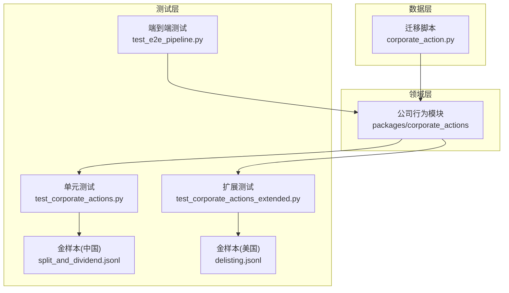
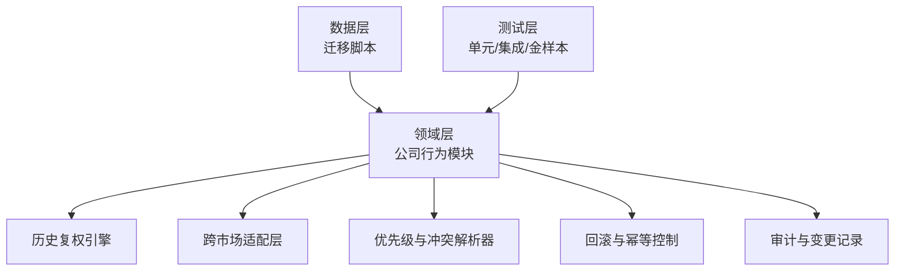
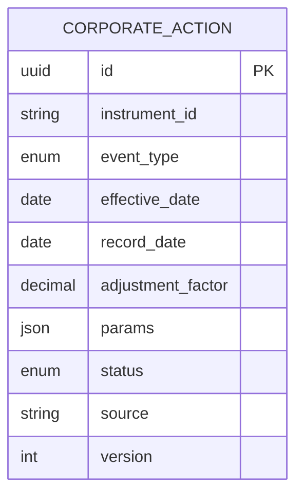
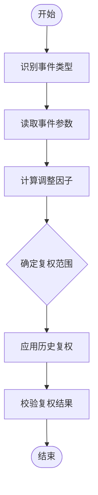
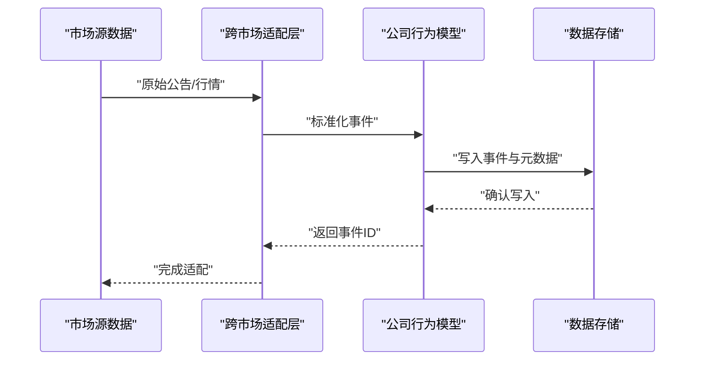
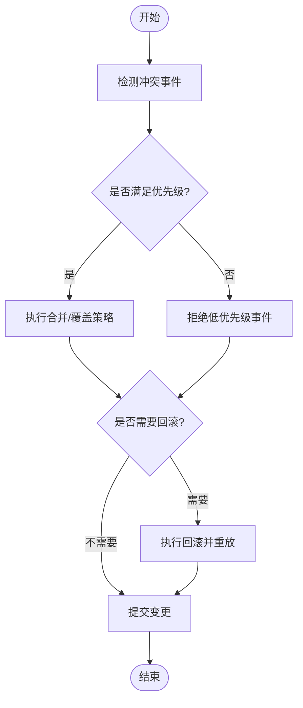
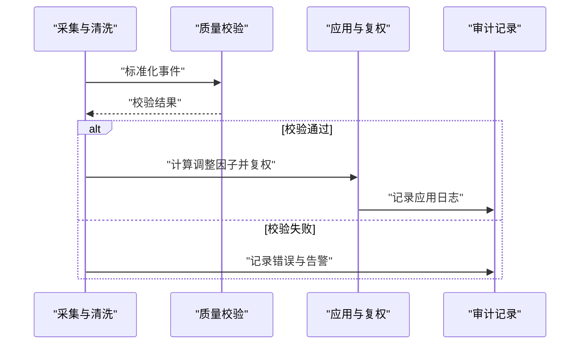
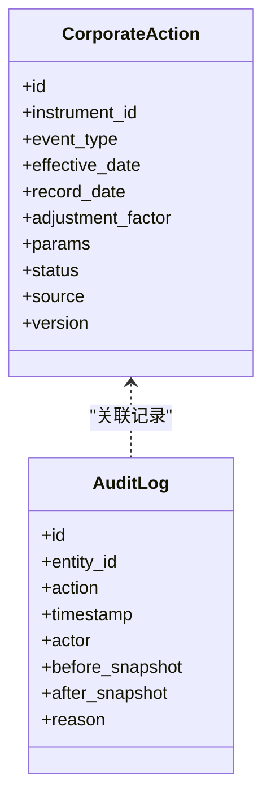
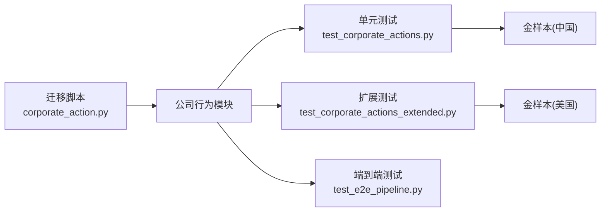

# 公司行为数据模型

<cite>
**本文引用的文件**   
- [packages/corporate_actions](file://packages/corporate_actions)
- [sql/migrations/20260715_0004_corporate_action.py](file://sql/migrations/20260715_0004_corporate_action.py)
- [tests/unit/test_corporate_actions.py](file://tests/unit/test_corporate_actions.py)
- [tests/unit/test_corporate_actions_extended.py](file://tests/unit/test_corporate_actions_extended.py)
- [tests/fixtures/golden/cn/split_and_dividend.jsonl](file://tests/fixtures/golden/cn/split_and_dividend.jsonl)
- [tests/fixtures/golden/us/delisting.jsonl](file://tests/fixtures/golden/us/delisting.jsonl)
- [tests/integration/test_e2e_pipeline.py](file://tests/integration/test_e2e_pipeline.py)
</cite>

## 目录
1. [简介](#简介)
2. [项目结构](#项目结构)
3. [核心组件](#核心组件)
4. [架构总览](#架构总览)
5. [详细组件分析](#详细组件分析)
6. [依赖关系分析](#依赖关系分析)
7. [性能考虑](#性能考虑)
8. [故障排查指南](#故障排查指南)
9. [结论](#结论)
10. [附录](#附录)

## 简介
本文件围绕公司行为（CorporateAction）数据模型进行系统化文档化，覆盖事件类型、生效日期与调整因子计算、历史价格调整机制、跨市场差异处理与统一抽象、优先级与冲突解决、回滚策略、数据处理流程、数据质量检查与异常处理，以及与审计追踪相关的变更记录。目标是为研发、数据工程与量化研究提供一致且可落地的参考。

## 项目结构
与公司行为相关的数据模型与实现主要分布在以下位置：
- 数据模型定义与迁移脚本：sql/migrations/20260715_0004_corporate_action.py
- 业务逻辑与领域实现：packages/corporate_actions（模块目录）
- 单元测试与扩展测试：tests/unit/test_corporate_actions.py、tests/unit/test_corporate_actions_extended.py
- 金样本用例（A股拆分与分红、美股退市等）：tests/fixtures/golden/cn/split_and_dividend.jsonl、tests/fixtures/golden/us/delisting.jsonl
- 端到端集成测试：tests/integration/test_e2e_pipeline.py

图表来源
- [sql/migrations/20260715_0004_corporate_action.py](file://sql/migrations/20260715_0004_corporate_action.py)
- [packages/corporate_actions](file://packages/corporate_actions)
- [tests/unit/test_corporate_actions.py](file://tests/unit/test_corporate_actions.py)
- [tests/unit/test_corporate_actions_extended.py](file://tests/unit/test_corporate_actions_extended.py)
- [tests/fixtures/golden/cn/split_and_dividend.jsonl](file://tests/fixtures/golden/cn/split_and_dividend.jsonl)
- [tests/fixtures/golden/us/delisting.jsonl](file://tests/fixtures/golden/us/delisting.jsonl)
- [tests/integration/test_e2e_pipeline.py](file://tests/integration/test_e2e_pipeline.py)

章节来源
- [sql/migrations/20260715_0004_corporate_action.py](file://sql/migrations/20260715_0004_corporate_action.py)
- [packages/corporate_actions](file://packages/corporate_actions)
- [tests/unit/test_corporate_actions.py](file://tests/unit/test_corporate_actions.py)
- [tests/unit/test_corporate_actions_extended.py](file://tests/unit/test_corporate_actions_extended.py)
- [tests/fixtures/golden/cn/split_and_dividend.jsonl](file://tests/fixtures/golden/cn/split_and_dividend.jsonl)
- [tests/fixtures/golden/us/delisting.jsonl](file://tests/fixtures/golden/us/delisting.jsonl)
- [tests/integration/test_e2e_pipeline.py](file://tests/integration/test_e2e_pipeline.py)

## 核心组件
本节聚焦公司行为数据模型的关键要素与职责边界，包括事件类型、时间语义、调整因子与历史复权、跨市场差异抽象、优先级与冲突、回滚与审计。

- 事件类型与语义
  - 分红（现金/股票）、拆股/合股、配股、合并/收购、退市、其他（如特别股息、送红股等）。不同类型对应不同的调整因子计算与复权方式。
- 生效日期与记录日期
  - 生效日期（Ex-date/Record-date/Pay-date）用于确定复权生效的基准日；记录日期用于审计与溯源。
- 调整因子与历史价格调整
  - 基于事件类型与参数计算调整因子，对历史价格序列进行前复权或后复权，确保连续性与可比性。
- 跨市场差异与统一抽象
  - 针对A股与美股在交易日历、除权除息规则、币种与结算周期等方面的差异，通过统一的事件抽象与适配层屏蔽差异。
- 优先级与冲突解决
  - 同一标的在同一时间段可能产生多个事件，需定义优先级与合并策略，避免重复或矛盾调整。
- 回滚与幂等
  - 支持对已应用的公司行为进行撤销与重放，保证数据一致性。
- 审计与变更追踪
  - 所有公司行为的创建、更新、应用与回滚均需记录审计日志，包含操作者、时间戳、变更前后快照与原因。

章节来源
- [packages/corporate_actions](file://packages/corporate_actions)
- [sql/migrations/20260715_0004_corporate_action.py](file://sql/migrations/20260715_0004_corporate_action.py)

## 架构总览
公司行为数据模型在系统中的分层如下：
- 数据层：持久化公司行为事件及其元数据（迁移脚本定义表结构与约束）。
- 领域层：封装事件类型、调整因子计算、历史复权、跨市场适配、优先级与冲突处理、回滚与审计。
- 测试层：单元与集成测试验证正确性、边界条件与端到端流程。

图表来源
- [sql/migrations/20260715_0004_corporate_action.py](file://sql/migrations/20260715_0004_corporate_action.py)
- [packages/corporate_actions](file://packages/corporate_actions)
- [tests/unit/test_corporate_actions.py](file://tests/unit/test_corporate_actions.py)
- [tests/unit/test_corporate_actions_extended.py](file://tests/unit/test_corporate_actions_extended.py)
- [tests/integration/test_e2e_pipeline.py](file://tests/integration/test_e2e_pipeline.py)

## 详细组件分析

### 数据模型与存储
- 实体与字段
  - 事件标识、标的标识、事件类型、生效日期、记录日期、调整因子、参数集（如比例、金额）、状态（草稿/已发布/已应用/已回滚）、来源与版本。
- 约束与索引
  - 唯一键（标的+生效日期+事件类型）防止重复；按标的与生效日期建立索引以加速查询与复权。
- 迁移与演进
  - 通过迁移脚本管理表结构变更，确保向后兼容与可回滚。

图表来源
- [sql/migrations/20260715_0004_corporate_action.py](file://sql/migrations/20260715_0004_corporate_action.py)

章节来源
- [sql/migrations/20260715_0004_corporate_action.py](file://sql/migrations/20260715_0004_corporate_action.py)

### 事件类型与调整因子计算
- 事件类型
  - 分红（现金/股票）、拆股/合股、配股、合并/收购、退市、其他。
- 调整因子计算
  - 根据事件类型与参数计算调整因子，例如拆股按股份比例、分红按除息价调整、配股按发行价与比例综合计算。
- 历史价格调整
  - 对历史K线进行复权（前复权/后复权），保持收益连续性；复权范围由生效日期决定。

图表来源
- [packages/corporate_actions](file://packages/corporate_actions)
- [tests/unit/test_corporate_actions.py](file://tests/unit/test_corporate_actions.py)

章节来源
- [packages/corporate_actions](file://packages/corporate_actions)
- [tests/unit/test_corporate_actions.py](file://tests/unit/test_corporate_actions.py)

### 跨市场差异处理与统一抽象
- 差异点
  - 交易日历、除权除息规则、币种与结算周期、信息披露时点等。
- 统一抽象
  - 通过事件类型与参数的标准化映射，屏蔽市场差异；适配层负责将市场特定信息转换为通用事件。
- 金样本覆盖
  - A股拆分与分红、美股退市等场景作为回归测试输入，确保跨市场一致性。

图表来源
- [packages/corporate_actions](file://packages/corporate_actions)
- [tests/fixtures/golden/cn/split_and_dividend.jsonl](file://tests/fixtures/golden/cn/split_and_dividend.jsonl)
- [tests/fixtures/golden/us/delisting.jsonl](file://tests/fixtures/golden/us/delisting.jsonl)

章节来源
- [packages/corporate_actions](file://packages/corporate_actions)
- [tests/fixtures/golden/cn/split_and_dividend.jsonl](file://tests/fixtures/golden/cn/split_and_dividend.jsonl)
- [tests/fixtures/golden/us/delisting.jsonl](file://tests/fixtures/golden/us/delisting.jsonl)

### 优先级、冲突解决与回滚机制
- 优先级
  - 定义事件类型的优先级顺序（如合并优先于分红），并支持同一天多事件的排序规则。
- 冲突解决
  - 当同一标的在同一时间段存在冲突事件时，采用合并策略或拒绝策略，并记录冲突详情。
- 回滚
  - 支持对已应用事件进行撤销，恢复历史价格至事件前状态；要求幂等与事务保障。

图表来源
- [packages/corporate_actions](file://packages/corporate_actions)
- [tests/unit/test_corporate_actions_extended.py](file://tests/unit/test_corporate_actions_extended.py)

章节来源
- [packages/corporate_actions](file://packages/corporate_actions)
- [tests/unit/test_corporate_actions_extended.py](file://tests/unit/test_corporate_actions_extended.py)

### 数据处理流程、数据质量检查与异常处理
- 处理流程
  - 采集→清洗→标准化→校验→应用→复权→审计。
- 数据质量检查
  - 完整性（必填字段）、一致性（事件参数合理）、时效性（生效日期不晚于当前）、唯一性（去重）。
- 异常处理
  - 捕获解析错误、参数越界、冲突未决等异常，记录错误上下文并触发告警；支持重试与人工介入。

图表来源
- [packages/corporate_actions](file://packages/corporate_actions)
- [tests/integration/test_e2e_pipeline.py](file://tests/integration/test_e2e_pipeline.py)

章节来源
- [packages/corporate_actions](file://packages/corporate_actions)
- [tests/integration/test_e2e_pipeline.py](file://tests/integration/test_e2e_pipeline.py)

### 审计追踪与变更记录
- 审计内容
  - 事件创建、更新、应用、回滚的操作者、时间戳、变更前后快照、原因与来源。
- 变更记录
  - 为每个事件维护版本链，支持回溯与对比；与迁移脚本协同确保结构演进可追溯。

图表来源
- [sql/migrations/20260715_0004_corporate_action.py](file://sql/migrations/20260715_0004_corporate_action.py)
- [packages/corporate_actions](file://packages/corporate_actions)

章节来源
- [sql/migrations/20260715_0004_corporate_action.py](file://sql/migrations/20260715_0004_corporate_action.py)
- [packages/corporate_actions](file://packages/corporate_actions)

## 依赖关系分析
公司行为模块依赖数据层迁移脚本定义的结构，并通过测试层验证其正确性与稳定性。

图表来源
- [sql/migrations/20260715_0004_corporate_action.py](file://sql/migrations/20260715_0004_corporate_action.py)
- [packages/corporate_actions](file://packages/corporate_actions)
- [tests/unit/test_corporate_actions.py](file://tests/unit/test_corporate_actions.py)
- [tests/unit/test_corporate_actions_extended.py](file://tests/unit/test_corporate_actions_extended.py)
- [tests/integration/test_e2e_pipeline.py](file://tests/integration/test_e2e_pipeline.py)
- [tests/fixtures/golden/cn/split_and_dividend.jsonl](file://tests/fixtures/golden/cn/split_and_dividend.jsonl)
- [tests/fixtures/golden/us/delisting.jsonl](file://tests/fixtures/golden/us/delisting.jsonl)

章节来源
- [sql/migrations/20260715_0004_corporate_action.py](file://sql/migrations/20260715_0004_corporate_action.py)
- [packages/corporate_actions](file://packages/corporate_actions)
- [tests/unit/test_corporate_actions.py](file://tests/unit/test_corporate_actions.py)
- [tests/unit/test_corporate_actions_extended.py](file://tests/unit/test_corporate_actions_extended.py)
- [tests/integration/test_e2e_pipeline.py](file://tests/integration/test_e2e_pipeline.py)
- [tests/fixtures/golden/cn/split_and_dividend.jsonl](file://tests/fixtures/golden/cn/split_and_dividend.jsonl)
- [tests/fixtures/golden/us/delisting.jsonl](file://tests/fixtures/golden/us/delisting.jsonl)

## 性能考虑
- 批量复权
  - 对大规模历史数据进行批处理，减少I/O与计算开销。
- 索引优化
  - 针对标的与生效日期的查询路径建立合适索引，提升复权与审计检索效率。
- 增量更新
  - 仅对受影响的时间段进行复权，避免全量重算。
- 缓存策略
  - 对常用调整因子与复权结果进行缓存，降低重复计算成本。

[本节为通用指导，无需具体文件引用]

## 故障排查指南
- 常见问题
  - 事件参数缺失或越界：检查标准化阶段的数据质量校验规则。
  - 冲突未决：查看优先级与冲突解析日志，必要时人工干预。
  - 复权异常：核对生效日期与复权范围，确认历史价格数据的完整性。
- 定位方法
  - 通过审计日志回溯事件生命周期，比对变更前后快照。
  - 使用金样本进行回归测试，快速验证修复效果。
- 恢复策略
  - 对错误事件执行回滚并重放，确保最终一致性。

章节来源
- [packages/corporate_actions](file://packages/corporate_actions)
- [tests/unit/test_corporate_actions.py](file://tests/unit/test_corporate_actions.py)
- [tests/unit/test_corporate_actions_extended.py](file://tests/unit/test_corporate_actions_extended.py)
- [tests/fixtures/golden/cn/split_and_dividend.jsonl](file://tests/fixtures/golden/cn/split_and_dividend.jsonl)
- [tests/fixtures/golden/us/delisting.jsonl](file://tests/fixtures/golden/us/delisting.jsonl)

## 结论
公司行为数据模型通过统一的事件抽象、严格的调整因子计算与历史复权、跨市场适配、优先级与冲突处理、回滚与审计机制，构建了稳健且可扩展的基础设施。配合完善的测试与金样本，能够保障数据质量与系统可靠性，为量化研究与投资决策提供可信支撑。

[本节为总结性内容，无需具体文件引用]

## 附录
- 术语说明
  - 生效日期：事件对价格与持仓产生影响的基准日。
  - 调整因子：用于历史价格复权的乘数或加数。
  - 前复权/后复权：不同方向的历史价格调整方式。
- 参考用例
  - A股拆分与分红、美股退市等金样本可作为回归测试输入。

[本节为补充说明，无需具体文件引用]