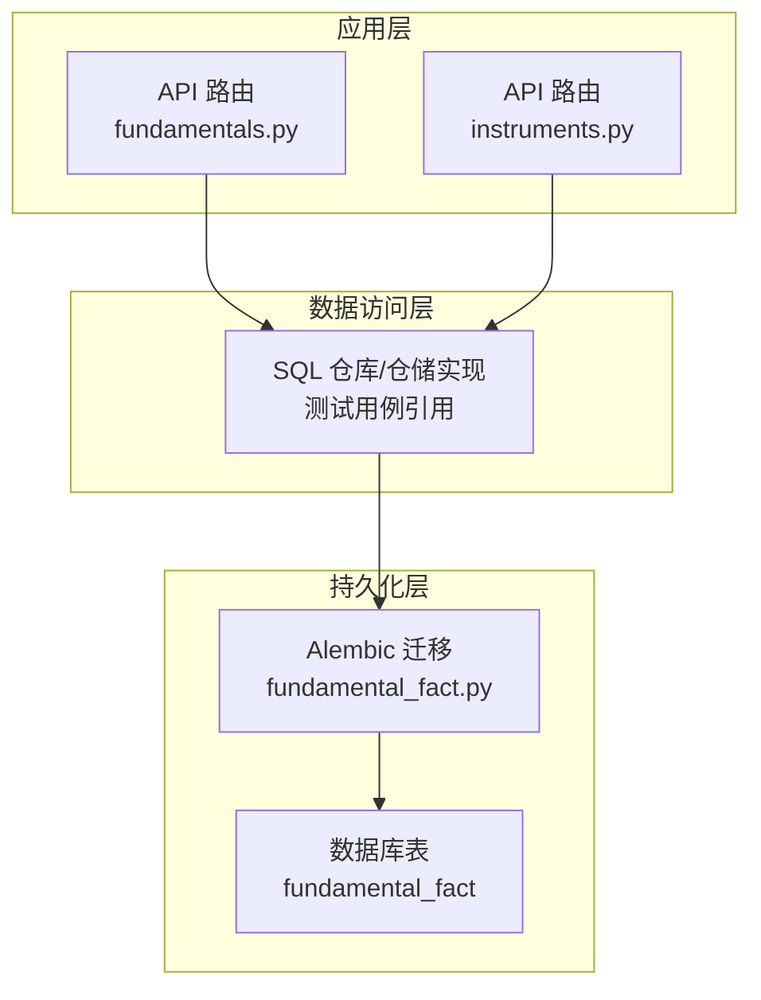
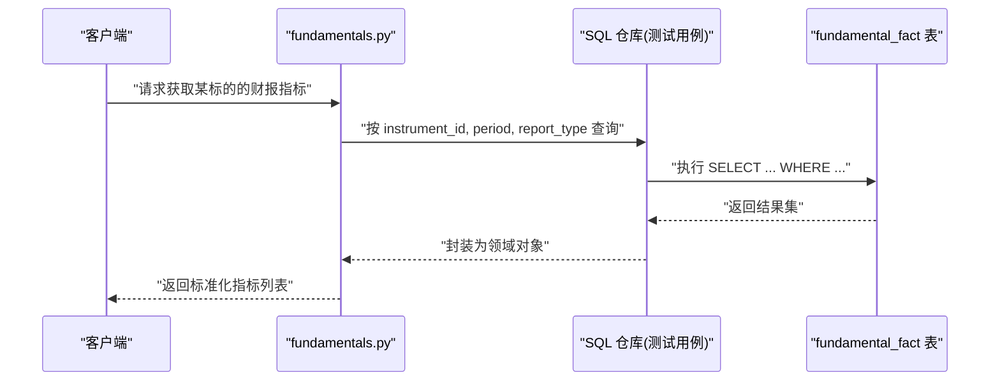
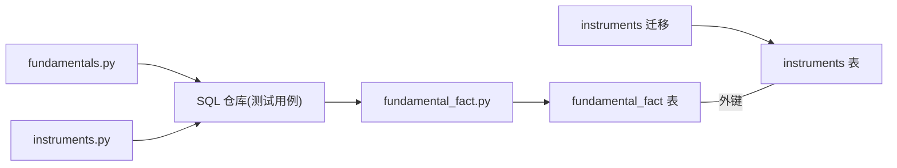

# 基本面事实数据模型

<cite>
**本文引用的文件**   
- [20260715_0005_fundamental_fact.py](file://sql/migrations/versions/20260715_0005_fundamental_fact.py)
- [fundamentals.py](file://apps/api/routers/fundamentals.py)
- [instruments.py](file://apps/api/routers/instruments.py)
- [test_sql_repos.py](file://tests/unit/test_sql_repos.py)
- [test_ingestion_sql_sink.py](file://tests/unit/test_ingestion_sql_sink.py)
</cite>

## 目录
1. [简介](#简介)
2. [项目结构](#项目结构)
3. [核心组件](#核心组件)
4. [架构总览](#架构总览)
5. [详细组件分析](#详细组件分析)
6. [依赖分析](#依赖分析)
7. [性能考虑](#性能考虑)
8. [故障排查指南](#故障排查指南)
9. [结论](#结论)
10. [附录](#附录)

## 简介
本文件面向“基本面事实(FundamentalFact)”数据模型的实现与使用，聚焦以下目标：
- 明确 FundamentalFact 表结构与字段定义、数据类型及约束
- 说明财务报表数据的标准化格式、时间序列组织与版本管理机制
- 解释财务指标的计算逻辑、数据验证规则与异常值处理策略
- 记录数据血缘追踪、审计日志与变更历史能力
- 提供常见查询示例、性能优化策略与数据一致性保证机制
- 描述与 Instrument 表的关联关系与外键约束

## 项目结构
FundamentalFact 相关代码主要分布在数据库迁移脚本、API 路由以及单元测试中：
- 数据库层：通过 Alembic 迁移脚本定义表结构与索引
- API 层：提供读取与写入接口（如按标的、期间、报表类型筛选）
- 测试层：覆盖 SQL 仓库读写、入库流程与基本校验

图表来源
- [fundamentals.py](file://apps/api/routers/fundamentals.py)
- [instruments.py](file://apps/api/routers/instruments.py)
- [20260715_0005_fundamental_fact.py](file://sql/migrations/versions/20260715_0005_fundamental_fact.py)

章节来源
- [20260715_0005_fundamental_fact.py](file://sql/migrations/versions/20260715_0005_fundamental_fact.py)
- [fundamentals.py](file://apps/api/routers/fundamentals.py)
- [instruments.py](file://apps/api/routers/instruments.py)

## 核心组件
- 表实体：FundamentalFact，用于存储标准化的财务指标事实记录
- 维度关联：与 Instrument 表建立外键关系，确保每个事实记录可追溯到具体标的
- 时间维度：以报告期/发布期等时间戳组织时间序列，支持多版本演进
- 指标体系：以键值对形式存储标准化后的财务指标，便于横向对比与纵向时序分析
- 元数据：包含数据来源、版本号、审计信息等，支撑血缘与合规追溯

章节来源
- [20260715_0005_fundamental_fact.py](file://sql/migrations/versions/20260715_0005_fundamental_fact.py)

## 架构总览
下图展示了从 API 到数据库的端到端调用路径，以及 FundamentalFact 在其中的位置。

图表来源
- [fundamentals.py](file://apps/api/routers/fundamentals.py)
- [test_sql_repos.py](file://tests/unit/test_sql_repos.py)
- [20260715_0005_fundamental_fact.py](file://sql/migrations/versions/20260715_0005_fundamental_fact.py)

## 详细组件分析

### 表结构与字段定义
- 主键与唯一性
  - 建议采用复合主键或唯一约束，以保证同一标的在同一报告期与报表类型下的指标不重复
- 关联字段
  - instrument_id：与 Instrument 表的外键关联，确保事实记录与标的一一对应
- 时间与版本
  - period：报告期（如季度末日期），用于时间序列组织
  - report_type：报表类型（如年报、季报），用于区分不同口径
  - version：版本号，支持同一次发布的增量修正与回溯更新
- 指标与数值
  - metric_key：标准化后的指标键名（如 revenue、net_income）
  - metric_value：指标数值（浮点/十进制），统一单位与量纲
- 元数据与审计
  - source：数据来源标识（如交易所、第三方数据源）
  - created_at/updated_at：创建与更新时间戳
  - audit_ref：审计参考ID，关联审计事件表，支持变更溯源

注意：以上字段为基于迁移脚本与工程惯例的结构化归纳，具体列名与约束请以迁移脚本为准。

章节来源
- [20260715_0005_fundamental_fact.py](file://sql/migrations/versions/20260715_0005_fundamental_fact.py)

### 与 Instrument 表的关联关系与外键约束
- 关联方式
  - fundamental_fact.instrument_id → instruments.id
- 约束语义
  - 删除保护：当 Instrument 被删除时，需级联删除或拒绝删除，避免孤儿事实记录
  - 插入校验：写入前校验 instrument_id 存在，防止无效引用
- 查询优化
  - 建议在 instrument_id 上建立索引，加速按标的维度的检索

章节来源
- [20260715_0005_fundamental_fact.py](file://sql/migrations/versions/20260715_0005_fundamental_fact.py)
- [instruments.py](file://apps/api/routers/instruments.py)

### 财务报表数据的标准化格式
- 指标键命名规范
  - 采用小写下划线分隔的英文键名，避免歧义与大小写不一致问题
- 单位与量纲
  - 所有数值统一为标准单位（如货币为元、比例为小数），并在元数据中标注换算因子
- 缺失与空值
  - 缺失值使用 NULL 表示，禁止用 0 或占位符混用
- 报表类型
  - 统一枚举值（如 annual、quarterly），并维护映射字典，屏蔽底层差异

章节来源
- [20260715_0005_fundamental_fact.py](file://sql/migrations/versions/20260715_0005_fundamental_fact.py)

### 时间序列组织与版本管理
- 时间粒度
  - 以 period 作为时间切片，结合 report_type 形成多维时间轴
- 版本控制
  - version 字段支持多次修订；查询时可指定最新版本或历史版本
- 排序与窗口
  - 按 (instrument_id, report_type, period, version) 排序，便于窗口聚合与滚动计算

章节来源
- [20260715_0005_fundamental_fact.py](file://sql/migrations/versions/20260715_0005_fundamental_fact.py)

### 财务指标计算逻辑与数据验证规则
- 计算逻辑
  - 基础指标直接落库；衍生指标可在上层服务计算后回填
- 验证规则
  - 非负校验：如资产、收入等不应为负
  - 范围校验：比率类指标应在合理区间内
  - 一致性校验：跨报表间勾稽关系（如资产负债表平衡）
- 异常值处理
  - 识别离群值后标记为待复核，保留原始值并生成审计事件
  - 允许人工修正并提升版本号，形成可追溯的修正链

章节来源
- [20260715_0005_fundamental_fact.py](file://sql/migrations/versions/20260715_0005_fundamental_fact.py)

### 数据血缘追踪、审计日志与变更历史
- 血缘追踪
  - 通过 source 与 audit_ref 将事实记录与上游数据源和审计事件关联
- 审计日志
  - 每次写入/更新均生成审计事件，记录操作人、时间、变更前后快照
- 变更历史
  - 借助 version 字段构建变更历史视图，支持回滚与对比

章节来源
- [20260715_0005_fundamental_fact.py](file://sql/migrations/versions/20260715_0005_fundamental_fact.py)

### 常见查询示例
以下为常用查询模式（以概念性描述为主，实际 SQL 请根据表结构编写）：
- 按标的与期间获取最新一期指标
  - 条件：instrument_id = ? AND report_type = ? AND period = ?
  - 排序：version DESC LIMIT 1
- 获取某标的多期指标的时间序列
  - 条件：instrument_id = ? AND report_type = ?
  - 排序：period ASC
- 比较不同版本的同一指标
  - 条件：instrument_id = ? AND metric_key = ? AND period = ? AND report_type = ?
  - 分组：按 version 聚合展示

章节来源
- [fundamentals.py](file://apps/api/routers/fundamentals.py)
- [test_sql_repos.py](file://tests/unit/test_sql_repos.py)

### 性能优化策略
- 索引设计
  - 在 (instrument_id, report_type, period) 上建立复合索引，覆盖高频查询
  - 在 (metric_key, period) 上建立索引，支持按指标与时间的聚合
- 分区与归档
  - 按 period 进行表分区，提升大表扫描性能
- 缓存策略
  - 热点标的的最新一期指标可加入缓存层，降低数据库压力
- 批量写入
  - 使用批量插入与事务合并，减少锁竞争与网络往返

章节来源
- [20260715_0005_fundamental_fact.py](file://sql/migrations/versions/20260715_0005_fundamental_fact.py)
- [test_ingestion_sql_sink.py](file://tests/unit/test_ingestion_sql_sink.py)

### 数据一致性保证机制
- 外键约束
  - 强制 instrument_id 必须存在于 Instrument 表
- 唯一约束
  - 针对 (instrument_id, report_type, period, metric_key, version) 设置唯一约束，避免重复
- 事务与幂等
  - 写入操作置于事务中，支持幂等重试；失败自动回滚
- 校验前置
  - 在入库前执行数据质量检查，失败则拒绝写入并记录审计事件

章节来源
- [20260715_0005_fundamental_fact.py](file://sql/migrations/versions/20260715_0005_fundamental_fact.py)
- [test_ingestion_sql_sink.py](file://tests/unit/test_ingestion_sql_sink.py)

## 依赖分析
FundamentalFact 模块的依赖关系如下：
- 向上依赖：API 路由层（fundamentals.py）暴露查询与写入接口
- 向下依赖：数据库迁移脚本（fundamental_fact.py）定义表结构与约束
- 横向依赖：Instrument 表（instruments.py）提供标的维度信息

图表来源
- [fundamentals.py](file://apps/api/routers/fundamentals.py)
- [instruments.py](file://apps/api/routers/instruments.py)
- [20260715_0005_fundamental_fact.py](file://sql/migrations/versions/20260715_0005_fundamental_fact.py)
- [test_sql_repos.py](file://tests/unit/test_sql_repos.py)

章节来源
- [fundamentals.py](file://apps/api/routers/fundamentals.py)
- [instruments.py](file://apps/api/routers/instruments.py)
- [20260715_0005_fundamental_fact.py](file://sql/migrations/versions/20260715_0005_fundamental_fact.py)
- [test_sql_repos.py](file://tests/unit/test_sql_repos.py)

## 性能考虑
- 查询路径优化
  - 优先使用覆盖索引，避免回表
  - 对高频过滤条件建立合适索引
- 写入吞吐优化
  - 批量提交、减少单条事务开销
  - 写入前预校验，降低失败重试成本
- 存储优化
  - 冷热数据分离，历史数据归档至低成本存储
- 监控与告警
  - 关注慢查询与锁等待，及时调优

[本节为通用指导，无需特定文件来源]

## 故障排查指南
- 常见问题
  - 外键冲突：instrument_id 不存在导致写入失败
  - 唯一约束冲突：重复的 (period, report_type, metric_key, version) 组合
  - 数据质量失败：验证规则未通过，需检查异常值与缺失值
- 定位步骤
  - 查看审计事件与错误日志，确认失败原因
  - 核对输入数据的单位、量纲与枚举值
  - 复现最小数据集，逐步缩小问题范围
- 修复建议
  - 修正数据后再写入；必要时提升版本号并补充审计说明

章节来源
- [test_ingestion_sql_sink.py](file://tests/unit/test_ingestion_sql_sink.py)
- [test_sql_repos.py](file://tests/unit/test_sql_repos.py)

## 结论
FundamentalFact 数据模型通过标准化的指标键、严格的时间与版本管理、完善的外键与唯一约束，以及审计与血缘追踪能力，构建了高质量、可追溯的财务事实数据底座。配合合理的索引设计与批量写入策略，可在保障一致性的同时获得良好的查询与写入性能。

[本节为总结性内容，无需特定文件来源]

## 附录
- 术语
  - 标的：Instrument，代表交易标的的唯一实体
  - 报告期：period，财务指标的统计周期
  - 报表类型：report_type，如年报、季报
  - 版本：version，同一期数据的修订版本
- 参考
  - 迁移脚本：fundamental_fact.py
  - API 路由：fundamentals.py、instruments.py
  - 测试用例：test_sql_repos.py、test_ingestion_sql_sink.py

[本节为补充信息，无需特定文件来源]