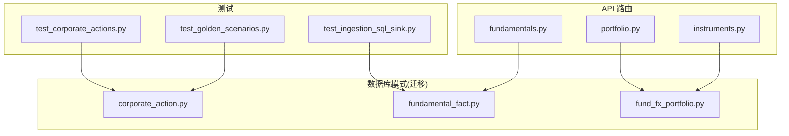
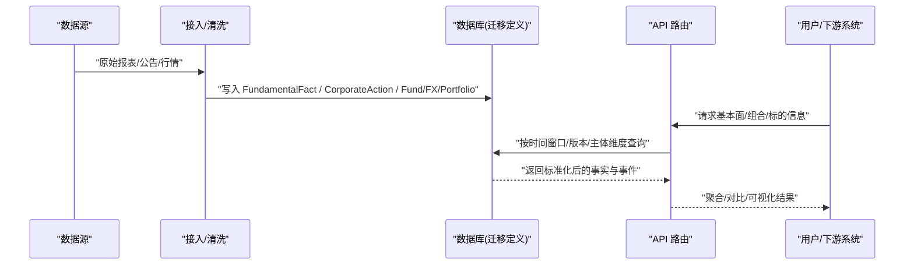
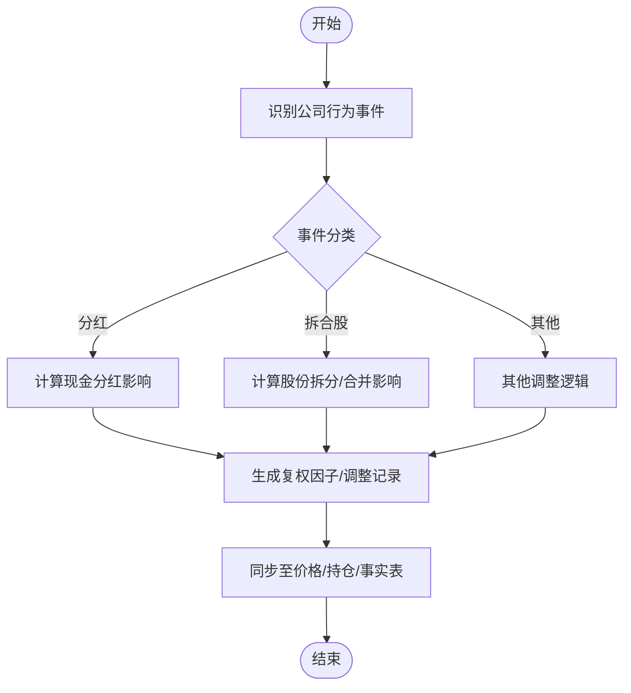
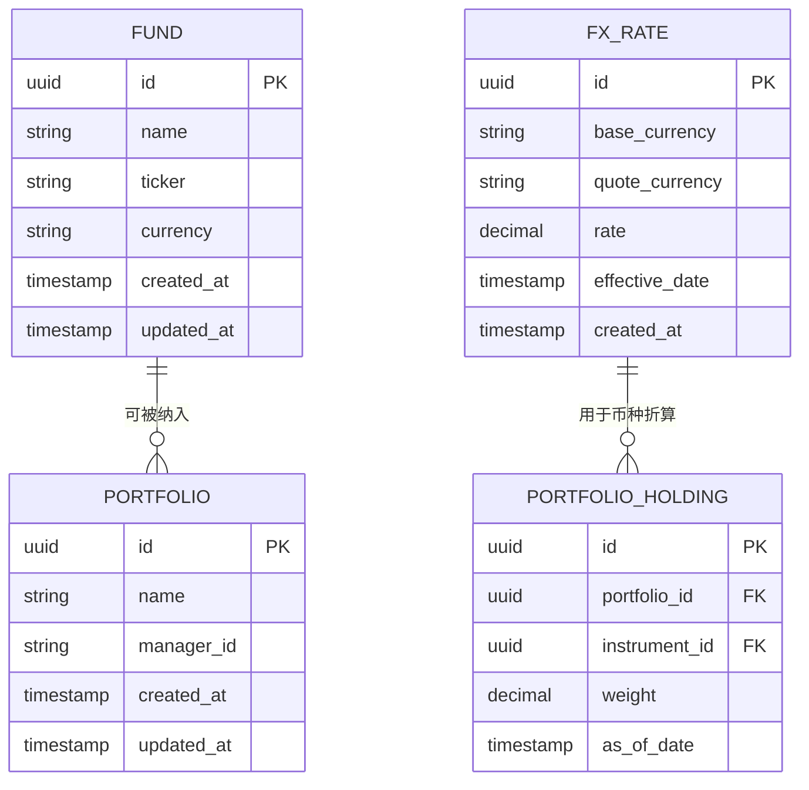
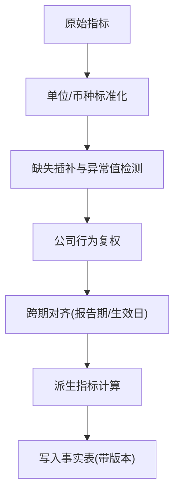
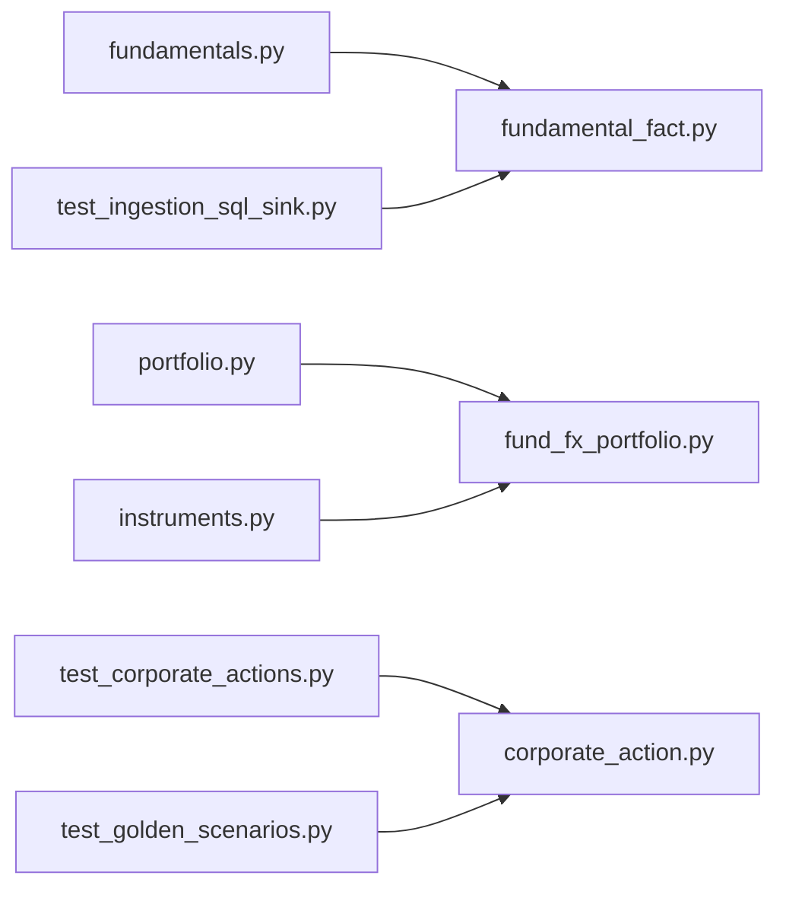

# 基本面数据模型

<cite>
**本文引用的文件**   
- [20260715_0005_fundamental_fact.py](file://sql/migrations/versions/20260715_0005_fundamental_fact.py)
- [20260715_0004_corporate_action.py](file://sql/migrations/versions/20260715_0004_corporate_action.py)
- [20260715_0006_fund_fx_portfolio.py](file://sql/migrations/versions/20260715_0006_fund_fx_portfolio.py)
- [fundamentals.py](file://apps/api/routers/fundamentals.py)
- [portfolio.py](file://apps/api/routers/portfolio.py)
- [instruments.py](file://apps/api/routers/instruments.py)
- [test_corporate_actions.py](file://tests/unit/test_corporate_actions.py)
- [test_golden_scenarios.py](file://tests/unit/test_golden_scenarios.py)
- [test_ingestion_sql_sink.py](file://tests/unit/test_ingestion_sql_sink.py)
</cite>

## 目录
1. [简介](#简介)
2. [项目结构](#项目结构)
3. [核心组件](#核心组件)
4. [架构总览](#架构总览)
5. [详细组件分析](#详细组件分析)
6. [依赖关系分析](#依赖关系分析)
7. [性能考虑](#性能考虑)
8. [故障排查指南](#故障排查指南)
9. [结论](#结论)
10. [附录](#附录)

## 简介
本文件面向“基本面数据模型”的设计与实现，聚焦以下目标：
- 事实表 FundamentalFact 的表结构与字段语义
- 财务报表数据的组织方式、标准化与跨期比较机制
- 公司行为 CorporateAction 的处理流程与版本化策略
- 基金 Fund、外汇 FX、投资组合 Portfolio 的数据结构设计
- 财务指标计算、数据版本管理、历史回溯与快照策略
- 基本面分析查询示例与性能优化建议
- 数据质量控制与异常值处理流程

## 项目结构
本项目采用分层与模块化组织：
- SQL 迁移脚本集中定义数据库模式（含基本面事实、公司行为、基金/外汇/投资组合等）
- API 路由层暴露基本面查询接口
- 单元测试覆盖公司行为、端到端流水线、SQL 写入等关键路径

图表来源
- [fundamentals.py](file://apps/api/routers/fundamentals.py)
- [portfolio.py](file://apps/api/routers/portfolio.py)
- [instruments.py](file://apps/api/routers/instruments.py)
- [20260715_0005_fundamental_fact.py](file://sql/migrations/versions/20260715_0005_fundamental_fact.py)
- [20260715_0004_corporate_action.py](file://sql/migrations/versions/20260715_0004_corporate_action.py)
- [20260715_0006_fund_fx_portfolio.py](file://sql/migrations/versions/20260715_0006_fund_fx_portfolio.py)
- [test_corporate_actions.py](file://tests/unit/test_corporate_actions.py)
- [test_golden_scenarios.py](file://tests/unit/test_golden_scenarios.py)
- [test_ingestion_sql_sink.py](file://tests/unit/test_ingestion_sql_sink.py)

章节来源
- [fundamentals.py](file://apps/api/routers/fundamentals.py)
- [portfolio.py](file://apps/api/routers/portfolio.py)
- [instruments.py](file://apps/api/routers/instruments.py)
- [20260715_0005_fundamental_fact.py](file://sql/migrations/versions/20260715_0005_fundamental_fact.py)
- [20260715_0004_corporate_action.py](file://sql/migrations/versions/20260715_0004_corporate_action.py)
- [20260715_0006_fund_fx_portfolio.py](file://sql/migrations/versions/20260715_0006_fund_fx_portfolio.py)
- [test_corporate_actions.py](file://tests/unit/test_corporate_actions.py)
- [test_golden_scenarios.py](file://tests/unit/test_golden_scenarios.py)
- [test_ingestion_sql_sink.py](file://tests/unit/test_ingestion_sql_sink.py)

## 核心组件
- 基本面事实表 FundamentalFact：承载各主体（股票、基金、指数等）的标准化财务与非财务指标，支持多源、多口径、多版本。
- 公司行为 CorporateAction：记录分红、拆合股、配股、退市等事件，用于价格与持仓调整及回测一致性。
- 基金 Fund、外汇 FX、投资组合 Portfolio：扩展实体，分别描述基金净值/份额、汇率基准与组合头寸/权重。
- 指标计算与标准化：在入库前进行单位统一、币种换算、缺失插补与异常值检测；提供跨期对齐与可比性保障。
- 版本管理与快照：通过时间戳与版本号控制事实表更新，支持历史回溯与审计溯源。

章节来源
- [20260715_0005_fundamental_fact.py](file://sql/migrations/versions/20260715_0005_fundamental_fact.py)
- [20260715_0004_corporate_action.py](file://sql/migrations/versions/20260715_0004_corporate_action.py)
- [20260715_0006_fund_fx_portfolio.py](file://sql/migrations/versions/20260715_0006_fund_fx_portfolio.py)

## 架构总览
下图展示从数据接入到存储与查询的整体流程，以及基本面相关实体的交互关系。

图表来源
- [fundamentals.py](file://apps/api/routers/fundamentals.py)
- [portfolio.py](file://apps/api/routers/portfolio.py)
- [instruments.py](file://apps/api/routers/instruments.py)
- [20260715_0005_fundamental_fact.py](file://sql/migrations/versions/20260715_0005_fundamental_fact.py)
- [20260715_0004_corporate_action.py](file://sql/migrations/versions/20260715_0004_corporate_action.py)
- [20260715_0006_fund_fx_portfolio.py](file://sql/migrations/versions/20260715_0006_fund_fx_portfolio.py)

## 详细组件分析

### 基本面事实表 FundamentalFact
- 设计要点
  - 以“主体-指标-期间-版本”为键空间，确保同一指标的多版本可并存与回溯。
  - 支持多种数据类型（数值、文本、布尔），并包含单位、币种、频率、口径等元数据。
  - 引入时间有效性区间或快照时间戳，便于跨期比较与一致性校验。
- 典型字段类别
  - 标识类：主体ID、指标编码、报告周期、发布日、生效日
  - 值类：指标值、单位、币种、来源、质量标记
  - 版本类：版本号、变更原因、审计追踪
- 使用场景
  - 利润表/资产负债表/现金流量表的标准化入库
  - 非财务指标（如ESG评分、分析师一致预期）的统一存储
  - 与价格/交易数据联动进行因子构建与回测

章节来源
- [20260715_0005_fundamental_fact.py](file://sql/migrations/versions/20260715_0005_fundamental_fact.py)

### 公司行为 CorporateAction
- 设计要点
  - 事件驱动型表，记录分红、拆合股、配股、转增、退市等事件，关联受影响主体与时间。
  - 支持事件类型、比例/金额、除权除息日、复权因子等关键字段。
- 处理流程
  - 事件发现与解析 -> 影响范围评估 -> 生成复权/调整记录 -> 同步至价格与持仓
- 与事实表的关系
  - 公司行为会触发某些财务指标的修正或重述，需保持版本一致性与审计链

图表来源
- [20260715_0004_corporate_action.py](file://sql/migrations/versions/20260715_0004_corporate_action.py)
- [test_corporate_actions.py](file://tests/unit/test_corporate_actions.py)
- [test_golden_scenarios.py](file://tests/unit/test_golden_scenarios.py)

章节来源
- [20260715_0004_corporate_action.py](file://sql/migrations/versions/20260715_0004_corporate_action.py)
- [test_corporate_actions.py](file://tests/unit/test_corporate_actions.py)
- [test_golden_scenarios.py](file://tests/unit/test_golden_scenarios.py)

### 基金 Fund、外汇 FX、投资组合 Portfolio
- 基金 Fund
  - 描述基金基本信息、净值、份额、费率、跟踪基准等，支持多市场与多币种。
- 外汇 FX
  - 维护汇率基准、报价货币对、报价频率与来源，支撑跨币种指标归一化。
- 投资组合 Portfolio
  - 记录组合构成、权重、调仓历史、绩效基准与风险约束，支持按时间切片回溯。

图表来源
- [20260715_0006_fund_fx_portfolio.py](file://sql/migrations/versions/20260715_0006_fund_fx_portfolio.py)

章节来源
- [20260715_0006_fund_fx_portfolio.py](file://sql/migrations/versions/20260715_0006_fund_fx_portfolio.py)

### 财务指标计算、标准化与跨期比较
- 标准化
  - 单位统一（如将“万元”转换为“元”）、币种换算（基于FX Rate）、频率对齐（季度/年度）
- 跨期比较
  - 基于报告周期与生效日期对齐，结合公司行为进行复权，保证同比/环比可比
- 指标派生
  - 在事实表之上构建衍生指标（如ROE、毛利率、EPS），并通过版本控制保证可追溯

[此图为概念流程图，不直接映射具体源码文件]

### 数据版本管理、历史回溯与快照策略
- 版本管理
  - 每次指标更新生成新版本号，保留历史版本以供审计与回溯
- 快照策略
  - 定期生成“时点快照”，冻结某时刻的事实状态，加速回测与报表生成
- 审计溯源
  - 记录数据来源、加工步骤、责任人，确保问题定位与合规要求

章节来源
- [20260715_0005_fundamental_fact.py](file://sql/migrations/versions/20260715_0005_fundamental_fact.py)

### 基本面分析查询示例与性能优化建议
- 查询示例（思路）
  - 按主体与指标筛选指定时间窗口的标准化值
  - 结合公司行为进行复权后计算同比/环比变化
  - 将组合持仓与基本面指标关联，生成因子暴露矩阵
- 性能优化建议
  - 针对常用查询建立复合索引（主体+指标+时间）
  - 对高频快照表做分区或物化视图
  - 批量写入与事务边界控制，避免热点行竞争

章节来源
- [fundamentals.py](file://apps/api/routers/fundamentals.py)
- [portfolio.py](file://apps/api/routers/portfolio.py)
- [instruments.py](file://apps/api/routers/instruments.py)

### 数据质量控制与异常值处理流程
- 质量控制
  - 完整性检查（必填字段、时间连续性）、一致性校验（勾稽关系）、合理性阈值
- 异常值处理
  - 自动检测（统计方法/业务规则）-> 人工复核 -> 修正与版本升级
- 回归与验证
  - 通过单元测试与金样本场景验证处理链路稳定性

章节来源
- [test_ingestion_sql_sink.py](file://tests/unit/test_ingestion_sql_sink.py)
- [test_golden_scenarios.py](file://tests/unit/test_golden_scenarios.py)

## 依赖关系分析
- 模块耦合
  - API 路由依赖数据库模式定义（迁移脚本）
  - 测试用例覆盖公司行为与SQL写入路径，保障端到端正确性
- 外部依赖
  - 数据源（财报、公告、行情）经接入层清洗后落库
  - 汇率与基准数据作为公共参考，参与标准化与折算

图表来源
- [fundamentals.py](file://apps/api/routers/fundamentals.py)
- [portfolio.py](file://apps/api/routers/portfolio.py)
- [instruments.py](file://apps/api/routers/instruments.py)
- [20260715_0005_fundamental_fact.py](file://sql/migrations/versions/20260715_0005_fundamental_fact.py)
- [20260715_0004_corporate_action.py](file://sql/migrations/versions/20260715_0004_corporate_action.py)
- [20260715_0006_fund_fx_portfolio.py](file://sql/migrations/versions/20260715_0006_fund_fx_portfolio.py)
- [test_corporate_actions.py](file://tests/unit/test_corporate_actions.py)
- [test_golden_scenarios.py](file://tests/unit/test_golden_scenarios.py)
- [test_ingestion_sql_sink.py](file://tests/unit/test_ingestion_sql_sink.py)

## 性能考虑
- 索引与分区
  - 为主键与常用过滤列建立索引；对大表按时间分区
- 读写分离与缓存
  - 读多写少场景下引入缓存层，减少热点查询压力
- 批处理与事务
  - 批量写入、合理的事务粒度，降低锁竞争与I/O抖动
- 物化视图与预聚合
  - 对高频聚合指标预计算，缩短响应时间

[本节为通用指导，不直接分析具体文件]

## 故障排查指南
- 常见问题定位
  - 公司行为未生效：核查事件类型、除权除息日与复权因子计算
  - 指标不一致：核对版本与生效日期，确认是否发生重述
  - 写入失败：检查SQL sink与事务边界，关注重复写入与冲突
- 调试手段
  - 启用审计日志与溯源字段，定位数据来源与加工步骤
  - 使用金样本与单元测试回放，快速复现与修复问题

章节来源
- [test_corporate_actions.py](file://tests/unit/test_corporate_actions.py)
- [test_golden_scenarios.py](file://tests/unit/test_golden_scenarios.py)
- [test_ingestion_sql_sink.py](file://tests/unit/test_ingestion_sql_sink.py)

## 结论
本基本面数据模型以“事实表为核心、公司行为为纽带、版本与快照为保障”，实现了多源异构数据的标准化与可回溯。通过严格的质控与测试体系，保障了指标的可比性与一致性，为因子研究、组合分析与回测提供了可靠基础。

## 附录
- 术语
  - 事实表：存储标准化后的指标与属性
  - 公司行为：影响价格与持仓的事件集合
  - 快照：某一时刻的数据冻结视图
- 参考
  - 迁移脚本定义了FundamentalFact、CorporateAction、Fund/FX/Portfolio等核心表结构
  - API路由提供查询入口，测试覆盖关键路径