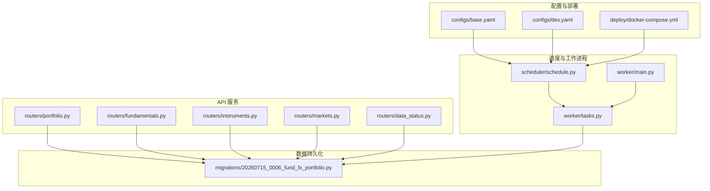
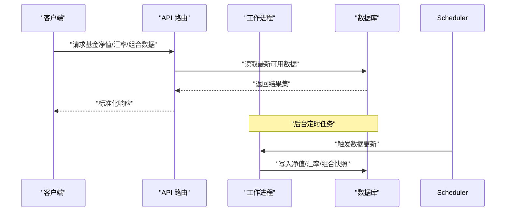
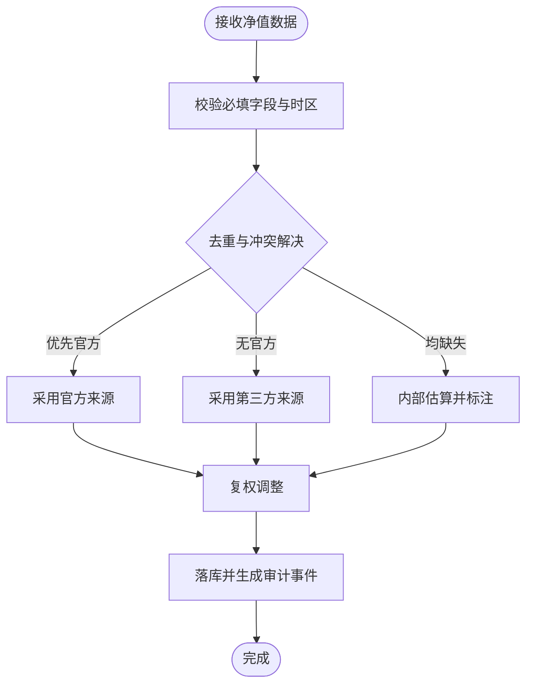
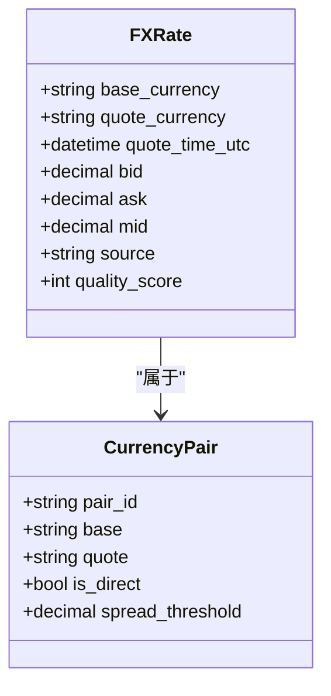
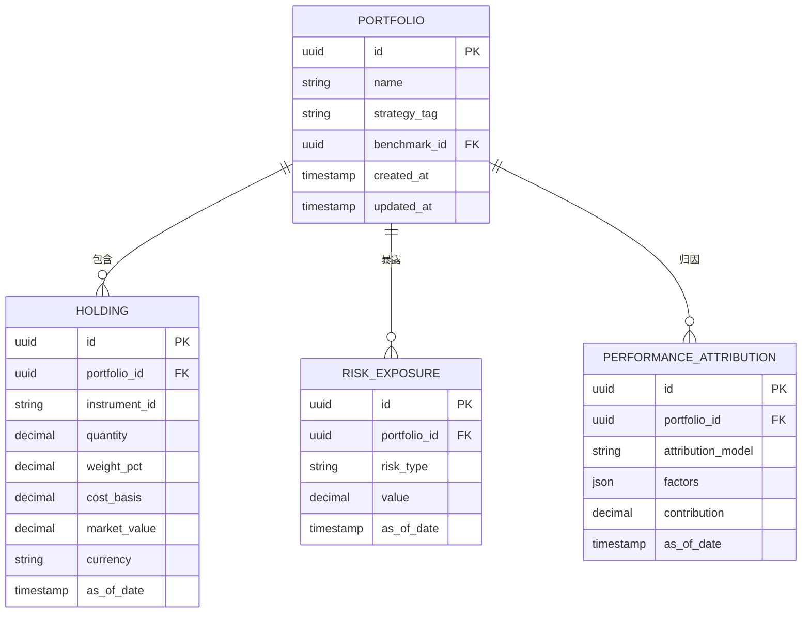
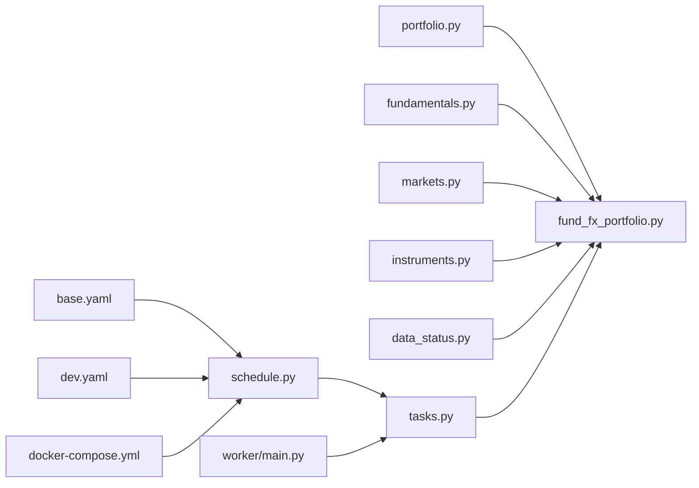

# 基金外汇投资组合模型

<cite>
**本文引用的文件**   
- [20260715_0006_fund_fx_portfolio.py](file://sql/migrations/versions/20260715_0006_fund_fx_portfolio.py)
- [portfolio.py](file://apps/api/routers/portfolio.py)
- [fundamentals.py](file://apps/api/routers/fundamentals.py)
- [instruments.py](file://apps/api/routers/instruments.py)
- [markets.py](file://apps/api/routers/markets.py)
- [data_status.py](file://apps/api/routers/data_status.py)
- [schedule.py](file://apps/scheduler/schedule.py)
- [tasks.py](file://apps/worker/tasks.py)
- [main.py](file://apps/worker/main.py)
- [base.yaml](file://configs/base.yaml)
- [dev.yaml](file://configs/dev.yaml)
- [docker-compose.yml](file://deploy/docker-compose.yml)
</cite>

## 目录
1. [引言](#引言)
2. [项目结构](#项目结构)
3. [核心组件](#核心组件)
4. [架构总览](#架构总览)
5. [详细组件分析](#详细组件分析)
6. [依赖关系分析](#依赖关系分析)
7. [性能考虑](#性能考虑)
8. [故障排查指南](#故障排查指南)
9. [结论](#结论)
10. [附录](#附录)

## 引言
本文件围绕基金(Fund)、外汇(FX)和投资组合(Portfolio)三类数据模型，系统化阐述其数据结构、业务规则与系统实现。重点覆盖：
- 基金净值(NAV)数据模型、分类体系、费率结构与业绩基准管理
- 外汇汇率报价方式、时区处理与跨币种转换机制
- 投资组合资产配置、风险敞口计算与绩效归因分析
- 多资产类别的统一数据接口与查询优化策略
- 数据更新频率、缓存策略与实时性要求

## 项目结构
本项目采用“应用层API + 调度器 + 工作进程 + 数据库迁移”的分层组织方式：
- API 层提供统一的数据访问入口（基金、外汇、投资组合等）
- 调度器负责定时任务编排
- 工作进程执行数据抽取、清洗与入库
- SQL 迁移定义核心表结构（含基金、外汇、投资组合）

图表来源
- [portfolio.py](file://apps/api/routers/portfolio.py)
- [fundamentals.py](file://apps/api/routers/fundamentals.py)
- [instruments.py](file://apps/api/routers/instruments.py)
- [markets.py](file://apps/api/routers/markets.py)
- [data_status.py](file://apps/api/routers/data_status.py)
- [schedule.py](file://apps/scheduler/schedule.py)
- [tasks.py](file://apps/worker/tasks.py)
- [main.py](file://apps/worker/main.py)
- [base.yaml](file://configs/base.yaml)
- [dev.yaml](file://configs/dev.yaml)
- [docker-compose.yml](file://deploy/docker-compose.yml)
- [20260715_0006_fund_fx_portfolio.py](file://sql/migrations/versions/20260715_0006_fund_fx_portfolio.py)

章节来源
- [portfolio.py](file://apps/api/routers/portfolio.py)
- [fundamentals.py](file://apps/api/routers/fundamentals.py)
- [instruments.py](file://apps/api/routers/instruments.py)
- [markets.py](file://apps/api/routers/markets.py)
- [data_status.py](file://apps/api/routers/data_status.py)
- [schedule.py](file://apps/scheduler/schedule.py)
- [tasks.py](file://apps/worker/tasks.py)
- [main.py](file://apps/worker/main.py)
- [base.yaml](file://configs/base.yaml)
- [dev.yaml](file://configs/dev.yaml)
- [docker-compose.yml](file://deploy/docker-compose.yml)
- [20260715_0006_fund_fx_portfolio.py](file://sql/migrations/versions/20260715_0006_fund_fx_portfolio.py)

## 核心组件
本节聚焦三大模型的核心字段与约束，并说明其在系统中的职责边界。

- 基金净值(NAV)
  - 标识：基金代码、份额类型、币种
  - 时间：估值日、生效日、记录时间
  - 数值：单位净值、累计净值、复权因子、分红/拆分事件标记
  - 元数据：数据来源、质量评分、审计追踪
  - 用途：收益计算、基准对比、费率估算、回测输入

- 外汇汇率(FX)
  - 标识：基础货币、计价货币、报价源
  - 时间：报价时间、结算日、时区
  - 数值：买入价、卖出价、中间价、点差
  - 元数据：市场状态、流动性指标、异常标记
  - 用途：跨币种转换、风险敞口折算、绩效归因

- 投资组合(Portfolio)
  - 标识：组合ID、名称、策略标签、基准ID
  - 持仓：资产ID、数量/权重、成本、市值、币种
  - 风险：久期、凸性、VaR、Beta、行业/区域暴露
  - 绩效：日度/滚动收益、跟踪误差、信息比率
  - 元数据：调仓日志、审批流、版本控制

章节来源
- [20260715_0006_fund_fx_portfolio.py](file://sql/migrations/versions/20260715_0006_fund_fx_portfolio.py)

## 架构总览
系统通过API对外暴露统一查询能力，底层由迁移脚本定义的表结构承载数据；调度器按策略触发工作进程进行增量或全量更新。

图表来源
- [portfolio.py](file://apps/api/routers/portfolio.py)
- [fundamentals.py](file://apps/api/routers/fundamentals.py)
- [instruments.py](file://apps/api/routers/instruments.py)
- [markets.py](file://apps/api/routers/markets.py)
- [data_status.py](file://apps/api/routers/data_status.py)
- [schedule.py](file://apps/scheduler/schedule.py)
- [tasks.py](file://apps/worker/tasks.py)
- [main.py](file://apps/worker/main.py)
- [20260715_0006_fund_fx_portfolio.py](file://sql/migrations/versions/20260715_0006_fund_fx_portfolio.py)

## 详细组件分析

### 基金净值(NAV)模型
- 数据维度
  - 时间序列：按估值日聚合，支持复权调整
  - 主体维度：基金代码+份额类型+币种
  - 质量维度：来源可信度、缺失插值策略、异常检测
- 业务规则
  - 净值更新优先级：官方披露 > 第三方校验 > 内部估算
  - 复权逻辑：分红再投资、拆分合并、费用扣减
  - 基准对齐：同币种、同日可比，必要时使用汇率桥接
- 查询优化
  - 分区键：估值日、基金代码
  - 索引：复合索引(基金, 日期), (币种, 日期)
  - 物化视图：滚动统计(移动平均、波动率)

图表来源
- [fundamentals.py](file://apps/api/routers/fundamentals.py)
- [20260715_0006_fund_fx_portfolio.py](file://sql/migrations/versions/20260715_0006_fund_fx_portfolio.py)

章节来源
- [fundamentals.py](file://apps/api/routers/fundamentals.py)
- [20260715_0006_fund_fx_portfolio.py](file://sql/migrations/versions/20260715_0006_fund_fx_portfolio.py)

### 外汇汇率(FX)模型
- 报价方式
  - 直接/间接标价法统一为“基础货币/计价货币”
  - 双向报价：买入/卖出/中间价，支持点差阈值过滤
- 时区处理
  - 所有时间戳以UTC存储，展示层按本地时区转换
  - 结算日与报价日分离，支持T+0/T+1/T+2
- 跨币种转换
  - 路径选择：直连对优先，三角套汇次之
  - 一致性校验：交叉汇率闭合误差容忍范围
  - 时效性：过期汇率自动降级至最近可用

图表来源
- [markets.py](file://apps/api/routers/markets.py)
- [20260715_0006_fund_fx_portfolio.py](file://sql/migrations/versions/20260715_0006_fund_fx_portfolio.py)

章节来源
- [markets.py](file://apps/api/routers/markets.py)
- [20260715_0006_fund_fx_portfolio.py](file://sql/migrations/versions/20260715_0006_fund_fx_portfolio.py)

### 投资组合(Portfolio)模型
- 资产配置
  - 资产粒度：股票/债券/商品/衍生品/现金
  - 权重表示：名义金额、市值占比、目标权重
  - 再平衡：触发条件(阈值/日历/事件)
- 风险敞口
  - 市场风险：Beta、久期、凸性、VaR/CVaR
  - 信用风险：评级分布、违约概率、集中度
  - 流动性风险：换手率、买卖价差、冲击成本
- 绩效归因
  - Brinson模型：配置效应、选择效应、交互效应
  - 因子模型：风格因子、行业因子、宏观因子
  - 归因口径：币种一致、费用扣除、基准对齐

图表来源
- [portfolio.py](file://apps/api/routers/portfolio.py)
- [20260715_0006_fund_fx_portfolio.py](file://sql/migrations/versions/20260715_0006_fund_fx_portfolio.py)

章节来源
- [portfolio.py](file://apps/api/routers/portfolio.py)
- [20260715_0006_fund_fx_portfolio.py](file://sql/migrations/versions/20260715_0006_fund_fx_portfolio.py)

### 基金分类体系、费率结构与业绩基准管理
- 分类体系
  - 资产类别：权益/固收/混合/另类/货币
  - 地域/行业：国内/海外、行业细分
  - 策略标签：主动/被动、指数增强、量化
- 费率结构
  - 管理费、托管费、销售服务费、申赎费
  - 阶梯费率、业绩报酬、最低持有期
- 业绩基准
  - 基准构成：指数权重、自定义加权
  - 跟踪误差：日度/滚动窗口
  - 基准更新：成分变更、权重调整

章节来源
- [fundamentals.py](file://apps/api/routers/fundamentals.py)
- [instruments.py](file://apps/api/routers/instruments.py)
- [20260715_0006_fund_fx_portfolio.py](file://sql/migrations/versions/20260715_0006_fund_fx_portfolio.py)

### 统一数据接口与查询优化
- 统一接口
  - 资产ID规范：统一编码、跨市场映射
  - 时间规范：ISO8601、UTC存储、本地展示
  - 币种规范：ISO4217、汇率桥接
- 查询优化
  - 预聚合：日度/周度/月度快照
  - 索引策略：复合索引、部分索引
  - 分页与游标：大数据集高效遍历
  - 缓存层：热点数据Redis缓存、失效策略

章节来源
- [instruments.py](file://apps/api/routers/instruments.py)
- [markets.py](file://apps/api/routers/markets.py)
- [data_status.py](file://apps/api/routers/data_status.py)

### 数据更新频率、缓存策略与实时性
- 更新频率
  - 净值：日频为主，盘中可支持T+0预估
  - 汇率：分钟级至秒级，视市场活跃度
  - 组合：日终快照，盘中增量变更
- 缓存策略
  - 多级缓存：内存→Redis→数据库
  - 失效策略：基于时间窗与版本号
  - 一致性：最终一致性，强一致场景走直读
- 实时性要求
  - 延迟SLA：关键接口<1s，批量<5min
  - 监控告警：延迟、错误率、数据新鲜度

章节来源
- [data_status.py](file://apps/api/routers/data_status.py)
- [schedule.py](file://apps/scheduler/schedule.py)
- [tasks.py](file://apps/worker/tasks.py)
- [main.py](file://apps/worker/main.py)
- [base.yaml](file://configs/base.yaml)
- [dev.yaml](file://configs/dev.yaml)
- [docker-compose.yml](file://deploy/docker-compose.yml)

## 依赖关系分析
API路由依赖迁移定义的表结构；调度器与工作进程协同完成数据更新；配置文件驱动运行参数；容器编排保障服务可用性。

图表来源
- [portfolio.py](file://apps/api/routers/portfolio.py)
- [fundamentals.py](file://apps/api/routers/fundamentals.py)
- [markets.py](file://apps/api/routers/markets.py)
- [instruments.py](file://apps/api/routers/instruments.py)
- [data_status.py](file://apps/api/routers/data_status.py)
- [schedule.py](file://apps/scheduler/schedule.py)
- [tasks.py](file://apps/worker/tasks.py)
- [main.py](file://apps/worker/main.py)
- [base.yaml](file://configs/base.yaml)
- [dev.yaml](file://configs/dev.yaml)
- [docker-compose.yml](file://deploy/docker-compose.yml)
- [20260715_0006_fund_fx_portfolio.py](file://sql/migrations/versions/20260715_0006_fund_fx_portfolio.py)

章节来源
- [portfolio.py](file://apps/api/routers/portfolio.py)
- [fundamentals.py](file://apps/api/routers/fundamentals.py)
- [markets.py](file://apps/api/routers/markets.py)
- [instruments.py](file://apps/api/routers/instruments.py)
- [data_status.py](file://apps/api/routers/data_status.py)
- [schedule.py](file://apps/scheduler/schedule.py)
- [tasks.py](file://apps/worker/tasks.py)
- [main.py](file://apps/worker/main.py)
- [base.yaml](file://configs/base.yaml)
- [dev.yaml](file://configs/dev.yaml)
- [docker-compose.yml](file://deploy/docker-compose.yml)
- [20260715_0006_fund_fx_portfolio.py](file://sql/migrations/versions/20260715_0006_fund_fx_portfolio.py)

## 性能考虑
- 数据库层面
  - 分区表：按时间/主体分片，提升扫描效率
  - 索引设计：高频查询列前置，避免选择性低列
  - 物化视图：预计算滚动统计，降低在线计算压力
- 缓存层面
  - 热点键：常用基金/汇率对缓存
  - 失效策略：TTL+版本号双保险
  - 穿透防护：布隆过滤器拦截不存在键
- 计算层面
  - 批处理：夜间批量归因与风险计算
  - 并行化：多资产并行拉取与聚合
  - 流式处理：实时汇率接入，增量更新

[本节为通用指导，不直接分析具体文件]

## 故障排查指南
- 数据新鲜度
  - 检查数据状态接口返回的更新时间与延迟指标
  - 核对调度任务执行日志与失败重试次数
- 汇率异常
  - 验证点差阈值与报价源健康度
  - 检查三角套汇闭合误差是否超限
- 净值缺失
  - 确认来源优先级与冲突解决策略
  - 查看复权调整与审计事件记录
- 组合不一致
  - 比对快照与增量变更记录
  - 核查基准版本与权重更新

章节来源
- [data_status.py](file://apps/api/routers/data_status.py)
- [schedule.py](file://apps/scheduler/schedule.py)
- [tasks.py](file://apps/worker/tasks.py)
- [main.py](file://apps/worker/main.py)

## 结论
本模型以迁移脚本为核心，结合API路由与调度工作进程，构建了基金、外汇与投资三位一体的数据体系。通过统一的资产与时间规范、严格的汇率与净值治理、以及完善的组合风险与归因能力，支撑多资产类别的量化研究与投研决策。建议持续优化索引与缓存策略，完善监控告警与数据质量度量，进一步提升系统的稳定性与实时性。

[本节为总结性内容，不直接分析具体文件]

## 附录
- 术语表
  - NAV：单位净值
  - VaR：在险价值
  - Brinson：Brinson绩效归因模型
  - T+0/T+1/T+2：交易结算周期
- 参考实现路径
  - 基金净值路由：[fundamentals.py](file://apps/api/routers/fundamentals.py)
  - 外汇市场路由：[markets.py](file://apps/api/routers/markets.py)
  - 投资组合路由：[portfolio.py](file://apps/api/routers/portfolio.py)
  - 数据状态接口：[data_status.py](file://apps/api/routers/data_status.py)
  - 调度与任务：[schedule.py](file://apps/scheduler/schedule.py), [tasks.py](file://apps/worker/tasks.py), [main.py](file://apps/worker/main.py)
  - 配置与部署：[base.yaml](file://configs/base.yaml), [dev.yaml](file://configs/dev.yaml), [docker-compose.yml](file://deploy/docker-compose.yml)
  - 核心表结构：[20260715_0006_fund_fx_portfolio.py](file://sql/migrations/versions/20260715_0006_fund_fx_portfolio.py)