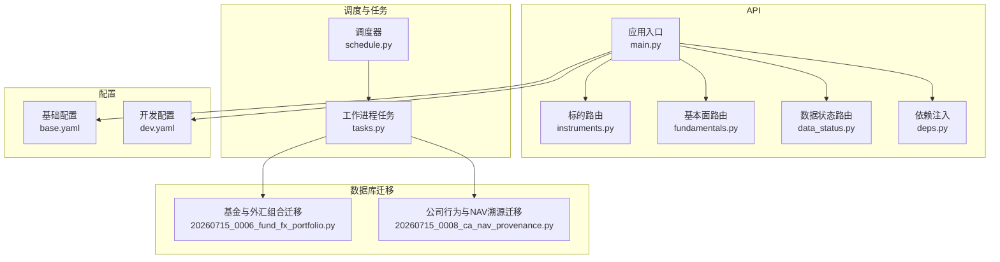
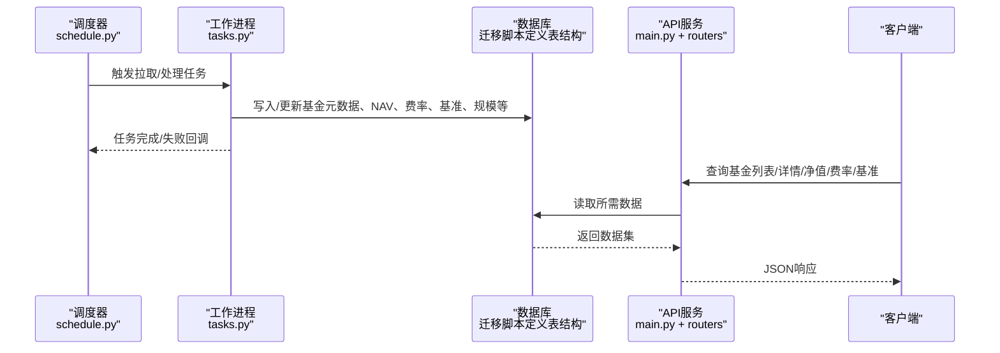
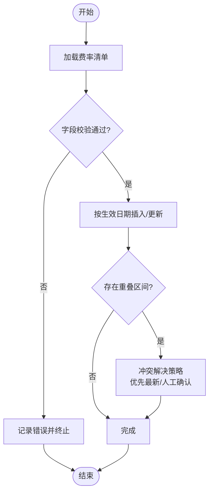
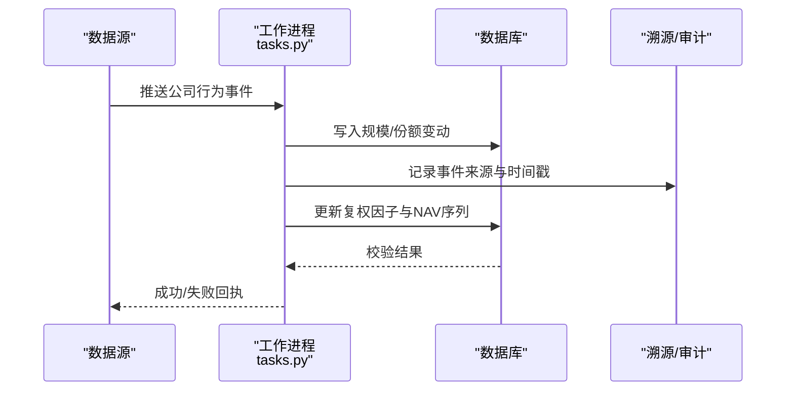
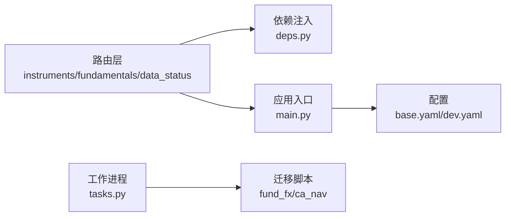

# 基金数据模型

<cite>
**本文引用的文件**   
- [20260715_0006_fund_fx_portfolio.py](file://sql/migrations/versions/20260715_0006_fund_fx_portfolio.py)
- [20260715_0008_ca_nav_provenance.py](file://sql/migrations/versions/20260715_0008_ca_nav_provenance.py)
- [instruments.py](file://apps/api/routers/instruments.py)
- [fundamentals.py](file://apps/api/routers/fundamentals.py)
- [data_status.py](file://apps/api/routers/data_status.py)
- [main.py](file://apps/api/main.py)
- [deps.py](file://apps/api/deps.py)
- [schedule.py](file://apps/scheduler/schedule.py)
- [tasks.py](file://apps/worker/tasks.py)
- [base.yaml](file://configs/base.yaml)
- [dev.yaml](file://configs/dev.yaml)
</cite>

## 目录
1. [简介](#简介)
2. [项目结构](#项目结构)
3. [核心组件](#核心组件)
4. [架构总览](#架构总览)
5. [详细组件分析](#详细组件分析)
6. [依赖关系分析](#依赖关系分析)
7. [性能考虑](#性能考虑)
8. [故障排查指南](#故障排查指南)
9. [结论](#结论)
10. [附录](#附录)

## 简介
本文件聚焦于“基金(Fund)”数据模型的完整说明，覆盖以下关键主题：
- 基金净值(NAV)数据结构、字段定义与数据类型
- 基金分类体系（股票型、债券型、混合型等）的标识与管理方式
- 费率结构的数据表示（管理费、托管费、销售服务费等）
- 业绩基准数据的关联关系与更新机制
- 基金基本信息、成立日期、规模变化等元数据管理
- 基金数据的查询接口与使用示例
- 数据更新频率、历史数据保留策略与性能优化建议

## 项目结构
本项目采用分层与模块化组织方式：
- API 层：提供 REST 路由，暴露基金相关查询能力
- 调度与任务：负责定时拉取、处理与入库
- 数据库迁移：定义基金、外汇、公司行为与 NAV 溯源等表结构
- 配置：集中管理运行参数与环境差异



图表来源
- [main.py](file://apps/api/main.py)
- [instruments.py](file://apps/api/routers/instruments.py)
- [fundamentals.py](file://apps/api/routers/fundamentals.py)
- [data_status.py](file://apps/api/routers/data_status.py)
- [deps.py](file://apps/api/deps.py)
- [schedule.py](file://apps/scheduler/schedule.py)
- [tasks.py](file://apps/worker/tasks.py)
- [20260715_0006_fund_fx_portfolio.py](file://sql/migrations/versions/20260715_0006_fund_fx_portfolio.py)
- [20260715_0008_ca_nav_provenance.py](file://sql/migrations/versions/20260715_0008_ca_nav_provenance.py)
- [base.yaml](file://configs/base.yaml)
- [dev.yaml](file://configs/dev.yaml)

章节来源
- [main.py](file://apps/api/main.py)
- [instruments.py](file://apps/api/routers/instruments.py)
- [fundamentals.py](file://apps/api/routers/fundamentals.py)
- [data_status.py](file://apps/api/routers/data_status.py)
- [deps.py](file://apps/api/deps.py)
- [schedule.py](file://apps/scheduler/schedule.py)
- [tasks.py](file://apps/worker/tasks.py)
- [20260715_0006_fund_fx_portfolio.py](file://sql/migrations/versions/20260715_0006_fund_fx_portfolio.py)
- [20260715_0008_ca_nav_provenance.py](file://sql/migrations/versions/20260715_0008_ca_nav_provenance.py)
- [base.yaml](file://configs/base.yaml)
- [dev.yaml](file://configs/dev.yaml)

## 核心组件
本节从数据模型与业务维度梳理基金相关核心要素：
- 基金实体与元数据：基金代码、名称、类型、成立日期、币种、交易所、状态等
- 净值(NAV)序列：日期、单位净值、复权因子、币种换算、数据来源与时间戳
- 基金分类体系：按投资方向与资产类别划分（如股票型、债券型、混合型、货币型、指数型、QDII等），通过标签或枚举字段管理
- 费率结构：管理费、托管费、销售服务费、申购/赎回费等，以百分比或基点存储，支持按日/按月变更
- 业绩基准：基准代码、权重、再平衡规则、跟踪误差阈值等
- 规模与份额：总资产规模、流通份额、份额变动事件（分红、拆分、合并、申赎）
- 外汇与多币种：基金计价币种、汇率源、折算逻辑
- 公司行为与调整：分红、拆分、合并对净值的影响与回溯调整
- 溯源与审计：数据源、采集时间、校验结果、版本化记录

章节来源
- [20260715_0006_fund_fx_portfolio.py](file://sql/migrations/versions/20260715_0006_fund_fx_portfolio.py)
- [20260715_0008_ca_nav_provenance.py](file://sql/migrations/versions/20260715_0008_ca_nav_provenance.py)

## 架构总览
下图展示基金数据从采集到对外服务的端到端流程。



图表来源
- [schedule.py](file://apps/scheduler/schedule.py)
- [tasks.py](file://apps/worker/tasks.py)
- [main.py](file://apps/api/main.py)
- [instruments.py](file://apps/api/routers/instruments.py)
- [fundamentals.py](file://apps/api/routers/fundamentals.py)
- [data_status.py](file://apps/api/routers/data_status.py)
- [20260715_0006_fund_fx_portfolio.py](file://sql/migrations/versions/20260715_0006_fund_fx_portfolio.py)
- [20260715_0008_ca_nav_provenance.py](file://sql/migrations/versions/20260715_0008_ca_nav_provenance.py)

## 详细组件分析

### 基金实体与元数据
- 关键字段
  - 基金代码/ISIN/内部ID：唯一标识
  - 基金名称、简称、管理人、托管人
  - 成立日期、清盘日期、上市日期
  - 基金类型（股票型、债券型、混合型、货币型、指数型、QDII等）
  - 计价币种、交易币种、基准币种
  - 交易所/市场、状态（存续、暂停、清盘）
  - 标签/分类：行业、策略、风险等级、是否ESG等
- 设计要点
  - 类型与标签分离：类型用于主分类，标签用于多维筛选
  - 时区与日期：统一UTC存储，展示层转换
  - 版本化：变更记录可追溯

章节来源
- [20260715_0006_fund_fx_portfolio.py](file://sql/migrations/versions/20260715_0006_fund_fx_portfolio.py)

### 基金净值(NAV)数据结构
- 核心字段
  - 日期：交易日
  - 单位净值：以计价币种计量的每份净值
  - 复权因子：用于价格序列一致性计算
  - 币种换算：汇率或折算系数
  - 数据来源：提供方、批次号、校验标记
  - 时间戳：采集时间与更新时间
- 数据类型建议
  - 数值：DECIMAL/NUMERIC，精度至少小数点后4位
  - 日期：DATE/TIMESTAMP WITH TIME ZONE
  - 文本：VARCHAR/TEXT，长度受控
- 约束与索引
  - (基金ID, 日期) 唯一键
  - 日期范围索引、基金ID前缀索引
  - 校验约束：非负、单调性检查（可选）

```mermaid
classDiagram
class Fund {
+id : string
+code : string
+name : string
+type : enum
+currency : string
+exchange : string
+status : enum
+tags : list
}
class Nav {
+fund_id : string
+date : date
+nav : decimal
+adj_factor : decimal
+fx_rate : decimal
+source : string
+updated_at : timestamp
}
class Benchmark {
+fund_id : string
+benchmark_code : string
+weight : decimal
+rebalance_rule : string
+updated_at : timestamp
}
class Fee {
+fund_id : string
+fee_type : enum
+rate : decimal
+effective_date : date
+expiry_date : date
+updated_at : timestamp
}
class Size {
+fund_id : string
+date : date
+total_assets : decimal
+shares_outstanding : decimal
+updated_at : timestamp
}
Fund ||--o{ Nav : "拥有"
Fund ||--o{ Benchmark : "关联"
Fund ||--o{ Fee : "适用"
Fund ||--o{ Size : "统计"
```

图表来源
- [20260715_0006_fund_fx_portfolio.py](file://sql/migrations/versions/20260715_0006_fund_fx_portfolio.py)
- [20260715_0008_ca_nav_provenance.py](file://sql/migrations/versions/20260715_0008_ca_nav_provenance.py)

章节来源
- [20260715_0006_fund_fx_portfolio.py](file://sql/migrations/versions/20260715_0006_fund_fx_portfolio.py)
- [20260715_0008_ca_nav_provenance.py](file://sql/migrations/versions/20260715_0008_ca_nav_provenance.py)

### 基金分类体系
- 分类维度
  - 投资方向：股票型、债券型、混合型、货币型、商品型、FOF/MOM
  - 策略风格：主动/被动、指数增强、量化、宏观对冲
  - 市场区域：A股、港股、美股、全球、QDII
  - 风险等级：低、中、高
- 管理方式
  - 使用枚举字段存储主类型，便于快速过滤
  - 使用标签系统承载多维属性，支持灵活检索
  - 分类变更需记录生效日期与原因

章节来源
- [20260715_0006_fund_fx_portfolio.py](file://sql/migrations/versions/20260715_0006_fund_fx_portfolio.py)

### 费率结构的数据表示
- 费用项
  - 管理费、托管费、销售服务费、申购费、赎回费、转换费、业绩报酬
- 存储方式
  - 按费用类型分条记录，包含生效与到期日期
  - 费率以小数或基点存储，统一为小数形式
  - 支持阶梯费率与条件费率（如持有期折扣）
- 更新机制
  - 公告驱动更新，带版本号与审计日志
  - 重叠区间冲突检测与回滚策略



图表来源
- [20260715_0006_fund_fx_portfolio.py](file://sql/migrations/versions/20260715_0006_fund_fx_portfolio.py)

章节来源
- [20260715_0006_fund_fx_portfolio.py](file://sql/migrations/versions/20260715_0006_fund_fx_portfolio.py)

### 业绩基准数据的关联关系与更新机制
- 关联关系
  - 基金与基准一对多（主基准+辅助基准）
  - 权重字段表示各基准在评估中的占比
- 更新机制
  - 基准变更需记录生效日期与原因
  - 跟踪误差与偏离度指标定期计算
  - 基准代码标准化与映射维护

章节来源
- [20260715_0006_fund_fx_portfolio.py](file://sql/migrations/versions/20260715_0006_fund_fx_portfolio.py)

### 规模与份额、公司行为与调整
- 规模与份额
  - 总资产规模、流通份额、份额变动事件（分红、拆分、合并、大额申赎）
- 公司行为与调整
  - 分红除息、拆合面对净值与复权因子的影响
  - 通过溯源记录确保前后一致性与可审计



图表来源
- [tasks.py](file://apps/worker/tasks.py)
- [20260715_0008_ca_nav_provenance.py](file://sql/migrations/versions/20260715_0008_ca_nav_provenance.py)

章节来源
- [tasks.py](file://apps/worker/tasks.py)
- [20260715_0008_ca_nav_provenance.py](file://sql/migrations/versions/20260715_0008_ca_nav_provenance.py)

### 基金数据的查询接口与使用示例
- 接口概览
  - 基金列表：支持按类型、标签、币种、市场、状态筛选
  - 基金详情：基本信息、费率、基准、最近规模
  - 净值序列：起止日期、复权选项、币种折算
  - 数据状态：最新更新时间、缺失日期、质量评分
- 调用示例（概念性）
  - GET /api/instruments?category=equity&currency=CNY
  - GET /api/instruments/{fund_id}/nav?start=YYYY-MM-DD&end=YYYY-MM-DD&adjusted=true
  - GET /api/fundamentals/{fund_id}/fees
  - GET /api/data-status?type=fund

章节来源
- [instruments.py](file://apps/api/routers/instruments.py)
- [fundamentals.py](file://apps/api/routers/fundamentals.py)
- [data_status.py](file://apps/api/routers/data_status.py)
- [main.py](file://apps/api/main.py)

## 依赖关系分析
- 模块耦合
  - API 路由依赖依赖注入容器获取数据库连接与缓存
  - 调度器与工作进程解耦，通过消息队列或直接调用
  - 迁移脚本定义表结构，被ORM/SQL层引用
- 外部依赖
  - 数据源适配器（基金净值、费率、基准、规模）
  - 汇率服务（多币种折算）
  - 日历与节假日（交易日判断）



图表来源
- [instruments.py](file://apps/api/routers/instruments.py)
- [fundamentals.py](file://apps/api/routers/fundamentals.py)
- [data_status.py](file://apps/api/routers/data_status.py)
- [deps.py](file://apps/api/deps.py)
- [main.py](file://apps/api/main.py)
- [tasks.py](file://apps/worker/tasks.py)
- [20260715_0006_fund_fx_portfolio.py](file://sql/migrations/versions/20260715_0006_fund_fx_portfolio.py)
- [20260715_0008_ca_nav_provenance.py](file://sql/migrations/versions/20260715_0008_ca_nav_provenance.py)
- [base.yaml](file://configs/base.yaml)
- [dev.yaml](file://configs/dev.yaml)

章节来源
- [instruments.py](file://apps/api/routers/instruments.py)
- [fundamentals.py](file://apps/api/routers/fundamentals.py)
- [data_status.py](file://apps/api/routers/data_status.py)
- [deps.py](file://apps/api/deps.py)
- [main.py](file://apps/api/main.py)
- [tasks.py](file://apps/worker/tasks.py)
- [20260715_0006_fund_fx_portfolio.py](file://sql/migrations/versions/20260715_0006_fund_fx_portfolio.py)
- [20260715_0008_ca_nav_provenance.py](file://sql/migrations/versions/20260715_0008_ca_nav_provenance.py)
- [base.yaml](file://configs/base.yaml)
- [dev.yaml](file://configs/dev.yaml)

## 性能考虑
- 索引与分区
  - 对(基金ID, 日期)建立复合索引；按日期分区提升范围查询性能
- 缓存策略
  - 热点基金详情与近期净值使用缓存，设置合理TTL
- 批处理与增量更新
  - 批量Upsert减少IO；增量同步避免全量重算
- 并发控制
  - 写路径加锁避免重复写入；读路径无锁或乐观锁
- 数据压缩
  - 历史净值与费率归档至冷存储，热数据保留近N年

[本节为通用指导，不直接分析具体文件]

## 故障排查指南
- 常见问题
  - 净值缺失：检查数据源可用性、日历匹配、ETL任务状态
  - 费率冲突：核查生效日期重叠与优先级策略
  - 基准不一致：确认基准代码映射与权重更新
  - 汇率异常：验证汇率源与折算逻辑
- 定位方法
  - 查看数据状态接口返回的质量评分与缺失日期
  - 检查溯源记录与审计日志，定位问题批次
  - 对比相邻数据源的差异，进行三方校验

章节来源
- [data_status.py](file://apps/api/routers/data_status.py)
- [20260715_0008_ca_nav_provenance.py](file://sql/migrations/versions/20260715_0008_ca_nav_provenance.py)

## 结论
本模型围绕基金实体构建，涵盖净值、费率、基准、规模与公司行为等关键维度，并通过迁移脚本与API路由形成端到端的数据链路。建议在实施中强化索引与分区、完善溯源与审计、统一币种与基准管理，以提升数据质量与查询性能。

[本节为总结性内容，不直接分析具体文件]

## 附录
- 术语
  - NAV：单位净值
  - QDII：合格境内机构投资者
  - FOF/MOM：基金中的基金/管理人的管理人
- 参考实现位置
  - 基金与外汇组合表结构：[20260715_0006_fund_fx_portfolio.py](file://sql/migrations/versions/20260715_0006_fund_fx_portfolio.py)
  - 公司行为与NAV溯源表结构：[20260715_0008_ca_nav_provenance.py](file://sql/migrations/versions/20260715_0008_ca_nav_provenance.py)
  - 基金查询接口路由：[instruments.py](file://apps/api/routers/instruments.py)、[fundamentals.py](file://apps/api/routers/fundamentals.py)、[data_status.py](file://apps/api/routers/data_status.py)
  - 应用入口与依赖注入：[main.py](file://apps/api/main.py)、[deps.py](file://apps/api/deps.py)
  - 调度与工作进程：[schedule.py](file://apps/scheduler/schedule.py)、[tasks.py](file://apps/worker/tasks.py)
  - 配置：[base.yaml](file://configs/base.yaml)、[dev.yaml](file://configs/dev.yaml)