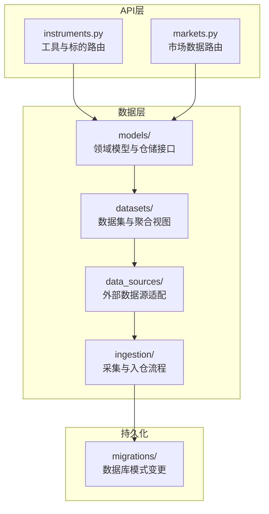
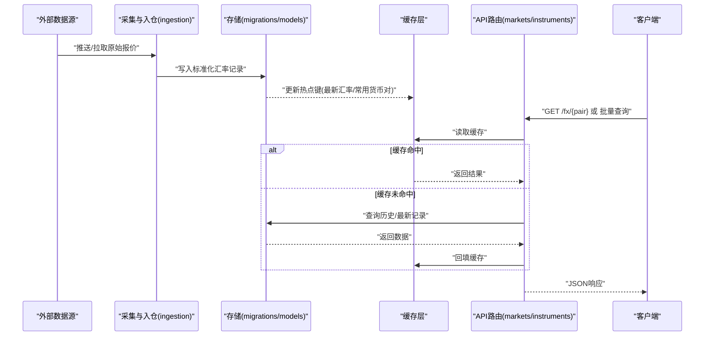
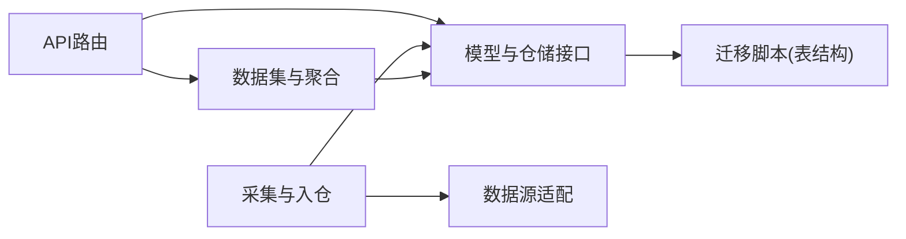

# 外汇汇率模型

<cite>
**本文引用的文件**   
- [apps/api/routers/instruments.py](file://apps/api/routers/instruments.py)
- [apps/api/routers/markets.py](file://apps/api/routers/markets.py)
- [packages/models/](file://packages/models/)
- [packages/datasets/](file://packages/datasets/)
- [packages/data_sources/](file://packages/data_sources/)
- [packages/ingestion/](file://packages/ingestion/)
- [sql/migrations/20260715_0003_market_bar.py](file://sql/migrations/20260715_0003_market_bar.py)
- [sql/migrations/20260715_0006_fund_fx_portfolio.py](file://sql/migrations/20260715_0006_fund_fx_portfolio.py)
- [skills/cross-market-quant-research/references/instrument-id-format.md](file://skills/cross-market-quant-research/references/instrument-id-format.md)
</cite>

## 目录
1. [简介](#简介)
2. [项目结构](#项目结构)
3. [核心组件](#核心组件)
4. [架构总览](#架构总览)
5. [详细组件分析](#详细组件分析)
6. [依赖关系分析](#依赖关系分析)
7. [性能考虑](#性能考虑)
8. [故障排查指南](#故障排查指南)
9. [结论](#结论)
10. [附录](#附录)

## 简介
本文件围绕外汇(FX)汇率数据模型进行系统化说明，覆盖报价数据结构、时区与时间戳处理、跨币种转换与精度控制、数据来源优先级与冲突解决、货币对标识规范与命名约定、查询API使用示例与批量获取方法、实时汇率更新机制、缓存策略以及历史数据归档规则。文档同时给出异常检测与数据处理最佳实践，帮助读者在工程实践中稳定地构建与维护FX数据管线。

## 项目结构
本项目采用分层与模块化组织方式：
- API层：提供REST接口，暴露市场与工具相关能力（如行情、工具等）。
- 数据源与采集：负责接入外部数据源、清洗、标准化入库。
- 数据集与模型：定义领域模型、存储结构与访问接口。
- 迁移脚本：维护数据库模式演进。
- 技能参考：包含通用标识格式规范等参考文档。

图表来源
- [apps/api/routers/instruments.py](file://apps/api/routers/instruments.py)
- [apps/api/routers/markets.py](file://apps/api/routers/markets.py)
- [packages/models/](file://packages/models/)
- [packages/datasets/](file://packages/datasets/)
- [packages/data_sources/](file://packages/data_sources/)
- [packages/ingestion/](file://packages/ingestion/)
- [sql/migrations/20260715_0003_market_bar.py](file://sql/migrations/20260715_0003_market_bar.py)
- [sql/migrations/20260715_0006_fund_fx_portfolio.py](file://sql/migrations/20260715_0006_fund_fx_portfolio.py)

章节来源
- [apps/api/routers/instruments.py](file://apps/api/routers/instruments.py)
- [apps/api/routers/markets.py](file://apps/api/routers/markets.py)
- [sql/migrations/20260715_0003_market_bar.py](file://sql/migrations/20260715_0003_market_bar.py)
- [sql/migrations/20260715_0006_fund_fx_portfolio.py](file://sql/migrations/20260715_0006_fund_fx_portfolio.py)

## 核心组件
- 汇率报价模型
  - 字段语义：货币对标识、买入价、卖出价、中间价、时间戳、来源与质量标记。
  - 存储格式：价格以高精度数值类型存储；时间戳统一为UTC；来源ID用于溯源。
- 货币对标识规范
  - 命名约定：基础货币/计价货币的三字母ISO代码组合，遵循“基础在前、计价在后”的规则。
  - 参考：见技能参考中的标识格式文档。
- 时区与时间戳
  - 输入时间戳需转换为UTC；展示时可按业务时区本地化。
- 跨币种转换与精度
  - 通过中间价或双向报价计算；精度控制采用固定小数位或科学计数法，避免浮点误差。
- 数据来源优先级与冲突解决
  - 多源汇聚时按优先级排序；冲突场景采用加权平均或最近有效值策略。
- 查询API
  - 提供单条与批量查询接口，支持时间范围过滤、货币对筛选与返回字段裁剪。
- 实时更新与缓存
  - 增量推送+定时刷新；热点键缓存与过期策略结合。
- 历史归档
  - 冷热分层存储，定期归档至低成本介质，保留策略可配置。

章节来源
- [skills/cross-market-quant-research/references/instrument-id-format.md](file://skills/cross-market-quant-research/references/instrument-id-format.md)

## 架构总览
下图展示了从外部数据源到API查询的整体链路，包括采集、标准化、存储、缓存与查询路径。

图表来源
- [apps/api/routers/markets.py](file://apps/api/routers/markets.py)
- [apps/api/routers/instruments.py](file://apps/api/routers/instruments.py)
- [packages/ingestion/](file://packages/ingestion/)
- [packages/models/](file://packages/models/)
- [sql/migrations/20260715_0003_market_bar.py](file://sql/migrations/20260715_0003_market_bar.py)

## 详细组件分析

### 汇率报价数据结构
- 关键字段
  - 货币对标识：由基础货币与计价货币组成，遵循ISO 4217三字母代码。
  - 买入价(Bid)、卖出价(Ask)、中间价(Mid)：均为非负数值，精度受业务约束。
  - 时间戳：UTC时间，精确到秒或毫秒级。
  - 来源与质量：来源ID、质量评分、是否经过校验。
- 存储建议
  - 价格使用高精度数值类型，避免浮点误差。
  - 时间戳统一为UTC，便于跨时区一致性与排序。
- 复杂度
  - 单条插入/查询O(1)~O(logN)，批量写入采用批处理优化。

章节来源
- [sql/migrations/20260715_0003_market_bar.py](file://sql/migrations/20260715_0003_market_bar.py)
- [sql/migrations/20260715_0006_fund_fx_portfolio.py](file://sql/migrations/20260715_0006_fund_fx_portfolio.py)

### 货币对标识规范与命名约定
- 命名规则
  - 格式：BASE/QUOTE，例如EUR/USD、USD/CNY。
  - 大小写：统一大写。
  - 分隔符：斜杠“/”。
- 校验与规范化
  - 校验货币代码是否为ISO 4217标准。
  - 自动规范化大小写与去除多余空白。
- 参考
  - 详见技能参考中的标识格式文档。

章节来源
- [skills/cross-market-quant-research/references/instrument-id-format.md](file://skills/cross-market-quant-research/references/instrument-id-format.md)

### 时区处理与时间戳转换
- 输入时间戳
  - 若来自不同来源且带时区信息，先转换为UTC再入库。
- 展示与本地化
  - 查询返回UTC时间戳；前端或上层服务可按用户时区显示。
- 一致性保障
  - 所有排序、窗口聚合基于UTC时间戳，避免夏令时问题。

章节来源
- [sql/migrations/20260715_0003_market_bar.py](file://sql/migrations/20260715_0003_market_bar.py)

### 跨币种转换与精度控制
- 转换逻辑
  - 直接货币对：使用Bid/Ask/Mid进行换算。
  - 间接货币对：通过共同基准货币（如USD）进行交叉换算。
- 精度控制
  - 固定小数位：根据货币对惯例设置（如主要货币对4~6位小数）。
  - 舍入策略：四舍五入或银行家舍入，保持前后端一致。
- 误差与回退
  - 当某货币对缺失时，尝试通过三角套算或最近可用报价回退。

章节来源
- [packages/models/](file://packages/models/)
- [packages/datasets/](file://packages/datasets/)

### 数据来源优先级与冲突解决
- 优先级策略
  - 按来源可信度、延迟、覆盖率打分排序。
- 冲突解决
  - 时间相近的多源报价：采用加权平均或最近有效值。
  - 极端异常值：触发异常检测并降级至次优来源。
- 可观测性
  - 记录来源选择决策与原因，便于审计与回溯。

章节来源
- [packages/data_sources/](file://packages/data_sources/)
- [packages/ingestion/](file://packages/ingestion/)

### 汇率查询API与批量获取
- 单条查询
  - 请求：指定货币对与时间范围。
  - 响应：返回Bid/Ask/Mid、时间戳、来源与质量标记。
- 批量查询
  - 请求：传入货币对列表与时间范围。
  - 响应：按货币对分组的数组或映射结构。
- 分页与裁剪
  - 支持分页参数与返回字段裁剪，减少带宽占用。

章节来源
- [apps/api/routers/markets.py](file://apps/api/routers/markets.py)
- [apps/api/routers/instruments.py](file://apps/api/routers/instruments.py)

### 实时汇率更新机制与缓存策略
- 实时更新
  - 增量推送：订阅外部流式数据，去重后写入。
  - 定时刷新：周期性拉取快照，保证最终一致性。
- 缓存策略
  - 热点键：常用货币对的最新报价缓存。
  - 过期策略：TTL与失效事件结合，避免脏读。
- 一致性
  - 读写分离：读优先走缓存，写落盘后再更新缓存。

章节来源
- [packages/ingestion/](file://packages/ingestion/)
- [packages/models/](file://packages/models/)

### 历史数据归档规则
- 分层存储
  - 热数据：近期高频访问数据驻留高性能存储。
  - 冷数据：历史数据归档到低成本介质。
- 保留策略
  - 按时间窗口与版本保留，支持清理任务与告警。
- 可恢复性
  - 归档包包含元数据与校验和，确保可验证恢复。

章节来源
- [sql/migrations/20260715_0003_market_bar.py](file://sql/migrations/20260715_0003_market_bar.py)

## 依赖关系分析
- 模块耦合
  - API层依赖模型与数据集；数据采集依赖数据源适配；存储依赖迁移脚本定义的表结构。
- 外部依赖
  - 外部数据源提供方、缓存系统、消息队列（可选）、对象存储（归档）。
- 潜在循环依赖
  - 通过接口抽象与分层避免循环引用。

图表来源
- [apps/api/routers/markets.py](file://apps/api/routers/markets.py)
- [apps/api/routers/instruments.py](file://apps/api/routers/instruments.py)
- [packages/models/](file://packages/models/)
- [packages/datasets/](file://packages/datasets/)
- [packages/data_sources/](file://packages/data_sources/)
- [packages/ingestion/](file://packages/ingestion/)
- [sql/migrations/20260715_0003_market_bar.py](file://sql/migrations/20260715_0003_market_bar.py)

章节来源
- [apps/api/routers/markets.py](file://apps/api/routers/markets.py)
- [apps/api/routers/instruments.py](file://apps/api/routers/instruments.py)
- [packages/models/](file://packages/models/)
- [packages/datasets/](file://packages/datasets/)
- [packages/data_sources/](file://packages/data_sources/)
- [packages/ingestion/](file://packages/ingestion/)
- [sql/migrations/20260715_0003_market_bar.py](file://sql/migrations/20260715_0003_market_bar.py)

## 性能考虑
- 索引设计
  - 针对货币对与时间戳建立复合索引，加速范围查询。
- 批处理
  - 批量写入与批量查询降低网络与序列化开销。
- 缓存命中率
  - 合理设置TTL与预热常用货币对，提升QPS。
- 资源隔离
  - 读写通道与计算任务隔离，避免相互影响。

[本节为通用指导，不直接分析具体文件]

## 故障排查指南
- 常见问题
  - 时间戳不一致：检查输入时间戳是否已转换为UTC。
  - 价格异常：核对来源质量标记与异常检测阈值。
  - 货币对不存在：确认标识是否符合规范并进行规范化。
- 定位步骤
  - 查看来源选择日志与冲突解决记录。
  - 检查缓存状态与过期策略。
  - 回放历史数据，对比预期与差异。
- 修复建议
  - 调整优先级权重与异常阈值。
  - 增加重试与熔断策略。
  - 完善监控指标与告警规则。

章节来源
- [packages/data_sources/](file://packages/data_sources/)
- [packages/ingestion/](file://packages/ingestion/)

## 结论
本文件对外汇汇率数据模型进行了系统化梳理，涵盖数据结构、时区处理、跨币种转换、来源优先级、API使用、实时更新与缓存、历史归档以及异常检测与最佳实践。建议在工程中严格遵循标识规范与精度控制，完善可观测性与容错机制，以确保FX数据的高可用与高一致性。

[本节为总结性内容，不直接分析具体文件]

## 附录
- 术语
  - Bid：买入价；Ask：卖出价；Mid：中间价。
  - UTC：协调世界时；TTL：生存时间。
- 参考链接
  - 货币对标识规范：见技能参考文档。

[本节为补充信息，不直接分析具体文件]