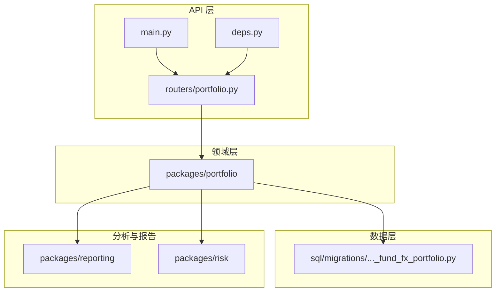
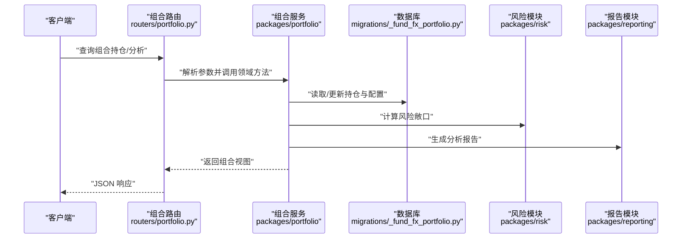
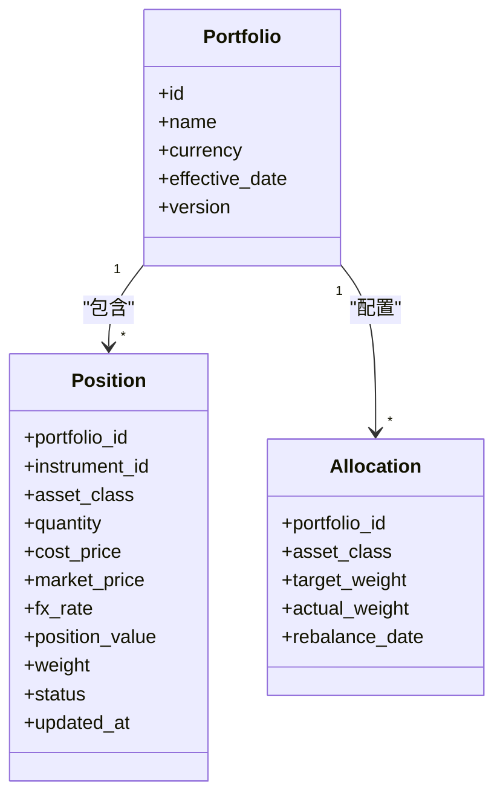
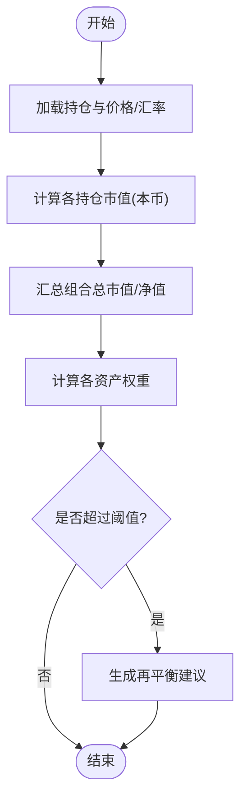
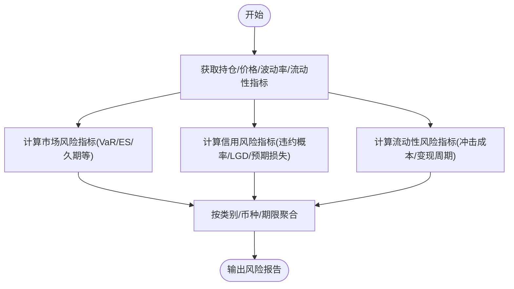
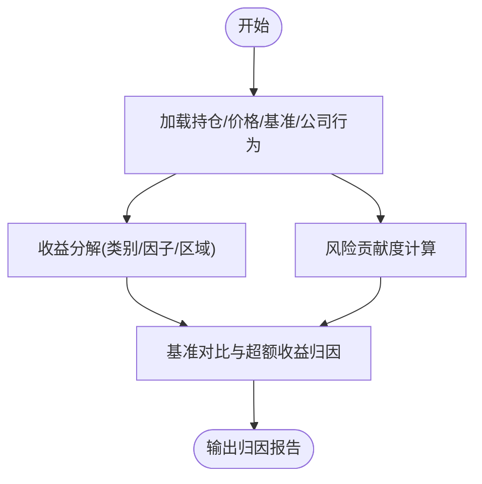
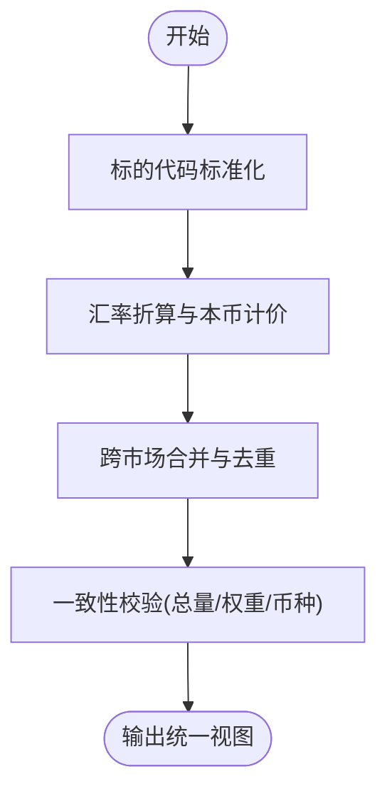
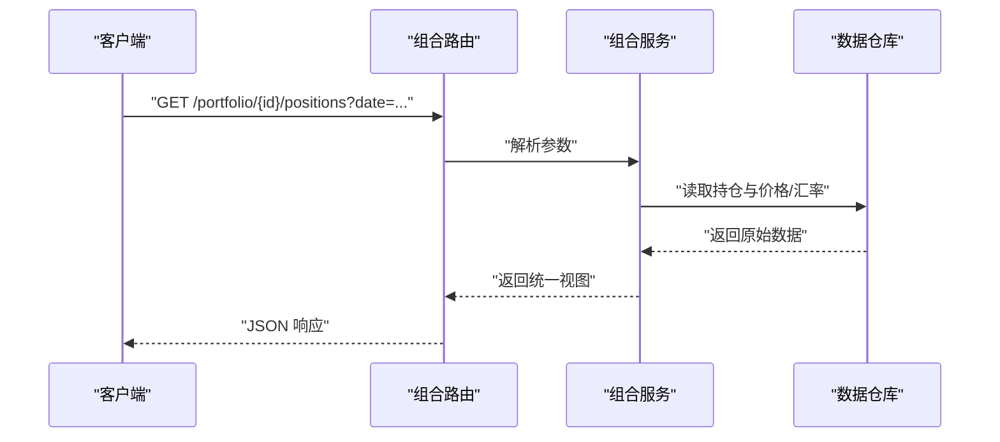
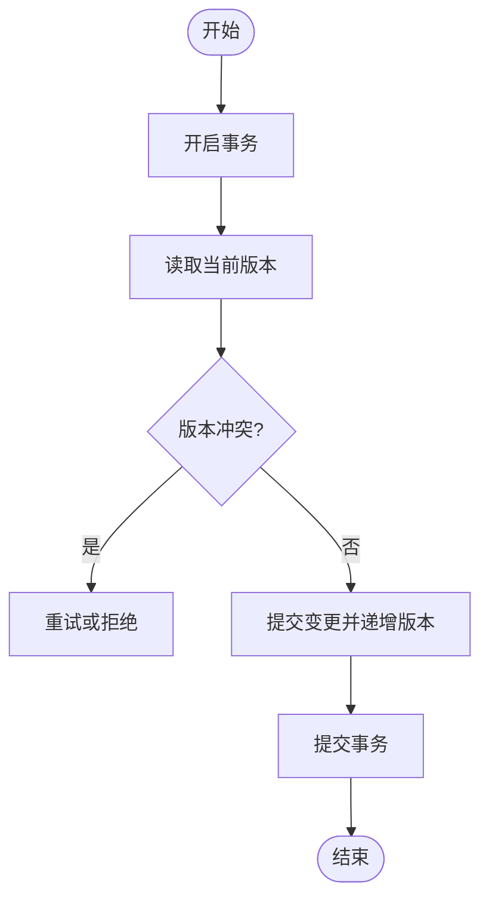
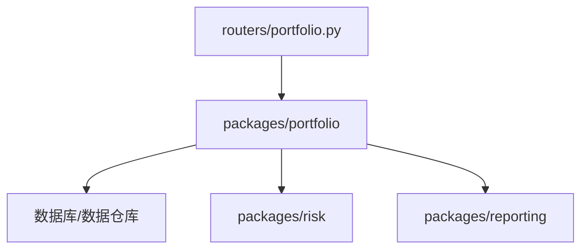

# 投资组合持仓模型

<cite>
**本文引用的文件**   
- [apps/api/routers/portfolio.py](file://apps/api/routers/portfolio.py)
- [packages/portfolio](file://packages/portfolio)
- [sql/migrations/20260715_0006_fund_fx_portfolio.py](file://sql/migrations/20260715_0006_fund_fx_portfolio.py)
- [apps/api/main.py](file://apps/api/main.py)
- [apps/api/deps.py](file://apps/api/deps.py)
- [packages/reporting](file://packages/reporting)
- [packages/risk](file://packages/risk)
</cite>

## 目录
1. [简介](#简介)
2. [项目结构](#项目结构)
3. [核心组件](#核心组件)
4. [架构总览](#架构总览)
5. [详细组件分析](#详细组件分析)
6. [依赖分析](#依赖分析)
7. [性能考虑](#性能考虑)
8. [故障排查指南](#故障排查指南)
9. [结论](#结论)
10. [附录](#附录)

## 简介
本文件围绕“投资组合(Portfolio)持仓数据模型”进行系统化文档化，覆盖以下目标：
- 持仓数据结构与字段定义（资产类别、标的代码、持有数量、成本价格等）
- 资产配置比例计算与权重管理
- 风险敞口计算方法（市场风险、信用风险、流动性风险量化指标）
- 绩效归因的数据基础（收益分解、风险贡献度）
- 多资产类别统一视图与跨市场合并逻辑
- 使用示例（查询、组合分析、报告生成）
- 实时更新机制、快照保存策略与回滚恢复方案
- 数据一致性保证与并发访问控制

## 项目结构
本项目采用分层与模块化组织方式，与持仓模型相关的核心位置如下：
- API 层：路由与依赖注入，暴露组合相关接口
- 领域层：portfolio 包承载组合与持仓的领域逻辑
- 数据迁移：数据库表结构与演进脚本
- 报告与风险：reporting 与 risk 包提供分析与度量能力



图表来源
- [apps/api/routers/portfolio.py](file://apps/api/routers/portfolio.py)
- [apps/api/main.py](file://apps/api/main.py)
- [apps/api/deps.py](file://apps/api/deps.py)
- [packages/portfolio](file://packages/portfolio)
- [sql/migrations/20260715_0006_fund_fx_portfolio.py](file://sql/migrations/20260715_0006_fund_fx_portfolio.py)
- [packages/reporting](file://packages/reporting)
- [packages/risk](file://packages/risk)

章节来源
- [apps/api/routers/portfolio.py](file://apps/api/routers/portfolio.py)
- [apps/api/main.py](file://apps/api/main.py)
- [apps/api/deps.py](file://apps/api/deps.py)
- [packages/portfolio](file://packages/portfolio)
- [sql/migrations/20260715_0006_fund_fx_portfolio.py](file://sql/migrations/20260715_0006_fund_fx_portfolio.py)
- [packages/reporting](file://packages/reporting)
- [packages/risk](file://packages/risk)

## 核心组件
- 组合实体与持仓明细：用于表达组合在某一时间点的资产分布与头寸信息
- 配置与权重：记录各资产类别或子组合的配置目标与实际权重
- 风险与绩效：基于持仓与市场数据计算风险敞口与绩效归因
- 数据持久化：通过迁移脚本维护持仓与组合相关表结构

章节来源
- [packages/portfolio](file://packages/portfolio)
- [sql/migrations/20260715_0006_fund_fx_portfolio.py](file://sql/migrations/20260715_0006_fund_fx_portfolio.py)

## 架构总览
从请求到分析的端到端流程如下：客户端调用组合相关 API，路由层解析参数并委托领域服务；领域服务读取/写入持仓数据，必要时联动风险与报告模块；最终返回聚合后的组合视图。



图表来源
- [apps/api/routers/portfolio.py](file://apps/api/routers/portfolio.py)
- [packages/portfolio](file://packages/portfolio)
- [sql/migrations/20260715_0006_fund_fx_portfolio.py](file://sql/migrations/20260715_0006_fund_fx_portfolio.py)
- [packages/risk](file://packages/risk)
- [packages/reporting](file://packages/reporting)

## 详细组件分析

### 持仓数据模型
- 资产类别：用于区分股票、债券、基金、外汇等大类资产
- 标的代码：跨市场统一的标的标识，支持不同市场的编码规范映射
- 持有数量：按交易单位计量的头寸规模
- 成本价格：建仓或加权平均成本，用于盈亏与归因计算
- 市值与权重：结合市场价格与汇率换算为组合本币计价市值，并计算占组合净值的权重
- 币种与汇率：记录原币及折算汇率，确保跨币种汇总一致
- 状态与时间戳：记录生效时间、更新时间与版本，支撑快照与回滚



图表来源
- [packages/portfolio](file://packages/portfolio)
- [sql/migrations/20260715_0006_fund_fx_portfolio.py](file://sql/migrations/20260715_0006_fund_fx_portfolio.py)

章节来源
- [packages/portfolio](file://packages/portfolio)
- [sql/migrations/20260715_0006_fund_fx_portfolio.py](file://sql/migrations/20260715_0006_fund_fx_portfolio.py)

### 资产配置比例与权重管理
- 目标权重与实际权重：Allocation 表记录目标与实际权重，便于再平衡追踪
- 权重计算口径：以组合净值或总资产为分母，按币种折算后汇总
- 再平衡触发：当实际权重偏离阈值时触发调整建议或自动调仓流程
- 权重校验：总和约束与分类粒度校验，避免超配或漏配



图表来源
- [packages/portfolio](file://packages/portfolio)

章节来源
- [packages/portfolio](file://packages/portfolio)

### 风险敞口计算
- 市场风险：基于持仓权重与资产波动率、相关性矩阵计算组合 VaR、ES 等指标
- 信用风险：对固定收益与衍生品头寸评估违约概率与损失给定违约(LGD)
- 流动性风险：依据买卖价差、深度与换手率估算冲击成本与变现难度
- 敞口汇总：按资产类别、币种、期限维度进行穿透与聚合



图表来源
- [packages/risk](file://packages/risk)
- [packages/portfolio](file://packages/portfolio)

章节来源
- [packages/risk](file://packages/risk)
- [packages/portfolio](file://packages/portfolio)

### 绩效归因数据基础
- 收益分解：按资产类别、行业、因子或区域拆解组合收益
- 风险贡献度：基于协方差矩阵与权重计算各资产的风险边际贡献
- 基准对比：与基准组合进行超额收益与跟踪误差归因
- 数据要求：需要历史价格序列、公司行为事件与基准权重



图表来源
- [packages/reporting](file://packages/reporting)
- [packages/portfolio](file://packages/portfolio)

章节来源
- [packages/reporting](file://packages/reporting)
- [packages/portfolio](file://packages/portfolio)

### 多资产类别统一视图与跨市场合并
- 统一视图：将不同资产类别与市场的持仓映射至标准字段，形成一致的结构
- 跨市场合并：通过标的代码规范化与汇率折算，实现跨市场汇总
- 数据清洗：处理停牌、退市、分红拆股等公司行为对持仓的影响
- 一致性校验：确保同一标的在不同市场的数据对齐与去重



图表来源
- [packages/portfolio](file://packages/portfolio)

章节来源
- [packages/portfolio](file://packages/portfolio)

### API 使用示例
- 查询持仓：通过组合路由接口传入组合 ID 与时间范围，返回统一视图下的持仓明细与权重
- 组合分析：调用分析接口，返回风险指标、绩效归因与配置偏差
- 报告生成：触发报告任务，输出 PDF/HTML 格式的日报/周报/月报



图表来源
- [apps/api/routers/portfolio.py](file://apps/api/routers/portfolio.py)
- [packages/portfolio](file://packages/portfolio)

章节来源
- [apps/api/routers/portfolio.py](file://apps/api/routers/portfolio.py)
- [packages/portfolio](file://packages/portfolio)

### 实时更新机制、快照保存与回滚恢复
- 实时更新：增量更新持仓与价格，保持最新视图可用
- 快照保存：按日/批次生成快照，保留关键指标与权重
- 回滚恢复：基于快照与审计日志恢复到指定时间点
- 幂等性：重复推送不改变最终结果，保障数据稳定

```mermaid
flowchart TD
UStart(["开始"]) --> Ingest["接收增量数据"]
Ingest --> Update["更新持仓/价格/汇率"]
Update --> Snapshot["生成快照(含权重/风险/绩效)"]
Snapshot --> Audit["记录审计事件"]
Audit --> UEnd(["完成"])
Note over Update,Snapshot: "支持按时间点回滚"
```

图表来源
- [packages/portfolio](file://packages/portfolio)

章节来源
- [packages/portfolio](file://packages/portfolio)

### 数据一致性保证与并发访问控制
- 事务边界：读写操作在事务内执行，保证原子性与隔离性
- 乐观锁：通过版本号或时间戳防止覆盖写
- 幂等键：对写入操作引入唯一键，避免重复写入
- 并发控制：读多写少场景下采用快照读与串行写策略



图表来源
- [packages/portfolio](file://packages/portfolio)

章节来源
- [packages/portfolio](file://packages/portfolio)

## 依赖分析
- API 路由依赖组合服务与依赖注入容器
- 组合服务依赖数据仓库与外部市场数据源
- 风险与报告模块依赖组合服务提供的统一视图



图表来源
- [apps/api/routers/portfolio.py](file://apps/api/routers/portfolio.py)
- [packages/portfolio](file://packages/portfolio)
- [packages/risk](file://packages/risk)
- [packages/reporting](file://packages/reporting)

章节来源
- [apps/api/routers/portfolio.py](file://apps/api/routers/portfolio.py)
- [packages/portfolio](file://packages/portfolio)
- [packages/risk](file://packages/risk)
- [packages/reporting](file://packages/reporting)

## 性能考虑
- 批量计算：对大规模持仓采用批处理与向量化计算
- 缓存策略：对价格、汇率与基准权重进行短期缓存
- 索引优化：对常用查询字段建立复合索引
- 异步任务：将耗时分析放入后台任务队列

[本节为通用指导，无需特定文件引用]

## 故障排查指南
- 常见错误：权重总和异常、汇率缺失、标的代码不规范
- 定位步骤：检查输入参数、核对数据源、查看审计日志
- 恢复手段：回滚到最近快照、重新拉取市场数据并重算

章节来源
- [apps/api/routers/portfolio.py](file://apps/api/routers/portfolio.py)
- [packages/portfolio](file://packages/portfolio)

## 结论
本模型以统一视图为核心，贯穿持仓、配置、风险与绩效的全链路，支持跨市场、多资产类别的一致化管理。通过快照与审计机制，系统具备高可用与可追溯能力，满足生产环境对准确性与时效性的要求。

[本节为总结性内容，无需特定文件引用]

## 附录
- 术语说明：组合、持仓、权重、VaR、ES、LGD、跟踪误差等
- 参考规范：标的代码格式、风险分层、报告模板等

[本节为概念性内容，无需特定文件引用]