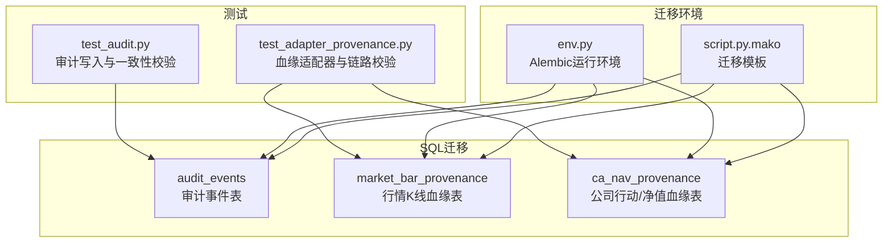
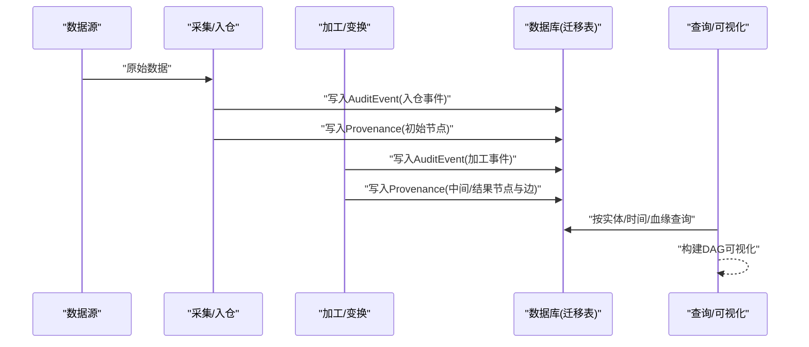
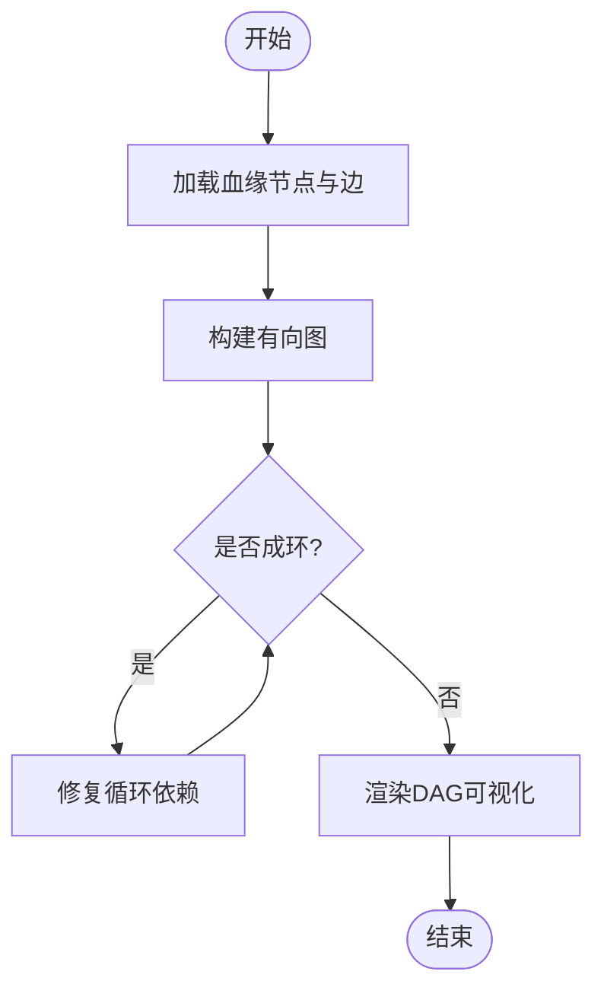
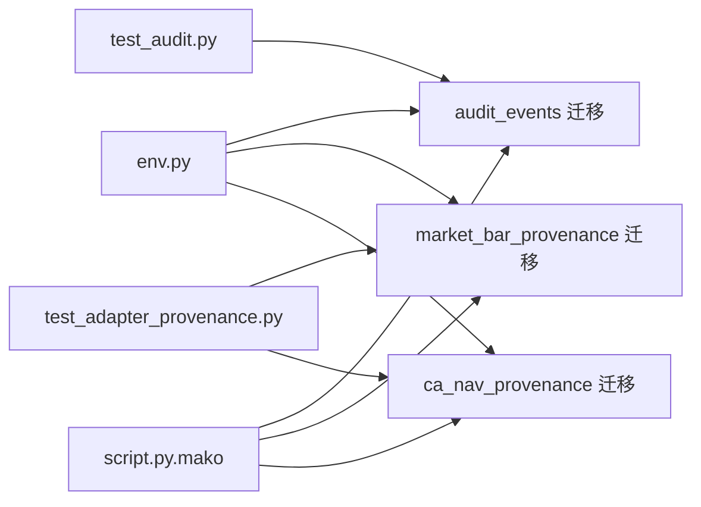

# 审计追踪模型

<cite>
**本文引用的文件**   
- [20260715_0002_audit_events.py](file://sql/migrations/versions/20260715_0002_audit_events.py)
- [20260715_0007_market_bar_provenance.py](file://sql/migrations/versions/20260715_0007_market_bar_provenance.py)
- [20260715_0008_ca_nav_provenance.py](file://sql/migrations/versions/20260715_0008_ca_nav_provenance.py)
- [test_audit.py](file://tests/unit/test_audit.py)
- [test_adapter_provenance.py](file://tests/unit/test_adapter_provenance.py)
- [env.py](file://sql/migrations/env.py)
- [script.py.mako](file://sql/migrations/script.py.mako)
</cite>

## 目录
1. [简介](#简介)
2. [项目结构](#项目结构)
3. [核心组件](#核心组件)
4. [架构总览](#架构总览)
5. [详细组件分析](#详细组件分析)
6. [依赖关系分析](#依赖关系分析)
7. [性能考虑](#性能考虑)
8. [故障排查指南](#故障排查指南)
9. [结论](#结论)
10. [附录](#附录)

## 简介
本文件围绕“审计追踪模型”进行系统化说明，覆盖以下关键主题：
- 审计事件(AuditEvent)表结构与操作日志记录
- 变更追踪与数据血缘(Provenance)设计
- 数据加工过程可视化
- 审计数据的完整性保证、安全存储与访问控制
- 合规性要求、数据保留策略与归档机制
- 审计查询与分析工具使用方法
- 性能优化与大数据量处理策略
- 隐私保护与敏感信息脱敏机制

## 项目结构
本项目采用分层与模块化组织方式。与审计追踪相关的关键位置包括：
- SQL迁移脚本：定义审计事件与血缘表结构
- 单元测试：验证审计写入与血缘链路正确性
- 迁移环境配置：管理数据库版本与迁移执行

图表来源
- [20260715_0002_audit_events.py](file://sql/migrations/versions/20260715_0002_audit_events.py)
- [20260715_0007_market_bar_provenance.py](file://sql/migrations/versions/20260715_0007_market_bar_provenance.py)
- [20260715_0008_ca_nav_provenance.py](file://sql/migrations/versions/20260715_0008_ca_nav_provenance.py)
- [test_audit.py](file://tests/unit/test_audit.py)
- [test_adapter_provenance.py](file://tests/unit/test_adapter_provenance.py)
- [env.py](file://sql/migrations/env.py)
- [script.py.mako](file://sql/migrations/script.py.mako)

章节来源
- [20260715_0002_audit_events.py](file://sql/migrations/versions/20260715_0002_audit_events.py)
- [20260715_0007_market_bar_provenance.py](file://sql/migrations/versions/20260715_0007_market_bar_provenance.py)
- [20260715_0008_ca_nav_provenance.py](file://sql/migrations/versions/20260715_0008_ca_nav_provenance.py)
- [test_audit.py](file://tests/unit/test_audit.py)
- [test_adapter_provenance.py](file://tests/unit/test_adapter_provenance.py)
- [env.py](file://sql/migrations/env.py)
- [script.py.mako](file://sql/migrations/script.py.mako)

## 核心组件
本节聚焦于审计追踪的核心实体与关系：
- 审计事件(AuditEvent)：记录系统内关键操作的不可变日志，包含主体、动作、资源、时间戳、上下文等字段，用于事后追溯与合规检查。
- 血缘(Provenance)：描述数据从源到目标的全链路加工路径，支持对行情K线与基金/公司行动等数据集的溯源。
- 血缘节点与边：以节点表示数据制品或加工步骤，以边表示转换关系，形成有向无环图(DAG)，便于可视化与影响分析。

章节来源
- [20260715_0002_audit_events.py](file://sql/migrations/versions/20260715_0002_audit_events.py)
- [20260715_0007_market_bar_provenance.py](file://sql/migrations/versions/20260715_0007_market_bar_provenance.py)
- [20260715_0008_ca_nav_provenance.py](file://sql/migrations/versions/20260715_0008_ca_nav_provenance.py)

## 架构总览
审计与血缘的整体架构由“采集-加工-落库-可观测”四段组成：
- 采集层：外部数据源进入系统时生成初始血缘节点与审计事件
- 加工层：各ETL/Transform阶段产生新的血缘节点并追加审计事件
- 落库层：通过迁移脚本定义的表结构持久化审计与血缘数据
- 可观测层：基于审计与血缘数据进行查询、分析与可视化

图表来源
- [20260715_0002_audit_events.py](file://sql/migrations/versions/20260715_0002_audit_events.py)
- [20260715_0007_market_bar_provenance.py](file://sql/migrations/versions/20260715_0007_market_bar_provenance.py)
- [20260715_0008_ca_nav_provenance.py](file://sql/migrations/versions/20260715_0008_ca_nav_provenance.py)

## 详细组件分析

### 审计事件(AuditEvent)表结构
- 设计要点
  - 不可变性：每条审计事件为一次只写记录，禁止更新删除，确保可审计性
  - 原子性：与业务事务边界一致，保证审计与业务状态的一致性
  - 索引策略：针对主体、资源、时间范围、事件类型建立合适索引，支撑高效检索
  - 扩展性：使用JSON/文本字段承载上下文，便于后续扩展而不破坏历史
- 典型字段类别（概念性）
  - 标识类：主键、关联ID
  - 主体类：操作者、服务名、租户/域
  - 动作类：事件类型、动作码
  - 资源类：被操作对象、版本、快照摘要
  - 时间类：发生时间、生效时间
  - 上下文类：请求ID、批次号、上游任务、参数摘要
  - 元数据类：来源、签名摘要、校验和
- 完整性与一致性
  - 建议引入唯一约束与幂等键，避免重复写入
  - 建议引入外键或逻辑引用，将审计事件与业务主表关联
  - 建议引入校验字段（如哈希），保障内容不被篡改
- 安全与访问控制
  - 最小权限原则：仅允许写入必要字段
  - 行级/列级权限：对敏感上下文字段做脱敏或隐藏
  - 审计自身审计：对审计表的写入行为也需记录审计事件
- 合规与保留
  - 保留周期：依据法规与内部政策设定不同保留期
  - 归档策略：冷热分层、压缩与离线归档
  - 销毁流程：到期后按审批流执行安全擦除

章节来源
- [20260715_0002_audit_events.py](file://sql/migrations/versions/20260715_0002_audit_events.py)

### 数据血缘(Provenance)设计与可视化
- 设计要点
  - 节点(Node)：表示数据制品或加工产物，具备唯一标识、类型、版本、指纹等属性
  - 边(Edge)：表示加工关系，包含输入节点集合、输出节点、加工函数/任务、参数摘要
  - DAG约束：确保无环，支持拓扑排序与影响面分析
  - 多粒度：既支持细粒度字段级血缘，也支持粗粒度表/分区级血缘
- 典型场景
  - 行情K线血缘：从原始Tick/Bar到标准化K线的加工链
  - 公司行动/净值血缘：从公告/披露到计算结果的加工链
- 可视化
  - 基于节点与边构建DAG图，支持按实体、时间窗口、加工函数筛选
  - 提供回溯与前瞻能力：向上游定位根因，向下游评估影响范围
- 与审计联动
  - 每次加工在写入血缘的同时写入审计事件，实现“谁在何时做了什么导致何种数据变化”的闭环

图表来源
- [20260715_0007_market_bar_provenance.py](file://sql/migrations/versions/20260715_0007_market_bar_provenance.py)
- [20260715_0008_ca_nav_provenance.py](file://sql/migrations/versions/20260715_0008_ca_nav_provenance.py)

章节来源
- [20260715_0007_market_bar_provenance.py](file://sql/migrations/versions/20260715_0007_market_bar_provenance.py)
- [20260715_0008_ca_nav_provenance.py](file://sql/migrations/versions/20260715_0008_ca_nav_provenance.py)

### 数据加工过程可视化
- 可视化维度
  - 实体维度：按标的、产品、资产类别聚合展示血缘
  - 时间维度：按日期/批次/任务执行时间切片
  - 加工维度：按函数/任务/流水线阶段过滤
- 交互能力
  - 点击节点查看上下游、审计事件与质量指标
  - 拖拽缩放、搜索高亮、导出图片/PDF
- 与质量/风险联动
  - 结合数据质量规则与风险指标，在血缘图上标注异常点

[本节为概念性说明，不直接分析具体文件]

### 完整性保证、安全存储与访问控制
- 完整性
  - 幂等写入：通过幂等键避免重复
  - 校验和：对关键上下文与指纹字段计算校验值
  - 事务边界：与业务事务保持一致，失败回滚
- 安全存储
  - 传输加密：TLS端到端
  - 静态加密：磁盘/对象存储加密
  - 密钥管理：集中化密钥管理与轮换
- 访问控制
  - RBAC/ABAC：基于角色/属性的细粒度授权
  - 行列级控制：对敏感字段脱敏或隐藏
  - 审计自身审计：对审计与血缘的访问与修改留痕

[本节为通用实践说明，不直接分析具体文件]

### 合规性要求、数据保留策略与归档机制
- 合规性
  - 满足监管对审计日志不可篡改、可追溯的要求
  - 支持取证导出与证据保全
- 保留策略
  - 分级保留：热/温/冷数据分层
  - 生命周期：自动清理与归档
- 归档机制
  - 批量导出：按时间/实体/任务打包
  - 离线存储：低成本介质长期保存
  - 恢复演练：定期验证归档可用性

[本节为通用实践说明，不直接分析具体文件]

### 审计查询与分析工具使用方法
- 查询入口
  - 基于SQL的直接查询：按时间、实体、事件类型检索
  - 可视化面板：选择维度与过滤器快速浏览
- 常用分析
  - 变更热点：统计高频变更实体与时间段
  - 影响面分析：从某节点出发遍历上下游
  - 异常检测：结合阈值与规则识别异常模式
- 导出与共享
  - 导出CSV/Parquet供离线分析
  - 生成报告用于合规审计

[本节为通用实践说明，不直接分析具体文件]

### 性能优化与大数据量处理策略
- 写入优化
  - 批量写入：合并小事务，减少锁竞争
  - 异步落盘：非关键路径异步持久化
  - 预分片：按时间/实体分区，提升扫描效率
- 查询优化
  - 索引设计：复合索引覆盖常见查询
  - 物化视图：对热点聚合结果预计算
  - 分页与游标：避免一次性拉取大量数据
- 存储优化
  - 列式存储：适合分析型查询
  - 压缩与编码：降低I/O与存储成本
- 监控与容量规划
  - 指标：吞吐、延迟、错误率、空间增长
  - 告警：阈值触发扩容与归档

[本节为通用实践说明，不直接分析具体文件]

### 隐私保护与敏感信息脱敏机制
- 脱敏策略
  - 静态脱敏：入库前替换/掩码敏感字段
  - 动态脱敏：查询时根据权限返回脱敏结果
- 最小化原则
  - 仅记录必要上下文，避免记录明文密码、密钥等
- 合规与同意
  - 遵循数据主体权利与最小必要原则
  - 提供删除与更正通道

[本节为通用实践说明，不直接分析具体文件]

## 依赖关系分析
审计与血缘模块之间的依赖关系如下：
- 迁移脚本定义了审计事件与血缘表结构
- 单元测试验证了审计写入与血缘链路正确性
- 迁移环境负责执行与版本管理

图表来源
- [test_audit.py](file://tests/unit/test_audit.py)
- [test_adapter_provenance.py](file://tests/unit/test_adapter_provenance.py)
- [20260715_0002_audit_events.py](file://sql/migrations/versions/20260715_0002_audit_events.py)
- [20260715_0007_market_bar_provenance.py](file://sql/migrations/versions/20260715_0007_market_bar_provenance.py)
- [20260715_0008_ca_nav_provenance.py](file://sql/migrations/versions/20260715_0008_ca_nav_provenance.py)
- [env.py](file://sql/migrations/env.py)
- [script.py.mako](file://sql/migrations/script.py.mako)

章节来源
- [test_audit.py](file://tests/unit/test_audit.py)
- [test_adapter_provenance.py](file://tests/unit/test_adapter_provenance.py)
- [20260715_0002_audit_events.py](file://sql/migrations/versions/20260715_0002_audit_events.py)
- [20260715_0007_market_bar_provenance.py](file://sql/migrations/versions/20260715_0007_market_bar_provenance.py)
- [20260715_0008_ca_nav_provenance.py](file://sql/migrations/versions/20260715_0008_ca_nav_provenance.py)
- [env.py](file://sql/migrations/env.py)
- [script.py.mako](file://sql/migrations/script.py.mako)

## 性能考虑
- 写入侧
  - 批量化与缓冲：合并多次写入，降低锁与IO开销
  - 幂等与去重：避免重复审计与血缘记录
  - 异步与背压：在高负载下保持稳定性
- 读取侧
  - 索引与分区：按时间与实体分区，配合复合索引
  - 物化与缓存：热点查询结果缓存
  - 分页与增量：避免全表扫描
- 存储侧
  - 压缩与列存：降低空间与I/O
  - 冷热分层：将历史数据转入低成本存储
- 监控与容量
  - 指标看板：吞吐、延迟、错误率、空间增长
  - 容量预警：自动触发归档与扩容

[本节为通用实践说明，不直接分析具体文件]

## 故障排查指南
- 常见问题
  - 迁移失败：检查迁移环境与依赖版本
  - 审计缺失：确认事务边界与幂等键
  - 血缘断裂：检查节点ID与边关系完整性
- 诊断方法
  - 查看迁移日志与错误堆栈
  - 核对审计事件的时间顺序与一致性
  - 校验血缘DAG是否存在环或缺失边
- 恢复策略
  - 回滚至稳定版本并重放必要数据
  - 补录缺失的审计与血缘记录
  - 重新构建血缘图并验证

章节来源
- [env.py](file://sql/migrations/env.py)
- [script.py.mako](file://sql/migrations/script.py.mako)
- [test_audit.py](file://tests/unit/test_audit.py)
- [test_adapter_provenance.py](file://tests/unit/test_adapter_provenance.py)

## 结论
审计追踪模型通过“审计事件+数据血缘”的双轨设计，实现了操作可追溯与数据可溯源的目标。借助合理的表结构设计、严格的完整性与安全控制、完善的保留与归档策略，以及高效的查询与可视化工具，系统能够满足合规与运营需求。未来可在血缘粒度、可视化体验与自动化治理方面持续演进。

[本节为总结性内容，不直接分析具体文件]

## 附录
- 术语
  - 审计事件：记录系统内关键操作的不可变日志
  - 血缘：描述数据从源到目标的加工链路
  - DAG：有向无环图，用于表达血缘关系
- 参考
  - 迁移脚本：定义审计与血缘表结构
  - 单元测试：验证审计与血缘的正确性
  - 迁移环境：管理数据库版本与迁移执行

[本节为补充说明，不直接分析具体文件]