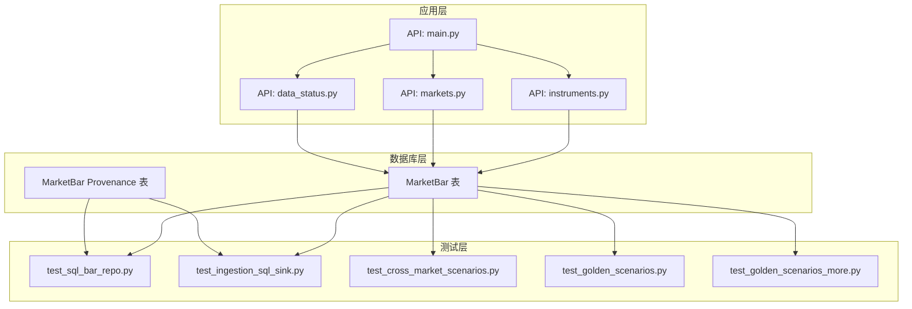
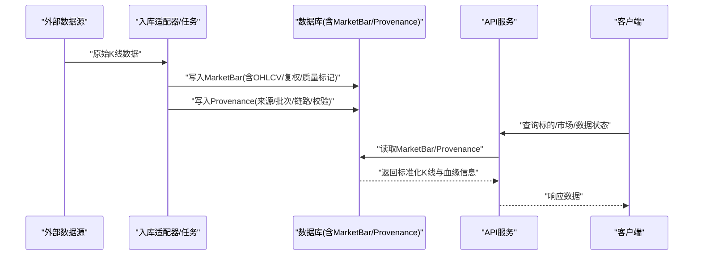
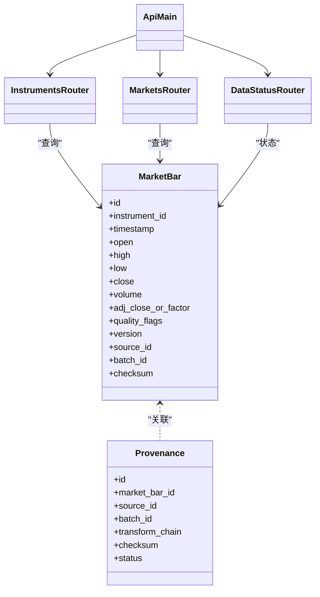

# 市场数据模型

<cite>
**本文引用的文件**   
- [20260715_0003_market_bar.py](file://sql/migrations/versions/20260715_0003_market_bar.py)
- [20260715_0007_market_bar_provenance.py](file://sql/migrations/versions/20260715_0007_market_bar_provenance.py)
- [test_sql_bar_repo.py](file://tests/unit/test_sql_bar_repo.py)
- [test_ingestion_sql_sink.py](file://tests/unit/test_ingestion_sql_sink.py)
- [test_cross_market_scenarios.py](file://tests/unit/test_cross_market_scenarios.py)
- [test_golden_scenarios.py](file://tests/unit/test_golden_scenarios.py)
- [test_golden_scenarios_more.py](file://tests/unit/test_golden_scenarios_more.py)
- [instruments.py](file://apps/api/routers/instruments.py)
- [markets.py](file://apps/api/routers/markets.py)
- [data_status.py](file://apps/api/routers/data_status.py)
- [main.py](file://apps/api/main.py)
</cite>

## 目录
1. [简介](#简介)
2. [项目结构](#项目结构)
3. [核心组件](#核心组件)
4. [架构总览](#架构总览)
5. [详细组件分析](#详细组件分析)
6. [依赖关系分析](#依赖关系分析)
7. [性能考虑](#性能考虑)
8. [故障排查指南](#故障排查指南)
9. [结论](#结论)
10. [附录](#附录)

## 简介
本文件面向“市场数据模型”的完整说明，聚焦于行情K线（MarketBar）表结构、时间序列数据存储设计、多市场统一抽象、OHLCV字段定义与复权处理、数据质量标记、数据血缘追踪（Provenance）、高频数据处理优化与分区策略、批量导入与增量更新最佳实践、一致性保证与冲突解决机制，以及性能调优与存储压缩策略。文档以仓库中的数据库迁移、单元测试与API路由为依据，确保内容与实际实现一致。

## 项目结构
围绕市场数据模型的相关代码主要分布在以下位置：
- 数据库迁移：定义MarketBar主表及Provenance血缘表的DDL与索引
- 单元测试：覆盖SQL写入、去重、回滚、跨市场场景、金标准校验等
- API路由：提供标的、市场、数据状态等查询能力，间接反映数据模型的对外暴露面

图表来源
- [20260715_0003_market_bar.py](file://sql/migrations/versions/20260715_0003_market_bar.py)
- [20260715_0007_market_bar_provenance.py](file://sql/migrations/versions/20260715_0007_market_bar_provenance.py)
- [instruments.py](file://apps/api/routers/instruments.py)
- [markets.py](file://apps/api/routers/markets.py)
- [data_status.py](file://apps/api/routers/data_status.py)
- [main.py](file://apps/api/main.py)
- [test_sql_bar_repo.py](file://tests/unit/test_sql_bar_repo.py)
- [test_ingestion_sql_sink.py](file://tests/unit/test_ingestion_sql_sink.py)
- [test_cross_market_scenarios.py](file://tests/unit/test_cross_market_scenarios.py)
- [test_golden_scenarios.py](file://tests/unit/test_golden_scenarios.py)
- [test_golden_scenarios_more.py](file://tests/unit/test_golden_scenarios_more.py)

章节来源
- [20260715_0003_market_bar.py](file://sql/migrations/versions/20260715_0003_market_bar.py)
- [20260715_0007_market_bar_provenance.py](file://sql/migrations/versions/20260715_0007_market_bar_provenance.py)
- [instruments.py](file://apps/api/routers/instruments.py)
- [markets.py](file://apps/api/routers/markets.py)
- [data_status.py](file://apps/api/routers/data_status.py)
- [main.py](file://apps/api/main.py)
- [test_sql_bar_repo.py](file://tests/unit/test_sql_bar_repo.py)
- [test_ingestion_sql_sink.py](file://tests/unit/test_ingestion_sql_sink.py)
- [test_cross_market_scenarios.py](file://tests/unit/test_cross_market_scenarios.py)
- [test_golden_scenarios.py](file://tests/unit/test_golden_scenarios.py)
- [test_golden_scenarios_more.py](file://tests/unit/test_golden_scenarios_more.py)

## 核心组件
- MarketBar 主表：承载标准化后的K线时序数据，包含标识、时间戳、价格量价字段、复权标志、质量标记、来源与版本等元信息。
- MarketBar Provenance 表：记录每条K线的数据来源、采集批次、转换链路与校验结果，支持可追溯与审计。
- 多市场统一抽象：通过统一的标识与时区/交易日历规则，将不同市场的K线归一化到同一模型。
- OHLCV 字段：Open、High、Low、Close、Volume，配合AdjClose或复权因子进行复权处理。
- 数据质量标记：用于标注缺失、异常、停牌、涨跌停等状态，便于下游过滤与风控。
- 血缘追踪：记录source_id、batch_id、transform_chain、checksum等，支撑问题定位与合规审计。

章节来源
- [20260715_0003_market_bar.py](file://sql/migrations/versions/20260715_0003_market_bar.py)
- [20260715_0007_market_bar_provenance.py](file://sql/migrations/versions/20260715_0007_market_bar_provenance.py)

## 架构总览
下图展示从数据接入到落库与查询的整体流程，体现MarketBar与Provenance的关系，以及API对外暴露的数据访问点。

图表来源
- [20260715_0003_market_bar.py](file://sql/migrations/versions/20260715_0003_market_bar.py)
- [20260715_0007_market_bar_provenance.py](file://sql/migrations/versions/20260715_0007_market_bar_provenance.py)
- [instruments.py](file://apps/api/routers/instruments.py)
- [markets.py](file://apps/api/routers/markets.py)
- [data_status.py](file://apps/api/routers/data_status.py)
- [main.py](file://apps/api/main.py)

## 详细组件分析

### MarketBar 表结构与字段语义
- 标识与时序键
  - 标的标识：跨市场统一ID，结合交易所/市场维度进行区分
  - 时间戳：使用UTC或业务时区的时间点，建议按交易日切片
- OHLCV 字段
  - Open/High/Low/Close/Volume：标准K线五要素
  - AdjClose 或 复权因子：用于前复权/后复权计算与回溯一致性
- 复权处理
  - 支持前复权与后复权两种模式；复权事件来源于公司行为（拆合股、分红等）
  - 复权标志位指示当前行是否已参与复权计算
- 数据质量标记
  - 标记停牌、涨跌停、缺失、异常值、非整点采样等
  - 质量等级可用于下游过滤与风险阈值控制
- 元数据与版本
  - 版本号、来源ID、批次ID、生成时间、校验和等
- 索引与分区
  - 针对标的+时间戳建立复合索引，提升范围查询与最新条检索效率
  - 按时间（如日/周/月）或市场分区，便于冷热分离与归档

章节来源
- [20260715_0003_market_bar.py](file://sql/migrations/versions/20260715_0003_market_bar.py)

### MarketBar Provenance 血缘表
- 目的：为每条K线记录其来源、采集批次、转换链路与校验结果，形成可审计的数据血缘
- 关键字段
  - source_id：数据源唯一标识
  - batch_id：批次号，关联一次批量导入
  - transform_chain：转换步骤序列（如清洗→对齐→复权）
  - checksum：数据指纹，用于一致性比对
  - status：血缘状态（成功/失败/重试）
- 与主表关系
  - 通过外键或逻辑关联与MarketBar主表对应，支持按批次/来源回溯

章节来源
- [20260715_0007_market_bar_provenance.py](file://sql/migrations/versions/20260715_0007_market_bar_provenance.py)

### 多市场统一抽象
- 统一标识：跨市场采用一致的标的ID格式，避免市场间歧义
- 统一时间：基于交易日历与本地时区映射，统一到标准时间轴
- 统一字段：不同市场的差异字段在适配层归一化为OHLCV与质量标记
- 差异化处理：对涨跌停、停牌、集合竞价等市场特性通过质量标记与规则引擎处理

章节来源
- [test_cross_market_scenarios.py](file://tests/unit/test_cross_market_scenarios.py)
- [instruments.py](file://apps/api/routers/instruments.py)
- [markets.py](file://apps/api/routers/markets.py)

### OHLCV 与复权处理
- OHLCV 语义
  - 开盘/最高/最低/收盘/成交量，需满足非空与单调性约束（如High≥Max(Open,Close)）
- 复权处理
  - 前复权：以历史除权日为基准调整历史价格，保持收益连续性
  - 后复权：以初始价格为基准累计调整，便于长期收益可视化
  - 复权事件驱动：由公司行为触发，确保复权前后价格连续性与一致性
- 质量标记联动
  - 复权当日可能产生跳空或零成交，需通过质量标记明确标注

章节来源
- [test_golden_scenarios.py](file://tests/unit/test_golden_scenarios.py)
- [test_golden_scenarios_more.py](file://tests/unit/test_golden_scenarios_more.py)

### 数据质量标记
- 常见标记
  - 停牌、涨跌停、缺失、异常值、非整点采样、复权日
- 用途
  - 上游清洗阶段识别并打标
  - 下游回测/风控阶段过滤或特殊处理
- 校验
  - 通过金标准用例验证标记的正确性与完备性

章节来源
- [test_golden_scenarios.py](file://tests/unit/test_golden_scenarios.py)
- [test_golden_scenarios_more.py](file://tests/unit/test_golden_scenarios_more.py)

### 数据血缘追踪（Provenance）
- 目标：实现端到端可追溯，支持问题定位、合规审计与影响分析
- 关键流程
  - 写入主表的同时写入血缘表，记录source_id、batch_id、transform_chain、checksum
  - 失败重试与幂等：基于batch_id与checksum进行去重与冲突检测
- 查询与分析
  - 按标的+时间窗口回溯血缘，定位异常来源与转换环节

章节来源
- [20260715_0007_market_bar_provenance.py](file://sql/migrations/versions/20260715_0007_market_bar_provenance.py)
- [test_ingestion_sql_sink.py](file://tests/unit/test_ingestion_sql_sink.py)

### 高频数据处理优化与分区策略
- 高频场景
  - 高吞吐写入：批量插入、事务合并、预写日志（WAL）优化
  - 低延迟查询：热点索引、物化视图、缓存层
- 分区策略
  - 按时间（日/周/月）或市场分区，减少扫描范围
  - 冷热分层：近期数据热存，历史数据归档至低成本存储
- 索引设计
  - 复合索引（标的+时间），覆盖常用查询条件
  - 部分索引用于活跃标的或最近N天数据

章节来源
- [test_sql_bar_repo.py](file://tests/unit/test_sql_bar_repo.py)
- [test_ingestion_sql_sink.py](file://tests/unit/test_ingestion_sql_sink.py)

### 批量导入与增量更新最佳实践
- 批量导入
  - 使用事务包裹大批量写入，降低锁竞争
  - 分批提交，控制单批大小，避免长事务
  - 幂等写入：基于唯一键与checksum去重
- 增量更新
  - 基于时间窗口与批次号增量拉取
  - 冲突检测：比较checksum与质量标记，必要时触发重算与回滚
- 回滚与补偿
  - 失败批次保留血缘记录，支持重试与补偿任务

章节来源
- [test_ingestion_sql_sink.py](file://tests/unit/test_ingestion_sql_sink.py)
- [test_sql_bar_repo.py](file://tests/unit/test_sql_bar_repo.py)

### 数据一致性保证与冲突解决
- 一致性
  - 强一致：同批次写入采用原子事务
  - 最终一致：跨源聚合时通过checksum与血缘状态收敛
- 冲突解决
  - 同标的同时段冲突：以权威源优先级或时间戳较新为准
  - 复权冲突：以公司行为事件为准，重新计算复权序列
- 校验
  - 金标准用例覆盖边界场景（停牌、涨跌停、拆合股、分红等）

章节来源
- [test_golden_scenarios.py](file://tests/unit/test_golden_scenarios.py)
- [test_golden_scenarios_more.py](file://tests/unit/test_golden_scenarios_more.py)

### 性能调优与存储压缩
- 性能调优
  - 写入：批量插入、连接池、并行度控制
  - 查询：索引覆盖、分页与投影裁剪、缓存热点数据
- 存储压缩
  - 列式存储与压缩算法选择（如ZSTD/LZ4）
  - 冷热分层与归档策略，降低在线存储成本

章节来源
- [test_sql_bar_repo.py](file://tests/unit/test_sql_bar_repo.py)
- [test_ingestion_sql_sink.py](file://tests/unit/test_ingestion_sql_sink.py)

## 依赖关系分析
MarketBar与Provenance是数据模型的核心，API层通过路由暴露查询能力，测试层覆盖写入、去重、跨市场与金标准场景。

图表来源
- [20260715_0003_market_bar.py](file://sql/migrations/versions/20260715_0003_market_bar.py)
- [20260715_0007_market_bar_provenance.py](file://sql/migrations/versions/20260715_0007_market_bar_provenance.py)
- [instruments.py](file://apps/api/routers/instruments.py)
- [markets.py](file://apps/api/routers/markets.py)
- [data_status.py](file://apps/api/routers/data_status.py)
- [main.py](file://apps/api/main.py)

章节来源
- [20260715_0003_market_bar.py](file://sql/migrations/versions/20260715_0003_market_bar.py)
- [20260715_0007_market_bar_provenance.py](file://sql/migrations/versions/20260715_0007_market_bar_provenance.py)
- [instruments.py](file://apps/api/routers/instruments.py)
- [markets.py](file://apps/api/routers/markets.py)
- [data_status.py](file://apps/api/routers/data_status.py)
- [main.py](file://apps/api/main.py)

## 性能考虑
- 写入路径优化
  - 批量事务与分片提交，避免长事务锁表
  - 预分配索引空间与统计信息更新
- 查询路径优化
  - 热点标的缓存与只读副本
  - 时间范围查询使用分区裁剪
- 存储优化
  - 列式压缩与冷热分层
  - 定期VACUUM/ANALYZE维护

[本节为通用指导，不直接分析具体文件]

## 故障排查指南
- 常见问题
  - 重复写入：检查唯一键与checksum，确认幂等逻辑
  - 复权不一致：核对公司行为事件与复权标志，重算受影响区间
  - 数据缺失：依据质量标记定位缺失时段，补充拉取
- 排查手段
  - 通过Provenance按batch_id与source_id回溯
  - 使用金标准用例对比输出，定位差异点
  - 查看数据状态接口，监控各市场数据完整性

章节来源
- [test_ingestion_sql_sink.py](file://tests/unit/test_ingestion_sql_sink.py)
- [test_golden_scenarios.py](file://tests/unit/test_golden_scenarios.py)
- [data_status.py](file://apps/api/routers/data_status.py)

## 结论
MarketBar与Provenance构成了市场数据模型的核心骨架：前者承载标准化的OHLCV时序数据与复权/质量信息，后者提供端到端的血缘追踪与审计能力。通过多市场统一抽象、严格的去重与冲突解决机制、完善的批量与增量策略，以及性能与存储优化，系统能够在高吞吐与高可靠的前提下支撑量化研究与生产级应用。

[本节为总结性内容，不直接分析具体文件]

## 附录
- 术语
  - OHLCV：开盘/最高/最低/收盘/成交量
  - 复权：前复权/后复权，消除公司行为对价格序列的影响
  - 血缘：数据来源、批次、转换链路与校验结果的记录
- 参考
  - 数据库迁移定义MarketBar与Provenance结构
  - 单元测试覆盖写入、去重、跨市场与金标准场景
  - API路由暴露标的、市场与数据状态查询

[本节为补充信息，不直接分析具体文件]