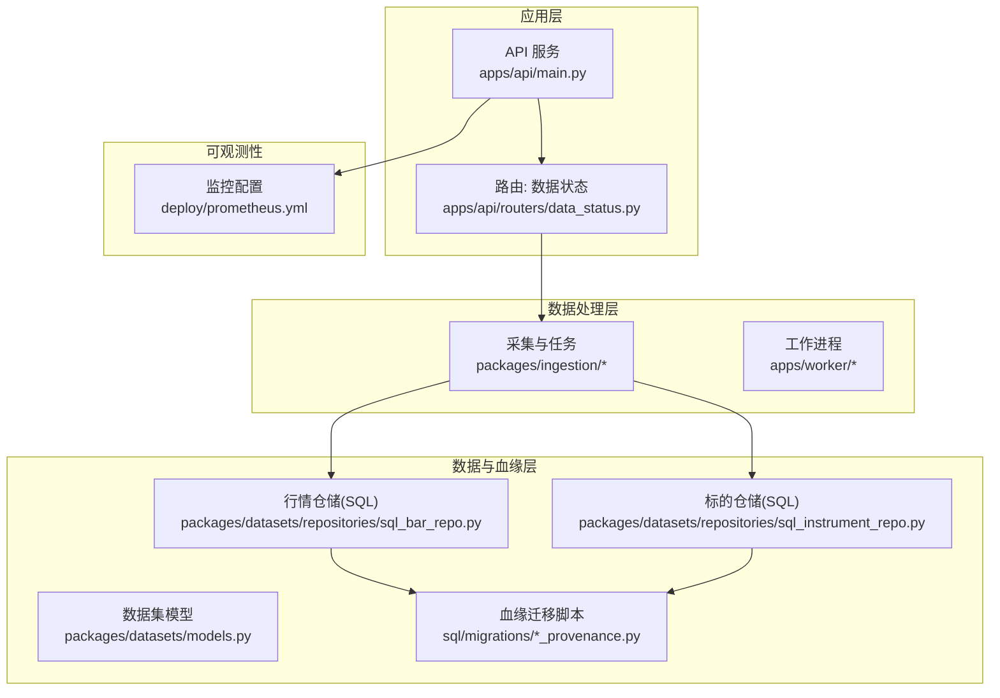
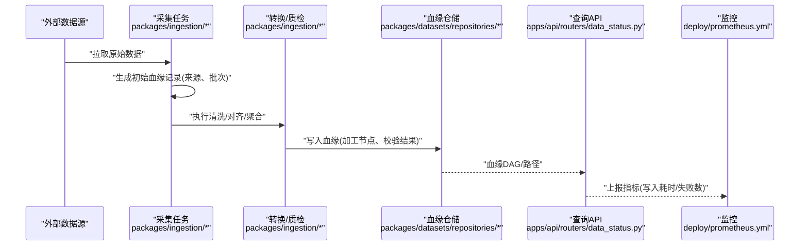
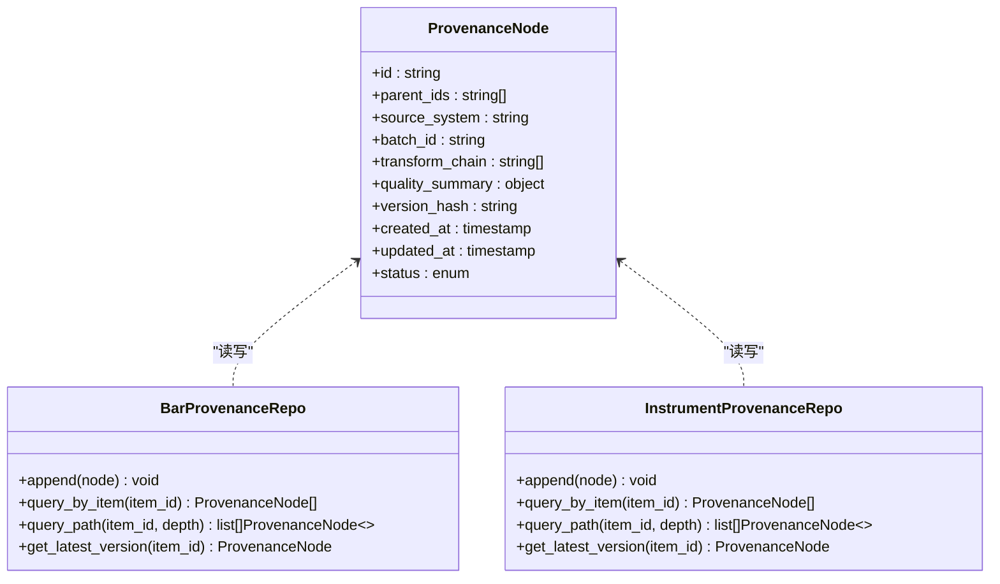
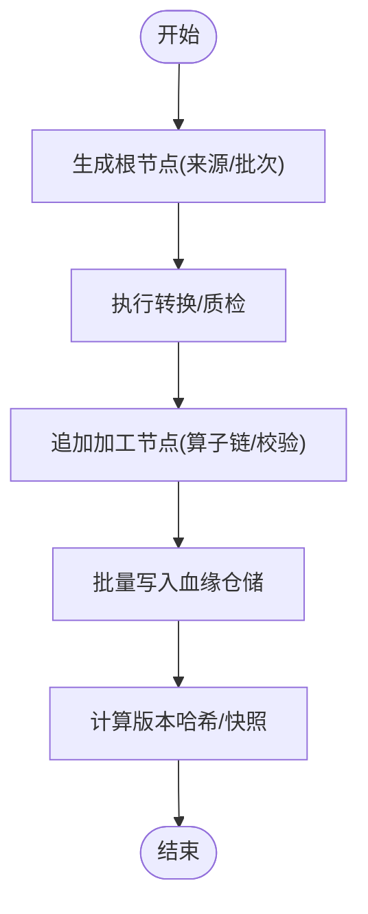
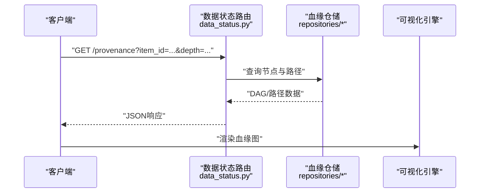
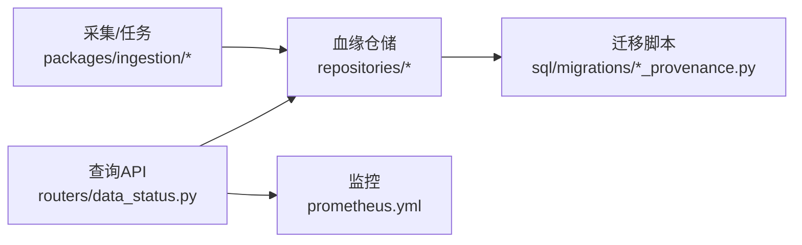

# 数据血缘追踪模型

<cite>
**本文引用的文件**   
- [apps/api/main.py](file://apps/api/main.py)
- [apps/api/routers/data_status.py](file://apps/api/routers/data_status.py)
- [packages/ingestion/__init__.py](file://packages/ingestion/__init__.py)
- [packages/ingestion/tasks.py](file://packages/ingestion/tasks.py)
- [packages/datasets/models.py](file://packages/datasets/models.py)
- [packages/datasets/repositories/sql_bar_repo.py](file://packages/datasets/repositories/sql_bar_repo.py)
- [packages/datasets/repositories/sql_instrument_repo.py](file://packages/datasets/repositories/sql_instrument_repo.py)
- [sql/migrations/20260715_0007_market_bar_provenance.py](file://sql/migrations/20260715_0007_market_bar_provenance.py)
- [sql/migrations/20260715_0008_ca_nav_provenance.py](file://sql/migrations/20260715_0008_ca_nav_provenance.py)
- [tests/unit/test_adapter_provenance.py](file://tests/unit/test_adapter_provenance.py)
- [tests/unit/test_ingestion_sql_sink.py](file://tests/unit/test_ingestion_sql_sink.py)
- [tests/integration/test_e2e_pipeline.py](file://tests/integration/test_e2e_pipeline.py)
- [deploy/prometheus.yml](file://deploy/prometheus.yml)
</cite>

## 目录
1. [简介](#简介)
2. [项目结构](#项目结构)
3. [核心组件](#核心组件)
4. [架构总览](#架构总览)
5. [详细组件分析](#详细组件分析)
6. [依赖关系分析](#依赖关系分析)
7. [性能考量](#性能考量)
8. [故障排查指南](#故障排查指南)
9. [结论](#结论)
10. [附录](#附录)

## 简介
本文件面向“数据血缘追踪(Provenance)”模型，覆盖从数据采集、转换、入库到查询与可视化的全生命周期。文档重点包括：
- 数据来源记录的完整生命周期与追溯链条
- 血缘关系图的构建算法与查询接口
- 数据版本管理与变更历史
- 数据质量评估指标与异常检测规则
- 多源冲突检测与解决策略
- 可视化展示与审计能力
- 溯源查询最佳实践与性能优化建议
- 合规性与监管要求的实现方案

## 项目结构
本项目采用分层与模块化组织方式，API层暴露查询与服务入口，任务调度与Worker负责批处理与增量更新，数据集与仓储层提供持久化与血缘存储，迁移脚本定义血缘相关表结构，测试覆盖适配器、SQL Sink与端到端流程。

图表来源
- [apps/api/main.py](file://apps/api/main.py)
- [apps/api/routers/data_status.py](file://apps/api/routers/data_status.py)
- [packages/ingestion/__init__.py](file://packages/ingestion/__init__.py)
- [packages/ingestion/tasks.py](file://packages/ingestion/tasks.py)
- [packages/datasets/models.py](file://packages/datasets/models.py)
- [packages/datasets/repositories/sql_bar_repo.py](file://packages/datasets/repositories/sql_bar_repo.py)
- [packages/datasets/repositories/sql_instrument_repo.py](file://packages/datasets/repositories/sql_instrument_repo.py)
- [sql/migrations/20260715_0007_market_bar_provenance.py](file://sql/migrations/20260715_0007_market_bar_provenance.py)
- [sql/migrations/20260715_0008_ca_nav_provenance.py](file://sql/migrations/20260715_0008_ca_nav_provenance.py)
- [deploy/prometheus.yml](file://deploy/prometheus.yml)

章节来源
- [apps/api/main.py](file://apps/api/main.py)
- [apps/api/routers/data_status.py](file://apps/api/routers/data_status.py)
- [packages/ingestion/__init__.py](file://packages/ingestion/__init__.py)
- [packages/ingestion/tasks.py](file://packages/ingestion/tasks.py)
- [packages/datasets/models.py](file://packages/datasets/models.py)
- [packages/datasets/repositories/sql_bar_repo.py](file://packages/datasets/repositories/sql_bar_repo.py)
- [packages/datasets/repositories/sql_instrument_repo.py](file://packages/datasets/repositories/sql_instrument_repo.py)
- [sql/migrations/20260715_0007_market_bar_provenance.py](file://sql/migrations/20260715_0007_market_bar_provenance.py)
- [sql/migrations/20260715_0008_ca_nav_provenance.py](file://sql/migrations/20260715_0008_ca_nav_provenance.py)
- [deploy/prometheus.yml](file://deploy/prometheus.yml)

## 核心组件
- 血缘实体与模型
  - 用于描述数据项与其来源、加工过程、时间戳、版本等元数据的结构化定义。
  - 典型字段包括：唯一标识、父级血缘ID、来源系统、采集批次、加工算子链、校验结果、版本哈希、创建/更新时间等。
- 血缘仓储
  - 基于SQL的持久化实现，提供插入、追加、按维度检索、回溯路径查询等能力。
  - 针对行情与公司行动/净值等场景分别建模，确保不同数据域的血缘一致性。
- 采集与任务编排
  - 在采集阶段生成并写入血缘记录；在转换与落库阶段追加加工节点信息。
- 查询与可视化
  - 通过API暴露血缘查询接口，支持按数据项、时间窗口、来源系统、版本等条件检索，返回有向无环图(DAG)或路径列表。
- 监控与审计
  - 结合Prometheus等工具采集关键指标（如血缘写入延迟、失败率），配合审计事件记录关键操作。

章节来源
- [packages/datasets/models.py](file://packages/datasets/models.py)
- [packages/datasets/repositories/sql_bar_repo.py](file://packages/datasets/repositories/sql_bar_repo.py)
- [packages/datasets/repositories/sql_instrument_repo.py](file://packages/datasets/repositories/sql_instrument_repo.py)
- [packages/ingestion/__init__.py](file://packages/ingestion/__init__.py)
- [packages/ingestion/tasks.py](file://packages/ingestion/tasks.py)
- [sql/migrations/20260715_0007_market_bar_provenance.py](file://sql/migrations/20260715_0007_market_bar_provenance.py)
- [sql/migrations/20260715_0008_ca_nav_provenance.py](file://sql/migrations/20260715_0008_ca_nav_provenance.py)

## 架构总览
下图展示了从外部数据源到最终存储的血缘链路，以及查询与监控的交互。

图表来源
- [packages/ingestion/__init__.py](file://packages/ingestion/__init__.py)
- [packages/ingestion/tasks.py](file://packages/ingestion/tasks.py)
- [packages/datasets/repositories/sql_bar_repo.py](file://packages/datasets/repositories/sql_bar_repo.py)
- [packages/datasets/repositories/sql_instrument_repo.py](file://packages/datasets/repositories/sql_instrument_repo.py)
- [apps/api/routers/data_status.py](file://apps/api/routers/data_status.py)
- [deploy/prometheus.yml](file://deploy/prometheus.yml)

## 详细组件分析

### 血缘模型与数据库设计
- 模型要点
  - 以“数据项”为节点，以“来源/加工”为边，形成DAG。
  - 关键字段：数据项ID、父ID集合、来源系统、采集批次、加工算子链、校验摘要、版本哈希、时间戳、状态。
- 迁移与表结构
  - 针对行情与基金/公司行动等场景分别维护血缘表，保证领域语义清晰与查询高效。
- 版本管理
  - 使用内容哈希或版本号标记同一逻辑实体的不同快照，支持回滚与对比。

图表来源
- [packages/datasets/models.py](file://packages/datasets/models.py)
- [packages/datasets/repositories/sql_bar_repo.py](file://packages/datasets/repositories/sql_bar_repo.py)
- [packages/datasets/repositories/sql_instrument_repo.py](file://packages/datasets/repositories/sql_instrument_repo.py)
- [sql/migrations/20260715_0007_market_bar_provenance.py](file://sql/migrations/20260715_0007_market_bar_provenance.py)
- [sql/migrations/20260715_0008_ca_nav_provenance.py](file://sql/migrations/20260715_0008_ca_nav_provenance.py)

章节来源
- [packages/datasets/models.py](file://packages/datasets/models.py)
- [packages/datasets/repositories/sql_bar_repo.py](file://packages/datasets/repositories/sql_bar_repo.py)
- [packages/datasets/repositories/sql_instrument_repo.py](file://packages/datasets/repositories/sql_instrument_repo.py)
- [sql/migrations/20260715_0007_market_bar_provenance.py](file://sql/migrations/20260715_0007_market_bar_provenance.py)
- [sql/migrations/20260715_0008_ca_nav_provenance.py](file://sql/migrations/20260715_0008_ca_nav_provenance.py)

### 血缘写入与生命周期
- 采集阶段
  - 生成初始血缘节点，记录来源系统与采集批次，建立根节点。
- 转换阶段
  - 对每个加工步骤追加节点，记录算子名称、参数摘要、输入输出映射。
- 入库阶段
  - 将血缘节点批量写入仓储，确保事务一致性与幂等性。
- 版本与快照
  - 每次落库生成版本哈希，保留历史快照，支持差异对比与回滚。

图表来源
- [packages/ingestion/__init__.py](file://packages/ingestion/__init__.py)
- [packages/ingestion/tasks.py](file://packages/ingestion/tasks.py)
- [packages/datasets/repositories/sql_bar_repo.py](file://packages/datasets/repositories/sql_bar_repo.py)
- [packages/datasets/repositories/sql_instrument_repo.py](file://packages/datasets/repositories/sql_instrument_repo.py)

章节来源
- [packages/ingestion/__init__.py](file://packages/ingestion/__init__.py)
- [packages/ingestion/tasks.py](file://packages/ingestion/tasks.py)
- [packages/datasets/repositories/sql_bar_repo.py](file://packages/datasets/repositories/sql_bar_repo.py)
- [packages/datasets/repositories/sql_instrument_repo.py](file://packages/datasets/repositories/sql_instrument_repo.py)

### 血缘查询与可视化
- 查询接口
  - 支持按数据项ID、时间范围、来源系统、版本等条件检索。
  - 返回DAG节点与边，或指定深度的祖先/后代路径。
- 可视化
  - 前端渲染DAG，支持展开/折叠、高亮关键路径、过滤低质量节点。
- 审计
  - 记录关键查询与导出操作，便于合规审计。

图表来源
- [apps/api/routers/data_status.py](file://apps/api/routers/data_status.py)
- [packages/datasets/repositories/sql_bar_repo.py](file://packages/datasets/repositories/sql_bar_repo.py)
- [packages/datasets/repositories/sql_instrument_repo.py](file://packages/datasets/repositories/sql_instrument_repo.py)

章节来源
- [apps/api/routers/data_status.py](file://apps/api/routers/data_status.py)
- [packages/datasets/repositories/sql_bar_repo.py](file://packages/datasets/repositories/sql_bar_repo.py)
- [packages/datasets/repositories/sql_instrument_repo.py](file://packages/datasets/repositories/sql_instrument_repo.py)

### 数据版本管理与变更历史
- 版本策略
  - 基于内容哈希的版本号，确保相同数据产生相同版本标识。
  - 支持同物多版并存，便于对比与回滚。
- 变更历史
  - 每次写入新增一条版本记录，保留完整变更轨迹。
- 一致性保障
  - 写入时进行幂等检查，避免重复版本。

章节来源
- [packages/datasets/models.py](file://packages/datasets/models.py)
- [packages/datasets/repositories/sql_bar_repo.py](file://packages/datasets/repositories/sql_bar_repo.py)
- [packages/datasets/repositories/sql_instrument_repo.py](file://packages/datasets/repositories/sql_instrument_repo.py)

### 数据质量评估与异常检测
- 质量指标
  - 完整性(缺失比例)、准确性(与基准/阈值比较)、时效性(延迟)、一致性(跨源比对)。
- 异常检测
  - 规则引擎：阈值、分布漂移、跳变检测。
  - 统计方法：Z-Score、IQR、滑动窗口异常。
- 质量标签
  - 在血缘节点中记录质量摘要与异常类型，便于筛选与告警。

章节来源
- [packages/ingestion/tasks.py](file://packages/ingestion/tasks.py)
- [packages/datasets/models.py](file://packages/datasets/models.py)

### 多源冲突检测与解决策略
- 冲突检测
  - 同物多源数据比对，识别数值差异、时间错位、口径不一致。
- 解决策略
  - 优先级策略：按来源可信度排序选择主源。
  - 合并策略：加权平均、最近值优先、人工确认。
  - 冲突记录：在血缘中标注冲突类型与处理方式，保留决策依据。

章节来源
- [packages/ingestion/tasks.py](file://packages/ingestion/tasks.py)
- [packages/datasets/models.py](file://packages/datasets/models.py)

### 可视化与审计功能
- 可视化
  - DAG渲染、路径高亮、节点详情面板、质量状态着色。
- 审计
  - 记录用户查询、导出、版本切换等操作，关联血缘上下文。
- 监控
  - 通过Prometheus采集写入延迟、失败率、查询耗时等指标。

章节来源
- [apps/api/routers/data_status.py](file://apps/api/routers/data_status.py)
- [deploy/prometheus.yml](file://deploy/prometheus.yml)

## 依赖关系分析
- 模块耦合
  - 采集与任务模块依赖血缘仓储接口；仓储模块依赖迁移定义的表结构。
  - API路由依赖仓储查询能力，向上游提供血缘视图。
- 外部依赖
  - 数据库驱动、ORM/SQL构建器、监控采集器。
- 潜在循环依赖
  - 应避免仓储直接依赖采集任务，保持单向依赖。

图表来源
- [packages/ingestion/__init__.py](file://packages/ingestion/__init__.py)
- [packages/ingestion/tasks.py](file://packages/ingestion/tasks.py)
- [packages/datasets/repositories/sql_bar_repo.py](file://packages/datasets/repositories/sql_bar_repo.py)
- [packages/datasets/repositories/sql_instrument_repo.py](file://packages/datasets/repositories/sql_instrument_repo.py)
- [sql/migrations/20260715_0007_market_bar_provenance.py](file://sql/migrations/20260715_0007_market_bar_provenance.py)
- [sql/migrations/20260715_0008_ca_nav_provenance.py](file://sql/migrations/20260715_0008_ca_nav_provenance.py)
- [apps/api/routers/data_status.py](file://apps/api/routers/data_status.py)
- [deploy/prometheus.yml](file://deploy/prometheus.yml)

章节来源
- [packages/ingestion/__init__.py](file://packages/ingestion/__init__.py)
- [packages/ingestion/tasks.py](file://packages/ingestion/tasks.py)
- [packages/datasets/repositories/sql_bar_repo.py](file://packages/datasets/repositories/sql_bar_repo.py)
- [packages/datasets/repositories/sql_instrument_repo.py](file://packages/datasets/repositories/sql_instrument_repo.py)
- [sql/migrations/20260715_0007_market_bar_provenance.py](file://sql/migrations/20260715_0007_market_bar_provenance.py)
- [sql/migrations/20260715_0008_ca_nav_provenance.py](file://sql/migrations/20260715_0008_ca_nav_provenance.py)
- [apps/api/routers/data_status.py](file://apps/api/routers/data_status.py)
- [deploy/prometheus.yml](file://deploy/prometheus.yml)

## 性能考量
- 写入优化
  - 批量写入与事务合并，减少锁竞争与网络往返。
  - 索引设计：按数据项ID、时间戳、来源系统、版本哈希建复合索引。
- 查询优化
  - 限制深度与返回规模，分页与游标式遍历。
  - 缓存热点路径与常用DAG片段。
- 监控与告警
  - 采集写入延迟、失败率、慢查询，设置阈值告警。

[本节为通用指导，不直接分析具体文件]

## 故障排查指南
- 常见问题
  - 血缘写入失败：检查仓储连接、事务提交、幂等键冲突。
  - 查询超时：检查索引是否命中、返回规模是否过大。
  - 版本不一致：核对内容哈希计算逻辑与并发写入顺序。
- 定位手段
  - 查看监控指标与日志，定位失败节点与路径。
  - 使用单元测试与集成测试用例复现问题。

章节来源
- [tests/unit/test_adapter_provenance.py](file://tests/unit/test_adapter_provenance.py)
- [tests/unit/test_ingestion_sql_sink.py](file://tests/unit/test_ingestion_sql_sink.py)
- [tests/integration/test_e2e_pipeline.py](file://tests/integration/test_e2e_pipeline.py)

## 结论
本模型以“数据项+血缘边”为核心，贯穿采集、转换、入库全流程，提供完整的追溯能力。通过版本化与质量标签，支撑变更历史与合规审计；借助查询接口与可视化，提升可解释性与运维效率。建议在工程实践中持续完善索引与缓存策略，强化监控与告警，确保在高吞吐与复杂血缘下的稳定表现。

[本节为总结性内容，不直接分析具体文件]

## 附录
- 合规与监管
  - 数据留存策略：按法规要求保留血缘与审计日志的最小周期。
  - 访问控制：最小权限原则，敏感操作需二次确认与审计。
  - 报告导出：支持按监管模板导出血缘与质量报告。
- 最佳实践
  - 统一ID规范与命名约定，确保跨系统可关联。
  - 明确血缘粒度：行级/批次级/任务级，权衡精度与性能。
  - 定期演练回滚与恢复流程，验证版本与血缘一致性。

[本节为概念性内容，不直接分析具体文件]