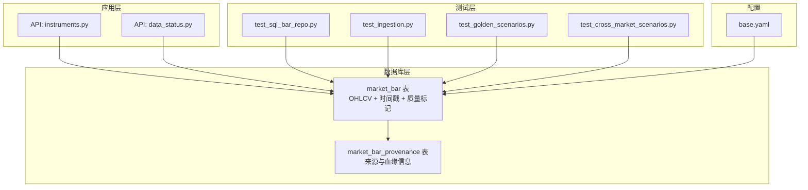
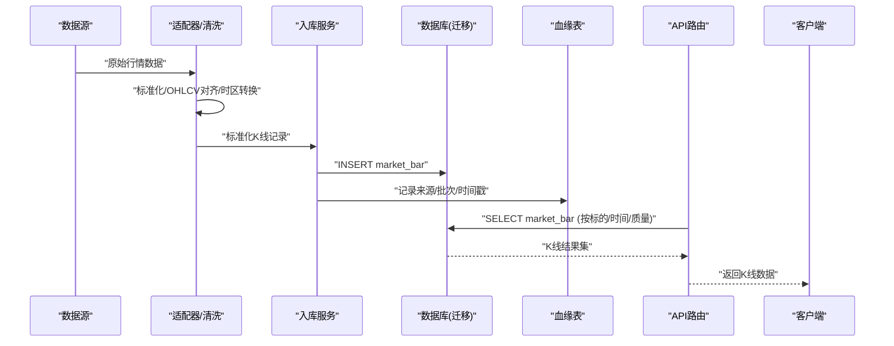
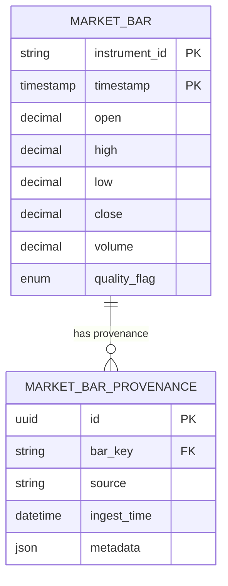
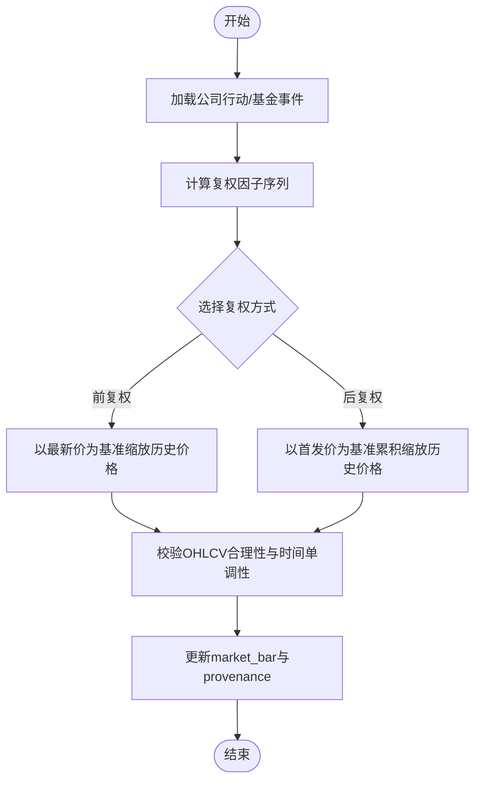
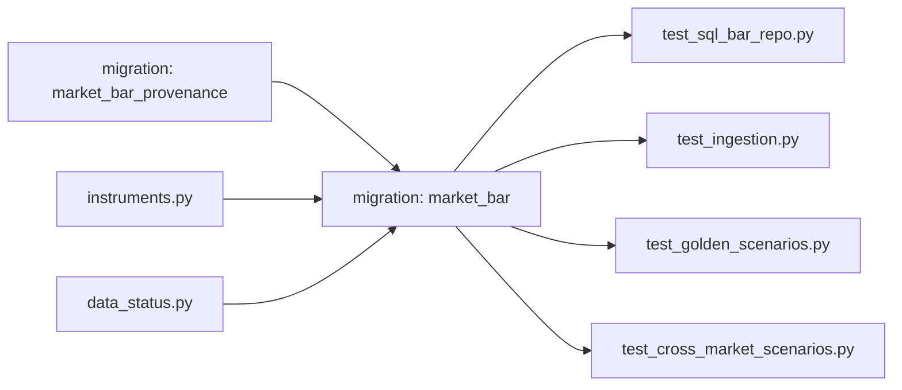

# 行情K线数据模型

<cite>
**本文引用的文件**   
- [20260715_0003_market_bar.py](file://sql/migrations/versions/20260715_0003_market_bar.py)
- [20260715_0007_market_bar_provenance.py](file://sql/migrations/versions/20260715_0007_market_bar_provenance.py)
- [test_sql_bar_repo.py](file://tests/unit/test_sql_bar_repo.py)
- [test_ingestion.py](file://tests/unit/test_ingestion.py)
- [test_golden_scenarios.py](file://tests/unit/test_golden_scenarios.py)
- [test_cross_market_scenarios.py](file://tests/unit/test_cross_market_scenarios.py)
- [instruments.py](file://apps/api/routers/instruments.py)
- [data_status.py](file://apps/api/routers/data_status.py)
- [base.yaml](file://configs/base.yaml)
</cite>

## 目录
1. [简介](#简介)
2. [项目结构](#项目结构)
3. [核心组件](#核心组件)
4. [架构总览](#架构总览)
5. [详细组件分析](#详细组件分析)
6. [依赖关系分析](#依赖关系分析)
7. [性能考虑](#性能考虑)
8. [故障排查指南](#故障排查指南)
9. [结论](#结论)
10. [附录](#附录)

## 简介
本文件围绕MarketBar（行情K线）数据模型进行系统化说明，覆盖字段定义、时间与时区、复权处理、数据质量标记、多市场统一抽象、高频数据存储优化与分区策略，以及批量导入的性能优化建议。文档以数据库迁移与测试用例为依据，确保描述与实现一致。

## 项目结构
与MarketBar相关的代码主要分布在以下位置：
- 数据库迁移：定义表结构与索引、约束与分区策略
- 单元测试：验证入库、查询、跨市场场景与数据质量
- API路由：提供标的信息与数据状态接口，间接体现MarketBar的使用方式
- 配置：基础配置项可能影响时区、精度等全局行为

图表来源
- [20260715_0003_market_bar.py](file://sql/migrations/versions/20260715_0003_market_bar.py)
- [20260715_0007_market_bar_provenance.py](file://sql/migrations/versions/20260715_0007_market_bar_provenance.py)
- [instruments.py](file://apps/api/routers/instruments.py)
- [data_status.py](file://apps/api/routers/data_status.py)
- [test_sql_bar_repo.py](file://tests/unit/test_sql_bar_repo.py)
- [test_ingestion.py](file://tests/unit/test_ingestion.py)
- [test_golden_scenarios.py](file://tests/unit/test_golden_scenarios.py)
- [test_cross_market_scenarios.py](file://tests/unit/test_cross_market_scenarios.py)
- [base.yaml](file://configs/base.yaml)

章节来源
- [20260715_0003_market_bar.py](file://sql/migrations/versions/20260715_0003_market_bar.py)
- [20260715_0007_market_bar_provenance.py](file://sql/migrations/versions/20260715_0007_market_bar_provenance.py)
- [instruments.py](file://apps/api/routers/instruments.py)
- [data_status.py](file://apps/api/routers/data_status.py)
- [test_sql_bar_repo.py](file://tests/unit/test_sql_bar_repo.py)
- [test_ingestion.py](file://tests/unit/test_ingestion.py)
- [test_golden_scenarios.py](file://tests/unit/test_golden_scenarios.py)
- [test_cross_market_scenarios.py](file://tests/unit/test_cross_market_scenarios.py)
- [base.yaml](file://configs/base.yaml)

## 核心组件
本节聚焦MarketBar的核心字段与语义，结合迁移与测试用例进行说明。

- OHLCV字段
  - 开盘价（open）、最高价（high）、最低价（low）、收盘价（close）：表示该K线周期内的价格边界与结算价，用于计算技术指标与收益。
  - 成交量（volume）：该K线周期内的成交数量或金额（依业务约定），用于衡量流动性与活跃度。
  - 数据类型与精度：由数据库迁移定义，通常采用高精度数值类型以保证价格与成交量的准确性；具体精度需参考迁移文件中的列定义。
  - 业务含义：四价一量构成标准K线，是量化研究、回测与实盘的基础单元。

- 时间戳字段
  - 时区：建议使用UTC存储，避免夏令时与跨时区歧义；展示与写入时可转换为本地时区。
  - 精度：毫秒级或更高精度以满足高频需求；若使用整数秒或纳秒，需与上游源保持一致并记录在血缘表中。
  - 一致性：同一标的在同一交易日的多个K线应严格单调递增且无重叠。

- 数据质量标记
  - 用途：标识单条K线的可信度与完整性，如“正常”、“缺失”、“异常”、“待修正”等。
  - 状态值：由系统枚举或字符串集定义，便于过滤与告警。
  - 使用方式：在查询与分析中按质量标记过滤，仅对高质量数据进行建模与回测。

- 多市场统一抽象
  - 统一字段：A股、美股、基金等不同市场均映射到统一的OHLCV与时间戳结构。
  - 差异化处理：交易日历、涨跌停、停牌、分红拆股、基金净值截止日等特殊规则通过适配层与事件表（如公司行动、基金相关事件）驱动，保证统一模型的兼容性。

章节来源
- [20260715_0003_market_bar.py](file://sql/migrations/versions/20260715_0003_market_bar.py)
- [test_sql_bar_repo.py](file://tests/unit/test_sql_bar_repo.py)
- [test_cross_market_scenarios.py](file://tests/unit/test_cross_market_scenarios.py)

## 架构总览
下图展示了MarketBar从数据接入、校验、入库到查询的端到端流程，以及与血缘表的关联。

图表来源
- [20260715_0003_market_bar.py](file://sql/migrations/versions/20260715_0003_market_bar.py)
- [20260715_0007_market_bar_provenance.py](file://sql/migrations/versions/20260715_0007_market_bar_provenance.py)
- [test_ingestion.py](file://tests/unit/test_ingestion.py)
- [instruments.py](file://apps/api/routers/instruments.py)
- [data_status.py](file://apps/api/routers/data_status.py)

## 详细组件分析

### MarketBar表结构与字段规范
- 主键与唯一性
  - 典型设计为（instrument_id, timestamp）唯一，确保同一标的同一时刻仅一条K线。
- 价格与成交量
  - open/high/low/close/volume为非负数，且满足 high ≥ max(open, close)、low ≤ min(open, close) 的合理性约束。
- 时间与时区
  - 建议以UTC存储，配合provenance记录本地时间与来源时区偏移。
- 质量标记
  - 使用枚举或字符串集合，支持“正常/缺失/异常/待修正”等状态。
- 索引与分区
  - 针对instrument_id与timestamp建立复合索引；高频场景可按天或周分区以提升查询与归档效率。

图表来源
- [20260715_0003_market_bar.py](file://sql/migrations/versions/20260715_0003_market_bar.py)
- [20260715_0007_market_bar_provenance.py](file://sql/migrations/versions/20260715_0007_market_bar_provenance.py)

章节来源
- [20260715_0003_market_bar.py](file://sql/migrations/versions/20260715_0003_market_bar.py)
- [20260715_0007_market_bar_provenance.py](file://sql/migrations/versions/20260715_0007_market_bar_provenance.py)

### 复权处理机制（前复权与后复权）
- 触发条件
  - 基于公司行动（如分红、拆合股）与基金事件（如净值截止、赎回）调整历史价格序列。
- 前复权逻辑
  - 以最新价格为基准，将历史价格按复权因子等比缩放，保持当前价格不变，历史走势相对连续。
- 后复权逻辑
  - 以首发价格为基准，将后续价格按复权因子累积缩放，反映长期累计回报。
- 实现要点
  - 复权因子来源于公司行动与基金事件表；对受影响标的的历史K线进行批量重算。
  - 复权过程需维护版本与血缘，确保可追溯与可回滚。
  - 复权后的数据仍遵循OHLCV合理性与时间单调性约束。

图表来源
- [20260715_0003_market_bar.py](file://sql/migrations/versions/20260715_0003_market_bar.py)
- [20260715_0007_market_bar_provenance.py](file://sql/migrations/versions/20260715_0007_market_bar_provenance.py)
- [test_golden_scenarios.py](file://tests/unit/test_golden_scenarios.py)

章节来源
- [test_golden_scenarios.py](file://tests/unit/test_golden_scenarios.py)
- [20260715_0003_market_bar.py](file://sql/migrations/versions/20260715_0003_market_bar.py)
- [20260715_0007_market_bar_provenance.py](file://sql/migrations/versions/20260715_0007_market_bar_provenance.py)

### 数据质量标记使用方法
- 状态值
  - 常见包括“正常”、“缺失”、“异常”、“待修正”等，具体以系统定义为准。
- 使用建议
  - 在研究与回测中默认仅使用“正常”标记的数据；对“缺失/异常”数据触发补录或人工复核。
  - 在报表与监控中统计各质量标记占比，设置阈值告警。
- 审计与溯源
  - 结合provenance记录质量判定依据与修正历史，确保可追溯。

章节来源
- [20260715_0003_market_bar.py](file://sql/migrations/versions/20260715_0003_market_bar.py)
- [20260715_0007_market_bar_provenance.py](file://sql/migrations/versions/20260715_0007_market_bar_provenance.py)
- [test_sql_bar_repo.py](file://tests/unit/test_sql_bar_repo.py)

### 多市场统一抽象（A股、美股、基金）
- 统一模型
  - 所有市场均映射至统一的instrument_id、timestamp与OHLCV结构。
- 特殊处理
  - A股：停牌、涨跌停、T+1交收等规则在适配层处理，不影响统一模型。
  - 美股：夏令时切换、早收盘等在时间标准化阶段处理。
  - 基金：净值截止日、申赎等事件驱动复权与净值对齐。
- 测试覆盖
  - 通过跨市场场景与金样本用例验证不同市场的兼容性与正确性。

章节来源
- [test_cross_market_scenarios.py](file://tests/unit/test_cross_market_scenarios.py)
- [test_golden_scenarios.py](file://tests/unit/test_golden_scenarios.py)
- [instruments.py](file://apps/api/routers/instruments.py)

## 依赖关系分析
MarketBar的依赖关系主要体现在数据库迁移、测试与API之间：
- 迁移文件定义表结构与约束，是数据模型权威来源
- 测试用例验证入库、查询、跨市场与复权逻辑
- API路由暴露标的与数据状态能力，间接依赖MarketBar

图表来源
- [20260715_0003_market_bar.py](file://sql/migrations/versions/20260715_0003_market_bar.py)
- [20260715_0007_market_bar_provenance.py](file://sql/migrations/versions/20260715_0007_market_bar_provenance.py)
- [test_sql_bar_repo.py](file://tests/unit/test_sql_bar_repo.py)
- [test_ingestion.py](file://tests/unit/test_ingestion.py)
- [test_golden_scenarios.py](file://tests/unit/test_golden_scenarios.py)
- [test_cross_market_scenarios.py](file://tests/unit/test_cross_market_scenarios.py)
- [instruments.py](file://apps/api/routers/instruments.py)
- [data_status.py](file://apps/api/routers/data_status.py)

章节来源
- [20260715_0003_market_bar.py](file://sql/migrations/versions/20260715_0003_market_bar.py)
- [20260715_0007_market_bar_provenance.py](file://sql/migrations/versions/20260715_0007_market_bar_provenance.py)
- [test_sql_bar_repo.py](file://tests/unit/test_sql_bar_repo.py)
- [test_ingestion.py](file://tests/unit/test_ingestion.py)
- [test_golden_scenarios.py](file://tests/unit/test_golden_scenarios.py)
- [test_cross_market_scenarios.py](file://tests/unit/test_cross_market_scenarios.py)
- [instruments.py](file://apps/api/routers/instruments.py)
- [data_status.py](file://apps/api/routers/data_status.py)

## 性能考虑
- 存储与索引
  - 为（instrument_id, timestamp）建立复合索引，提升按标的与时间的范围查询性能。
  - 对quality_flag建立索引以支持快速过滤高质量数据。
- 分区策略
  - 按天或周对market_bar进行分区，减少扫描范围，提高归档与清理效率。
  - 高频数据优先按时间分区，热点标的可通过局部索引或物化视图加速。
- 批量导入优化
  - 使用批量插入与事务合并，减少网络往返与锁竞争。
  - 导入前关闭非必要索引，导入后再重建索引。
  - 控制并发写入，避免热点行冲突；必要时分片写入。
- 查询优化
  - 限定时间窗口与标的列表，避免全表扫描。
  - 对常用聚合（如日频统计）建立物化视图或汇总表。

[本节为通用性能建议，不直接分析具体文件]

## 故障排查指南
- 数据缺失与重复
  - 检查provenance记录的批次与时间戳，确认是否漏批或重复入库。
  - 核对唯一约束（instrument_id, timestamp）是否被违反。
- 价格不合理
  - 校验high/low与open/close的关系；定位异常标的与时间段。
- 复权不一致
  - 对比复权前后数据差异，检查公司行动与基金事件是否正确加载。
- 时区问题
  - 确认存储时区为UTC，展示层转换正确；检查夏令时切换导致的跳变。
- 质量标记异常
  - 统计各标记比例，定位异常来源与修复路径。

章节来源
- [20260715_0007_market_bar_provenance.py](file://sql/migrations/versions/20260715_0007_market_bar_provenance.py)
- [test_ingestion.py](file://tests/unit/test_ingestion.py)
- [test_sql_bar_repo.py](file://tests/unit/test_sql_bar_repo.py)

## 结论
MarketBar以统一模型承载多市场K线数据，通过严谨的字段定义、时区与精度规范、复权机制与质量标记，保障数据的一致性与可用性。结合合理的索引与分区策略，以及批量导入优化，可在高频与大规模场景下保持稳定性能。血缘表为数据治理与审计提供了坚实基础。

[本节为总结性内容，不直接分析具体文件]

## 附录
- 配置参考
  - base.yaml中可能包含与时间、精度、日志等相关的全局配置项，实际使用时请对照仓库配置说明。

章节来源
- [base.yaml](file://configs/base.yaml)