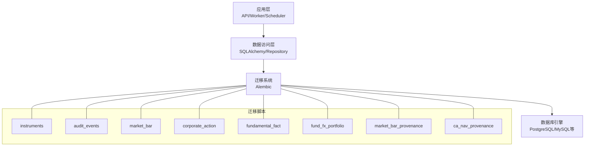
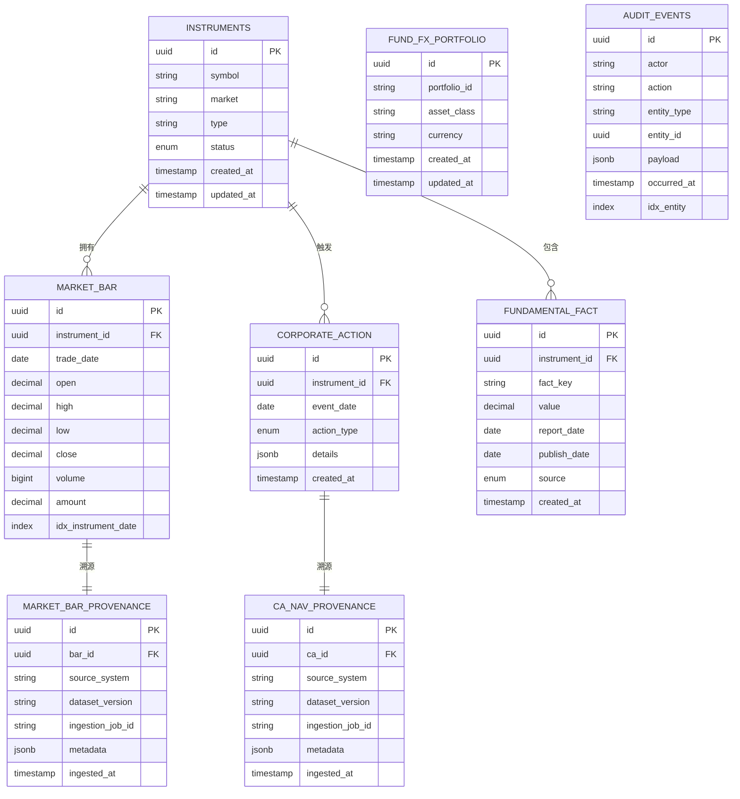
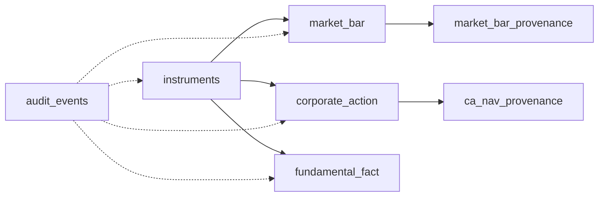

# 数据模型

<cite>
**本文引用的文件**   
- [alembic.ini](file://alembic.ini)
- [sql/migrations/env.py](file://sql/migrations/env.py)
- [sql/migrations/script.py.mako](file://sql/migrations/script.py.mako)
- [sql/migrations/versions/20260715_0001_instruments.py](file://sql/migrations/versions/20260715_0001_instruments.py)
- [sql/migrations/versions/20260715_0002_audit_events.py](file://sql/migrations/versions/20260715_0002_audit_events.py)
- [sql/migrations/versions/20260715_0003_market_bar.py](file://sql/migrations/versions/20260715_0003_market_bar.py)
- [sql/migrations/versions/20260715_0004_corporate_action.py](file://sql/migrations/versions/20260715_0004_corporate_action.py)
- [sql/migrations/versions/20260715_0005_fundamental_fact.py](file://sql/migrations/versions/20260715_0005_fundamental_fact.py)
- [sql/migrations/versions/20260715_0006_fund_fx_portfolio.py](file://sql/migrations/versions/20260715_0006_fund_fx_portfolio.py)
- [sql/migrations/versions/20260715_0007_market_bar_provenance.py](file://sql/migrations/versions/20260715_0007_market_bar_provenance.py)
- [sql/migrations/versions/20260715_0008_ca_nav_provenance.py](file://sql/migrations/versions/20260715_0008_ca_nav_provenance.py)
</cite>

## 目录
1. [简介](#简介)
2. [项目结构](#项目结构)
3. [核心组件](#核心组件)
4. [架构总览](#架构总览)
5. [详细组件分析](#详细组件分析)
6. [依赖关系分析](#依赖关系分析)
7. [性能考虑](#性能考虑)
8. [故障排查指南](#故障排查指南)
9. [结论](#结论)
10. [附录](#附录)

## 简介
本文件面向数据工程师与DBA，系统化梳理本仓库的数据模型与迁移体系。内容覆盖：
- 数据库实体、表结构与字段定义
- 实体间关系映射、主外键约束与索引设计
- 数据验证规则与业务逻辑约束
- 数据血缘追踪与审计事件存储设计
- ER图与数据结构可视化
- 数据生命周期管理、归档策略与清理规则
- 数据迁移路径与版本管理流程
- 数据安全、隐私保护与访问控制机制

## 项目结构
本项目使用 Alembic 进行数据库迁移管理，所有数据模型以迁移脚本形式维护在 sql/migrations/versions 目录下，并通过 env.py 与 alembic.ini 完成运行时配置与执行。

图表来源
- [sql/migrations/env.py](file://sql/migrations/env.py)
- [sql/migrations/script.py.mako](file://sql/migrations/script.py.mako)
- [alembic.ini](file://alembic.ini)

章节来源
- [alembic.ini](file://alembic.ini)
- [sql/migrations/env.py](file://sql/migrations/env.py)
- [sql/migrations/script.py.mako](file://sql/migrations/script.py.mako)

## 核心组件
- 标的与基础信息（instruments）：统一标识、市场、类型、状态、时间戳等
- 行情序列（market_bar）：OHLCV等日频或更高频K线数据
- 公司行为（corporate_action）：拆合股、分红、退市等事件
- 基本面事实（fundamental_fact）：财务指标快照与发布周期
- 基金/外汇/投资组合（fund_fx_portfolio）：资产类别与组合维度建模
- 审计事件（audit_events）：关键操作与变更的可追溯记录
- 数据血缘（market_bar_provenance, ca_nav_provenance）：数据来源、处理链路与可复现性

章节来源
- [sql/migrations/versions/20260715_0001_instruments.py](file://sql/migrations/versions/20260715_0001_instruments.py)
- [sql/migrations/versions/20260715_0003_market_bar.py](file://sql/migrations/versions/20260715_0003_market_bar.py)
- [sql/migrations/versions/20260715_0004_corporate_action.py](file://sql/migrations/versions/20260715_0004_corporate_action.py)
- [sql/migrations/versions/20260715_0005_fundamental_fact.py](file://sql/migrations/versions/20260715_0005_fundamental_fact.py)
- [sql/migrations/versions/20260715_0006_fund_fx_portfolio.py](file://sql/migrations/versions/20260715_0006_fund_fx_portfolio.py)
- [sql/migrations/versions/20260715_0002_audit_events.py](file://sql/migrations/versions/20260715_0002_audit_events.py)
- [sql/migrations/versions/20260715_0007_market_bar_provenance.py](file://sql/migrations/versions/20260715_0007_market_bar_provenance.py)
- [sql/migrations/versions/20260715_0008_ca_nav_provenance.py](file://sql/migrations/versions/20260715_0008_ca_nav_provenance.py)

## 架构总览
下图展示数据从采集到落库、血缘与审计的端到端链路，以及各实体间的关联关系。

图表来源
- [sql/migrations/versions/20260715_0001_instruments.py](file://sql/migrations/versions/20260715_0001_instruments.py)
- [sql/migrations/versions/20260715_0003_market_bar.py](file://sql/migrations/versions/20260715_0003_market_bar.py)
- [sql/migrations/versions/20260715_0004_corporate_action.py](file://sql/migrations/versions/20260715_0004_corporate_action.py)
- [sql/migrations/versions/20260715_0005_fundamental_fact.py](file://sql/migrations/versions/20260715_0005_fundamental_fact.py)
- [sql/migrations/versions/20260715_0006_fund_fx_portfolio.py](file://sql/migrations/versions/20260715_0006_fund_fx_portfolio.py)
- [sql/migrations/versions/20260715_0002_audit_events.py](file://sql/migrations/versions/20260715_0002_audit_events.py)
- [sql/migrations/versions/20260715_0007_market_bar_provenance.py](file://sql/migrations/versions/20260715_0007_market_bar_provenance.py)
- [sql/migrations/versions/20260715_0008_ca_nav_provenance.py](file://sql/migrations/versions/20260715_0008_ca_nav_provenance.py)

## 详细组件分析

### 标的与基础信息（instruments）
- 职责：统一描述交易标的的基本元数据，作为其他实体的锚点
- 关键字段
  - 主键：唯一标识
  - 代码与市场：用于跨市场统一编码
  - 类型与状态：股票/基金/ETF等分类及上市/停牌/退市等状态
  - 时间戳：创建与更新时间
- 约束与索引
  - 主键约束
  - 建议对“市场+代码”建立唯一索引以避免重复
- 数据验证与业务规则
  - 代码格式校验（参考技能脚本中的规范）
  - 状态机约束（如仅允许特定状态转换）
- 典型查询
  - 按市场与类型筛选
  - 按状态过滤可用标的

章节来源
- [sql/migrations/versions/20260715_0001_instruments.py](file://sql/migrations/versions/20260715_0001_instruments.py)

### 行情序列（market_bar）
- 职责：存储标的的时序行情数据（如日频K线）
- 关键字段
  - 主键：行级唯一标识
  - 标的ID：外键指向 instruments
  - 交易日期：时间分区或索引键
  - OHLCV与成交额：价格与成交量相关字段
- 约束与索引
  - 主键约束
  - 复合索引（instrument_id, trade_date）提升范围查询与连接性能
- 数据验证与业务规则
  - 非空与数值范围校验（如高不低于低）
  - 去重约束（同一标的同一天仅一条记录）
- 典型查询
  - 区间内行情拉取
  - 多标的对比与聚合

章节来源
- [sql/migrations/versions/20260715_0003_market_bar.py](file://sql/migrations/versions/20260715_0003_market_bar.py)

### 公司行为（corporate_action）
- 职责：记录影响价格与持仓的公司行为事件
- 关键字段
  - 主键：事件唯一标识
  - 标的ID：外键指向 instruments
  - 事件日期：生效或公告日期
  - 事件类型：拆合股、分红、配股、退市等
  - 详情：结构化JSON扩展字段
- 约束与索引
  - 主键约束
  - 针对标的ID与事件日期的索引
- 数据验证与业务规则
  - 事件类型枚举校验
  - 细节字段按类型进行一致性检查
- 典型查询
  - 某标的历史事件回溯
  - 事件驱动的价格调整计算

章节来源
- [sql/migrations/versions/20260715_0004_corporate_action.py](file://sql/migrations/versions/20260715_0004_corporate_action.py)

### 基本面事实（fundamental_fact）
- 职责：存储财务指标与基本面的周期性快照
- 关键字段
  - 主键：事实唯一标识
  - 标的ID：外键指向 instruments
  - 指标键值：标准化指标名称
  - 数值：指标取值
  - 报告期与发布日期：区分财报期与披露时点
  - 来源：数据源标记
- 约束与索引
  - 主键约束
  - 复合索引（instrument_id, fact_key, report_date）
- 数据验证与业务规则
  - 指标键白名单与单位换算
  - 缺失值与异常值检测
- 典型查询
  - 指标时间序列构建
  - 横截面因子计算

章节来源
- [sql/migrations/versions/20260715_0005_fundamental_fact.py](file://sql/migrations/versions/20260715_0005_fundamental_fact.py)

### 基金/外汇/投资组合（fund_fx_portfolio）
- 职责：抽象资产类别与投资组合维度，支持多资产统一管理
- 关键字段
  - 主键：组合唯一标识
  - 组合ID：业务维度标识
  - 资产类别：基金/外汇/股票等
  - 币种：计价货币
  - 时间戳：创建与更新时间
- 约束与索引
  - 主键约束
  - 组合ID唯一索引
- 数据验证与业务规则
  - 资产类别与币种合法性校验
- 典型查询
  - 组合净值与收益计算
  - 多组合对比分析

章节来源
- [sql/migrations/versions/20260715_0006_fund_fx_portfolio.py](file://sql/migrations/versions/20260715_0006_fund_fx_portfolio.py)

### 审计事件（audit_events）
- 职责：记录关键操作的审计轨迹，满足合规与可追溯要求
- 关键字段
  - 主键：事件唯一标识
  - 操作者：用户或服务账号
  - 动作：增删改查等
  - 实体类型与实体ID：被操作对象
  - 负载：变更前后差异或上下文
  - 发生时间：审计时间戳
- 约束与索引
  - 主键约束
  - 针对实体类型与实体ID的索引便于检索
- 数据验证与业务规则
  - 必填字段校验
  - 敏感信息脱敏写入
- 典型查询
  - 按实体定位变更历史
  - 按时间窗口统计操作量

章节来源
- [sql/migrations/versions/20260715_0002_audit_events.py](file://sql/migrations/versions/20260715_0002_audit_events.py)

### 数据血缘（market_bar_provenance, ca_nav_provenance）
- 职责：为行情与公司行为/NAV等数据提供来源、版本与作业级溯源
- 关键字段
  - 主键：血缘记录唯一标识
  - 目标ID：bar_id/ca_id 外键
  - 来源系统与数据集版本：上游系统标识与版本
  - 入仓作业ID：批/流任务实例
  - 元数据：附加上下文（如分片、哈希）
  - 入仓时间：入库时间戳
- 约束与索引
  - 主键约束
  - 目标ID唯一约束（一对一血缘）
- 数据验证与业务规则
  - 版本一致性与完整性校验
- 典型查询
  - 数据问题定位与回滚
  - 质量评估与覆盖率统计

章节来源
- [sql/migrations/versions/20260715_0007_market_bar_provenance.py](file://sql/migrations/versions/20260715_0007_market_bar_provenance.py)
- [sql/migrations/versions/20260715_0008_ca_nav_provenance.py](file://sql/migrations/versions/20260715_0008_ca_nav_provenance.py)

## 依赖关系分析
- 直接依赖
  - market_bar、corporate_action、fundamental_fact 均依赖 instruments
  - provenance 表分别依赖 market_bar 与 corporate_action/nav
  - audit_events 通过实体类型与ID泛化关联各类实体
- 间接依赖
  - 报表与分析层依赖上述核心表进行聚合与衍生计算
- 潜在循环
  - 当前模型无循环外键；血缘与审计均为单向引用

图表来源
- [sql/migrations/versions/20260715_0001_instruments.py](file://sql/migrations/versions/20260715_0001_instruments.py)
- [sql/migrations/versions/20260715_0003_market_bar.py](file://sql/migrations/versions/20260715_0003_market_bar.py)
- [sql/migrations/versions/20260715_0004_corporate_action.py](file://sql/migrations/versions/20260715_0004_corporate_action.py)
- [sql/migrations/versions/20260715_0005_fundamental_fact.py](file://sql/migrations/versions/20260715_0005_fundamental_fact.py)
- [sql/migrations/versions/20260715_0002_audit_events.py](file://sql/migrations/versions/20260715_0002_audit_events.py)
- [sql/migrations/versions/20260715_0007_market_bar_provenance.py](file://sql/migrations/versions/20260715_0007_market_bar_provenance.py)
- [sql/migrations/versions/20260715_0008_ca_nav_provenance.py](file://sql/migrations/versions/20260715_0008_ca_nav_provenance.py)

## 性能考虑
- 索引设计
  - 高频查询列建立B树索引（如 market_bar.instrument_id + trade_date）
  - 审计与血缘表按实体ID与时间戳建立索引
- 分区与分片
  - 行情表可按交易日期进行范围分区，降低扫描成本
- 写入优化
  - 批量插入与事务合并，减少锁竞争
- 读取优化
  - 物化视图或汇总表用于复杂聚合场景
- 存储与压缩
  - 历史数据冷热分层，冷数据归档至低成本存储

[本节为通用指导，不直接分析具体文件]

## 故障排查指南
- 迁移失败
  - 检查 alembic.ini 中数据库连接参数与环境变量
  - 查看 env.py 中的目标模块与版本头生成模板 script.py.mako
- 数据不一致
  - 通过 provenance 表定位数据来源与作业ID
  - 结合 audit_events 回溯变更轨迹
- 性能问题
  - 使用 EXPLAIN 分析慢查询，确认索引命中
  - 检查是否缺少复合索引或存在全表扫描

章节来源
- [alembic.ini](file://alembic.ini)
- [sql/migrations/env.py](file://sql/migrations/env.py)
- [sql/migrations/script.py.mako](file://sql/migrations/script.py.mako)

## 结论
本数据模型围绕“标的—行情—公司行为—基本面—组合”的核心主线展开，辅以审计与血缘能力，形成可追溯、可扩展、可治理的数据基座。通过 Alembic 迁移体系实现版本化管理，配合合理的索引与分区策略，可满足量化研究、投研与风控等多场景需求。

[本节为总结性内容，不直接分析具体文件]

## 附录

### 数据生命周期管理与归档策略
- 生命周期阶段
  - 采集与入仓：写入原始表并记录 provenance
  - 清洗与校验：约束与规则检查，失败进入死信队列
  - 服务与消费：供API、研究与生产系统使用
  - 归档与清理：按保留策略迁移至冷存储并删除热区冗余
- 归档与清理规则
  - 基于时间窗口的分区裁剪
  - 审计与血缘数据保留策略独立于业务数据
- 备份与恢复
  - 定期快照与增量日志备份
  - 演练恢复流程确保RTO/RPO达标

[本节为通用指导，不直接分析具体文件]

### 数据安全、隐私保护与访问控制
- 传输安全
  - 强制TLS加密通道
- 存储安全
  - 敏感字段加密存储（如密钥、个人身份信息）
- 访问控制
  - 最小权限原则，按角色授予读写权限
  - 审计事件不可篡改，采用只追加写入
- 合规与脱敏
  - 输出前脱敏，避免泄露个人隐私

[本节为通用指导，不直接分析具体文件]

### 数据迁移路径与版本管理流程
- 迁移工具
  - Alembic 负责DDL变更的版本化与回滚
- 版本命名
  - 迁移文件名含时间戳与主题，保证有序演进
- 流程建议
  - 开发分支编写迁移脚本
  - 评审通过后合并至主干
  - 预发环境验证，再在生产窗口执行
  - 回滚预案与数据校验清单

章节来源
- [sql/migrations/versions/20260715_0001_instruments.py](file://sql/migrations/versions/20260715_0001_instruments.py)
- [sql/migrations/versions/20260715_0002_audit_events.py](file://sql/migrations/versions/20260715_0002_audit_events.py)
- [sql/migrations/versions/20260715_0003_market_bar.py](file://sql/migrations/versions/20260715_0003_market_bar.py)
- [sql/migrations/versions/20260715_0004_corporate_action.py](file://sql/migrations/versions/20260715_0004_corporate_action.py)
- [sql/migrations/versions/20260715_0005_fundamental_fact.py](file://sql/migrations/versions/20260715_0005_fundamental_fact.py)
- [sql/migrations/versions/20260715_0006_fund_fx_portfolio.py](file://sql/migrations/versions/20260715_0006_fund_fx_portfolio.py)
- [sql/migrations/versions/20260715_0007_market_bar_provenance.py](file://sql/migrations/versions/20260715_0007_market_bar_provenance.py)
- [sql/migrations/versions/20260715_0008_ca_nav_provenance.py](file://sql/migrations/versions/20260715_0008_ca_nav_provenance.py)