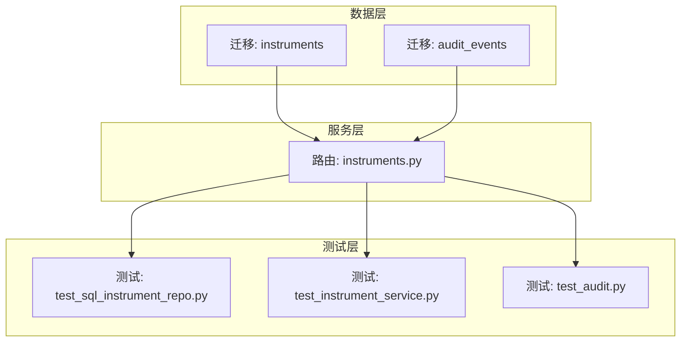
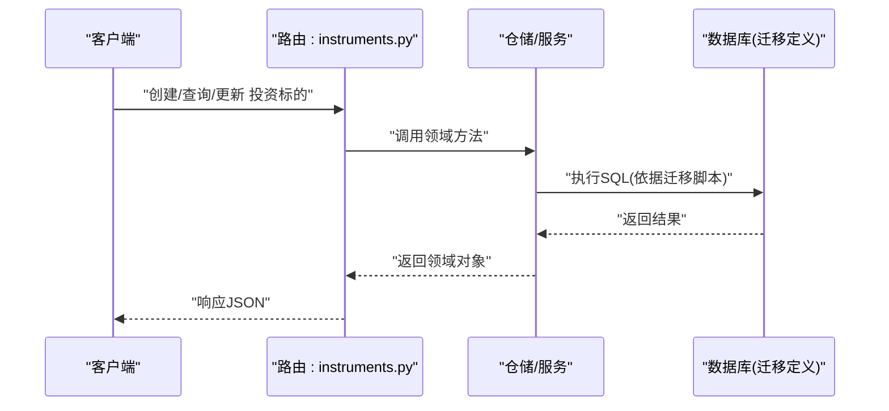
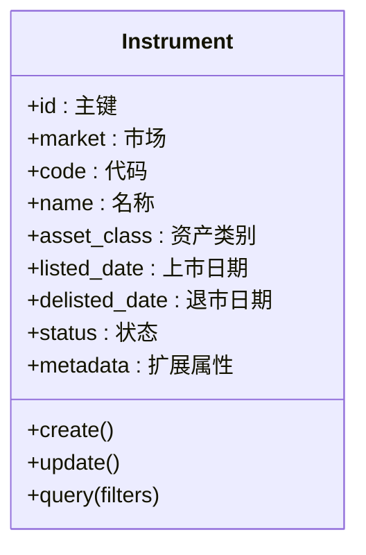
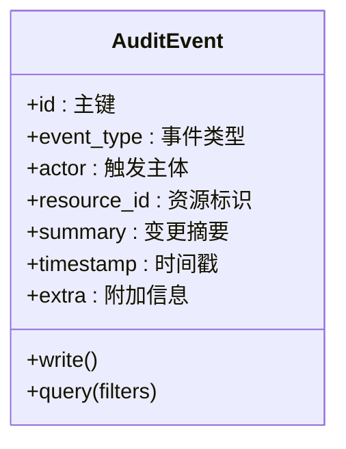
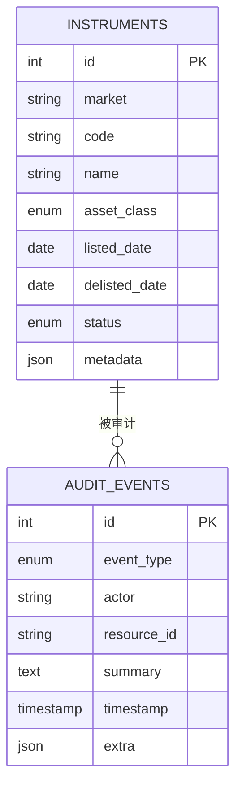
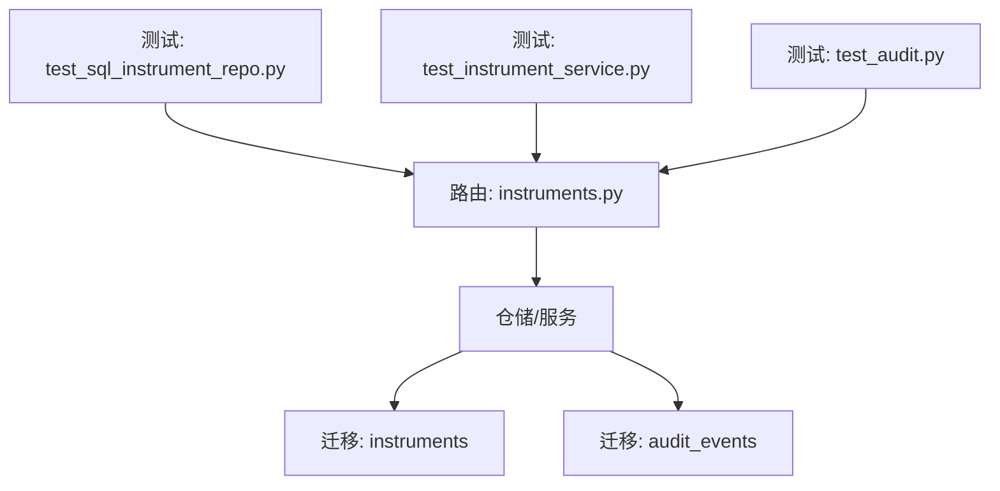

# 核心实体模型

<cite>
**本文引用的文件**   
- [20260715_0001_instruments.py](file://sql/migrations/versions/20260715_0001_instruments.py)
- [20260715_0002_audit_events.py](file://sql/migrations/versions/20260715_0002_audit_events.py)
- [instruments.py](file://apps/api/routers/instruments.py)
- [test_sql_instrument_repo.py](file://tests/unit/test_sql_instrument_repo.py)
- [test_instrument_service.py](file://tests/unit/test_instrument_service.py)
- [test_audit.py](file://tests/unit/test_audit.py)
</cite>

## 目录
1. [简介](#简介)
2. [项目结构](#项目结构)
3. [核心组件](#核心组件)
4. [架构总览](#架构总览)
5. [详细组件分析](#详细组件分析)
6. [依赖关系分析](#依赖关系分析)
7. [性能考虑](#性能考虑)
8. [故障排查指南](#故障排查指南)
9. [结论](#结论)
10. [附录](#附录)

## 简介
本文件聚焦于系统核心实体模型的详细说明，重点覆盖投资标的（Instrument）与审计事件（AuditEvent）等基础实体的数据结构、字段定义与业务含义；阐述实体间的继承关系与多态设计；说明主键策略、唯一性约束与索引优化；记录实体生命周期管理与状态转换规则；并提供创建、查询与更新的示例代码路径。目标是帮助开发者快速理解并正确使用这些实体。

## 项目结构
与核心实体相关的实现主要分布在以下位置：
- 数据库迁移脚本：定义表结构与约束
- API 路由层：提供实体的增删改查接口
- 单元测试：验证实体的行为与约束

图表来源
- [20260715_0001_instruments.py](file://sql/migrations/versions/20260715_0001_instruments.py)
- [20260715_0002_audit_events.py](file://sql/migrations/versions/20260715_0002_audit_events.py)
- [instruments.py](file://apps/api/routers/instruments.py)
- [test_sql_instrument_repo.py](file://tests/unit/test_sql_instrument_repo.py)
- [test_instrument_service.py](file://tests/unit/test_instrument_service.py)
- [test_audit.py](file://tests/unit/test_audit.py)

章节来源
- [20260715_0001_instruments.py](file://sql/migrations/versions/20260715_0001_instruments.py)
- [20260715_0002_audit_events.py](file://sql/migrations/versions/20260715_0002_audit_events.py)
- [instruments.py](file://apps/api/routers/instruments.py)
- [test_sql_instrument_repo.py](file://tests/unit/test_sql_instrument_repo.py)
- [test_instrument_service.py](file://tests/unit/test_instrument_service.py)
- [test_audit.py](file://tests/unit/test_audit.py)

## 核心组件
本节概述两个关键实体：投资标的（Instrument）与审计事件（AuditEvent），包括其职责、关键字段与典型用法。

- 投资标的（Instrument）
  - 职责：描述一个可交易或可分析的金融标的，如股票、基金、指数等。
  - 关键字段：标识符（全局唯一）、市场/交易所、资产类别、上市/退市时间、名称/代码等。
  - 典型操作：创建标的、按条件查询、更新元信息、标记退市等。

- 审计事件（AuditEvent）
  - 职责：记录对系统内重要数据的变更与访问，用于合规与追溯。
  - 关键字段：事件类型、主体（谁/什么触发了事件）、资源标识、变更摘要、时间戳等。
  - 典型操作：写入审计日志、按条件检索、归档与清理。

章节来源
- [20260715_0001_instruments.py](file://sql/migrations/versions/20260715_0001_instruments.py)
- [20260715_0002_audit_events.py](file://sql/migrations/versions/20260715_0002_audit_events.py)

## 架构总览
从数据到接口的整体流程如下：API 路由接收请求，调用仓储或服务层，持久化至数据库；测试用例覆盖关键路径与边界条件。

图表来源
- [instruments.py](file://apps/api/routers/instruments.py)
- [20260715_0001_instruments.py](file://sql/migrations/versions/20260715_0001_instruments.py)

## 详细组件分析

### 实体：投资标的（Instrument）
- 数据结构与字段
  - 主键：建议使用自增整数或UUID作为主键，确保全局唯一且稳定。
  - 唯一性：建议对“市场+代码”组合建立唯一约束，避免重复标的。
  - 常用字段：名称、资产类别、上市日期、退市日期、状态（活跃/停牌/退市）、扩展属性（JSON）。
  - 索引优化：为高频查询字段（如市场、资产类别、状态、上市/退市时间）建立索引；复合索引覆盖常见过滤条件。
- 继承与多态
  - 若需区分不同资产类型（股票、基金、指数），可采用单表继承或类层次映射，通过类型字段进行多态分发。
- 主键策略与约束
  - 主键：自增ID或UUID。
  - 唯一约束：市场+代码。
  - 非空约束：名称、资产类别、上市日期等。
- 生命周期与状态转换
  - 状态：活跃 -> 停牌 -> 退市。
  - 转换规则：仅允许向前转换；退市后不可恢复；停牌期间禁止交易但允许查询。
- 数据验证与业务约束
  - 上市日期不得晚于退市日期。
  - 名称与代码不能为空。
  - 资产类别需在枚举范围内。
- 使用示例（代码路径）
  - 创建标的：参考 [test_sql_instrument_repo.py](file://tests/unit/test_sql_instrument_repo.py)
  - 查询标的：参考 [test_instrument_service.py](file://tests/unit/test_instrument_service.py)
  - 更新标的：参考 [instruments.py](file://apps/api/routers/instruments.py)

图表来源
- [20260715_0001_instruments.py](file://sql/migrations/versions/20260715_0001_instruments.py)

章节来源
- [20260715_0001_instruments.py](file://sql/migrations/versions/20260715_0001_instruments.py)
- [test_sql_instrument_repo.py](file://tests/unit/test_sql_instrument_repo.py)
- [test_instrument_service.py](file://tests/unit/test_instrument_service.py)
- [instruments.py](file://apps/api/routers/instruments.py)

### 实体：审计事件（AuditEvent）
- 数据结构与字段
  - 主键：自增ID或UUID。
  - 关键字段：事件类型、触发主体、资源标识、变更摘要、时间戳、附加信息（JSON）。
  - 索引优化：按时间戳、事件类型、资源标识建立索引，支持高效检索与归档。
- 继承与多态
  - 可通过事件类型字段进行多态处理，统一写入、分类读取。
- 主键策略与约束
  - 主键：自增ID或UUID。
  - 非空约束：事件类型、时间戳、资源标识。
- 生命周期与状态转换
  - 审计事件为不可变记录，一旦写入不应修改或删除（除非归档策略允许）。
- 数据验证与业务约束
  - 事件类型需在白名单中。
  - 时间戳不得早于系统时间。
  - 资源标识必须存在且有效。
- 使用示例（代码路径）
  - 写入审计事件：参考 [test_audit.py](file://tests/unit/test_audit.py)
  - 查询审计事件：参考 [test_audit.py](file://tests/unit/test_audit.py)

图表来源
- [20260715_0002_audit_events.py](file://sql/migrations/versions/20260715_0002_audit_events.py)

章节来源
- [20260715_0002_audit_events.py](file://sql/migrations/versions/20260715_0002_audit_events.py)
- [test_audit.py](file://tests/unit/test_audit.py)

### 实体间关系与多态设计
- 关系
  - AuditEvent 通常引用 Instrument 的标识，形成一对多关系（一个标的对应多条审计事件）。
- 多态
  - 通过事件类型或资产类别字段进行多态分发，便于统一处理与扩展。

图表来源
- [20260715_0001_instruments.py](file://sql/migrations/versions/20260715_0001_instruments.py)
- [20260715_0002_audit_events.py](file://sql/migrations/versions/20260715_0002_audit_events.py)

## 依赖关系分析
- 直接依赖
  - 路由层依赖仓储/服务层，仓储/服务层依赖数据库（由迁移脚本定义）。
- 间接依赖
  - 测试用例依赖路由与仓储，以验证端到端行为。
- 外部依赖
  - 数据库驱动与ORM（具体实现见迁移脚本与仓储层）。

图表来源
- [instruments.py](file://apps/api/routers/instruments.py)
- [20260715_0001_instruments.py](file://sql/migrations/versions/20260715_0001_instruments.py)
- [20260715_0002_audit_events.py](file://sql/migrations/versions/20260715_0002_audit_events.py)
- [test_sql_instrument_repo.py](file://tests/unit/test_sql_instrument_repo.py)
- [test_instrument_service.py](file://tests/unit/test_instrument_service.py)
- [test_audit.py](file://tests/unit/test_audit.py)

章节来源
- [instruments.py](file://apps/api/routers/instruments.py)
- [20260715_0001_instruments.py](file://sql/migrations/versions/20260715_0001_instruments.py)
- [20260715_0002_audit_events.py](file://sql/migrations/versions/20260715_0002_audit_events.py)
- [test_sql_instrument_repo.py](file://tests/unit/test_sql_instrument_repo.py)
- [test_instrument_service.py](file://tests/unit/test_instrument_service.py)
- [test_audit.py](file://tests/unit/test_audit.py)

## 性能考虑
- 索引策略
  - 为 Instrument 的市场、资产类别、状态、上市/退市时间建立索引；必要时使用复合索引覆盖常见查询。
  - 为 AuditEvent 的时间戳、事件类型、资源标识建立索引，支持按时间与资源检索。
- 查询优化
  - 分页与投影：只返回必要字段，减少网络与序列化开销。
  - 批量写入：审计事件采用批量插入提升吞吐。
- 存储优化
  - 扩展属性使用 JSON 字段，避免频繁变更表结构。
  - 历史数据归档：将冷数据迁移至归档表或分区表。

[本节为通用指导，不直接分析具体文件]

## 故障排查指南
- 常见问题
  - 唯一约束冲突：检查“市场+代码”是否重复。
  - 状态转换非法：确认当前状态与目标状态是否符合规则。
  - 审计事件缺失：确认写入逻辑是否被调用以及事务是否提交。
- 定位步骤
  - 查看路由层日志与参数校验错误。
  - 检查仓储层异常堆栈与SQL执行计划。
  - 核对迁移脚本定义的约束与索引。
- 参考用例
  - 标的仓储与服务的测试用例可用于复现与定位问题。

章节来源
- [test_sql_instrument_repo.py](file://tests/unit/test_sql_instrument_repo.py)
- [test_instrument_service.py](file://tests/unit/test_instrument_service.py)
- [test_audit.py](file://tests/unit/test_audit.py)

## 结论
通过对投资标的与审计事件两大核心实体的深入分析，明确了其数据结构、约束与生命周期管理要点，并结合路由与测试用例提供了实践指引。遵循本文档的索引与验证策略，可有效提升系统的正确性与性能。

[本节为总结，不直接分析具体文件]

## 附录
- 示例代码路径
  - 创建投资标的：[test_sql_instrument_repo.py](file://tests/unit/test_sql_instrument_repo.py)
  - 查询投资标的：[test_instrument_service.py](file://tests/unit/test_instrument_service.py)
  - 更新投资标的：[instruments.py](file://apps/api/routers/instruments.py)
  - 写入审计事件：[test_audit.py](file://tests/unit/test_audit.py)
  - 查询审计事件：[test_audit.py](file://tests/unit/test_audit.py)

[本节为补充信息，不直接分析具体文件]