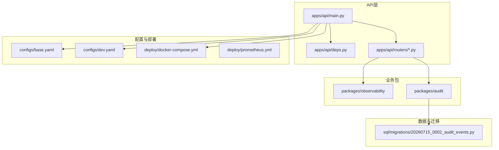
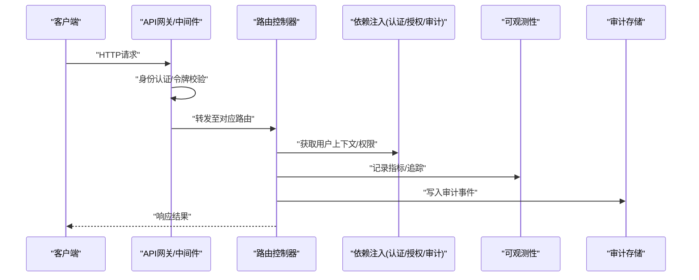
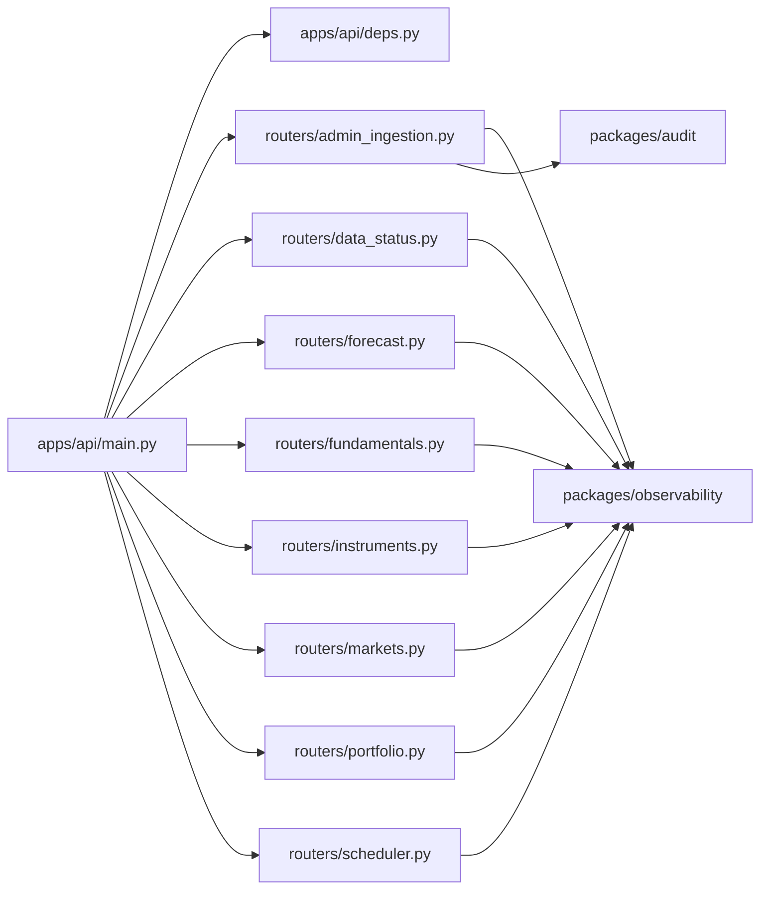

# 安全考虑事项

<cite>
**本文引用的文件**   
- [apps/api/main.py](file://apps/api/main.py)
- [apps/api/deps.py](file://apps/api/deps.py)
- [apps/api/routers/admin_ingestion.py](file://apps/api/routers/admin_ingestion.py)
- [apps/api/routers/data_status.py](file://apps/api/routers/data_status.py)
- [apps/api/routers/forecast.py](file://apps/api/routers/forecast.py)
- [apps/api/routers/fundamentals.py](file://apps/api/routers/fundamentals.py)
- [apps/api/routers/instruments.py](file://apps/api/routers/instruments.py)
- [apps/api/routers/markets.py](file://apps/api/routers/markets.py)
- [apps/api/routers/portfolio.py](file://apps/api/routers/portfolio.py)
- [apps/api/routers/scheduler.py](file://apps/api/routers/scheduler.py)
- [packages/observability](file://packages/observability)
- [packages/audit](file://packages/audit)
- [sql/migrations/20260715_0002_audit_events.py](file://sql/migrations/20260715_0002_audit_events.py)
- [configs/base.yaml](file://configs/base.yaml)
- [configs/dev.yaml](file://configs/dev.yaml)
- [deploy/docker-compose.yml](file://deploy/docker-compose.yml)
- [deploy/prometheus.yml](file://deploy/prometheus.yml)
- [pyproject.toml](file://pyproject.toml)
</cite>

## 目录
1. [简介](#简介)
2. [项目结构](#项目结构)
3. [核心组件](#核心组件)
4. [架构总览](#架构总览)
5. [详细组件分析](#详细组件分析)
6. [依赖分析](#依赖分析)
7. [性能与安全权衡](#性能与安全权衡)
8. [故障排查指南](#故障排查指南)
9. [结论](#结论)
10. [附录](#附录)

## 简介
本指南面向量化投资系统的安全实践，聚焦于API安全防护、数据保护、权限控制、网络安全配置、合规性要求以及漏洞扫描与渗透测试的实施方法。文档基于仓库现有代码与配置进行梳理，提供可落地的最佳实践建议，帮助团队在保障业务连续性的同时满足金融监管与隐私保护要求。

## 项目结构
从安全视角看，本项目采用“应用服务 + 包化能力”的模块化组织方式：
- API层位于 apps/api，包含路由定义与依赖注入入口
- 业务能力以 packages/* 形式解耦，如 observability（可观测性）、audit（审计）等
- 配置集中于 configs，部署相关配置位于 deploy
- 数据库迁移脚本位于 sql/migrations，其中包含审计事件表结构

图表来源
- [apps/api/main.py](file://apps/api/main.py)
- [apps/api/deps.py](file://apps/api/deps.py)
- [apps/api/routers/admin_ingestion.py](file://apps/api/routers/admin_ingestion.py)
- [packages/observability](file://packages/observability)
- [packages/audit](file://packages/audit)
- [configs/base.yaml](file://configs/base.yaml)
- [configs/dev.yaml](file://configs/dev.yaml)
- [deploy/docker-compose.yml](file://deploy/docker-compose.yml)
- [deploy/prometheus.yml](file://deploy/prometheus.yml)
- [sql/migrations/20260715_0002_audit_events.py](file://sql/migrations/20260715_0002_audit_events.py)

章节来源
- [apps/api/main.py](file://apps/api/main.py)
- [apps/api/deps.py](file://apps/api/deps.py)
- [apps/api/routers/admin_ingestion.py](file://apps/api/routers/admin_ingestion.py)
- [packages/observability](file://packages/observability)
- [packages/audit](file://packages/audit)
- [configs/base.yaml](file://configs/base.yaml)
- [configs/dev.yaml](file://configs/dev.yaml)
- [deploy/docker-compose.yml](file://deploy/docker-compose.yml)
- [deploy/prometheus.yml](file://deploy/prometheus.yml)
- [sql/migrations/20260715_0002_audit_events.py](file://sql/migrations/20260715_0002_audit_events.py)

## 核心组件
- API网关与中间件：负责请求生命周期管理、鉴权前置校验、限流与访问日志记录
- 路由控制器：按领域划分（行情、基本面、组合、调度等），承载具体业务接口
- 依赖注入：集中管理认证、授权、数据源、审计与可观测性依赖
- 审计与可观测性：统一采集操作日志、指标与追踪信息，支撑合规与排障
- 配置中心：区分基础与开发环境，管理密钥、证书、开关等敏感配置
- 部署编排：容器编排与监控采集，确保运行环境与网络边界安全

章节来源
- [apps/api/main.py](file://apps/api/main.py)
- [apps/api/deps.py](file://apps/api/deps.py)
- [apps/api/routers/admin_ingestion.py](file://apps/api/routers/admin_ingestion.py)
- [apps/api/routers/data_status.py](file://apps/api/routers/data_status.py)
- [apps/api/routers/forecast.py](file://apps/api/routers/forecast.py)
- [apps/api/routers/fundamentals.py](file://apps/api/routers/fundamentals.py)
- [apps/api/routers/instruments.py](file://apps/api/routers/instruments.py)
- [apps/api/routers/markets.py](file://apps/api/routers/markets.py)
- [apps/api/routers/portfolio.py](file://apps/api/routers/portfolio.py)
- [apps/api/routers/scheduler.py](file://apps/api/routers/scheduler.py)
- [packages/observability](file://packages/observability)
- [packages/audit](file://packages/audit)
- [configs/base.yaml](file://configs/base.yaml)
- [configs/dev.yaml](file://configs/dev.yaml)
- [deploy/docker-compose.yml](file://deploy/docker-compose.yml)
- [deploy/prometheus.yml](file://deploy/prometheus.yml)

## 架构总览
下图展示API请求从进入网关到路由处理、依赖注入、审计与可观测性记录的端到端流程。

图表来源
- [apps/api/main.py](file://apps/api/main.py)
- [apps/api/deps.py](file://apps/api/deps.py)
- [apps/api/routers/admin_ingestion.py](file://apps/api/routers/admin_ingestion.py)
- [packages/observability](file://packages/observability)
- [packages/audit](file://packages/audit)

## 详细组件分析

### API安全防护
- 身份认证
  - 建议在网关或中间件层实现统一的JWT/OIDC校验，拒绝非法或未携带令牌的请求
  - 对管理员接口（如 admin_ingestion）启用强认证策略，并限制来源IP白名单
- 授权控制
  - 使用依赖注入将当前用户上下文与角色信息注入到路由处理函数中
  - 针对写操作（数据摄入、模型训练、调度变更）实施细粒度RBAC，读操作可放宽但需保留审计
- 请求验证
  - 对所有输入参数进行严格类型与范围校验，拒绝异常值与潜在注入载荷
  - 对批量导入与大数据量接口增加速率限制与分页约束

章节来源
- [apps/api/main.py](file://apps/api/main.py)
- [apps/api/deps.py](file://apps/api/deps.py)
- [apps/api/routers/admin_ingestion.py](file://apps/api/routers/admin_ingestion.py)
- [apps/api/routers/data_status.py](file://apps/api/routers/data_status.py)
- [apps/api/routers/forecast.py](file://apps/api/routers/forecast.py)
- [apps/api/routers/fundamentals.py](file://apps/api/routers/fundamentals.py)
- [apps/api/routers/instruments.py](file://apps/api/routers/instruments.py)
- [apps/api/routers/markets.py](file://apps/api/routers/markets.py)
- [apps/api/routers/portfolio.py](file://apps/api/routers/portfolio.py)
- [apps/api/routers/scheduler.py](file://apps/api/routers/scheduler.py)

### 数据保护措施
- 敏感信息加密
  - 密钥、证书、数据库凭据通过配置中心加载，避免硬编码；生产环境建议使用外部密钥管理服务
  - 传输层强制TLS，禁用弱密码套件与过时协议版本
- 访问日志审计
  - 在中间件层记录请求元数据（时间戳、来源IP、用户标识、接口路径、状态码、耗时）
  - 结合可观测性平台（Prometheus/Grafana）进行指标聚合与告警
- 数据脱敏
  - 对返回给前端或第三方系统的敏感字段进行脱敏处理（如账号、交易金额、持仓明细）
  - 日志输出前执行脱敏规则，防止PII泄露

章节来源
- [packages/observability](file://packages/observability)
- [packages/audit](file://packages/audit)
- [sql/migrations/20260715_0002_audit_events.py](file://sql/migrations/20260715_0002_audit_events.py)
- [configs/base.yaml](file://configs/base.yaml)
- [configs/dev.yaml](file://configs/dev.yaml)
- [deploy/prometheus.yml](file://deploy/prometheus.yml)

### 权限控制最佳实践
- 角色定义
  - 至少划分：只读用户、分析师、运营管理员、系统管理员；遵循最小权限原则
- 操作审批
  - 高风险操作（批量数据摄入、模型重训、调度任务修改）引入双人复核与审批流
- 访问限制
  - 管理员接口仅允许内网或跳板机访问；对外暴露面最小化
  - 结合IP白名单与地理围栏策略，降低越权风险

章节来源
- [apps/api/routers/admin_ingestion.py](file://apps/api/routers/admin_ingestion.py)
- [apps/api/routers/scheduler.py](file://apps/api/routers/scheduler.py)
- [apps/api/routers/portfolio.py](file://apps/api/routers/portfolio.py)

### 网络安全配置
- 防火墙规则
  - 仅开放必要端口（如HTTPS 443），屏蔽调试端口与管理面板外网访问
- SSL证书管理
  - 使用受信任CA签发的证书，定期轮换；配置HSTS与OCSP装订
- 入侵检测
  - 部署WAF与IDS/IPS，对SQL注入、XSS、暴力破解等行为进行拦截与告警
  - 结合可观测性平台建立异常流量基线与阈值告警

章节来源
- [deploy/docker-compose.yml](file://deploy/docker-compose.yml)
- [deploy/prometheus.yml](file://deploy/prometheus.yml)
- [configs/base.yaml](file://configs/base.yaml)
- [configs/dev.yaml](file://configs/dev.yaml)

### 合规性要求
- 金融监管规定
  - 满足交易留痕、数据完整性与可追溯性要求；关键操作需具备不可篡改审计链
- 数据隐私保护
  - 遵循个人信息保护法与数据安全法，落实数据分类分级与最小化收集
- 审计追踪
  - 审计事件表结构与写入逻辑需覆盖主体、客体、动作、时间、结果等要素

章节来源
- [sql/migrations/20260715_0002_audit_events.py](file://sql/migrations/20260715_0002_audit_events.py)
- [packages/audit](file://packages/audit)
- [packages/observability](file://packages/observability)

### 安全漏洞扫描与渗透测试
- 静态与动态扫描
  - 在CI流水线集成SAST/DAST工具，阻断高危漏洞合并
- 依赖安全
  - 使用依赖治理工具检查已知CVE，及时升级受影响库
- 渗透测试
  - 定期进行红蓝对抗与灰盒测试，覆盖认证绕过、越权访问、注入攻击等场景
- 修复与回归
  - 建立漏洞工单闭环机制，复测通过后发布补丁版本

章节来源
- [pyproject.toml](file://pyproject.toml)
- [deploy/prometheus.yml](file://deploy/prometheus.yml)

## 依赖分析
API层与各业务包之间的依赖关系如下，便于识别耦合点与潜在安全风险扩散路径。

图表来源
- [apps/api/main.py](file://apps/api/main.py)
- [apps/api/deps.py](file://apps/api/deps.py)
- [apps/api/routers/admin_ingestion.py](file://apps/api/routers/admin_ingestion.py)
- [apps/api/routers/data_status.py](file://apps/api/routers/data_status.py)
- [apps/api/routers/forecast.py](file://apps/api/routers/forecast.py)
- [apps/api/routers/fundamentals.py](file://apps/api/routers/fundamentals.py)
- [apps/api/routers/instruments.py](file://apps/api/routers/instruments.py)
- [apps/api/routers/markets.py](file://apps/api/routers/markets.py)
- [apps/api/routers/portfolio.py](file://apps/api/routers/portfolio.py)
- [apps/api/routers/scheduler.py](file://apps/api/routers/scheduler.py)
- [packages/observability](file://packages/observability)
- [packages/audit](file://packages/audit)

章节来源
- [apps/api/main.py](file://apps/api/main.py)
- [apps/api/deps.py](file://apps/api/deps.py)
- [apps/api/routers/admin_ingestion.py](file://apps/api/routers/admin_ingestion.py)
- [apps/api/routers/data_status.py](file://apps/api/routers/data_status.py)
- [apps/api/routers/forecast.py](file://apps/api/routers/forecast.py)
- [apps/api/routers/fundamentals.py](file://apps/api/routers/fundamentals.py)
- [apps/api/routers/instruments.py](file://apps/api/routers/instruments.py)
- [apps/api/routers/markets.py](file://apps/api/routers/markets.py)
- [apps/api/routers/portfolio.py](file://apps/api/routers/portfolio.py)
- [apps/api/routers/scheduler.py](file://apps/api/routers/scheduler.py)
- [packages/observability](file://packages/observability)
- [packages/audit](file://packages/audit)

## 性能与安全权衡
- 鉴权开销
  - 在网关层缓存公钥或令牌黑名单，减少后端重复校验
- 审计写入
  - 异步写入审计事件，避免阻塞主链路；必要时降级为本地缓冲+批量上报
- 日志体积
  - 合理采样与轮转策略，控制磁盘与带宽占用
- TLS握手
  - 启用会话复用与连接池，降低延迟

[本节为通用指导，不直接分析具体文件]

## 故障排查指南
- 认证失败
  - 检查网关证书与上游服务时间同步；确认令牌签发方与受众匹配
- 授权被拒
  - 核对用户角色与资源映射；审查审批流是否完成
- 审计缺失
  - 确认审计通道可用与存储可达；查看可观测性平台指标与告警
- 性能退化
  - 观察慢查询与GC停顿；评估批量写入与日志采样策略

章节来源
- [packages/observability](file://packages/observability)
- [packages/audit](file://packages/audit)
- [deploy/prometheus.yml](file://deploy/prometheus.yml)

## 结论
通过在API层强化认证与授权、完善数据保护与审计、规范网络安全配置与合规落地，并结合持续的安全扫描与渗透测试，量化投资系统可在保障业务稳定运行的前提下有效降低安全风险。建议将上述实践纳入研发流程与运维SOP，形成常态化安全治理机制。

[本节为总结性内容，不直接分析具体文件]

## 附录
- 参考配置与部署清单
  - 基础与开发环境配置项对比
  - 容器编排中的安全相关设置
  - 监控采集与告警规则要点

章节来源
- [configs/base.yaml](file://configs/base.yaml)
- [configs/dev.yaml](file://configs/dev.yaml)
- [deploy/docker-compose.yml](file://deploy/docker-compose.yml)
- [deploy/prometheus.yml](file://deploy/prometheus.yml)