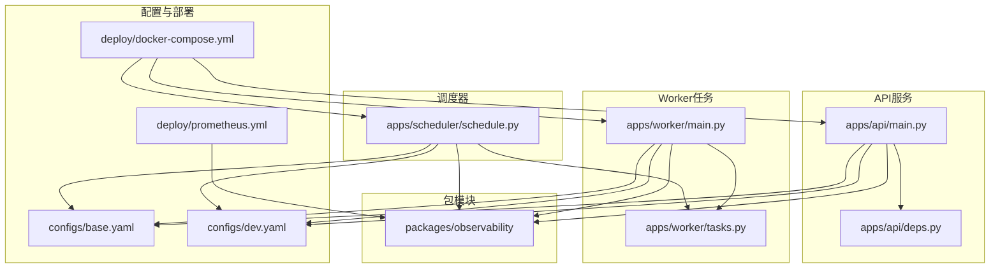
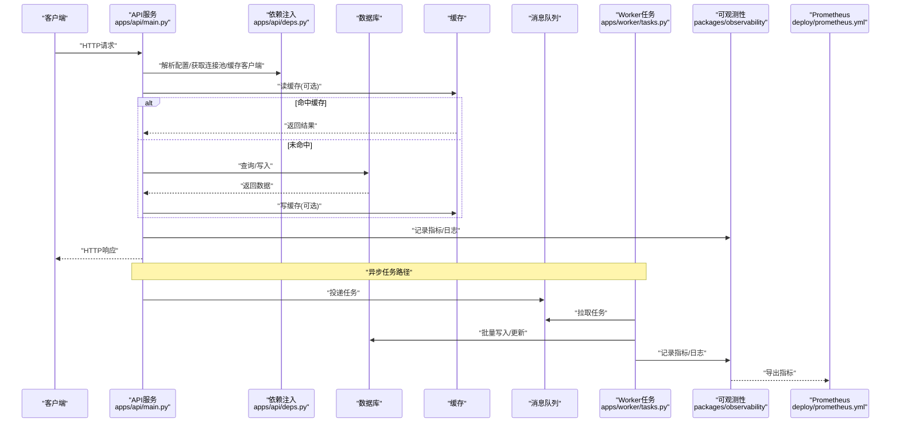
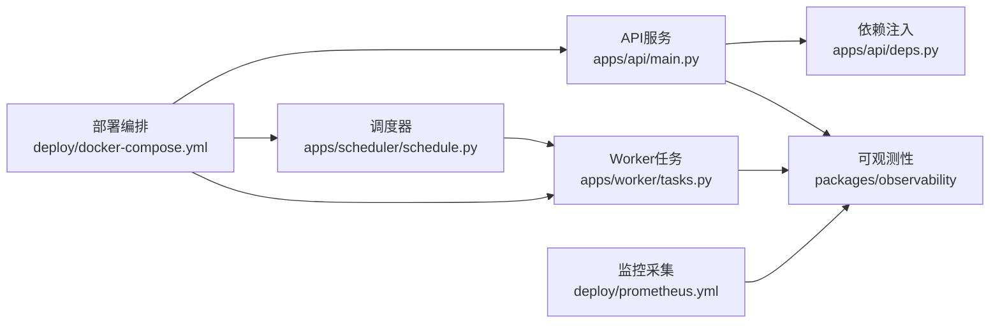

# 性能优化指南

<cite>
**本文引用的文件**   
- [apps/api/main.py](file://apps/api/main.py)
- [apps/api/deps.py](file://apps/api/deps.py)
- [apps/worker/main.py](file://apps/worker/main.py)
- [apps/worker/tasks.py](file://apps/worker/tasks.py)
- [apps/scheduler/schedule.py](file://apps/scheduler/schedule.py)
- [deploy/docker-compose.yml](file://deploy/docker-compose.yml)
- [deploy/prometheus.yml](file://deploy/prometheus.yml)
- [pyproject.toml](file://pyproject.toml)
- [configs/base.yaml](file://configs/base.yaml)
- [configs/dev.yaml](file://configs/dev.yaml)
- [packages/observability](file://packages/observability)
</cite>

## 目录
1. [简介](#简介)
2. [项目结构](#项目结构)
3. [核心组件](#核心组件)
4. [架构总览](#架构总览)
5. [详细组件分析](#详细组件分析)
6. [依赖关系分析](#依赖关系分析)
7. [性能考虑](#性能考虑)
8. [故障排查指南](#故障排查指南)
9. [结论](#结论)
10. [附录](#附录)

## 简介
本指南面向量化数据与交易系统的性能优化，覆盖API服务、数据库查询、内存与CPU使用、消息队列、监控指标与压测基准等关键维度。目标是帮助读者在现有工程基础上，系统性地提升吞吐、降低延迟、稳定资源占用并建立可观测性闭环。

## 项目结构
本项目采用多应用分层组织：
- API服务：基于FastAPI的HTTP接口层，负责请求路由、依赖注入与对外暴露能力。
- Worker任务：异步任务执行器，处理耗时或批量的数据处理与计算。
- Scheduler调度：定时任务编排，驱动周期性数据拉取、特征计算与报表生成。
- 配置与部署：YAML配置与Docker Compose编排，Prometheus采集监控指标。
- 包模块：按领域划分的功能包（如ingestion、features、observability等）。

图表来源
- [apps/api/main.py](file://apps/api/main.py)
- [apps/api/deps.py](file://apps/api/deps.py)
- [apps/worker/main.py](file://apps/worker/main.py)
- [apps/worker/tasks.py](file://apps/worker/tasks.py)
- [apps/scheduler/schedule.py](file://apps/scheduler/schedule.py)
- [configs/base.yaml](file://configs/base.yaml)
- [configs/dev.yaml](file://configs/dev.yaml)
- [deploy/docker-compose.yml](file://deploy/docker-compose.yml)
- [deploy/prometheus.yml](file://deploy/prometheus.yml)
- [packages/observability](file://packages/observability)

章节来源
- [apps/api/main.py](file://apps/api/main.py)
- [apps/api/deps.py](file://apps/api/deps.py)
- [apps/worker/main.py](file://apps/worker/main.py)
- [apps/worker/tasks.py](file://apps/worker/tasks.py)
- [apps/scheduler/schedule.py](file://apps/scheduler/schedule.py)
- [deploy/docker-compose.yml](file://deploy/docker-compose.yml)
- [deploy/prometheus.yml](file://deploy/prometheus.yml)
- [configs/base.yaml](file://configs/base.yaml)
- [configs/dev.yaml](file://configs/dev.yaml)
- [packages/observability](file://packages/observability)

## 核心组件
- API服务入口与中间件：负责启动ASGI服务器、注册路由、挂载中间件（如日志、限流、CORS）、统一错误响应与指标上报。
- 依赖注入：集中管理数据库连接池、缓存客户端、外部服务客户端、配置加载与生命周期钩子。
- Worker任务：消费任务队列，执行批量数据入库、特征计算、模型推理等耗时操作，支持重试与死信队列。
- 调度器：基于时间触发或事件触发，将工作负载分发到Worker，保证周期性与幂等性。
- 可观测性：埋点指标、结构化日志、分布式追踪与告警规则。

章节来源
- [apps/api/main.py](file://apps/api/main.py)
- [apps/api/deps.py](file://apps/api/deps.py)
- [apps/worker/main.py](file://apps/worker/main.py)
- [apps/worker/tasks.py](file://apps/worker/tasks.py)
- [apps/scheduler/schedule.py](file://apps/scheduler/schedule.py)
- [packages/observability](file://packages/observability)

## 架构总览
下图展示从请求进入API到任务落库与监控采集的整体流程，以及配置与部署对运行时行为的影响。

图表来源
- [apps/api/main.py](file://apps/api/main.py)
- [apps/api/deps.py](file://apps/api/deps.py)
- [apps/worker/tasks.py](file://apps/worker/tasks.py)
- [deploy/prometheus.yml](file://deploy/prometheus.yml)
- [packages/observability](file://packages/observability)

## 详细组件分析

### API服务性能调优
- 连接池配置
  - 建议为数据库与缓存分别维护独立连接池，避免跨资源竞争。
  - 根据并发度与慢查询比例调整最大连接数、空闲超时与最小连接数。
  - 在依赖注入中集中创建与释放，确保进程内复用与优雅关闭。
- 缓存策略
  - 热点数据优先缓存，设置合理的TTL与失效策略（如按主键+版本号）。
  - 多级缓存：本地内存缓存 + 分布式缓存，注意一致性权衡。
  - 缓存穿透/雪崩防护：空值缓存、随机过期、预加载与降级。
- 异步处理优化
  - I/O密集型逻辑走异步通道，避免阻塞事件循环。
  - 大对象传输采用流式读写；压缩与分页控制响应体大小。
  - 限流与熔断：针对上游不稳定服务进行保护。

章节来源
- [apps/api/main.py](file://apps/api/main.py)
- [apps/api/deps.py](file://apps/api/deps.py)

### 数据库查询优化
- 索引设计
  - 高频过滤字段建单列或多列复合索引，遵循最左前缀原则。
  - 覆盖索引减少回表；唯一索引保障业务约束。
  - 定期评估索引使用率与碎片化程度，清理无用索引。
- 查询计划分析
  - 使用EXPLAIN/ANALYZE观察扫描类型、连接顺序与行数估计偏差。
  - 关注全表扫描、临时表与文件排序，通过改写SQL或增加索引消除。
- 慢查询监控
  - 开启慢查询日志，设定阈值并按日聚合统计TopN。
  - 结合可观测性平台建立告警，定位热点表与热点SQL。

章节来源
- [apps/api/deps.py](file://apps/api/deps.py)
- [packages/observability](file://packages/observability)

### 内存管理与CPU使用优化
- 对象池
  - 对频繁创建销毁的对象（如序列化器、正则表达式、连接句柄）进行池化复用。
  - 限制池大小，避免内存膨胀；实现惰性初始化与回收策略。
- 批量处理
  - 合并小事务为大事务，减少网络往返与锁竞争。
  - 分批提交，控制单次批次大小，平衡吞吐与内存峰值。
- 并行计算
  - CPU密集型任务使用多进程或线程池，避免GIL瓶颈。
  - 合理设置workers数量与每进程任务数，结合容器资源限制。

章节来源
- [apps/worker/tasks.py](file://apps/worker/tasks.py)
- [apps/worker/main.py](file://apps/worker/main.py)

### 消息队列性能调优
- 任务分发
  - 按业务域拆分队列，避免长尾任务阻塞热点任务。
  - 优先级队列与权重分配，保障关键任务SLA。
- 重试机制
  - 指数退避与抖动，防止风暴效应。
  - 失败次数上限与人工介入通道，避免无限重试。
- 死信队列处理
  - 死信入队后自动告警与离线分析，定位异常数据源与脏数据。
  - 提供补偿脚本与重放工具，快速恢复。

章节来源
- [apps/worker/tasks.py](file://apps/worker/tasks.py)
- [apps/scheduler/schedule.py](file://apps/scheduler/schedule.py)

### 监控指标设计与实施
- 指标体系
  - 响应时间：P50/P95/P99分位，区分成功与失败。
  - 吞吐量：QPS、RPS、任务完成速率。
  - 资源利用率：CPU、内存、磁盘I/O、网络带宽。
  - 业务指标：入库量、特征覆盖率、模型命中率。
- 采集与可视化
  - Prometheus抓取端点，Grafana面板展示趋势与阈值告警。
  - 结构化日志关联TraceID，便于问题定位。
- 告警策略
  - 基于SLO/SLI定义告警级别，避免误报与告警疲劳。
  - 分级告警：警告、严重、致命，配合值班与升级流程。

章节来源
- [deploy/prometheus.yml](file://deploy/prometheus.yml)
- [packages/observability](file://packages/observability)

### 压力测试方法与性能基准
- 场景设计
  - 基线场景：典型读写比例、热点与非热点数据混合。
  - 极限场景：突发流量、长尾延迟、资源受限。
- 工具与方法
  - 使用压测工具模拟并发用户与请求模式，逐步加压至系统拐点。
  - 记录关键指标并绘制S曲线，识别容量上限与瓶颈点。
- 基准建立
  - 固定环境参数（CPU、内存、网络、存储），记录每次变更前后对比。
  - 将基准纳入CI流水线，防止性能回归。

章节来源
- [deploy/docker-compose.yml](file://deploy/docker-compose.yml)
- [pyproject.toml](file://pyproject.toml)

## 依赖关系分析
- 组件耦合
  - API服务依赖依赖注入模块获取数据库与缓存客户端，低耦合高内聚。
  - Worker与Scheduler解耦于消息队列，具备横向扩展能力。
- 外部依赖
  - 数据库、缓存、消息队列与监控系统均为外部依赖，需关注版本兼容与资源配额。
- 潜在环依赖
  - 检查包间导入关系，避免循环引用导致启动失败或性能抖动。

图表来源
- [apps/api/main.py](file://apps/api/main.py)
- [apps/api/deps.py](file://apps/api/deps.py)
- [apps/worker/tasks.py](file://apps/worker/tasks.py)
- [apps/scheduler/schedule.py](file://apps/scheduler/schedule.py)
- [deploy/docker-compose.yml](file://deploy/docker-compose.yml)
- [deploy/prometheus.yml](file://deploy/prometheus.yml)
- [packages/observability](file://packages/observability)

章节来源
- [apps/api/main.py](file://apps/api/main.py)
- [apps/api/deps.py](file://apps/api/deps.py)
- [apps/worker/tasks.py](file://apps/worker/tasks.py)
- [apps/scheduler/schedule.py](file://apps/scheduler/schedule.py)
- [deploy/docker-compose.yml](file://deploy/docker-compose.yml)
- [deploy/prometheus.yml](file://deploy/prometheus.yml)
- [packages/observability](file://packages/observability)

## 性能考虑
- 连接池与并发
  - 根据CPU核数与I/O特性设置合适的并发度，避免上下文切换开销过大。
  - 连接池大小与慢查询比例强相关，需动态调整。
- 缓存命中率与一致性
  - 热点数据缓存命中率目标>90%，不一致时采用最终一致策略。
- 批量与并行
  - 批量大小以内存峰值与事务时长为约束，并行度受限于下游资源。
- 监控与告警
  - 指标粒度适中，避免过度采样影响性能；告警阈值随业务增长迭代。

[本节为通用指导，不直接分析具体文件]

## 故障排查指南
- 常见问题
  - 连接池耗尽：检查最大连接数与泄漏，确认事务及时提交。
  - 缓存雪崩：预热与随机TTL，降级到直连数据库。
  - 任务堆积：扩容Worker实例，优化任务粒度与重试策略。
  - 慢查询：定位TopN SQL，补充索引或改写查询。
- 定位方法
  - 查看Prometheus面板与日志，结合TraceID串联调用链。
  - 使用EXPLAIN分析执行计划，验证索引命中与扫描成本。
  - 压测复现，隔离变量定位瓶颈。

章节来源
- [deploy/prometheus.yml](file://deploy/prometheus.yml)
- [packages/observability](file://packages/observability)

## 结论
通过系统化的连接池与缓存优化、数据库索引与查询计划治理、内存与CPU精细化管控、消息队列的任务分发与重试机制完善，以及完善的监控与压测体系，可在现有工程基础上显著提升系统性能与稳定性。建议在每次变更后建立基准并纳入持续集成，形成性能回归防护网。

[本节为总结性内容，不直接分析具体文件]

## 附录
- 配置参考
  - 基础配置与开发配置用于区分环境差异，建议将连接池、缓存、队列与监控参数外置。
- 部署要点
  - Docker Compose编排各服务，合理设置资源限制与健康检查。
  - Prometheus抓取端点与告警规则需与业务SLO对齐。

章节来源
- [configs/base.yaml](file://configs/base.yaml)
- [configs/dev.yaml](file://configs/dev.yaml)
- [deploy/docker-compose.yml](file://deploy/docker-compose.yml)
- [deploy/prometheus.yml](file://deploy/prometheus.yml)