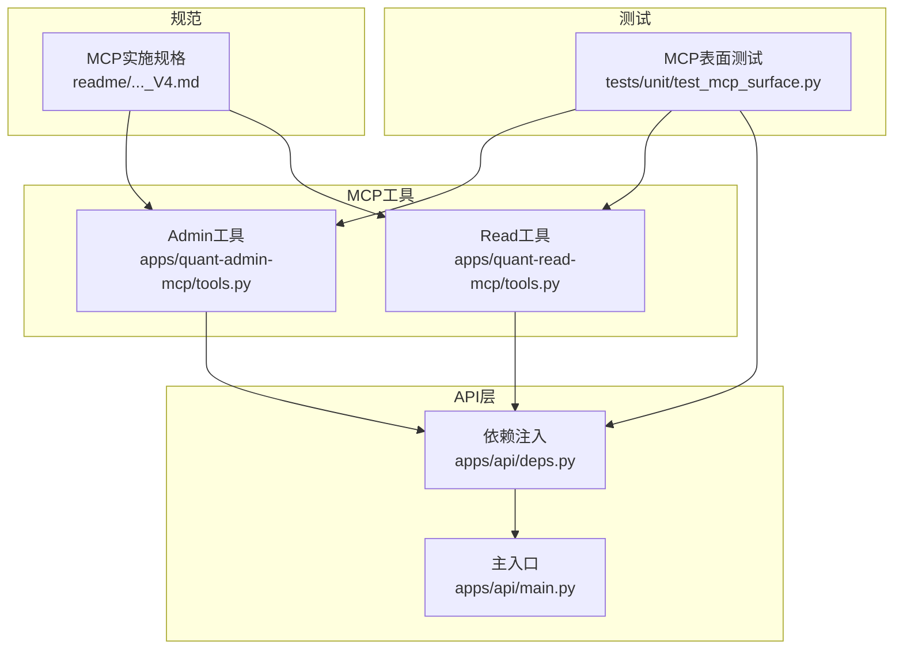
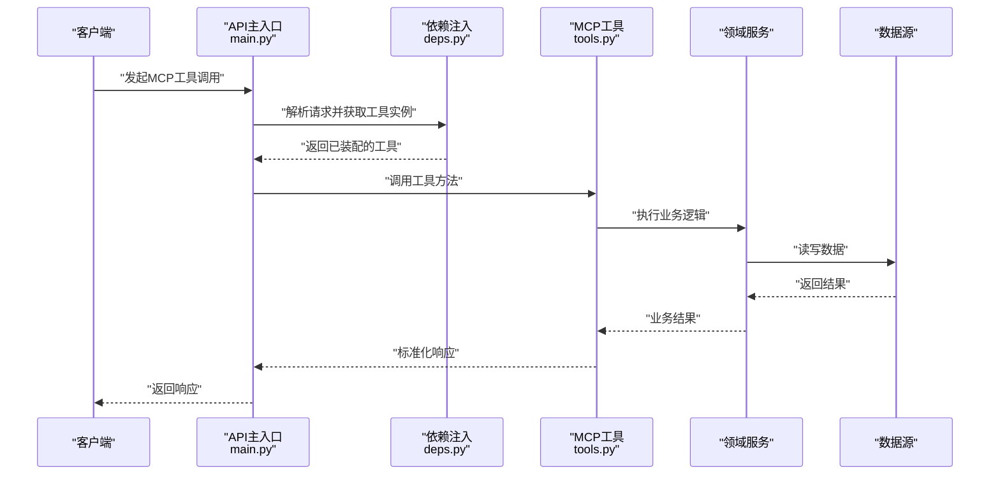
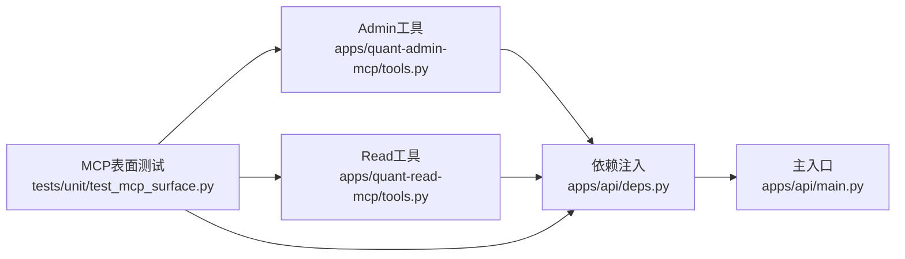

# MCP工具开发

<cite>
**本文引用的文件**   
- [apps/quant-admin-mcp/tools.py](file://apps/quant-admin-mcp/tools.py)
- [apps/quant-read-mcp/tools.py](file://apps/quant-read-mcp/tools.py)
- [tests/unit/test_mcp_surface.py](file://tests/unit/test_mcp_surface.py)
- [apps/api/deps.py](file://apps/api/deps.py)
- [apps/api/main.py](file://apps/api/main.py)
- [readme/A股美股基金量化Agent_Skill+MCP模块实施规格_V4.md](file://readme/A股美股基金量化Agent_Skill+MCP模块实施规格_V4.md)
</cite>

## 目录
1. [简介](#简介)
2. [项目结构](#项目结构)
3. [核心组件](#核心组件)
4. [架构总览](#架构总览)
5. [详细组件分析](#详细组件分析)
6. [依赖关系分析](#依赖关系分析)
7. [性能考虑](#性能考虑)
8. [故障排查指南](#故障排查指南)
9. [结论](#结论)
10. [附录](#附录)

## 简介
本指南面向在项目中开发与集成MCP（Model Context Protocol）工具的工程师，聚焦以下目标：
- 明确MCP工具的注册机制与实现模式，包括工具类定义、参数校验、错误处理与响应格式。
- 区分Admin工具与Read工具的职责边界、权限控制、数据访问模式与性能优化策略。
- 提供从简单查询到复杂数据分析的完整开发示例路径。
- 记录工具依赖注入的使用方法，涵盖服务获取、配置读取与外部资源访问。
- 给出工具测试最佳实践，包括单元测试、集成测试与Mock数据使用。

## 项目结构
仓库中与MCP工具直接相关的代码位于两个应用包中：
- Admin侧：apps/quant-admin-mcp/tools.py
- Read侧：apps/quant-read-mcp/tools.py
- 测试覆盖：tests/unit/test_mcp_surface.py
- API层依赖注入入口：apps/api/deps.py、apps/api/main.py
- 规范参考：readme/A股美股基金量化Agent_Skill+MCP模块实施规格_V4.md

图表来源
- [apps/quant-admin-mcp/tools.py](file://apps/quant-admin-mcp/tools.py)
- [apps/quant-read-mcp/tools.py](file://apps/quant-read-mcp/tools.py)
- [apps/api/deps.py](file://apps/api/deps.py)
- [apps/api/main.py](file://apps/api/main.py)
- [tests/unit/test_mcp_surface.py](file://tests/unit/test_mcp_surface.py)
- [readme/A股美股基金量化Agent_Skill+MCP模块实施规格_V4.md](file://readme/A股美股基金量化Agent_Skill+MCP模块实施规格_V4.md)

章节来源
- [apps/quant-admin-mcp/tools.py](file://apps/quant-admin-mcp/tools.py)
- [apps/quant-read-mcp/tools.py](file://apps/quant-read-mcp/tools.py)
- [apps/api/deps.py](file://apps/api/deps.py)
- [apps/api/main.py](file://apps/api/main.py)
- [tests/unit/test_mcp_surface.py](file://tests/unit/test_mcp_surface.py)
- [readme/A股美股基金量化Agent_Skill+MCP模块实施规格_V4.md](file://readme/A股美股基金量化Agent_Skill+MCP模块实施规格_V4.md)

## 核心组件
本节概述MCP工具的核心组成与职责划分：
- 工具类定义：每个工具以类或函数形式暴露能力，包含名称、描述、参数定义与执行逻辑。
- 参数验证：对输入进行类型、范围与业务约束校验，失败时返回明确的错误信息。
- 错误处理：统一捕获异常并转换为标准错误响应，避免泄露内部细节。
- 响应格式：遵循统一的响应信封结构，便于上层解析与展示。
- 依赖注入：通过依赖注入容器获取服务实例、配置项与外部资源，降低耦合度。
- 权限控制：Admin工具需鉴权与审计；Read工具通常只读且可公开或受限访问。

章节来源
- [apps/quant-admin-mcp/tools.py](file://apps/quant-admin-mcp/tools.py)
- [apps/quant-read-mcp/tools.py](file://apps/quant-read-mcp/tools.py)
- [apps/api/deps.py](file://apps/api/deps.py)
- [apps/api/main.py](file://apps/api/main.py)
- [tests/unit/test_mcp_surface.py](file://tests/unit/test_mcp_surface.py)
- [readme/A股美股基金量化Agent_Skill+MCP模块实施规格_V4.md](file://readme/A股美股基金量化Agent_Skill+MCP模块实施规格_V4.md)

## 架构总览
下图展示了MCP工具在系统中的位置与交互流程：客户端调用API，API层通过依赖注入装配工具，工具再访问领域服务与数据源。

图表来源
- [apps/api/main.py](file://apps/api/main.py)
- [apps/api/deps.py](file://apps/api/deps.py)
- [apps/quant-admin-mcp/tools.py](file://apps/quant-admin-mcp/tools.py)
- [apps/quant-read-mcp/tools.py](file://apps/quant-read-mcp/tools.py)

## 详细组件分析

### Admin工具与Read工具对比
- 职责边界
  - Admin工具：用于管理型操作，如写入、更新、删除、批量导入等，通常需要鉴权与审计。
  - Read工具：用于只读查询与分析，适合对外暴露或低权限场景。
- 权限控制
  - Admin工具应结合鉴权中间件与角色检查，确保仅授权用户可调用。
  - Read工具可按需限制访问范围（如按租户、市场、时间窗口）。
- 数据访问模式
  - Admin工具偏向事务性写操作，注意幂等性与回滚。
  - Read工具偏向高性能读，建议缓存、分页与索引优化。
- 性能优化
  - 读多写少场景优先优化查询路径，减少N+1问题，采用批处理与流式输出。
  - 写操作尽量异步化，避免阻塞主线程。

章节来源
- [apps/quant-admin-mcp/tools.py](file://apps/quant-admin-mcp/tools.py)
- [apps/quant-read-mcp/tools.py](file://apps/quant-read-mcp/tools.py)
- [readme/A股美股基金量化Agent_Skill+MCP模块实施规格_V4.md](file://readme/A股美股基金量化Agent_Skill+MCP模块实施规格_V4.md)

### 工具类定义与注册机制
- 工具类定义要点
  - 明确工具名称、版本、描述与参数Schema。
  - 将业务逻辑封装为独立方法，保持单一职责。
  - 使用依赖注入获取服务与配置，避免全局状态。
- 注册机制
  - 在API层集中注册工具，便于统一鉴权、限流与监控。
  - 支持动态发现与热加载，提升扩展性。
- 参数验证
  - 基于Schema进行强类型校验，拒绝非法输入。
  - 对枚举、范围、必填字段进行前置检查，尽早失败。
- 错误处理
  - 捕获领域异常与系统异常，映射为标准错误码与消息。
  - 记录必要上下文日志，不泄露敏感信息。
- 响应格式
  - 统一响应信封，包含状态、数据、元信息与追踪ID。
  - 分页、排序与过滤字段标准化，便于前端消费。

章节来源
- [apps/quant-admin-mcp/tools.py](file://apps/quant-admin-mcp/tools.py)
- [apps/quant-read-mcp/tools.py](file://apps/quant-read-mcp/tools.py)
- [apps/api/deps.py](file://apps/api/deps.py)
- [apps/api/main.py](file://apps/api/main.py)

### 依赖注入使用方法
- 服务获取
  - 通过依赖注入容器按需获取服务实例，避免硬编码。
  - 支持单例与作用域生命周期管理。
- 配置读取
  - 从配置中心或环境变量加载配置，支持多环境切换。
  - 对关键配置进行校验与默认值兜底。
- 外部资源访问
  - 数据库连接池、缓存、消息队列等外部资源通过注入获得。
  - 连接与资源释放由容器统一管理，防止泄漏。

章节来源
- [apps/api/deps.py](file://apps/api/deps.py)
- [apps/api/main.py](file://apps/api/main.py)

### 工具开发示例路径
- 简单查询工具
  - 目标：根据条件返回基础数据列表。
  - 关键点：参数校验、分页、缓存命中、标准化响应。
- 复杂数据分析工具
  - 目标：聚合计算、跨表关联、统计指标生成。
  - 关键点：批处理、流式输出、异步任务、结果持久化。
- 管理型工具
  - 目标：批量导入、状态变更、审计记录。
  - 关键点：事务、幂等、重试、补偿。

章节来源
- [apps/quant-admin-mcp/tools.py](file://apps/quant-admin-mcp/tools.py)
- [apps/quant-read-mcp/tools.py](file://apps/quant-read-mcp/tools.py)
- [tests/unit/test_mcp_surface.py](file://tests/unit/test_mcp_surface.py)

### 测试最佳实践
- 单元测试
  - 针对工具方法编写用例，覆盖正常路径与异常分支。
  - 使用Mock隔离外部依赖（数据库、缓存、网络）。
- 集成测试
  - 端到端验证API到工具的完整链路。
  - 使用测试数据库与固定数据集保证可重复性。
- Mock数据
  - 构造典型与边界用例的数据集。
  - 使用Golden File对比稳定输出。

章节来源
- [tests/unit/test_mcp_surface.py](file://tests/unit/test_mcp_surface.py)

## 依赖关系分析
下图展示MCP工具与API层、测试之间的依赖关系。

图表来源
- [apps/quant-admin-mcp/tools.py](file://apps/quant-admin-mcp/tools.py)
- [apps/quant-read-mcp/tools.py](file://apps/quant-read-mcp/tools.py)
- [apps/api/deps.py](file://apps/api/deps.py)
- [apps/api/main.py](file://apps/api/main.py)
- [tests/unit/test_mcp_surface.py](file://tests/unit/test_mcp_surface.py)

章节来源
- [apps/quant-admin-mcp/tools.py](file://apps/quant-admin-mcp/tools.py)
- [apps/quant-read-mcp/tools.py](file://apps/quant-read-mcp/tools.py)
- [apps/api/deps.py](file://apps/api/deps.py)
- [apps/api/main.py](file://apps/api/main.py)
- [tests/unit/test_mcp_surface.py](file://tests/unit/test_mcp_surface.py)

## 性能考虑
- 读路径优化
  - 合理使用索引与投影，减少不必要字段传输。
  - 引入多级缓存（本地+分布式），设置合理TTL与失效策略。
- 写路径优化
  - 批量写入与事务合并，降低IO次数。
  - 异步化处理耗时任务，避免阻塞请求线程。
- 并发与限流
  - 对热点接口实施令牌桶或滑动窗口限流。
  - 使用连接池与线程池提高吞吐。
- 监控与可观测性
  - 埋点关键指标（延迟、错误率、QPS）。
  - 结构化日志与追踪ID贯穿调用链。

[本节为通用指导，无需特定文件引用]

## 故障排查指南
- 常见问题定位
  - 参数校验失败：检查Schema与输入类型，确认必填字段与取值范围。
  - 权限不足：核对鉴权中间件与角色配置，确认用户会话有效。
  - 数据不一致：查看事务边界与幂等键，确认上游数据源一致性。
- 日志与追踪
  - 在关键路径打印上下文信息，包含请求ID、用户ID、时间戳。
  - 使用分布式追踪串联跨服务调用。
- 快速恢复
  - 启用熔断与降级策略，保护核心链路。
  - 对可重试操作实现指数退避与最大重试次数。

章节来源
- [apps/api/deps.py](file://apps/api/deps.py)
- [apps/api/main.py](file://apps/api/main.py)
- [tests/unit/test_mcp_surface.py](file://tests/unit/test_mcp_surface.py)

## 结论
通过清晰的职责划分、严格的参数校验、统一的错误处理与响应格式、完善的依赖注入与测试体系，MCP工具能够在Admin与Read两类场景中稳定高效地提供服务。建议在开发过程中严格遵循规范文档，持续优化性能与可观测性，保障系统的可扩展性与可靠性。

[本节为总结性内容，无需特定文件引用]

## 附录
- 规范参考
  - 阅读“MCP实施规格”文档，了解协议约定、命名规范与最佳实践。
- 示例清单
  - 简单查询工具：按条件检索、分页、缓存命中。
  - 复杂分析工具：聚合计算、批处理、异步任务。
  - 管理型工具：批量导入、状态变更、审计记录。

章节来源
- [readme/A股美股基金量化Agent_Skill+MCP模块实施规格_V4.md](file://readme/A股美股基金量化Agent_Skill+MCP模块实施规格_V4.md)