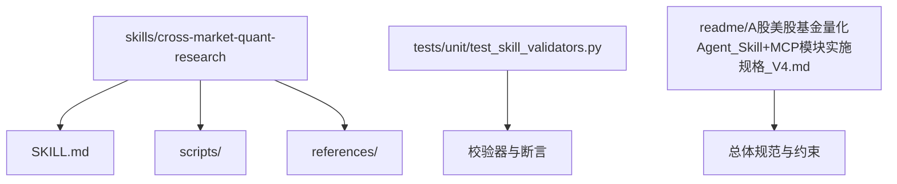
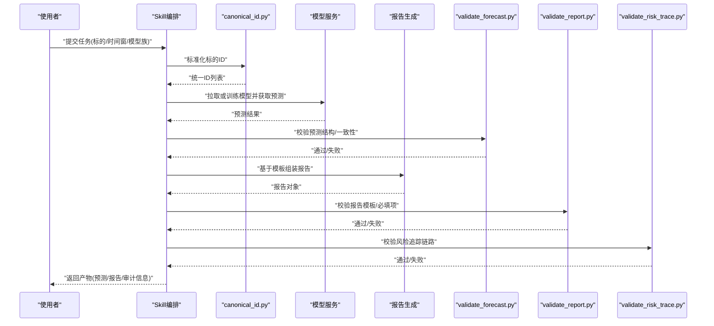
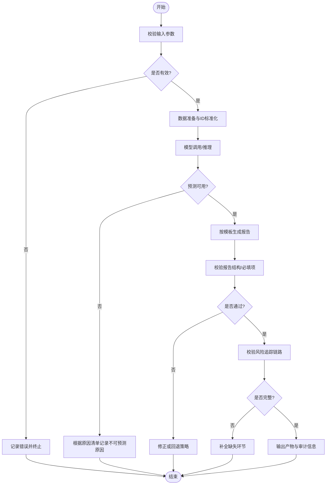
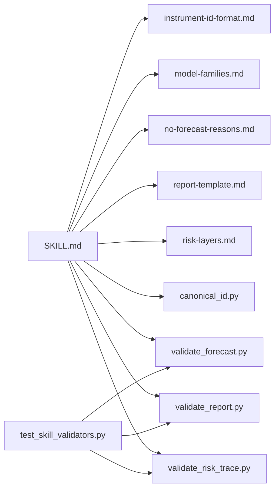

# Skill技能开发

<cite>
**本文引用的文件**   
- [SKILL.md](file://skills/cross-market-quant-research/SKILL.md)
- [canonical_id.py](file://skills/cross-market-quant-research/scripts/canonical_id.py)
- [validate_forecast.py](file://skills/cross-market-quant-research/scripts/validate_forecast.py)
- [validate_report.py](file://skills/cross-market-quant-research/scripts/validate_report.py)
- [validate_risk_trace.py](file://skills/cross-market-quant-research/scripts/validate_risk_trace.py)
- [instrument-id-format.md](file://skills/cross-market-quant-research/references/instrument-id-format.md)
- [model-families.md](file://skills/cross-market-quant-research/references/model-families.md)
- [no-forecast-reasons.md](file://skills/cross-market-quant-research/references/no-forecast-reasons.md)
- [report-template.md](file://skills/cross-market-quant-research/references/report-template.md)
- [risk-layers.md](file://skills/cross-market-quant-research/references/risk-layers.md)
- [test_skill_validators.py](file://tests/unit/test_skill_validators.py)
- [README.md](file://readme/A股美股基金量化Agent_Skill+MCP模块实施规格_V4.md)
</cite>

## 目录
1. [简介](#简介)
2. [项目结构](#项目结构)
3. [核心组件](#核心组件)
4. [架构总览](#架构总览)
5. [详细组件分析](#详细组件分析)
6. [依赖分析](#依赖分析)
7. [性能考虑](#性能考虑)
8. [故障排查指南](#故障排查指南)
9. [结论](#结论)
10. [附录](#附录)

## 简介
本指南面向希望在跨市场量化研究场景中构建与交付“Skill”的工程师与研究者。内容覆盖：
- Skill的定义结构与描述语法（元数据、执行上下文、依赖声明）
- 执行流程设计（输入验证、逻辑编排、输出格式化）
- 跨市场量化研究的实现示例（数据准备、模型调用、报告生成）
- 脚本集成最佳实践（Python封装、环境变量配置、错误处理）
- 测试与验证方法（功能、性能、兼容性）
- 打包与分发流程（版本管理、依赖解析、安装部署）

## 项目结构
仓库采用按领域与能力分层的组织方式，Skill位于 skills 目录下，配套参考文档在 references，可执行脚本在 scripts；单元测试位于 tests/unit，包含针对Skill校验器的测试用例。

图示来源
- [SKILL.md](file://skills/cross-market-quant-research/SKILL.md)
- [canonical_id.py](file://skills/cross-market-quant-research/scripts/canonical_id.py)
- [validate_forecast.py](file://skills/cross-market-quant-research/scripts/validate_forecast.py)
- [validate_report.py](file://skills/cross-market-quant-research/scripts/validate_report.py)
- [validate_risk_trace.py](file://skills/cross-market-quant-research/scripts/validate_risk_trace.py)
- [instrument-id-format.md](file://skills/cross-market-quant-research/references/instrument-id-format.md)
- [model-families.md](file://skills/cross-market-quant-research/references/model-families.md)
- [no-forecast-reasons.md](file://skills/cross-market-quant-research/references/no-forecast-reasons.md)
- [report-template.md](file://skills/cross-market-quant-research/references/report-template.md)
- [risk-layers.md](file://skills/cross-market-quant-research/references/risk-layers.md)
- [test_skill_validators.py](file://tests/unit/test_skill_validators.py)
- [README.md](file://readme/A股美股基金量化Agent_Skill+MCP模块实施规格_V4.md)

章节来源
- [SKILL.md](file://skills/cross-market-quant-research/SKILL.md)
- [test_skill_validators.py](file://tests/unit/test_skill_validators.py)
- [README.md](file://readme/A股美股基金量化Agent_Skill+MCP模块实施规格_V4.md)

## 核心组件
- Skill定义与描述
  - SKILL.md 作为技能的入口说明，承载技能名称、版本、目标、输入输出契约、依赖与环境变量等元数据，以及执行步骤与参考链接。
- 参考文档
  - instrument-id-format.md：统一标的ID格式规范
  - model-families.md：模型族分类与选择建议
  - no-forecast-reasons.md：无法产出预测的原因清单
  - report-template.md：报告模板与字段约定
  - risk-layers.md：风险分层与指标口径
- 可执行脚本
  - canonical_id.py：将多源标的标识规范化为统一ID
  - validate_forecast.py：校验预测结果的结构与一致性
  - validate_report.py：校验报告是否符合模板与必填项
  - validate_risk_trace.py：校验风险追踪链路与完整性
- 测试
  - test_skill_validators.py：对校验器进行单元级验证，覆盖正常路径与异常分支

章节来源
- [SKILL.md](file://skills/cross-market-quant-research/SKILL.md)
- [instrument-id-format.md](file://skills/cross-market-quant-research/references/instrument-id-format.md)
- [model-families.md](file://skills/cross-market-quant-research/references/model-families.md)
- [no-forecast-reasons.md](file://skills/cross-market-quant-research/references/no-forecast-reasons.md)
- [report-template.md](file://skills/cross-market-quant-research/references/report-template.md)
- [risk-layers.md](file://skills/cross-market-quant-research/references/risk-layers.md)
- [canonical_id.py](file://skills/cross-market-quant-research/scripts/canonical_id.py)
- [validate_forecast.py](file://skills/cross-market-quant-research/scripts/validate_forecast.py)
- [validate_report.py](file://skills/cross-market-quant-research/scripts/validate_report.py)
- [validate_risk_trace.py](file://skills/cross-market-quant-research/scripts/validate_risk_trace.py)
- [test_skill_validators.py](file://tests/unit/test_skill_validators.py)

## 架构总览
下图展示了跨市场量化研究Skill的典型执行流：从输入参数与上下文到数据准备、模型调用、报告生成与校验，最终输出结构化产物。

图示来源
- [SKILL.md](file://skills/cross-market-quant-research/SKILL.md)
- [canonical_id.py](file://skills/cross-market-quant-research/scripts/canonical_id.py)
- [validate_forecast.py](file://skills/cross-market-quant-research/scripts/validate_forecast.py)
- [validate_report.py](file://skills/cross-market-quant-research/scripts/validate_report.py)
- [validate_risk_trace.py](file://skills/cross-market-quant-research/scripts/validate_risk_trace.py)
- [report-template.md](file://skills/cross-market-quant-research/references/report-template.md)

## 详细组件分析

### Skill定义与描述语法
- 元数据
  - 名称、版本、作者、许可证、适用场景、输入输出契约、依赖环境、环境变量清单、参考文档索引。
- 执行上下文
  - 运行时的输入参数、中间产物位置、日志与审计输出、资源配额与超时。
- 依赖声明
  - Python包、外部服务、数据源、模型权重与缓存目录、系统工具。
- 参考文档
  - 使用 references 下的Markdown文件作为权威依据，确保术语、口径与模板一致。

章节来源
- [SKILL.md](file://skills/cross-market-quant-research/SKILL.md)
- [instrument-id-format.md](file://skills/cross-market-quant-research/references/instrument-id-format.md)
- [model-families.md](file://skills/cross-market-quant-research/references/model-families.md)
- [no-forecast-reasons.md](file://skills/cross-market-quant-research/references/no-forecast-reasons.md)
- [report-template.md](file://skills/cross-market-quant-research/references/report-template.md)
- [risk-layers.md](file://skills/cross-market-quant-research/references/risk-layers.md)

### 执行流程设计与编排
- 输入验证
  - 参数类型、取值范围、必填项、跨字段一致性检查。
- 逻辑编排
  - 顺序/并行阶段划分、幂等性、重试与退避、失败快速返回。
- 输出格式化
  - 遵循 report-template.md 的字段与结构，保证下游消费稳定。

图示来源
- [validate_forecast.py](file://skills/cross-market-quant-research/scripts/validate_forecast.py)
- [validate_report.py](file://skills/cross-market-quant-research/scripts/validate_report.py)
- [validate_risk_trace.py](file://skills/cross-market-quant-research/scripts/validate_risk_trace.py)
- [no-forecast-reasons.md](file://skills/cross-market-quant-research/references/no-forecast-reasons.md)
- [report-template.md](file://skills/cross-market-quant-research/references/report-template.md)

章节来源
- [validate_forecast.py](file://skills/cross-market-quant-research/scripts/validate_forecast.py)
- [validate_report.py](file://skills/cross-market-quant-research/scripts/validate_report.py)
- [validate_risk_trace.py](file://skills/cross-market-quant-research/scripts/validate_risk_trace.py)
- [no-forecast-reasons.md](file://skills/cross-market-quant-research/references/no-forecast-reasons.md)
- [report-template.md](file://skills/cross-market-quant-research/references/report-template.md)

### 脚本集成最佳实践
- Python脚本封装
  - 单一职责：每个脚本聚焦一个校验或转换任务，便于复用与测试。
  - 输入输出：以标准输入/文件或JSON形式交换数据，避免隐式状态。
  - 返回值：明确成功/失败码与错误消息，便于上层编排。
- 环境变量配置
  - 敏感信息（密钥、端点）通过环境变量注入，不在代码中硬编码。
  - 提供默认值与校验，启动时打印必要的环境摘要用于排障。
- 错误处理
  - 区分可重试与不可重试错误，记录结构化日志与堆栈。
  - 对第三方依赖设置超时与降级策略。

章节来源
- [canonical_id.py](file://skills/cross-market-quant-research/scripts/canonical_id.py)
- [validate_forecast.py](file://skills/cross-market-quant-research/scripts/validate_forecast.py)
- [validate_report.py](file://skills/cross-market-quant-research/scripts/validate_report.py)
- [validate_risk_trace.py](file://skills/cross-market-quant-research/scripts/validate_risk_trace.py)

### 跨市场量化研究示例
- 数据准备
  - 使用 instrument-id-format.md 统一多市场标的ID，避免歧义。
  - 通过 canonical_id.py 完成清洗与映射。
- 模型调用
  - 依据 model-families.md 选择合适的模型族与路由策略。
  - 若不可预测，按 no-forecast-reasons.md 记录原因。
- 报告生成
  - 基于 report-template.md 组装报告，并通过 validate_report.py 校验。
  - 结合 risk-layers.md 计算并写入风险分层指标。

章节来源
- [instrument-id-format.md](file://skills/cross-market-quant-research/references/instrument-id-format.md)
- [model-families.md](file://skills/cross-market-quant-research/references/model-families.md)
- [no-forecast-reasons.md](file://skills/cross-market-quant-research/references/no-forecast-reasons.md)
- [report-template.md](file://skills/cross-market-quant-research/references/report-template.md)
- [risk-layers.md](file://skills/cross-market-quant-research/references/risk-layers.md)
- [canonical_id.py](file://skills/cross-market-quant-research/scripts/canonical_id.py)
- [validate_forecast.py](file://skills/cross-market-quant-research/scripts/validate_forecast.py)
- [validate_report.py](file://skills/cross-market-quant-research/scripts/validate_report.py)

### 测试与验证方法
- 功能测试
  - 使用 test_skill_validators.py 对校验器进行断言，覆盖正常与异常路径。
- 性能测试
  - 对关键脚本进行基准测试，关注I/O与网络调用耗时。
- 兼容性检查
  - 在不同Python版本与依赖版本下回归运行，确保行为一致。

章节来源
- [test_skill_validators.py](file://tests/unit/test_skill_validators.py)

### 打包与分发流程
- 版本管理
  - 在 SKILL.md 中维护版本号与变更日志，保持向后兼容。
- 依赖解析
  - 列出Python包与外部服务依赖，提供最小化requirements或pyproject配置。
- 安装部署
  - 提供一键安装脚本或容器镜像，自动创建必要的目录与权限。
  - 预置环境变量模板与默认配置文件，减少上手成本。

章节来源
- [SKILL.md](file://skills/cross-market-quant-research/SKILL.md)

## 依赖分析
Skill内部依赖关系如下：
- SKILL.md 作为编排入口，引用 references 中的规范与模板。
- scripts 中的脚本被编排调用，彼此间通过输入输出契约协作。
- tests/unit 中的测试用例对脚本行为进行断言。

图示来源
- [SKILL.md](file://skills/cross-market-quant-research/SKILL.md)
- [instrument-id-format.md](file://skills/cross-market-quant-research/references/instrument-id-format.md)
- [model-families.md](file://skills/cross-market-quant-research/references/model-families.md)
- [no-forecast-reasons.md](file://skills/cross-market-quant-research/references/no-forecast-reasons.md)
- [report-template.md](file://skills/cross-market-quant-research/references/report-template.md)
- [risk-layers.md](file://skills/cross-market-quant-research/references/risk-layers.md)
- [canonical_id.py](file://skills/cross-market-quant-research/scripts/canonical_id.py)
- [validate_forecast.py](file://skills/cross-market-quant-research/scripts/validate_forecast.py)
- [validate_report.py](file://skills/cross-market-quant-research/scripts/validate_report.py)
- [validate_risk_trace.py](file://skills/cross-market-quant-research/scripts/validate_risk_trace.py)
- [test_skill_validators.py](file://tests/unit/test_skill_validators.py)

章节来源
- [SKILL.md](file://skills/cross-market-quant-research/SKILL.md)
- [test_skill_validators.py](file://tests/unit/test_skill_validators.py)

## 性能考虑
- I/O优化
  - 批量读取与写入，减少磁盘与网络往返次数。
- 并发控制
  - 对独立子任务采用线程/进程池并发，限制最大并发度以避免资源争用。
- 缓存与幂等
  - 对中间结果与模型输出进行缓存，支持幂等重放。
- 监控与度量
  - 记录关键阶段的耗时与错误率，便于定位瓶颈。

## 故障排查指南
- 常见问题
  - 环境变量缺失或格式错误：检查启动日志与默认值。
  - 标的ID不一致：核对 instrument-id-format.md 并使用 canonical_id.py 统一。
  - 预测不可用：对照 no-forecast-reasons.md 定位原因。
  - 报告不合规：使用 validate_report.py 逐项修复必填项与结构。
  - 风险链路不完整：使用 validate_risk_trace.py 检查缺失环节。
- 调试技巧
  - 开启详细日志与结构化错误码，保留输入快照与中间产物以便复现。
  - 使用最小数据集进行回归验证，逐步扩大范围。

章节来源
- [instrument-id-format.md](file://skills/cross-market-quant-research/references/instrument-id-format.md)
- [no-forecast-reasons.md](file://skills/cross-market-quant-research/references/no-forecast-reasons.md)
- [validate_report.py](file://skills/cross-market-quant-research/scripts/validate_report.py)
- [validate_risk_trace.py](file://skills/cross-market-quant-research/scripts/validate_risk_trace.py)

## 结论
通过统一的Skill定义、严格的输入输出契约、完善的校验与测试，以及清晰的打包分发流程，可以在跨市场量化研究中实现高可靠、可复现与可维护的自动化流水线。建议持续完善参考文档与脚本，保持版本演进的可追溯性与兼容性。

## 附录
- 参考规范
  - 详见 readme/A股美股基金量化Agent_Skill+MCP模块实施规格_V4.md 中的整体约束与接口约定。

章节来源
- [README.md](file://readme/A股美股基金量化Agent_Skill+MCP模块实施规格_V4.md)