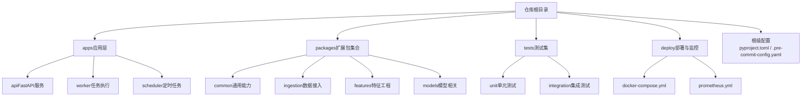
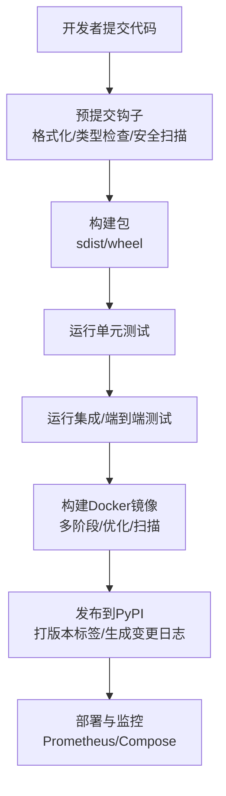
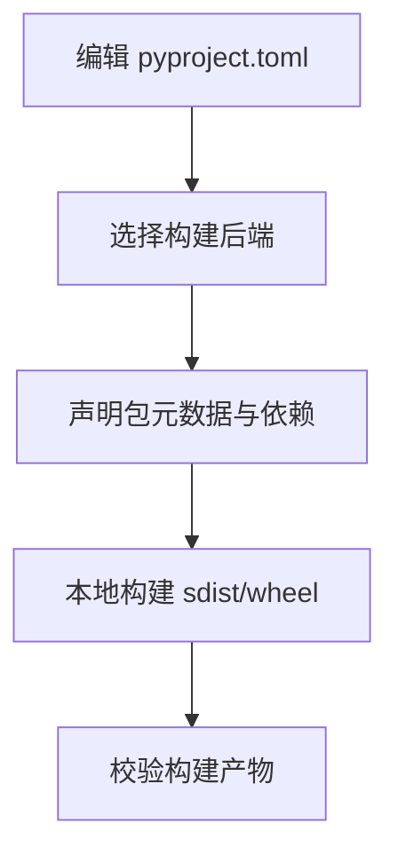
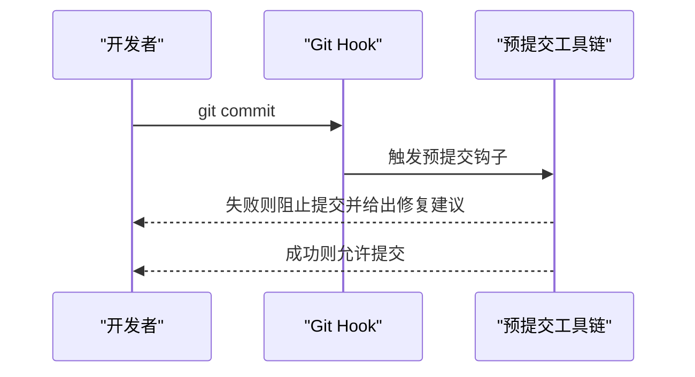
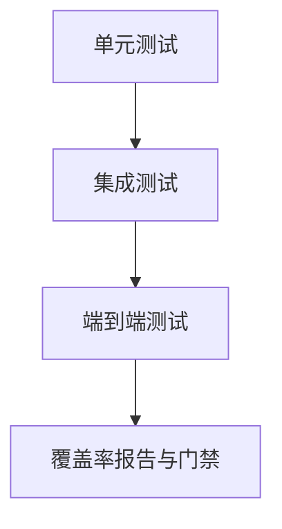
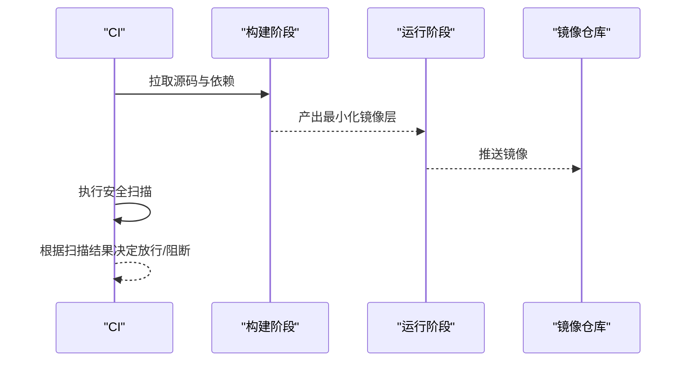
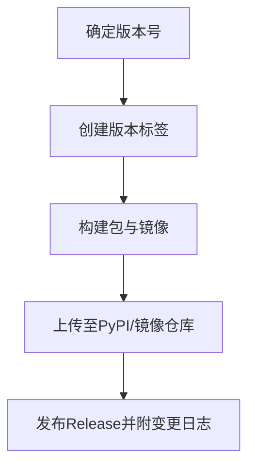
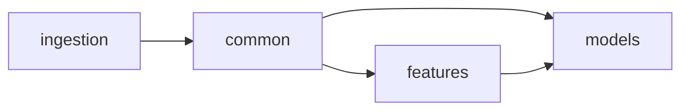

# 包发布与分发

<cite>
**本文引用的文件**   
- [pyproject.toml](file://pyproject.toml)
- [.pre-commit-config.yaml](file://.pre-commit-config.yaml)
- [README.md](file://README.md)
- [docker-compose.yml](file://deploy/docker-compose.yml)
- [prometheus.yml](file://deploy/prometheus.yml)
- [conftest.py](file://tests/conftest.py)
- [test_e2e_pipeline.py](file://tests/integration/test_e2e_pipeline.py)
</cite>

## 目录
1. [简介](#简介)
2. [项目结构](#项目结构)
3. [核心组件](#核心组件)
4. [架构总览](#架构总览)
5. [详细组件分析](#详细组件分析)
6. [依赖分析](#依赖分析)
7. [性能考虑](#性能考虑)
8. [故障排查指南](#故障排查指南)
9. [结论](#结论)
10. [附录](#附录)

## 简介
本指南面向希望将本项目中的Python扩展包进行打包、质量保障、测试、Docker化以及发布的工程团队。内容覆盖：
- Python包的打包流程（项目结构组织、依赖声明、版本管理）
- 代码质量检查配置（预提交钩子、格式化、静态分析）
- Docker镜像构建（多阶段构建、优化与安全扫描）
- 测试策略（单元测试覆盖率、集成测试、端到端测试）
- 发布流程（PyPI上传、版本标签、变更日志）
- 维护指南（依赖更新、安全补丁、向后兼容性管理）

## 项目结构
仓库采用“应用+包”的复合结构：
- apps：业务应用（API、调度器、Worker、MCP工具等）
- packages：可复用的Python扩展包集合（如audit、backtest、features等）
- tests：单元/集成/端到端测试
- deploy：部署编排与监控配置
- 根级配置文件：pyproject.toml、.pre-commit-config.yaml、README.md

[本节为概念性说明，不直接分析具体文件，故无章节来源]

## 核心组件
- 包定义与元数据：通过根级pyproject.toml集中声明包名、版本、依赖、入口点与构建后端。
- 代码质量：通过.pre-commit-config.yaml统一格式化、类型检查、安全扫描等钩子。
- 测试体系：tests下按unit/integration分层，conftest提供共享夹具，集成用例覆盖端到端流水线。
- 部署编排：deploy下的docker-compose与prometheus用于本地/CI环境编排与指标采集。

**章节来源**
- [pyproject.toml](file://pyproject.toml)
- [.pre-commit-config.yaml](file://.pre-commit-config.yaml)
- [conftest.py](file://tests/conftest.py)
- [test_e2e_pipeline.py](file://tests/integration/test_e2e_pipeline.py)
- [docker-compose.yml](file://deploy/docker-compose.yml)
- [prometheus.yml](file://deploy/prometheus.yml)

## 架构总览
下图展示从开发到发布的整体流水线：本地编码→预提交检查→构建与测试→镜像构建→发布到PyPI并打标签。

[本节为概念性说明，不直接分析具体文件，故无图示来源]

## 详细组件分析

### 包定义与打包（pyproject.toml）
- 作用：声明包名称、版本、描述、作者、许可证、依赖、可选依赖、构建后端、包发现规则、脚本入口等。
- 建议实践：
  - 使用PEP 621风格在pyproject.toml中集中管理元数据与依赖。
  - 明确指定构建后端（如setuptools或hatch），并确保与CI一致。
  - 对packages下的每个子包分别定义独立元数据（若采用多包发布）。
  - 使用约束明确的依赖范围，避免引入不必要的运行时依赖。
  - 将构建产物输出至标准目录（如dist/），便于后续步骤消费。

**章节来源**
- [pyproject.toml](file://pyproject.toml)

### 代码质量检查（.pre-commit-config.yaml）
- 作用：在git commit前自动执行格式化、类型检查、导入排序、安全扫描等，保证代码一致性。
- 建议实践：
  - 启用主流工具链（如ruff/isort/black/mypy/pylint等），并在CI中复用相同配置。
  - 针对packages目录单独配置排除/包含规则，提升性能。
  - 将严重级别较高的检查设为阻断，低级别作为提示。
  - 定期升级钩子版本，修复已知问题。

**章节来源**
- [.pre-commit-config.yaml](file://.pre-commit-config.yaml)

### 测试策略（tests）
- 分层：
  - 单元测试：针对函数/类/模块行为，快速且隔离。
  - 集成测试：验证子系统协作（如数据接入、存储、外部依赖模拟）。
  - 端到端测试：模拟真实用户场景，覆盖关键业务流程。
- 共享夹具：conftest.py提供数据库、配置、假数据等公共资源。
- 覆盖率：建议在CI中收集覆盖率并设置阈值。

**章节来源**
- [conftest.py](file://tests/conftest.py)
- [test_e2e_pipeline.py](file://tests/integration/test_e2e_pipeline.py)

### Docker镜像构建与优化（deploy）
- docker-compose.yml：定义服务、网络、卷、环境变量，便于本地与CI一键拉起。
- prometheus.yml：采集关键指标，辅助定位问题与容量规划。
- 多阶段构建建议：
  - 构建阶段：安装构建依赖、编译C扩展、生成缓存。
  - 运行阶段：仅拷贝必要产物，使用非root用户，精简基础镜像。
- 安全扫描：在镜像构建后执行漏洞扫描（如Trivy/Snyk），阻断高危漏洞。

**章节来源**
- [docker-compose.yml](file://deploy/docker-compose.yml)
- [prometheus.yml](file://deploy/prometheus.yml)

### 发布流程（PyPI、版本标签、变更日志）
- 版本管理：
  - 使用语义化版本（SemVer），在pyproject.toml或专用版本文件中统一管理。
  - 通过CI在合并主干后自动生成变更日志条目。
- PyPI上传：
  - 使用可信发布（如twine upload）或平台原生发布（GitHub Actions PyPI发布）。
  - 开启双因素认证与受限令牌，限制访问权限。
- 版本标签：
  - 在发布成功后打tag（如vX.Y.Z），并关联对应变更日志。
- 变更日志：
  - 采用Keep a Changelog格式，分类记录新增、修复、破坏性变更。

[本节为概念性说明，不直接分析具体文件，故无图示来源]

### 维护指南（依赖更新、安全补丁、向后兼容）
- 依赖更新：
  - 定期扫描依赖漏洞，优先修复高危及严重问题。
  - 使用锁定文件（如pip-tools/poetry/uv）确保可重现构建。
- 安全补丁：
  - 建立安全告警通道，及时评估影响面并制定回滚方案。
- 向后兼容：
  - 遵循SemVer，破坏性变更需升主版本并提供迁移指南。
  - 在CI中增加兼容性矩阵测试（不同Python/系统版本）。

[本节为概念性说明，不直接分析具体文件，故无章节来源]

## 依赖分析
- 包内依赖关系：
  - packages/common通常被其他包引用，应保持稳定接口。
  - ingestion/features/models等包之间可能存在单向依赖，避免循环依赖。
- 外部依赖：
  - 区分运行时依赖与开发/测试依赖，减少生产镜像体积。
  - 对关键第三方库进行版本锁定与白名单管理。

[本节为概念性说明，不直接分析具体文件，故无图示来源]

## 性能考虑
- 构建优化：
  - 利用构建缓存（依赖层、wheel缓存）缩短CI时间。
  - 并行构建多个包（若为多包发布）。
- 镜像优化：
  - 使用多阶段构建与精简基础镜像（如alpine/slim变体）。
  - 合并RUN指令、清理临时文件、避免复制无关文件。
- 测试加速：
  - 并行运行测试套件，分离慢用例到独立作业。
  - 使用并发数据库连接池与内存数据库（如SQLite）加速单测。

[本节为概念性说明，不直接分析具体文件，故无章节来源]

## 故障排查指南
- 预提交失败：
  - 查看具体工具输出，定位格式/类型/安全问题并按提示修复。
- 构建失败：
  - 检查pyproject.toml元数据与依赖解析；确认构建后端可用。
  - 在干净环境中复现，避免本地缓存干扰。
- 测试失败：
  - 检查conftest夹具初始化与外部依赖（数据库、消息队列）状态。
  - 对端到端用例，确认网络连通性与外部服务可用性。
- 镜像问题：
  - 检查多阶段COPY路径与权限；确认非root用户具备必要读写权限。
  - 使用镜像历史命令定位大体积层。

**章节来源**
- [.pre-commit-config.yaml](file://.pre-commit-config.yaml)
- [pyproject.toml](file://pyproject.toml)
- [conftest.py](file://tests/conftest.py)
- [docker-compose.yml](file://deploy/docker-compose.yml)

## 结论
通过统一的包定义、严格的代码质量门禁、分层测试、优化的镜像构建与规范的发布流程，可以显著提升扩展包的可靠性与可维护性。建议将上述流程固化到CI中，形成自动化流水线，持续交付高质量包与镜像。

[本节为总结性内容，不直接分析具体文件，故无章节来源]

## 附录
- 参考文档：
  - README.md：项目背景与使用说明，可作为发布说明的素材来源。
- 常用命令（示例，实际以工具链为准）：
  - 构建包：使用所选构建后端生成sdist/wheel。
  - 本地测试：运行单元测试与集成测试，生成覆盖率报告。
  - 构建镜像：基于Dockerfile构建并推送镜像仓库。
  - 发布PyPI：上传构建产物并打版本标签。

**章节来源**
- [README.md](file://README.md)