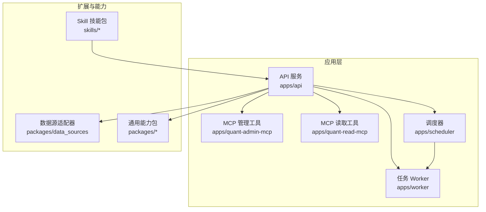
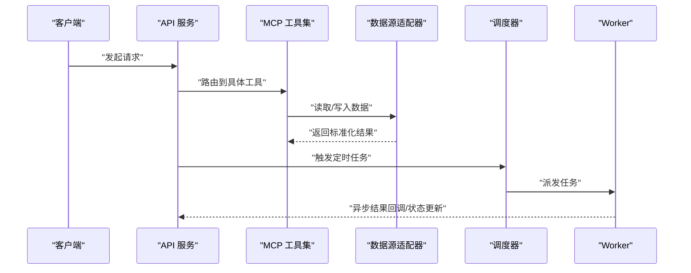
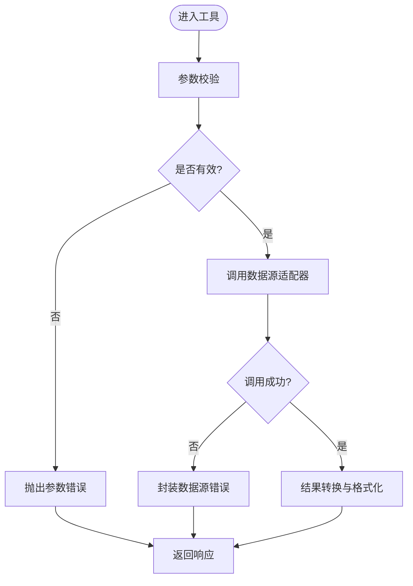
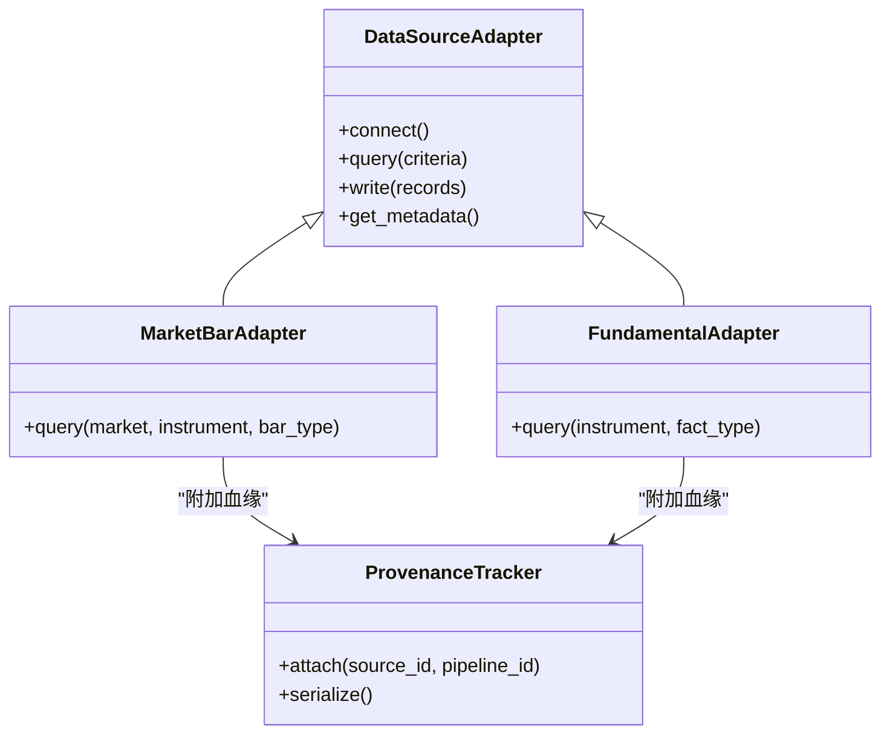
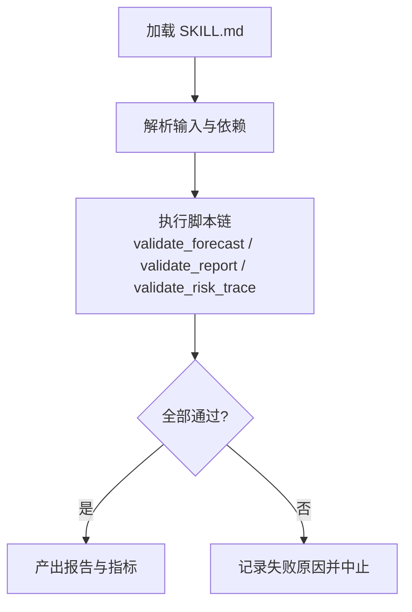
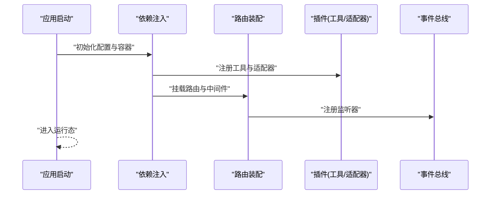
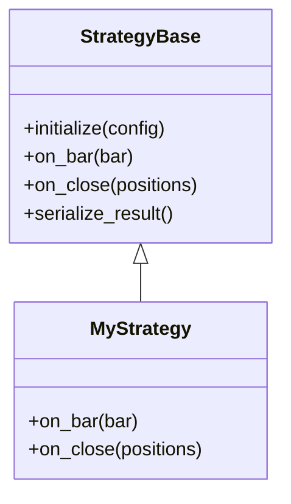
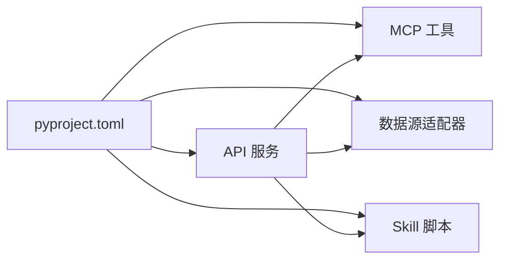

# 扩展开发指南

<cite>
**本文引用的文件**   
- [apps/quant-admin-mcp/tools.py](file://apps/quant-admin-mcp/tools.py)
- [apps/quant-read-mcp/tools.py](file://apps/quant-read-mcp/tools.py)
- [tests/unit/test_mcp_surface.py](file://tests/unit/test_mcp_surface.py)
- [packages/data_sources](file://packages/data_sources)
- [tests/unit/test_adapter_transforms.py](file://tests/unit/test_adapter_transforms.py)
- [tests/unit/test_adapter_provenance.py](file://tests/unit/test_adapter_provenance.py)
- [skills/cross-market-quant-research/SKILL.md](file://skills/cross-market-quant-research/SKILL.md)
- [skills/cross-market-quant-research/scripts/validate_forecast.py](file://skills/cross-market-quant-research/scripts/validate_forecast.py)
- [skills/cross-market-quant-research/scripts/validate_report.py](file://skills/cross-market-quant-research/scripts/validate_report.py)
- [skills/cross-market-quant-research/scripts/validate_risk_trace.py](file://skills/cross-market-quant-research/scripts/validate_risk_trace.py)
- [tests/unit/test_skill_validators.py](file://tests/unit/test_skill_validators.py)
- [apps/api/main.py](file://apps/api/main.py)
- [apps/api/deps.py](file://apps/api/deps.py)
- [apps/scheduler/schedule.py](file://apps/scheduler/schedule.py)
- [apps/worker/main.py](file://apps/worker/main.py)
- [apps/worker/tasks.py](file://apps/worker/tasks.py)
- [pyproject.toml](file://pyproject.toml)
</cite>

## 目录
1. [简介](#简介)
2. [项目结构](#项目结构)
3. [核心组件](#核心组件)
4. [架构总览](#架构总览)
5. [详细组件分析](#详细组件分析)
6. [依赖分析](#依赖分析)
7. [性能考虑](#性能考虑)
8. [故障排查指南](#故障排查指南)
9. [结论](#结论)
10. [附录](#附录)

## 简介
本指南面向希望在系统中进行扩展开发的工程师，覆盖以下主题：
- MCP 工具的注册与实现（工具定义、参数校验、错误处理）
- 数据源适配器的接口规范、数据转换与异常处理
- Skill 技能的开发模式（描述、执行逻辑、依赖管理）
- 插件架构的使用（生命周期、配置注入、事件监听）
- 自定义策略的模板（基类继承、方法重写、测试用例）
- 扩展包的打包与发布流程（依赖声明、版本管理、兼容性检查）

## 项目结构
仓库采用多应用与多包的组织方式：
- apps：运行期服务与入口（API、MCP、调度器、Worker）
- packages：领域能力与基础设施（数据源、特征、回测、评估等）
- skills：可复用的技能包（描述、脚本、参考文档）
- tests：单元与集成测试
- configs：配置
- sql/migrations：数据库迁移

图表来源
- [apps/api/main.py](file://apps/api/main.py)
- [apps/quant-admin-mcp/tools.py](file://apps/quant-admin-mcp/tools.py)
- [apps/quant-read-mcp/tools.py](file://apps/quant-read-mcp/tools.py)
- [apps/scheduler/schedule.py](file://apps/scheduler/schedule.py)
- [apps/worker/main.py](file://apps/worker/main.py)
- [packages/data_sources](file://packages/data_sources)

章节来源
- [apps/api/main.py](file://apps/api/main.py)
- [apps/quant-admin-mcp/tools.py](file://apps/quant-admin-mcp/tools.py)
- [apps/quant-read-mcp/tools.py](file://apps/quant-read-mcp/tools.py)
- [apps/scheduler/schedule.py](file://apps/scheduler/schedule.py)
- [apps/worker/main.py](file://apps/worker/main.py)
- [packages/data_sources](file://packages/data_sources)

## 核心组件
本节聚焦扩展点与关键入口：
- MCP 工具：在 quant-admin-mcp 与 quant-read-mcp 中定义并暴露给上层调用
- 数据源适配器：位于 packages/data_sources，提供统一的数据接入与转换
- Skill 技能：以 skills/cross-market-quant-research 为例，包含 SKILL.md 与验证脚本
- 插件化入口：API 服务通过 deps 与 main 装配各模块，调度与 Worker 协同工作

章节来源
- [apps/quant-admin-mcp/tools.py](file://apps/quant-admin-mcp/tools.py)
- [apps/quant-read-mcp/tools.py](file://apps/quant-read-mcp/tools.py)
- [packages/data_sources](file://packages/data_sources)
- [skills/cross-market-quant-research/SKILL.md](file://skills/cross-market-quant-research/SKILL.md)
- [apps/api/main.py](file://apps/api/main.py)
- [apps/api/deps.py](file://apps/api/deps.py)
- [apps/scheduler/schedule.py](file://apps/scheduler/schedule.py)
- [apps/worker/main.py](file://apps/worker/main.py)

## 架构总览
系统通过 API 服务聚合 MCP 工具、调度器与 Worker，底层由数据源适配器与各类 packages 提供能力。Skill 作为“可插拔”的工作流与校验集合，被上层编排使用。

图表来源
- [apps/api/main.py](file://apps/api/main.py)
- [apps/quant-admin-mcp/tools.py](file://apps/quant-admin-mcp/tools.py)
- [apps/quant-read-mcp/tools.py](file://apps/quant-read-mcp/tools.py)
- [packages/data_sources](file://packages/data_sources)
- [apps/scheduler/schedule.py](file://apps/scheduler/schedule.py)
- [apps/worker/main.py](file://apps/worker/main.py)

## 详细组件分析

### MCP 工具开发与注册
- 工具定义与注册位置
  - 管理端工具：apps/quant-admin-mcp/tools.py
  - 读取端工具：apps/quant-read-mcp/tools.py
- 参数校验与错误处理
  - 建议在工具入口处对输入参数进行强类型校验与约束检查
  - 明确错误分类（参数错误、权限错误、数据不可用、上游超时等），并返回结构化错误信息
- 测试要点
  - 使用单元测试覆盖正常路径与异常分支
  - 参考测试文件：tests/unit/test_mcp_surface.py

图表来源
- [apps/quant-admin-mcp/tools.py](file://apps/quant-admin-mcp/tools.py)
- [apps/quant-read-mcp/tools.py](file://apps/quant-read-mcp/tools.py)
- [tests/unit/test_mcp_surface.py](file://tests/unit/test_mcp_surface.py)

章节来源
- [apps/quant-admin-mcp/tools.py](file://apps/quant-admin-mcp/tools.py)
- [apps/quant-read-mcp/tools.py](file://apps/quant-read-mcp/tools.py)
- [tests/unit/test_mcp_surface.py](file://tests/unit/test_mcp_surface.py)

### 数据源适配器开发规范
- 接口规范
  - 统一抽象：定义标准接口（如连接、查询、写入、元数据获取）
  - 命名约定：按市场/品种维度组织适配器族
- 数据转换
  - 将不同来源的原始数据转换为内部标准模型
  - 保留数据来源与血缘信息，便于审计与回溯
- 异常处理
  - 区分网络异常、认证失败、数据缺失、格式不合法等
  - 向上抛出带上下文的异常，便于上层重试或降级
- 参考实现与测试
  - 实现位置：packages/data_sources
  - 转换与血缘测试：tests/unit/test_adapter_transforms.py、tests/unit/test_adapter_provenance.py

图表来源
- [packages/data_sources](file://packages/data_sources)
- [tests/unit/test_adapter_transforms.py](file://tests/unit/test_adapter_transforms.py)
- [tests/unit/test_adapter_provenance.py](file://tests/unit/test_adapter_provenance.py)

章节来源
- [packages/data_sources](file://packages/data_sources)
- [tests/unit/test_adapter_transforms.py](file://tests/unit/test_adapter_transforms.py)
- [tests/unit/test_adapter_provenance.py](file://tests/unit/test_adapter_provenance.py)

### Skill 技能开发模式
- 技能描述
  - 每个技能以 SKILL.md 为中心，说明目标、输入输出、前置条件与依赖
- 执行逻辑
  - 通过 scripts 中的脚本串联数据处理、校验与报告生成
  - 示例脚本：validate_forecast.py、validate_report.py、validate_risk_trace.py
- 依赖管理
  - 在 pyproject.toml 中声明技能所需依赖，确保可独立安装与复用
- 测试与验证
  - 使用 tests/unit/test_skill_validators.py 覆盖校验逻辑

图表来源
- [skills/cross-market-quant-research/SKILL.md](file://skills/cross-market-quant-research/SKILL.md)
- [skills/cross-market-quant-research/scripts/validate_forecast.py](file://skills/cross-market-quant-research/scripts/validate_forecast.py)
- [skills/cross-market-quant-research/scripts/validate_report.py](file://skills/cross-market-quant-research/scripts/validate_report.py)
- [skills/cross-market-quant-research/scripts/validate_risk_trace.py](file://skills/cross-market-quant-research/scripts/validate_risk_trace.py)
- [tests/unit/test_skill_validators.py](file://tests/unit/test_skill_validators.py)

章节来源
- [skills/cross-market-quant-research/SKILL.md](file://skills/cross-market-quant-research/SKILL.md)
- [skills/cross-market-quant-research/scripts/validate_forecast.py](file://skills/cross-market-quant-research/scripts/validate_forecast.py)
- [skills/cross-market-quant-research/scripts/validate_report.py](file://skills/cross-market-quant-research/scripts/validate_report.py)
- [skills/cross-market-quant-research/scripts/validate_risk_trace.py](file://skills/cross-market-quant-research/scripts/validate_risk_trace.py)
- [tests/unit/test_skill_validators.py](file://tests/unit/test_skill_validators.py)

### 插件架构与生命周期
- 生命周期管理
  - 启动阶段：API 服务初始化依赖与路由
  - 运行阶段：按需加载工具与适配器
  - 关闭阶段：释放资源与持久化状态
- 配置注入
  - 通过依赖注入容器集中管理配置与实例
- 事件监听
  - 在关键节点（任务开始/结束、数据入库、错误发生）发布事件，供观测与审计订阅

图表来源
- [apps/api/main.py](file://apps/api/main.py)
- [apps/api/deps.py](file://apps/api/deps.py)

章节来源
- [apps/api/main.py](file://apps/api/main.py)
- [apps/api/deps.py](file://apps/api/deps.py)

### 自定义策略开发模板
- 基类继承
  - 建议从统一的策略基类派生，复用生命周期钩子与公共能力
- 方法重写
  - 重写必要的方法（如初始化、计算、风控检查、结果序列化）
- 测试用例
  - 为每个策略编写单测，覆盖边界条件与异常路径
- 参考位置
  - 策略相关代码通常位于 packages 下的对应领域包内（例如 features、risk、evaluation 等）

[本节为概念性模板说明，未直接分析具体源码文件]

## 依赖分析
- 外部依赖与包管理
  - 使用 pyproject.toml 声明依赖与版本约束
  - 建议固定主要依赖版本，避免升级引入破坏性变更
- 模块耦合
  - API 层与 MCP、Scheduler、Worker 之间通过清晰的接口交互
  - 数据源适配器与上层解耦，通过统一接口与异常契约协作

图表来源
- [pyproject.toml](file://pyproject.toml)
- [apps/api/main.py](file://apps/api/main.py)
- [apps/quant-admin-mcp/tools.py](file://apps/quant-admin-mcp/tools.py)
- [apps/quant-read-mcp/tools.py](file://apps/quant-read-mcp/tools.py)
- [packages/data_sources](file://packages/data_sources)
- [skills/cross-market-quant-research/SKILL.md](file://skills/cross-market-quant-research/SKILL.md)

章节来源
- [pyproject.toml](file://pyproject.toml)
- [apps/api/main.py](file://apps/api/main.py)
- [apps/quant-admin-mcp/tools.py](file://apps/quant-admin-mcp/tools.py)
- [apps/quant-read-mcp/tools.py](file://apps/quant-read-mcp/tools.py)
- [packages/data_sources](file://packages/data_sources)
- [skills/cross-market-quant-research/SKILL.md](file://skills/cross-market-quant-research/SKILL.md)

## 性能考虑
- 数据源适配器
  - 批量读写、分页拉取、连接池与超时控制
  - 缓存热点数据，减少重复 IO
- MCP 工具
  - 参数校验前置，尽早失败
  - 异步与并发控制，避免阻塞主线程
- 调度与 Worker
  - 合理拆分任务粒度，避免长事务
  - 幂等设计与重试策略，保障最终一致性

[本节提供通用指导，无需特定源码引用]

## 故障排查指南
- MCP 工具
  - 定位参数错误与上游异常，查看日志上下文
  - 参考测试：tests/unit/test_mcp_surface.py
- 数据源适配器
  - 检查连接与认证、网络超时、数据格式不一致
  - 参考测试：tests/unit/test_adapter_transforms.py、tests/unit/test_adapter_provenance.py
- Skill 脚本
  - 校验失败时关注具体脚本输出与断言
  - 参考测试：tests/unit/test_skill_validators.py
- 调度与 Worker
  - 检查任务队列、重试次数与死信队列
  - 参考文件：apps/scheduler/schedule.py、apps/worker/main.py、apps/worker/tasks.py

章节来源
- [tests/unit/test_mcp_surface.py](file://tests/unit/test_mcp_surface.py)
- [tests/unit/test_adapter_transforms.py](file://tests/unit/test_adapter_transforms.py)
- [tests/unit/test_adapter_provenance.py](file://tests/unit/test_adapter_provenance.py)
- [tests/unit/test_skill_validators.py](file://tests/unit/test_skill_validators.py)
- [apps/scheduler/schedule.py](file://apps/scheduler/schedule.py)
- [apps/worker/main.py](file://apps/worker/main.py)
- [apps/worker/tasks.py](file://apps/worker/tasks.py)

## 结论
通过统一的 MCP 工具接口、标准化的数据源适配器、可复用的 Skill 技能以及清晰的插件生命周期，本系统提供了良好的扩展能力。遵循本文档的规范与最佳实践，可以快速构建高质量的可插拔能力，并确保稳定性与可维护性。

## 附录
- 打包与发布流程
  - 依赖声明：在 pyproject.toml 中声明依赖与版本范围
  - 版本管理：遵循语义化版本，记录变更日志
  - 兼容性检查：在 CI 中运行测试套件，确保跨版本兼容
- 参考文件
  - [pyproject.toml](file://pyproject.toml)