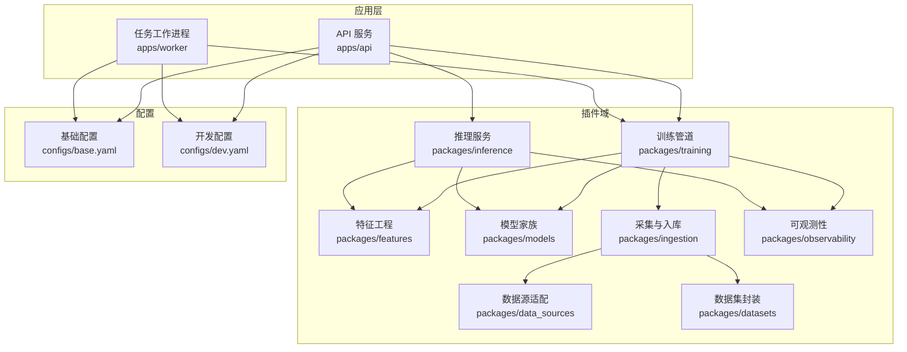
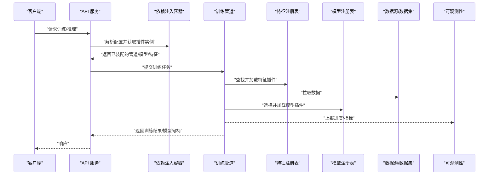
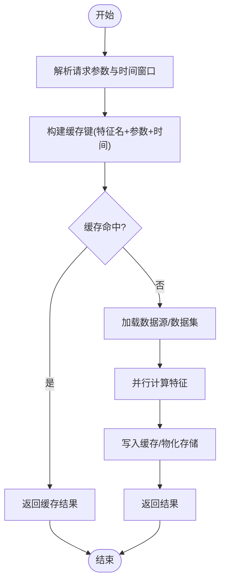
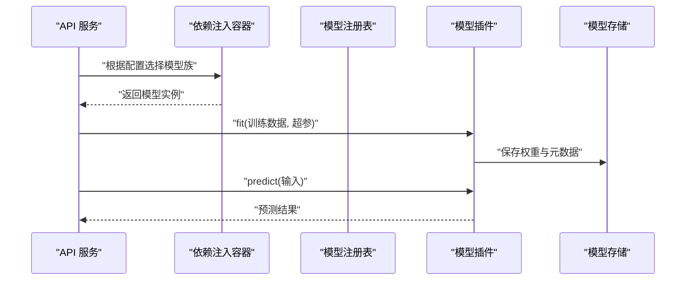
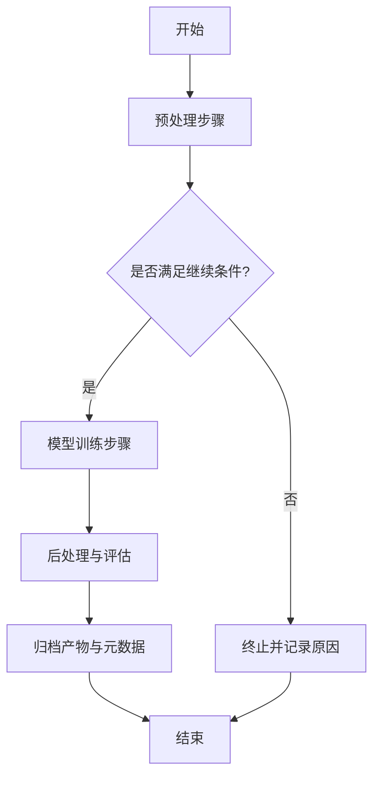
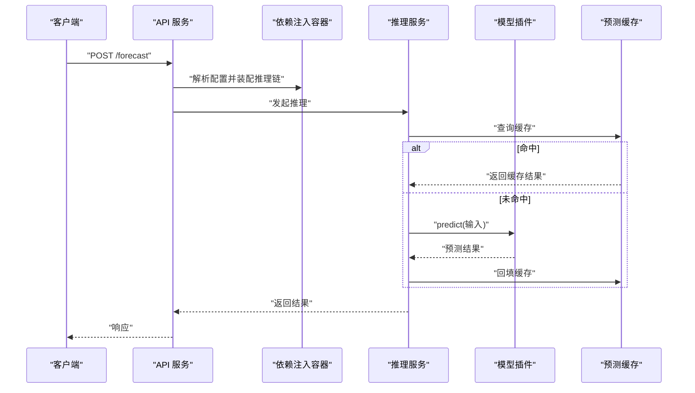
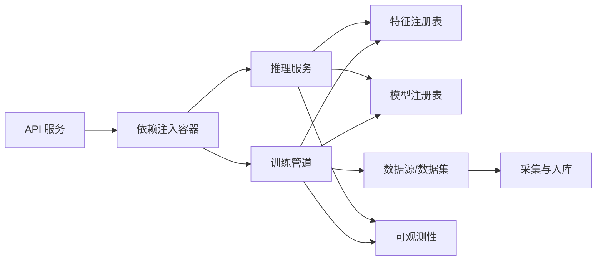

# 插件架构使用

<cite>
**本文引用的文件**   
- [apps/api/main.py](file://apps/api/main.py)
- [apps/api/deps.py](file://apps/api/deps.py)
- [apps/worker/main.py](file://apps/worker/main.py)
- [apps/worker/tasks.py](file://apps/worker/tasks.py)
- [packages/features/__init__.py](file://packages/features/__init__.py)
- [packages/models/__init__.py](file://packages/models/__init__.py)
- [packages/training/__init__.py](file://packages/training/__init__.py)
- [packages/inference/__init__.py](file://packages/inference/__init__.py)
- [packages/data_sources/__init__.py](file://packages/data_sources/__init__.py)
- [packages/datasets/__init__.py](file://packages/datasets/__init__.py)
- [packages/ingestion/__init__.py](file://packages/ingestion/__init__.py)
- [packages/observability/__init__.py](file://packages/observability/__init__.py)
- [configs/base.yaml](file://configs/base.yaml)
- [configs/dev.yaml](file://configs/dev.yaml)
- [tests/conftest.py](file://tests/conftest.py)
</cite>

## 目录
1. [简介](#简介)
2. [项目结构](#项目结构)
3. [核心组件](#核心组件)
4. [架构总览](#架构总览)
5. [详细组件分析](#详细组件分析)
6. [依赖分析](#依赖分析)
7. [性能考虑](#性能考虑)
8. [故障排查指南](#故障排查指南)
9. [结论](#结论)
10. [附录](#附录)

## 简介
本指南面向希望扩展系统的开发者，围绕“插件化”设计提供从原理到实践的系统说明。内容覆盖：
- 插件发现机制、生命周期管理与依赖注入
- 特征工程插件开发模式（接口、缓存策略、并行处理）
- 模型插件实现方法（训练接口、预测方法与序列化支持）
- 训练管道扩展方式（预处理、训练、后处理）
- 配置管理（动态加载、参数传递、版本兼容）
- 测试框架（隔离测试、模拟环境、性能监控）

## 项目结构
仓库采用多包分层与按领域划分的组织方式。与插件体系密切相关的目录包括：
- packages/features：特征工程插件域
- packages/models：模型插件域
- packages/training：训练管道编排
- packages/inference：推理服务
- packages/data_sources / packages/datasets / packages/ingestion：数据源与数据集插件
- apps/api / apps/worker：API 与任务执行入口，负责装配与调度
- configs：全局配置与运行期配置
- tests：单元与集成测试基座

图表来源
- [apps/api/main.py](file://apps/api/main.py)
- [apps/worker/main.py](file://apps/worker/main.py)
- [packages/features/__init__.py](file://packages/features/__init__.py)
- [packages/models/__init__.py](file://packages/models/__init__.py)
- [packages/training/__init__.py](file://packages/training/__init__.py)
- [packages/inference/__init__.py](file://packages/inference/__init__.py)
- [packages/data_sources/__init__.py](file://packages/data_sources/__init__.py)
- [packages/datasets/__init__.py](file://packages/datasets/__init__.py)
- [packages/ingestion/__init__.py](file://packages/ingestion/__init__.py)
- [packages/observability/__init__.py](file://packages/observability/__init__.py)
- [configs/base.yaml](file://configs/base.yaml)
- [configs/dev.yaml](file://configs/dev.yaml)

章节来源
- [apps/api/main.py](file://apps/api/main.py)
- [apps/worker/main.py](file://apps/worker/main.py)
- [configs/base.yaml](file://configs/base.yaml)
- [configs/dev.yaml](file://configs/dev.yaml)

## 核心组件
本节聚焦插件体系的“注册—发现—装配—使用”闭环，以及关键扩展点。

- 插件发现机制
  - 通过各域的 __init__.py 暴露统一入口，集中完成插件扫描与注册。
  - 建议以命名空间或约定式路径进行自动发现，避免硬编码清单。
- 生命周期管理
  - 初始化阶段：读取配置、建立连接、预热资源。
  - 运行阶段：按需计算/训练/推理，支持幂等与重试。
  - 销毁阶段：释放资源、刷新指标、持久化状态。
- 依赖注入
  - 在 API 与服务中通过依赖注入容器装配插件实例，避免全局单例耦合。
  - 将配置对象、日志器、指标收集器等横切能力作为依赖注入。

章节来源
- [packages/features/__init__.py](file://packages/features/__init__.py)
- [packages/models/__init__.py](file://packages/models/__init__.py)
- [packages/training/__init__.py](file://packages/training/__init__.py)
- [packages/inference/__init__.py](file://packages/inference/__init__.py)
- [packages/data_sources/__init__.py](file://packages/data_sources/__init__.py)
- [packages/datasets/__init__.py](file://packages/datasets/__init__.py)
- [packages/ingestion/__init__.py](file://packages/ingestion/__init__.py)
- [packages/observability/__init__.py](file://packages/observability/__init__.py)
- [apps/api/deps.py](file://apps/api/deps.py)

## 架构总览
下图展示插件在系统内的交互关系与数据流向。

图表来源
- [apps/api/main.py](file://apps/api/main.py)
- [apps/api/deps.py](file://apps/api/deps.py)
- [packages/training/__init__.py](file://packages/training/__init__.py)
- [packages/features/__init__.py](file://packages/features/__init__.py)
- [packages/models/__init__.py](file://packages/models/__init__.py)
- [packages/data_sources/__init__.py](file://packages/data_sources/__init__.py)
- [packages/datasets/__init__.py](file://packages/datasets/__init__.py)
- [packages/observability/__init__.py](file://packages/observability/__init__.py)

## 详细组件分析

### 特征工程插件
- 接口约定
  - 定义统一的特征计算接口，包含输入校验、时间窗口切片、增量更新与输出规范。
  - 提供元数据描述（名称、版本、依赖、复杂度），便于注册表与调度器使用。
- 缓存策略
  - 基于“特征键 + 时间范围 + 参数指纹”生成缓存键，命中则直接返回。
  - 支持多级缓存：内存 LRU、磁盘/对象存储、数据库物化视图。
  - 失效策略：TTL、事件驱动失效、滚动窗口清理。
- 并行处理
  - 按标的/时间分片并行计算，结合任务队列与并发度控制。
  - 失败重试与幂等写入，保证最终一致性。
- 典型流程

图表来源
- [packages/features/__init__.py](file://packages/features/__init__.py)
- [packages/data_sources/__init__.py](file://packages/data_sources/__init__.py)
- [packages/datasets/__init__.py](file://packages/datasets/__init__.py)

章节来源
- [packages/features/__init__.py](file://packages/features/__init__.py)
- [packages/data_sources/__init__.py](file://packages/data_sources/__init__.py)
- [packages/datasets/__init__.py](file://packages/datasets/__init__.py)

### 模型插件
- 训练接口
  - 标准化 fit 接口：接收训练集、验证集、超参、回调与早停策略。
  - 支持增量训练与断点续训，记录训练轨迹与中间权重。
- 预测方法
  - 统一 predict/predict_proba 接口，支持批量与流式。
  - 输出规范化：概率校准、置信区间、解释信息。
- 序列化支持
  - 模型权重、元数据、依赖库版本、随机种子一并序列化。
  - 提供加载校验（签名/哈希/版本约束）与回滚策略。
- 典型调用序列

图表来源
- [packages/models/__init__.py](file://packages/models/__init__.py)
- [apps/api/deps.py](file://apps/api/deps.py)

章节来源
- [packages/models/__init__.py](file://packages/models/__init__.py)
- [apps/api/deps.py](file://apps/api/deps.py)

### 训练管道扩展
- 步骤抽象
  - 预处理：清洗、对齐、采样、缺失值处理、异常检测。
  - 训练：模型选择、交叉验证、超参搜索、早停。
  - 后处理：阈值调优、概率校准、评估报告生成。
- 编排与依赖
  - 基于有向无环图（DAG）的步骤编排，支持条件分支与重试。
  - 每步输入输出契约明确，便于替换与复用。
- 可观测性与审计
  - 记录每步耗时、资源占用、数据漂移指标与模型质量指标。
- 典型流程

图表来源
- [packages/training/__init__.py](file://packages/training/__init__.py)
- [packages/observability/__init__.py](file://packages/observability/__init__.py)

章节来源
- [packages/training/__init__.py](file://packages/training/__init__.py)
- [packages/observability/__init__.py](file://packages/observability/__init__.py)

### 推理服务与插件
- 路由与装配
  - API 层根据请求上下文选择模型与特征组合，注入运行时配置。
- 在线缓存与降级
  - 热点预测结果缓存；模型不可用时降级至轻量规则或最近可用版本。
- 安全与限流
  - 输入校验、速率限制、敏感字段脱敏。
- 典型调用序列

图表来源
- [apps/api/main.py](file://apps/api/main.py)
- [apps/api/deps.py](file://apps/api/deps.py)
- [packages/inference/__init__.py](file://packages/inference/__init__.py)
- [packages/models/__init__.py](file://packages/models/__init__.py)

章节来源
- [apps/api/main.py](file://apps/api/main.py)
- [apps/api/deps.py](file://apps/api/deps.py)
- [packages/inference/__init__.py](file://packages/inference/__init__.py)

### 数据源与数据集插件
- 数据源适配
  - 统一读接口：按标的/时间范围/字段列表拉取，支持分页与增量。
  - 写接口：用于采集落库与物化视图刷新。
- 数据集封装
  - 对原始数据进行标准化、对齐与版本化管理，提供训练/验证/测试划分。
- 可靠性
  - 重试、熔断、超时与错误分类；失败时快速失败与告警。

章节来源
- [packages/data_sources/__init__.py](file://packages/data_sources/__init__.py)
- [packages/datasets/__init__.py](file://packages/datasets/__init__.py)
- [packages/ingestion/__init__.py](file://packages/ingestion/__init__.py)

### 配置管理与动态加载
- 配置层次
  - base.yaml 定义默认值与全局开关；dev.yaml 覆盖开发环境差异。
- 动态加载
  - 启动时扫描插件目录，按命名空间/约定注册；支持热重载与灰度切换。
- 参数传递
  - 通过依赖注入容器将配置对象注入到各插件，避免全局变量。
- 版本兼容
  - 插件声明最小/最大兼容版本；加载时校验不匹配则拒绝或降级。

章节来源
- [configs/base.yaml](file://configs/base.yaml)
- [configs/dev.yaml](file://configs/dev.yaml)
- [apps/api/deps.py](file://apps/api/deps.py)

### 任务与工作进程
- 任务编排
  - worker 进程订阅任务队列，按优先级与资源配额执行长耗时任务（如批量特征、训练）。
- 幂等与重试
  - 任务 ID 去重，失败指数退避重试，死信队列兜底。
- 可观测性
  - 任务级指标、耗时分布、错误率与资源使用率上报。

章节来源
- [apps/worker/main.py](file://apps/worker/main.py)
- [apps/worker/tasks.py](file://apps/worker/tasks.py)
- [packages/observability/__init__.py](file://packages/observability/__init__.py)

## 依赖分析
插件之间的依赖关系遵循“低耦合、高内聚”原则，通过注册表与依赖注入解耦。

图表来源
- [apps/api/main.py](file://apps/api/main.py)
- [apps/api/deps.py](file://apps/api/deps.py)
- [packages/training/__init__.py](file://packages/training/__init__.py)
- [packages/inference/__init__.py](file://packages/inference/__init__.py)
- [packages/features/__init__.py](file://packages/features/__init__.py)
- [packages/models/__init__.py](file://packages/models/__init__.py)
- [packages/data_sources/__init__.py](file://packages/data_sources/__init__.py)
- [packages/datasets/__init__.py](file://packages/datasets/__init__.py)
- [packages/ingestion/__init__.py](file://packages/ingestion/__init__.py)
- [packages/observability/__init__.py](file://packages/observability/__init__.py)

章节来源
- [apps/api/main.py](file://apps/api/main.py)
- [apps/api/deps.py](file://apps/api/deps.py)
- [packages/training/__init__.py](file://packages/training/__init__.py)
- [packages/inference/__init__.py](file://packages/inference/__init__.py)
- [packages/features/__init__.py](file://packages/features/__init__.py)
- [packages/models/__init__.py](file://packages/models/__init__.py)
- [packages/data_sources/__init__.py](file://packages/data_sources/__init__.py)
- [packages/datasets/__init__.py](file://packages/datasets/__init__.py)
- [packages/ingestion/__init__.py](file://packages/ingestion/__init__.py)
- [packages/observability/__init__.py](file://packages/observability/__init__.py)

## 性能考虑
- 特征计算
  - 优先使用缓存命中；对冷数据采用批处理与预计算；合理设置 TTL 与清理策略。
  - 并行度与 I/O 吞吐平衡，避免过度并发导致背压。
- 模型训练
  - 数据分片与流水线并行；梯度累积与混合精度；早停与超参剪枝。
- 推理服务
  - 热点结果缓存；模型预热与懒加载；批处理与异步化。
- 资源与成本
  - 按环境配置 CPU/GPU 配额；弹性扩缩容；监控与告警联动。

[本节为通用指导，无需特定文件引用]

## 故障排查指南
- 常见问题定位
  - 插件未加载：检查注册表扫描路径与命名约定；确认依赖注入容器初始化顺序。
  - 配置不一致：对比 base.yaml 与 dev.yaml 覆盖项；确认运行时注入的配置对象。
  - 缓存未命中：核对缓存键构造逻辑（参数指纹、时间窗口边界）。
  - 任务失败：查看任务日志与重试次数；检查死信队列与幂等键。
- 诊断手段
  - 启用可观测性指标与链路追踪；导出关键步骤耗时与错误堆栈。
  - 使用最小复现数据集与固定随机种子，确保问题可重复。

章节来源
- [apps/api/deps.py](file://apps/api/deps.py)
- [apps/worker/tasks.py](file://apps/worker/tasks.py)
- [packages/observability/__init__.py](file://packages/observability/__init__.py)

## 结论
通过统一的插件发现、生命周期管理与依赖注入，系统在特征工程、模型训练与推理方面实现了高度可扩展与可维护。配合完善的配置管理与测试框架，能够快速迭代新特性并保持稳定性。

[本节为总结性内容，无需特定文件引用]

## 附录
- 最佳实践
  - 插件接口稳定：向后兼容变更需通过版本协商与灰度发布。
  - 幂等与可恢复：所有外部交互与持久化操作需具备重试与补偿能力。
  - 可观测性先行：在插件内部埋点指标与日志，便于线上排障。
- 参考测试基座
  - 使用测试夹具与共享配置，确保单元测试与集成测试的一致性。

章节来源
- [tests/conftest.py](file://tests/conftest.py)