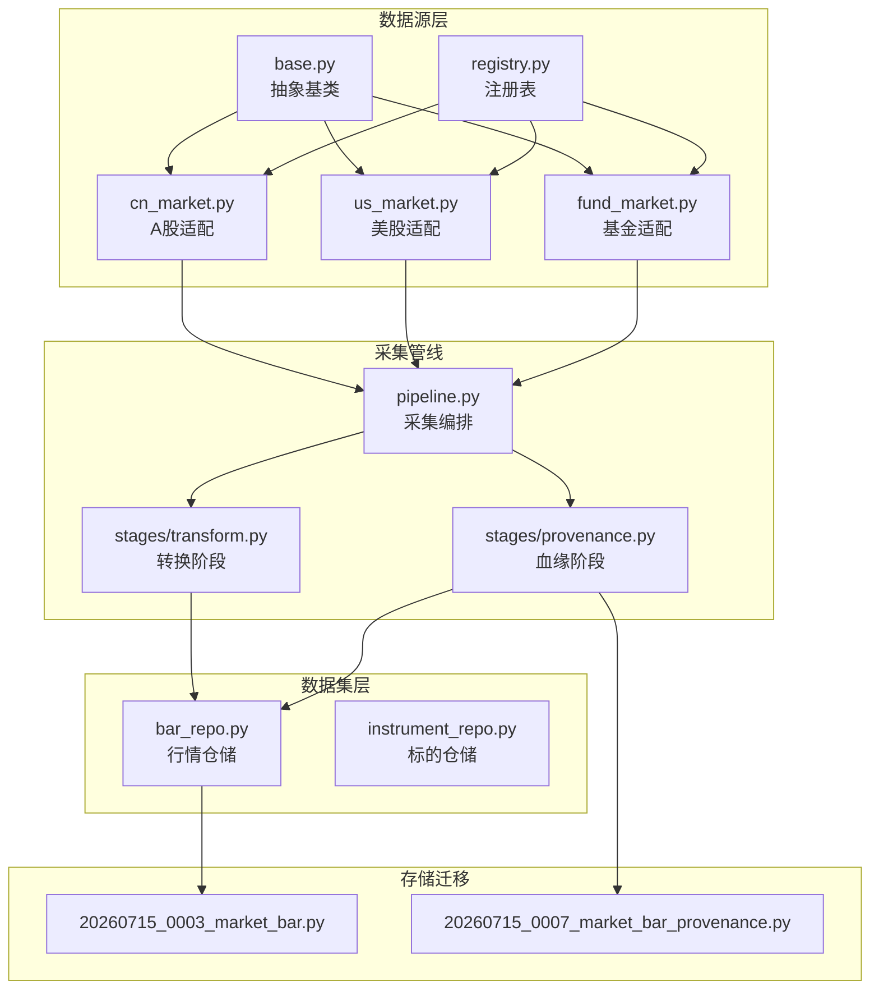
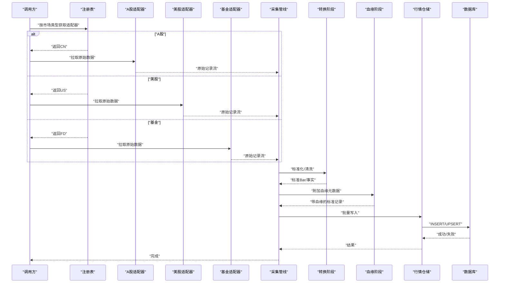
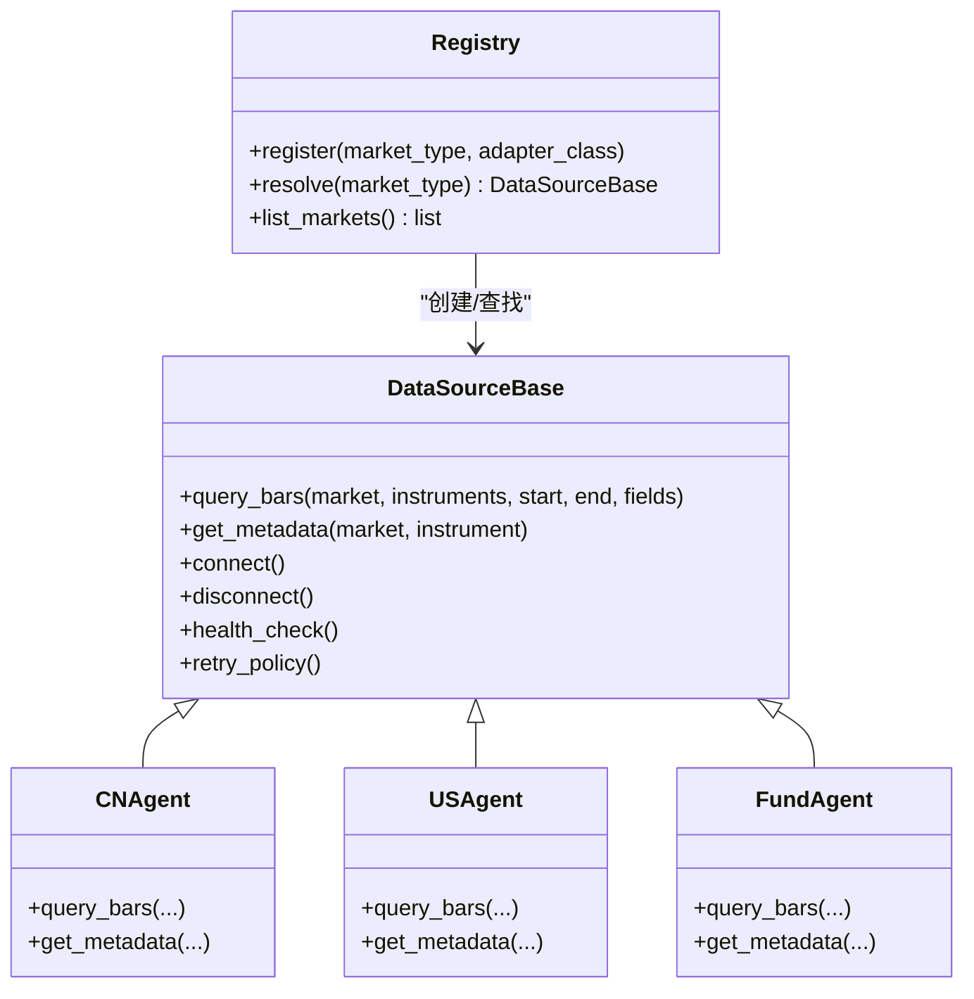
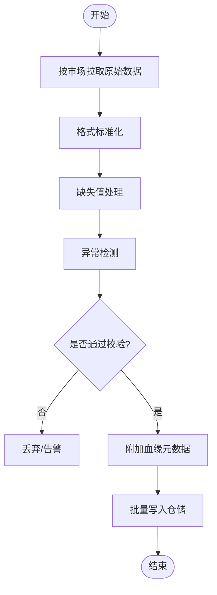
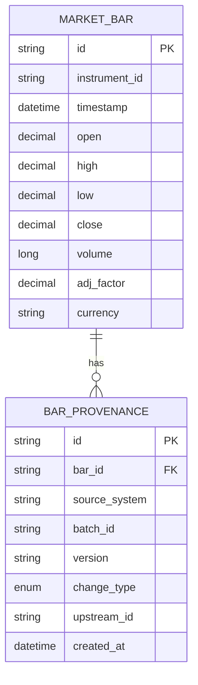
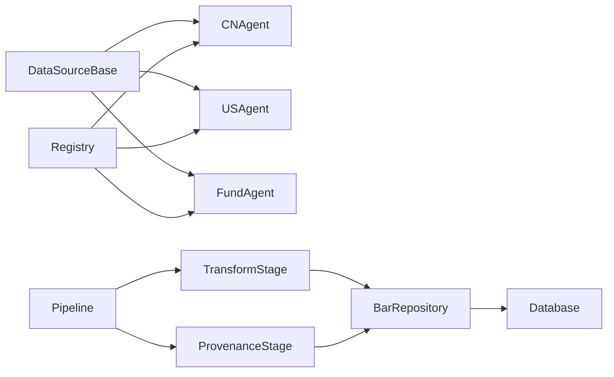

# 数据源适配器开发

<cite>
**本文引用的文件**   
- [packages/data_sources/__init__.py](file://packages/data_sources/__init__.py)
- [packages/data_sources/base.py](file://packages/data_sources/base.py)
- [packages/data_sources/registry.py](file://packages/data_sources/registry.py)
- [packages/data_sources/cn_market.py](file://packages/data_sources/cn_market.py)
- [packages/data_sources/us_market.py](file://packages/data_sources/us_market.py)
- [packages/data_sources/fund_market.py](file://packages/data_sources/fund_market.py)
- [packages/datasets/bar_repo.py](file://packages/datasets/bar_repo.py)
- [packages/datasets/instrument_repo.py](file://packages/datasets/instrument_repo.py)
- [packages/ingestion/pipeline.py](file://packages/ingestion/pipeline.py)
- [packages/ingestion/stages/transform.py](file://packages/ingestion/stages/transform.py)
- [packages/ingestion/stages/provenance.py](file://packages/ingestion/stages/provenance.py)
- [sql/migrations/20260715_0003_market_bar.py](file://sql/migrations/20260715_0003_market_bar.py)
- [sql/migrations/20260715_0007_market_bar_provenance.py](file://sql/migrations/20260715_0007_market_bar_provenance.py)
- [tests/unit/test_adapter_transforms.py](file://tests/unit/test_adapter_transforms.py)
- [tests/unit/test_adapter_provenance.py](file://tests/unit/test_adapter_provenance.py)
- [tests/unit/test_cross_market_scenarios.py](file://tests/unit/test_cross_market_scenarios.py)
- [tests/fixtures/golden/cn/halt_and_up_limit.jsonl](file://tests/fixtures/golden/cn/halt_and_up_limit.jsonl)
- [tests/fixtures/golden/us/dst_and_early_close.jsonl](file://tests/fixtures/golden/us/dst_and_early_close.jsonl)
- [tests/fixtures/golden/fund/cutoff_and_redemption.jsonl](file://tests/fixtures/golden/fund/cutoff_and_redemption.jsonl)
</cite>

## 目录
1. [简介](#简介)
2. [项目结构](#项目结构)
3. [核心组件](#核心组件)
4. [架构总览](#架构总览)
5. [详细组件分析](#详细组件分析)
6. [依赖关系分析](#依赖关系分析)
7. [性能考虑](#性能考虑)
8. [故障排查指南](#故障排查指南)
9. [结论](#结论)
10. [附录](#附录)

## 简介
本指南面向需要为多市场（A股、美股、基金等）接入数据的开发者，提供“数据源适配器”的接口规范与实现要求。内容覆盖：
- 统一的数据访问接口与元数据管理
- 连接池配置与资源生命周期
- 多市场适配模式与差异化处理
- 数据转换与清洗（格式标准化、缺失值处理、异常检测）
- 数据血缘追踪（来源标记、版本控制、变更历史）
- 测试策略（Mock数据源、边界条件、性能基准）

## 项目结构
仓库采用按领域分层与包组织的方式，数据源相关能力集中在 packages/data_sources 与 packages/ingestion，持久化模型在 sql/migrations，测试用例位于 tests。

图表来源
- [packages/data_sources/base.py](file://packages/data_sources/base.py)
- [packages/data_sources/registry.py](file://packages/data_sources/registry.py)
- [packages/data_sources/cn_market.py](file://packages/data_sources/cn_market.py)
- [packages/data_sources/us_market.py](file://packages/data_sources/us_market.py)
- [packages/data_sources/fund_market.py](file://packages/data_sources/fund_market.py)
- [packages/datasets/bar_repo.py](file://packages/datasets/bar_repo.py)
- [packages/datasets/instrument_repo.py](file://packages/datasets/instrument_repo.py)
- [packages/ingestion/pipeline.py](file://packages/ingestion/pipeline.py)
- [packages/ingestion/stages/transform.py](file://packages/ingestion/stages/transform.py)
- [packages/ingestion/stages/provenance.py](file://packages/ingestion/stages/provenance.py)
- [sql/migrations/20260715_0003_market_bar.py](file://sql/migrations/20260715_0003_market_bar.py)
- [sql/migrations/20260715_0007_market_bar_provenance.py](file://sql/migrations/20260715_0007_market_bar_provenance.py)

章节来源
- [packages/data_sources/__init__.py](file://packages/data_sources/__init__.py)
- [packages/data_sources/base.py](file://packages/data_sources/base.py)
- [packages/data_sources/registry.py](file://packages/data_sources/registry.py)
- [packages/data_sources/cn_market.py](file://packages/data_sources/cn_market.py)
- [packages/data_sources/us_market.py](file://packages/data_sources/us_market.py)
- [packages/data_sources/fund_market.py](file://packages/data_sources/fund_market.py)
- [packages/datasets/bar_repo.py](file://packages/datasets/bar_repo.py)
- [packages/datasets/instrument_repo.py](file://packages/datasets/instrument_repo.py)
- [packages/ingestion/pipeline.py](file://packages/ingestion/pipeline.py)
- [packages/ingestion/stages/transform.py](file://packages/ingestion/stages/transform.py)
- [packages/ingestion/stages/provenance.py](file://packages/ingestion/stages/provenance.py)
- [sql/migrations/20260715_0003_market_bar.py](file://sql/migrations/20260715_0003_market_bar.py)
- [sql/migrations/20260715_0007_market_bar_provenance.py](file://sql/migrations/20260715_0007_market_bar_provenance.py)

## 核心组件
- 抽象基类与注册表
  - 定义统一的查询、元数据获取、连接生命周期与错误语义
  - 提供按市场类型注册的工厂机制，便于扩展新市场
- 市场适配器
  - A股：停牌、涨跌停、交易日历差异
  - 美股：夏令时、提前收盘、退市事件
  - 基金：申赎、分红、净值口径差异
- 采集管线
  - 将各市场适配器输出统一转换为标准Bar/事实记录
  - 串联转换与血缘阶段，写入仓储并落库
- 仓储与迁移
  - 标准Bar表与血缘表结构由迁移脚本定义
  - 仓储负责批量写入与一致性保障

章节来源
- [packages/data_sources/base.py](file://packages/data_sources/base.py)
- [packages/data_sources/registry.py](file://packages/data_sources/registry.py)
- [packages/data_sources/cn_market.py](file://packages/data_sources/cn_market.py)
- [packages/data_sources/us_market.py](file://packages/data_sources/us_market.py)
- [packages/data_sources/fund_market.py](file://packages/data_sources/fund_market.py)
- [packages/ingestion/pipeline.py](file://packages/ingestion/pipeline.py)
- [packages/ingestion/stages/transform.py](file://packages/ingestion/stages/transform.py)
- [packages/ingestion/stages/provenance.py](file://packages/ingestion/stages/provenance.py)
- [packages/datasets/bar_repo.py](file://packages/datasets/bar_repo.py)
- [packages/datasets/instrument_repo.py](file://packages/datasets/instrument_repo.py)
- [sql/migrations/20260715_0003_market_bar.py](file://sql/migrations/20260715_0003_market_bar.py)
- [sql/migrations/20260715_0007_market_bar_provenance.py](file://sql/migrations/20260715_0007_market_bar_provenance.py)

## 架构总览
下图展示从市场适配器到仓储落库的整体流程，以及血缘信息如何伴随数据一起持久化。

图表来源
- [packages/data_sources/registry.py](file://packages/data_sources/registry.py)
- [packages/data_sources/cn_market.py](file://packages/data_sources/cn_market.py)
- [packages/data_sources/us_market.py](file://packages/data_sources/us_market.py)
- [packages/data_sources/fund_market.py](file://packages/data_sources/fund_market.py)
- [packages/ingestion/pipeline.py](file://packages/ingestion/pipeline.py)
- [packages/ingestion/stages/transform.py](file://packages/ingestion/stages/transform.py)
- [packages/ingestion/stages/provenance.py](file://packages/ingestion/stages/provenance.py)
- [packages/datasets/bar_repo.py](file://packages/datasets/bar_repo.py)
- [sql/migrations/20260715_0003_market_bar.py](file://sql/migrations/20260715_0003_market_bar.py)
- [sql/migrations/20260715_0007_market_bar_provenance.py](file://sql/migrations/20260715_0007_market_bar_provenance.py)

## 详细组件分析

### 抽象基类与注册表
- 抽象基类职责
  - 定义统一查询接口（时间范围、标的集合、字段选择）
  - 定义元数据接口（交易日历、合约规格、货币与精度）
  - 定义连接生命周期（初始化、重试、断开、健康检查）
  - 定义错误语义（网络、认证、限流、数据不一致）
- 注册表职责
  - 维护市场类型到适配器实现的映射
  - 提供按市场类型解析与实例化方法
  - 支持动态发现与热插拔

图表来源
- [packages/data_sources/base.py](file://packages/data_sources/base.py)
- [packages/data_sources/registry.py](file://packages/data_sources/registry.py)
- [packages/data_sources/cn_market.py](file://packages/data_sources/cn_market.py)
- [packages/data_sources/us_market.py](file://packages/data_sources/us_market.py)
- [packages/data_sources/fund_market.py](file://packages/data_sources/fund_market.py)

章节来源
- [packages/data_sources/base.py](file://packages/data_sources/base.py)
- [packages/data_sources/registry.py](file://packages/data_sources/registry.py)

### A股适配器（cn_market）
- 特殊处理
  - 停牌日过滤与恢复标记
  - 涨跌停导致的零成交或价格不变场景
  - 交易日历与节假日差异
- 元数据
  - 提供A股专属的交易时段、最小变动价位、币种与精度
- 错误与重试
  - 针对限流与临时不可用进行指数退避重试

章节来源
- [packages/data_sources/cn_market.py](file://packages/data_sources/cn_market.py)

### 美股适配器（us_market）
- 特殊处理
  - 夏令时切换对时间戳对齐的影响
  - 提前收盘与盘前盘后数据取舍
  - 退市事件的标识与后续数据处理
- 元数据
  - 美股交易日历、时区、货币与小数位规则

章节来源
- [packages/data_sources/us_market.py](file://packages/data_sources/us_market.py)

### 基金适配器（fund_market）
- 特殊处理
  - 申购赎回导致份额变化
  - 分红再投资与除权除息
  - 净值披露延迟与修正
- 元数据
  - 基金代码体系、净值频率、估值时点

章节来源
- [packages/data_sources/fund_market.py](file://packages/data_sources/fund_market.py)

### 采集管线与转换阶段
- 管线编排
  - 按市场拉取原始数据，进入转换阶段进行标准化
  - 校验必填字段、类型转换、单位换算
- 转换阶段
  - 格式标准化（时间戳、价格、成交量、复权因子）
  - 缺失值处理（填充策略、标记未知）
  - 异常检测（离群值、跳空、重复行）
- 血缘阶段
  - 附加数据来源、批次ID、版本号、上游系统标识
  - 生成变更记录（新增、更新、删除）

图表来源
- [packages/ingestion/pipeline.py](file://packages/ingestion/pipeline.py)
- [packages/ingestion/stages/transform.py](file://packages/ingestion/stages/transform.py)
- [packages/ingestion/stages/provenance.py](file://packages/ingestion/stages/provenance.py)
- [packages/datasets/bar_repo.py](file://packages/datasets/bar_repo.py)

章节来源
- [packages/ingestion/pipeline.py](file://packages/ingestion/pipeline.py)
- [packages/ingestion/stages/transform.py](file://packages/ingestion/stages/transform.py)
- [packages/ingestion/stages/provenance.py](file://packages/ingestion/stages/provenance.py)

### 仓储与数据模型
- 标准Bar表
  - 包含标的、时间、开高低收量、复权因子、币种等
- 血缘表
  - 记录数据来源、批次号、版本号、变更类型、上游ID
- 迁移脚本
  - 定义表结构与索引，确保查询与写入性能

图表来源
- [sql/migrations/20260715_0003_market_bar.py](file://sql/migrations/20260715_0003_market_bar.py)
- [sql/migrations/20260715_0007_market_bar_provenance.py](file://sql/migrations/20260715_0007_market_bar_provenance.py)

章节来源
- [packages/datasets/bar_repo.py](file://packages/datasets/bar_repo.py)
- [sql/migrations/20260715_0003_market_bar.py](file://sql/migrations/20260715_0003_market_bar.py)
- [sql/migrations/20260715_0007_market_bar_provenance.py](file://sql/migrations/20260715_0007_market_bar_provenance.py)

## 依赖关系分析
- 低耦合高内聚
  - 适配器仅关注各自市场的差异，统一通过基类暴露接口
  - 注册表解耦市场类型与具体实现
- 外部依赖
  - 数据库通过仓储层访问，避免业务逻辑侵入
  - 管线与阶段可独立替换与扩展

图表来源
- [packages/data_sources/base.py](file://packages/data_sources/base.py)
- [packages/data_sources/registry.py](file://packages/data_sources/registry.py)
- [packages/data_sources/cn_market.py](file://packages/data_sources/cn_market.py)
- [packages/data_sources/us_market.py](file://packages/data_sources/us_market.py)
- [packages/data_sources/fund_market.py](file://packages/data_sources/fund_market.py)
- [packages/ingestion/pipeline.py](file://packages/ingestion/pipeline.py)
- [packages/ingestion/stages/transform.py](file://packages/ingestion/stages/transform.py)
- [packages/ingestion/stages/provenance.py](file://packages/ingestion/stages/provenance.py)
- [packages/datasets/bar_repo.py](file://packages/datasets/bar_repo.py)

章节来源
- [packages/data_sources/base.py](file://packages/data_sources/base.py)
- [packages/data_sources/registry.py](file://packages/data_sources/registry.py)
- [packages/ingestion/pipeline.py](file://packages/ingestion/pipeline.py)
- [packages/datasets/bar_repo.py](file://packages/datasets/bar_repo.py)

## 性能考虑
- 连接池与并发
  - 使用连接池复用底层连接，限制最大并发数避免过载
  - 合理设置超时与重试次数，结合指数退避降低抖动影响
- 批处理与分页
  - 拉取与写入均采用分批策略，减少内存峰值与锁竞争
- 索引与查询优化
  - 基于时间与标的建立复合索引，提升区间查询效率
- 缓存与去重
  - 对热点元数据（交易日历、合约规格）进行本地缓存
  - 写入前做幂等去重，避免重复插入

[本节为通用指导，不直接分析具体文件]

## 故障排查指南
- 常见问题定位
  - 连接失败：检查认证、网络、限流与重试策略
  - 数据缺失：核对交易日历、时区与夏令时处理
  - 异常值：查看异常检测日志与阈值配置
- 观测与诊断
  - 利用血缘字段追溯数据来源与批次，快速定位问题源头
  - 对比黄金样例集验证转换与清洗逻辑正确性

章节来源
- [tests/unit/test_adapter_provenance.py](file://tests/unit/test_adapter_provenance.py)
- [tests/unit/test_adapter_transforms.py](file://tests/unit/test_adapter_transforms.py)
- [tests/fixtures/golden/cn/halt_and_up_limit.jsonl](file://tests/fixtures/golden/cn/halt_and_up_limit.jsonl)
- [tests/fixtures/golden/us/dst_and_early_close.jsonl](file://tests/fixtures/golden/us/dst_and_early_close.jsonl)
- [tests/fixtures/golden/fund/cutoff_and_redemption.jsonl](file://tests/fixtures/golden/fund/cutoff_and_redemption.jsonl)

## 结论
通过统一的抽象基类与注册表，配合市场特定适配器与标准化的采集管线，本项目实现了跨市场数据源的灵活接入与一致化处理。借助血缘追踪与完善的测试策略，可在保证数据质量的同时快速扩展新的市场与数据源。

[本节为总结性内容，不直接分析具体文件]

## 附录

### 接口规范与实现要点
- 统一数据访问接口
  - 查询接口需支持时间范围、标的集合、字段投影
  - 元数据接口需提供交易日历、合约规格、币种与精度
- 连接池配置
  - 最大连接数、空闲回收、超时与重试策略
  - 健康检查与自动恢复
- 错误语义
  - 区分网络错误、认证失败、限流与数据不一致
  - 提供可重试与不可重试的错误分类

章节来源
- [packages/data_sources/base.py](file://packages/data_sources/base.py)
- [packages/data_sources/registry.py](file://packages/data_sources/registry.py)

### 多市场适配模式
- A股
  - 停牌与涨跌停的特殊标记与处理
  - 交易日历与节假日差异
- 美股
  - 夏令时与提前收盘的时间对齐
  - 退市事件的处理与后续数据清理
- 基金
  - 申赎与分红的净值调整
  - 净值披露延迟与修正

章节来源
- [packages/data_sources/cn_market.py](file://packages/data_sources/cn_market.py)
- [packages/data_sources/us_market.py](file://packages/data_sources/us_market.py)
- [packages/data_sources/fund_market.py](file://packages/data_sources/fund_market.py)

### 数据转换与清洗
- 格式标准化
  - 时间戳与时区统一
  - 价格与成交量单位归一
- 缺失值处理
  - 前向填充、线性插值或标记未知
- 异常检测
  - 离群值、跳空、重复行识别与告警

章节来源
- [packages/ingestion/stages/transform.py](file://packages/ingestion/stages/transform.py)

### 数据血缘追踪
- 来源标记
  - 记录系统名称、批次ID、版本号
- 变更历史
  - 记录新增、更新、删除等操作
- 版本控制
  - 基于增量与快照的组合策略

章节来源
- [packages/ingestion/stages/provenance.py](file://packages/ingestion/stages/provenance.py)
- [sql/migrations/20260715_0007_market_bar_provenance.py](file://sql/migrations/20260715_0007_market_bar_provenance.py)

### 测试策略
- Mock数据源
  - 使用固定输入与期望输出验证转换与血缘逻辑
- 边界条件测试
  - 极端时间窗口、缺失数据、异常值场景
- 性能基准测试
  - 大体积拉取与批量写入的性能评估

章节来源
- [tests/unit/test_adapter_transforms.py](file://tests/unit/test_adapter_transforms.py)
- [tests/unit/test_adapter_provenance.py](file://tests/unit/test_adapter_provenance.py)
- [tests/unit/test_cross_market_scenarios.py](file://tests/unit/test_cross_market_scenarios.py)
- [tests/fixtures/golden/cn/halt_and_up_limit.jsonl](file://tests/fixtures/golden/cn/halt_and_up_limit.jsonl)
- [tests/fixtures/golden/us/dst_and_early_close.jsonl](file://tests/fixtures/golden/us/dst_and_early_close.jsonl)
- [tests/fixtures/golden/fund/cutoff_and_redemption.jsonl](file://tests/fixtures/golden/fund/cutoff_and_redemption.jsonl)