# 策略模板开发

<cite>
**本文引用的文件**   
- [README.md](file://README.md)
- [pyproject.toml](file://pyproject.toml)
- [apps/api/main.py](file://apps/api/main.py)
- [apps/api/routers/portfolio.py](file://apps/api/routers/portfolio.py)
- [packages/backtest/](file://packages/backtest/)
- [packages/portfolio/](file://packages/portfolio/)
- [packages/risk/](file://packages/risk/)
- [packages/data_sources/](file://packages/data_sources/)
- [packages/datasets/](file://packages/datasets/)
- [packages/features/](file://packages/features/)
- [packages/instrument/](file://packages/instrument/)
- [packages/instruments/](file://packages/instruments/)
- [packages/fundamentals/](file://packages/fundamentals/)
- [packages/corporate_actions/](file://packages/corporate_actions/)
- [packages/evaluation/](file://packages/evaluation/)
- [packages/reporting/](file://packages/reporting/)
- [packages/observability/](file://packages/observability/)
- [packages/training/](file://packages/training/)
- [packages/ledger_paper/](file://packages/ledger_paper/)
- [packages/calendar_rule/](file://packages/calendar_rule/)
- [packages/models/](file://packages/models/)
- [packages/audit/](file://packages/audit/)
- [packages/data_quality/](file://packages/data_quality/)
- [packages/drift/](file://packages/drift/)
- [packages/labels/](file://packages/labels/)
- [packages/scheduler/schedule.py](file://apps/scheduler/schedule.py)
- [apps/worker/tasks.py](file://apps/worker/tasks.py)
- [apps/worker/main.py](file://apps/worker/main.py)
- [configs/base.yaml](file://configs/base.yaml)
- [configs/dev.yaml](file://configs/dev.yaml)
- [skills/cross-market-quant-research/SKILL.md](file://skills/cross-market-quant-research/SKILL.md)
- [skills/cross-market-quant-research/references/risk-layers.md](file://skills/cross-market-quant-research/references/risk-layers.md)
- [tests/unit/test_execution_models.py](file://tests/unit/test_execution_models.py)
- [tests/unit/test_golden_scenarios.py](file://tests/unit/test_golden_scenarios.py)
- [tests/unit/test_phase1_routers.py](file://tests/unit/test_phase1_routers.py)
- [tests/unit/test_sql_bar_repo.py](file://tests/unit/test_sql_bar_repo.py)
- [tests/unit/test_instrument_service.py](file://tests/unit/test_instrument_service.py)
- [sql/migrations/20260715_0003_market_bar.py](file://sql/migrations/20260715_0003_market_bar.py)
- [sql/migrations/20260715_0004_corporate_action.py](file://sql/migrations/20260715_0004_corporate_action.py)
</cite>

## 目录
1. [简介](#简介)
2. [项目结构](#项目结构)
3. [核心组件](#核心组件)
4. [架构总览](#架构总览)
5. [详细组件分析](#详细组件分析)
6. [依赖分析](#依赖分析)
7. [性能考虑](#性能考虑)
8. [故障排查指南](#故障排查指南)
9. [结论](#结论)
10. [附录](#附录)

## 简介
本指南面向希望在现有量化平台中开发“策略模板”的研究员与工程师，覆盖以下目标：
- 策略基类的继承与方法重写：信号生成、仓位管理、风险控制
- 不同类型策略的开发模板：趋势跟踪、均值回归、多因子
- 回测环境集成：历史数据接入、交易成本模拟、滑点处理
- 组合优化实现：权重分配、约束条件、再平衡逻辑
- 风险评估集成：风险指标计算、压力测试、情景分析
- 策略测试流程：单元测试、回测验证、实盘模拟

本仓库采用模块化设计，将数据、特征、模型、回测、组合、风控、报告与可观测性解耦。策略开发者应基于 packages 下的能力进行组合式开发，并通过 API 与调度器进行编排与运行。

## 项目结构
整体结构以 apps（服务与任务）、packages（领域包）、configs（配置）、sql（数据库迁移）、tests（测试）与 skills（研究规范）为主。策略相关能力主要分布在 packages 下，API 层提供对外接口，调度与 Worker 负责任务编排与执行。

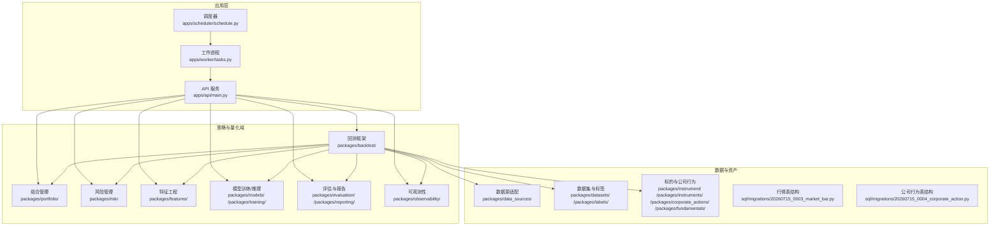

图表来源
- [apps/api/main.py](file://apps/api/main.py)
- [apps/scheduler/schedule.py](file://apps/scheduler/schedule.py)
- [apps/worker/tasks.py](file://apps/worker/tasks.py)
- [packages/backtest/](file://packages/backtest/)
- [packages/portfolio/](file://packages/portfolio/)
- [packages/risk/](file://packages/risk/)
- [packages/features/](file://packages/features/)
- [packages/models/](file://packages/models/)
- [packages/training/](file://packages/training/)
- [packages/evaluation/](file://packages/evaluation/)
- [packages/reporting/](file://packages/reporting/)
- [packages/observability/](file://packages/observability/)
- [packages/data_sources/](file://packages/data_sources/)
- [packages/datasets/](file://packages/datasets/)
- [packages/labels/](file://packages/labels/)
- [packages/instrument/](file://packages/instrument/)
- [packages/instruments/](file://packages/instruments/)
- [packages/corporate_actions/](file://packages/corporate_actions/)
- [packages/fundamentals/](file://packages/fundamentals/)
- [sql/migrations/20260715_0003_market_bar.py](file://sql/migrations/20260715_0003_market_bar.py)
- [sql/migrations/20260715_0004_corporate_action.py](file://sql/migrations/20260715_0004_corporate_action.py)

章节来源
- [README.md](file://README.md)
- [pyproject.toml](file://pyproject.toml)

## 核心组件
- 策略基类与生命周期
  - 建议定义一个策略基类，暴露统一入口：初始化、每日/每根 Bar 的 on_bar、组合构建、风控拦截、日志与指标上报。子类仅重写信号生成与仓位规则。
- 信号生成
  - 在 on_bar 或事件回调中调用特征与模型模块，输出信号向量（如多头/空头/中性）。
- 仓位管理与组合优化
  - 将信号输入组合优化器，得到目标权重；结合约束（行业/个股权重上限、换手率、流动性等）与再平衡频率，生成调仓指令。
- 风险控制
  - 在下单前进行风控检查（VaR、最大回撤、集中度、波动率阈值），必要时降权或拒绝订单。
- 回测集成
  - 通过回测框架加载历史数据（Bar、基本面、公司行为），注入交易成本与滑点模型，回放并记录成交与权益曲线。
- 评估与报告
  - 计算收益、风险、归因与交易质量指标，输出报告与可视化。
- 可观测性与审计
  - 埋点关键指标（延迟、错误率、资源使用），审计策略版本与参数变更。

章节来源
- [packages/backtest/](file://packages/backtest/)
- [packages/portfolio/](file://packages/portfolio/)
- [packages/risk/](file://packages/risk/)
- [packages/features/](file://packages/features/)
- [packages/models/](file://packages/models/)
- [packages/evaluation/](file://packages/evaluation/)
- [packages/reporting/](file://packages/reporting/)
- [packages/observability/](file://packages/observability/)

## 架构总览
下图展示从数据到策略再到组合与风控的整体数据流与控制流。

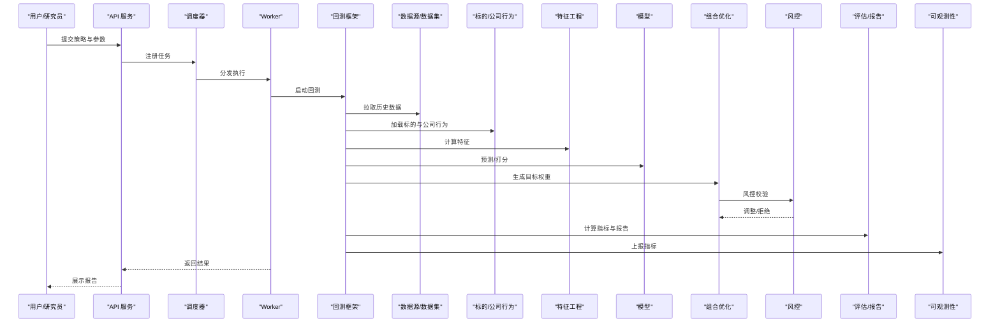

图表来源
- [apps/api/main.py](file://apps/api/main.py)
- [apps/scheduler/schedule.py](file://apps/scheduler/schedule.py)
- [apps/worker/tasks.py](file://apps/worker/tasks.py)
- [packages/backtest/](file://packages/backtest/)
- [packages/data_sources/](file://packages/data_sources/)
- [packages/datasets/](file://packages/datasets/)
- [packages/instrument/](file://packages/instrument/)
- [packages/instruments/](file://packages/instruments/)
- [packages/corporate_actions/](file://packages/corporate_actions/)
- [packages/features/](file://packages/features/)
- [packages/models/](file://packages/models/)
- [packages/portfolio/](file://packages/portfolio/)
- [packages/risk/](file://packages/risk/)
- [packages/evaluation/](file://packages/evaluation/)
- [packages/reporting/](file://packages/reporting/)
- [packages/observability/](file://packages/observability/)

## 详细组件分析

### 策略基类与生命周期
- 职责边界
  - 基类负责：时间推进、事件分发、状态维护、日志与指标上报、与回测/组合/风控的对接。
  - 子类负责：信号生成函数、仓位规则函数、可选的风控自定义逻辑。
- 关键方法
  - on_init：读取配置、初始化特征/模型/组合/风控实例。
  - on_bar：接收新 Bar，更新特征与模型，产出信号。
  - build_portfolio：根据信号与约束生成目标权重。
  - risk_check：下单前风控拦截。
  - post_trade：成交后更新状态与指标。
- 扩展点
  - 信号工厂：按策略类型切换不同信号实现。
  - 组合优化器：支持多种求解器与约束集。
  - 风控策略：可插拔的风险度量与熔断机制。

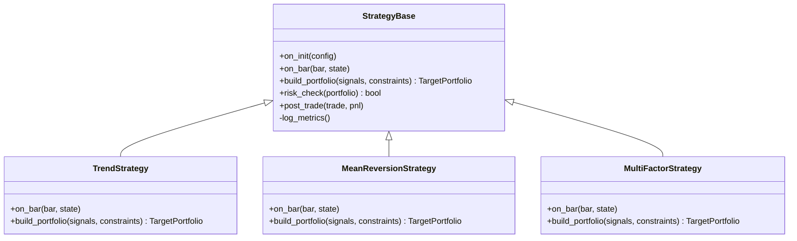

图表来源
- [packages/backtest/](file://packages/backtest/)
- [packages/portfolio/](file://packages/portfolio/)
- [packages/risk/](file://packages/risk/)
- [packages/features/](file://packages/features/)
- [packages/models/](file://packages/models/)

章节来源
- [packages/backtest/](file://packages/backtest/)
- [packages/portfolio/](file://packages/portfolio/)
- [packages/risk/](file://packages/risk/)

### 趋势跟踪策略模板
- 信号思路
  - 基于动量/突破/均线交叉等趋势指标，产生方向性信号。
- 仓位规则
  - 按信号强度与波动率倒数加权，控制单标的与组合风险敞口。
- 风控要点
  - 趋势失效时的止损/止盈；极端波动下的降杠杆。
- 回测关注
  - 滑点与冲击成本对趋势策略影响显著，需精细化建模。

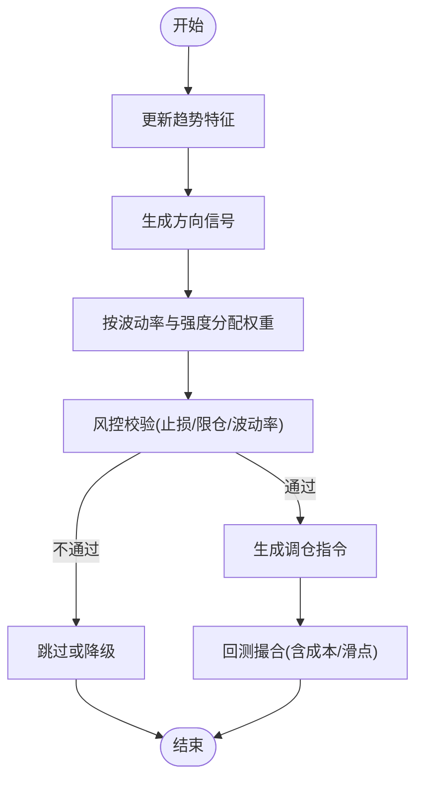

图表来源
- [packages/backtest/](file://packages/backtest/)
- [packages/features/](file://packages/features/)
- [packages/portfolio/](file://packages/portfolio/)
- [packages/risk/](file://packages/risk/)

章节来源
- [packages/backtest/](file://packages/backtest/)
- [packages/features/](file://packages/features/)
- [packages/portfolio/](file://packages/portfolio/)
- [packages/risk/](file://packages/risk/)

### 均值回归策略模板
- 信号思路
  - 基于价差、Z-score、协整残差等统计量，捕捉短期偏离后的回归。
- 仓位规则
  - 对配对或多腿组合进行对称建仓，动态对冲净敞口。
- 风控要点
  - 设定回归失效阈值与最大持有期；严格限制单边敞口。
- 回测关注
  - 高频交易成本与滑点对均值回归尤为敏感，需精细建模。

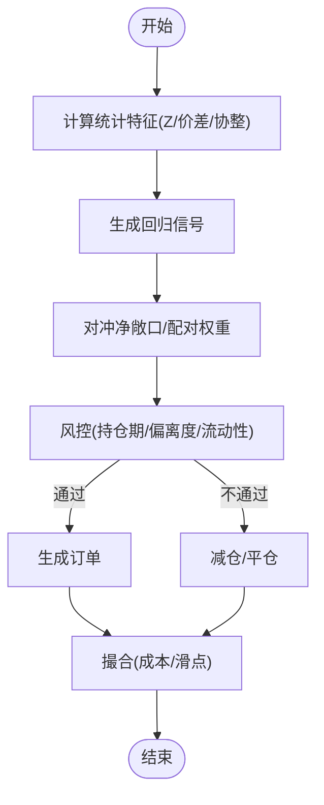

图表来源
- [packages/backtest/](file://packages/backtest/)
- [packages/features/](file://packages/features/)
- [packages/portfolio/](file://packages/portfolio/)
- [packages/risk/](file://packages/risk/)

章节来源
- [packages/backtest/](file://packages/backtest/)
- [packages/features/](file://packages/features/)
- [packages/portfolio/](file://packages/portfolio/)
- [packages/risk/](file://packages/risk/)

### 多因子策略模板
- 信号思路
  - 多因子打分（价值、质量、动量、低波等），标准化与合成得到综合得分。
- 仓位规则
  - 基于得分排序与风险预算分配权重，加入行业/风格中性约束。
- 风控要点
  - 因子暴露监控、相关性突变检测、尾部风险保护。
- 回测关注
  - 因子衰减与过拟合防范；样本外稳健性检验。

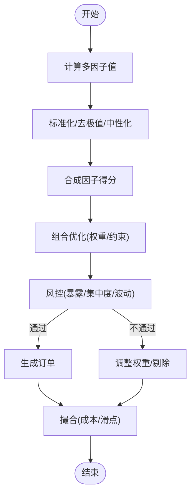

图表来源
- [packages/backtest/](file://packages/backtest/)
- [packages/features/](file://packages/features/)
- [packages/portfolio/](file://packages/portfolio/)
- [packages/risk/](file://packages/risk/)

章节来源
- [packages/backtest/](file://packages/backtest/)
- [packages/features/](file://packages/features/)
- [packages/portfolio/](file://packages/portfolio/)
- [packages/risk/](file://packages/risk/)

### 回测环境集成
- 历史数据接入
  - 通过数据源适配层加载 Bar、基本面与公司行为数据；确保时间对齐与复权处理。
- 交易成本与滑点
  - 在回测撮合阶段注入佣金、印花税、冲击成本与滑点模型，保证成交路径真实。
- 公司行为处理
  - 分红、拆合股、停牌等事件需在价格序列与持仓市值上正确反映。

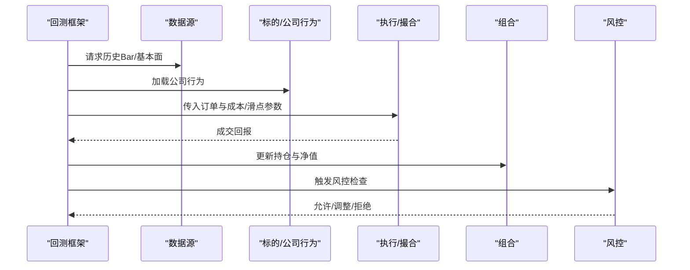

图表来源
- [packages/backtest/](file://packages/backtest/)
- [packages/data_sources/](file://packages/data_sources/)
- [packages/instrument/](file://packages/instrument/)
- [packages/instruments/](file://packages/instruments/)
- [packages/corporate_actions/](file://packages/corporate_actions/)
- [packages/portfolio/](file://packages/portfolio/)
- [packages/risk/](file://packages/risk/)

章节来源
- [packages/backtest/](file://packages/backtest/)
- [packages/data_sources/](file://packages/data_sources/)
- [packages/instrument/](file://packages/instrument/)
- [packages/instruments/](file://packages/instruments/)
- [packages/corporate_actions/](file://packages/corporate_actions/)
- [packages/portfolio/](file://packages/portfolio/)
- [packages/risk/](file://packages/risk/)

### 组合优化实现
- 权重分配
  - 基于目标函数（如最大化夏普、最小方差、风险预算）与约束（行业/个股权重上下限、换手率、流动性）求解。
- 约束条件
  - 包括净敞口、杠杆上限、风格中性、行业偏离、个股权重上限、禁投池等。
- 再平衡逻辑
  - 固定周期或触发式再平衡；考虑交易成本与冲击成本的折中。

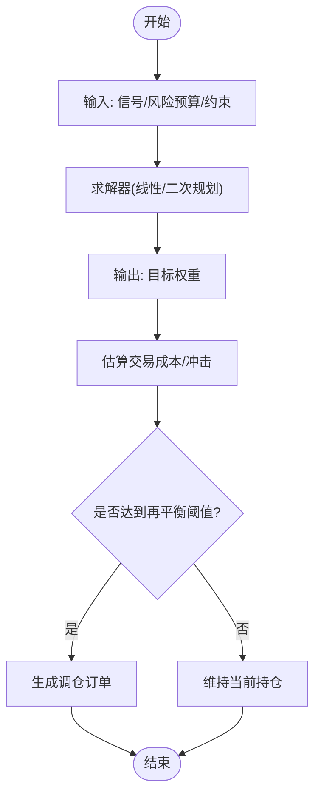

图表来源
- [packages/portfolio/](file://packages/portfolio/)
- [packages/risk/](file://packages/risk/)

章节来源
- [packages/portfolio/](file://packages/portfolio/)
- [packages/risk/](file://packages/risk/)

### 风险评估集成
- 风险指标
  - 收益分布、波动率、VaR/CVaR、最大回撤、信息比率、换手率、行业/风格暴露等。
- 压力测试与情景分析
  - 历史危机片段回放、假设性冲击（利率跳升、流动性枯竭、汇率大幅波动）对组合的影响。
- 风控拦截
  - 实时或日频风控检查，超限则降权/平仓/暂停交易。

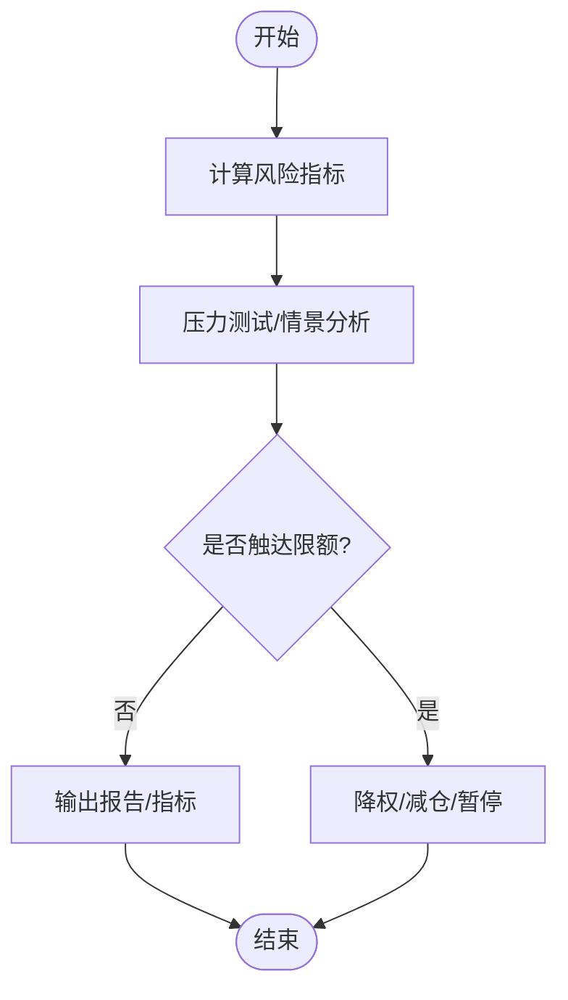

图表来源
- [packages/risk/](file://packages/risk/)
- [packages/evaluation/](file://packages/evaluation/)
- [packages/reporting/](file://packages/reporting/)

章节来源
- [packages/risk/](file://packages/risk/)
- [packages/evaluation/](file://packages/evaluation/)
- [packages/reporting/](file://packages/reporting/)

### 策略测试完整流程
- 单元测试
  - 针对特征计算、信号生成、组合优化、风控规则编写用例，覆盖边界与异常路径。
- 回测验证
  - 使用黄金场景与端到端流水线验证策略在不同市场环境与参数下的稳定性。
- 实盘模拟
  - 在沙箱环境中接入真实数据与撮合引擎，验证延迟、失败重试与幂等性。

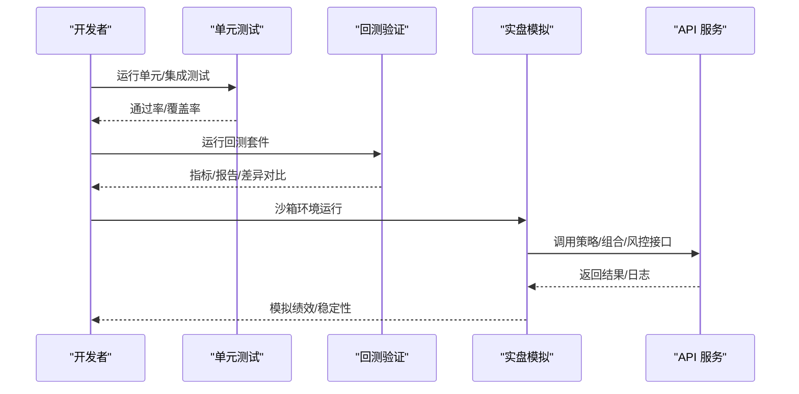

图表来源
- [tests/unit/test_execution_models.py](file://tests/unit/test_execution_models.py)
- [tests/unit/test_golden_scenarios.py](file://tests/unit/test_golden_scenarios.py)
- [tests/unit/test_phase1_routers.py](file://tests/unit/test_phase1_routers.py)
- [tests/unit/test_sql_bar_repo.py](file://tests/unit/test_sql_bar_repo.py)
- [tests/unit/test_instrument_service.py](file://tests/unit/test_instrument_service.py)
- [apps/api/main.py](file://apps/api/main.py)

章节来源
- [tests/unit/test_execution_models.py](file://tests/unit/test_execution_models.py)
- [tests/unit/test_golden_scenarios.py](file://tests/unit/test_golden_scenarios.py)
- [tests/unit/test_phase1_routers.py](file://tests/unit/test_phase1_routers.py)
- [tests/unit/test_sql_bar_repo.py](file://tests/unit/test_sql_bar_repo.py)
- [tests/unit/test_instrument_service.py](file://tests/unit/test_instrument_service.py)
- [apps/api/main.py](file://apps/api/main.py)

## 依赖分析
- 模块耦合
  - 策略与回测强耦合，组合与风控为横向横切能力；数据与标的为底层依赖。
- 外部依赖
  - 数据库迁移定义了 Bar 与公司行为表结构，支撑数据一致性。
- 潜在循环依赖
  - 避免策略直接依赖回测内部实现，应通过接口与事件总线交互。

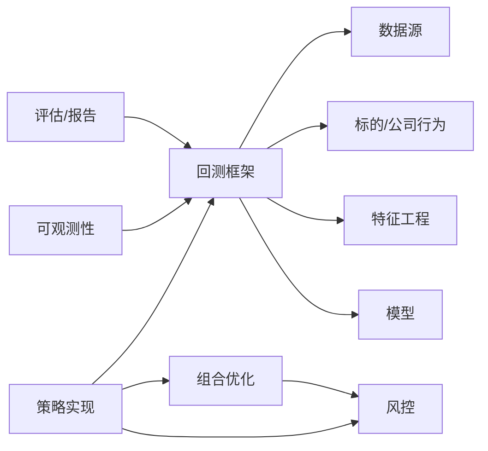

图表来源
- [packages/backtest/](file://packages/backtest/)
- [packages/portfolio/](file://packages/portfolio/)
- [packages/risk/](file://packages/risk/)
- [packages/data_sources/](file://packages/data_sources/)
- [packages/instrument/](file://packages/instrument/)
- [packages/instruments/](file://packages/instruments/)
- [packages/corporate_actions/](file://packages/corporate_actions/)
- [packages/features/](file://packages/features/)
- [packages/models/](file://packages/models/)
- [packages/evaluation/](file://packages/evaluation/)
- [packages/reporting/](file://packages/reporting/)
- [packages/observability/](file://packages/observability/)

章节来源
- [sql/migrations/20260715_0003_market_bar.py](file://sql/migrations/20260715_0003_market_bar.py)
- [sql/migrations/20260715_0004_corporate_action.py](file://sql/migrations/20260715_0004_corporate_action.py)

## 性能考虑
- 数据与特征
  - 批量计算与增量更新结合；缓存热点特征与中间结果。
- 回测效率
  - 并行化标的级回测；向量化计算减少 Python 循环开销。
- 组合优化
  - 选择合适求解器与稀疏矩阵表示；预计算协方差与约束矩阵。
- 风控与报告
  - 异步上报指标；按需采样降低 IO 压力。

[本节为通用指导，无需具体文件引用]

## 故障排查指南
- 常见问题
  - 数据缺失或不一致：核对时间戳、复权方式与公司行为事件。
  - 回测与实盘差异：检查成本/滑点模型、撮合时序与延迟。
  - 风控误拦截：复核限额阈值与触发条件。
- 定位手段
  - 查看可观测性指标与日志；使用单元测试与黄金场景复现问题。
  - 隔离变量：逐步关闭特征/模型/风控，定位瓶颈。

章节来源
- [packages/observability/](file://packages/observability/)
- [tests/unit/test_golden_scenarios.py](file://tests/unit/test_golden_scenarios.py)
- [tests/unit/test_execution_models.py](file://tests/unit/test_execution_models.py)

## 结论
通过在统一的策略基类之上，结合回测、组合与风控模块，可以高效地实现趋势跟踪、均值回归与多因子策略。借助完善的数据与标的体系、严格的测试流程与可观测性，策略从研发到上线的全链路具备可重复性与可追溯性。建议在迭代过程中持续完善约束与风控规则，强化压力测试与情景分析，提升策略稳健性。

[本节为总结，无需具体文件引用]

## 附录
- 研究与实施规范
  - 参考跨市场量化研究技能文档与风险分层参考，统一策略命名、数据口径与风险维度。
- 配置与环境
  - 使用 base.yaml 与 dev.yaml 管理基础与开发环境差异；通过 API 与调度器编排任务。

章节来源
- [skills/cross-market-quant-research/SKILL.md](file://skills/cross-market-quant-research/SKILL.md)
- [skills/cross-market-quant-research/references/risk-layers.md](file://skills/cross-market-quant-research/references/risk-layers.md)
- [configs/base.yaml](file://configs/base.yaml)
- [configs/dev.yaml](file://configs/dev.yaml)
- [apps/scheduler/schedule.py](file://apps/scheduler/schedule.py)
- [apps/worker/tasks.py](file://apps/worker/tasks.py)
- [apps/worker/main.py](file://apps/worker/main.py)
- [apps/api/main.py](file://apps/api/main.py)
- [apps/api/routers/portfolio.py](file://apps/api/routers/portfolio.py)