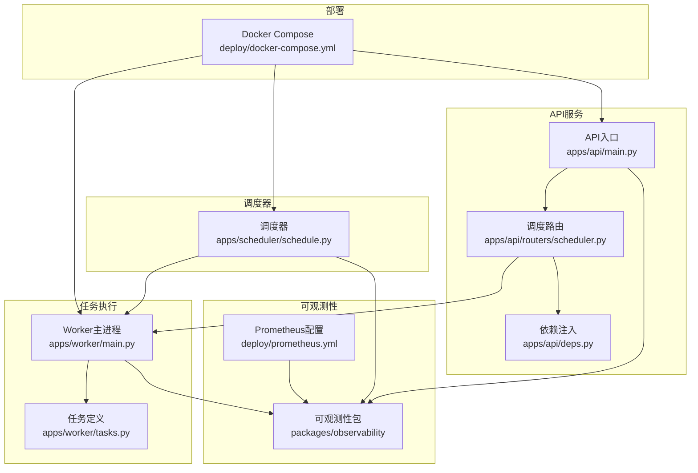
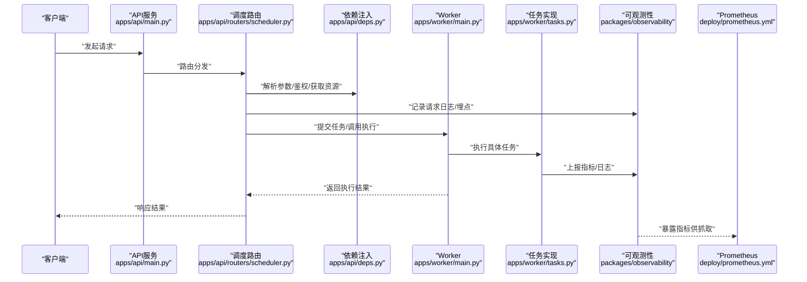
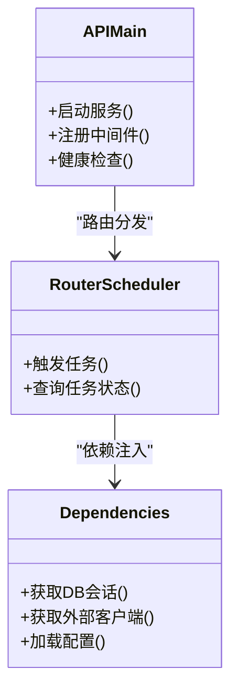
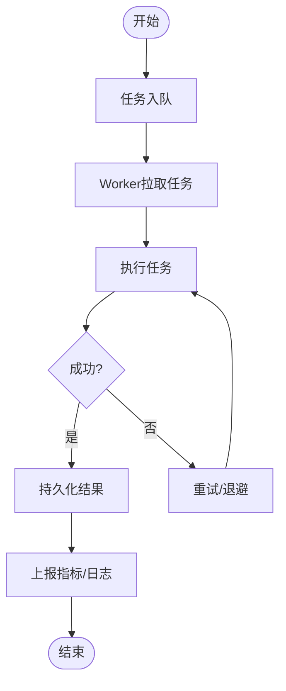
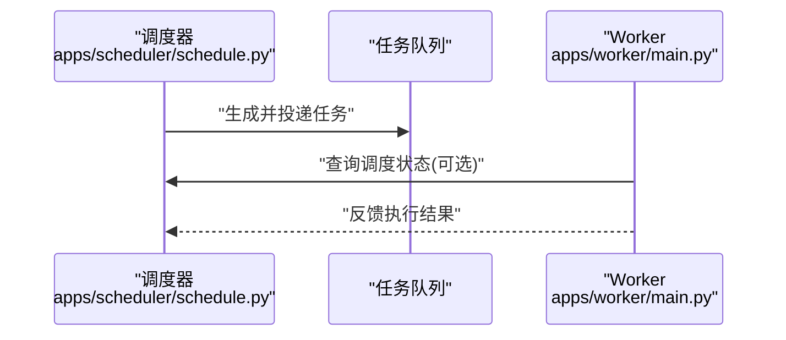
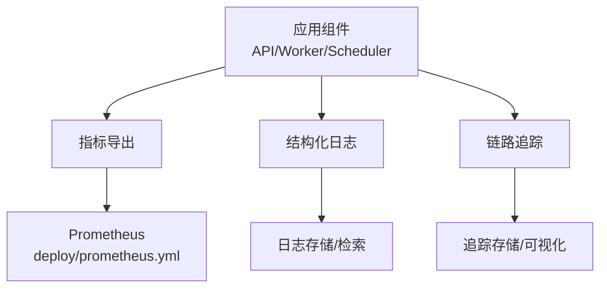
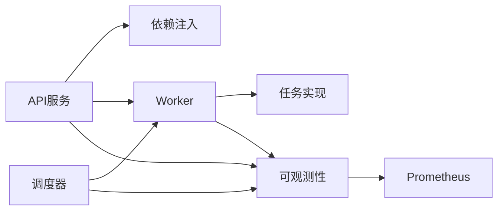

# 故障排查指南

<cite>
**本文引用的文件**   
- [apps/api/main.py](file://apps/api/main.py)
- [apps/api/deps.py](file://apps/api/deps.py)
- [apps/api/routers/scheduler.py](file://apps/api/routers/scheduler.py)
- [apps/worker/main.py](file://apps/worker/main.py)
- [apps/worker/tasks.py](file://apps/worker/tasks.py)
- [apps/scheduler/schedule.py](file://apps/scheduler/schedule.py)
- [deploy/docker-compose.yml](file://deploy/docker-compose.yml)
- [deploy/prometheus.yml](file://deploy/prometheus.yml)
- [packages/observability](file://packages/observability)
- [pyproject.toml](file://pyproject.toml)
</cite>

## 目录
1. [简介](#简介)
2. [项目结构](#项目结构)
3. [核心组件](#核心组件)
4. [架构总览](#架构总览)
5. [详细组件分析](#详细组件分析)
6. [依赖关系分析](#依赖关系分析)
7. [性能考虑](#性能考虑)
8. [故障排查手册](#故障排查手册)
9. [结论](#结论)
10. [附录](#附录)

## 简介
本指南面向生产与运维团队，提供系统化的故障排查方法与实践。内容覆盖API错误、数据库连接问题、任务执行失败等常见问题；日志分析与监控告警配置；性能瓶颈定位（CPU、内存、I/O）；分布式调试技巧（链路追踪、依赖分析、容错）；以及生产应急处理与恢复策略。文档以仓库实际代码为基础，结合部署与可观测性配置，给出可操作的步骤与图示。

## 项目结构
本项目采用多应用分层组织：
- API服务：基于FastAPI的HTTP接口层，负责路由、依赖注入与健康检查。
- Worker：异步任务执行器，消费调度任务并执行业务逻辑。
- Scheduler：定时调度器，按规则触发任务。
- Observability：可观测性能力（指标、日志、追踪）。
- Deploy：Docker Compose与Prometheus配置，支撑容器化与监控采集。

图表来源
- [apps/api/main.py](file://apps/api/main.py)
- [apps/api/deps.py](file://apps/api/deps.py)
- [apps/api/routers/scheduler.py](file://apps/api/routers/scheduler.py)
- [apps/worker/main.py](file://apps/worker/main.py)
- [apps/worker/tasks.py](file://apps/worker/tasks.py)
- [apps/scheduler/schedule.py](file://apps/scheduler/schedule.py)
- [deploy/prometheus.yml](file://deploy/prometheus.yml)
- [deploy/docker-compose.yml](file://deploy/docker-compose.yml)

章节来源
- [apps/api/main.py](file://apps/api/main.py)
- [apps/api/deps.py](file://apps/api/deps.py)
- [apps/api/routers/scheduler.py](file://apps/api/routers/scheduler.py)
- [apps/worker/main.py](file://apps/worker/main.py)
- [apps/worker/tasks.py](file://apps/worker/tasks.py)
- [apps/scheduler/schedule.py](file://apps/scheduler/schedule.py)
- [deploy/docker-compose.yml](file://deploy/docker-compose.yml)
- [deploy/prometheus.yml](file://deploy/prometheus.yml)

## 核心组件
- API服务
  - 入口与中间件：统一异常捕获、请求日志、健康检查端点。
  - 依赖注入：数据库会话、外部服务客户端、配置加载。
  - 路由：业务接口与调度控制接口。
- Worker
  - 进程模型：常驻进程，拉取任务队列消息，执行任务并上报状态。
  - 任务编排：重试、超时、幂等、回滚策略。
- Scheduler
  - 调度策略：时间轮或延迟队列驱动，周期性触发任务。
- Observability
  - 指标：业务与系统指标暴露。
  - 日志：结构化日志输出，包含上下文ID。
  - 追踪：跨进程链路ID透传。

章节来源
- [apps/api/main.py](file://apps/api/main.py)
- [apps/api/deps.py](file://apps/api/deps.py)
- [apps/api/routers/scheduler.py](file://apps/api/routers/scheduler.py)
- [apps/worker/main.py](file://apps/worker/main.py)
- [apps/worker/tasks.py](file://apps/worker/tasks.py)
- [apps/scheduler/schedule.py](file://apps/scheduler/schedule.py)
- [packages/observability](file://packages/observability)

## 架构总览
下图展示从API到任务执行的端到端流程，以及可观测性与监控的集成点。

图表来源
- [apps/api/main.py](file://apps/api/main.py)
- [apps/api/routers/scheduler.py](file://apps/api/routers/scheduler.py)
- [apps/api/deps.py](file://apps/api/deps.py)
- [apps/worker/main.py](file://apps/worker/main.py)
- [apps/worker/tasks.py](file://apps/worker/tasks.py)
- [packages/observability](file://packages/observability)
- [deploy/prometheus.yml](file://deploy/prometheus.yml)

## 详细组件分析

### API服务组件
- 职责
  - 接收HTTP请求，进行参数校验、鉴权、限流。
  - 通过依赖注入获取数据库会话、缓存、外部服务客户端。
  - 将业务调用委派给Worker或直接处理。
  - 统一异常处理与响应封装。
- 关键路径
  - 健康检查：用于负载均衡与健康探针。
  - 调度控制：触发批量任务、查询任务状态。
- 常见故障
  - 4xx/5xx错误：参数错误、权限不足、上游超时。
  - 连接池耗尽：数据库或外部服务连接泄漏。
  - 慢请求：下游依赖阻塞或数据量过大。

图表来源
- [apps/api/main.py](file://apps/api/main.py)
- [apps/api/routers/scheduler.py](file://apps/api/routers/scheduler.py)
- [apps/api/deps.py](file://apps/api/deps.py)

章节来源
- [apps/api/main.py](file://apps/api/main.py)
- [apps/api/routers/scheduler.py](file://apps/api/routers/scheduler.py)
- [apps/api/deps.py](file://apps/api/deps.py)

### Worker与任务组件
- 职责
  - 常驻进程，监听任务队列，执行任务并持久化结果。
  - 实现重试、超时、幂等与补偿逻辑。
- 关键路径
  - 任务生命周期：入队→拉取→执行→落库→上报指标。
  - 错误处理：捕获异常、记录堆栈、降级与告警。
- 常见故障
  - 任务堆积：消费者不足或下游慢。
  - 重复执行：幂等键缺失或去重策略失效。
  - 资源泄漏：未释放连接或句柄。

图表来源
- [apps/worker/main.py](file://apps/worker/main.py)
- [apps/worker/tasks.py](file://apps/worker/tasks.py)

章节来源
- [apps/worker/main.py](file://apps/worker/main.py)
- [apps/worker/tasks.py](file://apps/worker/tasks.py)

### 调度器组件
- 职责
  - 根据规则周期性地生成任务或触发批处理。
  - 管理调度状态与失败重试。
- 关键路径
  - 规则解析→任务生成→投递到队列→状态跟踪。
- 常见故障
  - 调度漂移：时钟不同步或时区配置错误。
  - 任务风暴：规则过于激进导致下游过载。

图表来源
- [apps/scheduler/schedule.py](file://apps/scheduler/schedule.py)
- [apps/worker/main.py](file://apps/worker/main.py)

章节来源
- [apps/scheduler/schedule.py](file://apps/scheduler/schedule.py)
- [apps/worker/main.py](file://apps/worker/main.py)

### 可观测性与监控
- 指标
  - 暴露HTTP请求计数、耗时、错误率；任务执行时长、成功率、积压数。
  - 系统指标：CPU、内存、GC、文件描述符、网络I/O。
- 日志
  - 结构化JSON格式，包含trace_id、span_id、用户与租户信息。
  - 分级输出：DEBUG/INFO/WARN/ERROR，生产默认INFO及以上。
- 追踪
  - 跨进程传递trace_id，聚合API→调度→Worker全链路。
- Prometheus集成
  - 抓取目标与指标命名规范，避免高基数标签。

图表来源
- [packages/observability](file://packages/observability)
- [deploy/prometheus.yml](file://deploy/prometheus.yml)

章节来源
- [packages/observability](file://packages/observability)
- [deploy/prometheus.yml](file://deploy/prometheus.yml)

## 依赖关系分析
- 组件耦合
  - API对依赖注入模块强耦合，便于替换实现与测试。
  - Worker与任务解耦，通过队列通信，提升弹性与扩展性。
- 外部依赖
  - 数据库连接池、缓存、消息队列、对象存储等。
- 潜在循环依赖
  - 确保API不直接依赖Worker内部实现，仅通过接口或队列交互。

图表来源
- [apps/api/main.py](file://apps/api/main.py)
- [apps/api/deps.py](file://apps/api/deps.py)
- [apps/worker/main.py](file://apps/worker/main.py)
- [apps/worker/tasks.py](file://apps/worker/tasks.py)
- [apps/scheduler/schedule.py](file://apps/scheduler/schedule.py)
- [packages/observability](file://packages/observability)
- [deploy/prometheus.yml](file://deploy/prometheus.yml)

章节来源
- [apps/api/main.py](file://apps/api/main.py)
- [apps/api/deps.py](file://apps/api/deps.py)
- [apps/worker/main.py](file://apps/worker/main.py)
- [apps/worker/tasks.py](file://apps/worker/tasks.py)
- [apps/scheduler/schedule.py](file://apps/scheduler/schedule.py)
- [packages/observability](file://packages/observability)
- [deploy/prometheus.yml](file://deploy/prometheus.yml)

## 性能考虑
- CPU分析
  - 使用采样型Profiler定位热点函数；关注序列化/反序列化、正则匹配、大对象拷贝。
  - 在Worker中限制并发度，避免CPU争用。
- 内存泄漏检测
  - 监控RSS与堆大小趋势；定位未释放连接、闭包引用、全局缓存膨胀。
  - 定期重启Worker并观察内存是否回落。
- I/O性能监控
  - 监控磁盘读写延迟、网络RTT与吞吐；识别慢查询与大响应体。
  - 使用分页与增量拉取减少单次负载。
- 连接池与超时
  - 合理设置连接池大小、空闲回收与超时；避免雪崩效应。
- 容量规划
  - 基于QPS、P99延迟与资源利用率设定扩缩容阈值。

[本节为通用指导，无需特定文件来源]

## 故障排查手册

### API错误排查
- 快速定位
  - 查看健康检查端点与访问日志，确认服务存活与请求分布。
  - 检查错误码分布与Top错误堆栈，优先处理影响面大的错误。
- 常见问题
  - 参数校验失败：核对输入约束与边界值。
  - 鉴权失败：检查令牌有效期与权限映射。
  - 上游超时：评估下游SLA与重试策略。
- 操作建议
  - 开启DEBUG日志临时诊断，注意脱敏。
  - 使用链路追踪ID关联请求全链路。
  - 对慢接口增加熔断与降级。

章节来源
- [apps/api/main.py](file://apps/api/main.py)
- [apps/api/routers/scheduler.py](file://apps/api/routers/scheduler.py)
- [apps/api/deps.py](file://apps/api/deps.py)

### 数据库连接问题排查
- 现象
  - 连接池耗尽、超时、死锁、事务长时间未提交。
- 定位步骤
  - 检查连接池配置与当前活跃连接数。
  - 分析慢查询与锁等待，定位热点表与索引缺失。
  - 验证事务范围与提交时机，避免长事务。
- 修复建议
  - 调整连接池大小与超时；引入读副本分流。
  - 优化SQL与索引；分批写入与批量更新。
  - 增加重试与退避，防止瞬时抖动放大。

章节来源
- [apps/api/deps.py](file://apps/api/deps.py)
- [apps/worker/tasks.py](file://apps/worker/tasks.py)

### 任务执行失败排查
- 现象
  - 任务堆积、重复执行、部分失败、结果不一致。
- 定位步骤
  - 检查任务队列积压与消费者数量。
  - 查看任务日志与堆栈，确认失败原因与重试次数。
  - 验证幂等键与去重策略，避免重复处理。
- 修复建议
  - 扩容Worker实例；调整并发度与批大小。
  - 完善补偿与回滚逻辑；引入死信队列。
  - 增加任务级监控与告警。

章节来源
- [apps/worker/main.py](file://apps/worker/main.py)
- [apps/worker/tasks.py](file://apps/worker/tasks.py)

### 日志分析技巧
- 日志级别
  - 生产默认INFO，临时诊断可提升至DEBUG，注意性能开销。
- 关键信息提取
  - trace_id、span_id、用户标识、租户、资源ID、错误码、耗时。
- 问题定位方法
  - 基于trace_id串联API→调度→Worker全链路。
  - 过滤ERROR与WARN，统计Top错误类型与出现频率。
  - 关联指标曲线，交叉验证异常时间点。

章节来源
- [packages/observability](file://packages/observability)

### 监控告警配置与使用
- 指标收集
  - 暴露HTTP、任务、系统指标；避免高基数标签。
- 阈值设置
  - 错误率、P99延迟、队列积压、CPU/内存使用率。
- 通知机制
  - 多渠道通知（邮件、短信、IM），分级告警与抑制策略。
- Prometheus集成
  - 配置抓取目标与保留策略，建立仪表盘与告警规则。

章节来源
- [deploy/prometheus.yml](file://deploy/prometheus.yml)
- [packages/observability](file://packages/observability)

### 性能瓶颈分析工具与方法
- CPU分析
  - 使用采样型Profiler与火焰图定位热点。
- 内存泄漏检测
  - 监控RSS与堆增长，定位未释放资源。
- I/O性能监控
  - 监控磁盘与网络指标，识别慢I/O与拥塞。
- 压测与基准
  - 模拟峰值流量，验证扩容与降级效果。

[本节为通用指导，无需特定文件来源]

### 分布式系统调试技巧
- 链路追踪
  - 跨进程传递trace_id，聚合各组件日志与指标。
- 依赖关系分析
  - 绘制服务拓扑，识别单点与瓶颈。
- 容错处理
  - 重试、退避、熔断、舱壁隔离、降级与回滚。

章节来源
- [packages/observability](file://packages/observability)

### 生产环境应急处理流程与恢复策略
- 发现与定级
  - 监控告警触发，快速评估影响范围与严重等级。
- 止血措施
  - 限流、熔断、降级、切流至备用集群。
- 根因定位
  - 基于链路追踪与日志快速定位问题组件与变更。
- 恢复与验证
  - 回滚变更、扩容资源、清理积压；逐步放量验证。
- 复盘与改进
  - 记录事件时间线、根因、改进项与演练计划。

[本节为通用指导，无需特定文件来源]

## 结论
通过统一的日志、指标与追踪体系，结合清晰的组件边界与可观测性设计，能够快速定位与恢复生产问题。建议在上线前完成监控告警与应急预案演练，持续优化性能与稳定性。

[本节为总结性内容，无需特定文件来源]

## 附录

### 常用命令与路径参考
- 查看服务日志
  - 使用容器日志命令查看API、Worker、Scheduler日志。
- 查看Prometheus抓取状态
  - 检查目标健康与指标暴露情况。
- 配置文件位置
  - Docker Compose与Prometheus配置位于deploy目录。

章节来源
- [deploy/docker-compose.yml](file://deploy/docker-compose.yml)
- [deploy/prometheus.yml](file://deploy/prometheus.yml)

### 版本与依赖
- Python与第三方库版本
  - 参见项目依赖清单，关注安全补丁与兼容性。

章节来源
- [pyproject.toml](file://pyproject.toml)