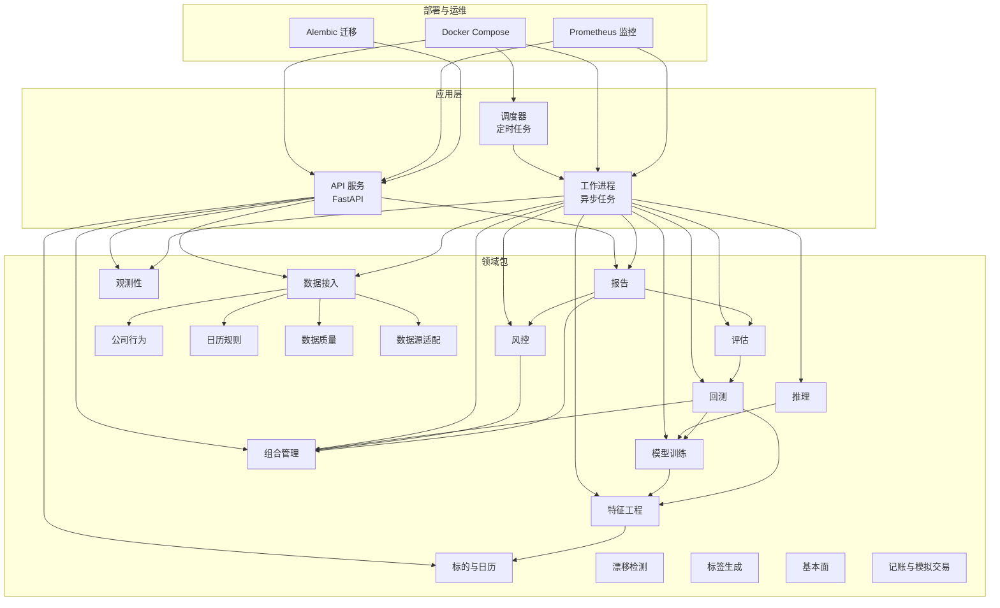
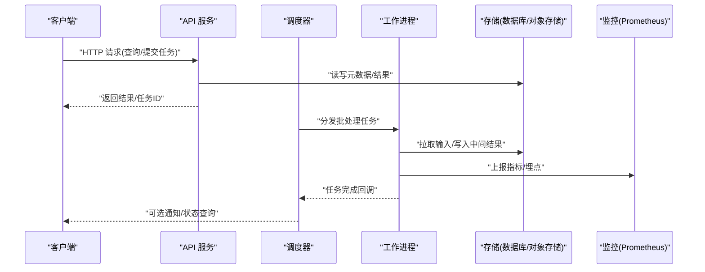
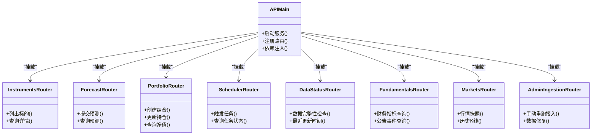
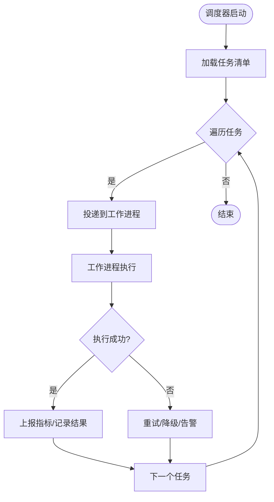
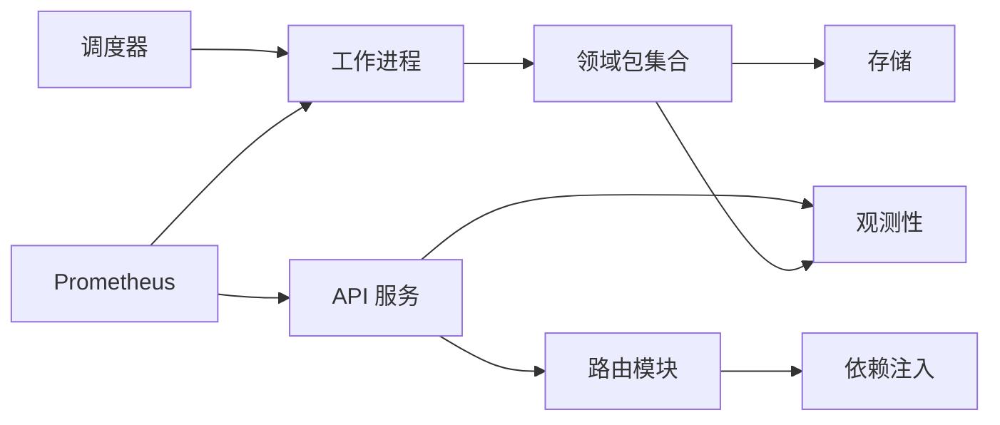

# 最佳实践

<cite>
**本文引用的文件**   
- [README.md](file://README.md)
- [pyproject.toml](file://pyproject.toml)
- [apps/api/main.py](file://apps/api/main.py)
- [apps/api/deps.py](file://apps/api/deps.py)
- [apps/api/routers/instruments.py](file://apps/api/routers/instruments.py)
- [apps/api/routers/forecast.py](file://apps/api/routers/forecast.py)
- [apps/api/routers/portfolio.py](file://apps/api/routers/portfolio.py)
- [apps/api/routers/scheduler.py](file://apps/api/routers/scheduler.py)
- [apps/api/routers/data_status.py](file://apps/api/routers/data_status.py)
- [apps/api/routers/fundamentals.py](file://apps/api/routers/fundamentals.py)
- [apps/api/routers/markets.py](file://apps/api/routers/markets.py)
- [apps/api/routers/admin_ingestion.py](file://apps/api/routers/admin_ingestion.py)
- [apps/scheduler/schedule.py](file://apps/scheduler/schedule.py)
- [apps/worker/main.py](file://apps/worker/main.py)
- [apps/worker/tasks.py](file://apps/worker/tasks.py)
- [packages/backtest/__init__.py](file://packages/backtest/__init__.py)
- [packages/evaluation/__init__.py](file://packages/evaluation/__init__.py)
- [packages/observability/__init__.py](file://packages/observability/__init__.py)
- [packages/risk/__init__.py](file://packages/risk/__init__.py)
- [packages/training/__init__.py](file://packages/training/__init__.py)
- [packages/ingestion/__init__.py](file://packages/ingestion/__init__.py)
- [packages/datasets/__init__.py](file://packages/datasets/__init__.py)
- [packages/features/__init__.py](file://packages/features/__init__.py)
- [packages/models/__init__.py](file://packages/models/__init__.py)
- [packages/portfolios/__init__.py](file://packages/portfolios/__init__.py)
- [packages/reporting/__init__.py](file://packages/reporting/__init__.py)
- [packages/corporate_actions/__init__.py](file://packages/corporate_actions/__init__.py)
- [packages/calendar_rule/__init__.py](file://packages/calendar_rule/__init__.py)
- [packages/common/__init__.py](file://packages/common/__init__.py)
- [packages/instrument/__init__.py](file://packages/instrument/__init__.py)
- [packages/instruments/__init__.py](file://packages/instruments/__init__.py)
- [packages/labels/__init__.py](file://packages/labels/__init__.py)
- [packages/ledger_paper/__init__.py](file://packages/ledger_paper/__init__.py)
- [packages/fundamentals/__init__.py](file://packages/fundamentals/__init__.py)
- [packages/inference/__init__.py](file://packages/inference/__init__.py)
- [packages/data_quality/__init__.py](file://packages/data_quality/__init__.py)
- [packages/data_sources/__init__.py](file://packages/data_sources/__init__.py)
- [packages/drift/__init__.py](file://packages/drift/__init__.py)
- [deploy/docker-compose.yml](file://deploy/docker-compose.yml)
- [deploy/prometheus.yml](file://deploy/prometheus.yml)
- [alembic.ini](file://alembic.ini)
- [sql/migrations/env.py](file://sql/migrations/env.py)
- [scripts/validate_forecast.py](file://skills/cross-market-quant-research/scripts/validate_forecast.py)
- [scripts/validate_report.py](file://skills/cross-market-quant-research/scripts/validate_report.py)
- [scripts/validate_risk_trace.py](file://skills/cross-market-quant-research/scripts/validate_risk_trace.py)
- [tests/unit/test_scheduler.py](file://tests/unit/test_scheduler.py)
- [tests/unit/test_worker_tasks.py](file://tests/unit/test_worker_tasks.py)
- [tests/unit/test_api_health.py](file://tests/unit/test_api_health.py)
- [tests/integration/test_e2e_pipeline.py](file://tests/integration/test_e2e_pipeline.py)
</cite>

## 目录
1. [引言](#引言)
2. [项目结构](#项目结构)
3. [核心组件](#核心组件)
4. [架构总览](#架构总览)
5. [详细组件分析](#详细组件分析)
6. [依赖关系分析](#依赖关系分析)
7. [性能考虑](#性能考虑)
8. [故障排查指南](#故障排查指南)
9. [结论](#结论)
10. [附录](#附录)

## 引言
本指南面向量化投资系统的策略研发、工程化与生产运维团队，围绕回测设计、过拟合防范、绩效评估、性能优化、安全合规、扩展点使用、监控告警、团队协作与风险管理等主题，提供可落地的最佳实践。文档以仓库现有模块为基础，结合测试与部署配置，给出从开发到生产的端到端建议。

## 项目结构
系统采用“应用层 + 领域包 + 部署与迁移”的分层组织方式：
- 应用层（apps）：API 服务、调度器、工作进程、MCP 工具集
- 领域包（packages）：数据接入、特征工程、模型训练、推理、回测、评估、风控、报告、账本、日历规则、公司行为、观测性等
- 部署（deploy）：容器编排与监控采集
- 数据库迁移（sql/migrations）：版本化演进
- 技能与脚本（skills）：跨市场研究规范与校验脚本
- 测试（tests）：单元与集成用例

图表来源
- [apps/api/main.py](file://apps/api/main.py)
- [apps/scheduler/schedule.py](file://apps/scheduler/schedule.py)
- [apps/worker/main.py](file://apps/worker/main.py)
- [deploy/docker-compose.yml](file://deploy/docker-compose.yml)
- [deploy/prometheus.yml](file://deploy/prometheus.yml)
- [alembic.ini](file://alembic.ini)

章节来源
- [README.md](file://README.md)
- [pyproject.toml](file://pyproject.toml)

## 核心组件
- API 服务：基于 FastAPI 的 REST 接口，暴露标的、行情、基本面、预测、组合、调度、数据状态等能力；通过依赖注入统一管理资源与权限。
- 调度器：按周期触发批处理或在线任务，协调工作进程执行。
- 工作进程：消费任务队列，执行数据接入、特征计算、模型训练、推理、回测、评估、风控与报告生成等。
- 领域包：按职责划分的数据与算法管线，支持多市场、多资产类别。
- 观测性与报告：指标采集、日志追踪与报告输出，支撑可观测与审计。
- 部署与迁移：容器编排与数据库版本控制，保障环境一致性与可演进。

章节来源
- [apps/api/main.py](file://apps/api/main.py)
- [apps/api/deps.py](file://apps/api/deps.py)
- [apps/scheduler/schedule.py](file://apps/scheduler/schedule.py)
- [apps/worker/main.py](file://apps/worker/main.py)
- [apps/worker/tasks.py](file://apps/worker/tasks.py)

## 架构总览
系统遵循“请求驱动 + 事件驱动”的双模架构：
- 请求驱动：API 服务响应实时查询与轻量操作（如获取标的信息、查看数据状态）。
- 事件驱动：调度器定时触发长耗时任务，由工作进程并行执行，结果写入存储并上报指标。

图表来源
- [apps/api/main.py](file://apps/api/main.py)
- [apps/scheduler/schedule.py](file://apps/scheduler/schedule.py)
- [apps/worker/main.py](file://apps/worker/main.py)
- [deploy/prometheus.yml](file://deploy/prometheus.yml)

## 详细组件分析

### API 服务与路由
- 入口与依赖注入：统一初始化应用生命周期、注册路由、注入共享依赖（如数据库连接、配置、认证、限流等），确保可扩展与可测试。
- 路由分层：按业务域拆分路由模块（标的、预测、组合、调度、数据状态、基本面、市场、管理入站等），便于权限控制与独立演进。
- 健康检查与可观测：提供健康检查端点，配合监控采集关键指标（请求延迟、错误率、吞吐）。

图表来源
- [apps/api/main.py](file://apps/api/main.py)
- [apps/api/routers/instruments.py](file://apps/api/routers/instruments.py)
- [apps/api/routers/forecast.py](file://apps/api/routers/forecast.py)
- [apps/api/routers/portfolio.py](file://apps/api/routers/portfolio.py)
- [apps/api/routers/scheduler.py](file://apps/api/routers/scheduler.py)
- [apps/api/routers/data_status.py](file://apps/api/routers/data_status.py)
- [apps/api/routers/fundamentals.py](file://apps/api/routers/fundamentals.py)
- [apps/api/routers/markets.py](file://apps/api/routers/markets.py)
- [apps/api/routers/admin_ingestion.py](file://apps/api/routers/admin_ingestion.py)

章节来源
- [apps/api/main.py](file://apps/api/main.py)
- [apps/api/deps.py](file://apps/api/deps.py)
- [apps/api/routers/instruments.py](file://apps/api/routers/instruments.py)
- [apps/api/routers/forecast.py](file://apps/api/routers/forecast.py)
- [apps/api/routers/portfolio.py](file://apps/api/routers/portfolio.py)
- [apps/api/routers/scheduler.py](file://apps/api/routers/scheduler.py)
- [apps/api/routers/data_status.py](file://apps/api/routers/data_status.py)
- [apps/api/routers/fundamentals.py](file://apps/api/routers/fundamentals.py)
- [apps/api/routers/markets.py](file://apps/api/routers/markets.py)
- [apps/api/routers/admin_ingestion.py](file://apps/api/routers/admin_ingestion.py)

### 调度与工作进程
- 调度器：定义任务清单与执行频率，负责将任务投递至工作进程。
- 工作进程：实现具体任务逻辑，包含数据接入、特征计算、模型训练、推理、回测、评估、风控与报告生成等。
- 任务幂等与重试：对失败任务进行重试与补偿，保证最终一致性。

图表来源
- [apps/scheduler/schedule.py](file://apps/scheduler/schedule.py)
- [apps/worker/main.py](file://apps/worker/main.py)
- [apps/worker/tasks.py](file://apps/worker/tasks.py)

章节来源
- [apps/scheduler/schedule.py](file://apps/scheduler/schedule.py)
- [apps/worker/main.py](file://apps/worker/main.py)
- [apps/worker/tasks.py](file://apps/worker/tasks.py)

### 回测与评估
- 回测设计要点：
  - 时间旅行防泄漏：严格基于可用信息集构建特征与标签，避免未来函数。
  - 滑点与手续费：在订单执行模型中显式建模交易成本与冲击。
  - 样本外验证：滚动窗口/交叉验证，防止过拟合。
  - 稳健性检验：参数敏感性、不同市场区间、不同流动性假设。
- 评估方法：
  - 收益风险指标：年化收益、波动率、夏普比率、最大回撤、Calmar 比率等。
  - 稳定性指标：月度胜率、换手率、行业/风格暴露、因子暴露。
  - 压力测试：极端行情、流动性枯竭、数据缺失场景。
- 过拟合防范：
  - 正则化与早停、简化模型复杂度。
  - 多重比较校正、保留独立测试集。
  - 随机种子固定与结果复现。

章节来源
- [packages/backtest/__init__.py](file://packages/backtest/__init__.py)
- [packages/evaluation/__init__.py](file://packages/evaluation/__init__.py)
- [packages/risk/__init__.py](file://packages/risk/__init__.py)
- [packages/training/__init__.py](file://packages/training/__init__.py)

### 数据接入与质量
- 数据接入：
  - 多源适配：统一抽象数据源接口，屏蔽差异。
  - 公司行为与日历：除权除息、停牌、节假日等影响需正确还原。
  - 增量与全量：支持断点续传与幂等写入。
- 数据质量：
  - 完整性校验：字段非空、范围检查、时序连续性。
  - 一致性校验：跨源对齐、去重、冲突解决。
  - 异常检测：漂移检测、分布变化、离群值。

章节来源
- [packages/ingestion/__init__.py](file://packages/ingestion/__init__.py)
- [packages/data_sources/__init__.py](file://packages/data_sources/__init__.py)
- [packages/data_quality/__init__.py](file://packages/data_quality/__init__.py)
- [packages/corporate_actions/__init__.py](file://packages/corporate_actions/__init__.py)
- [packages/calendar_rule/__init__.py](file://packages/calendar_rule/__init__.py)
- [packages/drift/__init__.py](file://packages/drift/__init__.py)

### 特征工程与模型
- 特征工程：
  - 标准化与缩放：按时间窗口统计量进行归一化。
  - 滞后与滚动：避免未来信息泄露，明确可见期。
  - 特征选择：重要性排序、共线性检测、稳定性筛选。
- 模型训练：
  - 超参搜索：网格/贝叶斯优化，带早停与交叉验证。
  - 模型家族：树模型、线性模型、深度学习等，按问题选择。
  - 版本管理：模型、特征、数据版本绑定，可追溯。

章节来源
- [packages/features/__init__.py](file://packages/features/__init__.py)
- [packages/models/__init__.py](file://packages/models/__init__.py)
- [packages/training/__init__.py](file://packages/training/__init__.py)

### 推理与预测
- 推理服务：
  - 批量与在线：根据延迟要求选择模式。
  - 缓存与预计算：热点特征与结果缓存。
  - 容错与降级：模型不可用时的默认策略。
- 预测校验：
  - 格式与范围：输出结构、数值范围、缺失处理。
  - 回归测试：与黄金数据集对比，确保稳定。

章节来源
- [packages/inference/__init__.py](file://packages/inference/__init__.py)
- [skills/cross-market-quant-research/scripts/validate_forecast.py](file://skills/cross-market-quant-research/scripts/validate_forecast.py)

### 组合管理与风控
- 组合管理：
  - 头寸与权重：目标权重、再平衡规则、约束条件。
  - 交易执行：分批下单、限价/市价、成交确认。
  - 净值与估值：日终估值、费用扣除、分红处理。
- 风控：
  - 事前限制：仓位上限、集中度、杠杆、止损止盈。
  - 事中监控：实时风险敞口、VaR、压力情景。
  - 事后复盘：归因分析、偏差修正。

章节来源
- [packages/portfolios/__init__.py](file://packages/portfolios/__init__.py)
- [packages/risk/__init__.py](file://packages/risk/__init__.py)
- [packages/ledger_paper/__init__.py](file://packages/ledger_paper/__init__.py)

### 报告与可观测性
- 报告：
  - 内容模板：策略说明、回测结果、风险指标、变更记录。
  - 自动化生成：定期产出与归档。
- 可观测性：
  - 指标：请求延迟、错误率、任务时长、数据新鲜度。
  - 日志：结构化日志、链路追踪、敏感信息脱敏。
  - 告警：阈值与分级，避免告警风暴。

章节来源
- [packages/reporting/__init__.py](file://packages/reporting/__init__.py)
- [packages/observability/__init__.py](file://packages/observability/__init__.py)
- [deploy/prometheus.yml](file://deploy/prometheus.yml)

### 数据库与迁移
- 迁移管理：
  - Alembic 版本化：每次变更对应迁移脚本，可回滚。
  - 环境隔离：开发、测试、生产环境独立库。
- 数据一致性：
  - 事务与幂等：写入前检查、去重键。
  - 审计事件：关键变更留痕。

章节来源
- [alembic.ini](file://alembic.ini)
- [sql/migrations/env.py](file://sql/migrations/env.py)

## 依赖关系分析
- 模块内聚与耦合：
  - 高内聚：各包聚焦单一职责（如特征、模型、回测、评估）。
  - 低耦合：通过接口与消息传递解耦，减少直接依赖。
- 外部依赖：
  - 容器编排与监控：Docker Compose、Prometheus。
  - 数据库迁移：Alembic。
- 潜在循环依赖：
  - 避免回测与评估互相导入，应通过接口或事件桥接。

图表来源
- [apps/api/main.py](file://apps/api/main.py)
- [apps/api/deps.py](file://apps/api/deps.py)
- [apps/scheduler/schedule.py](file://apps/scheduler/schedule.py)
- [apps/worker/main.py](file://apps/worker/main.py)
- [deploy/prometheus.yml](file://deploy/prometheus.yml)

章节来源
- [pyproject.toml](file://pyproject.toml)
- [deploy/docker-compose.yml](file://deploy/docker-compose.yml)

## 性能考虑
- 计算密集型任务：
  - 并行与分片：按标的/时间窗口分片，利用多核/分布式。
  - 内存管理：流式处理、惰性计算、及时释放。
- I/O 密集：
  - 连接池：数据库/对象存储连接复用。
  - 缓存：热点数据与中间结果缓存。
- 网络与序列化：
  - 压缩与分页：大响应体分页返回。
  - 超时与重试：合理设置超时与退避策略。
- 监控与定位：
  - 指标埋点：关键路径耗时、错误率、队列积压。
  - 采样日志：生产环境降低日志开销。

[本节为通用指导，不直接分析具体文件]

## 故障排查指南
- 常见问题定位：
  - API 健康检查：确认服务存活与依赖连通性。
  - 任务失败：查看工作进程日志与重试次数。
  - 数据不一致：核对数据质量校验与漂移检测结果。
- 诊断工具：
  - 单元测试：覆盖核心逻辑与边界条件。
  - 集成测试：端到端流水线验证。
  - 监控面板：Prometheus 指标与告警。
- 恢复策略：
  - 幂等重放：对失败任务进行幂等重放。
  - 回滚与降级：快速回滚到上一稳定版本或启用降级策略。

章节来源
- [tests/unit/test_api_health.py](file://tests/unit/test_api_health.py)
- [tests/unit/test_scheduler.py](file://tests/unit/test_scheduler.py)
- [tests/unit/test_worker_tasks.py](file://tests/unit/test_worker_tasks.py)
- [tests/integration/test_e2e_pipeline.py](file://tests/integration/test_e2e_pipeline.py)
- [deploy/prometheus.yml](file://deploy/prometheus.yml)

## 结论
本指南从架构、组件、性能、安全、监控、协作与合规等维度总结了量化投资系统的最佳实践。建议在研发阶段强化数据质量与可观测性，在生产阶段重视稳定性与风险控制，并通过持续改进与知识沉淀提升团队效率与策略稳健性。

[本节为总结性内容，不直接分析具体文件]

## 附录

### 安全与合规
- 数据安全：
  - 传输加密：HTTPS/TLS。
  - 静态加密：敏感数据与密钥加密存储。
  - 访问控制：最小权限原则、角色分离、审计日志。
- API 安全：
  - 鉴权与授权：JWT/OAuth2、细粒度权限。
  - 限流与熔断：防止滥用与雪崩。
  - 输入校验：白名单与类型校验。
- 合规与风险管理：
  - 策略审批与发布流程。
  - 风险限额与压力测试。
  - 审计与可追溯：模型、数据、决策链留痕。

[本节为通用指导，不直接分析具体文件]

### 扩展点与自定义开发
- 扩展点模式：
  - 插件化路由：新增业务路由无需改动核心。
  - 数据源适配器：实现统一接口接入新数据源。
  - 任务处理器：实现标准任务接口，纳入调度器。
- 自定义指南：
  - 接口契约：明确输入输出与错误码。
  - 测试先行：编写单测与集成用例。
  - 文档与示例：提供使用示例与最佳实践。

章节来源
- [apps/api/routers/instruments.py](file://apps/api/routers/instruments.py)
- [apps/api/routers/forecast.py](file://apps/api/routers/forecast.py)
- [apps/api/routers/portfolio.py](file://apps/api/routers/portfolio.py)
- [apps/api/routers/scheduler.py](file://apps/api/routers/scheduler.py)
- [apps/api/routers/data_status.py](file://apps/api/routers/data_status.py)
- [apps/api/routers/fundamentals.py](file://apps/api/routers/fundamentals.py)
- [apps/api/routers/markets.py](file://apps/api/routers/markets.py)
- [apps/api/routers/admin_ingestion.py](file://apps/api/routers/admin_ingestion.py)
- [apps/worker/tasks.py](file://apps/worker/tasks.py)

### 监控指标与告警阈值建议
- 指标建议：
  - API：请求延迟 P95/P99、错误率、吞吐、活跃连接数。
  - 任务：执行时长、成功率、重试次数、队列长度。
  - 数据：新鲜度、完整性、漂移指数。
- 告警阈值：
  - 错误率超过阈值（如 >1%）持续 N 分钟。
  - 任务失败率超过阈值（如 >5%）持续 N 分钟。
  - 数据新鲜度超过 SLA（如 >2 小时未更新）。
  - 队列积压超过容量（如 >1000 条）。

章节来源
- [deploy/prometheus.yml](file://deploy/prometheus.yml)

### 团队协作与知识管理
- 代码规范：
  - 命名与注释：清晰表达意图与边界条件。
  - 提交信息：语义化版本与变更说明。
- 评审与发布：
  - 代码审查：关注安全性、性能与可维护性。
  - 灰度发布：逐步放量与回滚预案。
- 知识库：
  - 策略文档：假设、数据、特征、模型、回测、评估。
  - 经验沉淀：常见问题与解决方案。

[本节为通用指导，不直接分析具体文件]

### 不同角色的实践指导
- 策略研究员：
  - 关注数据质量与特征有效性，避免未来函数。
  - 使用滚动窗口与样本外验证，控制过拟合。
- 工程师：
  - 模块化与接口化，提升可测试性与可维护性。
  - 完善监控与告警，保障稳定性。
- 运维与平台：
  - 容器编排与资源配额，弹性伸缩。
  - 备份与灾备，快速恢复。
- 风控与合规：
  - 设定风险限额与压力测试，确保合规。
  - 审计与可追溯，满足监管要求。

[本节为通用指导，不直接分析具体文件]