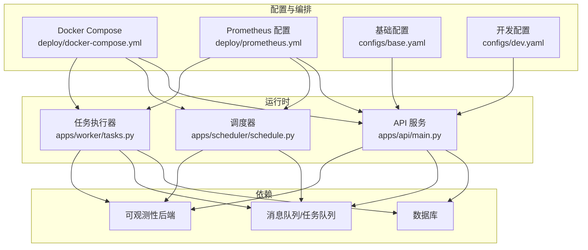
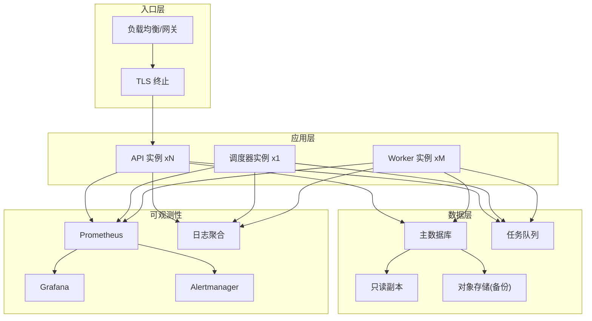
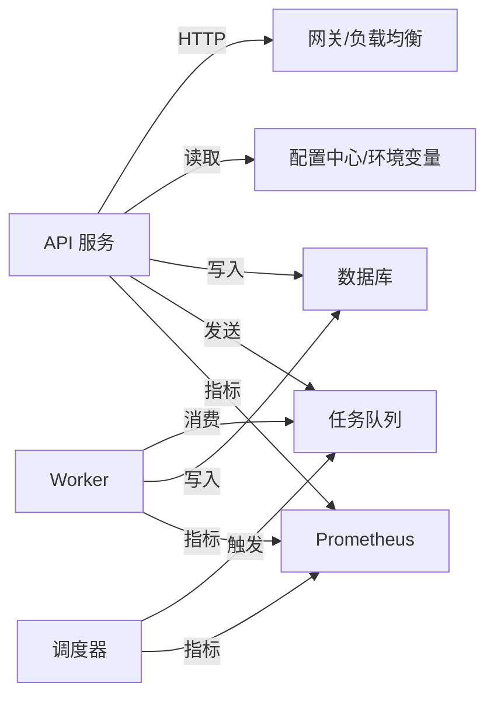

# 生产环境部署

<cite>
**本文引用的文件**   
- [docker-compose.yml](file://deploy/docker-compose.yml)
- [prometheus.yml](file://deploy/prometheus.yml)
- [main.py](file://apps/api/main.py)
- [deps.py](file://apps/api/deps.py)
- [base.yaml](file://configs/base.yaml)
- [dev.yaml](file://configs/dev.yaml)
- [schedule.py](file://apps/scheduler/schedule.py)
- [tasks.py](file://apps/worker/tasks.py)
- [pyproject.toml](file://pyproject.toml)
</cite>

## 目录
1. [简介](#简介)
2. [项目结构](#项目结构)
3. [核心组件](#核心组件)
4. [架构总览](#架构总览)
5. [详细组件分析](#详细组件分析)
6. [依赖分析](#依赖分析)
7. [性能与容量规划](#性能与容量规划)
8. [故障排查指南](#故障排查指南)
9. [结论](#结论)
10. [附录](#附录)

## 简介
本指南面向生产环境，围绕容器化、配置管理、高可用、CI/CD、监控告警与弹性伸缩等主题，提供可落地的最佳实践。内容结合仓库中现有的编排与可观测性资源，给出镜像优化、多阶段构建、安全扫描、环境变量与配置中心、负载均衡与故障转移、数据备份策略、自动化流水线、指标采集与告警、容量规划与自动扩缩容的完整方案。

## 项目结构
仓库采用应用分层与领域包组织方式：
- apps：运行期服务（API、调度器、Worker）
- configs：YAML 配置（基础与开发环境）
- deploy：容器编排与监控配置
- packages：领域能力与通用库
- tests：单元与集成测试
- sql/migrations：数据库迁移脚本

图示来源
- [docker-compose.yml](file://deploy/docker-compose.yml)
- [prometheus.yml](file://deploy/prometheus.yml)
- [main.py](file://apps/api/main.py)
- [schedule.py](file://apps/scheduler/schedule.py)
- [tasks.py](file://apps/worker/tasks.py)
- [base.yaml](file://configs/base.yaml)
- [dev.yaml](file://configs/dev.yaml)

章节来源
- [docker-compose.yml](file://deploy/docker-compose.yml)
- [prometheus.yml](file://deploy/prometheus.yml)
- [main.py](file://apps/api/main.py)
- [schedule.py](file://apps/scheduler/schedule.py)
- [tasks.py](file://apps/worker/tasks.py)
- [base.yaml](file://configs/base.yaml)
- [dev.yaml](file://configs/dev.yaml)

## 核心组件
- API 服务：对外暴露 HTTP 接口，负责请求路由、鉴权、业务编排与指标上报。
- 调度器：周期性触发数据采集、计算或报表生成等任务。
- Worker：异步执行耗时任务，消费队列消息并持久化结果。
- 配置系统：基于 YAML 的环境配置，支持基础与差异化配置合并。
- 可观测性：通过 Prometheus 抓取各服务的指标端点，统一存储与可视化。

章节来源
- [main.py](file://apps/api/main.py)
- [schedule.py](file://apps/scheduler/schedule.py)
- [tasks.py](file://apps/worker/tasks.py)
- [base.yaml](file://configs/base.yaml)
- [dev.yaml](file://configs/dev.yaml)
- [prometheus.yml](file://deploy/prometheus.yml)

## 架构总览
生产环境建议采用“无状态 API + 有状态数据层 + 异步任务”的分层架构，配合容器编排与可观测性体系实现高可用与可运维。

[此图为概念性架构图，不直接映射具体源码文件]

## 详细组件分析

### 容器化与镜像优化
- 多阶段构建
  - 第一阶段：安装依赖与编译（如 C/C++ 扩展），使用包含构建工具链的基础镜像。
  - 第二阶段：仅拷贝产物与最小运行时（如 slim/alpine），显著减小镜像体积。
- 镜像优化要点
  - 使用多阶段构建减少最终镜像大小。
  - 合理排序 Dockerfile 指令，最大化利用缓存层。
  - 清理构建缓存与临时文件，避免引入无关二进制。
  - 固定基础镜像版本，启用镜像签名与漏洞扫描。
- 安全扫描
  - 在 CI 中集成镜像扫描（如 Trivy、Grype），阻断高危漏洞。
  - 定期拉取并更新基础镜像，跟踪 CVE 公告。
- 示例参考路径
  - [Docker Compose 编排](file://deploy/docker-compose.yml)

章节来源
- [docker-compose.yml](file://deploy/docker-compose.yml)

### 环境变量管理与配置中心
- 环境变量
  - 将敏感信息（密钥、连接串）注入为环境变量，避免写入镜像或代码仓库。
  - 使用 .env 模板与平台级密钥管理服务（如 KMS/Secrets Manager）。
- 配置中心与热更新
  - 将非敏感配置集中到配置中心（如 Consul、Apollo、Nacos），服务启动时加载，变更时热更新。
  - 对需要重启的配置项，采用滚动升级策略降低影响面。
- 环境隔离
  - 按环境（dev/staging/prod）分离命名空间、网络与存储卷。
  - 使用独立配置集与密钥集，避免跨环境泄露。
- 现有配置
  - 基础配置与开发配置分别存放于 YAML 文件，便于本地调试与差异对比。
  - 建议在 prod 环境中以配置中心覆盖默认值，并通过环境变量注入敏感项。
- 示例参考路径
  - [基础配置](file://configs/base.yaml)
  - [开发配置](file://configs/dev.yaml)

章节来源
- [base.yaml](file://configs/base.yaml)
- [dev.yaml](file://configs/dev.yaml)

### 高可用架构设计
- 负载均衡
  - 在入口层使用反向代理/网关进行健康检查与流量分发。
  - 对 API 服务保持无状态，水平扩展实例数。
- 故障转移
  - 数据库主从复制与自动切换；读写分离提升吞吐与可用性。
  - 任务队列具备持久化与重试机制，确保任务幂等与至少一次语义。
- 数据备份策略
  - 定时全量+增量备份至对象存储，保留周期与恢复演练纳入 SLA。
  - 关键元数据与配置变更纳入审计与版本控制。
- 示例参考路径
  - [编排定义](file://deploy/docker-compose.yml)

章节来源
- [docker-compose.yml](file://deploy/docker-compose.yml)

### CI/CD 流水线设计
- 自动化测试
  - 单元测试与集成测试并行执行，失败即阻断。
  - 使用缓存加速依赖安装与测试运行。
- 代码质量与安全
  - 静态检查、格式化、类型检查与依赖漏洞扫描。
  - 提交前钩子与 PR 门禁。
- 灰度发布
  - 蓝绿或金丝雀发布：先向小比例流量开放新版本，观察指标后逐步放量。
  - 回滚策略：一键回滚到上一稳定版本。
- 制品与镜像
  - 构建镜像并推送至私有仓库，附带标签与校验和。
  - 在部署阶段锁定镜像版本，禁止动态拉取 latest。
- 示例参考路径
  - [项目依赖与工具配置](file://pyproject.toml)

章节来源
- [pyproject.toml](file://pyproject.toml)

### 监控告警体系搭建
- 指标采集
  - 在各服务中暴露标准指标端点，由 Prometheus 定期抓取。
  - 采集业务指标（请求量、错误率、延迟）、系统指标（CPU、内存、磁盘、网络）与用户行为指标（关键操作转化漏斗）。
- 可视化与告警
  - Grafana 展示仪表盘，Alertmanager 对接通知渠道（邮件、IM、电话）。
  - 设置分级告警与抑制规则，避免告警风暴。
- 日志与链路追踪
  - 结构化日志输出，统一收集与检索。
  - 分布式追踪用于定位跨服务调用瓶颈。
- 示例参考路径
  - [Prometheus 配置](file://deploy/prometheus.yml)

章节来源
- [prometheus.yml](file://deploy/prometheus.yml)

### 容量规划与弹性伸缩
- 容量规划
  - 基于历史峰值 QPS、P99 延迟与资源利用率估算单实例容量。
  - 预留冗余（通常 30%-50%）应对突发流量与节点故障。
- 弹性伸缩
  - 基于 CPU/内存/自定义业务指标（如队列积压长度）触发扩缩容。
  - 设置最小/最大实例数与冷却时间，避免抖动。
- 资源配额与限制
  - 为每个容器设置 requests/limits，保障公平调度与稳定性。
- 示例参考路径
  - [编排定义](file://deploy/docker-compose.yml)

章节来源
- [docker-compose.yml](file://deploy/docker-compose.yml)

## 依赖分析
- 组件耦合
  - API 与调度器、Worker 之间通过消息队列解耦，降低直接依赖。
  - 所有组件共享配置与可观测性基础设施，便于统一治理。
- 外部依赖
  - 数据库、对象存储、消息队列与可观测性后端为关键外部依赖。
  - 需关注其可用性、容量与成本模型。
- 潜在风险
  - 循环依赖应避免；配置与密钥应外置；大镜像与冷启动会影响弹性响应。

[此图为概念性依赖图，不直接映射具体源码文件]

## 性能与容量规划
- 应用侧
  - 连接池调优（数据库、缓存、HTTP 客户端）。
  - 异步处理与批量化 I/O，减少阻塞。
  - 缓存热点数据，降低数据库压力。
- 基础设施侧
  - 合理设置容器资源限制与集群节点规格。
  - 使用本地 SSD 或高性能云盘作为数据层存储。
- 压测与基准
  - 定期进行端到端压测，识别瓶颈并迭代优化。
  - 建立容量基线与扩容阈值。

[本节为通用指导，无需源码引用]

## 故障排查指南
- 常见问题
  - 启动失败：检查环境变量与配置中心连通性、镜像权限与端口冲突。
  - 指标缺失：确认指标端点可达、Prometheus 抓取间隔与目标发现。
  - 任务堆积：检查 Worker 数量、消费者并发与下游依赖延迟。
- 快速定位
  - 查看服务日志与事件流，结合分布式追踪定位根因。
  - 使用健康检查与就绪探针判断服务状态。
- 恢复策略
  - 优先降级与限流，随后扩容或回滚。
  - 数据不一致时依据备份与审计日志进行修复。
- 示例参考路径
  - [API 依赖与初始化](file://apps/api/deps.py)
  - [调度器逻辑](file://apps/scheduler/schedule.py)
  - [任务定义](file://apps/worker/tasks.py)

章节来源
- [deps.py](file://apps/api/deps.py)
- [schedule.py](file://apps/scheduler/schedule.py)
- [tasks.py](file://apps/worker/tasks.py)

## 结论
通过容器化与多阶段构建、配置中心与环境变量治理、高可用与备份策略、完善的 CI/CD 与灰度发布、全面的监控告警以及科学的容量规划与弹性伸缩，可在保证稳定性的同时提升交付效率与系统韧性。建议在生产落地前完成压测与演练，持续优化指标与阈值，形成闭环改进。

[本节为总结性内容，无需源码引用]

## 附录
- 术语
  - 灰度发布：逐步将新版本暴露给部分用户，验证后再全量上线。
  - 弹性伸缩：根据负载自动调整实例数量，平衡性能与成本。
- 参考清单
  - 镜像安全扫描工具、配置中心产品、可观测性栈与云厂商托管服务选型建议。

[本节为补充说明，无需源码引用]