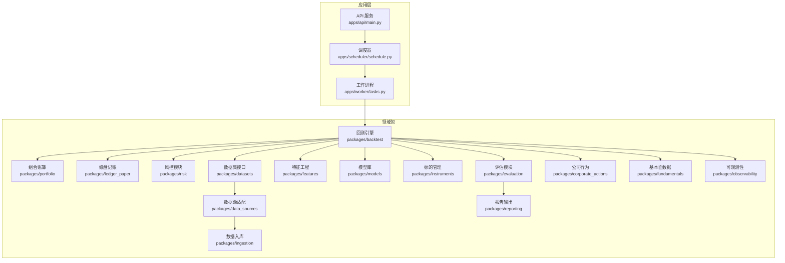
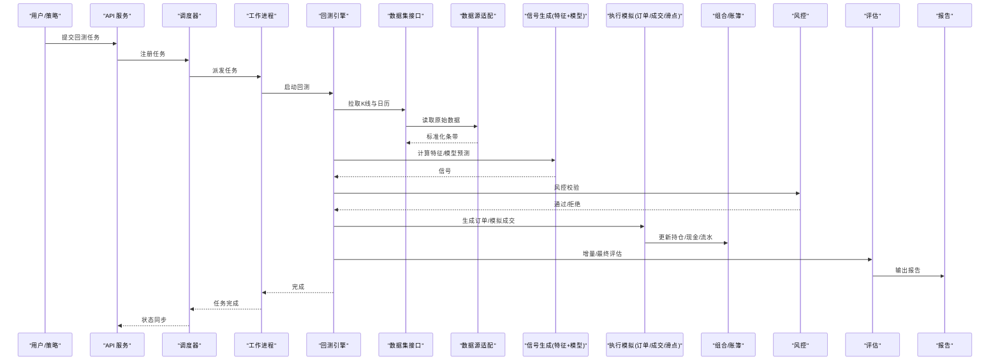
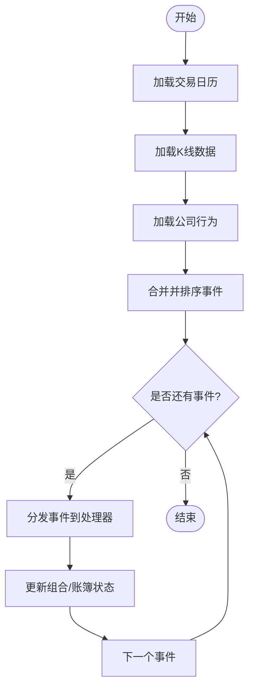
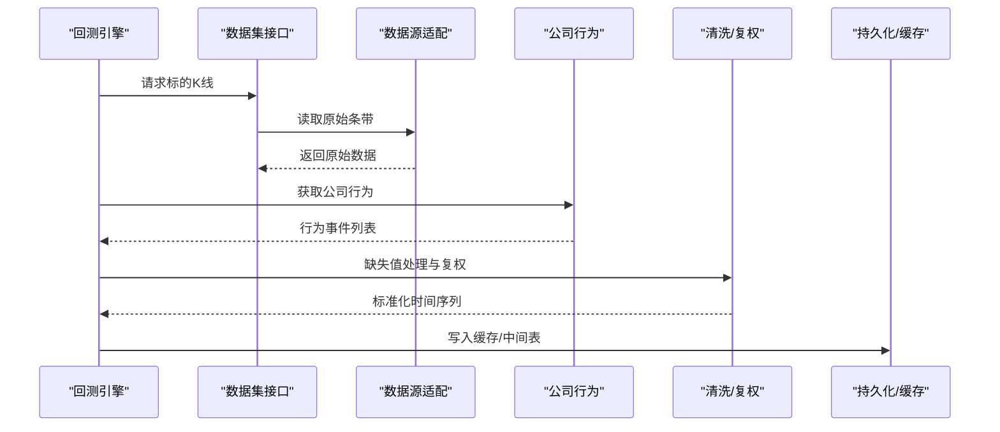
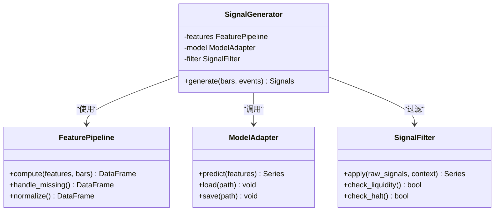
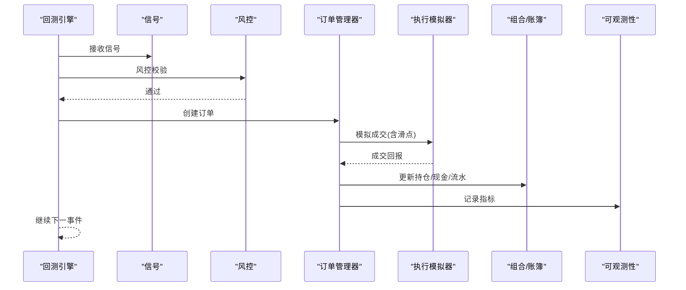
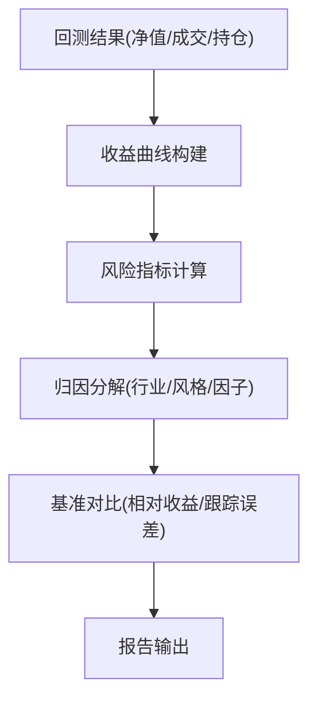
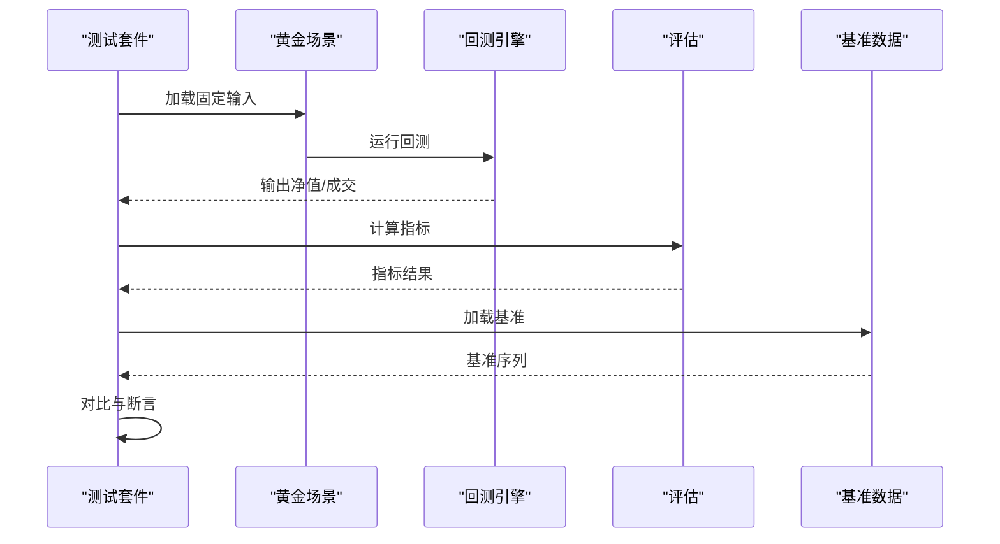
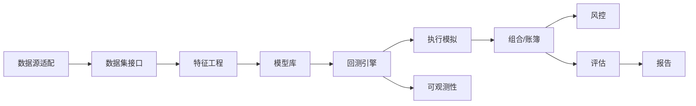

# 回测框架设计

<cite>
**本文引用的文件**   
- [packages/backtest/__init__.py](file://packages/backtest/__init__.py)
- [packages/ledger_paper/__init__.py](file://packages/ledger_paper/__init__.py)
- [packages/portfolio/__init__.py](file://packages/portfolio/__init__.py)
- [packages/risk/__init__.py](file://packages/risk/__init__.py)
- [packages/evaluation/__init__.py](file://packages/evaluation/__init__.py)
- [packages/features/__init__.py](file://packages/features/__init__.py)
- [packages/models/__init__.py](file://packages/models/__init__.py)
- [packages/instruments/__init__.py](file://packages/instruments/__init__.py)
- [packages/datasets/__init__.py](file://packages/datasets/__init__.py)
- [packages/data_sources/__init__.py](file://packages/data_sources/__init__.py)
- [packages/corporate_actions/__init__.py](file://packages/corporate_actions/__init__.py)
- [packages/fundamentals/__init__.py](file://packages/fundamentals/__init__.py)
- [packages/ingestion/__init__.py](file://packages/ingestion/__init__.py)
- [packages/reporting/__init__.py](file://packages/reporting/__init__.py)
- [packages/observability/__init__.py](file://packages/observability/__init__.py)
- [apps/api/main.py](file://apps/api/main.py)
- [apps/api/deps.py](file://apps/api/deps.py)
- [apps/scheduler/schedule.py](file://apps/scheduler/schedule.py)
- [apps/worker/tasks.py](file://apps/worker/tasks.py)
- [tests/unit/test_execution_models.py](file://tests/unit/test_execution_models.py)
- [tests/unit/test_golden_scenarios.py](file://tests/unit/test_golden_scenarios.py)
- [tests/unit/test_phase2_to_5.py](file://tests/unit/test_phase2_to_5.py)
- [tests/unit/test_sql_bar_repo.py](file://tests/unit/test_sql_bar_repo.py)
- [sql/migrations/20260715_0003_market_bar.py](file://sql/migrations/20260715_0003_market_bar.py)
- [sql/migrations/20260715_0004_corporate_action.py](file://sql/migrations/20260715_0004_corporate_action.py)
</cite>

## 目录
1. [引言](#引言)
2. [项目结构](#项目结构)
3. [核心组件](#核心组件)
4. [架构总览](#架构总览)
5. [详细组件分析](#详细组件分析)
6. [依赖关系分析](#依赖关系分析)
7. [性能考虑](#性能考虑)
8. [故障排查指南](#故障排查指南)
9. [结论](#结论)
10. [附录](#附录)

## 引言
本文件面向量化研究与工程团队，系统化阐述回测框架的设计与实现要点。围绕事件驱动的回测引擎、时间序列处理与状态管理、数据准备（历史数据加载、缺失值处理、复权计算）、信号生成（技术指标、机器学习模型集成、信号过滤）、交易执行模拟（订单管理、成交回报、滑点建模）、绩效评估（收益率统计、风险指标、归因分析）以及结果验证与基准对比等主题展开，提供从架构到落地的完整说明。

## 项目结构
仓库采用多包分层组织：
- 应用层：API、调度器、工作进程
- 领域包：回测、组合、风控、评估、特征、模型、工具链（数据源、数据集、公司行为、基本面、入库、报告、可观测性）
- 测试：单元与集成用例覆盖关键路径
- 数据库迁移：市场K线、公司行为等核心表结构演进

图表来源
- [apps/api/main.py](file://apps/api/main.py)
- [apps/scheduler/schedule.py](file://apps/scheduler/schedule.py)
- [apps/worker/tasks.py](file://apps/worker/tasks.py)
- [packages/backtest/__init__.py](file://packages/backtest/__init__.py)
- [packages/portfolio/__init__.py](file://packages/portfolio/__init__.py)
- [packages/ledger_paper/__init__.py](file://packages/ledger_paper/__init__.py)
- [packages/risk/__init__.py](file://packages/risk/__init__.py)
- [packages/evaluation/__init__.py](file://packages/evaluation/__init__.py)
- [packages/features/__init__.py](file://packages/features/__init__.py)
- [packages/models/__init__.py](file://packages/models/__init__.py)
- [packages/instruments/__init__.py](file://packages/instruments/__init__.py)
- [packages/datasets/__init__.py](file://packages/datasets/__init__.py)
- [packages/data_sources/__init__.py](file://packages/data_sources/__init__.py)
- [packages/corporate_actions/__init__.py](file://packages/corporate_actions/__init__.py)
- [packages/fundamentals/__init__.py](file://packages/fundamentals/__init__.py)
- [packages/ingestion/__init__.py](file://packages/ingestion/__init__.py)
- [packages/reporting/__init__.py](file://packages/reporting/__init__.py)
- [packages/observability/__init__.py](file://packages/observability/__init__.py)

章节来源
- [apps/api/main.py](file://apps/api/main.py)
- [apps/scheduler/schedule.py](file://apps/scheduler/schedule.py)
- [apps/worker/tasks.py](file://apps/worker/tasks.py)

## 核心组件
- 回测引擎：以事件为驱动，按时间推进消费市场数据与公司行为事件，驱动信号与执行流水线。
- 组合与账簿：维护持仓、现金、费用、成交记录，支持纸盘记账与审计追踪。
- 风控模块：在下单前与盘中进行风险检查（头寸、敞口、止损、集中度等）。
- 评估模块：计算收益曲线、风险指标、归因分解，并输出报告。
- 特征与模型：计算技术指标、因子与标签；集成机器学习模型进行预测与信号生成。
- 数据层：统一的数据集接口与数据源适配，支撑K线、基本面、公司行为等数据的读取与清洗。
- 基础设施：调度与工作进程负责任务编排与异步执行；可观测性提供指标与日志。

章节来源
- [packages/backtest/__init__.py](file://packages/backtest/__init__.py)
- [packages/portfolio/__init__.py](file://packages/portfolio/__init__.py)
- [packages/ledger_paper/__init__.py](file://packages/ledger_paper/__init__.py)
- [packages/risk/__init__.py](file://packages/risk/__init__.py)
- [packages/evaluation/__init__.py](file://packages/evaluation/__init__.py)
- [packages/features/__init__.py](file://packages/features/__init__.py)
- [packages/models/__init__.py](file://packages/models/__init__.py)
- [packages/datasets/__init__.py](file://packages/datasets/__init__.py)
- [packages/data_sources/__init__.py](file://packages/data_sources/__init__.py)
- [packages/corporate_actions/__init__.py](file://packages/corporate_actions/__init__.py)
- [packages/fundamentals/__init__.py](file://packages/fundamentals/__init__.py)
- [packages/ingestion/__init__.py](file://packages/ingestion/__init__.py)
- [packages/reporting/__init__.py](file://packages/reporting/__init__.py)
- [packages/observability/__init__.py](file://packages/observability/__init__.py)

## 架构总览
回测系统遵循“事件驱动 + 时间步进”的混合模式：外部事件（如公司行为）与内部事件（如开盘、收盘、成交回报）共同驱动引擎推进。数据通过数据集接口抽象，底层由数据源适配器提供；信号与执行在风控约束下完成；评估与报告在回测结束后或增量阶段产出。

图表来源
- [apps/api/main.py](file://apps/api/main.py)
- [apps/scheduler/schedule.py](file://apps/scheduler/schedule.py)
- [apps/worker/tasks.py](file://apps/worker/tasks.py)
- [packages/backtest/__init__.py](file://packages/backtest/__init__.py)
- [packages/datasets/__init__.py](file://packages/datasets/__init__.py)
- [packages/data_sources/__init__.py](file://packages/data_sources/__init__.py)
- [packages/features/__init__.py](file://packages/features/__init__.py)
- [packages/models/__init__.py](file://packages/models/__init__.py)
- [packages/risk/__init__.py](file://packages/risk/__init__.py)
- [packages/portfolio/__init__.py](file://packages/portfolio/__init__.py)
- [packages/ledger_paper/__init__.py](file://packages/ledger_paper/__init__.py)
- [packages/evaluation/__init__.py](file://packages/evaluation/__init__.py)
- [packages/reporting/__init__.py](file://packages/reporting/__init__.py)

## 详细组件分析

### 事件驱动与时间序列处理
- 事件类型：市场开收市、逐笔/分钟K线、公司行为（分红拆合股等）、成交回报、风控触发等。
- 时间推进：基于交易日历与时间戳排序的事件队列，保证严格时序一致性。
- 状态管理：组合净值、持仓、可用资金、未成交订单、已成交流水、滑点累计等状态对象在事件回调中更新。
- 并发与幂等：事件处理函数需具备幂等性，避免重复回放导致状态漂移。

章节来源
- [packages/backtest/__init__.py](file://packages/backtest/__init__.py)
- [packages/ledger_paper/__init__.py](file://packages/ledger_paper/__init__.py)
- [packages/portfolio/__init__.py](file://packages/portfolio/__init__.py)
- [sql/migrations/20260715_0003_market_bar.py](file://sql/migrations/20260715_0003_market_bar.py)
- [sql/migrations/20260715_0004_corporate_action.py](file://sql/migrations/20260715_0004_corporate_action.py)

### 数据准备流程
- 历史数据加载：通过数据集接口统一访问K线、基本面、公司行为等数据；底层由数据源适配器对接不同存储。
- 缺失值处理：对价格与成交量进行前向填充、插值或剔除异常条带；确保技术指标窗口稳定。
- 复权计算：依据公司行为事件（分红、拆合股）对历史价格序列进行复权，保证信号与回测一致。
- 数据质量：结合入库与审计机制，保障数据来源可追溯与版本化。

图表来源
- [packages/datasets/__init__.py](file://packages/datasets/__init__.py)
- [packages/data_sources/__init__.py](file://packages/data_sources/__init__.py)
- [packages/corporate_actions/__init__.py](file://packages/corporate_actions/__init__.py)
- [packages/ingestion/__init__.py](file://packages/ingestion/__init__.py)
- [sql/migrations/20260715_0003_market_bar.py](file://sql/migrations/20260715_0003_market_bar.py)
- [sql/migrations/20260715_0004_corporate_action.py](file://sql/migrations/20260715_0004_corporate_action.py)

章节来源
- [packages/datasets/__init__.py](file://packages/datasets/__init__.py)
- [packages/data_sources/__init__.py](file://packages/data_sources/__init__.py)
- [packages/corporate_actions/__init__.py](file://packages/corporate_actions/__init__.py)
- [packages/ingestion/__init__.py](file://packages/ingestion/__init__.py)

### 信号生成模块
- 技术指标计算：基于标准化后的时间序列计算动量、波动率、均值回归等因子。
- 机器学习模型集成：将特征矩阵输入模型得到预测概率或目标值，再映射为多空信号。
- 信号过滤：结合流动性阈值、涨跌停/停牌规则、行业暴露限制等进行二次过滤。
- 可解释性与回溯：保留特征快照与模型输入，便于事后分析与调试。

图表来源
- [packages/features/__init__.py](file://packages/features/__init__.py)
- [packages/models/__init__.py](file://packages/models/__init__.py)
- [packages/backtest/__init__.py](file://packages/backtest/__init__.py)

章节来源
- [packages/features/__init__.py](file://packages/features/__init__.py)
- [packages/models/__init__.py](file://packages/models/__init__.py)
- [packages/backtest/__init__.py](file://packages/backtest/__init__.py)

### 交易执行模拟
- 订单管理：支持限价/市价单、部分成交、撤单与订单生命周期跟踪。
- 成交回报处理：根据市场微观结构与延迟假设生成成交回报，更新组合与账簿。
- 滑点建模：按价差、冲击成本、时间衰减等参数模拟真实成交偏差。
- 费用与税费：佣金、印花税、过户费等计入成本，影响净收益。

图表来源
- [packages/backtest/__init__.py](file://packages/backtest/__init__.py)
- [packages/portfolio/__init__.py](file://packages/portfolio/__init__.py)
- [packages/ledger_paper/__init__.py](file://packages/ledger_paper/__init__.py)
- [packages/risk/__init__.py](file://packages/risk/__init__.py)
- [packages/observability/__init__.py](file://packages/observability/__init__.py)
- [tests/unit/test_execution_models.py](file://tests/unit/test_execution_models.py)

章节来源
- [packages/backtest/__init__.py](file://packages/backtest/__init__.py)
- [packages/portfolio/__init__.py](file://packages/portfolio/__init__.py)
- [packages/ledger_paper/__init__.py](file://packages/ledger_paper/__init__.py)
- [packages/risk/__init__.py](file://packages/risk/__init__.py)
- [packages/observability/__init__.py](file://packages/observability/__init__.py)
- [tests/unit/test_execution_models.py](file://tests/unit/test_execution_models.py)

### 绩效评估与归因分析
- 收益统计：日度/周度/月度收益率、年化收益、最大回撤、夏普比率、索提诺比率、Calmar比率等。
- 风险指标：波动率、下行风险、VaR/CVaR、Beta、信息比率、换手率、交易成本占比。
- 归因分析：按资产类别、行业、风格或因子维度分解收益贡献，识别超额来源。
- 基准对比：与宽基指数或自定义基准比较相对收益与跟踪误差。

章节来源
- [packages/evaluation/__init__.py](file://packages/evaluation/__init__.py)
- [packages/reporting/__init__.py](file://packages/reporting/__init__.py)

### 结果验证与基准对比
- 黄金场景：使用固定输入与期望输出进行端到端验证，确保数据、信号、执行与评估链路稳定。
- 单元测试：针对执行模型、SQL仓储、时间工具、调度器等关键路径进行断言。
- 基准对比：选择代表性指数作为基准，计算相对收益、信息比率与最大回撤差值，评估策略稳健性。

图表来源
- [tests/unit/test_golden_scenarios.py](file://tests/unit/test_golden_scenarios.py)
- [tests/unit/test_phase2_to_5.py](file://tests/unit/test_phase2_to_5.py)
- [tests/unit/test_sql_bar_repo.py](file://tests/unit/test_sql_bar_repo.py)
- [packages/evaluation/__init__.py](file://packages/evaluation/__init__.py)

章节来源
- [tests/unit/test_golden_scenarios.py](file://tests/unit/test_golden_scenarios.py)
- [tests/unit/test_phase2_to_5.py](file://tests/unit/test_phase2_to_5.py)
- [tests/unit/test_sql_bar_repo.py](file://tests/unit/test_sql_bar_repo.py)

## 依赖关系分析
- 低耦合高内聚：各包通过明确接口交互，减少直接依赖。
- 数据流向：数据源→数据集→特征/模型→信号→执行→组合/账簿→评估→报告。
- 外部依赖：数据库迁移定义市场K线与公司的行为表结构，支撑数据持久化与可追溯。

图表来源
- [packages/data_sources/__init__.py](file://packages/data_sources/__init__.py)
- [packages/datasets/__init__.py](file://packages/datasets/__init__.py)
- [packages/features/__init__.py](file://packages/features/__init__.py)
- [packages/models/__init__.py](file://packages/models/__init__.py)
- [packages/backtest/__init__.py](file://packages/backtest/__init__.py)
- [packages/portfolio/__init__.py](file://packages/portfolio/__init__.py)
- [packages/risk/__init__.py](file://packages/risk/__init__.py)
- [packages/evaluation/__init__.py](file://packages/evaluation/__init__.py)
- [packages/reporting/__init__.py](file://packages/reporting/__init__.py)
- [packages/observability/__init__.py](file://packages/observability/__init__.py)

章节来源
- [packages/data_sources/__init__.py](file://packages/data_sources/__init__.py)
- [packages/datasets/__init__.py](file://packages/datasets/__init__.py)
- [packages/features/__init__.py](file://packages/features/__init__.py)
- [packages/models/__init__.py](file://packages/models/__init__.py)
- [packages/backtest/__init__.py](file://packages/backtest/__init__.py)
- [packages/portfolio/__init__.py](file://packages/portfolio/__init__.py)
- [packages/risk/__init__.py](file://packages/risk/__init__.py)
- [packages/evaluation/__init__.py](file://packages/evaluation/__init__.py)
- [packages/reporting/__init__.py](file://packages/reporting/__init__.py)
- [packages/observability/__init__.py](file://packages/observability/__init__.py)

## 性能考虑
- 批处理与流式处理结合：大批量历史数据采用批处理，盘中或长周期回测采用流式事件推进。
- 内存优化：惰性加载与分块读取，避免一次性载入全量序列；使用数值型数组与稀疏表示降低内存占用。
- I/O优化：读写缓存与列式存储提升吞吐；索引交易日与标的ID加速查询。
- 并行化：特征计算与模型推理可并行，但需注意事件顺序与共享状态锁。
- 监控与采样：对关键路径埋点，采样高频指标，避免过度日志造成瓶颈。

[本节为通用指导，不直接分析具体文件]

## 故障排查指南
- 数据问题：核对K线与日历对齐、缺失值填充策略、复权前后序列一致性；检查公司行为事件的时间戳与生效日。
- 信号异常：确认特征窗口长度、NaN传播、模型输入维度与训练分布差异。
- 执行偏差：核查滑点参数、手续费设置、涨跌停/停牌规则与订单生命周期。
- 评估不一致：确认基准数据版本、频率对齐与统计口径（简单/几何平均、年化换算）。
- 可观测性：查看指标与日志定位慢路径与错误堆栈。

章节来源
- [packages/observability/__init__.py](file://packages/observability/__init__.py)
- [packages/corporate_actions/__init__.py](file://packages/corporate_actions/__init__.py)
- [packages/features/__init__.py](file://packages/features/__init__.py)
- [packages/models/__init__.py](file://packages/models/__init__.py)
- [packages/evaluation/__init__.py](file://packages/evaluation/__init__.py)

## 结论
本回测框架以事件驱动为核心，结合严谨的数据准备、信号生成、执行模拟与评估体系，形成闭环的量化研究平台。通过模块化设计与可观测性支撑，既满足离线研究的深度，也兼顾生产环境的稳定性与可维护性。建议持续完善基准库与黄金场景，强化数据治理与版本控制，以提升策略迭代效率与结果可信度。

[本节为总结性内容，不直接分析具体文件]

## 附录
- 术语表
  - 复权：根据分红拆合股调整历史价格，保持连续性
  - 滑点：实际成交价与预期价的偏差
  - 归因：将收益分解至不同维度以识别来源
- 参考迁移文件
  - 市场K线表结构定义
  - 公司行为表结构定义

章节来源
- [sql/migrations/20260715_0003_market_bar.py](file://sql/migrations/20260715_0003_market_bar.py)
- [sql/migrations/20260715_0004_corporate_action.py](file://sql/migrations/20260715_0004_corporate_action.py)