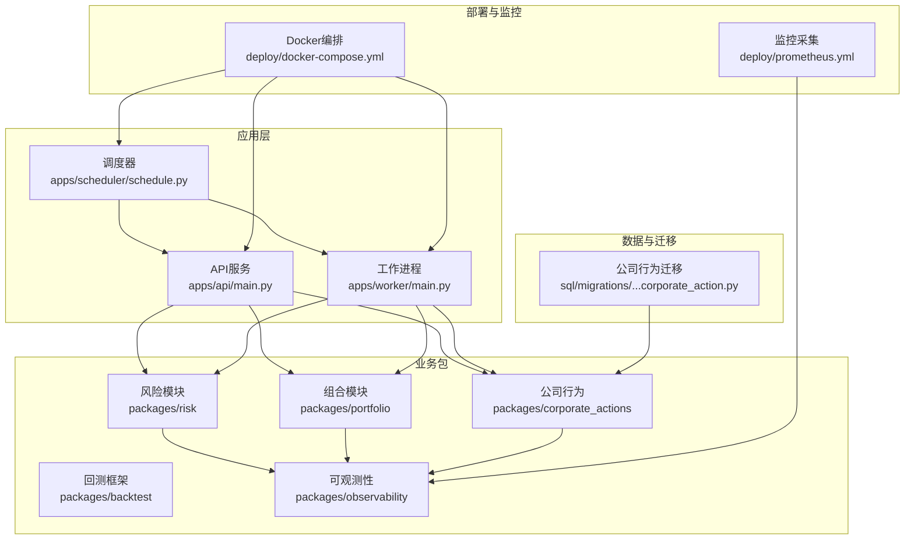
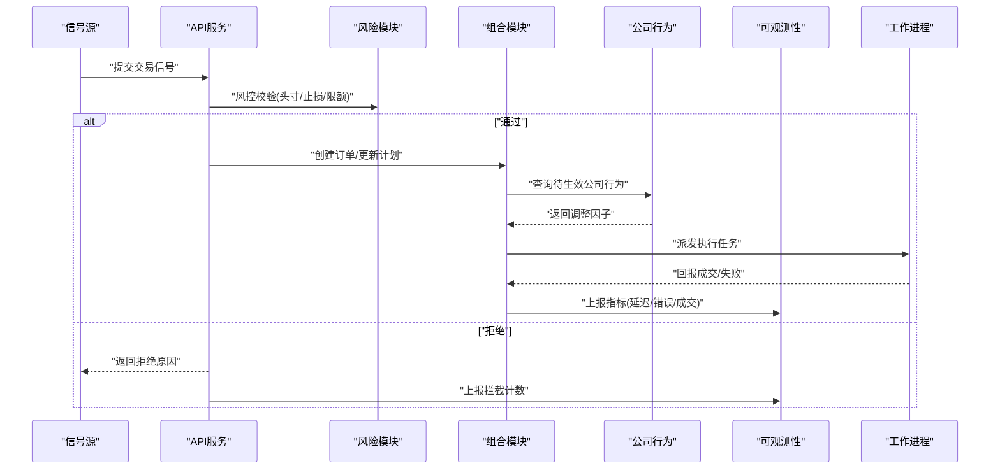
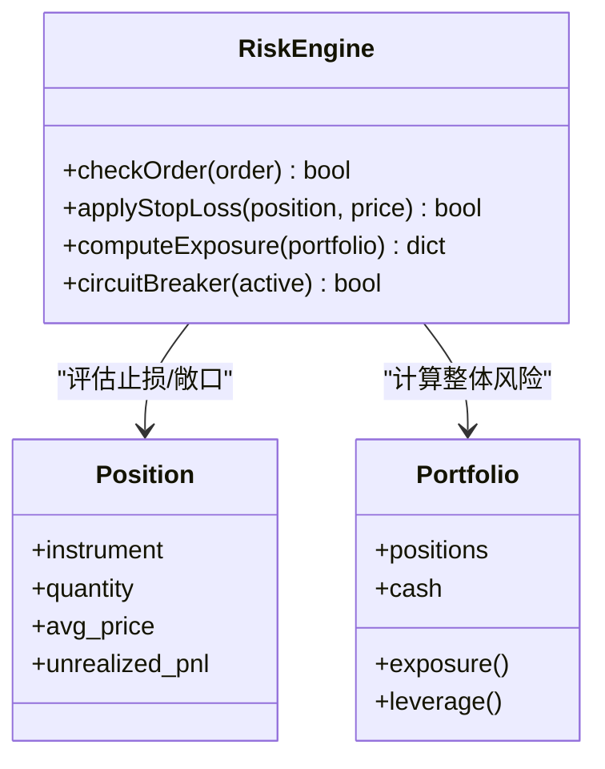
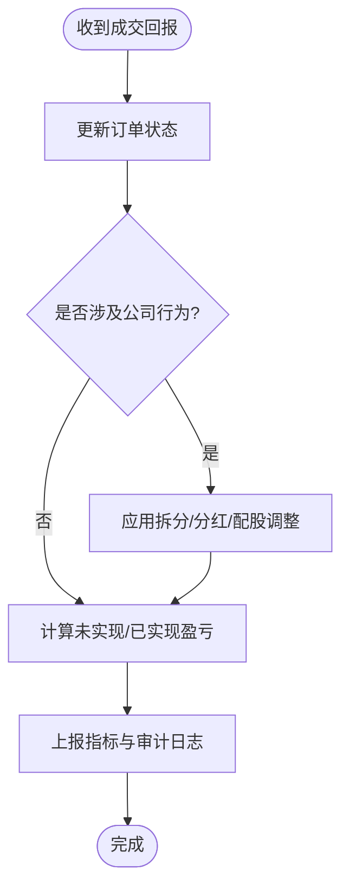
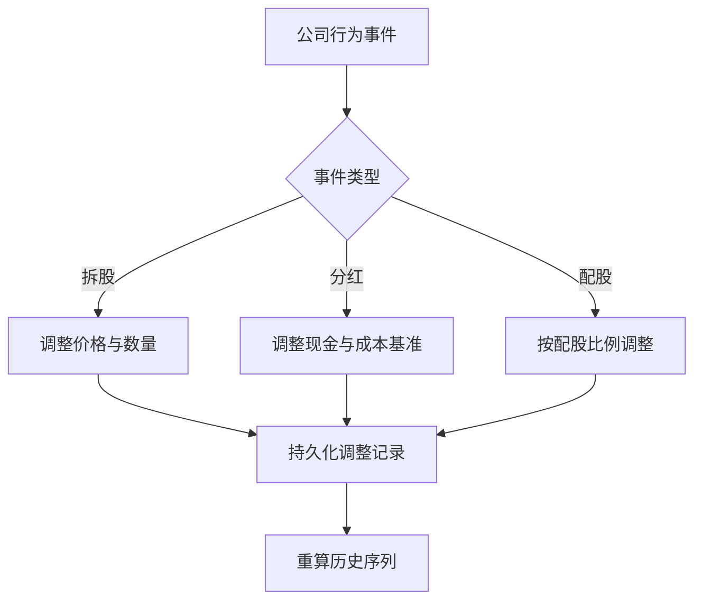
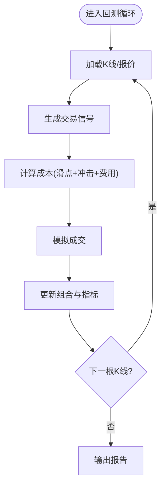
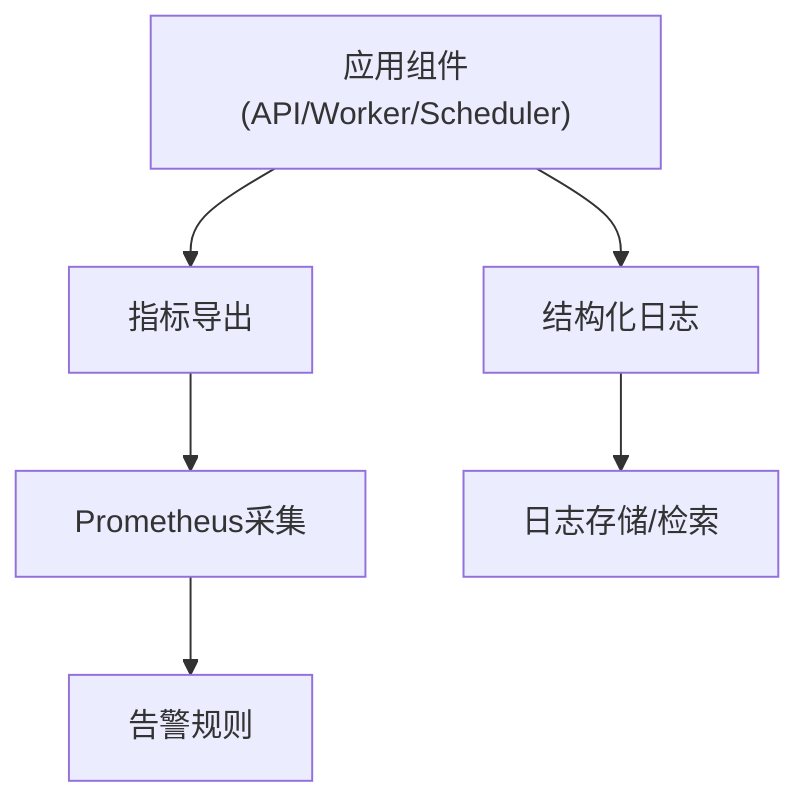
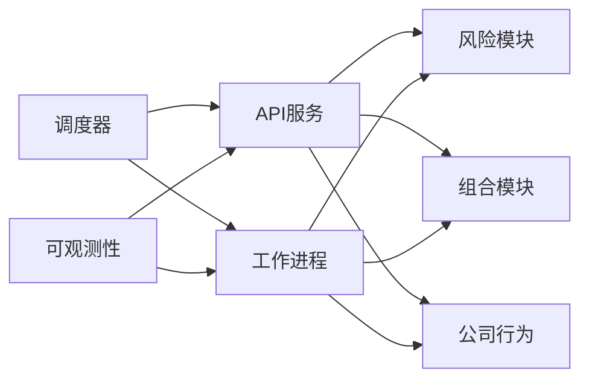
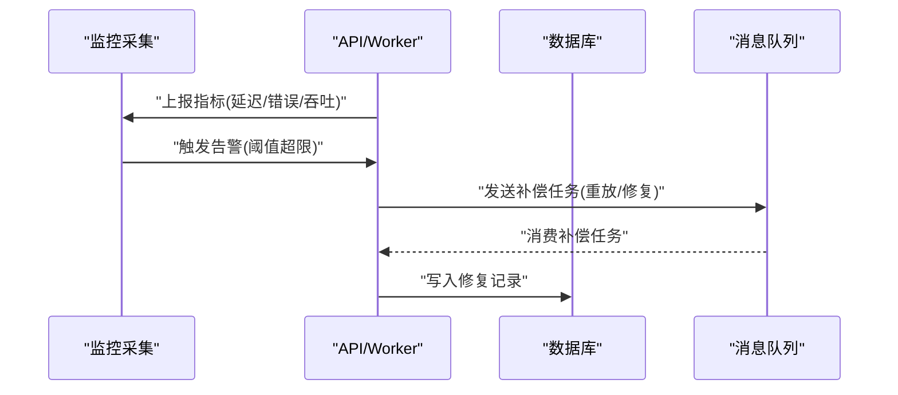
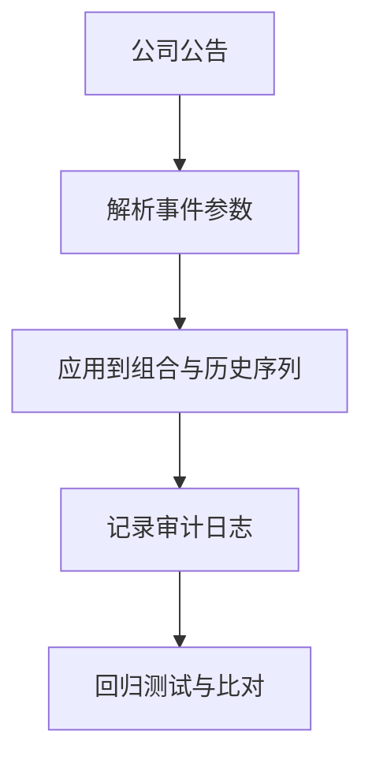

# 实盘交易注意事项

<cite>
**本文引用的文件**   
- [apps/api/main.py](file://apps/api/main.py)
- [apps/worker/main.py](file://apps/worker/main.py)
- [apps/scheduler/schedule.py](file://apps/scheduler/schedule.py)
- [packages/risk](file://packages/risk)
- [packages/corporate_actions](file://packages/corporate_actions)
- [packages/backtest](file://packages/backtest)
- [packages/portfolio](file://packages/portfolio)
- [packages/observability](file://packages/observability)
- [deploy/docker-compose.yml](file://deploy/docker-compose.yml)
- [deploy/prometheus.yml](file://deploy/prometheus.yml)
- [sql/migrations/20260715_0004_corporate_action.py](file://sql/migrations/20260715_0004_corporate_action.py)
- [tests/fixtures/golden/cn/split_and_dividend.jsonl](file://tests/fixtures/golden/cn/split_and_dividend.jsonl)
</cite>

## 目录
1. [简介](#简介)
2. [项目结构](#项目结构)
3. [核心组件](#核心组件)
4. [架构总览](#架构总览)
5. [详细组件分析](#详细组件分析)
6. [依赖关系分析](#依赖关系分析)
7. [性能与成本建模](#性能与成本建模)
8. [流动性与规模约束](#流动性与规模约束)
9. [风险控制机制](#风险控制机制)
10. [系统监控与故障恢复](#系统监控与故障恢复)
11. [公司行为处理](#公司行为处理)
12. [回测与实盘差异分析与对比方法](#回测与实盘差异分析与对比方法)
13. [结论](#结论)
14. [附录](#附录)

## 简介
本指南面向将量化策略从回测推进到实盘交易的工程师与研究员，聚焦以下关键主题：滑点与成本建模（买卖价差估计、市场冲击成本、交易费用）、流动性约束与分批建仓、风险控制（止损、仓位管理、极端行情应对）、系统监控（延迟、错误、恢复）、公司行为（分红、拆股、配股）的自动调整，以及回测与实盘的差异分析与性能对比方法。文档结合仓库中的可观测性、风险、组合、公司行为、调度与部署等模块进行说明，并提供可视化图示帮助理解。

## 项目结构
仓库采用多应用与多包的分层组织方式：
- 应用层：API服务、工作进程、调度器
- 业务包：风险、组合、公司行为、回测、可观测性等
- 部署与监控：Docker Compose、Prometheus配置
- 数据迁移：公司行为等数据库表结构演进
- 测试用例：覆盖公司行为场景、执行模型、可观测指标等

**图表来源**
- [apps/api/main.py](file://apps/api/main.py)
- [apps/worker/main.py](file://apps/worker/main.py)
- [apps/scheduler/schedule.py](file://apps/scheduler/schedule.py)
- [packages/risk](file://packages/risk)
- [packages/portfolio](file://packages/portfolio)
- [packages/corporate_actions](file://packages/corporate_actions)
- [packages/backtest](file://packages/backtest)
- [packages/observability](file://packages/observability)
- [deploy/docker-compose.yml](file://deploy/docker-compose.yml)
- [deploy/prometheus.yml](file://deploy/prometheus.yml)
- [sql/migrations/20260715_0004_corporate_action.py](file://sql/migrations/20260715_0004_corporate_action.py)

**章节来源**
- [apps/api/main.py](file://apps/api/main.py)
- [apps/worker/main.py](file://apps/worker/main.py)
- [apps/scheduler/schedule.py](file://apps/scheduler/schedule.py)
- [packages/risk](file://packages/risk)
- [packages/portfolio](file://packages/portfolio)
- [packages/corporate_actions](file://packages/corporate_actions)
- [packages/backtest](file://packages/backtest)
- [packages/observability](file://packages/observability)
- [deploy/docker-compose.yml](file://deploy/docker-compose.yml)
- [deploy/prometheus.yml](file://deploy/prometheus.yml)
- [sql/migrations/20260715_0004_corporate_action.py](file://sql/migrations/20260715_0004_corporate_action.py)

## 核心组件
- 风险模块：提供风控规则、头寸限制、止损与压力测试能力，为下单前拦截与盘中动态控制提供支撑。
- 组合模块：维护账户持仓、净值、盈亏与交易流水，负责订单状态跟踪与成交回报处理。
- 公司行为：解析并应用分红、拆股、配股等事件，对历史价格与持仓数量进行一致性调整。
- 回测框架：在历史数据上模拟交易，支持滑点、手续费与冲击成本的参数化建模，便于与实盘对比。
- 可观测性：暴露延迟、错误率、资源使用等指标，配合Prometheus进行采集与告警。
- 调度与工作进程：定时触发信号生成、风控检查、下单与结算任务，保障流水线稳定运行。

**章节来源**
- [packages/risk](file://packages/risk)
- [packages/portfolio](file://packages/portfolio)
- [packages/corporate_actions](file://packages/corporate_actions)
- [packages/backtest](file://packages/backtest)
- [packages/observability](file://packages/observability)
- [apps/scheduler/schedule.py](file://apps/scheduler/schedule.py)
- [apps/worker/main.py](file://apps/worker/main.py)

## 架构总览
下图展示从信号到执行的端到端流程，包括风控拦截、组合更新、公司行为调整与监控上报。

**图表来源**
- [apps/api/main.py](file://apps/api/main.py)
- [packages/risk](file://packages/risk)
- [packages/portfolio](file://packages/portfolio)
- [packages/corporate_actions](file://packages/corporate_actions)
- [packages/observability](file://packages/observability)
- [apps/worker/main.py](file://apps/worker/main.py)

## 详细组件分析

### 风险模块（Risk）
- 职责：下单前风控拦截、盘中动态风控、极端行情熔断、头寸与集中度限制、止损与止盈。
- 关键能力：
  - 头寸上限与单标的敞口限制
  - 止损阈值与移动止损
  - 波动率与回撤熔断
  - 黑名单与禁买清单
- 与组合联动：在组合层面汇总净敞口、杠杆与流动性占用，避免过度集中。

**图表来源**
- [packages/risk](file://packages/risk)
- [packages/portfolio](file://packages/portfolio)

**章节来源**
- [packages/risk](file://packages/risk)
- [packages/portfolio](file://packages/portfolio)

### 组合模块（Portfolio）
- 职责：记录持仓、现金、交易流水、订单生命周期；与公司行为联动调整持仓与成本基准。
- 关键能力：
  - 订单状态机（新建、已报、部分成交、完全成交、撤销、失败）
  - 成交回报聚合与平均成本更新
  - 公司行为导致的数量与价格调整
- 与风控联动：实时暴露当前头寸与可用资金，供风控决策。

**图表来源**
- [packages/portfolio](file://packages/portfolio)
- [packages/corporate_actions](file://packages/corporate_actions)

**章节来源**
- [packages/portfolio](file://packages/portfolio)
- [packages/corporate_actions](file://packages/corporate_actions)

### 公司行为（Corporate Actions）
- 职责：解析并应用公司行为事件，确保历史价格序列与持仓的一致性。
- 常见类型：
  - 拆股/合股：按比例调整价格与持仓数量
  - 现金分红：调整现金余额与成本基准
  - 配股/增发：按配股价与比例调整持仓与现金
- 数据来源：迁移脚本定义相关表结构，测试用例提供典型场景。

**图表来源**
- [packages/corporate_actions](file://packages/corporate_actions)
- [sql/migrations/20260715_0004_corporate_action.py](file://sql/migrations/20260715_0004_corporate_action.py)
- [tests/fixtures/golden/cn/split_and_dividend.jsonl](file://tests/fixtures/golden/cn/split_and_dividend.jsonl)

**章节来源**
- [packages/corporate_actions](file://packages/corporate_actions)
- [sql/migrations/20260715_0004_corporate_action.py](file://sql/migrations/20260715_0004_corporate_action.py)
- [tests/fixtures/golden/cn/split_and_dividend.jsonl](file://tests/fixtures/golden/cn/split_and_dividend.jsonl)

### 回测框架（Backtest）
- 职责：在历史数据上回放交易，支持滑点、手续费与冲击成本的参数化建模，输出与实盘一致的指标口径。
- 关键能力：
  - 滑点模型：固定点数或百分比
  - 冲击成本：基于成交量占比或深度模型
  - 费用模型：佣金、印花税、过户费等
- 与实盘对齐：统一时间戳、复权价格、成交回报格式与延迟假设。

**图表来源**
- [packages/backtest](file://packages/backtest)
- [packages/portfolio](file://packages/portfolio)

**章节来源**
- [packages/backtest](file://packages/backtest)
- [packages/portfolio](file://packages/portfolio)

### 可观测性与监控（Observability）
- 职责：暴露延迟、错误率、吞吐、资源使用等指标，配合Prometheus采集与告警。
- 关键指标：
  - 下单到成交延迟分位数
  - 风控拦截率与原因分布
  - 订单失败率与重试次数
  - 公司行为处理耗时与异常数
- 部署：Docker编排各组件，Prometheus抓取指标。

**图表来源**
- [packages/observability](file://packages/observability)
- [deploy/docker-compose.yml](file://deploy/docker-compose.yml)
- [deploy/prometheus.yml](file://deploy/prometheus.yml)

**章节来源**
- [packages/observability](file://packages/observability)
- [deploy/docker-compose.yml](file://deploy/docker-compose.yml)
- [deploy/prometheus.yml](file://deploy/prometheus.yml)

## 依赖关系分析
- 组件耦合：
  - API与服务间通过消息或RPC调用，降低直接耦合
  - 风险与组合强关联，需保证事务一致性与幂等
  - 公司行为与组合联动，需在事件驱动下批量重算
- 外部依赖：
  - 交易所/经纪商接口（不在本仓库中）
  - 数据库与消息队列（由部署编排承载）
  - 监控系统（Prometheus/Grafana）

**图表来源**
- [apps/api/main.py](file://apps/api/main.py)
- [apps/worker/main.py](file://apps/worker/main.py)
- [apps/scheduler/schedule.py](file://apps/scheduler/schedule.py)
- [packages/risk](file://packages/risk)
- [packages/portfolio](file://packages/portfolio)
- [packages/corporate_actions](file://packages/corporate_actions)
- [packages/observability](file://packages/observability)

**章节来源**
- [apps/api/main.py](file://apps/api/main.py)
- [apps/worker/main.py](file://apps/worker/main.py)
- [apps/scheduler/schedule.py](file://apps/scheduler/schedule.py)
- [packages/risk](file://packages/risk)
- [packages/portfolio](file://packages/portfolio)
- [packages/corporate_actions](file://packages/corporate_actions)
- [packages/observability](file://packages/observability)

## 性能与成本建模
- 滑点处理
  - 建议以“报价快照”为基础，结合最近成交价与买卖价差估算实际成交偏移
  - 区分不同流动性层级设置差异化滑点参数
- 买卖价差估计
  - 使用日内滚动窗口统计Bid-Ask Spread的中位数与分位数
  - 在低流动性时段提高价差缓冲
- 市场冲击成本
  - 基于成交量占比（VWAP偏离）或订单簿深度近似
  - 大额订单采用分段冲击曲线，避免线性外推高估
- 交易费用
  - 明确佣金、印花税、过户费、平台费等构成
  - 考虑最低收费与阶梯费率，按账户级别配置
- 成本建模落地
  - 在回测中启用相同成本模型，确保与实盘可比
  - 输出成本分解报告（滑点/冲击/费用），用于归因分析

[本节为通用指导，不直接分析具体文件]

## 流动性与规模约束
- 持仓规模限制
  - 单标的最大持仓不超过日均成交量的固定比例（如5%-10%）
  - 组合层面限制总敞口与杠杆倍数
- 分批建仓方法
  - 按时间切片（等间隔）或按成交量切片（达到目标份额即停）
  - 引入价格路径保护：若偏离过大则暂停或降速
- 流动性风险评估
  - 实时监控买卖价差、深度、成交速率
  - 当流动性恶化时自动降级策略或切换至限价单

[本节为通用指导，不直接分析具体文件]

## 风险控制机制
- 止损策略
  - 固定止损与移动止损结合，按标的波动率自适应
  - 组合级止损：当日/累计回撤超过阈值触发减仓
- 仓位管理
  - 基于Kelly或风险平价分配权重，限制单一因子暴露
  - 动态再平衡：偏离目标权重一定阈值后触发调仓
- 极端行情应对
  - 熔断机制：涨跌停、跳空缺口、波动率飙升时暂停新开仓
  - 降级模式：仅允许平仓与对冲，禁止新增方向性头寸

**章节来源**
- [packages/risk](file://packages/risk)
- [packages/portfolio](file://packages/portfolio)

## 系统监控与故障恢复
- 延迟监控
  - 追踪信号到下单、下单到回报、回报到记账的全链路延迟
  - 设置分位数阈值与告警，识别慢节点
- 错误处理
  - 分类记录网络超时、认证失败、订单被拒等错误
  - 重试与退避策略，避免雪崩
- 故障恢复
  - 健康检查与自愈：重启失败子进程、重新同步订单状态
  - 幂等设计：重复消息不会导致重复成交或记账
- 监控栈
  - 使用Prometheus采集指标，Grafana可视化，Alertmanager告警

**图表来源**
- [packages/observability](file://packages/observability)
- [deploy/prometheus.yml](file://deploy/prometheus.yml)
- [deploy/docker-compose.yml](file://deploy/docker-compose.yml)

**章节来源**
- [packages/observability](file://packages/observability)
- [deploy/prometheus.yml](file://deploy/prometheus.yml)
- [deploy/docker-compose.yml](file://deploy/docker-compose.yml)

## 公司行为处理
- 自动调整
  - 拆股/合股：按比例调整历史价格与持仓数量，保持价值不变
  - 现金分红：调整现金余额与成本基准，避免利润虚增
  - 配股/增发：按配股比例与价格调整持仓与现金
- 实施要点
  - 事件驱动：在公司行为公告日批量重算历史序列
  - 版本化：保留调整记录，支持回溯与审计
  - 测试覆盖：使用黄金数据集验证典型场景

**图表来源**
- [packages/corporate_actions](file://packages/corporate_actions)
- [sql/migrations/20260715_0004_corporate_action.py](file://sql/migrations/20260715_0004_corporate_action.py)
- [tests/fixtures/golden/cn/split_and_dividend.jsonl](file://tests/fixtures/golden/cn/split_and_dividend.jsonl)

**章节来源**
- [packages/corporate_actions](file://packages/corporate_actions)
- [sql/migrations/20260715_0004_corporate_action.py](file://sql/migrations/20260715_0004_corporate_action.py)
- [tests/fixtures/golden/cn/split_and_dividend.jsonl](file://tests/fixtures/golden/cn/split_and_dividend.jsonl)

## 回测与实盘差异分析与对比方法
- 差异来源
  - 滑点与冲击：回测常低估冲击成本
  - 费用结构：最低收费、阶梯费率与税费差异
  - 延迟与撮合：实盘存在排队与部分成交
  - 公司行为：复权与调整时点不一致
- 对比方法
  - 统一口径：相同的成本模型、复权方式与时间戳
  - 指标对齐：收益、回撤、换手率、成本分解
  - 敏感性分析：在不同滑点/冲击假设下比较稳健性
- 持续校准
  - 定期用实盘数据校准回测参数
  - 建立偏差阈值，超阈触发策略复盘

[本节为通用指导，不直接分析具体文件]

## 结论
实盘交易的成功依赖于严谨的成本建模、严格的流动性与风险控制、完善的监控与恢复机制，以及对公司行为的正确处理。通过将回测与实盘在统一口径下进行对比与校准，可以持续提升策略的稳健性与可移植性。建议在上线前完成充分的压力测试与回归验证，并在运行期建立闭环的监控与告警体系。

[本节为总结性内容，不直接分析具体文件]

## 附录
- 建议的监控看板指标
  - 下单延迟P50/P95/P99
  - 订单成功率与失败原因分布
  - 风控拦截率与主要拦截原因
  - 公司行为处理耗时与异常数
  - 组合杠杆与敞口变化
- 建议的回测报告字段
  - 总收益、年化收益、最大回撤、夏普比率
  - 成本分解（滑点/冲击/费用）
  - 换手率与成交质量
  - 敏感性分析结果

[本节为补充信息，不直接分析具体文件]