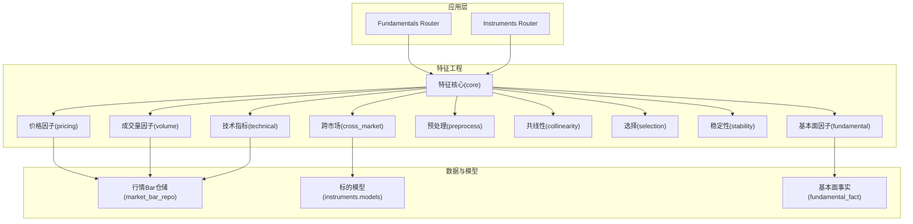
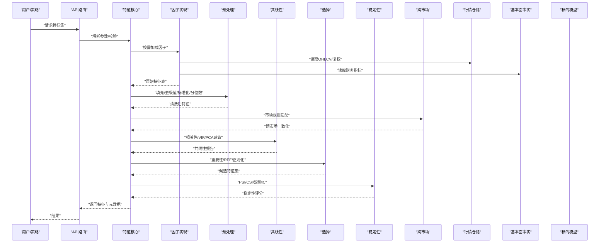
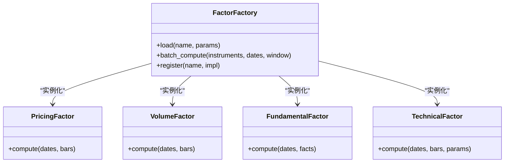
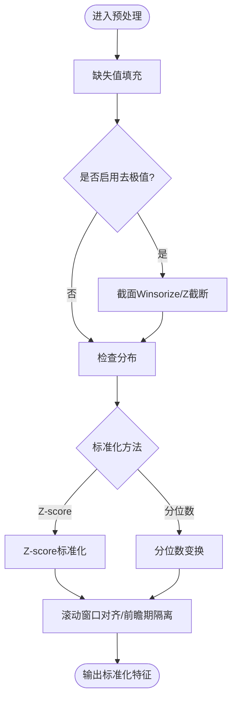
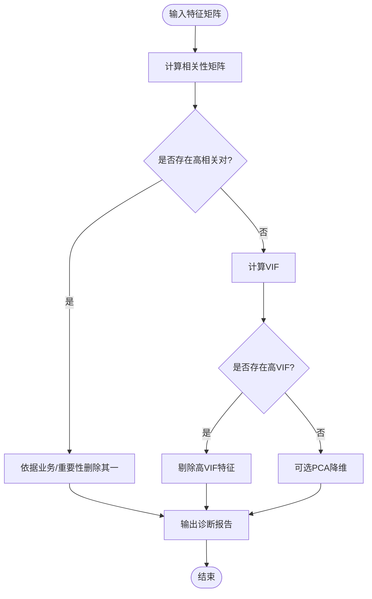
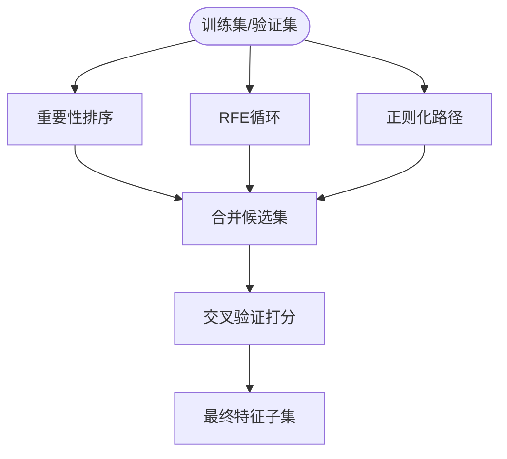
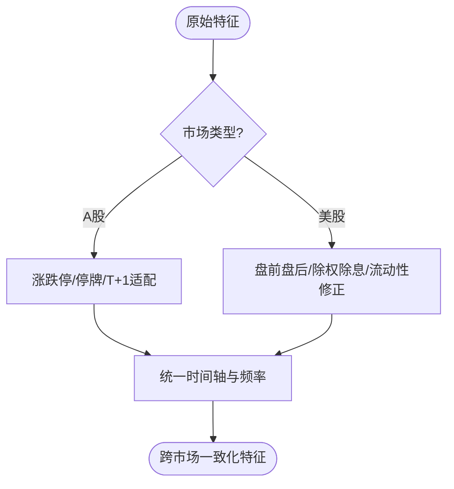
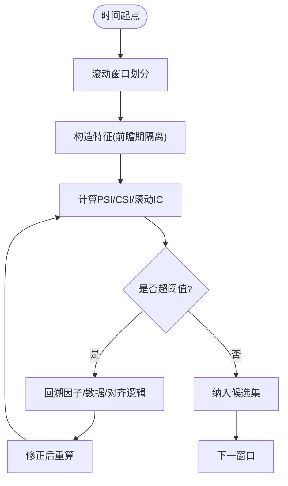
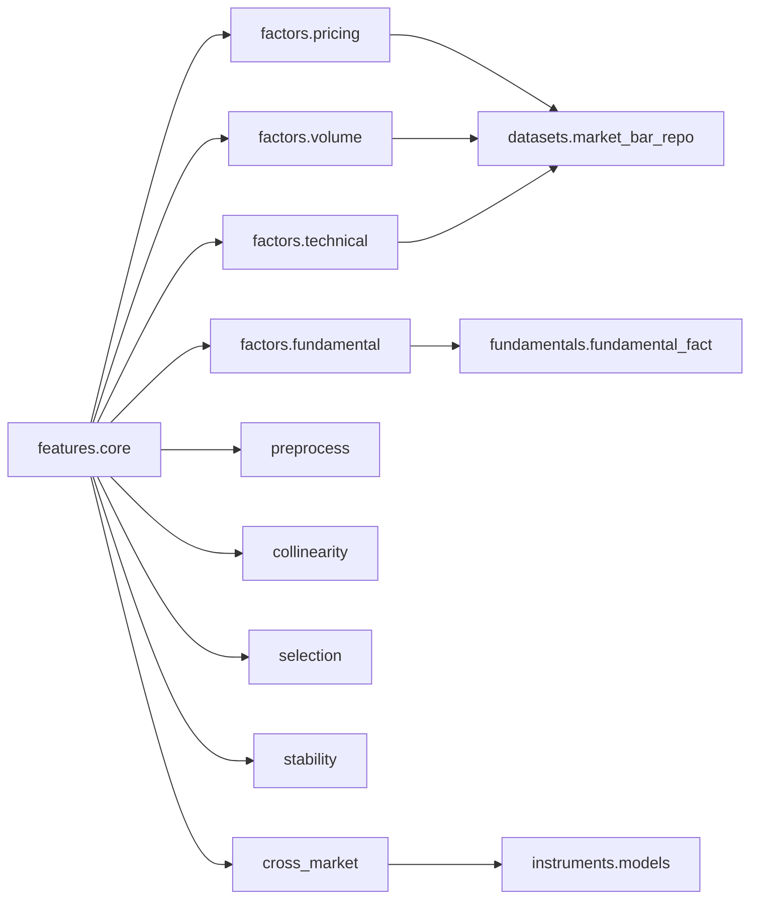

# 特征工程最佳实践

<cite>
**本文引用的文件**   
- [packages/features/README.md](file://packages/features/README.md)
- [packages/features/core.py](file://packages/features/core.py)
- [packages/features/factors/pricing.py](file://packages/features/factors/pricing.py)
- [packages/features/factors/volume.py](file://packages/features/factors/volume.py)
- [packages/features/factors/fundamental.py](file://packages/features/factors/fundamental.py)
- [packages/features/factors/technical.py](file://packages/features/factors/technical.py)
- [packages/features/preprocess.py](file://packages/features/preprocess.py)
- [packages/features/collinearity.py](file://packages/features/collinearity.py)
- [packages/features/selection.py](file://packages/features/selection.py)
- [packages/features/stability.py](file://packages/features/stability.py)
- [packages/features/cross_market.py](file://packages/features/cross_market.py)
- [packages/instruments/models.py](file://packages/instruments/models.py)
- [packages/datasets/market_bar_repo.py](file://packages/datasets/market_bar_repo.py)
- [packages/fundamentals/fundamental_fact.py](file://packages/fundamentals/fundamental_fact.py)
- [apps/api/routers/fundamentals.py](file://apps/api/routers/fundamentals.py)
- [apps/api/routers/instruments.py](file://apps/api/routers/instruments.py)
- [readme/A股美股基金量化Agent_Skill+MCP模块实施规格_V4.md](file://readme/A股美股基金量化Agent_Skill+MCP模块实施规格_V4.md)
</cite>

## 目录
1. [简介](#简介)
2. [项目结构](#项目结构)
3. [核心组件](#核心组件)
4. [架构总览](#架构总览)
5. [详细组件分析](#详细组件分析)
6. [依赖关系分析](#依赖关系分析)
7. [性能考量](#性能考量)
8. [故障排查指南](#故障排查指南)
9. [结论](#结论)
10. [附录](#附录)

## 简介
本指南面向量化研究工程师与数据工程师，系统化阐述特征工程的端到端最佳实践。内容覆盖因子设计与构建（价格、成交量、基本面、技术指标）、标准化与异常值处理、多重共线性检测、特征选择策略、跨市场适配（A股与美股）、稳定性检验与前瞻性偏差防范。文档结合仓库中 features 子包及相关模块的实现，提供可落地的流程、规范与图示。

## 项目结构
本项目采用模块化分层组织，特征工程位于 packages/features 下，按“因子实现—预处理—共线性—选择—稳定性—跨市场”进行职责划分；同时通过 instruments、datasets、fundamentals 等模块对接底层数据源，API 层暴露查询与调度能力。

图表来源
- [packages/features/core.py](file://packages/features/core.py)
- [packages/features/factors/pricing.py](file://packages/features/factors/pricing.py)
- [packages/features/factors/volume.py](file://packages/features/factors/volume.py)
- [packages/features/factors/fundamental.py](file://packages/features/factors/fundamental.py)
- [packages/features/factors/technical.py](file://packages/features/factors/technical.py)
- [packages/features/preprocess.py](file://packages/features/preprocess.py)
- [packages/features/collinearity.py](file://packages/features/collinearity.py)
- [packages/features/selection.py](file://packages/features/selection.py)
- [packages/features/stability.py](file://packages/features/stability.py)
- [packages/features/cross_market.py](file://packages/features/cross_market.py)
- [packages/datasets/market_bar_repo.py](file://packages/datasets/market_bar_repo.py)
- [packages/instruments/models.py](file://packages/instruments/models.py)
- [packages/fundamentals/fundamental_fact.py](file://packages/fundamentals/fundamental_fact.py)
- [apps/api/routers/fundamentals.py](file://apps/api/routers/fundamentals.py)
- [apps/api/routers/instruments.py](file://apps/api/routers/instruments.py)

章节来源
- [packages/features/README.md](file://packages/features/README.md)
- [packages/features/core.py](file://packages/features/core.py)

## 核心组件
- 因子工厂与注册：统一加载与调用各因子实现，屏蔽差异，支持批量计算与缓存。
- 预处理流水线：缺失值填充、去极值、标准化、分位数变换、滚动窗口对齐。
- 共线性诊断：相关性矩阵、VIF、PCA降维建议。
- 特征选择：重要性排序、递归特征消除(RFE)、正则化路径筛选。
- 稳定性评估：时间切片PSI/CSI、截面分布漂移、滚动IC/IR。
- 跨市场适配：A股涨跌停、T+1、交易日历差异；美股盘前盘后、除权除息、流动性差异。

章节来源
- [packages/features/core.py](file://packages/features/core.py)
- [packages/features/preprocess.py](file://packages/features/preprocess.py)
- [packages/features/collinearity.py](file://packages/features/collinearity.py)
- [packages/features/selection.py](file://packages/features/selection.py)
- [packages/features/stability.py](file://packages/features/stability.py)
- [packages/features/cross_market.py](file://packages/features/cross_market.py)

## 架构总览
下图展示从数据接入到特征产出的端到端流程，强调前瞻期隔离与跨市场适配。

图表来源
- [apps/api/routers/fundamentals.py](file://apps/api/routers/fundamentals.py)
- [apps/api/routers/instruments.py](file://apps/api/routers/instruments.py)
- [packages/features/core.py](file://packages/features/core.py)
- [packages/features/factors/pricing.py](file://packages/features/factors/pricing.py)
- [packages/features/factors/volume.py](file://packages/features/factors/volume.py)
- [packages/features/factors/fundamental.py](file://packages/features/factors/fundamental.py)
- [packages/features/factors/technical.py](file://packages/features/factors/technical.py)
- [packages/features/preprocess.py](file://packages/features/preprocess.py)
- [packages/features/collinearity.py](file://packages/features/collinearity.py)
- [packages/features/selection.py](file://packages/features/selection.py)
- [packages/features/stability.py](file://packages/features/stability.py)
- [packages/features/cross_market.py](file://packages/features/cross_market.py)
- [packages/datasets/market_bar_repo.py](file://packages/datasets/market_bar_repo.py)
- [packages/fundamentals/fundamental_fact.py](file://packages/fundamentals/fundamental_fact.py)
- [packages/instruments/models.py](file://packages/instruments/models.py)

## 详细组件分析

### 因子设计与构建
- 价格因子
  - 设计要点：收益率序列、波动率、动量/反转、相对强弱、区间统计量。
  - 前瞻期隔离：使用严格的时间戳对齐，避免未来信息泄露。
  - 复权处理：使用前复权或后复权一致性约定，确保跨期可比。
  - 参考实现路径：[packages/features/factors/pricing.py](file://packages/features/factors/pricing.py)

- 成交量因子
  - 设计要点：量价配合、换手率、量比、异常放量识别、订单流代理变量。
  - 市场差异：A股涨跌停限制下的成交量压缩；美股盘前盘后成交占比。
  - 参考实现路径：[packages/features/factors/volume.py](file://packages/features/factors/volume.py)

- 基本面因子
  - 设计要点：估值比率、盈利质量、成长性与现金流、会计调整与口径对齐。
  - 披露滞后：以公告日/报告期为准，严格区分样本内/外。
  - 参考实现路径：[packages/features/factors/fundamental.py](file://packages/features/fundamental.py)
  - 数据源：[packages/fundamentals/fundamental_fact.py](file://packages/fundamentals/fundamental_fact.py)

- 技术指标
  - 设计要点：趋势类、震荡类、量能类、复合信号；窗口长度与平滑参数需稳健性测试。
  - 参考实现路径：[packages/features/factors/technical.py](file://packages/features/factors/technical.py)

图表来源
- [packages/features/core.py](file://packages/features/core.py)
- [packages/features/factors/pricing.py](file://packages/features/factors/pricing.py)
- [packages/features/factors/volume.py](file://packages/features/factors/volume.py)
- [packages/features/factors/fundamental.py](file://packages/features/factors/fundamental.py)
- [packages/features/factors/technical.py](file://packages/features/factors/technical.py)

章节来源
- [packages/features/factors/pricing.py](file://packages/features/factors/pricing.py)
- [packages/features/factors/volume.py](file://packages/features/factors/volume.py)
- [packages/features/factors/fundamental.py](file://packages/features/factors/fundamental.py)
- [packages/features/factors/technical.py](file://packages/features/factors/technical.py)

### 特征标准化与异常值处理
- Z-score标准化：对稳定分布的截面或滚动窗口适用，注意极端尾部影响。
- 分位数变换：将边缘分布映射至均匀或正态，提升鲁棒性。
- 异常值处理：截面Winsorize、Z阈值截断、基于行业/市值分组处理。
- 缺失值策略：前向填充、插值、剔除低覆盖率特征。
- 参考实现路径：[packages/features/preprocess.py](file://packages/features/preprocess.py)

图表来源
- [packages/features/preprocess.py](file://packages/features/preprocess.py)

章节来源
- [packages/features/preprocess.py](file://packages/features/preprocess.py)

### 多重共线性检测
- 相关性分析：Pearson/Spearman矩阵，识别高度相关对。
- VIF：逐特征计算方差膨胀因子，设定阈值剔除。
- PCA：在保留解释方差前提下降维，用于探索主成分贡献。
- 参考实现路径：[packages/features/collinearity.py](file://packages/features/collinearity.py)

图表来源
- [packages/features/collinearity.py](file://packages/features/collinearity.py)

章节来源
- [packages/features/collinearity.py](file://packages/features/collinearity.py)

### 特征选择策略
- 重要性排序：树模型/线性系数绝对值/互信息。
- 递归特征消除(RFE)：逐步剔除弱特征，交叉验证评估。
- 正则化：Lasso/ElasticNet路径选择，稳定选择集合。
- 参考实现路径：[packages/features/selection.py](file://packages/features/selection.py)

图表来源
- [packages/features/selection.py](file://packages/features/selection.py)

章节来源
- [packages/features/selection.py](file://packages/features/selection.py)

### 跨市场特征适配（A股与美股）
- 交易制度差异：A股涨跌停、T+1、集合竞价；美股盘前盘后、熔断机制。
- 复权与分红：除权除息处理、股息再投资假设。
- 流动性与深度：买卖价差、滑点代理、停牌/退市处理。
- 参考实现路径：[packages/features/cross_market.py](file://packages/features/cross_market.py)
- 标的标识与元数据：[packages/instruments/models.py](file://packages/instruments/models.py)

图表来源
- [packages/features/cross_market.py](file://packages/features/cross_market.py)
- [packages/instruments/models.py](file://packages/instruments/models.py)

章节来源
- [packages/features/cross_market.py](file://packages/features/cross_market.py)
- [packages/instruments/models.py](file://packages/instruments/models.py)

### 特征稳定性检验与前瞻性偏差防范
- 稳定性检验：时间切片PSI/CSI、滚动IC/IR、截面分布对比。
- 前瞻期隔离：严格以t时刻可用信息构造特征，禁止未来泄漏。
- 回测一致性：训练/验证/测试集按时间切分，避免随机拆分。
- 参考实现路径：[packages/features/stability.py](file://packages/features/stability.py)

图表来源
- [packages/features/stability.py](file://packages/features/stability.py)

章节来源
- [packages/features/stability.py](file://packages/features/stability.py)

## 依赖关系分析
- 内部依赖
  - features.core 聚合并编排各因子与预处理、共线性、选择、稳定性、跨市场模块。
  - factors.* 依赖 datasets.mkt_bar_repo 与 fundamentals.fundamental_fact 获取数据。
  - cross_market 依赖 instruments.models 获取标的元数据与市场规则。
- 外部集成
  - API 路由通过依赖注入调用特征服务，对外暴露查询与批处理接口。
  - 配置与任务调度由 apps.scheduler 与 worker.tasks 驱动。

图表来源
- [packages/features/core.py](file://packages/features/core.py)
- [packages/features/factors/pricing.py](file://packages/features/factors/pricing.py)
- [packages/features/factors/volume.py](file://packages/features/factors/volume.py)
- [packages/features/factors/fundamental.py](file://packages/features/factors/fundamental.py)
- [packages/features/factors/technical.py](file://packages/features/factors/technical.py)
- [packages/features/preprocess.py](file://packages/features/preprocess.py)
- [packages/features/collinearity.py](file://packages/features/collinearity.py)
- [packages/features/selection.py](file://packages/features/selection.py)
- [packages/features/stability.py](file://packages/features/stability.py)
- [packages/features/cross_market.py](file://packages/features/cross_market.py)
- [packages/datasets/market_bar_repo.py](file://packages/datasets/market_bar_repo.py)
- [packages/fundamentals/fundamental_fact.py](file://packages/fundamentals/fundamental_fact.py)
- [packages/instruments/models.py](file://packages/instruments/models.py)

章节来源
- [packages/features/core.py](file://packages/features/core.py)
- [packages/datasets/market_bar_repo.py](file://packages/datasets/market_bar_repo.py)
- [packages/fundamentals/fundamental_fact.py](file://packages/fundamentals/fundamental_fact.py)
- [packages/instruments/models.py](file://packages/instruments/models.py)

## 性能考量
- 向量化与并行：优先使用向量化操作，因子计算按标的/日期分片并行。
- 内存管理：滚动窗口增量更新，避免全量复制；必要时使用分块IO。
- I/O优化：列式存储、分区裁剪、索引命中；批量写入特征库。
- 缓存策略：因子中间结果与标准化参数持久化，减少重复计算。
- 监控与告警：关键步骤耗时、内存峰值、失败重试与幂等。

## 故障排查指南
- 常见错误定位
  - 时间戳错位：核对基准时间与复权口径，确认前瞻期隔离。
  - 缺失值泛滥：检查数据源覆盖度与填充策略，必要时剔除低覆盖率特征。
  - 共线性过高：查看VIF与相关性矩阵，结合业务含义做取舍。
  - 跨市场不一致：确认涨跌停/停牌/除权除息处理是否按市场规则执行。
- 调试工具
  - 打印关键中间表的形状与分布，绘制滚动IC/IR曲线。
  - 使用最小可复现样本快速回归问题。
- 参考实现路径
  - 共线性诊断：[packages/features/collinearity.py](file://packages/features/collinearity.py)
  - 稳定性检验：[packages/features/stability.py](file://packages/features/stability.py)
  - 预处理管线：[packages/features/preprocess.py](file://packages/features/preprocess.py)

章节来源
- [packages/features/collinearity.py](file://packages/features/collinearity.py)
- [packages/features/stability.py](file://packages/features/stability.py)
- [packages/features/preprocess.py](file://packages/features/preprocess.py)

## 结论
本指南围绕因子设计、标准化、共线性、选择、跨市场适配与稳定性检验，形成一套可复用的特征工程方法论。建议在工程中固化参数、版本化中间产物、建立自动化回归测试与监控，确保特征在生产环境中的稳健性与可追溯性。

## 附录
- 跨市场研究与规范参考：[readme/A股美股基金量化Agent_Skill+MCP模块实施规格_V4.md](file://readme/A股美股基金量化Agent_Skill+MCP模块实施规格_V4.md)
- API 入口参考
  - 基本面数据路由：[apps/api/routers/fundamentals.py](file://apps/api/routers/fundamentals.py)
  - 标的信息路由：[apps/api/routers/instruments.py](file://apps/api/routers/instruments.py)