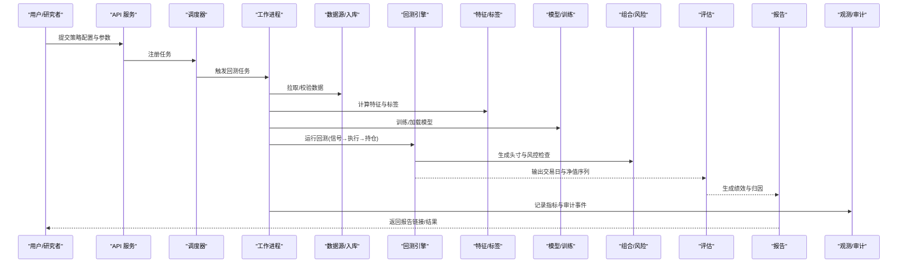
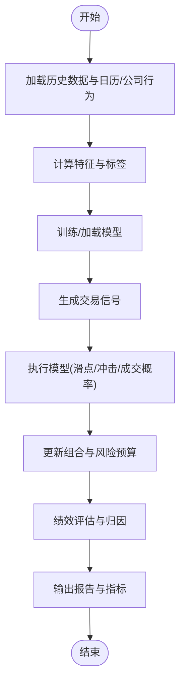
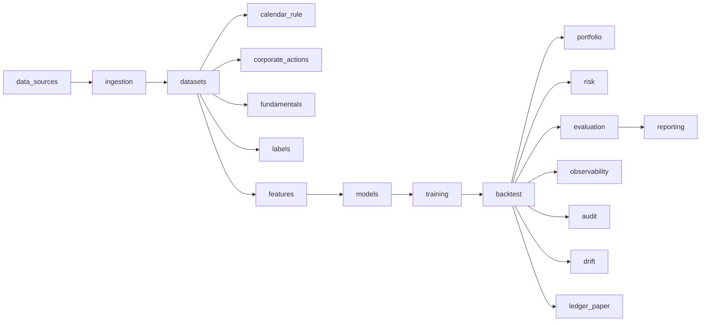

# 策略开发最佳实践

<cite>
**本文引用的文件**   
- [README.md](file://README.md)
- [pyproject.toml](file://pyproject.toml)
- [apps/api/main.py](file://apps/api/main.py)
- [apps/api/deps.py](file://apps/api/deps.py)
- [apps/worker/main.py](file://apps/worker/main.py)
- [apps/worker/tasks.py](file://apps/worker/tasks.py)
- [packages/backtest/__init__.py](file://packages/backtest/__init__.py)
- [packages/features/__init__.py](file://packages/features/__init__.py)
- [packages/portfolio/__init__.py](file://packages/portfolio/__init__.py)
- [packages/risk/__init__.py](file://packages/risk/__init__.py)
- [packages/evaluation/__init__.py](file://packages/evaluation/__init__.py)
- [packages/instrument/__init__.py](file://packages/instrument/__init__.py)
- [packages/datasets/__init__.py](file://packages/datasets/__init__.py)
- [packages/data_sources/__init__.py](file://packages/data_sources/__init__.py)
- [packages/ingestion/__init__.py](file://packages/ingestion/__init__.py)
- [packages/fundamentals/__init__.py](file://packages/fundamentals/__init__.py)
- [packages/corporate_actions/__init__.py](file://packages/corporate_actions/__init__.py)
- [packages/calendar_rule/__init__.py](file://packages/calendar_rule/__init__.py)
- [packages/training/__init__.py](file://packages/training/__init__.py)
- [packages/models/__init__.py](file://packages/models/__init__.py)
- [packages/observability/__init__.py](file://packages/observability/__init__.py)
- [packages/reporting/__init__.py](file://packages/reporting/__init__.py)
- [packages/ledger_paper/__init__.py](file://packages/ledger_paper/__init__.py)
- [packages/drift/__init__.py](file://packages/drift/__init__.py)
- [packages/audit/__init__.py](file://packages/audit/__init__.py)
- [packages/data_quality/__init__.py](file://packages/data_quality/__init__.py)
- [packages/instruments/__init__.py](file://packages/instruments/__init__.py)
- [packages/labels/__init__.py](file://packages/labels/__init__.py)
- [packages/scheduler/schedule.py](file://apps/scheduler/schedule.py)
- [skills/cross-market-quant-research/SKILL.md](file://skills/cross-market-quant-research/SKILL.md)
- [skills/cross-market-quant-research/references/report-template.md](file://skills/cross-market-quant-research/references/report-template.md)
- [skills/cross-market-quant-research/scripts/validate_report.py](file://skills/cross-market-quant-research/scripts/validate_report.py)
- [tests/unit/test_execution_models.py](file://tests/unit/test_execution_models.py)
- [tests/unit/test_calendar_rule.py](file://tests/unit/test_calendar_rule.py)
- [tests/unit/test_ingestion.py](file://tests/unit/test_ingestion.py)
- [tests/unit/test_instrument_service.py](file://tests/unit/test_instrument_service.py)
- [tests/unit/test_phase1_routers.py](file://tests/unit/test_phase1_routers.py)
- [tests/unit/test_phase2_to_5.py](file://tests/unit/test_phase2_to_5.py)
- [tests/unit/test_worker_tasks.py](file://tests/unit/test_worker_tasks.py)
</cite>

## 目录
1. [引言](#引言)
2. [项目结构](#项目结构)
3. [核心组件](#核心组件)
4. [架构总览](#架构总览)
5. [详细组件分析](#详细组件分析)
6. [依赖关系分析](#依赖关系分析)
7. [性能与稳定性考量](#性能与稳定性考量)
8. [故障排查指南](#故障排查指南)
9. [结论](#结论)
10. [附录](#附录)

## 引言
本指南面向策略研究员与量化工程师，围绕回测框架的正确使用方法、过拟合防范、特征工程、组合优化、实盘注意事项以及文档与版本管理，提供一套可落地的最佳实践。结合仓库中的模块化包结构与测试用例，我们将把“数据准备—信号生成—交易执行—绩效评估”的完整流程串联起来，并给出可视化流程图与参考路径，帮助读者快速上手并持续迭代策略。

## 项目结构
仓库采用应用层（API/Worker/Scheduler）与策略能力层（packages/*）解耦的组织方式：
- 应用层负责调度、任务编排与对外接口；
- packages 层按职责划分：数据源、数据集、日历规则、公司行为、基本面、标签、特征、模型、训练、风险、投资组合、回测、评估、观测、报告、审计等；
- tests 覆盖关键路径与端到端场景；
- skills 提供研究规范与模板校验脚本。

```mermaid
graph TB
subgraph "应用层"
API["API 服务<br/>apps/api/main.py"]
Worker["工作进程<br/>apps/worker/main.py"]
Scheduler["调度器<br/>apps/scheduler/schedule.py"]
end
subgraph "策略能力层"
DataSrc["数据源<br/>packages/data_sources"]
Datasets["数据集<br/>packages/datasets"]
CalRule["日历规则<br/>packages/calendar_rule"]
CorpAct["公司行为<br/>packages/corporate_actions"]
Fund["基本面<br/>packages/fundamentals"]
Labels["标签<br/>packages/labels"]
Features["特征<br/>packages/features"]
Models["模型<br/>packages/models"]
Training["训练<br/>packages/training"]
Risk["风险<br/>packages/risk"]
Portfolio["投资组合<br/>packages/portfolio"]
Backtest["回测<br/>packages/backtest"]
Eval["评估<br/>packages/evaluation"]
Obs["观测<br/>packages/observability"]
Report["报告<br/>packages/reporting"]
Audit["审计<br/>packages/audit"]
Drift["漂移检测<br/>packages/drift"]
Ledger["记账/模拟盘<br/>packages/ledger_paper"]
Instrument["标的/工具<br/>packages/instrument, instruments"]
end
API --> Scheduler
Worker --> Backtest
Worker --> Features
Worker --> Models
Worker --> Portfolio
Worker --> Risk
Worker --> Eval
Worker --> Report
Worker --> Obs
Worker --> Audit
Worker --> Drift
Worker --> Ledger
Backtest --> Datasets
Backtest --> CalRule
Backtest --> CorpAct
Backtest --> Fund
Backtest --> Labels
Backtest --> Features
Backtest --> Models
Backtest --> Portfolio
Backtest --> Risk
Backtest --> Eval
Backtest --> Report
Backtest --> Obs
Backtest --> Audit
Backtest --> Drift
Backtest --> Ledger
```

图表来源
- [apps/api/main.py](file://apps/api/main.py)
- [apps/worker/main.py](file://apps/worker/main.py)
- [apps/scheduler/schedule.py](file://apps/scheduler/schedule.py)
- [packages/backtest/__init__.py](file://packages/backtest/__init__.py)
- [packages/features/__init__.py](file://packages/features/__init__.py)
- [packages/portfolio/__init__.py](file://packages/portfolio/__init__.py)
- [packages/risk/__init__.py](file://packages/risk/__init__.py)
- [packages/evaluation/__init__.py](file://packages/evaluation/__init__.py)
- [packages/instrument/__init__.py](file://packages/instrument/__init__.py)
- [packages/datasets/__init__.py](file://packages/datasets/__init__.py)
- [packages/data_sources/__init__.py](file://packages/data_sources/__init__.py)
- [packages/ingestion/__init__.py](file://packages/ingestion/__init__.py)
- [packages/fundamentals/__init__.py](file://packages/fundamentals/__init__.py)
- [packages/corporate_actions/__init__.py](file://packages/corporate_actions/__init__.py)
- [packages/calendar_rule/__init__.py](file://packages/calendar_rule/__init__.py)
- [packages/training/__init__.py](file://packages/training/__init__.py)
- [packages/models/__init__.py](file://packages/models/__init__.py)
- [packages/observability/__init__.py](file://packages/observability/__init__.py)
- [packages/reporting/__init__.py](file://packages/reporting/__init__.py)
- [packages/ledger_paper/__init__.py](file://packages/ledger_paper/__init__.py)
- [packages/drift/__init__.py](file://packages/drift/__init__.py)
- [packages/audit/__init__.py](file://packages/audit/__init__.py)
- [packages/data_quality/__init__.py](file://packages/data_quality/__init__.py)
- [packages/instruments/__init__.py](file://packages/instruments/__init__.py)
- [packages/labels/__init__.py](file://packages/labels/__init__.py)

章节来源
- [README.md](file://README.md)
- [pyproject.toml](file://pyproject.toml)

## 核心组件
- 数据与事件流
  - 数据源与入库：通过 ingestion 与 data_sources 将多源市场数据标准化入库，配合 calendar_rule 与 corporate_actions 处理交易日历与公司行为。
  - 数据集与标签：datasets 提供统一的数据视图，labels 定义预测目标与时间对齐。
- 因子与模型
  - features 提供因子计算管线，models 与 training 负责模型训练与选择。
- 组合与风险
  - portfolio 负责头寸构建与再平衡，risk 提供风险度量与约束。
- 回测与评估
  - backtest 串联数据、信号、执行与持仓，evaluation 输出绩效指标与归因。
- 观测与报告
  - observability 记录运行指标，reporting 输出结构化报告，audit 记录审计事件，drift 监控数据/模型漂移。
- 模拟盘与记账
  - ledger_paper 用于模拟盘记账与对账，便于从回测到实盘的平滑过渡。

章节来源
- [packages/ingestion/__init__.py](file://packages/ingestion/__init__.py)
- [packages/data_sources/__init__.py](file://packages/data_sources/__init__.py)
- [packages/calendar_rule/__init__.py](file://packages/calendar_rule/__init__.py)
- [packages/corporate_actions/__init__.py](file://packages/corporate_actions/__init__.py)
- [packages/datasets/__init__.py](file://packages/datasets/__init__.py)
- [packages/labels/__init__.py](file://packages/labels/__init__.py)
- [packages/features/__init__.py](file://packages/features/__init__.py)
- [packages/models/__init__.py](file://packages/models/__init__.py)
- [packages/training/__init__.py](file://packages/training/__init__.py)
- [packages/portfolio/__init__.py](file://packages/portfolio/__init__.py)
- [packages/risk/__init__.py](file://packages/risk/__init__.py)
- [packages/backtest/__init__.py](file://packages/backtest/__init__.py)
- [packages/evaluation/__init__.py](file://packages/evaluation/__init__.py)
- [packages/observability/__init__.py](file://packages/observability/__init__.py)
- [packages/reporting/__init__.py](file://packages/reporting/__init__.py)
- [packages/audit/__init__.py](file://packages/audit/__init__.py)
- [packages/drift/__init__.py](file://packages/drift/__init__.py)
- [packages/ledger_paper/__init__.py](file://packages/ledger_paper/__init__.py)

## 架构总览
下图展示从数据接入到策略回测、评估与报告的端到端流程，强调各模块的职责边界与交互契约。

图表来源
- [apps/api/main.py](file://apps/api/main.py)
- [apps/scheduler/schedule.py](file://apps/scheduler/schedule.py)
- [apps/worker/main.py](file://apps/worker/main.py)
- [packages/backtest/__init__.py](file://packages/backtest/__init__.py)
- [packages/features/__init__.py](file://packages/features/__init__.py)
- [packages/labels/__init__.py](file://packages/labels/__init__.py)
- [packages/models/__init__.py](file://packages/models/__init__.py)
- [packages/training/__init__.py](file://packages/training/__init__.py)
- [packages/portfolio/__init__.py](file://packages/portfolio/__init__.py)
- [packages/risk/__init__.py](file://packages/risk/__init__.py)
- [packages/evaluation/__init__.py](file://packages/evaluation/__init__.py)
- [packages/reporting/__init__.py](file://packages/reporting/__init__.py)
- [packages/observability/__init__.py](file://packages/observability/__init__.py)
- [packages/audit/__init__.py](file://packages/audit/__init__.py)

## 详细组件分析

### 数据准备与质量保障
- 数据接入与标准化
  - 使用 data_sources 与 ingestion 完成多源数据抽取、清洗与入库，确保时间戳、复权、币种与单位一致。
  - 借助 calendar_rule 与 corporate_actions 正确处理停牌、涨跌停、除权除息等事件，避免前视偏差。
- 数据质量门禁
  - 在 datasets 层暴露统一视图，并在入库后执行完整性、一致性、缺失值与异常值检查。
  - 建议为关键数据表建立 provenance 元数据，便于溯源与回溯。
- 样本划分与防泄漏
  - 严格基于时间顺序划分训练/验证/样本外区间，禁止未来信息泄露。
  - 对于面板数据，注意横截面与时间维度的双重交叉验证设计。

章节来源
- [packages/data_sources/__init__.py](file://packages/data_sources/__init__.py)
- [packages/ingestion/__init__.py](file://packages/ingestion/__init__.py)
- [packages/calendar_rule/__init__.py](file://packages/calendar_rule/__init__.py)
- [packages/corporate_actions/__init__.py](file://packages/corporate_actions/__init__.py)
- [packages/datasets/__init__.py](file://packages/datasets/__init__.py)
- [tests/unit/test_ingestion.py](file://tests/unit/test_ingestion.py)
- [tests/unit/test_calendar_rule.py](file://tests/unit/test_calendar_rule.py)

### 特征工程与因子选择
- 因子构建原则
  - 明确经济逻辑与可解释性，避免纯数据挖掘导致的过拟合。
  - 控制因子维度与冗余度，优先选择稳定、低相关、具备跨周期稳健性的因子。
- 标准化与变换
  - 使用横截面或滚动窗口标准化，避免引入未来信息；对极端值进行缩尾或Winsorize处理。
- 多重共线性处理
  - 通过相关性矩阵、方差膨胀因子（VIF）或正则化方法降低共线性影响。
  - 对高度相关的因子进行聚类或主成分降维，保留代表性因子。
- 特征稳定性检验
  - 分时段/分行业对比因子IC、IR与衰减曲线，识别不稳定因子并及时剔除。

章节来源
- [packages/features/__init__.py](file://packages/features/__init__.py)
- [packages/labels/__init__.py](file://packages/labels/__init__.py)
- [packages/models/__init__.py](file://packages/models/__init__.py)
- [packages/training/__init__.py](file://packages/training/__init__.py)

### 信号生成与模型训练
- 标签设计与对齐
  - 明确预测目标（如未来N期收益、波动率、方向），保证标签与特征的时间对齐与无泄漏。
- 模型选择与训练
  - 根据问题类型选择合适的模型族，结合 cross-validation 与早停机制防止过拟合。
  - 对超参进行网格/随机搜索，并以验证集表现作为选择依据。
- 模型监控与漂移
  - 上线前后对比特征分布与预测分布，设置阈值触发告警与重训。

章节来源
- [packages/labels/__init__.py](file://packages/labels/__init__.py)
- [packages/models/__init__.py](file://packages/models/__init__.py)
- [packages/training/__init__.py](file://packages/training/__init__.py)
- [packages/drift/__init__.py](file://packages/drift/__init__.py)

### 回测框架正确用法
- 回测流水线
  - 数据→特征→信号→执行→持仓→绩效，每一步需可独立回放与断点续跑。
- 执行模型与滑点
  - 内置执行模型应支持限价/市价、冲击成本、滑点与成交概率建模，避免理想化假设。
- 再平衡与调仓
  - 明确再平衡频率与触发条件，考虑交易成本与流动性约束。
- 绩效评估
  - 输出年化收益、最大回撤、夏普比率、索提诺比率、Calmar比率、换手率、胜率与盈亏比等。

图表来源
- [packages/backtest/__init__.py](file://packages/backtest/__init__.py)
- [packages/features/__init__.py](file://packages/features/__init__.py)
- [packages/labels/__init__.py](file://packages/labels/__init__.py)
- [packages/models/__init__.py](file://packages/models/__init__.py)
- [packages/training/__init__.py](file://packages/training/__init__.py)
- [packages/portfolio/__init__.py](file://packages/portfolio/__init__.py)
- [packages/risk/__init__.py](file://packages/risk/__init__.py)
- [packages/evaluation/__init__.py](file://packages/evaluation/__init__.py)
- [packages/reporting/__init__.py](file://packages/reporting/__init__.py)

章节来源
- [packages/backtest/__init__.py](file://packages/backtest/__init__.py)
- [tests/unit/test_execution_models.py](file://tests/unit/test_execution_models.py)

### 过拟合防范与稳健性检验
- 样本外测试
  - 严格时间切分，至少保留一段完整的牛熊周期作为样本外。
- 交叉验证
  - 面板数据的滚动窗口/扩展窗口CV，避免同一股票内信息泄露。
- 参数稳定性检验
  - 对关键超参进行敏感性分析，绘制参数曲面与收敛轨迹，剔除脆弱区域。
- 多重比较校正
  - 对大量因子/策略并行筛选时，使用FDR或Bonferroni等方法控制假阳性。

章节来源
- [packages/training/__init__.py](file://packages/training/__init__.py)
- [packages/evaluation/__init__.py](file://packages/evaluation/__init__.py)

### 组合优化与风险控制
- 风险预算分配
  - 基于风险平价或目标波动率分配权重，限制单一资产/行业集中度。
- 约束条件设置
  - 设置杠杆上限、个股权重上下限、换手率上限与流动性下限。
- 再平衡策略
  - 固定周期+阈值触发双机制，兼顾交易成本与跟踪误差。
- 压力测试与情景分析
  - 针对极端行情与流动性枯竭场景进行压力测试，评估尾部风险。

章节来源
- [packages/portfolio/__init__.py](file://packages/portfolio/__init__.py)
- [packages/risk/__init__.py](file://packages/risk/__init__.py)

### 实盘交易注意事项
- 滑点与冲击成本
  - 使用更贴近市场的执行模型，加入订单簿深度与成交量约束。
- 流动性考虑
  - 以日均成交额、买卖价差与冲击成本作为准入与仓位限制条件。
- 风险控制机制
  - 设置止损/止盈、动态仓位缩放、熔断与降级策略，确保系统韧性。
- 监控与告警
  - 实时追踪净值、敞口、风险指标与系统健康状态，异常自动告警与人工干预。

章节来源
- [packages/ledger_paper/__init__.py](file://packages/ledger_paper/__init__.py)
- [packages/observability/__init__.py](file://packages/observability/__init__.py)
- [packages/risk/__init__.py](file://packages/risk/__init__.py)

### 策略文档模板与版本管理
- 策略文档模板
  - 使用 skills 提供的报告模板，包含策略逻辑、数据与特征说明、回测设置、绩效与归因、风险与合规声明。
- 版本管理建议
  - 代码、数据、模型与配置分别打标签；变更日志记录关键决策与回归测试结果。
- 报告校验
  - 使用 validate_report 脚本自动化校验报告字段与格式一致性。

章节来源
- [skills/cross-market-quant-research/references/report-template.md](file://skills/cross-market-quant-research/references/report-template.md)
- [skills/cross-market-quant-research/scripts/validate_report.py](file://skills/cross-market-quant-research/scripts/validate_report.py)
- [skills/cross-market-quant-research/SKILL.md](file://skills/cross-market-quant-research/SKILL.md)

## 依赖关系分析
下图展示关键包之间的依赖关系，突出回测链路的核心耦合点与可扩展位置。

图表来源
- [packages/data_sources/__init__.py](file://packages/data_sources/__init__.py)
- [packages/ingestion/__init__.py](file://packages/ingestion/__init__.py)
- [packages/datasets/__init__.py](file://packages/datasets/__init__.py)
- [packages/calendar_rule/__init__.py](file://packages/calendar_rule/__init__.py)
- [packages/corporate_actions/__init__.py](file://packages/corporate_actions/__init__.py)
- [packages/fundamentals/__init__.py](file://packages/fundamentals/__init__.py)
- [packages/labels/__init__.py](file://packages/labels/__init__.py)
- [packages/features/__init__.py](file://packages/features/__init__.py)
- [packages/models/__init__.py](file://packages/models/__init__.py)
- [packages/training/__init__.py](file://packages/training/__init__.py)
- [packages/backtest/__init__.py](file://packages/backtest/__init__.py)
- [packages/portfolio/__init__.py](file://packages/portfolio/__init__.py)
- [packages/risk/__init__.py](file://packages/risk/__init__.py)
- [packages/evaluation/__init__.py](file://packages/evaluation/__init__.py)
- [packages/reporting/__init__.py](file://packages/reporting/__init__.py)
- [packages/observability/__init__.py](file://packages/observability/__init__.py)
- [packages/audit/__init__.py](file://packages/audit/__init__.py)
- [packages/drift/__init__.py](file://packages/drift/__init__.py)
- [packages/ledger_paper/__init__.py](file://packages/ledger_paper/__init__.py)

章节来源
- [packages/backtest/__init__.py](file://packages/backtest/__init__.py)
- [packages/features/__init__.py](file://packages/features/__init__.py)
- [packages/portfolio/__init__.py](file://packages/portfolio/__init__.py)
- [packages/risk/__init__.py](file://packages/risk/__init__.py)
- [packages/evaluation/__init__.py](file://packages/evaluation/__init__.py)

## 性能与稳定性考量
- 计算性能
  - 向量化计算与增量更新，减少重复IO；对大规模面板数据采用分区与并行。
- 内存与并发
  - 合理设置批大小与缓存策略，避免峰值内存溢出；任务级隔离与资源配额。
- 可观测性与容错
  - 关键节点埋点与指标上报，失败重试与幂等设计，确保长任务可恢复。
- 数据一致性
  - 强一致的时间索引与唯一键，避免重复与乱序导致的前视偏差。

[本节为通用指导，不直接分析具体文件]

## 故障排查指南
- 常见问题定位
  - 数据问题：检查时间戳、复权、缺失值与异常值，核对日历与公司行为处理。
  - 信号问题：确认特征对齐与标签构造，排查泄漏与未来函数。
  - 执行问题：核查滑点、冲击成本与成交概率参数是否合理。
  - 绩效问题：审视交易成本、再平衡频率与风险约束是否过于宽松。
- 调试与验证
  - 使用单元测试覆盖关键路径，逐步缩小问题范围。
  - 利用观测与审计日志定位异常时间点与输入快照。

章节来源
- [tests/unit/test_execution_models.py](file://tests/unit/test_execution_models.py)
- [tests/unit/test_calendar_rule.py](file://tests/unit/test_calendar_rule.py)
- [tests/unit/test_ingestion.py](file://tests/unit/test_ingestion.py)
- [tests/unit/test_instrument_service.py](file://tests/unit/test_instrument_service.py)
- [tests/unit/test_worker_tasks.py](file://tests/unit/test_worker_tasks.py)

## 结论
通过将数据、特征、模型、组合、风险、回测与评估模块化，并结合严格的过拟合防范与稳健性检验，可以显著提升策略的可复制性与实战表现。建议在研发全流程中坚持“可观测、可审计、可回溯”的原则，配合完善的文档与版本管理，实现从研究到生产的闭环。

[本节为总结性内容，不直接分析具体文件]

## 附录
- 快速上手清单
  - 准备数据与日历/公司行为 → 构建特征与标签 → 训练/选择模型 → 运行回测 → 评估与报告 → 样本外验证与压力测试 → 上线监控与再平衡。
- 参考路径
  - 策略研究规范与模板：见 skills 目录下的 SKILL.md 与 report-template.md。
  - 报告校验脚本：scripts/validate_report.py。
  - 关键测试用例：tests/unit 下与执行、日历、入库、工单等相关的单测。

章节来源
- [skills/cross-market-quant-research/SKILL.md](file://skills/cross-market-quant-research/SKILL.md)
- [skills/cross-market-quant-research/references/report-template.md](file://skills/cross-market-quant-research/references/report-template.md)
- [skills/cross-market-quant-research/scripts/validate_report.py](file://skills/cross-market-quant-research/scripts/validate_report.py)
- [tests/unit/test_phase1_routers.py](file://tests/unit/test_phase1_routers.py)
- [tests/unit/test_phase2_to_5.py](file://tests/unit/test_phase2_to_5.py)